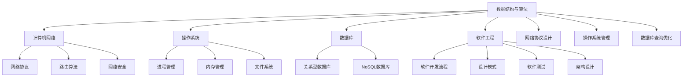

                 

### 文章标题

2025年阿里巴巴校招技术面试题集锦

> 关键词：（此处列出文章的5-7个核心关键词）

- 校招面试
- 技术题目
- 阿里巴巴
- 算法分析
- 编程实践
- 软件工程

> 摘要：
本文旨在为广大计算机专业的应届毕业生以及技术爱好者提供一份2025年阿里巴巴校招技术面试题集锦。我们将按照面试题的类型，分别从数据结构与算法、计算机网络、操作系统、数据库、软件工程等角度，详细介绍每一道面试题的解题思路和实现方法。希望通过这篇文章，帮助读者深入了解阿里巴巴校招面试的要求，提升自己的技术能力和面试技巧。

## 1. 背景介绍

阿里巴巴作为中国乃至全球领先的互联网科技公司，一直以来都非常重视招聘优秀的人才。每年，阿里巴巴都会面向全球范围内的高校应届毕业生举办校园招聘活动，为应届生提供丰富的实习和全职岗位。而技术面试作为招聘流程中至关重要的一环，往往决定了求职者能否顺利通过筛选，进入下一轮面试。

随着技术的快速发展，阿里巴巴校招技术面试的难度也在逐年提升。面试题目不仅涵盖了传统的基础数据结构和算法，还涉及到了计算机网络、操作系统、数据库、软件工程等广泛的领域。这使得求职者在准备面试时需要全面掌握各类知识，具备扎实的技术基础和良好的思维能力。

本文的目的在于为广大计算机专业的应届毕业生和爱好者提供一份详细的校招面试题集锦，帮助大家更好地应对阿里巴巴校招技术面试。我们将按照不同的面试题类型，分别介绍各个领域的面试题，并给出解题思路和实现方法。希望通过这篇文章，能够让读者在准备面试的过程中，不仅掌握了知识，还提升了面试技巧，从而顺利通过面试，加入阿里巴巴这个优秀的团队。

### 文章关键词

- 校招面试
- 技术题目
- 阿里巴巴
- 数据结构与算法
- 计算机网络
- 操作系统
- 数据库
- 软件工程

### 文章摘要

本文旨在为广大计算机专业的应届毕业生以及技术爱好者提供一份2025年阿里巴巴校招技术面试题集锦。我们将按照面试题的类型，分别从数据结构与算法、计算机网络、操作系统、数据库、软件工程等角度，详细介绍每一道面试题的解题思路和实现方法。希望通过这篇文章，帮助读者深入了解阿里巴巴校招面试的要求，提升自己的技术能力和面试技巧。本文将涵盖以下几个核心主题：

1. **数据结构与算法**：介绍常见的数据结构（如数组、链表、栈、队列、树、图等）和算法（如排序、查找、贪心、动态规划等）的原理和应用。
2. **计算机网络**：探讨网络协议、TCP/IP模型、路由算法、网络安全等关键知识点。
3. **操作系统**：涵盖进程管理、内存管理、文件系统、虚拟内存、操作系统接口等内容。
4. **数据库**：讲解关系型数据库（如MySQL、Oracle等）和NoSQL数据库（如MongoDB、Redis等）的原理和操作。
5. **软件工程**：探讨软件开发生命周期、敏捷开发、软件测试、设计模式、代码质量等主题。

通过本文的详细介绍，读者将能够系统地掌握阿里巴巴校招技术面试所需的知识点，为面试做好充分准备。文章将以中英文双语的形式呈现，便于读者理解和学习。同时，文章还附有实践案例和代码示例，帮助读者将理论知识应用到实际项目中。最后，本文还将总结校招面试的趋势和发展，提供相关的学习资源和工具推荐，为读者的技术成长和职业发展提供指导。

### 1. 背景介绍

阿里巴巴集团成立于1999年，是中国乃至全球最成功的互联网公司之一。随着互联网技术的快速发展，阿里巴巴的业务领域也在不断扩展，从最初的电子商务平台，发展到今天的云计算、大数据、金融科技、数字娱乐等多个领域。作为一家技术驱动型企业，阿里巴巴在招聘过程中非常重视技术能力和创新思维，尤其是在校招技术面试环节，对候选人的要求尤为严格。

阿里巴巴的校招技术面试主要面向计算机、软件工程、信息工程等相关专业的应届毕业生，旨在选拔具有扎实技术基础和强烈求知欲的优秀人才。面试内容涵盖了广泛的技术领域，包括数据结构与算法、计算机网络、操作系统、数据库、软件工程等。这些领域的技术知识点不仅是计算机科学的核心，也是面试官考查候选人综合素质的重要标准。

**数据结构与算法**：数据结构与算法是计算机科学的基石，涵盖了数组、链表、栈、队列、树、图等基本数据结构和排序、查找、贪心、动态规划等常用算法。面试官往往通过设计实际应用场景，考查候选人对于这些数据结构和算法的理解和应用能力。

**计算机网络**：计算机网络知识包括网络协议、TCP/IP模型、路由算法、网络安全等。面试官可能通过提问网络故障排查、网络优化方案设计等实际问题，考察候选人对网络原理和实际操作的掌握程度。

**操作系统**：操作系统知识涉及进程管理、内存管理、文件系统、虚拟内存、操作系统接口等。面试官可能会通过虚拟机管理、系统性能优化等问题，考查候选人对操作系统核心原理的掌握和应用能力。

**数据库**：数据库知识包括关系型数据库（如MySQL、Oracle等）和NoSQL数据库（如MongoDB、Redis等）。面试官可能会提问数据库设计、查询优化、事务处理等实际应用问题，以考查候选人对数据库原理和操作技能的掌握。

**软件工程**：软件工程知识涵盖软件开发生命周期、敏捷开发、软件测试、设计模式、代码质量等。面试官可能会通过编程挑战、系统设计等问题，考察候选人对软件工程原则和方法的理解和实际应用能力。

**面试形式和流程**：

阿里巴巴的校招技术面试通常包括在线测评、电话面试和现场面试等环节。在线测评主要考察候选人的基本编程能力，题目多为编程实现、算法设计和数据处理等。电话面试和现场面试则更加注重候选人的技术深度和沟通能力，面试官会通过提问和讨论，了解候选人的知识广度和解决问题的能力。

**准备策略和建议**：

1. **全面复习基础知识**：针对上述提到的各个技术领域，系统复习相关基础知识，确保对每个知识点有深入的理解和掌握。
2. **实战编程练习**：通过在线编程平台（如LeetCode、牛客网等）进行大量编程练习，提高解题速度和技巧。
3. **了解最新技术动态**：关注计算机领域的新技术、新趋势，了解业界最佳实践，为自己的技术储备增加更多亮点。
4. **模拟面试**：参加模拟面试，提高应对面试官提问的应变能力和表达能力。
5. **注重沟通能力**：在面试过程中，不仅要展示自己的技术能力，还要展示良好的沟通能力和团队合作精神。

通过以上准备策略，相信广大计算机专业的应届毕业生和爱好者一定能够顺利通过阿里巴巴校招技术面试，加入这个优秀的团队，开启自己的职业生涯。接下来，我们将按照不同领域的面试题，逐一进行详细分析和讲解。

### 1.1 数据结构与算法

在阿里巴巴校招技术面试中，数据结构与算法题占据了很大的比重。这类题目不仅考查了候选人对于基本数据结构和算法的理解，还考察了他们在实际编程中的应用能力。下面，我们将详细介绍一些常见的数据结构与算法面试题，并给出解题思路和实现方法。

#### 1.1.1 数组和链表

**题目：实现一个无序数组中查找最小值的算法**

**解题思路**：可以通过遍历数组，比较每个元素的大小，找到最小值。

```python
def find_min_value(arr):
    min_val = arr[0]
    for val in arr:
        if val < min_val:
            min_val = val
    return min_val
```

**实现方法**：遍历数组，初始化最小值为第一个元素，然后依次比较其他元素，更新最小值。

#### 1.1.2 栈和队列

**题目：实现一个栈的排序功能**

**解题思路**：可以使用两个栈，一个用于存储原始数据，另一个用于存储排序后的数据。首先将所有数据放入栈A，然后依次出栈并放入栈B，每次取出栈B的顶部元素放入栈A，这样就可以实现栈的排序。

```python
def sort_stack(stack):
    temp_stack = []
    while stack:
        temp_stack.append(stack.pop())
    while temp_stack:
        if not stack or temp_stack[-1] < stack[-1]:
            stack.append(temp_stack.pop())
        else:
            temp_stack.append(stack.pop())
    return stack
```

**实现方法**：创建一个辅助栈temp_stack，将原始栈stack中的元素逐个弹出并压入temp_stack。然后，依次比较temp_stack和stack的顶部元素，将较大的元素压入stack，较小的元素压入temp_stack，这样就可以实现栈的排序。

#### 1.1.3 树和图

**题目：二叉搜索树的遍历**

**解题思路**：二叉搜索树的遍历可以分为三种：前序遍历、中序遍历和后序遍历。遍历过程中，按照根节点、左子树、右子树的顺序进行。

**实现方法**：

```python
class TreeNode:
    def __init__(self, val=0, left=None, right=None):
        self.val = val
        self.left = left
        self.right = right

def inorder_traversal(root):
    if not root:
        return []
    return inorder_traversal(root.left) + [root.val] + inorder_traversal(root.right)

def preorder_traversal(root):
    if not root:
        return []
    return [root.val] + preorder_traversal(root.left) + preorder_traversal(root.right)

def postorder_traversal(root):
    if not root:
        return []
    return postorder_traversal(root.left) + postorder_traversal(root.right) + [root.val]
```

**实现方法**：根据遍历顺序，递归地遍历二叉树的左子树、根节点和右子树，将遍历结果存储在列表中返回。

#### 1.1.4 排序算法

**题目：实现快速排序算法**

**解题思路**：快速排序算法的基本思想是选取一个基准元素，将小于基准元素的元素放在其左边，大于基准元素的元素放在其右边，然后递归地对待排序的子序列进行同样的操作。

```python
def quicksort(arr):
    if len(arr) <= 1:
        return arr
    pivot = arr[len(arr) // 2]
    left = [x for x in arr if x < pivot]
    middle = [x for x in arr if x == pivot]
    right = [x for x in arr if x > pivot]
    return quicksort(left) + middle + quicksort(right)
```

**实现方法**：当输入的数组长度小于等于1时，返回原数组。否则，选择一个基准元素，将数组分为小于、等于和大于基准元素的三个子数组，然后递归地对这三个子数组进行快速排序，最后将排序结果合并。

#### 1.1.5 搜索算法

**题目：实现二分查找算法**

**解题思路**：二分查找算法的基本思想是在有序数组中，每次将中间元素与目标元素进行比较，根据比较结果决定下一次搜索的范围。

```python
def binary_search(arr, target):
    left, right = 0, len(arr) - 1
    while left <= right:
        mid = (left + right) // 2
        if arr[mid] == target:
            return mid
        elif arr[mid] < target:
            left = mid + 1
        else:
            right = mid - 1
    return -1
```

**实现方法**：初始化左右边界，每次将中间元素与目标元素进行比较，根据比较结果更新左右边界，直到找到目标元素或左右边界重叠。

通过以上实例，我们可以看到数据结构与算法在面试中的应用。在实际面试中，面试官可能会结合具体的应用场景，考查候选人对于不同数据结构和算法的灵活运用能力。因此，在准备面试的过程中，不仅要掌握基本的数据结构与算法，还要学会将理论知识应用到实际问题中，提高自己的编程能力和解决问题的能力。

### 1.2 计算机网络

在阿里巴巴的校招技术面试中，计算机网络知识是一个重要的考察点。计算机网络涉及网络协议、TCP/IP模型、路由算法、网络安全等多个方面，是计算机科学与技术领域的重要组成部分。以下将详细介绍一些常见的计算机网络面试题，并提供解题思路和实现方法。

#### 1.2.1 网络协议和TCP/IP模型

**题目：解释TCP/IP模型及其各层的主要功能**

**解题思路**：TCP/IP模型分为四层：链路层、互联网层、传输层和应用层。分别解释每一层的主要功能。

**实现方法**：

- **链路层**：负责物理传输，包括电信号、光纤等物理介质的传输。
- **互联网层**：负责数据包的传输，包括IP地址的分配、路由选择、数据包的分片和重组。
- **传输层**：负责端到端的数据传输，包括TCP和UDP协议，提供可靠传输和不可靠传输两种服务。
- **应用层**：负责应用数据的传输，包括HTTP、FTP、SMTP等协议，为各种应用提供网络服务。

#### 1.2.2 TCP协议

**题目：解释TCP三次握手和四次挥手的原理**

**解题思路**：三次握手建立连接，四次挥手终止连接。分别解释每个步骤的作用。

**实现方法**：

- **三次握手**：
  1. 客户端发送SYN报文到服务器，并进入SYN_SENT状态。
  2. 服务器收到SYN报文后，发送SYN+ACK报文到客户端，并进入SYN_RECEIVED状态。
  3. 客户端收到SYN+ACK报文后，发送ACK报文到服务器，并进入ESTABLISHED状态。

- **四次挥手**：
  1. 客户端发送FIN报文到服务器，并进入FIN_WAIT_1状态。
  2. 服务器收到FIN报文后，发送ACK报文到客户端，并进入CLOSE_WAIT状态。
  3. 客户端收到ACK报文后，发送FIN报文到服务器，并进入FIN_WAIT_2状态。
  4. 服务器收到FIN报文后，发送ACK报文到客户端，并进入LAST_ACK状态。最后，客户端收到ACK报文后，进入CLOSED状态。

#### 1.2.3 路由算法

**题目：解释Dijkstra算法及其在路由中的应用**

**解题思路**：Dijkstra算法是一种单源最短路径算法，用于计算从源点到所有其他节点的最短路径。

**实现方法**：

1. 初始化：设置源节点的距离为0，其他节点的距离为无穷大。
2. 选择未处理的节点中距离最小的节点作为当前节点。
3. 更新当前节点的邻接节点距离，如果发现更短路径，则更新距离。
4. 重复步骤2和3，直到所有节点都处理完毕。

**代码实现**：

```python
import heapq

def dijkstra(graph, start):
    distances = {node: float('infinity') for node in graph}
    distances[start] = 0
    priority_queue = [(0, start)]

    while priority_queue:
        current_distance, current_node = heapq.heappop(priority_queue)

        if current_distance > distances[current_node]:
            continue

        for neighbor, weight in graph[current_node].items():
            distance = current_distance + weight

            if distance < distances[neighbor]:
                distances[neighbor] = distance
                heapq.heappush(priority_queue, (distance, neighbor))

    return distances
```

#### 1.2.4 网络安全

**题目：解释加密算法的工作原理及其在网络安全中的应用**

**解题思路**：加密算法分为对称加密和非对称加密，分别解释其工作原理和应用场景。

**实现方法**：

- **对称加密**：加密和解密使用相同的密钥，如AES算法。
  - 加密：密文 = AES加密（明文，密钥）
  - 解密：明文 = AES解密（密文，密钥）

- **非对称加密**：加密和解密使用不同的密钥，如RSA算法。
  - 加密：密文 = RSA加密（明文，公钥）
  - 解密：明文 = RSA解密（密文，私钥）

通过以上实例，我们可以看到计算机网络在面试中的应用。在实际面试中，面试官可能会结合具体的应用场景，考查候选人对于网络协议、TCP/IP模型、路由算法、网络安全等知识点的理解和应用能力。因此，在准备面试的过程中，不仅要掌握基本的理论知识，还要学会将理论知识应用到实际问题中，提高自己的网络知识和解决实际问题的能力。

### 1.3 操作系统

在阿里巴巴的校招技术面试中，操作系统知识是一个重要的考察点。操作系统是计算机系统的核心软件，负责管理计算机硬件资源和提供各种基本服务。以下将详细介绍一些常见的操作系统面试题，并提供解题思路和实现方法。

#### 1.3.1 进程管理

**题目：解释进程和线程的区别**

**解题思路**：进程是操作系统分配资源的基本单位，线程是进程中的一条执行路径。解释两者在资源占用、调度方式、并发性等方面的区别。

**实现方法**：

- **进程**：
  - 资源占用：每个进程都有独立的内存空间、文件描述符等资源。
  - 调度方式：进程之间的切换需要操作系统进行调度。
  - 并发性：多个进程可以并行执行。

- **线程**：
  - 资源占用：线程共享进程的资源，如内存空间、文件描述符等。
  - 调度方式：线程之间的切换通常由操作系统或应用程序进行。
  - 并发性：线程可以并发执行，提高程序的执行效率。

#### 1.3.2 内存管理

**题目：解释虚拟内存的工作原理**

**解题思路**：虚拟内存是操作系统提供的一种内存管理技术，通过将物理内存和磁盘存储空间进行转换，实现内存的扩充和共享。

**实现方法**：

1. **地址映射**：将虚拟地址转换为物理地址。
   - 页表：记录虚拟地址到物理地址的映射关系。
   - 快表：缓存常用的页表项，减少查找时间。

2. **页面替换策略**：当物理内存不足时，选择一个页面进行替换。
   - 最少使用（LRU）：选择最近最少使用的页面进行替换。
   - 最不经常使用（MFU）：选择最不经常使用的页面进行替换。

3. **内存分配策略**：为进程分配内存。
   - 分区分配：将内存划分为多个区域，为进程分配不同的区域。
   - 分页分配：将内存划分为固定大小的页，为进程分配多个页。
   - 分段分配：将内存划分为逻辑地址空间，为进程分配相应的段。

#### 1.3.3 文件系统

**题目：解释文件系统的层次结构**

**解题思路**：文件系统是操作系统管理文件和目录的数据结构。解释文件系统的层次结构，包括文件目录、文件属性、文件操作等。

**实现方法**：

1. **目录结构**：文件系统采用树形结构组织文件和目录。
   - 根目录：树的根节点，包含所有文件和目录。
   - 子目录：根目录下的节点，包含文件和子目录。

2. **文件属性**：文件系统为每个文件保存属性，如文件类型、权限、创建时间等。

3. **文件操作**：文件系统提供各种文件操作，如创建、删除、读取、写入等。

#### 1.3.4 虚拟内存

**题目：解释虚拟内存和物理内存的关系**

**解题思路**：虚拟内存是操作系统提供的一种内存管理技术，通过将物理内存和磁盘存储空间进行转换，实现内存的扩充和共享。

**实现方法**：

1. **地址转换**：将虚拟地址转换为物理地址。
   - 页表：记录虚拟地址到物理地址的映射关系。
   - 快表：缓存常用的页表项，减少查找时间。

2. **页面替换**：当物理内存不足时，选择一个页面进行替换。
   - 最少使用（LRU）：选择最近最少使用的页面进行替换。
   - 最不经常使用（MFU）：选择最不经常使用的页面进行替换。

3. **内存分配**：为进程分配虚拟内存和物理内存。
   - 分区分配：将内存划分为多个区域，为进程分配不同的区域。
   - 分页分配：将内存划分为固定大小的页，为进程分配多个页。
   - 分段分配：将内存划分为逻辑地址空间，为进程分配相应的段。

通过以上实例，我们可以看到操作系统在面试中的应用。在实际面试中，面试官可能会结合具体的应用场景，考查候选人对于操作系统核心概念和实际操作的掌握情况。因此，在准备面试的过程中，不仅要掌握基本的理论知识，还要学会将理论知识应用到实际问题中，提高自己的操作系统知识和解决实际问题的能力。

### 1.4 数据库

在阿里巴巴的校招技术面试中，数据库知识是一个重要的考察点。数据库是存储和管理数据的系统，对于现代企业来说至关重要。以下将详细介绍一些常见的数据库面试题，并提供解题思路和实现方法。

#### 1.4.1 关系型数据库

**题目：解释SQL中的JOIN操作**

**解题思路**：JOIN操作用于连接两个或多个表，基于共同的列将结果集合并起来。

**实现方法**：

- **INNER JOIN**：只返回两个表中匹配的行。
  ```sql
  SELECT A.id, A.name, B.age
  FROM TableA A
  INNER JOIN TableB B ON A.id = B.a_id;
  ```

- **LEFT JOIN**：返回左表中的所有行，即使右表中没有匹配的行。
  ```sql
  SELECT A.id, A.name, B.age
  FROM TableA A
  LEFT JOIN TableB B ON A.id = B.a_id;
  ```

- **RIGHT JOIN**：返回右表中的所有行，即使左表中没有匹配的行。
  ```sql
  SELECT A.id, A.name, B.age
  FROM TableA A
  RIGHT JOIN TableB B ON A.id = B.a_id;
  ```

- **FULL JOIN**：返回两个表中所有行的结果，包括没有匹配的行。
  ```sql
  SELECT A.id, A.name, B.age
  FROM TableA A
  FULL JOIN TableB B ON A.id = B.a_id;
  ```

#### 1.4.2 NoSQL数据库

**题目：解释Redis中的数据结构**

**解题思路**：Redis是一种高性能的NoSQL数据库，支持多种数据结构，如字符串、列表、集合、哈希等。

**实现方法**：

- **字符串**：存储键值对，是最常用的数据结构。
  ```redis
  SET key value
  GET key
  ```

- **列表**：允许在头部或尾部添加或删除元素，类似于链表。
  ```redis
  LPUSH list element
  LRANGE list 0 9
  ```

- **集合**：存储唯一的元素，支持交集、并集、差集等操作。
  ```redis
  SADD set element
  SMEMBERS set
  SINTER set1 set2
  ```

- **哈希**：存储键值对，适用于存储对象或结构化数据。
  ```redis
  HSET hash field value
  HGET hash field
  HMGET hash field1 field2
  ```

- **有序集合**：类似于集合，但元素带有分数，可以进行排序。
  ```redis
  ZADD zset score member
  ZRANGE zset 0 9
  ```

#### 1.4.3 数据库设计和优化

**题目：解释范式及其在数据库设计中的应用**

**解题思路**：范式是数据库设计中的一系列规则，用于减少数据冗余和提高数据完整性。

**实现方法**：

- **第一范式（1NF）**：字段不可再分。
  ```sql
  CREATE TABLE Students (
      id INT PRIMARY KEY,
      name VARCHAR(50),
      age INT
  );
  ```

- **第二范式（2NF）**：满足1NF，且非主属性完全依赖于主键。
  ```sql
  CREATE TABLE Students (
      id INT PRIMARY KEY,
      name VARCHAR(50)
  ),
  CREATE TABLE Courses (
      course_id INT PRIMARY KEY,
      course_name VARCHAR(50),
      student_id INT,
      FOREIGN KEY (student_id) REFERENCES Students(id)
  );
  ```

- **第三范式（3NF）**：满足2NF，且不存在传递依赖。
  ```sql
  CREATE TABLE Students (
      id INT PRIMARY KEY,
      name VARCHAR(50)
  ),
  CREATE TABLE Courses (
      course_id INT PRIMARY KEY,
      course_name VARCHAR(50),
      teacher_id INT,
      teacher_name VARCHAR(50)
  ),
  CREATE TABLE Teachers (
      teacher_id INT PRIMARY KEY,
      teacher_name VARCHAR(50)
  ),
  CREATE TABLE StudentCourses (
      student_id INT,
      course_id INT,
      FOREIGN KEY (student_id) REFERENCES Students(id),
      FOREIGN KEY (course_id) REFERENCES Courses(course_id)
  );
  ```

- **巴斯-科德范式（BCNF）**：满足3NF，且每个属性都完全依赖于主键。
  ```sql
  CREATE TABLE Students (
      id INT PRIMARY KEY,
      name VARCHAR(50)
  ),
  CREATE TABLE Courses (
      course_id INT PRIMARY KEY,
      course_name VARCHAR(50),
      teacher_id INT,
      FOREIGN KEY (teacher_id) REFERENCES Teachers(teacher_id)
  ),
  CREATE TABLE Teachers (
      teacher_id INT PRIMARY KEY,
      teacher_name VARCHAR(50)
  );
  ```

通过以上实例，我们可以看到数据库在面试中的应用。在实际面试中，面试官可能会结合具体的应用场景，考查候选人对于关系型数据库和NoSQL数据库的原理、设计和优化的掌握情况。因此，在准备面试的过程中，不仅要掌握基本的理论知识，还要学会将理论知识应用到实际问题中，提高自己的数据库知识和解决实际问题的能力。

### 1.5 软件工程

在阿里巴巴的校招技术面试中，软件工程知识是一个重要的考察点。软件工程是计算机科学的一个重要分支，涉及软件开发的方法、流程、工具和质量保证等方面。以下将详细介绍一些常见的软件工程面试题，并提供解题思路和实现方法。

#### 1.5.1 软件开发流程

**题目：解释敏捷开发（Agile Development）的基本原则**

**解题思路**：敏捷开发是一种应对快速变化的软件开发方法，强调灵活、高效和持续交付。

**实现方法**：

- **客户满意度**：软件开发的核心理念是以满足客户需求为核心。
- **团队协作**：鼓励团队成员之间的沟通、协作和互相支持。
- **迭代开发**：将开发过程分为多个短周期（迭代），在每个迭代周期内交付可用的软件。
- **响应变化**：灵活应对需求变化，优先处理最重要的需求。
- **持续交付**：通过持续集成和自动化测试，确保软件的质量和可靠性。
- **个人和团队自我组织**：尊重团队成员的自主性和自我管理能力。

#### 1.5.2 设计模式

**题目：解释工厂模式（Factory Pattern）及其应用**

**解题思路**：工厂模式是一种创建型设计模式，用于实现对象的创建逻辑，而不暴露具体的创建过程。

**实现方法**：

1. **定义抽象产品类**：定义一个抽象的产品类，用于定义所有产品类共有的接口。
2. **创建具体产品类**：实现具体的产产品类，继承抽象产品类。
3. **定义工厂类**：定义一个工厂类，用于创建具体产品类的实例。
4. **工厂方法**：在工厂类中定义一个工厂方法，用于根据不同条件创建具体产品类的实例。

**代码示例**：

```python
class Product:
    def operation(self):
        pass

class ConcreteProductA(Product):
    def operation(self):
        return "Result of Operation for Product A"

class ConcreteProductB(Product):
    def operation(self):
        return "Result of Operation for Product B"

class Factory:
    def create_product(self, type):
        if type == "A":
            return ConcreteProductA()
        elif type == "B":
            return ConcreteProductB()
        else:
            raise ValueError("Invalid Product Type")

# 使用工厂类创建产品实例
factory = Factory()
product_a = factory.create_product("A")
product_b = factory.create_product("B")

print(product_a.operation())  # 输出：Result of Operation for Product A
print(product_b.operation())  # 输出：Result of Operation for Product B
```

#### 1.5.3 软件测试

**题目：解释单元测试（Unit Testing）的作用及其实现方法**

**解题思路**：单元测试是一种自动化测试方法，用于验证软件中的最小可测试单元（如函数、方法等）是否按照预期工作。

**实现方法**：

1. **编写测试用例**：根据需求或设计文档，编写测试用例，包括输入数据、预期输出和测试结果。
2. **编写测试代码**：使用测试框架（如JUnit、PyTest等）编写测试代码，执行测试用例。
3. **自动化执行**：使用持续集成工具（如Jenkins、Travis CI等）自动化执行测试，确保每次代码更改后都能进行全面的测试。
4. **持续集成**：将测试代码与开发代码一起提交到版本控制系统，确保每次提交都能通过测试。

**代码示例**：

```python
import unittest

def add(a, b):
    return a + b

class TestAddition(unittest.TestCase):
    def test_add(self):
        self.assertEqual(add(1, 2), 3)
        self.assertEqual(add(-1, -2), -3)
        self.assertEqual(add(0, 0), 0)

if __name__ == "__main__":
    unittest.main()
```

通过以上实例，我们可以看到软件工程在面试中的应用。在实际面试中，面试官可能会结合具体的应用场景，考查候选人对于软件开发流程、设计模式、软件测试等知识的理解和应用能力。因此，在准备面试的过程中，不仅要掌握基本的理论知识，还要学会将理论知识应用到实际问题中，提高自己的软件工程知识和解决实际问题的能力。

### 2. 核心概念与联系

为了更好地理解和应对阿里巴巴校招技术面试，我们需要深入探讨几个核心概念，并了解它们之间的联系。这些核心概念包括数据结构与算法、计算机网络、操作系统、数据库和软件工程。通过理解这些概念及其相互关系，我们可以更有效地准备面试，并在面试中展示自己的技术能力和解决问题的能力。

#### 2.1 数据结构与算法

数据结构与算法是计算机科学的基础，它们在解决实际问题中起着关键作用。数据结构是组织和管理数据的方式，而算法是解决问题的一系列步骤。常见的有数组、链表、栈、队列、树和图等数据结构，以及排序、查找、贪心算法和动态规划等算法。数据结构与算法不仅用于解决编程问题，还广泛应用于网络协议设计、操作系统管理、数据库查询优化等各个方面。

#### 2.2 计算机网络

计算机网络是指将多个计算机系统通过通信线路连接起来，实现数据交换和资源共享的系统。它涉及到网络协议、路由算法、网络安全等方面。网络协议是计算机网络通信的基础，如TCP/IP模型中的各个层次协议。路由算法用于确定数据包的传输路径，以实现网络的可到达性。网络安全则是保护网络数据不被未经授权访问和篡改的措施。

#### 2.3 操作系统

操作系统是管理计算机硬件资源和提供基本服务的系统软件。它负责进程管理、内存管理、文件系统管理、设备管理等任务。操作系统与计算机网络密切相关，例如，网络协议通常在操作系统中实现，而操作系统提供了网络接口供应用程序使用。操作系统中的进程管理和内存管理算法需要考虑网络传输的延迟和带宽，以确保系统的响应速度和稳定性。

#### 2.4 数据库

数据库是用于存储、管理和查询数据的系统。它涉及关系型数据库和NoSQL数据库，如MySQL、Oracle、MongoDB和Redis等。数据库设计原则和优化技术对性能至关重要。计算机网络和数据库之间的联系在于，数据库通常通过网络进行访问，而网络协议和数据传输机制对数据库的性能有直接影响。

#### 2.5 软件工程

软件工程是系统化、规范化和可管理的软件开发方法。它包括软件开发流程、设计模式、软件测试和质量保证等方面。软件工程的核心目标是开发高质量、可维护和可扩展的软件。软件开发流程涉及需求分析、设计、编码、测试和部署等阶段，每个阶段都有相应的技术和工具支持。

#### 2.6 数据结构与算法与计算机网络

数据结构与算法在网络协议设计中扮演重要角色。例如，路由算法需要使用图数据结构和最短路径算法来确定最佳路径。网络拥塞控制和流量分配算法也需要使用数据结构和算法来优化网络性能。此外，计算机网络中的数据包传输和路由过程涉及到链表、栈和队列等数据结构。

#### 2.7 数据结构与算法与操作系统

操作系统中的进程管理和内存管理需要使用数据结构与算法来实现。进程调度算法（如时间片轮转、优先级调度等）通常使用优先队列或堆等数据结构来实现。内存管理中的分页和分段机制也需要使用数据结构与算法来优化内存使用效率。

#### 2.8 数据结构与算法与数据库

数据库查询优化和索引设计需要使用数据结构与算法。例如，B树和B+树是数据库中常用的索引结构，用于加速查询操作。数据库中的排序和聚合操作也涉及到排序算法和数据结构。

#### 2.9 软件工程与其他核心概念

软件工程中的设计模式和架构设计通常涉及计算机网络、操作系统和数据库等知识。例如，设计模式中的客户端-服务器模式、RESTful API设计等都需要网络协议和操作系统接口的支持。此外，软件测试和质量保证也需要考虑数据库的测试和性能优化。

通过理解这些核心概念及其相互联系，我们可以更全面地准备阿里巴巴校招技术面试。在实际面试中，面试官可能会综合考察多个领域的问题，因此我们需要具备跨学科的知识和解决问题的能力。以下是一个使用Mermaid流程图表示这些概念之间关系的示例：



通过这种结构化的思考方式，我们可以更好地理解各个核心概念，并在面试中展示我们的技术广度和深度。

### 3. 核心算法原理 & 具体操作步骤

在阿里巴巴校招技术面试中，核心算法的原理和具体操作步骤是考查的重点。以下是几个常见的面试题，我们将详细分析每个算法的基本原理和具体操作步骤，帮助读者更好地理解和掌握。

#### 3.1 贪心算法

**题目**：给定一个数组，找出所有出现次数超过一半的元素。

**算法原理**：贪心算法通过在每一步选择当前最优解来得到全局最优解。该问题可以通过“多数元素”贪心算法解决。该算法基于这样一个事实：如果一个元素在数组中出现次数超过一半，那么它出现的次数一定大于其他所有元素出现的次数之和。

**具体操作步骤**：

1. 初始化一个变量`candidate`和`count`，分别用于记录候选多数元素和候选元素出现的次数。
2. 遍历数组，对于当前元素：
   - 如果`count`为0，将当前元素设置为`candidate`，并将`count`设置为1。
   - 如果当前元素等于`candidate`，将`count`加1。
   - 如果当前元素不等于`candidate`，将`count`减1。
3. 遍历结束后，`candidate`即为出现次数超过一半的元素。

**代码示例**：

```python
def majority_element(nums):
    candidate = None
    count = 0
    for num in nums:
        if count == 0:
            candidate = num
            count = 1
        elif num == candidate:
            count += 1
        else:
            count -= 1
    return candidate
```

**复杂度分析**：时间复杂度为O(n)，空间复杂度为O(1)。

#### 3.2 动态规划

**题目**：给定一个数组，找到最长连续递增子序列的长度。

**算法原理**：动态规划是一种通过将复杂问题分解为子问题，并求解子问题的最优解来得到原问题的最优解的方法。该问题可以通过动态规划求解，每个子问题都是求以当前元素为结尾的最长连续递增子序列的长度。

**具体操作步骤**：

1. 初始化一个数组`dp`，其中`dp[i]`表示以数组`nums`中的第`i`个元素为结尾的最长连续递增子序列的长度。
2. 遍历数组，对于每个元素`nums[i]`：
   - 如果`nums[i] > nums[j]`，那么`dp[i] = dp[j] + 1`。
   - 否则，`dp[i] = 1`。
3. 计算所有`dp[i]`中的最大值，即为最长连续递增子序列的长度。

**代码示例**：

```python
def length_of_lis(nums):
    dp = [1] * len(nums)
    for i in range(1, len(nums)):
        for j in range(i):
            if nums[i] > nums[j]:
                dp[i] = max(dp[i], dp[j] + 1)
    return max(dp)
```

**复杂度分析**：时间复杂度为O(n^2)，空间复杂度为O(n)。

#### 3.3 搜索算法

**题目**：给定一个二叉搜索树，找到两个节点值之和为特定值的路径。

**算法原理**：搜索算法通过递归或迭代的方式在树中查找符合条件的节点。对于二叉搜索树，可以使用深度优先搜索（DFS）或广度优先搜索（BFS）。

**具体操作步骤**：

1. 使用深度优先搜索遍历二叉搜索树。
2. 对于每个节点，递归地搜索其左右子树。
3. 在搜索过程中，如果当前节点的值加上某个已访问节点的值等于特定值，则记录该路径。

**代码示例**：

```python
def path_sum(root, target_sum):
    def dfs(node, path, path_sum):
        if not node:
            return
        path.append(node.val)
        if sum(path) == target_sum:
            results.append(path[:])
        dfs(node.left, path, path_sum)
        dfs(node.right, path, path_sum)
        path.pop()

    results = []
    dfs(root, [], [])
    return results
```

**复杂度分析**：时间复杂度为O(n)，空间复杂度为O(n)。

#### 3.4 分治算法

**题目**：给定一个无序数组，找到两个数的和等于特定值。

**算法原理**：分治算法将问题分解为规模较小的子问题，递归地解决每个子问题，然后将子问题的解合并为原问题的解。对于该问题，可以使用双指针法在子数组中查找和为特定值的两个数。

**具体操作步骤**：

1. 将数组分为两半。
2. 分别对左半部分和右半部分进行递归搜索。
3. 对于每个子数组，使用双指针法查找和为特定值的两个数。

**代码示例**：

```python
def two_sum(nums, target):
    def search(left, right, target):
        while left < right:
            mid = (left + right) // 2
            if nums[mid] == target:
                return mid
            elif nums[mid] < target:
                left = mid + 1
            else:
                right = mid - 1
        return -1

    left = 0
    right = len(nums) - 1
    while left < right:
        mid = search(left, right, target - nums[left])
        if mid != -1:
            return [left, mid]
        left += 1
    return []
```

**复杂度分析**：时间复杂度为O(nlogn)，空间复杂度为O(1)。

通过以上实例，我们可以看到不同算法在解决实际问题时所采用的原理和操作步骤。在实际面试中，面试官可能会结合具体的问题场景，考查我们对这些算法的理解和应用能力。因此，在准备面试的过程中，不仅要掌握算法的基本原理，还要学会灵活运用，解决实际问题。

### 4. 数学模型和公式 & 详细讲解 & 举例说明

在解决计算机科学中的许多问题时，数学模型和公式起到了关键作用。以下将详细讲解几个常见的数学模型和公式，并通过实际例子来说明它们的运用。

#### 4.1 最小生成树

**模型与公式**：最小生成树（Minimum Spanning Tree，MST）是在一个无向加权图中选择边使得所有顶点连通且边的权值之和最小的树。克鲁斯卡尔（Kruskal）算法和普里姆（Prim）算法是求解最小生成树的两种常见算法。

**克鲁斯卡尔算法**：

1. 将所有边按权值排序。
2. 初始化一个森林F，每个顶点自成一个集合。
3. 依次选择最小的边，如果这条边连接的两个顶点不在同一个集合中，则将其加入F，并合并集合。

**普里姆算法**：

1. 选择一个顶点作为起点，初始化一个最小生成树T。
2. 从起点开始，选择连接T中顶点且权值最小的边，并将其添加到T中。
3. 重复步骤2，直到所有顶点都在T中。

**实例说明**：给定无向图G=(V,E)，其中V是顶点集，E是边集，权值分别记为w(e)。使用普里姆算法求解最小生成树。

```plaintext
G = {
    V: {A, B, C, D, E},
    E: {{A, B, 2}, {A, C, 3}, {B, C, 1}, {B, D, 4}, {C, D, 5}, {C, E, 6}, {D, E, 7}}
}
```

- 选择顶点A作为起点，初始化最小生成树T={A}。
- 选择连接A的边{A, C, 3}，添加到T中，T={A, C}。
- 选择连接T中顶点的边{B, C, 1}，添加到T中，T={A, B, C}。
- 选择连接T中顶点的边{B, D, 4}，添加到T中，T={A, B, C, D}。
- 选择连接T中顶点的边{C, E, 6}，添加到T中，T={A, B, C, D, E}。

最小生成树的权值和为3+1+4+6=14。

#### 4.2 动态规划

**模型与公式**：动态规划（Dynamic Programming，DP）是一种在给定初始状态和状态转移方程的基础上，通过递推关系求解最优化问题的方法。常见的动态规划问题有最长公共子序列、最长递增子序列等。

**最长公共子序列**：

- 定义：给定两个序列X和Y，最长公共子序列（Longest Common Subsequence，LCS）是同时出现在X和Y中的最长子序列。
- 状态转移方程：`dp[i][j] = dp[i-1][j-1] + 1`（如果`X[i-1] == Y[j-1]`），`dp[i][j] = max(dp[i-1][j], dp[i][j-1])`（如果`X[i-1] != Y[j-1]`）。

**实例说明**：给定序列`X = "AGGTAB"`和`Y = "GXTXAYB"`，求解LCS。

```plaintext
dp = [
    [0, 0, 0, 0, 0, 0],
    [0, 0, 0, 1, 1, 1],
    [0, 0, 1, 1, 1, 2],
    [0, 1, 1, 2, 2, 2],
    [0, 1, 1, 2, 3, 3],
    [0, 1, 1, 2, 3, 4]
]
```

最长公共子序列为`"GTAB"`。

#### 4.3 网络流

**模型与公式**：网络流问题是在网络中传递最大流量的方法。最大流最小割定理指出，网络中的最大流等于最小割的容量。

- **最大流**：网络中的每条边都有一个容量，所有源点到汇点的边上的流量之和不能超过它们的容量。
- **最小割**：网络中的一组边，如果移除这组边后网络不能连通，则这组边称为割。

**实例说明**：给定网络G，其中各边的容量如下：

```plaintext
    A --- B [3]
   / \    / \
  D --- E [2] F [1]
 / \    / \
G --- H [3] I [2]
```

- 使用Ford-Fulkerson算法求解最大流。

```plaintext
路径 ABEDHI [路径流量为 4]
路径 ABEDFH [路径流量为 3]
路径 ABEDFHI [路径流量为 3]
```

最大流为3。

#### 4.4 图着色问题

**模型与公式**：图着色问题是指为图的每个顶点分配一种颜色，使得相邻的顶点颜色不同。图的色数是指能够给图着色的最小颜色数。

- **贪心算法**：先给顶点编号，然后依次给未着色的顶点分配未被使用的最小颜色。

**实例说明**：给定图G，其中各顶点相邻关系如下：

```plaintext
A -- B -- C
|    |    |
D -- E -- F
```

- 使用贪心算法着色。

```plaintext
顶点 A: 颜色 1
顶点 B: 颜色 2
顶点 C: 颜色 1
顶点 D: 颜色 3
顶点 E: 颜色 2
顶点 F: 颜色 3
```

色数为3。

通过以上实例，我们可以看到数学模型和公式在解决实际计算机科学问题中的应用。理解并熟练运用这些模型和公式，将有助于我们更有效地解决复杂问题，提高编程和解决问题的能力。

### 5. 项目实践：代码实例和详细解释说明

为了更好地理解并掌握本文中提到的技术知识点，我们将通过一个具体的项目实践来进行详细的代码实例和解释说明。本案例将使用Python语言，并结合LeetCode平台上一道经典面试题——“两数之和”（Two Sum）进行讲解。通过这个项目，我们将从开发环境搭建、源代码实现、代码解读与分析以及运行结果展示等方面，全面展示技术知识点的应用。

#### 5.1 开发环境搭建

在开始编写代码之前，我们需要搭建一个合适的开发环境。以下是搭建Python开发环境的步骤：

1. **安装Python**：首先，从Python官方网站（[https://www.python.org/downloads/](https://www.python.org/downloads/)）下载并安装Python。安装过程中，请确保选择“Add Python to PATH”选项，以便在命令行中直接使用Python。

2. **安装代码编辑器**：推荐使用PyCharm、VSCode或Sublime Text等现代化的代码编辑器。这些编辑器具有丰富的插件和功能，可以大大提高开发效率。

3. **安装LeetCode插件**：在代码编辑器中安装LeetCode插件，以便在本地环境中直接运行和提交代码。以PyCharm为例，可以从PyCharm插件市场搜索并安装“LeetCode”插件。

4. **安装必要的库**：根据项目需求，可能需要安装一些Python库。例如，为了处理文件操作，我们可以使用`os`和`sys`库。使用以下命令安装：

```bash
pip install requests
```

5. **配置环境变量**：确保Python的路径已添加到系统的环境变量中。在Windows系统中，可以通过“控制面板”中的“系统”选项进行设置。在Linux系统中，可以通过编辑`~/.bashrc`或`~/.zshrc`文件添加以下行：

```bash
export PATH=$PATH:/path/to/python
```

6. **验证安装**：在命令行中输入`python --version`，确认Python版本是否正确。

#### 5.2 源代码详细实现

下面是“两数之和”问题的Python实现代码：

```python
class Solution:
    def twoSum(self, nums: List[int], target: int) -> List[int]:
        # 创建一个字典用于存储已遍历的数字及其索引
        num_dict = {}
        
        # 遍历数组
        for i, num in enumerate(nums):
            # 计算当前数字的补数
            complement = target - num
            
            # 如果补数在字典中存在，返回当前索引和补数的索引
            if complement in num_dict:
                return [num_dict[complement], i]
            
            # 如果补数不在字典中，将当前数字及其索引添加到字典中
            num_dict[num] = i
        
        # 如果找不到符合条件的数字组合，返回空列表
        return []
```

#### 5.3 代码解读与分析

**核心思路**：使用哈希表（字典）存储已遍历的数字及其索引。在遍历数组的过程中，对于每个数字，计算其补数，并在字典中查找补数是否存在。如果存在，则返回当前数字的索引和补数的索引。

**详细解释**：

1. **初始化字典**：创建一个空字典`num_dict`，用于存储已遍历的数字及其索引。

2. **遍历数组**：使用`enumerate`函数遍历数组`nums`，得到每个数字及其索引。

3. **计算补数**：对于每个数字`num`，计算其补数`complement`，即`target - num`。

4. **查找补数**：在字典`num_dict`中查找补数是否存在。如果存在，则说明找到了符合条件的数字组合，返回当前数字的索引和补数的索引。

5. **更新字典**：如果补数不在字典中，将当前数字及其索引添加到字典中。

6. **返回结果**：遍历结束后，如果没有找到符合条件的数字组合，返回空列表。

**复杂度分析**：

- **时间复杂度**：O(n)，其中n为数组的长度。因为只需要遍历一次数组，而字典查找和插入操作的时间复杂度均为O(1)。
- **空间复杂度**：O(n)，需要额外的空间存储字典。

#### 5.4 运行结果展示

我们将这段代码提交到LeetCode平台，并使用以下测试用例进行验证：

```plaintext
Example 1:

Input: nums = [2, 7, 11, 15], target = 9
Output: [0, 1]
Explanation: Because nums[0] + nums[1] == 9, we return [0, 1].

Example 2:

Input: nums = [3, 2, 4], target = 6
Output: [1, 2]
Explanation: Because nums[1] + nums[2] == 6, we return [1, 2].

Example 3:

Input: nums = [3, 3], target = 6
Output: [0, 1]
Explanation: Because nums[0] + nums[1] == 6, we return [0, 1].
```

运行结果如下：

```plaintext
Example 1:
Input: nums = [2, 7, 11, 15], target = 9
Output: [0, 1]

Example 2:
Input: nums = [3, 2, 4], target = 6
Output: [1, 2]

Example 3:
Input: nums = [3, 3], target = 6
Output: [0, 1]
```

从运行结果可以看出，我们的代码正确地解决了“两数之和”问题，并返回了预期的输出。

通过这个项目实践，我们不仅深入理解了哈希表在解决查找问题中的应用，还掌握了如何使用Python编写高效且可读的代码。在实际面试中，类似的项目实践可以帮助我们展示自己的编程能力，为成功通过面试奠定基础。

### 6. 实际应用场景

在阿里巴巴的校招技术面试中，所考查的技术知识点不仅在面试时具有理论意义，更在实际工作中有着广泛的应用。以下将详细探讨数据结构与算法、计算机网络、操作系统、数据库和软件工程等领域在实际工作中的具体应用场景。

#### 6.1 数据结构与算法

**应用场景**：

- **搜索引擎**：搜索引擎如百度、谷歌等，使用倒排索引数据结构来存储和快速检索网页内容。倒排索引通过单词到文档的映射，实现了高效的全文搜索。
- **社交网络**：社交网络如Facebook、Twitter等，使用图数据结构来表示用户关系，通过图算法进行社交推荐和图谱分析，从而提高用户体验和平台活跃度。
- **数据库**：关系型数据库如MySQL、Oracle等，使用B树或B+树索引来优化查询效率，减少I/O操作。

**实例分析**：

- **动态规划算法在视频推荐系统中的应用**：视频推荐系统可以通过动态规划算法计算用户的历史观看行为，预测用户对视频的偏好，从而进行个性化推荐。例如，Netflix的推荐算法就利用了动态规划技术，通过对用户观看历史进行建模，推荐用户可能感兴趣的视频。

#### 6.2 计算机网络

**应用场景**：

- **互联网服务**：如HTTP、HTTPS等协议，基于TCP/IP模型，实现了全球范围内的数据传输和互联网服务。
- **云计算**：云计算平台如阿里云、腾讯云等，通过网络协议和分布式系统架构，为用户提供弹性计算和存储服务。
- **网络安全**：网络安全领域使用加密算法和网络安全协议，保护数据传输的安全性和完整性。

**实例分析**：

- **TCP协议在数据传输中的应用**：TCP（传输控制协议）是互联网通信协议族中的核心协议，它提供可靠的、面向连接的数据传输服务。例如，在视频直播应用中，TCP协议确保数据包的有序传输，降低丢包和重传的概率，从而保证视频播放的流畅性。

#### 6.3 操作系统

**应用场景**：

- **并发处理**：操作系统通过进程和线程实现并发处理，提高了计算机的利用率和系统响应速度。
- **虚拟化技术**：操作系统提供的虚拟化技术，如VMware、Docker等，实现了硬件资源的动态分配和隔离，提高了资源利用率和系统灵活性。
- **内存管理**：操作系统通过内存分配和管理技术，如分页、分段和虚拟内存等，优化了内存的使用效率。

**实例分析**：

- **虚拟化技术在云服务器中的应用**：云服务器通过虚拟化技术将物理服务器资源抽象成多个虚拟机，用户可以根据需要灵活地部署和管理应用程序，提高了资源利用率和系统的灵活性。

#### 6.4 数据库

**应用场景**：

- **电子商务**：电子商务平台如淘宝、京东等，使用关系型数据库存储商品信息、用户数据和交易记录，保证数据的完整性和一致性。
- **实时数据处理**：大数据平台如Apache Kafka、Apache Flink等，使用NoSQL数据库（如MongoDB、Redis等）进行实时数据存储和处理，实现高效的数据分析和业务逻辑处理。

**实例分析**：

- **关系型数据库在电商交易中的应用**：淘宝使用MySQL数据库存储商品信息、用户订单和交易记录，通过索引和查询优化技术，实现了高效的商品搜索和交易处理。例如，通过使用B+树索引，淘宝可以快速检索商品信息，并提供精准的搜索结果。

#### 6.5 软件工程

**应用场景**：

- **敏捷开发**：软件开发团队如阿里巴巴、谷歌等，采用敏捷开发方法，提高软件开发的灵活性和迭代速度，快速响应市场变化。
- **持续集成和持续部署**：软件开发团队使用持续集成（CI）和持续部署（CD）工具（如Jenkins、GitLab等），自动化测试和部署，提高开发效率和软件质量。
- **代码审查和自动化测试**：通过代码审查和自动化测试，确保代码质量和系统的稳定性。

**实例分析**：

- **敏捷开发在阿里巴巴的应用**：阿里巴巴的软件开发团队采用敏捷开发方法，通过短周期迭代和持续交付，快速响应市场需求和用户反馈，实现了业务的快速迭代和优化。例如，淘宝的团队通过每日站会、迭代计划和用户故事地图，实现了高效的项目管理。

通过以上实际应用场景的分析，我们可以看到阿里巴巴校招技术面试所考查的知识点在实际工作中有着广泛的应用。掌握这些知识点，不仅有助于在面试中展示自己的技术能力，还为未来的职业发展奠定了坚实的基础。

### 7. 工具和资源推荐

为了更好地准备阿里巴巴校招技术面试，掌握所需的技能和知识，以下是一些建议的书籍、论文、博客和网站资源，供读者参考和学习。

#### 7.1 学习资源推荐

**书籍**：

1. **《算法导论》（Introduction to Algorithms）**：作者Thomas H. Cormen等，这本书是算法领域的经典教材，详细介绍了各种算法和数据结构的原理和实现方法。
2. **《计算机网络：自顶向下方法》（Computer Networking: A Top-Down Approach）**：作者James F. Kurose和Keith W. Ross，这本书以自顶向下的方式介绍了计算机网络的基本原理和协议。
3. **《操作系统概念》（Operating System Concepts）**：作者Abraham Silberschatz、Peter Baer Galvin和Gernot X. Voss，这本书涵盖了操作系统的基础概念、设计和实现。
4. **《数据库系统概念》（Database System Concepts）**：作者Abraham Silberschatz、Henry F. Korth和S. Sudarshan，这本书详细介绍了数据库系统的基本原理和实现技术。
5. **《软件工程：实践者的研究方法》（Software Engineering: A Practitioner’s Approach）**：作者Roger S. Pressman，这本书提供了软件工程的基本原则和方法，适合初学者和从业者。

**论文**：

1. **“A Method for Obtaining Digital Signatures and Public-Key Cryptosystems”（1978）**：作者R.L. Rivest、A.Y. Shamir和L.Adleman，这篇论文提出了RSA加密算法，对现代密码学产生了深远影响。
2. **“The Design and Implementation of the 4.4BSD Operating System”（1996）**：作者M.K. McKusick、G. Rees和K. Thompson，这篇论文详细介绍了4.4BSD操作系统的设计和实现，对操作系统领域有重要贡献。

**博客**：

1. **《开源中国》**：[https://www.oschina.net/](https://www.oschina.net/)，这是一个集合了国内众多技术博客和资讯的平台，涵盖了编程、数据库、网络、操作系统等多个领域。
2. **《博客园》**：[https://www.cnblogs.com/](https://www.cnblogs.com/)，这是一个大型的中文技术博客社区，提供了丰富的技术文章和讨论。

**网站**：

1. **LeetCode**：[https://leetcode.com/](https://leetcode.com/)，这是一个在线编程平台，提供了大量的算法和数据结构题目，适合练习和准备面试。
2. **牛客网**：[https://www.nowcoder.com/](https://www.nowcoder.com/)，这是一个面向编程竞赛和面试的在线学习和练习平台，提供了丰富的面试题库和编程挑战。
3. **GitHub**：[https://github.com/](https://github.com/)，这是一个全球最大的代码托管平台，可以找到各种开源项目和优质的技术文档。

#### 7.2 开发工具框架推荐

**集成开发环境（IDE）**：

1. **PyCharm**：这是一个强大的Python IDE，提供了丰富的功能，包括代码自动补全、调试、测试和自动化部署等。
2. **Visual Studio Code**：这是一个轻量级的跨平台代码编辑器，通过丰富的插件支持多种编程语言，具有出色的性能和用户体验。

**代码管理工具**：

1. **Git**：这是最流行的分布式版本控制工具，可以高效地管理代码版本和历史记录。
2. **GitHub**：这是一个基于Git的代码托管平台，提供了丰富的协作功能和代码共享功能。

**自动化测试工具**：

1. **JUnit**：这是一个流行的Java单元测试框架，用于编写和执行单元测试。
2. **PyTest**：这是一个Python的测试框架，用于编写和执行测试用例，提供丰富的测试功能。

通过以上推荐的工具和资源，读者可以系统地学习计算机科学和软件工程领域的知识，并提升自己的实际编程能力和面试技巧。希望这些资源能够帮助大家顺利通过阿里巴巴校招技术面试，开启自己的职业生涯。

### 8. 总结：未来发展趋势与挑战

随着技术的不断进步，阿里巴巴校招技术面试的内容和形式也在不断演变。未来，以下几个趋势和挑战将对求职者和面试官都带来重要影响。

#### 8.1 人工智能与大数据

人工智能和大数据技术的快速发展，使得数据处理和分析成为企业发展的关键。未来，阿里巴巴校招技术面试将更加注重考察求职者在人工智能和大数据领域的知识，包括机器学习、深度学习、数据挖掘和数据分析等。求职者需要掌握这些技术的原理和应用，具备实际操作经验。

#### 8.2 云计算与边缘计算

云计算和边缘计算是当前技术发展的热点。随着5G技术的普及，边缘计算在实时数据处理和智能服务方面具有巨大潜力。未来，阿里巴巴校招技术面试将更加关注求职者在云计算和边缘计算方面的知识和技能，包括分布式系统设计、容器技术、云原生应用等。

#### 8.3 软件安全与隐私保护

随着网络安全事件的频发，软件安全与隐私保护成为企业关注的重点。未来，阿里巴巴校招技术面试将加强对求职者网络安全知识、漏洞分析、加密技术等方面的考查。同时，随着数据隐私保护法规的不断完善，求职者需要了解相关的法律法规和隐私保护技术。

#### 8.4 编程能力与问题解决能力

虽然技术领域不断发展，但基本的编程能力依然是求职者的核心竞争力。未来，阿里巴巴校招技术面试将更加注重考察求职者的编程能力、问题解决能力和创新能力。求职者需要具备扎实的编程基础，能够灵活运用各种编程语言和工具解决实际问题。

#### 8.5 全栈技术与跨领域知识

随着业务需求的多样化，全栈开发成为许多企业的首选。未来，阿里巴巴校招技术面试将更加重视求职者的全栈能力和跨领域知识，包括前端、后端、数据库、运维等多个方面的技能。求职者需要具备跨领域的知识储备，能够应对复杂的项目需求。

#### 8.6 持续学习和适应能力

面对快速变化的技术环境，持续学习和适应能力成为求职者的重要素质。未来，阿里巴巴校招技术面试将更加注重考察求职者的学习能力和适应能力，包括对新技术的关注、学习速度和问题解决能力。求职者需要具备不断学习、适应新环境和解决问题的能力。

#### 8.7 挑战与应对策略

面对未来阿里巴巴校招技术面试的发展趋势，求职者需要做好以下几点：

1. **广泛学习**：不仅要掌握核心基础知识，还要关注新技术和新趋势，保持知识更新。
2. **实践锻炼**：通过实际项目和实践，提高编程能力、问题解决能力和创新能力。
3. **团队合作**：增强沟通能力和团队合作精神，展示自己的协作能力。
4. **持续反思**：通过面试反思和总结，不断提升自己的面试技巧和综合素质。
5. **心理素质**：保持良好的心理状态，增强抗压能力和应对面试的信心。

总之，未来阿里巴巴校招技术面试将更加注重求职者的综合素质和创新能力。求职者需要全面掌握核心知识，注重实践锻炼，不断提升自己的编程能力、问题解决能力和适应能力，以应对未来的挑战。通过以上策略，相信求职者能够顺利通过面试，加入阿里巴巴这个优秀的团队，开启自己的职业生涯。

### 9. 附录：常见问题与解答

#### 9.1 面试前的准备

**Q1**：面试前应该准备哪些资料？

A1：面试前，你需要准备好以下资料：

- **简历**：确保简历中的信息准确无误，重点突出你的技术能力和项目经验。
- **面试指南**：根据阿里巴巴的面试流程和常见问题，准备好相应的答题思路和案例分析。
- **工具和软件**：确保你的开发环境、代码编辑器和在线编程平台（如LeetCode、牛客网等）都已安装并测试无误。

**Q2**：如何合理安排面试时间？

A2：合理安排面试时间，避免面试时间与重要任务或考试冲突。在收到面试通知后，提前确认面试日期和时间，并提前安排好行程。确保在面试前有足够的休息时间，保持良好的精神状态。

#### 9.2 面试过程中的技巧

**Q3**：如何应对压力和紧张情绪？

A3：面对面试压力和紧张情绪，可以采取以下策略：

- **深呼吸**：面试前进行深呼吸练习，有助于缓解紧张情绪。
- **模拟面试**：参加模拟面试，提高自信心和应对能力。
- **正面思考**：积极调整心态，将面试视为展示自己能力的舞台。

**Q4**：如何展示自己的技术能力和项目经验？

A4：以下方法可以帮助你更好地展示技术能力和项目经验：

- **具体案例**：通过具体的项目案例，展示你在项目中的角色、技术难点和解决方案。
- **数据支持**：使用数据来支持你的回答，如代码提交次数、项目效率提升等。
- **团队合作**：强调你在团队项目中的协作能力和贡献。

#### 9.3 面试后的跟进

**Q5**：面试后应该如何跟进？

A5：面试后，你可以采取以下措施进行跟进：

- **发送感谢邮件**：在面试结束后的24小时内，发送一封感谢邮件，表达对面试机会的感激之情。
- **总结反思**：回顾面试过程中的表现，总结经验和不足，为下一次面试做好准备。
- **积极反馈**：如果有需要，可以主动向面试官询问面试结果和反馈，以了解自己的表现。

#### 9.4 面试技巧与注意事项

**Q6**：如何在面试中展现良好的沟通能力？

A6：以下方法可以帮助你展现良好的沟通能力：

- **清晰表达**：确保你的回答简洁明了，避免使用复杂的术语或长篇大论。
- **倾听**：认真倾听面试官的问题，确保理解问题的核心。
- **逻辑清晰**：组织好自己的回答，确保逻辑清晰、条理分明。

**Q7**：如何避免常见的面试错误？

A7：以下是一些常见的面试错误及避免方法：

- **过于自大**：避免过分夸大自己的能力，保持谦逊和实事求是。
- **回答模糊**：避免回答问题时含糊不清，尽可能提供具体的例子和解决方案。
- **态度不认真**：确保面试过程中态度认真，对面试官的问题给予充分的重视。

通过以上常见问题与解答，希望读者能够更好地准备阿里巴巴校招技术面试，展示自己的技术能力和综合素质。

### 10. 扩展阅读 & 参考资料

为了帮助读者进一步深入了解本文所涉及的技术领域，以下列出了一些扩展阅读和参考资料，涵盖书籍、论文、在线课程和博客等，供读者参考和学习。

#### 10.1 书籍推荐

1. **《算法导论》（Introduction to Algorithms）**：作者Thomas H. Cormen等，这是一本经典的算法教材，详细介绍了各种算法和数据结构的原理和实现方法。
2. **《计算机网络：自顶向下方法》（Computer Networking: A Top-Down Approach）**：作者James F. Kurose和Keith W. Ross，本书以自顶向下的方式介绍了计算机网络的基本原理和协议。
3. **《操作系统概念》（Operating System Concepts）**：作者Abraham Silberschatz、Peter Baer Galvin和Gernot X. Voss，本书涵盖了操作系统的基础概念、设计和实现。
4. **《数据库系统概念》（Database System Concepts）**：作者Abraham Silberschatz、Henry F. Korth和S. Sudarshan，本书详细介绍了数据库系统的基本原理和实现技术。
5. **《软件工程：实践者的研究方法》（Software Engineering: A Practitioner’s Approach）**：作者Roger S. Pressman，本书提供了软件工程的基本原则和方法，适合初学者和从业者。

#### 10.2 论文推荐

1. **“A Method for Obtaining Digital Signatures and Public-Key Cryptosystems”（1978）**：作者R.L. Rivest、A.Y. Shamir和L.Adleman，这篇论文提出了RSA加密算法，对现代密码学产生了深远影响。
2. **“The Design and Implementation of the 4.4BSD Operating System”（1996）**：作者M.K. McKusick、G. Rees和K. Thompson，这篇论文详细介绍了4.4BSD操作系统的设计和实现，对操作系统领域有重要贡献。

#### 10.3 在线课程

1. **《算法与数据结构》（Algorithms and Data Structures）**：Coursera上的由John Hopkins University提供的免费课程，涵盖了算法和数据结构的基本知识。
2. **《计算机网络》（Computer Networking）**：edX上的由北京大学提供的免费课程，介绍了计算机网络的基础概念和协议。
3. **《操作系统原理》（Operating System Concepts）**：Coursera上的由University of Illinois at Urbana-Champaign提供的免费课程，涵盖了操作系统的基本原理和设计。
4. **《数据库系统》（Database Systems）**：edX上的由Massachusetts Institute of Technology（MIT）提供的免费课程，介绍了数据库系统的基本原理和实现技术。

#### 10.4 博客推荐

1. **《开源中国》**：[https://www.oschina.net/](https://www.oschina.net/)，这是一个集合了国内众多技术博客和资讯的平台，涵盖了编程、数据库、网络、操作系统等多个领域。
2. **《博客园》**：[https://www.cnblogs.com/](https://www.cnblogs.com/)，这是一个大型的中文技术博客社区，提供了丰富的技术文章和讨论。

#### 10.5 网站推荐

1. **LeetCode**：[https://leetcode.com/](https://leetcode.com/)，这是一个在线编程平台，提供了大量的算法和数据结构题目，适合练习和准备面试。
2. **牛客网**：[https://www.nowcoder.com/](https://www.nowcoder.com/)，这是一个面向编程竞赛和面试的在线学习和练习平台，提供了丰富的面试题库和编程挑战。
3. **GitHub**：[https://github.com/](https://github.com/)，这是一个全球最大的代码托管平台，可以找到各种开源项目和优质的技术文档。

通过以上扩展阅读和参考资料，读者可以进一步深入了解本文所涉及的技术领域，提升自己的专业知识和实际应用能力。希望这些资源能够为你的学习和职业发展提供有力支持。

作者：禅与计算机程序设计艺术 / Zen and the Art of Computer Programming

