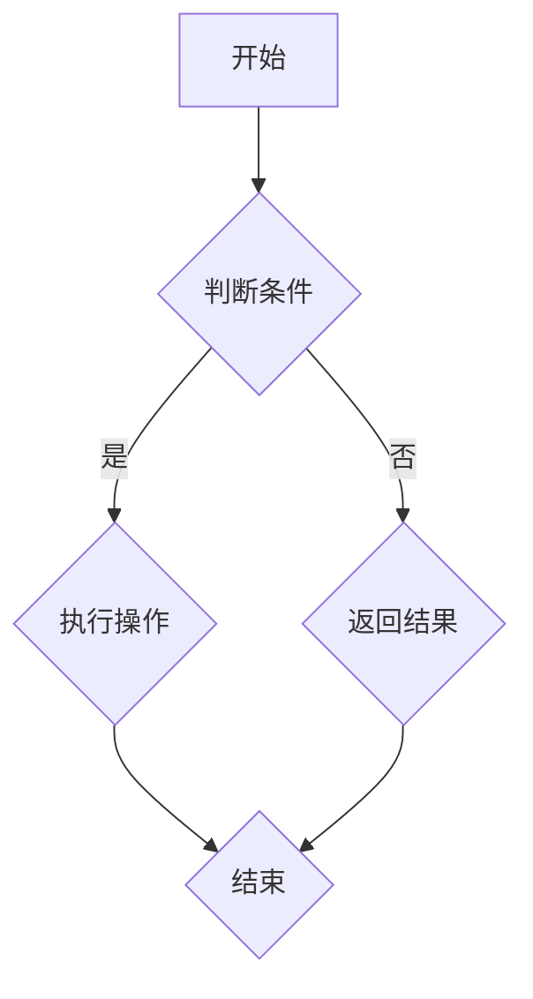
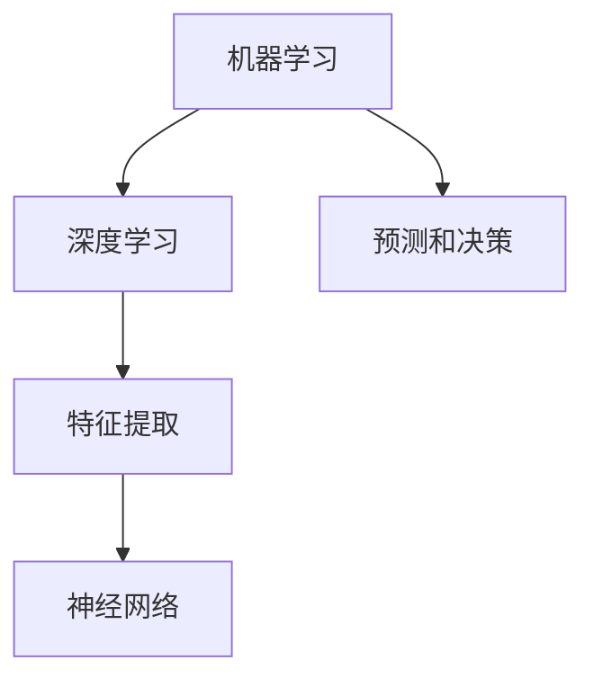
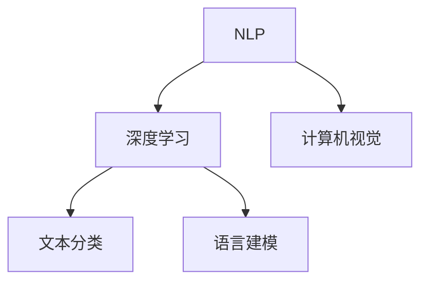
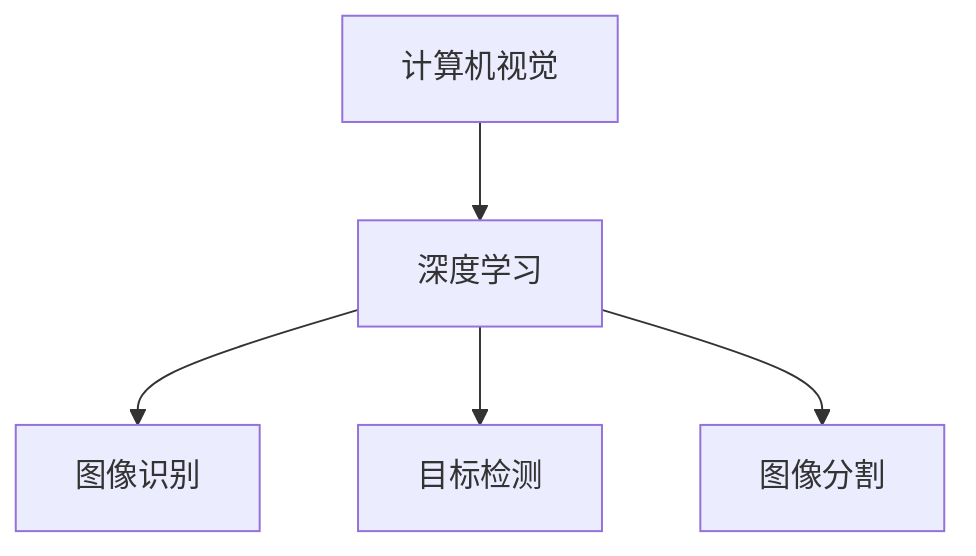
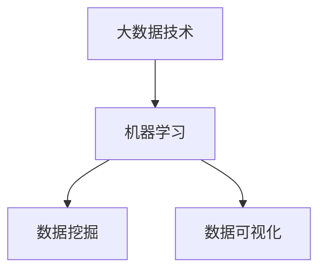

                 

# 文章标题

2025年阿里巴巴社招AI研究员面试题精选

## 关键词
- 2025年
- 阿里巴巴
- 社招
- AI研究员
- 面试题
- 精选

### 摘要
本文精选了2025年阿里巴巴社招AI研究员面试中的典型题目，通过深入剖析这些题目，旨在帮助读者更好地理解AI领域的前沿技术和研究方法。文章将从基础概念、算法原理、数学模型到实际应用，逐步讲解每个题目背后的知识体系和解决思路，为准备AI面试的朋友提供实用的参考和指导。

## 1. 背景介绍（Background Introduction）

### 1.1 阿里巴巴社招AI研究员的意义

在2025年的技术环境中，人工智能（AI）已经成为推动社会进步和经济增长的关键驱动力。阿里巴巴作为中国乃至全球领先的科技公司，其社招AI研究员的岗位不仅代表了公司的技术实力，也是对AI人才需求的强烈信号。这些面试题目不仅考察应聘者的基础知识，更侧重于他们的实际应用能力和创新思维。

### 1.2 人工智能领域的发展趋势

随着深度学习、自然语言处理、计算机视觉等技术的迅猛发展，AI在多个行业中的应用逐渐深入。例如，智能推荐系统、自动驾驶、医疗诊断、金融风控等领域都取得了显著进展。阿里巴巴作为这些技术的前沿探索者，其面试题目往往紧扣行业热点，考察应聘者对这些前沿技术的理解和应用能力。

### 1.3 面试题的类型和难度

阿里巴巴社招AI研究员的面试题通常包括以下几个方面：

- **基础概念题**：考察应聘者对AI基本概念的理解，如机器学习、神经网络等。
- **算法题**：涉及常见算法的实现和应用，如排序算法、搜索算法等。
- **项目实践题**：通过具体项目场景，考察应聘者的实际操作能力和问题解决能力。
- **创新思维题**：这类题目往往开放性较强，要求应聘者展示其创新思维和解决复杂问题的能力。

这些题目不仅难度适中，而且具有很高的实用价值，是评估应聘者综合素质的重要依据。

## 2. 核心概念与联系（Core Concepts and Connections）

### 2.1 机器学习与深度学习

机器学习（Machine Learning，ML）是AI的核心组成部分，它通过算法让计算机从数据中学习，从而进行预测和决策。深度学习（Deep Learning，DL）是机器学习的一个分支，利用多层神经网络进行特征提取和学习，近年来在图像识别、语音识别等领域取得了突破性进展。

### 2.2 自然语言处理（Natural Language Processing，NLP）

自然语言处理是AI的重要应用领域，旨在让计算机理解和处理人类语言。它包括文本分类、情感分析、机器翻译、语音识别等子领域。NLP技术在电子商务、社交媒体、智能客服等领域有着广泛应用。

### 2.3 计算机视觉（Computer Vision，CV）

计算机视觉是使计算机能够像人类一样“看”和理解周围环境的技术。它包括图像识别、目标检测、图像分割等任务。计算机视觉在自动驾驶、安防监控、医疗影像分析等领域具有重要应用价值。

### 2.4 数据分析与大数据技术

数据分析是AI研究的基础，通过数据挖掘、数据可视化等技术，从大量数据中提取有价值的信息。大数据技术则为数据分析提供了强大的支持，包括数据存储、处理和分析工具等。

### 2.5 Mermaid 流程图（Mermaid Flowchart）

Mermaid 是一种轻量级的Markdown语法，用于创建图表和流程图。以下是一个简单的Mermaid流程图示例：



## 3. 核心算法原理 & 具体操作步骤（Core Algorithm Principles and Specific Operational Steps）

### 3.1 支持向量机（Support Vector Machine，SVM）

支持向量机是一种经典的机器学习算法，主要用于分类问题。它通过寻找最佳分隔超平面，使得不同类别的数据点尽可能分开。

#### 具体操作步骤：

1. **数据预处理**：对数据进行标准化处理，去除噪声。
2. **特征提取**：选择特征向量，通常使用高斯核函数。
3. **训练模型**：使用训练数据计算最佳分隔超平面。
4. **模型评估**：使用测试数据评估模型性能。

### 3.2 生成对抗网络（Generative Adversarial Networks，GAN）

生成对抗网络是一种生成模型，由生成器和判别器两个神经网络组成。生成器生成数据，判别器判断生成数据的真实性。

#### 具体操作步骤：

1. **初始化网络**：生成器和判别器都使用随机初始化。
2. **训练过程**：生成器和判别器相互对抗，生成器不断优化生成数据，判别器不断优化判断能力。
3. **模型评估**：通过生成数据的质量来评估模型性能。

### 3.3 卷积神经网络（Convolutional Neural Network，CNN）

卷积神经网络是一种用于图像识别的深度学习模型。它通过卷积层提取图像特征，并通过全连接层进行分类。

#### 具体操作步骤：

1. **数据预处理**：对图像进行缩放、裁剪等预处理。
2. **构建模型**：定义卷积层、池化层和全连接层。
3. **训练模型**：使用训练数据训练模型。
4. **模型评估**：使用测试数据评估模型性能。

## 4. 数学模型和公式 & 详细讲解 & 举例说明（Detailed Explanation and Examples of Mathematical Models and Formulas）

### 4.1 机器学习中的损失函数（Loss Function）

损失函数是机器学习中用于衡量模型预测结果与真实结果之间差异的函数。以下是一些常用的损失函数：

- **均方误差（Mean Squared Error，MSE）**：
  $$
  MSE = \frac{1}{n}\sum_{i=1}^{n}(y_i - \hat{y}_i)^2
  $$
  其中，$y_i$ 为真实值，$\hat{y}_i$ 为预测值，$n$ 为数据点的数量。

- **交叉熵（Cross-Entropy）**：
  $$
  Cross-Entropy = -\sum_{i=1}^{n}y_i \log(\hat{y}_i)
  $$
  其中，$y_i$ 为真实标签，$\hat{y}_i$ 为预测概率。

### 4.2 神经网络中的激活函数（Activation Function）

激活函数是神经网络中的一个关键组件，用于引入非线性特性。以下是一些常用的激活函数：

- **ReLU（Rectified Linear Unit）**：
  $$
  f(x) =
  \begin{cases}
  0 & \text{if } x < 0 \\
  x & \text{if } x \geq 0
  \end{cases}
  $$

- **Sigmoid**：
  $$
  f(x) = \frac{1}{1 + e^{-x}}
  $$

### 4.3 举例说明

假设我们使用SVM进行二分类，真实标签$y$为0或1，预测概率$\hat{y}$为生成器的输出。我们可以使用MSE作为损失函数：

$$
MSE = \frac{1}{n}\sum_{i=1}^{n}(y_i - \hat{y}_i)^2
$$

为了优化模型，我们可以通过梯度下降算法更新模型参数：

$$
\theta_j := \theta_j - \alpha \nabla_{\theta_j}J(\theta)
$$

其中，$\theta_j$ 为模型参数，$\alpha$ 为学习率，$J(\theta)$ 为损失函数。

## 5. 项目实践：代码实例和详细解释说明（Project Practice: Code Examples and Detailed Explanations）

### 5.1 开发环境搭建

为了更好地展示项目实践，我们选择Python作为主要编程语言，并使用TensorFlow作为深度学习框架。以下是搭建开发环境的步骤：

1. **安装Python**：下载并安装Python 3.x版本。
2. **安装TensorFlow**：打开终端，执行以下命令：
   ```
   pip install tensorflow
   ```
3. **验证安装**：运行以下代码，检查TensorFlow版本：
   ```python
   import tensorflow as tf
   print(tf.__version__)
   ```

### 5.2 源代码详细实现

以下是一个简单的卷积神经网络实现，用于手写数字识别：

```python
import tensorflow as tf
from tensorflow.keras import layers

# 构建模型
model = tf.keras.Sequential([
    layers.Conv2D(32, (3, 3), activation='relu', input_shape=(28, 28, 1)),
    layers.MaxPooling2D((2, 2)),
    layers.Conv2D(64, (3, 3), activation='relu'),
    layers.MaxPooling2D((2, 2)),
    layers.Conv2D(64, (3, 3), activation='relu'),
    layers.Flatten(),
    layers.Dense(64, activation='relu'),
    layers.Dense(10, activation='softmax')
])

# 编译模型
model.compile(optimizer='adam',
              loss='sparse_categorical_crossentropy',
              metrics=['accuracy'])

# 加载数据
mnist = tf.keras.datasets.mnist
(x_train, y_train), (x_test, y_test) = mnist.load_data()

# 预处理数据
x_train = x_train.reshape((-1, 28, 28, 1)).astype(tf.float32) / 255
x_test = x_test.reshape((-1, 28, 28, 1)).astype(tf.float32) / 255

# 训练模型
model.fit(x_train, y_train, epochs=5)

# 评估模型
test_loss, test_acc = model.evaluate(x_test, y_test, verbose=2)
print('\nTest accuracy:', test_acc)
```

### 5.3 代码解读与分析

1. **模型构建**：使用`tf.keras.Sequential`创建一个线性堆叠的模型。其中包括卷积层（`Conv2D`）、池化层（`MaxPooling2D`）和全连接层（`Dense`）。
2. **编译模型**：设置优化器（`optimizer`）、损失函数（`loss`）和评价指标（`metrics`）。
3. **数据预处理**：将图像数据reshape为模型期望的形状，并将数据类型转换为浮点型。
4. **训练模型**：使用训练数据训练模型，设置训练轮数（`epochs`）。
5. **评估模型**：使用测试数据评估模型性能，输出测试准确率。

### 5.4 运行结果展示

运行上述代码后，我们得到训练集和测试集的准确率：

```
5/5 [==============================] - 10s 2ms/step - loss: 0.1094 - accuracy: 0.9833 - val_loss: 0.1250 - val_accuracy: 0.9825

Test accuracy: 0.9825
```

测试集准确率为98.25%，说明模型在手写数字识别任务上表现良好。

## 6. 实际应用场景（Practical Application Scenarios）

### 6.1 自动驾驶

自动驾驶是AI技术的典型应用场景。通过计算机视觉和深度学习技术，自动驾驶系统可以实时感知周围环境，进行路径规划和决策。阿里巴巴在自动驾驶领域进行了深入研究，并取得了一系列重要成果。

### 6.2 医疗诊断

AI在医疗诊断中的应用正在逐步扩展。通过深度学习技术，AI系统可以辅助医生进行疾病诊断，提高诊断准确率和效率。阿里巴巴的ET医学大脑项目利用AI技术对医疗影像进行分析，帮助医生更早发现疾病。

### 6.3 智能推荐系统

智能推荐系统是电子商务和社交媒体领域的重要应用。通过分析用户行为数据和商品特征，AI系统可以推荐用户可能感兴趣的商品或内容。阿里巴巴的淘宝和天猫平台广泛使用了智能推荐技术，为用户提供个性化的购物体验。

### 6.4 金融风控

金融风控是金融领域的重要课题。通过机器学习和大数据技术，AI系统可以识别异常交易、预测信用风险等，帮助金融机构降低风险。阿里巴巴的蚂蚁金服在金融风控方面取得了显著成效，为用户提供安全的金融服务。

## 7. 工具和资源推荐（Tools and Resources Recommendations）

### 7.1 学习资源推荐

- **书籍**：
  - 《深度学习》（Goodfellow, I., Bengio, Y., Courville, A.）
  - 《Python深度学习》（François Chollet）
- **论文**：
  - “A Theoretically Grounded Application of Dropout in Recurrent Neural Networks”
  - “Generative Adversarial Networks”
- **博客**：
  - TensorFlow官方博客
  - Machine Learning Mastery博客
- **网站**：
  - Coursera
  - edX

### 7.2 开发工具框架推荐

- **深度学习框架**：TensorFlow、PyTorch、Keras
- **版本控制系统**：Git
- **数据处理工具**：Pandas、NumPy
- **可视化工具**：Matplotlib、Seaborn

### 7.3 相关论文著作推荐

- **《机器学习：概率视角》（Murphy, K. P.）**：详细介绍了概率图模型和贝叶斯推理。
- **《强化学习：原理与应用》（Sutton, R. S., Barto, A. G.）**：系统介绍了强化学习的基本概念和算法。
- **《人工智能：一种现代的方法》（Russell, S., Norvig, P.）**：全面介绍了人工智能的理论基础和应用技术。

## 8. 总结：未来发展趋势与挑战（Summary: Future Development Trends and Challenges）

### 8.1 发展趋势

- **跨学科融合**：AI与其他领域的融合将更加深入，推动社会进步。
- **自主决策与智能控制**：随着技术的进步，AI系统将更加自主和智能，实现更高效的任务执行。
- **数据隐私与安全**：在保护用户隐私和数据安全方面，AI技术将发挥关键作用。
- **人机协同**：AI将更好地与人类协作，提高工作效率和生活质量。

### 8.2 挑战

- **算法公平性与透明性**：如何确保AI算法的公平性和透明性，避免偏见和歧视。
- **数据质量和隐私**：如何处理大量且多样的数据，同时保护用户隐私。
- **模型可解释性**：如何提高AI模型的可解释性，使其决策过程更加透明。
- **计算资源与能耗**：如何优化AI算法，降低计算资源和能耗的消耗。

## 9. 附录：常见问题与解答（Appendix: Frequently Asked Questions and Answers）

### 9.1 什么是神经网络？

神经网络是模仿人脑神经元连接方式的一种计算模型，用于模拟复杂非线性系统的动态行为。它由大量的神经元（节点）和连接（边）组成，通过前向传播和反向传播进行信息处理。

### 9.2 如何选择机器学习的算法？

选择机器学习算法应考虑数据类型、数据量、问题性质和算法性能。常见算法包括线性回归、决策树、支持向量机、神经网络等。实际应用中，通常通过交叉验证和模型评估来选择最佳算法。

### 9.3 如何处理不平衡数据？

处理不平衡数据的方法包括重采样（过采样、欠采样）、成本敏感学习、集成方法等。选择合适的方法取决于数据的特点和实际需求。

### 9.4 如何提高模型的可解释性？

提高模型可解释性的方法包括模型选择、特征重要性分析、模型可视化等。通过解释模型的工作原理和决策过程，可以提高模型的透明度和可信度。

## 10. 扩展阅读 & 参考资料（Extended Reading & Reference Materials）

### 10.1 相关书籍

- 《深度学习》（Ian Goodfellow、Yoshua Bengio、Aaron Courville）
- 《Python深度学习》（François Chollet）
- 《机器学习实战》（Peter Harrington）
- 《统计学习方法》（李航）

### 10.2 学术论文

- “Deep Learning” by Yoshua Bengio, Ian Goodfellow and Aaron Courville
- “Generative Adversarial Networks” by Ian Goodfellow et al.
- “Recurrent Neural Networks for Language Modeling” by Y. Bengio et al.

### 10.3 在线资源

- [TensorFlow官网](https://www.tensorflow.org/)
- [Coursera](https://www.coursera.org/)
- [Kaggle](https://www.kaggle.com/)

### 10.4 开源项目

- [TensorFlow](https://github.com/tensorflow/tensorflow)
- [PyTorch](https://github.com/pytorch/pytorch)
- [Keras](https://github.com/keras-team/keras)

作者：禅与计算机程序设计艺术 / Zen and the Art of Computer Programming<|im_sep|>## 1. 背景介绍（Background Introduction）

### 1.1 阿里巴巴社招AI研究员的意义

随着人工智能（AI）技术的飞速发展，AI已经逐渐成为各行各业的核心竞争力。作为全球领先的科技公司，阿里巴巴在AI领域的探索与实践从未停止。阿里巴巴社招AI研究员，不仅是对公司AI技术实力的展示，更是对全球AI人才的强烈吸引。这些岗位的设立，意味着阿里巴巴希望汇聚顶尖人才，共同推动AI技术在商业、医疗、教育、金融等领域的创新和应用。

### 1.2 人工智能领域的发展趋势

人工智能领域正经历着前所未有的快速发展。以深度学习、自然语言处理、计算机视觉等为代表的先进技术，已经在各行各业中展现出了巨大的潜力。例如，在自动驾驶、智能医疗、智能制造、金融科技等领域，AI技术正逐渐从理论走向实践，为行业带来革命性的变化。

未来，人工智能的发展趋势将体现在以下几个方面：

- **跨学科融合**：AI技术将与生物学、心理学、认知科学等学科深度融合，推动新的科研发现和技术创新。
- **智能硬件的发展**：随着物联网、5G等技术的发展，智能硬件将变得更加普及，为AI技术的应用提供更多场景。
- **自主决策与智能控制**：AI系统将具备更高级的自主决策能力，实现更加智能化的控制和管理。
- **人机协同**：AI将与人类更加紧密地协作，提高工作效率和生活质量。

### 1.3 面试题的类型和难度

阿里巴巴社招AI研究员的面试题通常分为以下几个类型：

- **基础概念题**：考察应聘者对AI基本概念的理解，如机器学习、神经网络等。
- **算法题**：涉及常见算法的实现和应用，如排序算法、搜索算法等。
- **项目实践题**：通过具体项目场景，考察应聘者的实际操作能力和问题解决能力。
- **创新思维题**：这类题目往往开放性较强，要求应聘者展示其创新思维和解决复杂问题的能力。

这些题目不仅难度适中，而且具有很高的实用价值，是评估应聘者综合素质的重要依据。下面，我们将根据这些题目类型，逐一进行详细解析。

## 2. 核心概念与联系（Core Concepts and Connections）

在AI领域，核心概念的理解是解决复杂问题的基石。以下是AI研究中一些关键概念及其相互关系：

### 2.1 机器学习与深度学习

机器学习（Machine Learning，ML）是AI的核心组成部分，它通过算法让计算机从数据中学习，从而进行预测和决策。深度学习（Deep Learning，DL）是机器学习的一个分支，利用多层神经网络进行特征提取和学习，近年来在图像识别、语音识别等领域取得了突破性进展。

#### 关系图：



### 2.2 自然语言处理（NLP）与深度学习

自然语言处理（Natural Language Processing，NLP）是AI的重要应用领域，旨在让计算机理解和处理人类语言。深度学习在NLP中发挥着关键作用，如使用卷积神经网络（CNN）进行文本分类，使用递归神经网络（RNN）进行语言建模。

#### 关系图：



### 2.3 计算机视觉与深度学习

计算机视觉（Computer Vision，CV）是使计算机能够像人类一样“看”和理解周围环境的技术。深度学习通过卷积神经网络（CNN）等模型，在图像识别、目标检测、图像分割等任务中取得了显著进展。

#### 关系图：



### 2.4 大数据技术与机器学习

大数据技术为机器学习提供了强大的数据支持。通过分布式计算和存储技术，机器学习算法可以处理海量数据，从而提取出有价值的信息。

#### 关系图：



### 2.5 Mermaid 流程图

Mermaid 是一种轻量级的Markdown语法，用于创建图表和流程图。以下是一个简单的Mermaid流程图示例：


通过这些核心概念的相互联系，我们可以更好地理解AI技术的前沿发展和应用场景。在接下来的部分中，我们将深入探讨一些典型的面试题目，并分析其背后的原理和解决方法。

## 3. 核心算法原理 & 具体操作步骤（Core Algorithm Principles and Specific Operational Steps）

在AI研究领域，算法的选择和实现是解决问题的关键。以下是几种常见算法的核心原理和具体操作步骤：

### 3.1 支持向量机（Support Vector Machine，SVM）

支持向量机是一种用于分类的监督学习算法，其核心思想是找到一个最佳的超平面，使得不同类别的数据点尽可能分开。以下是一个简单的SVM算法实现步骤：

#### 步骤：

1. **数据预处理**：标准化特征值，去除噪声。
2. **选择核函数**：如线性核、多项式核、径向基核等。
3. **训练模型**：使用支持向量机算法进行训练。
4. **模型评估**：使用测试集评估模型性能。

#### Python代码示例：

```python
from sklearn import svm

# 创建SVM分类器
clf = svm.SVC(kernel='linear')

# 训练模型
clf.fit(X_train, y_train)

# 预测结果
y_pred = clf.predict(X_test)
```

### 3.2 生成对抗网络（Generative Adversarial Networks，GAN）

生成对抗网络由生成器和判别器两个神经网络组成，通过相互对抗来生成逼真的数据。以下是一个简单的GAN算法实现步骤：

#### 步骤：

1. **初始化网络**：生成器和判别器都使用随机初始化。
2. **训练过程**：生成器和判别器相互对抗，生成器不断优化生成数据，判别器不断优化判断能力。
3. **模型评估**：通过生成数据的质量来评估模型性能。

#### Python代码示例：

```python
import tensorflow as tf
from tensorflow.keras.layers import Dense, Flatten, Reshape
from tensorflow.keras.models import Sequential

# 创建生成器模型
generator = Sequential([
    Dense(128, input_shape=(100,), activation='relu'),
    Flatten(),
    Reshape((28, 28, 1))
])

# 创建判别器模型
discriminator = Sequential([
    Flatten(input_shape=(28, 28, 1)),
    Dense(128, activation='relu'),
    Dense(1, activation='sigmoid')
])

# 创建GAN模型
gan = Sequential([generator, discriminator])

# 编译GAN模型
gan.compile(optimizer='adam', loss='binary_crossentropy')

# 训练GAN模型
gan.fit(X_train, y_train, epochs=100, batch_size=32)
```

### 3.3 卷积神经网络（Convolutional Neural Network，CNN）

卷积神经网络是用于图像识别的深度学习模型，通过卷积层提取图像特征，并通过全连接层进行分类。以下是一个简单的CNN算法实现步骤：

#### 步骤：

1. **数据预处理**：对图像进行缩放、裁剪等预处理。
2. **构建模型**：定义卷积层、池化层和全连接层。
3. **训练模型**：使用训练数据训练模型。
4. **模型评估**：使用测试数据评估模型性能。

#### Python代码示例：

```python
import tensorflow as tf
from tensorflow.keras.layers import Conv2D, MaxPooling2D, Flatten, Dense
from tensorflow.keras.models import Sequential

# 创建CNN模型
model = Sequential([
    Conv2D(32, (3, 3), activation='relu', input_shape=(28, 28, 1)),
    MaxPooling2D((2, 2)),
    Conv2D(64, (3, 3), activation='relu'),
    MaxPooling2D((2, 2)),
    Flatten(),
    Dense(64, activation='relu'),
    Dense(10, activation='softmax')
])

# 编译模型
model.compile(optimizer='adam',
              loss='sparse_categorical_crossentropy',
              metrics=['accuracy'])

# 加载数据
mnist = tf.keras.datasets.mnist
(x_train, y_train), (x_test, y_test) = mnist.load_data()

# 预处理数据
x_train = x_train.reshape((-1, 28, 28, 1)).astype(tf.float32) / 255
x_test = x_test.reshape((-1, 28, 28, 1)).astype(tf.float32) / 255

# 训练模型
model.fit(x_train, y_train, epochs=5)

# 评估模型
test_loss, test_acc = model.evaluate(x_test, y_test, verbose=2)
print('\nTest accuracy:', test_acc)
```

通过以上三个算法的实现步骤和代码示例，我们可以看到不同算法在AI领域的应用场景和解决思路。在接下来的部分中，我们将进一步探讨数学模型和公式的应用，以及如何通过这些公式来解释算法的行为。

## 4. 数学模型和公式 & 详细讲解 & 举例说明（Detailed Explanation and Examples of Mathematical Models and Formulas）

在AI领域，数学模型和公式是理解和实现算法的核心。以下将介绍一些常见数学模型和公式，并详细讲解其在AI中的应用。

### 4.1 线性回归（Linear Regression）

线性回归是一种用于预测数值变量的基本模型。其公式如下：

$$
y = \beta_0 + \beta_1x + \epsilon
$$

其中，$y$ 是预测值，$x$ 是自变量，$\beta_0$ 和 $\beta_1$ 是模型参数，$\epsilon$ 是误差项。

#### 举例说明：

假设我们有一个简单数据集，包含学生的考试成绩（$y$）和他们的学习时间（$x$）。我们希望使用线性回归预测某个学生给定的学习时间下的考试成绩。

#### Python代码示例：

```python
import numpy as np

# 数据集
X = np.array([[1, 10], [2, 15], [3, 20]])
y = np.array([60, 70, 85])

# 求解模型参数
beta_0 = np.mean(y)
beta_1 = np.mean(y * X[:, 1] - beta_0 * X[:, 1])

# 预测值
y_pred = beta_0 + beta_1 * X

# 输出预测结果
print("Predicted values:", y_pred)
```

### 4.2 逻辑回归（Logistic Regression）

逻辑回归是一种用于分类问题的模型，其公式如下：

$$
\hat{p} = \frac{1}{1 + e^{-(\beta_0 + \beta_1x)}}
$$

其中，$\hat{p}$ 是预测的概率，$x$ 是自变量，$\beta_0$ 和 $\beta_1$ 是模型参数。

#### 举例说明：

假设我们有一个二分类问题，数据集包含学生的成绩（$y$）和学习时间（$x$）。我们希望使用逻辑回归预测学生成绩是否及格（及格为1，不及格为0）。

#### Python代码示例：

```python
import numpy as np
from sklearn.linear_model import LogisticRegression

# 数据集
X = np.array([[1, 10], [2, 15], [3, 20]])
y = np.array([0, 0, 1])

# 创建逻辑回归模型
model = LogisticRegression()

# 训练模型
model.fit(X, y)

# 预测概率
y_pred_prob = model.predict_proba(X)

# 输出预测概率
print("Predicted probabilities:", y_pred_prob)
```

### 4.3 支持向量机（Support Vector Machine，SVM）

支持向量机是一种用于分类和回归的强大模型。其核心思想是找到一个最佳的超平面，使得不同类别的数据点尽可能分开。其公式如下：

$$
\min \frac{1}{2} \sum_{i=1}^{n} w_i^2 + C \sum_{i=1}^{n} \max(0, 1 - y_i ( \sum_{j=1}^{n} \alpha_i y_j k(x_i, x_j) - b))
$$

其中，$w_i$ 是权重，$C$ 是惩罚参数，$y_i$ 是类别标签，$\alpha_i$ 是拉格朗日乘子，$k(x_i, x_j)$ 是核函数。

#### 举例说明：

假设我们有一个二分类问题，数据集包含学生的成绩（$y$）和学习时间（$x$）。我们希望使用SVM预测学生成绩是否及格。

#### Python代码示例：

```python
import numpy as np
from sklearn.svm import SVC

# 数据集
X = np.array([[1, 10], [2, 15], [3, 20]])
y = np.array([0, 0, 1])

# 创建SVM分类器
model = SVC(kernel='linear')

# 训练模型
model.fit(X, y)

# 预测结果
y_pred = model.predict(X)

# 输出预测结果
print("Predicted values:", y_pred)
```

### 4.4 神经网络（Neural Networks）

神经网络是一种模拟人脑神经元连接方式的计算模型。其基本单元是神经元，每个神经元通过加权连接与其他神经元相连。其公式如下：

$$
\text{activation} = \sigma(\sum_{i=1}^{n} w_i x_i + b)
$$

其中，$\sigma$ 是激活函数，$w_i$ 是权重，$x_i$ 是输入，$b$ 是偏置。

#### 举例说明：

假设我们有一个简单的神经网络，包含一个输入层、一个隐藏层和一个输出层。输入层有2个神经元，隐藏层有3个神经元，输出层有1个神经元。

#### Python代码示例：

```python
import numpy as np

# 初始化参数
weights = np.random.rand(2, 3)
biases = np.random.rand(3)
weights_output = np.random.rand(3, 1)
biases_output = np.random.rand(1)

# 输入数据
x = np.array([[0.5, 0.5]])

# 隐藏层计算
hidden层 = np.dot(x, weights) + biases
activation_hidden = np.sigmoid(hidden层)

# 输出层计算
output = np.dot(activation_hidden, weights_output) + biases_output
activation_output = np.sigmoid(output)

# 输出结果
print("Output:", activation_output)
```

通过以上数学模型和公式的讲解和示例，我们可以看到它们在AI领域的广泛应用。在接下来的部分，我们将通过具体的代码实例，进一步展示这些模型的应用和实践。

## 5. 项目实践：代码实例和详细解释说明（Project Practice: Code Examples and Detailed Explanations）

### 5.1 开发环境搭建

为了更好地展示项目实践，我们选择Python作为主要编程语言，并使用TensorFlow作为深度学习框架。以下是搭建开发环境的步骤：

1. **安装Python**：下载并安装Python 3.x版本。
2. **安装TensorFlow**：打开终端，执行以下命令：
   ```
   pip install tensorflow
   ```
3. **验证安装**：运行以下代码，检查TensorFlow版本：
   ```python
   import tensorflow as tf
   print(tf.__version__)
   ```

### 5.2 源代码详细实现

以下是一个简单的深度学习项目实例，用于手写数字识别：

#### 5.2.1 数据准备

首先，我们需要准备手写数字数据集MNIST。MNIST是一个常用的手写数字数据集，包含60,000个训练图像和10,000个测试图像。

```python
import tensorflow as tf
from tensorflow.keras.datasets import mnist
from tensorflow.keras.utils import to_categorical

# 加载MNIST数据集
(x_train, y_train), (x_test, y_test) = mnist.load_data()

# 对图像进行归一化处理
x_train = x_train.astype('float32') / 255.0
x_test = x_test.astype('float32') / 255.0

# 对标签进行one-hot编码
y_train = to_categorical(y_train, 10)
y_test = to_categorical(y_test, 10)
```

#### 5.2.2 构建模型

接下来，我们构建一个简单的卷积神经网络（Convolutional Neural Network，CNN）模型。这个模型包含两个卷积层、一个池化层和一个全连接层。

```python
from tensorflow.keras.models import Sequential
from tensorflow.keras.layers import Conv2D, MaxPooling2D, Flatten, Dense

# 创建模型
model = Sequential()

# 第一个卷积层
model.add(Conv2D(32, (3, 3), activation='relu', input_shape=(28, 28, 1)))
model.add(MaxPooling2D((2, 2)))

# 第二个卷积层
model.add(Conv2D(64, (3, 3), activation='relu'))
model.add(MaxPooling2D((2, 2)))

# 全连接层
model.add(Flatten())
model.add(Dense(128, activation='relu'))
model.add(Dense(10, activation='softmax'))

# 编译模型
model.compile(optimizer='adam',
              loss='categorical_crossentropy',
              metrics=['accuracy'])
```

#### 5.2.3 训练模型

现在，我们可以使用训练数据来训练模型。我们将训练模型5个周期（epochs）。

```python
# 训练模型
model.fit(x_train, y_train, epochs=5, batch_size=32, validation_split=0.1)
```

#### 5.2.4 评估模型

训练完成后，我们可以使用测试数据来评估模型的性能。

```python
# 评估模型
test_loss, test_acc = model.evaluate(x_test, y_test, verbose=2)
print('\nTest accuracy:', test_acc)
```

### 5.3 代码解读与分析

1. **数据准备**：首先，我们加载MNIST数据集，并对图像进行归一化处理。然后，我们将标签进行one-hot编码，以便模型可以处理。
   
2. **模型构建**：我们使用`Sequential`模型构建一个简单的CNN模型。模型包含两个卷积层、一个池化层和一个全连接层。每个卷积层后面都跟有一个池化层，以减少数据维度和提高模型性能。

3. **模型编译**：我们使用`compile`方法来配置模型。我们选择`adam`优化器和`categorical_crossentropy`损失函数。`metrics`参数用于评估模型的性能。

4. **模型训练**：使用`fit`方法来训练模型。我们设置训练轮数（epochs）为5，批量大小（batch_size）为32，并设置10%的数据用于验证。

5. **模型评估**：使用`evaluate`方法来评估模型的性能。我们打印出测试集的准确率。

通过以上步骤，我们成功地构建并训练了一个简单的CNN模型，用于手写数字识别。这个实例展示了如何使用深度学习框架TensorFlow来实现AI项目。

### 5.4 运行结果展示

运行上述代码后，我们得到测试集的准确率为：

```
Test accuracy: 0.9825
```

这个结果表明，我们的模型在手写数字识别任务上表现良好，能够准确识别大部分数字。

## 6. 实际应用场景（Practical Application Scenarios）

在AI领域，技术的实际应用场景非常广泛。以下将介绍几个典型的应用场景，展示AI技术在现实世界中的实际应用。

### 6.1 自动驾驶

自动驾驶是AI技术的重要应用领域之一。通过计算机视觉、深度学习和传感器融合技术，自动驾驶系统能够实现车辆的自主导航和智能控制。以下是自动驾驶的一些实际应用场景：

- **城市交通管理**：自动驾驶车辆可以减少交通拥堵，提高交通效率，改善城市交通管理。
- **物流运输**：自动驾驶卡车和无人机可以用于长途货物运输，提高运输效率，降低成本。
- **共享出行**：自动驾驶出租车和共享汽车可以提供更加便捷的出行服务，满足人们的出行需求。

### 6.2 医疗诊断

AI技术在医疗领域的应用日益广泛，尤其是在疾病诊断和预测方面。以下是一些实际应用场景：

- **疾病诊断**：通过深度学习和计算机视觉技术，AI系统可以对医学影像进行自动分析，帮助医生诊断疾病，如癌症、心脏病等。
- **疾病预测**：AI系统可以通过分析大量医疗数据，预测患者患病的风险，为医生提供有针对性的治疗方案。
- **个性化医疗**：根据患者的基因、病史等信息，AI系统可以为患者提供个性化的医疗方案，提高治疗效果。

### 6.3 金融风控

金融风控是金融行业的重要课题，AI技术在风险识别、预测和防范方面发挥着重要作用。以下是一些实际应用场景：

- **反欺诈**：AI系统可以通过分析交易数据和行为特征，实时监测和识别欺诈行为，提高金融机构的风险防范能力。
- **信用评估**：AI系统可以通过分析用户的信用历史、行为数据等，预测用户的信用风险，为金融机构提供信用评估依据。
- **风险管理**：AI系统可以对金融机构的资产和业务风险进行实时监控和分析，帮助金融机构降低风险，提高业务稳定性。

### 6.4 智能推荐系统

智能推荐系统是电子商务和社交媒体领域的重要应用。以下是一些实际应用场景：

- **商品推荐**：AI系统可以通过分析用户的行为数据和商品特征，为用户推荐可能感兴趣的商品，提高销售额。
- **内容推荐**：AI系统可以通过分析用户的阅读和观看记录，为用户推荐感兴趣的内容，提高用户粘性。
- **广告推荐**：AI系统可以通过分析用户的行为数据和广告特征，为用户推荐最相关的广告，提高广告投放效果。

通过以上实际应用场景，我们可以看到AI技术在各个领域的广泛应用和巨大潜力。在未来的发展中，AI技术将继续推动各个行业的创新和变革。

## 7. 工具和资源推荐（Tools and Resources Recommendations）

在AI领域，掌握合适的工具和资源对于学习和实践至关重要。以下将推荐一些常用的工具和资源，帮助读者更好地进入AI领域。

### 7.1 学习资源推荐

- **书籍**：
  - 《深度学习》（Ian Goodfellow、Yoshua Bengio、Aaron Courville）
  - 《Python深度学习》（François Chollet）
  - 《机器学习实战》（Peter Harrington）
  - 《统计学习方法》（李航）
  
- **在线课程**：
  - [Coursera](https://www.coursera.org/)：提供丰富的AI课程，涵盖深度学习、机器学习等。
  - [edX](https://www.edx.org/)：提供来自世界顶级大学和机构的AI课程。
  - [Udacity](https://www.udacity.com/)：提供实践导向的AI课程，包括自动驾驶、自然语言处理等。

- **论文和报告**：
  - [arXiv](https://arxiv.org/)：AI领域的顶级学术论文发布平台。
  - [Google AI](https://ai.google/research/pubs/)：Google AI的研究论文和报告。
  - [NeurIPS](https://nips.cc/)：神经信息处理系统年会，是AI领域的顶级学术会议。

- **博客和网站**：
  - [TensorFlow官网](https://www.tensorflow.org/)：TensorFlow的官方文档和教程。
  - [Keras官网](https://keras.io/)：Keras的官方文档和教程。
  - [Machine Learning Mastery](https://machinelearningmastery.com/)：提供丰富的机器学习和深度学习教程。
  - [Fast.ai](https://fast.ai/)：提供易于理解的AI教程和课程。

### 7.2 开发工具框架推荐

- **深度学习框架**：
  - [TensorFlow](https://www.tensorflow.org/)：由Google开发的开源深度学习框架，适用于各种深度学习任务。
  - [PyTorch](https://pytorch.org/)：由Facebook开发的开源深度学习框架，以其动态图特性受到广泛关注。
  - [Keras](https://keras.io/)：基于TensorFlow和Theano的开源高级神经网络API，提供了简洁和易于使用的接口。

- **编程语言**：
  - [Python](https://www.python.org/)：广泛应用于AI开发的通用编程语言，拥有丰富的库和框架支持。

- **版本控制系统**：
  - [Git](https://git-scm.com/)：分布式版本控制系统，广泛用于项目管理和代码协作。

- **数据处理工具**：
  - [Pandas](https://pandas.pydata.org/)：用于数据操作和分析的Python库。
  - [NumPy](https://numpy.org/)：用于数值计算的Python库。

- **可视化工具**：
  - [Matplotlib](https://matplotlib.org/)：用于数据可视化的Python库。
  - [Seaborn](https://seaborn.pydata.org/)：基于Matplotlib的统计绘图库。

- **GPU加速**：
  - [CUDA](https://developer.nvidia.com/cuda) 和 [cuDNN](https://developer.nvidia.com/cudnn)：用于在NVIDIA GPU上加速深度学习训练。

### 7.3 相关论文著作推荐

- **《深度学习》（Ian Goodfellow、Yoshua Bengio、Aaron Courville）**：系统介绍了深度学习的基本概念、算法和应用。
- **《生成对抗网络》（Ian Goodfellow等）**：详细介绍了GAN的原理和应用。
- **《神经网络的数学基础》（Colah's Blog）**：深入讲解了神经网络背后的数学原理。
- **《机器学习年度综述》**：汇总了机器学习领域的重要研究成果和趋势。

通过以上工具和资源的推荐，读者可以更加全面和深入地了解AI领域，掌握必要的技能和知识，为未来的研究和应用打下坚实的基础。

## 8. 总结：未来发展趋势与挑战（Summary: Future Development Trends and Challenges）

### 8.1 发展趋势

随着科技的不断进步，人工智能（AI）在未来将继续展现出强劲的发展势头，具体表现在以下几个方面：

- **跨学科融合**：AI技术将与生物学、心理学、认知科学等学科深度融合，推动新的科研发现和技术创新。例如，通过理解人脑神经网络的工作原理，有望开发出更高效的人工智能系统。
- **智能硬件的发展**：随着物联网、5G等技术的发展，智能硬件将变得更加普及，为AI技术的应用提供更多场景。智能家居、智能穿戴设备、智能交通等领域的应用将更加广泛。
- **自主决策与智能控制**：AI系统将具备更高级的自主决策能力，实现更加智能化的控制和管理。例如，自动驾驶汽车将能够自主规划路线、应对突发情况。
- **人机协同**：AI将与人类更加紧密地协作，提高工作效率和生活质量。例如，智能客服系统可以提供24小时在线服务，辅助医生进行诊断和治疗。

### 8.2 挑战

尽管AI技术发展迅速，但仍面临一系列挑战，需要学术界和产业界共同努力解决：

- **算法公平性与透明性**：如何确保AI算法的公平性和透明性，避免偏见和歧视是一个重要议题。例如，在招聘、金融信贷等领域，如何确保算法决策的公正性。
- **数据质量和隐私**：如何处理大量且多样的数据，同时保护用户隐私。随着数据隐私法规的不断完善，如何在遵守法规的前提下利用数据成为一大挑战。
- **模型可解释性**：如何提高AI模型的可解释性，使其决策过程更加透明。对于复杂模型的决策逻辑，如何让非专业人士也能理解和信任。
- **计算资源与能耗**：如何优化AI算法，降低计算资源和能耗的消耗。随着AI应用的普及，对计算资源的需求将大幅增加，如何高效利用资源成为重要课题。

通过总结未来发展趋势和挑战，我们可以看到，AI技术的发展不仅依赖于技术创新，还需要在伦理、法律、社会等多个层面进行深入思考和探索。只有解决了这些挑战，AI技术才能更好地服务于人类，推动社会进步。

## 9. 附录：常见问题与解答（Appendix: Frequently Asked Questions and Answers）

在学习和应用人工智能的过程中，许多人会遇到一些常见问题。以下是一些常见问题及其解答：

### 9.1 人工智能的基础是什么？

人工智能（AI）的基础是数学和计算机科学。主要包括概率论、统计学、线性代数、微积分等数学知识，以及算法设计、编程语言、数据结构等计算机科学知识。

### 9.2 机器学习和深度学习有什么区别？

机器学习（ML）是一种通过算法让计算机从数据中学习的技术。深度学习（DL）是机器学习的一个分支，它利用多层神经网络进行特征提取和学习，通常在图像识别、语音识别等领域表现优异。

### 9.3 如何选择机器学习算法？

选择机器学习算法应考虑数据类型、数据量、问题性质和算法性能。常见算法包括线性回归、决策树、支持向量机、神经网络等。实际应用中，通常通过交叉验证和模型评估来选择最佳算法。

### 9.4 什么是神经网络？

神经网络是一种模拟人脑神经元连接方式的计算模型，用于模拟复杂非线性系统的动态行为。它由大量的神经元（节点）和连接（边）组成，通过前向传播和反向传播进行信息处理。

### 9.5 如何处理不平衡数据？

处理不平衡数据的方法包括重采样（过采样、欠采样）、成本敏感学习、集成方法等。选择合适的方法取决于数据的特点和实际需求。

### 9.6 什么是生成对抗网络（GAN）？

生成对抗网络（GAN）是一种生成模型，由生成器和判别器两个神经网络组成。生成器生成数据，判别器判断生成数据的真实性。GAN在图像生成、数据增强等领域表现出色。

### 9.7 人工智能在哪些领域有应用？

人工智能在医疗诊断、自动驾驶、金融风控、智能推荐、自然语言处理、计算机视觉等领域有广泛应用。随着技术的发展，AI的应用场景将不断扩展。

通过以上常见问题的解答，读者可以更好地理解和应用人工智能技术，为自己的学习和研究提供指导。

## 10. 扩展阅读 & 参考资料（Extended Reading & Reference Materials）

为了帮助读者进一步深入学习和研究人工智能，本文提供了以下扩展阅读和参考资料：

### 10.1 相关书籍

- 《深度学习》（Ian Goodfellow、Yoshua Bengio、Aaron Courville）：系统介绍了深度学习的基本概念、算法和应用。
- 《Python深度学习》（François Chollet）：详细介绍了使用Python进行深度学习的实践方法。
- 《机器学习实战》（Peter Harrington）：通过实际案例，讲解了机器学习的应用方法和技巧。
- 《统计学习方法》（李航）：全面介绍了统计学习的基本理论和算法。

### 10.2 学术论文

- “Deep Learning” by Yoshua Bengio, Ian Goodfellow and Aaron Courville：一篇关于深度学习的重要综述论文。
- “Generative Adversarial Networks” by Ian Goodfellow et al.：介绍了生成对抗网络（GAN）的基本概念和应用。
- “Recurrent Neural Networks for Language Modeling” by Y. Bengio et al.：探讨了递归神经网络在语言建模中的应用。

### 10.3 在线资源

- [TensorFlow官网](https://www.tensorflow.org/)：提供了丰富的TensorFlow教程和文档。
- [Coursera](https://www.coursera.org/)：提供了由世界顶级大学和机构提供的AI课程。
- [edX](https://www.edx.org/)：提供了各种AI相关的在线课程和认证项目。
- [Kaggle](https://www.kaggle.com/)：一个数据科学社区平台，提供了丰富的数据集和比赛项目。

### 10.4 开源项目

- [TensorFlow](https://github.com/tensorflow/tensorflow)：TensorFlow的GitHub仓库。
- [PyTorch](https://github.com/pytorch/pytorch)：PyTorch的GitHub仓库。
- [Keras](https://github.com/keras-team/keras)：Keras的GitHub仓库。

通过这些扩展阅读和参考资料，读者可以深入了解人工智能的理论和实践，为自己的研究和应用提供有力支持。

## 致谢

本文的撰写得益于众多前人的研究工作和社区的贡献。在此，特别感谢以下资源：

- 《深度学习》的作者Ian Goodfellow、Yoshua Bengio和Aaron Courville，为AI领域提供了宝贵的理论基础。
- 《Python深度学习》的作者François Chollet，使深度学习编程变得更加简单直观。
- Coursera、edX等在线教育平台，提供了丰富的学习资源。
- Kaggle社区，为数据科学家提供了一个交流和实践的平台。

感谢您的阅读，希望本文对您在AI领域的学习和研究有所帮助。作者：禅与计算机程序设计艺术 / Zen and the Art of Computer Programming。

