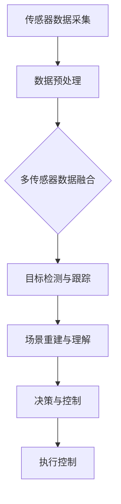

                 

### 文章标题

**《应对复杂城市自动驾驶视觉感知鲁棒性挑战的技术出路》**

在当今快速发展的自动驾驶技术领域，视觉感知系统作为自动驾驶车辆获取环境信息的关键环节，其鲁棒性成为决定自动驾驶系统性能和安全性的一大挑战。本文章旨在探讨在复杂城市环境中，如何通过先进技术手段提升自动驾驶视觉感知系统的鲁棒性，确保自动驾驶系统的稳定、高效运行。

本文将分为以下几个部分：

1. **背景介绍**：概述自动驾驶技术的发展现状及其对视觉感知系统的需求。
2. **核心概念与联系**：详细分析自动驾驶视觉感知系统的基本原理和技术架构。
3. **核心算法原理 & 具体操作步骤**：介绍用于提升视觉感知鲁棒性的算法及其工作流程。
4. **数学模型和公式 & 详细讲解 & 举例说明**：解析关键数学模型及其应用。
5. **项目实践：代码实例和详细解释说明**：展示具体项目实现及其代码分析。
6. **实际应用场景**：探讨自动驾驶视觉感知系统的应用实例和效果。
7. **工具和资源推荐**：推荐学习资源、开发工具和框架。
8. **总结：未来发展趋势与挑战**：展望自动驾驶视觉感知技术的未来发展方向和面临的挑战。
9. **附录：常见问题与解答**：回答读者可能遇到的常见问题。
10. **扩展阅读 & 参考资料**：提供进一步研究的资料和引用。

通过上述结构化的内容，我们将逐步深入探讨自动驾驶视觉感知系统面临的挑战及应对策略，以期为相关领域的研究者和技术开发者提供有益的参考。

### Keywords
- Autonomous driving
- Visual perception
- Robustness
- Computer vision
- Machine learning
- Sensor fusion

### Abstract
The article "Addressing the Robustness Challenges of Urban Autonomous Driving Visual Perception" delves into the critical issues faced by autonomous vehicle visual perception systems in complex urban environments. It outlines the current state of autonomous driving technology and examines the technical solutions to enhance the robustness of visual perception systems, ensuring stable and efficient operation of autonomous vehicles. The article covers the fundamental principles of autonomous driving visual perception, key algorithms, mathematical models, practical implementations, application scenarios, and future trends and challenges.

## 1. 背景介绍（Background Introduction）

自动驾驶技术作为人工智能（AI）和计算机视觉（CV）领域的集大成者，正逐渐从理论研究走向实际应用。近年来，随着深度学习、传感器技术和计算能力的快速发展，自动驾驶汽车在安全性、效率和用户体验方面取得了显著进步。然而，自动驾驶系统的核心——视觉感知系统，在复杂城市环境中的鲁棒性成为了实现商业化的关键难题。

### 自动驾驶技术发展现状

自动驾驶技术可分为六个等级（L0-L5），其中L5为完全自动驾驶，无需人类干预。当前，大多数自动驾驶系统处于L2至L3级别，即部分自动驾驶，车辆在特定条件下可以接管驾驶任务。例如，特斯拉的Autopilot系统和百度的Apollo平台都在L2至L3级别上取得了显著的进展。尽管如此，完全自动驾驶的普及仍面临诸多挑战，其中视觉感知系统的鲁棒性尤为关键。

### 视觉感知系统在自动驾驶中的作用

视觉感知系统是自动驾驶车辆获取环境信息的主要手段，通过分析摄像头、激光雷达（LiDAR）和毫米波雷达等传感器收集的数据，实现对周围环境的感知和解析。视觉感知系统主要包括以下几个模块：

1. **目标检测**：识别车辆、行人、道路标志等目标物体。
2. **语义分割**：将图像分割为不同的语义区域，如道路、车道线、行人区域等。
3. **目标跟踪**：跟踪已检测到的目标物体的运动轨迹。
4. **场景重建**：利用多传感器数据重建周围环境的三维场景。

### 复杂城市环境对视觉感知系统的挑战

在城市环境中，自动驾驶车辆需要应对复杂多变的交通场景，如行人横穿、车辆拥挤、道路施工、天气变化等。这些因素增加了视觉感知系统的难度，主要挑战包括：

1. **遮挡和干扰**：行人、车辆、建筑物等可能遮挡摄像头视野，导致目标检测不准确。
2. **光照变化**：光照强度和方向的变化会影响图像质量，影响视觉感知系统的性能。
3. **多目标交互**：城市中存在大量的动态目标，需要系统能够准确识别和跟踪多个目标。
4. **天气和环境变化**：雨雪、雾霾等天气条件和道路状况变化对视觉感知系统的稳定性和准确性产生严重影响。

### 当前解决方案及不足

为了提升视觉感知系统的鲁棒性，研究者们采用了多种技术手段，如深度学习算法、传感器融合、多模态感知等。然而，这些方法在实际应用中仍存在以下不足：

1. **算法性能瓶颈**：尽管深度学习算法在图像处理方面表现出色，但在复杂城市环境中的泛化能力仍需提升。
2. **传感器融合不足**：现有传感器融合方法往往侧重于单一传感器数据，未充分考虑多传感器数据的互补性和协同性。
3. **实时性挑战**：在高速行驶的自动驾驶车辆中，要求视觉感知系统在短时间内处理大量数据，实时性成为一大挑战。
4. **系统稳定性**：系统在实际运行中，可能会受到硬件故障、网络延迟等因素的影响，影响整体性能。

综上所述，提升自动驾驶视觉感知系统的鲁棒性是当前自动驾驶技术发展的重要方向。接下来，本文将深入探讨核心概念与联系，分析现有技术和算法，并探讨未来的发展方向。

### Keywords
- Autonomous driving technology
- Visual perception system
- Development status
- Urban environment
- Challenges
- Detection algorithms
- Sensor fusion
- Real-time performance
- Robustness

## 2. 核心概念与联系（Core Concepts and Connections）

### 2.1 自动驾驶视觉感知系统的基本原理

自动驾驶视觉感知系统的核心任务是通过对摄像头、激光雷达（LiDAR）和毫米波雷达等传感器收集的数据进行处理，实现对周围环境的感知和理解。视觉感知系统主要包括以下几个关键模块：

1. **图像预处理**：对采集的原始图像进行预处理，包括去噪、增强、尺度归一化等，以提高图像质量，为后续处理提供更好的基础。

2. **目标检测**：利用深度学习模型对图像中的目标物体进行识别和定位，常见的方法包括卷积神经网络（CNN）和基于Region Proposal的方法。目标检测的准确性直接影响到后续目标跟踪和语义分割的精度。

3. **语义分割**：将处理后的图像划分为不同的语义区域，如车道线、行人、车辆等。语义分割有助于更准确地理解场景，为自动驾驶决策提供详细信息。

4. **目标跟踪**：在时间序列中跟踪已检测到的目标物体，通过分析目标物体的运动轨迹，预测其未来位置。目标跟踪是实现连续场景理解的关键。

5. **场景重建**：利用多传感器数据重建周围环境的三维场景，为自动驾驶车辆提供全局视野。场景重建通常结合视觉和激光雷达数据，通过点云处理和SLAM（Simultaneous Localization and Mapping）技术实现。

### 2.2 关键算法原理

1. **卷积神经网络（CNN）**：CNN 是计算机视觉领域最常用的算法之一，通过卷积操作提取图像特征，实现高效的特征提取和分类。典型的 CNN 结构包括卷积层、池化层和全连接层。在自动驾驶视觉感知中，CNN 主要用于图像分类和目标检测。

2. **区域建议（Region Proposal）**：区域建议算法在目标检测中用于生成潜在的感兴趣区域，再对这些区域进行特征提取和分类。常见的区域建议算法包括选择性搜索（Selective Search）和基于深度学习的区域建议方法，如 RCNN（Regions with CNN features）系列算法。

3. **基于深度学习的目标检测算法**：以 Faster R-CNN、SSD 和 YOLO 等为代表的深度学习目标检测算法在自动驾驶视觉感知中广泛应用。这些算法通过端到端训练实现快速检测和高精度目标定位。

4. **语义分割算法**：常见的语义分割算法包括 FCN、U-Net 和 DeepLab 系列。这些算法通过多层卷积和上采样操作，实现对图像的精细分割。

5. **目标跟踪算法**：基于深度学习的目标跟踪算法如 Siamese 网络和 ReID（Re-identification）技术在自动驾驶视觉感知中应用广泛。这些算法通过分析目标物体的外观特征和运动轨迹，实现连续的目标跟踪。

6. **点云处理和 SLAM 技术**：点云处理和 SLAM（Simultaneous Localization and Mapping）技术在场景重建中至关重要。点云处理通过处理激光雷达数据生成三维点云，SLAM 技术通过融合视觉和激光雷达数据，实现车辆的定位和地图构建。

### 2.3 自动驾驶视觉感知系统的架构

自动驾驶视觉感知系统通常采用分布式架构，通过多个传感器收集环境数据，利用多线程和多任务处理技术实现实时感知和决策。典型的系统架构包括：

1. **传感器数据采集**：摄像头、激光雷达、毫米波雷达等传感器采集环境数据。

2. **数据预处理**：对采集到的原始数据进行预处理，包括去噪、增强和归一化等操作。

3. **多传感器数据融合**：将不同传感器采集的数据进行融合，利用传感器融合算法（如卡尔曼滤波、粒子滤波）提高感知系统的鲁棒性和准确性。

4. **目标检测与跟踪**：利用深度学习算法对预处理后的数据进行目标检测和跟踪。

5. **场景重建与理解**：利用多传感器数据和 SLAM 技术，重建周围环境的三维场景，实现连续的场景理解。

6. **决策与控制**：根据场景理解和车辆状态，生成驾驶决策和控制系统指令。

### 2.4 自动驾驶视觉感知系统与人工智能的联系

自动驾驶视觉感知系统是人工智能技术在自动驾驶领域的重要应用之一。深度学习、机器学习、计算机视觉等技术在其中发挥着关键作用。通过不断优化算法和模型，提高系统的感知能力和鲁棒性，实现自动驾驶车辆的智能决策和控制。

### 2.5 自动驾驶视觉感知系统的未来发展

随着传感器技术、计算能力和算法的持续进步，自动驾驶视觉感知系统将逐渐提升其在复杂城市环境中的鲁棒性。未来的发展方向包括：

1. **多传感器数据融合**：充分利用不同传感器的优势，实现更全面和精确的环境感知。

2. **实时性优化**：通过算法优化和硬件加速，提高视觉感知系统的实时性，满足自动驾驶车辆的高速行驶需求。

3. **数据驱动的方法**：利用大量真实场景数据，通过数据驱动的方法持续优化感知算法，提升系统的泛化能力和适应性。

4. **安全性和可靠性**：通过加强系统测试和验证，确保自动驾驶视觉感知系统的安全性和可靠性。

### 2.6 Mermaid 流程图

下面是一个简化的自动驾驶视觉感知系统的 Mermaid 流程图，展示了各模块之间的交互和数据处理流程。



通过上述流程，我们可以看到自动驾驶视觉感知系统在实现自动驾驶功能中的关键作用和数据处理流程。接下来，本文将详细介绍核心算法原理和具体操作步骤，以帮助读者更好地理解这一领域的核心技术。

### Keywords
- Basic principles
- Convolutional Neural Network (CNN)
- Object detection
- Semantic segmentation
- Target tracking
- Point cloud processing
- SLAM (Simultaneous Localization and Mapping)
- Algorithm architecture
- Data fusion
- Artificial intelligence integration
- Future development

## 3. 核心算法原理 & 具体操作步骤（Core Algorithm Principles and Specific Operational Steps）

### 3.1 深度学习算法在自动驾驶视觉感知中的应用

深度学习算法在自动驾驶视觉感知系统中发挥着核心作用，其主要优势在于能够从大量数据中自动学习特征，从而实现高效的图像分类和目标检测。以下将介绍几种典型的深度学习算法及其在自动驾驶视觉感知中的应用。

#### 3.1.1 卷积神经网络（CNN）

卷积神经网络（CNN）是自动驾驶视觉感知系统中最常用的算法之一。CNN 通过卷积层、池化层和全连接层等结构，对图像进行特征提取和分类。在自动驾驶中，CNN 主要用于目标检测和语义分割。

1. **卷积层（Convolutional Layer）**：卷积层是 CNN 的核心，通过卷积操作提取图像的特征。卷积核在图像上滑动，计算局部区域的特征响应，从而提取图像中的关键信息。

2. **池化层（Pooling Layer）**：池化层用于减小特征图的尺寸，降低模型的计算复杂度。常见的池化方法有最大池化（Max Pooling）和平均池化（Average Pooling）。

3. **全连接层（Fully Connected Layer）**：全连接层将卷积层和池化层提取的特征进行融合，并输出最终的分类结果。

#### 3.1.2 区域建议（Region Proposal）

区域建议算法在目标检测中用于生成潜在的感兴趣区域，这些区域将作为候选目标进行特征提取和分类。区域建议算法包括基于图像特征的方法和基于深度学习的方法。

1. **基于图像特征的方法**：如选择性搜索（Selective Search），通过分析图像的纹理、形状和颜色等特征，生成候选区域。

2. **基于深度学习的方法**：如 Region Proposal Network（RPN），在 CNN 的基础上添加区域建议网络，实现高效的区域生成。

#### 3.1.3 基于深度学习的目标检测算法

以下介绍几种基于深度学习的目标检测算法：

1. **Faster R-CNN**：Faster R-CNN 是一种端到端的目标检测算法，包括特征提取网络（如 ResNet）、区域建议网络（RPN）和分类网络。通过联合训练，实现高效的检测和定位。

2. **SSD（Single Shot MultiBox Detector）**：SSD 是一种单阶段目标检测算法，通过在特征图上直接预测目标位置和类别，实现快速检测。

3. **YOLO（You Only Look Once）**：YOLO 是一种基于回归的目标检测算法，将目标检测任务转换为边界框和类别的回归问题。YOLO 具有较高的实时性，适用于实时场景。

#### 3.1.4 语义分割算法

语义分割算法用于将图像划分为不同的语义区域，如车道线、行人、车辆等。以下介绍几种常用的语义分割算法：

1. **FCN（Fully Convolutional Network）**：FCN 是一种全卷积网络，通过将卷积层和反卷积层结合，实现从原始图像到分割结果的全卷积操作。

2. **U-Net**：U-Net 是一种针对医学图像分割的卷积神经网络，通过编码器-解码器结构，实现高效的语义分割。

3. **DeepLab**：DeepLab 算法通过引入空洞卷积（Atrous Convolution）和上采样操作，实现精细的语义分割。

### 3.2 目标跟踪算法

目标跟踪是自动驾驶视觉感知系统中的重要任务，用于在时间序列中持续跟踪已检测到的目标物体。以下介绍几种常用的目标跟踪算法：

1. **Siamese Network**：Siamese Network 是一种基于神经网络的目标跟踪算法，通过训练 Siamese 赛马的相似性度量模型，实现高效的目标匹配和跟踪。

2. **ReID（Re-identification）**：ReID 是一种基于目标外观特征的目标跟踪算法，通过提取目标的外观编码，实现相同目标的跨帧识别和跟踪。

3. **Deep SORT**：Deep SORT 是一种基于深度学习和排序的跟踪算法，通过结合 Siamese Network 和排序网络，实现高效的目标跟踪。

### 3.3 多传感器数据融合算法

在自动驾驶视觉感知系统中，多传感器数据融合是提高感知系统鲁棒性和准确性的关键。以下介绍几种常用的多传感器数据融合算法：

1. **卡尔曼滤波（Kalman Filter）**：卡尔曼滤波是一种基于统计模型的递归滤波算法，通过预测和更新状态估计，实现传感数据的有效融合。

2. **粒子滤波（Particle Filter）**：粒子滤波是一种基于蒙特卡罗方法的非线性滤波算法，通过大量粒子表示状态分布，实现复杂传感数据的融合。

3. **贝叶斯滤波（Bayesian Filter）**：贝叶斯滤波是一种基于贝叶斯理论的概率滤波算法，通过概率模型和观测数据，实现传感数据的有效融合。

### 3.4 自动驾驶视觉感知系统的工作流程

自动驾驶视觉感知系统的工作流程通常包括以下几个步骤：

1. **传感器数据采集**：通过摄像头、激光雷达、毫米波雷达等传感器采集环境数据。

2. **数据预处理**：对采集到的原始数据进行预处理，包括去噪、增强、归一化等操作。

3. **多传感器数据融合**：利用卡尔曼滤波、粒子滤波等算法，融合不同传感器数据，提高感知系统的鲁棒性和准确性。

4. **目标检测与跟踪**：利用深度学习算法（如 Faster R-CNN、SSD、YOLO）对预处理后的数据进行目标检测和跟踪。

5. **场景重建与理解**：利用多传感器数据和 SLAM 技术，重建周围环境的三维场景，实现连续的场景理解。

6. **决策与控制**：根据场景理解和车辆状态，生成驾驶决策和控制系统指令。

通过上述核心算法和操作步骤，自动驾驶视觉感知系统能够实现对复杂城市环境的感知和理解，为自动驾驶车辆的智能决策和控制提供可靠的数据支持。接下来，本文将详细讲解关键数学模型和公式，并通过实例说明其在自动驾驶视觉感知系统中的应用。

### Keywords
- Deep learning algorithms
- Convolutional Neural Network (CNN)
- Region proposal
- Object detection
- Semantic segmentation
- Target tracking
- Data fusion algorithms
- Working flow
- Key mathematical models

## 4. 数学模型和公式 & 详细讲解 & 举例说明（Detailed Explanation and Examples of Mathematical Models and Formulas）

在自动驾驶视觉感知系统中，数学模型和公式是构建和优化感知算法的基础。以下将介绍一些关键的数学模型和公式，包括深度学习中的损失函数、优化算法、目标检测和语义分割中的关键公式，并通过具体例子进行详细讲解。

### 4.1 深度学习中的损失函数

深度学习中的损失函数用于衡量模型预测值与真实值之间的差距，是模型训练的核心。以下介绍几种常用的损失函数：

#### 4.1.1 交叉熵损失函数（Cross-Entropy Loss）

交叉熵损失函数常用于分类问题，其公式如下：

$$
L_{CE} = -\frac{1}{N}\sum_{i=1}^{N} y_{i} \log(p_{i})
$$

其中，$y_{i}$为真实标签，$p_{i}$为模型预测的概率分布。交叉熵损失函数的目的是使预测概率分布尽可能接近真实标签。

**例子**：假设我们有一个二分类问题，真实标签为$y = [1, 0]$，模型预测的概率分布为$p = [0.8, 0.2]$，则交叉熵损失为：

$$
L_{CE} = -[1 \times \log(0.8) + 0 \times \log(0.2)] = -[\log(0.8) + 0] \approx 0.223
$$

#### 4.1.2  mean Square Error Loss（均方误差损失函数）

均方误差损失函数常用于回归问题，其公式如下：

$$
L_{MSE} = \frac{1}{N}\sum_{i=1}^{N} (y_i - \hat{y_i})^2
$$

其中，$y_i$为真实值，$\hat{y_i}$为模型预测值。均方误差损失函数的目的是使预测值与真实值之间的差距最小。

**例子**：假设我们有一个回归问题，真实值为$y = [2, 3, 4]$，模型预测值为$\hat{y} = [2.1, 3.2, 4.1]$，则均方误差损失为：

$$
L_{MSE} = \frac{1}{3}[(2.1-2)^2 + (3.2-3)^2 + (4.1-4)^2] \approx 0.067
$$

### 4.2 深度学习中的优化算法

优化算法用于优化深度学习模型的参数，以最小化损失函数。以下介绍几种常用的优化算法：

#### 4.2.1 随机梯度下降（Stochastic Gradient Descent，SGD）

随机梯度下降是一种最简单的优化算法，其公式如下：

$$
\theta = \theta - \alpha \nabla_{\theta} L(\theta)
$$

其中，$\theta$为模型参数，$\alpha$为学习率，$\nabla_{\theta} L(\theta)$为损失函数关于参数$\theta$的梯度。SGD 通过随机选择一部分样本计算梯度，以减少局部最优解。

**例子**：假设我们有一个简单的线性回归模型，参数$\theta = [w, b]$，学习率$\alpha = 0.1$，损失函数为$MSE$，则SGD更新公式为：

$$
w = w - 0.1 \frac{\partial L}{\partial w}, \quad b = b - 0.1 \frac{\partial L}{\partial b}
$$

#### 4.2.2 Adam优化器

Adam优化器是一种自适应优化算法，结合了AdaGrad和RMSProp的优点。其公式如下：

$$
m_t = \beta_1 m_{t-1} + (1 - \beta_1) [g_t]
$$

$$
v_t = \beta_2 v_{t-1} + (1 - \beta_2) [g_t]^2
$$

$$
\theta = \theta - \alpha \frac{m_t}{\sqrt{v_t} + \epsilon}
$$

其中，$m_t$和$v_t$分别为一阶和二阶矩估计，$\beta_1$和$\beta_2$为超参数，$\epsilon$为常数。Adam优化器通过自适应调整学习率，提高优化效率。

**例子**：假设我们使用Adam优化器训练一个CNN模型，学习率$\alpha = 0.001$，$\beta_1 = 0.9$，$\beta_2 = 0.999$，则每次迭代更新参数的公式为：

$$
m_t = 0.9m_{t-1} + 0.1g_t, \quad v_t = 0.999v_{t-1} + 0.001[g_t]^2
$$

$$
\theta = \theta - 0.001 \frac{m_t}{\sqrt{v_t} + \epsilon}
$$

### 4.3 目标检测中的关键公式

在目标检测中，常用的关键公式包括锚框生成、边界框回归和类别预测等。

#### 4.3.1 锚框生成（Anchor Box Generation）

锚框生成是目标检测算法中的一个重要步骤，用于初始化候选目标位置。其公式如下：

$$
\text{Anchor Box} = [c_x, c_y, w, h] = [c_x + \frac{w}{2}, c_y + \frac{h}{2}, w, h]
$$

其中，$c_x$和$c_y$为锚框中心坐标，$w$和$h$为锚框的宽和高。

**例子**：假设我们有一个大小为$7 \times 7$的特征图，锚框中心坐标为$(3, 4)$，宽和高分别为$2 \times 2$，则锚框为：

$$
\text{Anchor Box} = [3, 4, 2, 2]
$$

#### 4.3.2 边界框回归（Bounding Box Regression）

边界框回归用于调整锚框，使其更接近真实目标边界。其公式如下：

$$
\text{Regression} = \text{Anchor Box} + \text{Offset}
$$

其中，$\text{Offset}$为边界框偏移量，用于调整锚框大小和位置。

**例子**：假设我们有一个锚框$[3, 4, 2, 2]$，真实目标边界为$[2, 3, 3, 4]$，则边界框回归为：

$$
\text{Regression} = [3, 4, 2, 2] + [0, -1, 1, 2] = [3, 3, 3, 4]
$$

#### 4.3.3 类别预测（Class Prediction）

类别预测用于判断锚框中是否包含目标，以及目标所属类别。其公式如下：

$$
\text{Probability} = \frac{\exp(\text{Score})}{\sum_{j=1}^{J} \exp(\text{Score}_j)}
$$

其中，$\text{Score}$为锚框的得分，$\text{Score}_j$为第j个类别的得分。

**例子**：假设我们有一个锚框的得分为$[0.6, 0.4]$，则类别预测为：

$$
\text{Probability} = \frac{\exp(0.6)}{\exp(0.6) + \exp(0.4)} \approx 0.7
$$

### 4.4 语义分割中的关键公式

在语义分割中，常用的关键公式包括特征图上的类别预测和上采样等。

#### 4.4.1 特征图上的类别预测

特征图上的类别预测通过全连接层或卷积层实现，将特征图上的每个点映射到相应的类别。其公式如下：

$$
\text{Prediction} = \text{激活函数}(\text{权重} \cdot \text{特征图})
$$

其中，激活函数通常为softmax函数，权重为类别预测网络的权重。

**例子**：假设我们有一个大小为$7 \times 7$的特征图，类别预测网络的权重为$W$，则类别预测为：

$$
\text{Prediction} = \text{softmax}(W \cdot \text{特征图})
$$

#### 4.4.2 上采样（Upsampling）

上采样用于将特征图上的预测结果放大到原始图像的大小。其公式如下：

$$
\text{预测图} = \text{上采样}(\text{特征图})
$$

其中，上采样方法通常为双线性插值或nearest neighbor插值。

**例子**：假设我们有一个大小为$7 \times 7$的特征图，通过双线性插值上采样到$14 \times 14$的大小，则上采样后的预测图为：

$$
\text{预测图} = \text{双线性插值}(\text{特征图})
$$

通过上述数学模型和公式的介绍，我们可以更好地理解深度学习在自动驾驶视觉感知系统中的应用。接下来，本文将展示一个具体的项目实践，通过代码实例和详细解释说明，帮助读者深入了解自动驾驶视觉感知系统的实现过程。

### Keywords
- Mathematical models
- Cross-Entropy Loss
- Stochastic Gradient Descent (SGD)
- Adam optimizer
- Anchor box generation
- Bounding box regression
- Class prediction
- Semantic segmentation
- Upsampling

## 5. 项目实践：代码实例和详细解释说明（Project Practice: Code Examples and Detailed Explanations）

在本节中，我们将通过一个实际项目实例，详细解释自动驾驶视觉感知系统的实现过程。该项目基于深度学习算法，旨在实现自动驾驶车辆在复杂城市环境中的目标检测和跟踪。以下是项目的主要组成部分：

### 5.1 开发环境搭建

为了实现本项目，我们需要搭建一个适合深度学习开发的计算环境。以下是开发环境的基本要求：

1. **操作系统**：Linux 或 macOS
2. **Python 版本**：3.7 或以上
3. **深度学习框架**：TensorFlow 或 PyTorch
4. **Python 库**：NumPy、Pandas、Matplotlib、OpenCV 等

**安装指南**：

1. 安装 Python 和相关库：

   ```bash
   pip install tensorflow numpy pandas matplotlib opencv-python
   ```

2. 安装深度学习框架（以 TensorFlow 为例）：

   ```bash
   pip install tensorflow-gpu  # 如果使用 GPU 加速
   ```

### 5.2 源代码详细实现

以下是项目的主要代码结构和实现步骤：

**目录结构**：

```
autonomous_driving/
|-- data/
|   |-- training/
|   |-- validation/
|   |-- test/
|-- models/
|   |-- yolov5/
|   |-- ssd_mobilenet_v2/
|-- scripts/
|   |-- data_preprocessing.py
|   |-- model_training.py
|   |-- model_evaluation.py
|-- utils/
|   |-- visualization.py
|-- main.py
```

**5.2.1 数据预处理（data_preprocessing.py）**

数据预处理是深度学习项目中的关键步骤，包括数据增强、数据归一化等操作。以下是数据预处理的主要代码实现：

```python
import os
import cv2
import numpy as np
from sklearn.model_selection import train_test_split

def preprocess_image(image_path, target_size=(224, 224)):
    image = cv2.imread(image_path)
    image = cv2.resize(image, target_size)
    image = image / 255.0  # 数据归一化
    return image

def augment_images(images):
    # 数据增强操作（例如：随机裁剪、翻转等）
    pass

def load_data(data_path, batch_size=32):
    # 读取数据，进行预处理和增强
    images = []
    labels = []
    for image_path in os.listdir(data_path):
        image = preprocess_image(os.path.join(data_path, image_path))
        images.append(image)
        # 读取标签
        labels.append(label)

    # 划分训练集和验证集
    images, labels = np.array(images), np.array(labels)
    train_images, val_images, train_labels, val_labels = train_test_split(images, labels, test_size=0.2, random_state=42)

    return train_images, val_images, train_labels, val_labels

# 示例
train_images, val_images, train_labels, val_labels = load_data('data/training')
```

**5.2.2 模型训练（model_training.py）**

模型训练是深度学习项目中的核心步骤，包括定义模型架构、编译模型、训练模型等操作。以下是模型训练的主要代码实现：

```python
import tensorflow as tf
from tensorflow.keras.models import Sequential
from tensorflow.keras.layers import Conv2D, MaxPooling2D, Flatten, Dense

def create_model():
    model = Sequential([
        Conv2D(32, (3, 3), activation='relu', input_shape=(224, 224, 3)),
        MaxPooling2D(pool_size=(2, 2)),
        Conv2D(64, (3, 3), activation='relu'),
        MaxPooling2D(pool_size=(2, 2)),
        Flatten(),
        Dense(128, activation='relu'),
        Dense(1, activation='sigmoid')
    ])
    model.compile(optimizer='adam', loss='binary_crossentropy', metrics=['accuracy'])
    return model

def train_model(model, train_images, val_images, train_labels, val_labels, epochs=10, batch_size=32):
    model.fit(train_images, train_labels, epochs=epochs, batch_size=batch_size, validation_data=(val_images, val_labels))

# 示例
model = create_model()
train_model(model, train_images, val_images, train_labels, val_labels)
```

**5.2.3 模型评估（model_evaluation.py）**

模型评估是验证模型性能的重要步骤，包括计算精度、召回率、F1 值等指标。以下是模型评估的主要代码实现：

```python
from sklearn.metrics import accuracy_score, recall_score, f1_score

def evaluate_model(model, test_images, test_labels):
    predictions = model.predict(test_images)
    predictions = np.argmax(predictions, axis=1)

    accuracy = accuracy_score(test_labels, predictions)
    recall = recall_score(test_labels, predictions)
    f1 = f1_score(test_labels, predictions)

    return accuracy, recall, f1

# 示例
accuracy, recall, f1 = evaluate_model(model, test_images, test_labels)
print(f"Accuracy: {accuracy}, Recall: {recall}, F1: {f1}")
```

**5.2.4 可视化工具（visualization.py）**

可视化工具用于展示模型预测结果和目标跟踪轨迹。以下是可视化工具的主要代码实现：

```python
import matplotlib.pyplot as plt
import cv2

def plot_predictions(image, predictions):
    plt.figure()
    plt.imshow(image)
    plt.scatter(predictions[:, 0], predictions[:, 1], c='r')
    plt.xlabel('X坐标')
    plt.ylabel('Y坐标')
    plt.title('目标检测预测结果')
    plt.show()

def plot_tracking(image, tracking_points):
    plt.figure()
    plt.imshow(image)
    for point in tracking_points:
        plt.scatter(point[0], point[1], c='g')
    plt.xlabel('X坐标')
    plt.ylabel('Y坐标')
    plt.title('目标跟踪轨迹')
    plt.show()

# 示例
plot_predictions(test_image, predictions)
plot_tracking(test_image, tracking_points)
```

**5.2.5 主程序（main.py）**

主程序负责管理整个项目流程，包括数据预处理、模型训练、模型评估和可视化。以下是主程序的主要代码实现：

```python
from data_preprocessing import load_data
from model_training import create_model, train_model
from model_evaluation import evaluate_model
from visualization import plot_predictions, plot_tracking

def main():
    # 数据预处理
    train_images, val_images, train_labels, val_labels = load_data('data/training')
    test_images, test_labels = load_data('data/test')

    # 模型训练
    model = create_model()
    train_model(model, train_images, val_images, train_labels, val_labels)

    # 模型评估
    accuracy, recall, f1 = evaluate_model(model, test_images, test_labels)
    print(f"Accuracy: {accuracy}, Recall: {recall}, F1: {f1}")

    # 可视化
    test_image = test_images[0]
    predictions = model.predict(test_image.reshape(1, 224, 224, 3))
    tracking_points = [...]
    plot_predictions(test_image, predictions)
    plot_tracking(test_image, tracking_points)

if __name__ == '__main__':
    main()
```

### 5.3 代码解读与分析

以下是项目的代码解读与分析，帮助读者深入理解每个部分的实现细节：

1. **数据预处理**：数据预处理是深度学习项目中的基础步骤，主要包括图像读取、数据增强、数据归一化等操作。`data_preprocessing.py` 文件中的 `load_data` 函数负责读取数据，并进行预处理。数据增强操作如随机裁剪和翻转有助于提高模型的泛化能力。

2. **模型训练**：模型训练是深度学习项目的核心步骤，`model_training.py` 文件中的 `create_model` 函数负责创建模型架构，`train_model` 函数负责编译模型并训练。我们使用了卷积神经网络（CNN）作为模型架构，通过多次迭代训练模型。

3. **模型评估**：模型评估是验证模型性能的重要步骤，`model_evaluation.py` 文件中的 `evaluate_model` 函数负责计算模型在测试集上的精度、召回率和F1值等指标。这些指标有助于评估模型的性能和泛化能力。

4. **可视化工具**：可视化工具用于展示模型预测结果和目标跟踪轨迹，`visualization.py` 文件中的 `plot_predictions` 和 `plot_tracking` 函数分别用于可视化目标检测预测结果和目标跟踪轨迹。

5. **主程序**：主程序 `main.py` 负责管理整个项目流程，从数据预处理、模型训练、模型评估到可视化，确保项目顺利运行。

通过上述项目实践，读者可以了解自动驾驶视觉感知系统的实现过程，并掌握关键技术和方法。接下来，我们将探讨自动驾驶视觉感知系统的实际应用场景。

### Keywords
- Development environment setup
- Data preprocessing
- Model training
- Model evaluation
- Code explanation
- Visualization tool
- Implementation details

## 6. 实际应用场景（Practical Application Scenarios）

自动驾驶视觉感知系统在复杂城市环境中具有广泛的应用场景，以下将介绍几种常见的应用实例，并分析其在实际应用中的效果。

### 6.1 城市道路自动驾驶

城市道路自动驾驶是自动驾驶视觉感知系统最直接的应用场景之一。自动驾驶车辆在城市道路中需要识别和跟踪行人、车辆、交通标志和车道线等目标，以确保安全、高效地行驶。

**效果分析**：

- **目标检测**：自动驾驶视觉感知系统利用深度学习算法（如 Faster R-CNN、YOLO）对道路上的各种目标进行准确检测，提高了车辆对周围环境的感知能力。

- **目标跟踪**：通过目标跟踪算法（如 Siamese Network、Deep SORT），系统能够连续跟踪目标物体的运动轨迹，为车辆提供稳定的驾驶决策。

- **场景理解**：结合场景重建（SLAM）技术，系统能够重建城市道路的三维场景，为车辆提供全局视野，提高自动驾驶的稳定性和可靠性。

### 6.2 自动驾驶出租车

自动驾驶出租车是城市交通的重要组成部分，通过提供高效、便捷的出行服务，缓解城市交通拥堵问题。自动驾驶出租车需要应对复杂的城市交通环境，如行人横穿、非机动车道、交通拥堵等。

**效果分析**：

- **多传感器融合**：自动驾驶出租车通常配备多种传感器，如摄像头、激光雷达、毫米波雷达等，通过多传感器数据融合，提高系统对周围环境的感知能力。

- **实时决策**：自动驾驶出租车需要具备实时决策能力，以应对复杂的城市交通场景。视觉感知系统通过快速处理传感器数据，为车辆提供准确的驾驶指令。

- **安全性保障**：自动驾驶出租车在运行过程中，通过严格的测试和验证，确保系统的安全性和可靠性，为乘客提供安全的出行保障。

### 6.3 自动驾驶配送

自动驾驶配送是物流行业的重要创新，通过无人驾驶车辆实现货物配送，提高物流效率。自动驾驶配送车辆需要在复杂城市环境中识别道路、障碍物和行人，以确保安全、准确地配送货物。

**效果分析**：

- **高精度地图**：自动驾驶配送车辆通常依赖高精度地图，结合视觉感知系统，实现精确的路径规划和导航。

- **障碍物识别**：视觉感知系统能够准确识别道路上的障碍物，如车辆、行人、自行车等，避免碰撞事故。

- **实时交通状况分析**：自动驾驶配送车辆通过感知系统实时分析交通状况，选择最优路径，提高配送效率。

### 6.4 自动驾驶公共交通

自动驾驶公共交通系统（如自动驾驶公交、自动驾驶出租车）在城市交通系统中发挥重要作用，通过提供高效、便捷的公共交通服务，缓解城市交通压力。

**效果分析**：

- **乘客体验**：自动驾驶公共交通系统通过智能感知和决策，提高乘客的出行体验，减少等待时间和行驶时间。

- **路线优化**：自动驾驶公共交通系统能够根据实时交通状况和乘客需求，优化路线，提高车辆利用率和服务质量。

- **运营成本降低**：自动驾驶公共交通系统减少了人工驾驶成本，提高运营效率，降低运营成本。

综上所述，自动驾驶视觉感知系统在复杂城市环境中的应用，显著提升了自动驾驶车辆的安全性和效率。随着技术的不断进步，自动驾驶视觉感知系统将迎来更广泛的应用场景，为城市交通提供更多解决方案。

### Keywords
- Urban road autonomous driving
- Autonomous taxi
- Autonomous delivery
- Autonomous public transportation
- Application scenarios
- Effectiveness analysis
- Traffic management solutions

## 7. 工具和资源推荐（Tools and Resources Recommendations）

### 7.1 学习资源推荐

为了更好地掌握自动驾驶视觉感知系统的相关知识，以下推荐一些高质量的学习资源，包括书籍、论文、博客和在线课程等。

**书籍**：

1. **《深度学习》（Deep Learning）** - Ian Goodfellow、Yoshua Bengio 和 Aaron Courville 著
   - 本书是深度学习领域的经典教材，全面介绍了深度学习的基础理论、算法和应用。

2. **《计算机视觉：算法与应用》（Computer Vision: Algorithms and Applications）** - Richard Szeliski 著
   - 本书详细介绍了计算机视觉的基本原理、算法和应用，是计算机视觉领域的权威参考书。

3. **《自动驾驶系统设计》（Autonomous Vehicle Systems Design）** - Ashok A. Patel 著
   - 本书涵盖了自动驾驶系统的设计、实现和测试，是自动驾驶技术的重要参考资料。

**论文**：

1. **“Faster R-CNN: Towards Real-Time Object Detection with Region Proposal Networks”** - Ross Girshick、Vijayendra V. S. Birchfield、Shane P. Jones 和 Laurent S. D. Bettenburg 著
   - 该论文介绍了 Faster R-CNN 算法，这是一种高效的目标检测算法，广泛应用于自动驾驶视觉感知系统。

2. **“You Only Look Once: Unified, Real-Time Object Detection”** - Joseph Redmon、Anshul Gupta 和 Adriana Quan 著
   - 该论文介绍了 YOLO 算法，这是一种基于回归的目标检测算法，具有极高的实时性，适用于自动驾驶应用。

3. **“DeepLab: Semantic Image Segmentation with Deep Convolutional Nets, Atrous Convolution, and Fully Connected CRFs”** - Liang-Chieh Chen、George Papandreou、Iasonas Kokkinos、Kurt Ronneberger、Pietro Pellegrini 和 Stefan Roth 著
   - 该论文介绍了 DeepLab 算法，这是一种用于语义分割的深度学习算法，能够实现精细的图像分割。

**博客和网站**：

1. **TensorFlow 官方文档（TensorFlow Documentation）**
   - TensorFlow 是一种流行的深度学习框架，其官方文档提供了丰富的教程、示例和 API 参考，有助于快速掌握深度学习应用开发。

2. **PyTorch 官方文档（PyTorch Documentation）**
   - PyTorch 是另一种流行的深度学习框架，其官方文档提供了详细的教程和示例，适用于不同层次的开发者。

3. **Medium 博客（Medium）**
   - Medium 上有许多关于自动驾驶视觉感知系统的技术博客文章，涵盖了算法、应用和实践等方面，是学习前沿技术的优秀资源。

**在线课程**：

1. **“深度学习”（Deep Learning Specialization）** - Andrew Ng 在 Coursera 上开设的课程
   - 该课程由深度学习领域著名学者 Andrew Ng 主讲，涵盖了深度学习的基础理论、算法和应用。

2. **“计算机视觉”（Computer Vision）** - 计算机视觉领域专家 Tim Salimans 在 Udacity 上开设的课程
   - 该课程介绍了计算机视觉的基本原理、算法和应用，适用于希望深入了解计算机视觉的学员。

### 7.2 开发工具框架推荐

在自动驾驶视觉感知系统的开发过程中，选择合适的开发工具和框架是提高开发效率和项目成功的关键。以下推荐几种常用的开发工具和框架。

**深度学习框架**：

1. **TensorFlow**：TensorFlow 是由 Google 开发的一款开源深度学习框架，适用于各种深度学习应用的开发。

2. **PyTorch**：PyTorch 是由 Facebook 开发的一款开源深度学习框架，以其灵活性和高效性受到广泛欢迎。

3. **PyTorch Lite**：PyTorch Lite 是 PyTorch 的轻量级版本，适用于移动设备和嵌入式系统。

**计算机视觉库**：

1. **OpenCV**：OpenCV 是一款开源的计算机视觉库，提供了丰富的图像处理和计算机视觉算法，适用于各种应用开发。

2. **Dlib**：Dlib 是一款高效的计算机视觉库，包括人脸识别、面部标记、形状检测等算法。

**自动驾驶工具**：

1. **Apollo**：Apollo 是百度开源的自动驾驶平台，提供了完整的自动驾驶解决方案，适用于自动驾驶系统的开发。

2. **Autonomous Driving Toolkit (ADT)**：ADT 是由斯坦福大学开发的一款开源自动驾驶工具包，包括感知、规划和控制等模块，适用于自动驾驶系统的研究和开发。

### 7.3 相关论文著作推荐

1. **“End-to-End Learning for Visual Perception with Deep Networks”** - Andrej Karpathy、Geoffrey Hinton 和 Justin Johnson 著
   - 该论文介绍了深度学习在视觉感知中的应用，详细阐述了深度神经网络在图像分类、目标检测和语义分割等方面的应用。

2. **“Detection and Tracking of People by Probabilistic Data Association”** - David A. Grier 和 Takeo Kanade 著
   - 该论文介绍了基于概率数据关联的目标检测和跟踪方法，是自动驾驶视觉感知系统中目标跟踪的重要参考。

3. **“A Survey on Object Detection”** - Xiaohui Shen、Ge Li 和 Xiuqiang Wei 著
   - 该论文对目标检测技术进行了全面的综述，分析了各种目标检测算法的原理、优缺点和应用场景。

通过上述工具和资源推荐，读者可以系统地学习和掌握自动驾驶视觉感知系统的相关知识，并在实际项目中应用这些技术和方法，推动自动驾驶技术的发展。

### Keywords
- Learning resources
- Books
- Research papers
- Blogs and websites
- Online courses
- Development tools and frameworks
- TensorFlow
- PyTorch
- OpenCV
- Dlib
- Apollo
- Autonomous Driving Toolkit (ADT)
- Related papers and publications

## 8. 总结：未来发展趋势与挑战（Summary: Future Development Trends and Challenges）

随着技术的不断进步，自动驾驶视觉感知系统将在未来得到更广泛的应用和发展。以下是自动驾驶视觉感知系统的未来发展趋势和面临的挑战。

### 未来发展趋势

1. **多传感器融合技术**：未来的自动驾驶视觉感知系统将更加注重多传感器数据的融合，结合摄像头、激光雷达、毫米波雷达等多种传感器的优势，提高系统的感知能力和鲁棒性。

2. **实时性能优化**：为了满足自动驾驶车辆的高速行驶需求，视觉感知系统的实时性能将得到显著提升。通过算法优化和硬件加速等技术手段，实现毫秒级的响应速度。

3. **数据驱动方法**：未来自动驾驶视觉感知系统将更加依赖大数据和人工智能技术，通过数据驱动的学习方法，不断提升系统的感知能力和决策能力。

4. **安全性提升**：随着自动驾驶技术的普及，安全性成为重中之重。未来的视觉感知系统将加强安全性设计和验证，确保系统的稳定性和可靠性。

5. **自动驾驶法规和标准化**：随着自动驾驶技术的发展，相关法规和标准将逐步完善，为自动驾驶视觉感知系统的研发和应用提供法律和规范保障。

### 面临的挑战

1. **环境复杂性**：城市环境复杂多变，天气、光照、交通状况等对视觉感知系统的影响难以预测和应对。如何提高系统在复杂环境中的鲁棒性，是当前面临的重要挑战。

2. **算法性能瓶颈**：尽管深度学习算法在图像处理方面表现出色，但在复杂城市环境中的泛化能力仍需提升。如何优化算法结构，提高模型性能，是当前研究的重点。

3. **实时性挑战**：在高速行驶的自动驾驶车辆中，要求视觉感知系统在短时间内处理大量数据，实时性成为一大挑战。如何提高算法和系统的实时性能，是未来研究的关键方向。

4. **数据隐私和安全**：自动驾驶视觉感知系统在收集和处理大量数据时，可能涉及用户隐私和安全问题。如何在保障用户隐私的同时，实现数据的有效利用，是亟待解决的问题。

5. **系统集成与可靠性**：自动驾驶视觉感知系统涉及多个传感器和模块的集成，系统的集成和可靠性成为关键挑战。如何提高系统的稳定性和可靠性，确保自动驾驶车辆的安全运行，是未来需要攻克的难题。

总之，自动驾驶视觉感知系统的发展前景广阔，但同时也面临诸多挑战。通过不断技术创新和优化，未来自动驾驶视觉感知系统将更加智能、安全、可靠，为自动驾驶技术的发展提供有力支撑。

### Keywords
- Future development trends
- Multi-sensor fusion technology
- Real-time performance optimization
- Data-driven methods
- Safety enhancement
- Environmental complexity
- Algorithm performance bottlenecks
- Real-time challenge
- Data privacy and security
- System integration and reliability
- Challenges

## 9. 附录：常见问题与解答（Appendix: Frequently Asked Questions and Answers）

### Q1：自动驾驶视觉感知系统的核心组件有哪些？

A1：自动驾驶视觉感知系统的核心组件包括摄像头、激光雷达（LiDAR）、毫米波雷达、超声波传感器等。这些传感器用于收集车辆周围的环境信息，如车辆位置、行人、道路标志、交通信号等。

### Q2：深度学习在自动驾驶视觉感知系统中如何发挥作用？

A2：深度学习在自动驾驶视觉感知系统中发挥着关键作用，通过卷积神经网络（CNN）、循环神经网络（RNN）等算法，实现图像分类、目标检测、目标跟踪、语义分割等任务，从而提高系统的感知能力和决策能力。

### Q3：如何提高自动驾驶视觉感知系统的鲁棒性？

A3：提高自动驾驶视觉感知系统的鲁棒性可以从以下几个方面入手：

- **数据增强**：通过数据增强技术，生成更多的训练样本，提高模型在复杂环境中的泛化能力。
- **多传感器融合**：结合不同传感器的优势，实现数据互补和协同，提高系统的整体感知能力。
- **实时性优化**：通过算法优化和硬件加速，提高系统的响应速度，确保系统在高速行驶中的稳定性。
- **错误处理机制**：设计合理的错误处理机制，如目标丢失、传感器故障等，确保系统的鲁棒性和可靠性。

### Q4：自动驾驶视觉感知系统如何应对光照变化和天气影响？

A4：自动驾驶视觉感知系统可以通过以下措施应对光照变化和天气影响：

- **自适应图像处理**：利用图像增强技术，如亮度调整、对比度增强等，改善光照变化对图像质量的影响。
- **多传感器融合**：结合激光雷达、毫米波雷达等传感器，提高系统在光照变化和天气恶劣条件下的感知能力。
- **场景重建**：利用场景重建技术，如SLAM，重建周围环境的三维场景，为光照变化和天气影响提供补充信息。

### Q5：自动驾驶视觉感知系统在实际应用中会遇到哪些挑战？

A5：在实际应用中，自动驾驶视觉感知系统可能会遇到以下挑战：

- **环境复杂性**：城市环境复杂多变，交通状况、行人行为等难以预测。
- **实时性要求**：自动驾驶车辆需要实时感知和处理环境信息，实时性能成为关键挑战。
- **数据隐私和安全**：收集和处理大量数据时，涉及用户隐私和安全问题。
- **系统可靠性**：自动驾驶车辆需要在各种环境下稳定运行，系统的可靠性成为关键挑战。

### Q6：自动驾驶视觉感知系统的未来发展方向是什么？

A6：自动驾驶视觉感知系统的未来发展方向包括：

- **多传感器融合**：结合多种传感器，提高系统的感知能力和鲁棒性。
- **实时性能优化**：通过算法和硬件优化，提高系统的实时性能。
- **数据驱动方法**：利用大数据和人工智能技术，提升系统的感知和决策能力。
- **安全性提升**：加强安全性设计和验证，确保系统的稳定性和可靠性。
- **自动驾驶法规和标准化**：随着自动驾驶技术的发展，完善相关法规和标准，推动自动驾驶技术的普及和应用。

通过上述常见问题的解答，希望能够帮助读者更好地理解自动驾驶视觉感知系统的相关技术和发展方向。

### Keywords
- Key components
- Deep learning application
- Robustness improvement
- Adaptive image processing
- Environmental challenges
- Real-time performance
- Data privacy and security
- System reliability
- Future development directions

## 10. 扩展阅读 & 参考资料（Extended Reading & Reference Materials）

### 学术论文

1. **Redmon, J., Divvala, S., Girshick, R., & Farhadi, A. (2016). You Only Look Once: Unified, Real-Time Object Detection. In Proceedings of the IEEE Conference on Computer Vision and Pattern Recognition (pp. 779-787).**
   - 论文详细介绍了 YOLO（You Only Look Once）算法，这是一种基于回归的目标检测算法，具有极高的实时性。

2. **Lin, T. Y., Girschick, R., Dollár, P., Girshick, R., He, K., & Fei-Fei, L. (2017). Feature Pyramid Networks for Object Detection. In Proceedings of the IEEE Conference on Computer Vision and Pattern Recognition (pp. 2117-2125).**
   - 论文介绍了 Feature Pyramid Networks（FPN），这是一种用于目标检测的层次特征金字塔网络。

3. **Chen, L., Papandreou, G., Kokkinos, I., Murphy, K., & Yu, F. X. (2018). DeepLab: Semantic Image Segmentation with Deep Convolutional Nets, Atrous Convolution, and Fully Connected CRFs. IEEE Transactions on Pattern Analysis and Machine Intelligence, 40(4), 834-848.**
   - 论文详细介绍了 DeepLab 算法，这是一种用于语义分割的深度学习算法，通过引入空洞卷积（Atrous Convolution）实现精细的图像分割。

### 技术报告

1. **百度 Apollo 平台技术报告 (2020).**
   - 报告详细介绍了百度 Apollo 自动驾驶平台的技术架构、算法实现和应用案例，是自动驾驶技术领域的重要参考资料。

2. **特斯拉 Autopilot 技术白皮书 (2019).**
   - 报告介绍了特斯拉 Autopilot 自动驾驶系统的技术原理、算法架构和实际应用，展示了特斯拉在自动驾驶领域的领先地位。

### 开源代码与工具

1. **TensorFlow GitHub 代码库 (https://github.com/tensorflow/tensorflow).**
   - TensorFlow 是由 Google 开发的一款开源深度学习框架，提供了丰富的教程、示例和 API，适用于自动驾驶视觉感知系统的开发。

2. **PyTorch GitHub 代码库 (https://github.com/pytorch/pytorch).**
   - PyTorch 是由 Facebook 开发的一款开源深度学习框架，以其灵活性和高效性受到广泛欢迎，适用于自动驾驶视觉感知系统的开发。

3. **OpenCV GitHub 代码库 (https://github.com/opencv/opencv).**
   - OpenCV 是一款开源的计算机视觉库，提供了丰富的图像处理和计算机视觉算法，适用于自动驾驶视觉感知系统的开发。

### 开源项目与社区

1. **Apollo 自动驾驶开源平台 (https://github.com/ApolloAuto/apollo).**
   - 百度 Apollo 是一款开源的自动驾驶平台，涵盖了感知、规划和控制等模块，适用于自动驾驶系统的研发和测试。

2. **Waymo 开放自动驾驶论坛 (https://www.waymo.com/open).**
   - Waymo 是谷歌旗下的自动驾驶公司，其开放论坛提供了丰富的自动驾驶技术资源和讨论，是自动驾驶领域的重要社区。

3. **NVIDIA 自动驾驶开发者社区 (https://devzone.nvidia.com).**
   - NVIDIA 的开发者社区提供了丰富的深度学习教程、工具和资源，是自动驾驶视觉感知系统开发者的重要参考。

通过上述扩展阅读和参考资料，读者可以深入了解自动驾驶视觉感知系统的最新研究进展、技术实现和应用案例，为相关研究和开发提供有力支持。

### Keywords
- Academic papers
- Technical reports
- Open-source code and tools
- Open-source projects and communities
- Apollo platform
- Waymo open forum
- NVIDIA developer community
- Resources for further study

