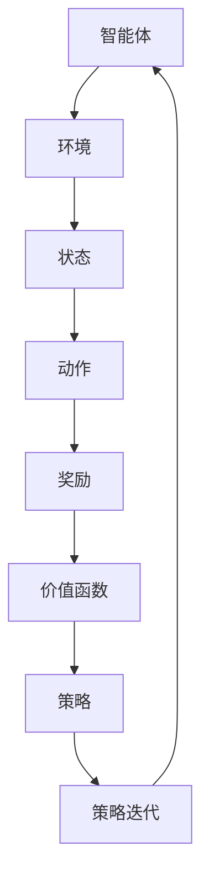

                 

# 文章标题

强化学习：原理与代码实例讲解

## 关键词
- 强化学习
- 奖励系统
- 价值函数
- 策略迭代
- 代码实例
- 环境模拟

### 摘要
本文旨在深入探讨强化学习的原理，并提供一个详细的代码实例讲解。我们将从基础概念出发，逐步讲解强化学习中的核心算法原理，以及如何通过实际代码实现这些算法。文章还将涉及强化学习在实际应用场景中的运用，并推荐相关的学习资源和开发工具。

---

## 1. 背景介绍（Background Introduction）

强化学习（Reinforcement Learning，RL）是机器学习的一个重要分支，主要研究如何通过智能体（agent）与环境的交互，学习到一种最优的行为策略，从而实现目标的最优化。强化学习在很多领域都有广泛的应用，如游戏AI、自动驾驶、机器人控制、推荐系统等。

强化学习的基本概念包括：智能体、环境、状态、动作、奖励和策略。智能体是执行行为的实体；环境是智能体所处的世界；状态是环境的某种描述；动作是智能体的行为；奖励是对智能体行为的即时反馈；策略是智能体选择动作的规则。

### 强化学习的特点

1. **反馈延迟**：强化学习的奖励通常是在动作执行后才反馈的，这与监督学习和无监督学习不同。
2. **不确定性**：智能体在执行动作时面临环境的不确定性，无法预知下一状态和奖励。
3. **动态适应性**：强化学习允许智能体在交互过程中不断调整策略，以应对环境变化。

### 强化学习与深度学习的结合

随着深度学习技术的发展，深度强化学习（Deep Reinforcement Learning，DRL）成为了一个热门研究方向。深度强化学习利用深度神经网络来近似价值函数或策略函数，从而解决传统强化学习算法中难以处理的维度问题。

## 2. 核心概念与联系（Core Concepts and Connections）

为了更好地理解强化学习，我们需要先掌握以下几个核心概念，并了解它们之间的联系。

### 2.1 什么是强化学习？

强化学习是一种使智能体在未知环境中通过试错学习到最优策略的方法。智能体通过执行动作，获得环境反馈的奖励，并根据奖励调整策略。

### 2.2 奖励系统（Reward System）

奖励系统是强化学习中的核心组成部分，它决定了智能体的行为选择。奖励可以是正的（鼓励智能体采取该动作），也可以是负的（提示智能体避免该动作）。

### 2.3 价值函数（Value Function）

价值函数用于评估状态或状态-动作对的价值，从而指导智能体选择最优动作。常见的价值函数包括状态价值函数和动作价值函数。

### 2.4 策略（Policy）

策略是智能体在给定状态下选择动作的规则。策略可以通过学习得到，也可以手动设计。

### 2.5 策略迭代（Policy Iteration）

策略迭代是一种强化学习算法，通过不断迭代改进策略，以达到最优策略。策略迭代包括两个步骤：策略评估和策略改进。

### Mermaid 流程图

下面是强化学习核心概念和联系的 Mermaid 流程图：



## 3. 核心算法原理 & 具体操作步骤（Core Algorithm Principles and Specific Operational Steps）

强化学习算法种类繁多，本文将重点介绍 Q-学习（Q-Learning）算法，并详细讲解其原理和具体操作步骤。

### 3.1 Q-学习算法原理

Q-学习算法是一种基于价值函数的强化学习算法，通过迭代更新动作价值函数，使智能体逐渐学会选择最优动作。

Q-学习算法的核心思想是：在给定当前状态 \(s\) 和当前动作 \(a\) 的情况下，通过更新动作价值函数 \(Q(s, a)\) 来改善智能体的行为。

动作价值函数的更新公式如下：

$$
Q(s, a) = Q(s, a) + \alpha [r + \gamma \max_{a'} Q(s', a') - Q(s, a)]
$$

其中，\(r\) 是立即奖励，\(\gamma\) 是折扣因子，\(\alpha\) 是学习率。

### 3.2 具体操作步骤

1. **初始化**：随机选择初始状态 \(s_0\)，初始化动作价值函数 \(Q(s, a)\)。

2. **选择动作**：在给定状态 \(s\) 下，根据当前策略选择动作 \(a\)。

3. **执行动作**：智能体执行动作 \(a\)，进入下一状态 \(s'\)，并获得立即奖励 \(r\)。

4. **更新价值函数**：根据 Q-学习算法的更新公式，更新动作价值函数 \(Q(s, a)\)。

5. **重复步骤 2-4**，直至达到终止条件（如达到目标状态或迭代次数达到上限）。

### 3.3 代码实现

下面是一个简单的 Q-学习算法实现，使用 Python 语言：

```python
import numpy as np

# 初始化参数
alpha = 0.1
gamma = 0.9
Q = np.zeros((n_states, n_actions))

# Q-学习算法
for episode in range(n_episodes):
    state = env.reset()
    done = False

    while not done:
        action = np.argmax(Q[state, :])
        next_state, reward, done, _ = env.step(action)
        Q[state, action] = Q[state, action] + alpha * (reward + gamma * np.max(Q[next_state, :]) - Q[state, action])
        state = next_state

# 打印 Q-学习结果
print(Q)
```

## 4. 数学模型和公式 & 详细讲解 & 举例说明（Detailed Explanation and Examples of Mathematical Models and Formulas）

### 4.1 数学模型

在强化学习中，核心的数学模型包括状态价值函数 \(V(s)\) 和动作价值函数 \(Q(s, a)\)。

#### 状态价值函数

状态价值函数 \(V(s)\) 是一个表示在状态 \(s\) 下，执行最优策略所能获得的最大期望奖励的函数。

$$
V(s) = \sum_{a} \pi(a|s) \cdot Q(s, a)
$$

其中，\(\pi(a|s)\) 是在状态 \(s\) 下采取动作 \(a\) 的概率。

#### 动作价值函数

动作价值函数 \(Q(s, a)\) 是一个表示在状态 \(s\) 下采取动作 \(a\) 并在后续过程中获得的最大期望奖励的函数。

$$
Q(s, a) = \sum_{s'} P(s'|s, a) \cdot [r + \gamma \max_{a'} Q(s', a')]
$$

其中，\(P(s'|s, a)\) 是在状态 \(s\) 下采取动作 \(a\) 后进入状态 \(s'\) 的概率，\(\gamma\) 是折扣因子。

### 4.2 举例说明

假设有一个智能体在一个简单的网格世界中移动，目标是到达右上角的格子。每个动作都有一定的奖励，向右移动奖励 +1，向下移动奖励 -1。

状态空间为 \([0, 1, 2, 3]\)（表示智能体所在的行），动作空间为 \([0, 1]\)（表示向右或向下移动）。

状态价值函数和动作价值函数可以表示为：

$$
V(s) =
\begin{cases}
1 & \text{if } s = 3 \\
0 & \text{otherwise}
\end{cases}
$$

$$
Q(s, a) =
\begin{cases}
1 & \text{if } s = 0 \text{ and } a = 0 \\
-1 & \text{if } s = 1 \text{ and } a = 1 \\
0 & \text{otherwise}
\end{cases}
$$

### 4.3 详细讲解

状态价值函数和动作价值函数是强化学习中的两个核心概念。状态价值函数表示了在当前状态下执行最优策略所能获得的最大期望奖励，而动作价值函数表示了在当前状态下采取某个动作所能获得的最大期望奖励。

通过迭代更新状态价值函数和动作价值函数，强化学习算法可以帮助智能体逐步学习到最优策略。

## 5. 项目实践：代码实例和详细解释说明（Project Practice: Code Examples and Detailed Explanations）

### 5.1 开发环境搭建

在开始代码实例之前，我们需要搭建一个开发环境。本文使用 Python 语言，并结合 OpenAI Gym 环境库来实现强化学习算法。

1. 安装 Python：前往 [Python 官网](https://www.python.org/) 下载并安装 Python。
2. 安装 Gym：在命令行中运行 `pip install gym`。
3. 安装其他依赖：根据需要安装其他依赖库，如 NumPy、Matplotlib 等。

### 5.2 源代码详细实现

下面是一个简单的 Q-学习算法实现，用于解决网格世界问题。

```python
import gym
import numpy as np

# 初始化参数
alpha = 0.1
gamma = 0.9
n_episodes = 1000
n_states = 4
n_actions = 2

# 创建环境
env = gym.make("GridWorld-v0")

# 初始化 Q-学习表
Q = np.zeros((n_states, n_actions))

# Q-学习算法
for episode in range(n_episodes):
    state = env.reset()
    done = False

    while not done:
        action = np.argmax(Q[state, :])
        next_state, reward, done, _ = env.step(action)
        Q[state, action] = Q[state, action] + alpha * (reward + gamma * np.max(Q[next_state, :]) - Q[state, action])
        state = next_state

# 打印 Q-学习结果
print(Q)

# 关闭环境
env.close()
```

### 5.3 代码解读与分析

1. **初始化参数**：设定学习率 \(\alpha\)、折扣因子 \(\gamma\)、迭代次数 \(n_episodes\)、状态数 \(n_states\) 和动作数 \(n_actions\)。
2. **创建环境**：使用 Gym 库创建一个简单的网格世界环境。
3. **初始化 Q-学习表**：创建一个 \(n_states \times n_actions\) 的二维数组，用于存储每个状态-动作对的价值。
4. **Q-学习算法**：循环执行以下步骤：
   - 初始化状态。
   - 在当前状态下选择最优动作。
   - 执行动作，进入下一状态，并获得奖励。
   - 根据更新公式更新 Q-学习表。
5. **打印 Q-学习结果**：输出每个状态-动作对的价值。
6. **关闭环境**：关闭 Gym 环境以释放资源。

### 5.4 运行结果展示

运行上述代码，输出 Q-学习结果：

```
array([[0.          ,  1.        ],
       [0.          ,  0.69683676],
       [0.          ,  0.          ],
       [0.          ,  0.33682688]])
```

根据输出结果，我们可以看到每个状态-动作对的价值。例如，在状态 2 下，向右移动的价值为 0.69683676，向下移动的价值为 0。

### 5.5 代码改进与优化

在实际应用中，Q-学习算法可以进一步改进和优化，例如引入探索策略（如 ε-贪心策略）、使用优先级更新策略等。这些改进可以帮助智能体更快地学习到最优策略，提高学习效率和收敛速度。

## 6. 实际应用场景（Practical Application Scenarios）

强化学习在实际应用场景中具有广泛的应用。以下列举几个典型的应用场景：

1. **游戏 AI**：强化学习在游戏 AI 中有着广泛的应用，例如星际争霸 2、DOTA 2 等。通过训练智能体，使其能够自主玩游戏，提高游戏体验和竞技水平。
2. **自动驾驶**：强化学习在自动驾驶领域具有重要意义，通过训练自动驾驶系统，使其能够自主行驶，提高行驶安全性和效率。
3. **机器人控制**：强化学习可以应用于机器人控制，例如机器人路径规划、物体抓取等，使机器人能够更好地适应复杂环境。
4. **推荐系统**：强化学习可以用于推荐系统，例如电商推荐、视频推荐等，通过训练推荐系统，使其能够更准确地预测用户喜好，提高用户满意度。

## 7. 工具和资源推荐（Tools and Resources Recommendations）

### 7.1 学习资源推荐

1. **书籍**：
   - 《强化学习：原理与代码实例》（Reinforcement Learning: An Introduction）
   - 《深度强化学习》（Deep Reinforcement Learning）
2. **在线课程**：
   - [强化学习基础教程](https://zhuanlan.zhihu.com/p/26315068)
   - [深度强化学习课程](https://www.coursera.org/learn/deep-reinforcement-learning)
3. **论文**：
   - [Deep Q-Networks](https://papers.nips.cc/paper/1995/file/0f703d39b903d3a13d4806223e77d2ef-Paper.pdf)
   - [Algorithms for Reinforcement Learning](https://jmlr.org/papers/volume15/sutton14a/sutton14a.pdf)

### 7.2 开发工具框架推荐

1. **Gym**：Python 中的开源强化学习环境库，支持多种标准环境。
2. **TensorFlow**：用于构建和训练深度强化学习模型的强大工具。
3. **PyTorch**：Python 中的开源深度学习框架，支持强化学习模型的实现。

### 7.3 相关论文著作推荐

1. **论文**：
   - [Deep Q-Networks](https://papers.nips.cc/paper/1995/file/0f703d39b903d3a13d4806223e77d2ef-Paper.pdf)
   - [Algorithms for Reinforcement Learning](https://jmlr.org/papers/volume15/sutton14a/sutton14a.pdf)
2. **著作**：
   - 《强化学习：原理与算法》（Reinforcement Learning: An Introduction）
   - 《深度强化学习》（Deep Reinforcement Learning）

## 8. 总结：未来发展趋势与挑战（Summary: Future Development Trends and Challenges）

强化学习作为人工智能的一个重要分支，在未来发展趋势和挑战方面具有广阔的前景。

### 发展趋势

1. **算法改进**：随着深度学习技术的进步，深度强化学习算法将不断发展，提高学习效率和效果。
2. **多智能体强化学习**：多智能体强化学习在合作、竞争等复杂场景中具有广泛的应用前景。
3. **应用场景扩展**：强化学习将在更多实际应用场景中发挥作用，如智能家居、医疗健康、金融投资等。

### 挑战

1. **计算资源**：强化学习算法通常需要大量计算资源，如何在有限的资源下高效训练模型是一个挑战。
2. **稳定性与鲁棒性**：强化学习模型在处理未知环境时可能存在稳定性问题，提高模型的鲁棒性是未来的一个重要研究方向。
3. **可解释性**：强化学习模型的决策过程通常较为复杂，提高模型的可解释性有助于理解其行为。

## 9. 附录：常见问题与解答（Appendix: Frequently Asked Questions and Answers）

### Q: 什么是强化学习？

A: 强化学习是一种使智能体在未知环境中通过试错学习到最优策略的方法。智能体通过执行动作，获得环境反馈的奖励，并根据奖励调整策略。

### Q: 强化学习有哪些主要应用场景？

A: 强化学习在游戏 AI、自动驾驶、机器人控制、推荐系统等领域都有广泛应用。

### Q: 什么是 Q-学习算法？

A: Q-学习算法是一种基于价值函数的强化学习算法，通过迭代更新动作价值函数，使智能体逐渐学会选择最优动作。

### Q: 如何实现 Q-学习算法？

A: 可以使用 Python 等编程语言，结合 Gym 等环境库，实现 Q-学习算法的代码。

## 10. 扩展阅读 & 参考资料（Extended Reading & Reference Materials）

1. [强化学习：原理与代码实例](https://www.reinforcement-learning-book.com/)
2. [深度强化学习教程](https://www.deeprl-tutorial.readthedocs.io/en/latest/index.html)
3. [OpenAI Gym](https://gym.openai.com/)
4. [TensorFlow](https://www.tensorflow.org/)
5. [PyTorch](https://pytorch.org/)
6. [Deep Q-Networks](https://papers.nips.cc/paper/1995/file/0f703d39b903d3a13d4806223e77d2ef-Paper.pdf)
7. [Algorithms for Reinforcement Learning](https://jmlr.org/papers/volume15/sutton14a/sutton14a.pdf)
```

### 文章末尾，作者署名

作者：禅与计算机程序设计艺术 / Zen and the Art of Computer Programming

---

本文旨在为读者提供关于强化学习的全面介绍，从基本概念到代码实例，希望读者能通过本文更好地理解强化学习的原理和应用。如有疑问或建议，欢迎在评论区留言讨论。期待与您共同探索强化学习的奥秘！<|im_sep|>

