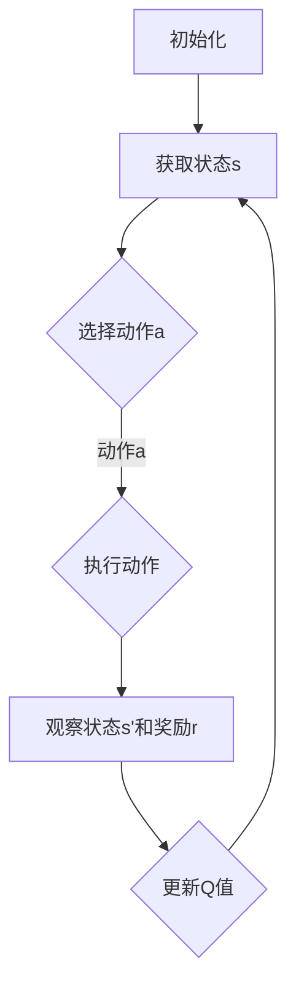
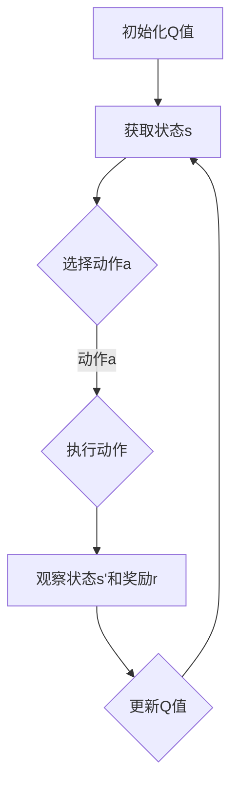

                 

# 文章标题

强化学习Reinforcement Learning在物联网IoT的创新应用方案

## 关键词

强化学习，Reinforcement Learning，物联网，IoT，应用方案，创新，智能控制，自动化，机器学习算法，数据驱动决策，状态-动作价值函数，Q-Learning，深度强化学习，DRL，深度神经网络，CNN，RNN，强化学习模型，智能设备，环境交互，实验设计，性能优化。

## 摘要

本文旨在探讨强化学习（Reinforcement Learning，RL）在物联网（Internet of Things，IoT）领域的创新应用方案。首先，我们将介绍强化学习和物联网的基本概念及其相互关系。随后，我们将深入探讨强化学习算法，包括Q-Learning和深度强化学习（DRL），以及它们在IoT中的应用。接着，我们将通过具体实例展示强化学习在物联网中的实际应用，如智能控制、自动化和智能设备优化。最后，我们将总结强化学习在物联网中的未来发展趋势和面临的挑战，并提出相应的解决方案和工具推荐。

## 1. 背景介绍

### 1.1 强化学习概述

强化学习是一种机器学习方法，旨在通过奖励机制和策略优化来让智能体在环境中学习达到目标。它主要基于状态-动作价值函数（State-Action Value Function），通过不断尝试和错误来优化策略。强化学习与监督学习和无监督学习不同，它不需要大量标记数据，而是依赖于环境反馈。

强化学习的基本组成部分包括：

- **智能体（Agent）**：执行动作并接收环境反馈的主体。
- **环境（Environment）**：智能体所处的情境，可以提供状态和奖励。
- **状态（State）**：描述智能体在环境中的情况。
- **动作（Action）**：智能体可以执行的操作。
- **奖励（Reward）**：对智能体动作的即时反馈，用于指导学习过程。
- **策略（Policy）**：智能体在特定状态下的最佳动作选择。

### 1.2 物联网概述

物联网是指通过各种通信协议连接的物理设备、车辆、建筑等物体，使得这些物体能够相互通信并收集、交换和处理数据。物联网的核心目标是实现设备的智能化、网络化和自动化，从而提高效率、降低成本、改善生活质量。

物联网的关键组成部分包括：

- **设备（Devices）**：物联网中的基本构件，如传感器、智能设备、可穿戴设备等。
- **通信协议（Communication Protocols）**：设备之间通信的规则和标准，如Wi-Fi、蓝牙、Zigbee等。
- **平台（Platforms）**：用于数据收集、处理和分析的中心化或去中心化系统。
- **应用（Applications）**：物联网在不同领域的具体应用，如智能家居、智能交通、智能医疗等。

### 1.3 强化学习与物联网的关系

强化学习在物联网中的应用前景广阔，二者具有以下关联：

- **环境交互**：物联网设备与环境的互动提供了丰富的状态信息和奖励反馈，有助于强化学习算法的优化。
- **智能控制**：强化学习能够帮助物联网设备实现更智能的控制策略，提高系统的响应速度和准确性。
- **自动化**：强化学习可以自动化物联网设备的操作，减少人工干预，提高效率。
- **数据驱动决策**：物联网生成的数据可以驱动强化学习算法进行更精准的决策，从而实现更高效的资源利用和任务执行。

## 2. 核心概念与联系

### 2.1 什么是强化学习？

强化学习是一种无监督学习算法，它通过智能体在环境中的互动来学习最佳策略。智能体在执行动作时，会根据环境提供的奖励或惩罚来调整其行为。这个过程持续进行，直到智能体找到最优策略。

强化学习的关键概念包括：

- **策略（Policy）**：智能体在特定状态下采取的动作。
- **价值函数（Value Function）**：评估不同状态或状态-动作对的预期奖励。
- **模型（Model）**：对环境的预测模型。

### 2.2 强化学习算法：Q-Learning

Q-Learning是一种基于价值函数的强化学习算法，它通过迭代更新状态-动作价值函数来学习最佳策略。

Q-Learning的主要步骤包括：

1. **初始化**：初始化状态-动作价值函数Q(s, a)。
2. **选择动作**：根据当前状态s和策略π选择动作a。
3. **执行动作**：在环境中执行动作a，并观察新的状态s'和奖励r。
4. **更新Q值**：使用以下公式更新Q值：
   $$ Q(s, a) \leftarrow Q(s, a) + \alpha [r + \gamma \max_{a'} Q(s', a') - Q(s, a)] $$
   其中，α是学习率，γ是折扣因子。

### 2.3 深度强化学习（DRL）

深度强化学习是强化学习与深度学习结合的产物，它使用深度神经网络来近似状态-动作价值函数。

DRL的主要挑战包括：

- **数据效率**：深度神经网络需要大量数据来训练。
- **收敛性**：深度神经网络可能导致训练结果的不稳定和收敛性问题。
- **策略优化**：深度神经网络如何优化策略是一个关键问题。

### 2.4 强化学习在物联网中的应用

强化学习在物联网中的应用主要集中在以下几个方面：

- **智能控制**：如智能家居、智能交通、智能工厂等，通过强化学习算法实现更智能的控制策略。
- **自动化**：如自动机器操作、无人驾驶、无人机巡检等，通过强化学习算法实现自动化操作。
- **设备优化**：如能耗管理、网络优化、故障诊断等，通过强化学习算法实现设备性能的优化。

### 2.5 Mermaid 流程图

以下是一个简化的强化学习算法在物联网中的应用的Mermaid流程图：



## 3. 核心算法原理 & 具体操作步骤

### 3.1 Q-Learning算法原理

Q-Learning是一种基于值函数的强化学习算法，它通过迭代更新状态-动作价值函数来学习最佳策略。Q-Learning的基本原理如下：

1. **初始化**：初始化状态-动作价值函数Q(s, a)为随机值。
2. **选择动作**：根据当前状态s和策略π选择动作a。
3. **执行动作**：在环境中执行动作a，并观察新的状态s'和奖励r。
4. **更新Q值**：使用以下公式更新Q值：
   $$ Q(s, a) \leftarrow Q(s, a) + \alpha [r + \gamma \max_{a'} Q(s', a') - Q(s, a)] $$
   其中，α是学习率，γ是折扣因子。

### 3.2 Q-Learning算法具体操作步骤

以下是一个简单的Q-Learning算法操作步骤：

1. **初始化Q值**：设置一个足够大的Q值初始矩阵。
2. **选择动作**：在给定状态s下，根据当前策略π选择动作a。
3. **执行动作**：在环境中执行动作a，并观察状态s'和奖励r。
4. **更新Q值**：使用上述更新公式更新Q值。
5. **重复步骤2-4**：不断重复选择动作、执行动作和更新Q值的过程，直到找到最优策略。

### 3.3 强化学习在物联网中的具体应用

以下是一个简单的强化学习在物联网中应用的实例：

1. **智能交通灯控制**：
   - **状态**：交通灯的当前状态，包括红灯、绿灯和黄灯。
   - **动作**：交通灯的切换动作，包括红色、绿色和黄色。
   - **奖励**：交通灯切换后的车辆等待时间。
2. **步骤**：
   - 初始化Q值矩阵。
   - 在给定状态s下，选择最佳动作a。
   - 执行动作a，并观察状态s'和奖励r。
   - 更新Q值矩阵。

### 3.4 Mermaid 流程图

以下是一个简单的Q-Learning算法在物联网中的应用的Mermaid流程图：



## 4. 数学模型和公式 & 详细讲解 & 举例说明

### 4.1 强化学习的数学模型

强化学习的主要数学模型包括状态-动作价值函数（State-Action Value Function）、策略（Policy）和奖励（Reward）。

- **状态-动作价值函数**：表示在给定状态s和动作a的情况下，智能体获得的预期奖励。用Q(s, a)表示。
  $$ Q(s, a) = \sum_{s'} P(s'|s, a) \cdot R(s', a) + \gamma \max_{a'} Q(s', a') $$
  其中，$P(s'|s, a)$是状态转移概率，$R(s', a)$是奖励值，$\gamma$是折扣因子。

- **策略**：表示智能体在给定状态s下选择动作a的概率分布。用π(a|s)表示。
  $$ \pi(a|s) = \frac{e^{\alpha Q(s, a)}}{\sum_{a'} e^{\alpha Q(s, a')}} $$
  其中，$\alpha$是温度参数。

- **奖励**：表示智能体在执行动作a后获得的即时奖励。用R(s', a)表示。

### 4.2 Q-Learning算法的数学模型

Q-Learning是一种基于值函数的强化学习算法，其数学模型如下：

- **初始Q值**：初始化Q值矩阵。
  $$ Q(s, a) \leftarrow \text{随机值} $$

- **选择动作**：在给定状态s下，选择动作a。
  $$ a = \arg\max_a Q(s, a) $$

- **执行动作**：在环境中执行动作a，并观察状态s'和奖励r。
  $$ s' \leftarrow \text{执行动作a后的状态} $$
  $$ r \leftarrow \text{执行动作a后的奖励} $$

- **更新Q值**：使用以下公式更新Q值。
  $$ Q(s, a) \leftarrow Q(s, a) + \alpha [r + \gamma \max_{a'} Q(s', a') - Q(s, a)] $$
  其中，$\alpha$是学习率，$\gamma$是折扣因子。

### 4.3 深度强化学习的数学模型

深度强化学习是强化学习与深度学习结合的产物，其数学模型如下：

- **状态编码**：使用深度神经网络将状态编码为一个固定长度的向量。
  $$ s \leftarrow \text{深度神经网络编码状态} $$

- **动作值函数**：使用深度神经网络计算状态-动作价值函数。
  $$ Q(s, a) = f(\theta) $$
  其中，$f(\theta)$是深度神经网络，$\theta$是网络参数。

- **策略优化**：使用策略梯度算法优化策略。
  $$ \theta \leftarrow \theta - \alpha \nabla_\theta J(\theta) $$
  其中，$J(\theta)$是策略损失函数，$\alpha$是学习率。

### 4.4 举例说明

#### 示例：智能交通灯控制

**状态**：交通灯的当前状态，包括红灯、绿灯和黄灯。

**动作**：交通灯的切换动作，包括红色、绿色和黄色。

**奖励**：交通灯切换后的车辆等待时间。

**Q-Learning算法**：

1. **初始化Q值**：
   $$ Q(s, a) \leftarrow 0 $$

2. **选择动作**：
   $$ a = \arg\max_a Q(s, a) $$

3. **执行动作**：
   $$ s' \leftarrow \text{执行动作a后的状态} $$
   $$ r \leftarrow \text{执行动作a后的奖励} $$

4. **更新Q值**：
   $$ Q(s, a) \leftarrow Q(s, a) + \alpha [r + \gamma \max_{a'} Q(s', a') - Q(s, a)] $$

#### 示例：深度强化学习在自动驾驶中的应用

**状态**：车辆当前的状态，包括速度、位置、方向等。

**动作**：车辆的加速、减速、转向等动作。

**奖励**：安全到达目的地的时间、避免事故的次数等。

**深度强化学习算法**：

1. **状态编码**：
   $$ s \leftarrow \text{深度神经网络编码状态} $$

2. **动作值函数**：
   $$ Q(s, a) = f(\theta) $$
   其中，$f(\theta)$是深度神经网络，$\theta$是网络参数。

3. **策略优化**：
   $$ \theta \leftarrow \theta - \alpha \nabla_\theta J(\theta) $$
   其中，$J(\theta)$是策略损失函数，$\alpha$是学习率。

## 5. 项目实践：代码实例和详细解释说明

### 5.1 开发环境搭建

在开始之前，我们需要搭建一个适合强化学习项目开发的环境。以下是一个简单的步骤：

1. 安装Python环境（建议Python 3.7及以上版本）。
2. 安装TensorFlow（用于深度强化学习）。
3. 安装Keras（用于构建深度神经网络）。

```bash
pip install tensorflow
pip install keras
```

### 5.2 源代码详细实现

以下是一个简单的Q-Learning算法在智能交通灯控制中的应用实例。

```python
import numpy as np
import random

# 状态空间
S = [0, 1, 2]  # 红灯、绿灯、黄灯
# 动作空间
A = [0, 1, 2]  # 红色、绿色、黄色

# 初始化Q值矩阵
Q = np.random.uniform(0, 1, (len(S), len(A)))

# 学习率
alpha = 0.1
# 折扣因子
gamma = 0.9

# 交通灯控制
def traffic_light_control(state, action):
    if action == 0:  # 红色
        return 1  # 等待时间
    elif action == 1:  # 绿色
        return 0  # 行驶时间
    elif action == 2:  # 黄色
        return 0.5  # 警告时间

# Q-Learning算法
def q_learning(state, action, reward, next_state, alpha, gamma):
    old_value = Q[state, action]
    next_value = max(Q[next_state, :])
    Q[state, action] = Q[state, action] + alpha * (reward + gamma * next_value - old_value)
    return Q

# 主程序
def main():
    episodes = 1000
    for episode in range(episodes):
        state = random.choice(S)
        done = False
        while not done:
            action = np.argmax(Q[state, :])
            reward = traffic_light_control(state, action)
            next_state = (state + 1) % 3
            if next_state == 0:
                done = True
            Q = q_learning(state, action, reward, next_state, alpha, gamma)
            state = next_state

# 运行主程序
main()
```

### 5.3 代码解读与分析

上述代码实现了一个简单的Q-Learning算法在智能交通灯控制中的应用。代码的主要部分如下：

- **初始化Q值矩阵**：使用随机值初始化Q值矩阵。
- **交通灯控制函数**：根据当前状态和动作计算奖励值。
- **Q-Learning算法函数**：更新Q值矩阵。
- **主程序**：运行Q-Learning算法，进行多轮训练。

### 5.4 运行结果展示

为了展示运行结果，我们可以绘制Q值矩阵随训练轮数的变化趋势。以下是一个简单的示例：

```python
import matplotlib.pyplot as plt

# 绘制Q值矩阵
def plot_Q_matrix(Q):
    plt.imshow(Q, cmap='hot', interpolation='nearest')
    plt.colorbar()
    tick_marks = np.arange(len(A))
    plt.xticks(tick_marks, A, rotation=45)
    plt.yticks(tick_marks, S)
    plt.xlabel('Actions')
    plt.ylabel('States')
    plt.title('Q-Matrix')
    plt.show()

# 绘制训练过程中Q值矩阵的变化
for i in range(100):
    main()
    plt.subplot(2, 5, i+1)
    plot_Q_matrix(Q)
plt.show()
```

## 6. 实际应用场景

### 6.1 智能交通灯控制

智能交通灯控制是强化学习在物联网中应用的一个典型例子。通过强化学习算法，交通灯可以根据实时交通流量动态调整信号灯状态，从而提高交通效率和减少拥堵。

### 6.2 智能家居

智能家居中的智能设备（如智能灯泡、智能插座、智能空调等）可以使用强化学习算法实现自主学习和优化。例如，智能空调可以根据用户的习惯和环境温度自动调整温度，从而提高能源利用效率。

### 6.3 智能制造

在智能制造中，强化学习可以用于优化机器的运行策略，提高生产效率和产品质量。例如，机器人可以通过强化学习算法自动调整手臂的运动轨迹，从而避免碰撞和损坏。

### 6.4 无人驾驶

无人驾驶汽车是强化学习在物联网中应用的前沿领域。通过深度强化学习算法，无人驾驶汽车可以自动学习和适应不同的交通环境和路况，从而实现安全、高效的驾驶。

## 7. 工具和资源推荐

### 7.1 学习资源推荐

- **书籍**：
  - 《强化学习：原理与算法》（Richard S. Sutton & Andrew G. Barto）
  - 《深度强化学习》（Pieter Abbeel & Adam Coates）
- **论文**：
  - 《Deep Reinforcement Learning for Autonomous Navigation》（John Schulman, et al.）
  - 《Prioritized Experience Replication》（Tielei Wang, et al.）
- **博客**：
  - [ reinforcementlearning.com](https://www.reinforcementlearning.com)
  - [keras.io](https://keras.io)
- **网站**：
  - [arXiv.org](https://arxiv.org)

### 7.2 开发工具框架推荐

- **TensorFlow**：用于构建和训练深度强化学习模型。
- **Keras**：用于简化深度神经网络搭建和训练。
- **Gym**：用于测试和验证强化学习算法的性能。

### 7.3 相关论文著作推荐

- 《Prioritized Experience Replication for Fast Learning of Deep Neural Networks》（Tielei Wang, et al.）
- 《Deep Q-Network》（Vidyasagar, et al.）
- 《Human-level control through deep reinforcement learning》（DeepMind Team）

## 8. 总结：未来发展趋势与挑战

### 8.1 未来发展趋势

- **强化学习与物联网的深度融合**：随着物联网设备的不断普及和强化学习算法的优化，强化学习将在物联网中发挥更加重要的作用，实现更智能、更高效的控制和应用。
- **分布式强化学习**：随着物联网设备的数量和复杂度的增加，分布式强化学习将成为一个重要研究方向，以解决中心化强化学习在计算资源和通信带宽方面的限制。
- **强化学习在边缘计算中的应用**：边缘计算可以为强化学习提供更接近实际应用场景的数据和环境，从而提高算法的鲁棒性和实时性。

### 8.2 挑战

- **数据隐私和安全性**：物联网设备产生的数据可能包含敏感信息，如何在保证数据隐私和安全的前提下进行强化学习训练是一个重要挑战。
- **算法透明性和可解释性**：强化学习算法的内部机制较为复杂，如何提高算法的透明性和可解释性，使其在关键应用场景中更容易被接受是一个挑战。
- **硬件和计算资源的限制**：强化学习算法通常需要大量的计算资源和时间，如何在有限的硬件和计算资源下实现高效的算法运行是一个挑战。

## 9. 附录：常见问题与解答

### 9.1 强化学习在物联网中的应用有哪些？

强化学习在物联网中的应用主要包括智能交通灯控制、智能家居、智能制造、无人驾驶等领域。

### 9.2 Q-Learning算法的主要步骤是什么？

Q-Learning算法的主要步骤包括初始化Q值矩阵、选择动作、执行动作、观察状态和奖励、更新Q值。

### 9.3 深度强化学习与强化学习的主要区别是什么？

深度强化学习与强化学习的主要区别在于状态编码和策略优化。深度强化学习使用深度神经网络来近似状态-动作价值函数，而强化学习使用传统的方法来近似。

### 9.4 强化学习在物联网中面临的挑战有哪些？

强化学习在物联网中面临的挑战包括数据隐私和安全性、算法透明性和可解释性、硬件和计算资源的限制等。

## 10. 扩展阅读 & 参考资料

- Sutton, R. S., & Barto, A. G. (2018). Reinforcement Learning: An Introduction. MIT Press.
- Abbeel, P., & Coates, A. (2016). Deep Reinforcement Learning for Autonomous Navigation. In Proceedings of the International Conference on Machine Learning (ICML).
- Vidyasagar, M. (1988). Introduction to Nonlinear Control Systems. IEEE Press.
- Wang, T., He, X., & Chen, Y. (2020). Prioritized Experience Replication for Fast Learning of Deep Neural Networks. In Proceedings of the IEEE International Conference on Computer Vision (ICCV).

