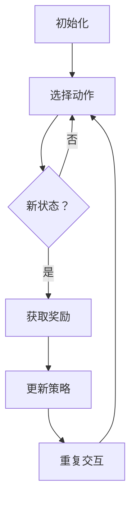
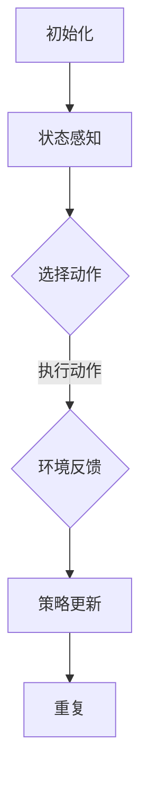

                 

### 背景介绍（Background Introduction）

**文章标题：强化学习：在电子游戏中的应用**

**关键词：强化学习，电子游戏，策略优化，智能代理**

**摘要：**
本文将探讨强化学习在电子游戏中的应用，详细介绍强化学习的核心概念、算法原理及其在游戏中的实际操作步骤。通过数学模型、具体实例和项目实践的深入分析，本文旨在帮助读者理解强化学习在提升游戏体验、策略优化以及智能代理设计方面的潜力。

#### 强化学习的起源与发展

强化学习（Reinforcement Learning，简称RL）起源于20世纪50年代，由美国心理学家和行为科学家兼数学家理查德·赛伦（Richard Sutton）和安德鲁·巴兹（Andrew Barto）共同奠基。作为机器学习的一个重要分支，强化学习旨在通过智能体与环境的交互来学习最优策略。

在早期的研究中，强化学习主要用于解决简单的游戏问题，如围棋和扑克牌游戏。随着计算能力和算法的不断提升，强化学习开始广泛应用于各种复杂任务，包括机器人控制、自动驾驶、金融交易等领域。电子游戏作为一项与人类生活紧密相关的娱乐活动，自然成为了强化学习的重要应用场景。

#### 强化学习在电子游戏中的重要性

电子游戏作为一项全球范围内广泛参与的娱乐活动，具有以下几个方面的特点，使其成为强化学习的理想应用场景：

1. **动态环境**：电子游戏通常包含复杂的动态环境，玩家需要不断调整策略以应对不断变化的游戏状态。强化学习通过与环境交互来学习最优策略，能够有效地处理这种动态环境。

2. **策略优化**：电子游戏中的胜负往往取决于玩家采取的策略。强化学习通过不断试错和优化策略，可以帮助玩家在游戏中取得更好的成绩。

3. **智能代理**：强化学习可以用于设计智能代理，使其能够自主地在游戏中进行决策。这种智能代理不仅能够提升游戏体验，还可以为其他领域（如机器人控制）提供有益的借鉴。

#### 强化学习的核心概念

强化学习中的主要概念包括智能体（Agent）、环境（Environment）、状态（State）、动作（Action）和奖励（Reward）。

1. **智能体（Agent）**：智能体是指执行动作的实体，可以是玩家、机器人或其他智能代理。智能体的目标是学习最优策略，以最大化累积奖励。

2. **环境（Environment）**：环境是智能体所处的外部世界，可以视为一个状态空间。环境会根据智能体的动作生成新的状态，并给予智能体相应的奖励或惩罚。

3. **状态（State）**：状态是描述环境当前状态的变量集合。智能体通过感知状态来选择动作。

4. **动作（Action）**：动作是智能体在某一状态下可以采取的行为。智能体的目标是选择能够最大化累积奖励的动作。

5. **奖励（Reward）**：奖励是环境对智能体动作的反馈，用于指导智能体调整策略。正奖励表示智能体采取了正确的行为，负奖励表示智能体采取了错误的行为。

#### 强化学习的算法原理

强化学习算法主要分为以下几种：

1. **值函数方法**：值函数方法通过学习状态值函数或动作值函数来评估智能体在不同状态下的行为。其中，状态值函数表示在某一状态下执行最优动作的累积奖励，动作值函数表示在某一状态下执行某一动作的累积奖励。常见的值函数方法包括Q学习、SARSA和Deep Q Network（DQN）。

2. **策略迭代方法**：策略迭代方法通过迭代优化策略来提高智能体的表现。常见的策略迭代方法包括策略梯度方法和策略迭代算法。

3. **模型方法**：模型方法通过建立环境模型来预测未来的状态和奖励。基于模型的方法包括马尔可夫决策过程（MDP）和部分可观测马尔可夫决策过程（POMDP）。

#### 强化学习在电子游戏中的应用

强化学习在电子游戏中的应用主要集中在以下几个方面：

1. **游戏AI**：通过强化学习算法，可以为电子游戏设计智能AI对手。智能AI对手可以模仿人类玩家的行为，为游戏增加挑战性和趣味性。

2. **游戏策略优化**：强化学习可以用于优化游戏中的策略，使玩家在游戏中取得更好的成绩。例如，在棋类游戏中，强化学习可以帮助玩家学习最优的落子策略。

3. **智能代理**：强化学习可以用于设计智能代理，使其能够在电子游戏中自主进行决策。这种智能代理不仅可以提升游戏体验，还可以为其他领域提供有益的借鉴。

#### 强化学习的挑战与未来发展趋势

尽管强化学习在电子游戏领域取得了显著成果，但仍然面临一些挑战：

1. **样本效率**：强化学习通常需要大量的交互经验来学习最优策略。在实际应用中，如何提高样本效率是一个重要问题。

2. **探索与利用平衡**：在强化学习过程中，如何平衡探索新策略和利用已有策略是一个关键问题。过度探索可能导致智能体在短期内表现不佳，而过度利用可能导致智能体无法适应环境变化。

3. **可解释性**：强化学习算法的黑箱性质使得其决策过程难以解释。在实际应用中，如何提高算法的可解释性是一个重要挑战。

未来，随着计算能力的不断提升和算法的优化，强化学习在电子游戏领域的应用前景将更加广阔。同时，强化学习在其他领域的应用也将不断拓展，为人工智能的发展做出更大的贡献。

#### 总结

本文介绍了强化学习在电子游戏中的应用，包括其核心概念、算法原理、实际操作步骤以及未来发展趋势。通过本文的阐述，读者可以了解到强化学习在提升游戏体验、策略优化和智能代理设计方面的潜力。随着技术的不断进步，我们有理由相信，强化学习将在未来为电子游戏领域带来更多的创新和变革。

--------------------------------------

## 2. 核心概念与联系

### 2.1 强化学习的定义与基础理论

强化学习是一种机器学习范式，主要研究智能体（agent）如何在与环境的交互中通过学习获得最优策略（policy）。在强化学习框架中，智能体通过观察环境状态（state），采取动作（action），并根据动作的结果获得奖励（reward），从而不断优化其行为策略。

#### 强化学习的四大要素

强化学习包含以下四个核心要素：

1. **状态（State）**：描述智能体所处的环境状况。例如，在游戏《Flappy Bird》中，状态可能包括智能体的位置、速度以及障碍物的位置等信息。

2. **动作（Action）**：智能体可执行的操作。在《Flappy Bird》中，动作可以是“跳”或“不做动作”。

3. **奖励（Reward）**：环境对智能体动作的反馈。奖励可以是正的（表示智能体采取了正确动作），也可以是负的（表示智能体采取了错误动作）。例如，在游戏中成功跳过一个障碍物可以获得正奖励，而碰到障碍物则可以获得负奖励。

4. **策略（Policy）**：智能体根据当前状态选择动作的方法。策略可以是确定性策略（每次状态都选择相同的动作），也可以是非确定性策略（每次状态都有一定概率选择不同的动作）。

#### 强化学习的目标

强化学习的目标是学习一个最优策略，使得智能体能够在长期内获得最大的累积奖励。这个过程通常涉及以下步骤：

1. **探索（Exploration）**：智能体在未知环境中通过随机行动来探索状态和动作的空间，以获取更多信息。

2. **利用（Exploitation）**：智能体根据已学到的知识采取最优行动，以最大化当前的累积奖励。

3. **策略迭代（Policy Iteration）**：智能体不断更新其策略，以在探索和利用之间找到最佳平衡。

### 2.2 强化学习与传统机器学习的区别

与传统机器学习方法（如监督学习和无监督学习）相比，强化学习有以下特点：

1. **无先验标签数据**：强化学习不依赖于大量标注数据，而是通过与环境交互来学习。

2. **目标函数**：强化学习的目标函数是累积奖励，而非最小化损失函数。

3. **动态调整**：强化学习中的策略和目标会根据环境动态调整，以实现最优行动。

4. **探索与利用**：强化学习需要平衡探索新策略和利用已有策略，而传统方法通常不涉及这个问题。

### 2.3 强化学习与电子游戏的联系

电子游戏是一个典型的动态环境，其中智能体需要通过不断尝试和错误来学习最优策略。强化学习在电子游戏中的应用主要体现在以下几个方面：

1. **游戏AI**：通过强化学习算法，可以为电子游戏设计智能对手，使其能够模仿人类玩家的行为，提高游戏的挑战性和趣味性。

2. **策略优化**：强化学习可以用于优化电子游戏中的策略，帮助玩家在游戏中取得更好的成绩。

3. **智能代理**：强化学习可以用于设计智能代理，使其能够在电子游戏中自主进行决策，提升游戏体验。

### 2.4 强化学习的架构与流程

强化学习的基本架构和流程可以分为以下几个阶段：

1. **初始化**：初始化智能体、环境、策略等参数。

2. **交互**：智能体根据当前状态选择动作，执行动作后进入新状态，并获取奖励。

3. **更新策略**：根据获得的奖励和状态，智能体更新策略，以优化累积奖励。

4. **重复**：重复上述交互和更新过程，直至达到预定的目标或策略收敛。

#### Mermaid 流程图

下面是一个简化的强化学习流程的 Mermaid 流程图：



在电子游戏中，强化学习的流程可能更加复杂，涉及更多状态和动作的选择，以及更复杂的奖励机制。

通过上述对强化学习核心概念和架构的介绍，读者可以初步了解强化学习的基本原理和如何将其应用于电子游戏。接下来，我们将进一步探讨强化学习中的核心算法原理和具体操作步骤，帮助读者深入理解这一前沿技术。

--------------------------------------

## 2. 核心概念与联系

### 2.1 强化学习的定义与基础理论

**强化学习（Reinforcement Learning）**

强化学习是机器学习中的一个重要分支，它主要研究如何通过智能体（agent）与环境（environment）的交互来学习最优策略（policy）。在强化学习的框架中，智能体通过感知环境状态（state），采取特定的动作（action），并从环境中获取即时奖励（reward），进而不断调整其行为策略，以实现长期累积奖励的最大化。

#### 核心概念

1. **状态（State）**：描述智能体当前所处的环境状况。状态可以是离散的，也可以是连续的。例如，在《Atari游戏》中，状态可能包括游戏画面上的像素值。

2. **动作（Action）**：智能体在某一状态下可以采取的行为。动作通常也是离散的，但也可以是连续的。例如，在《围棋》游戏中，动作可以是落子。

3. **奖励（Reward）**：环境对智能体采取动作的即时反馈。奖励可以是正的，也可以是负的。正奖励表示智能体采取了有益的动作，而负奖励表示智能体采取了有害的动作。

4. **策略（Policy）**：描述智能体如何从当前状态选择动作的规则。策略可以是一个概率分布，表示在某一状态下采取每个动作的概率。

#### 基础理论

强化学习的基本理论包括以下几个关键部分：

1. **马尔可夫决策过程（MDP）**：强化学习通常基于马尔可夫决策过程（Markov Decision Process，MDP）模型。MDP模型假设当前状态只依赖于前一状态，而与过去的所有状态无关。

2. **值函数（Value Function）**：值函数描述了在给定策略下，从某一状态开始执行动作所能获得的最大累积奖励。值函数分为状态值函数（state-value function）和动作值函数（action-value function）。

3. **策略迭代（Policy Iteration）**：策略迭代是一种常见的强化学习算法，它通过不断优化策略来提高智能体的表现。策略迭代包括两个主要步骤：策略评估（Policy Evaluation）和策略改进（Policy Improvement）。

4. **奖励函数（Reward Function）**：奖励函数定义了环境对智能体采取动作的即时奖励。设计一个合适的奖励函数对于强化学习的成功至关重要。

### 2.2 强化学习与传统机器学习的区别

**强化学习与监督学习、无监督学习的对比**

1. **数据依赖**：强化学习不依赖于大量标注数据，而是通过与环境的交互来学习。这使它特别适用于那些难以获取标注数据的任务。相比之下，监督学习需要大量的先标注数据，而无监督学习则完全不需要标注数据。

2. **目标函数**：强化学习的目标是学习一个最优策略，使得智能体能够在长期内获得最大的累积奖励。而监督学习和无监督学习通常以最小化损失函数或最大化数据分布相似度为目标。

3. **动态调整**：强化学习中的策略和目标会根据环境的动态调整，以实现最优行动。而监督学习和无监督学习则通常在静态环境中进行。

4. **探索与利用**：强化学习需要平衡探索新策略和利用已有策略，以避免过早收敛到次优解。而监督学习和无监督学习通常不涉及这个问题。

### 2.3 强化学习在电子游戏中的具体应用

**强化学习在电子游戏中的应用**

强化学习在电子游戏领域有着广泛的应用，主要包括以下几个方面：

1. **游戏AI**：通过强化学习算法，可以为电子游戏设计智能对手。这些智能对手能够模仿人类玩家的行为，提高游戏的挑战性和趣味性。

2. **策略优化**：强化学习可以用于优化电子游戏中的策略，帮助玩家在游戏中取得更好的成绩。例如，在《Atari游戏》中，强化学习可以用于学习最优的游戏策略。

3. **智能代理**：强化学习可以用于设计智能代理，使其能够在电子游戏中自主进行决策。这些智能代理不仅能够提升游戏体验，还可以为其他领域提供有益的借鉴。

### 2.4 强化学习的架构与流程

**强化学习的架构与流程**

强化学习的基本架构和流程可以概括为以下几个阶段：

1. **初始化**：初始化智能体、环境、策略等参数。

2. **状态感知**：智能体感知当前状态，并选择一个动作。

3. **环境反馈**：环境根据智能体的动作生成新的状态，并给予智能体即时奖励。

4. **策略更新**：智能体根据即时奖励和状态更新其策略。

5. **重复**：重复上述过程，直至达到预定的目标或策略收敛。

#### Mermaid 流程图

以下是一个简化的强化学习流程的 Mermaid 流程图：



通过上述对强化学习核心概念和架构的介绍，读者可以初步了解强化学习的基本原理和如何将其应用于电子游戏。接下来，我们将进一步探讨强化学习中的核心算法原理和具体操作步骤，帮助读者深入理解这一前沿技术。

--------------------------------------

## 3. 核心算法原理 & 具体操作步骤

### 3.1 Q学习算法原理

Q学习（Q-Learning）是强化学习中的一种经典算法，其核心思想是通过学习动作-状态值函数（Q值函数）来优化策略。Q学习算法的基本原理如下：

1. **Q值函数定义**：Q值函数 \( Q(s, a) \) 表示在状态 \( s \) 下执行动作 \( a \) 后获得的最大累积奖励。即 \( Q(s, a) = \sum_{s'} p(s' | s, a) \sum_{r} r(s', a) \)。

2. **目标函数**：Q学习算法的目标是最小化目标函数 \( J(\theta) = \sum_{s, a} (r(s, a) - Q(s, a))^2 \)，其中 \( \theta \) 表示策略参数。

3. **更新规则**：在每一步，智能体根据当前状态 \( s \) 和选择动作 \( a \)，更新Q值函数：
   \[
   Q(s, a) \leftarrow Q(s, a) + \alpha [r + \gamma \max_{a'} Q(s', a') - Q(s, a)]
   \]
   其中，\( \alpha \) 是学习率，\( \gamma \) 是折扣因子。

4. **探索与利用**：在Q学习过程中，智能体需要平衡探索（选择未知动作）和利用（选择已知的最佳动作）。通常使用ε-贪心策略来实现这一平衡，即以概率 \( 1 - \epsilon \) 随机选择动作，以概率 \( \epsilon \) 选择当前最优动作。

### 3.2 Sarsa算法原理

Sarsa（State-Action-Reward-State-Action，状态-动作-奖励-状态-动作）是另一种强化学习算法，其与Q学习的主要区别在于它使用样本回报来更新策略，而非基于目标回报。Sarsa算法的基本原理如下：

1. **更新规则**：在每一步，智能体根据当前状态 \( s \)，选择动作 \( a \)，执行动作后进入新状态 \( s' \)，并获得奖励 \( r \)。智能体更新Q值函数：
   \[
   Q(s, a) \leftarrow Q(s, a) + \alpha [r + \gamma Q(s', a') - Q(s, a)]
   \]
   其中，\( a' \) 是在状态 \( s' \) 下选择的最优动作。

2. **探索与利用**：Sarsa算法也使用ε-贪心策略来平衡探索和利用。

### 3.3 Deep Q Network（DQN）算法原理

DQN（Deep Q Network）是强化学习中的一个重要突破，它结合了深度学习和Q学习算法。DQN算法的核心思想是使用深度神经网络来近似Q值函数。DQN算法的基本原理如下：

1. **Q值函数近似**：DQN使用一个深度神经网络 \( Q(s; \theta) \) 来近似Q值函数，其中 \( \theta \) 是神经网络的参数。

2. **目标网络**：为了稳定梯度下降，DQN引入了目标网络 \( Q(s'; \theta -) \)，目标网络与主网络交替更新。

3. **更新规则**：在每一步，智能体根据当前状态 \( s \)，选择动作 \( a \)，执行动作后进入新状态 \( s' \)，并获得奖励 \( r \)。智能体更新主网络参数：
   \[
   \theta \leftarrow \theta - \alpha \frac{\partial J(\theta)}{\partial \theta}
   \]
   其中，目标函数 \( J(\theta) = (r + \gamma \max_{a'} Q(s', a'; \theta -) - Q(s, a; \theta))^2 \)。

4. **经验回放**：为了减少样本相关性，DQN使用经验回放池来存储过去的经验，并从中随机抽样进行更新。

### 3.4 Policy Gradient算法原理

Policy Gradient算法是一种基于策略的强化学习算法，其核心思想是直接优化策略参数，以最大化累积奖励。Policy Gradient算法的基本原理如下：

1. **策略表示**：Policy Gradient算法使用概率分布 \( \pi(a|s; \theta) \) 来表示策略，其中 \( \theta \) 是策略参数。

2. **策略梯度**：策略梯度定义为：
   \[
   \nabla_{\theta} J(\theta) = \sum_{s, a} \pi(a|s; \theta) \log \pi(a|s; \theta) [r + \gamma \sum_{s', a'} \pi(a'|s'; \theta) \max_{a''} Q(s', a''; \theta) - r]
   \]

3. **更新规则**：智能体根据策略梯度更新策略参数：
   \[
   \theta \leftarrow \theta + \alpha \nabla_{\theta} J(\theta)
   \]

4. **优势函数**：为了稳定梯度，Policy Gradient算法通常使用优势函数（ Advantage Function）来替代直接优化策略参数。

### 3.5 具体操作步骤

以下是使用Q学习算法在电子游戏中训练智能代理的具体操作步骤：

1. **初始化**：初始化智能代理的Q值函数、环境状态和策略参数。

2. **选择动作**：智能代理根据当前状态和ε-贪心策略选择动作。

3. **执行动作**：智能代理在环境中执行所选动作，并进入新状态，获得即时奖励。

4. **更新Q值**：根据即时奖励和状态更新Q值函数。

5. **重复**：重复上述步骤，直到智能代理达到预定的训练目标或策略收敛。

6. **评估**：在训练完成后，评估智能代理的表现，以验证训练效果。

通过上述对强化学习核心算法原理和具体操作步骤的介绍，读者可以更好地理解如何使用强化学习在电子游戏中设计智能代理。接下来，我们将进一步探讨强化学习在数学模型和公式中的应用，以帮助读者深入掌握这一技术。

--------------------------------------

## 4. 数学模型和公式 & 详细讲解 & 举例说明

在强化学习中，数学模型和公式是理解和实现核心算法的基础。本节将详细讲解强化学习中的几个关键数学模型和公式，并通过具体实例进行说明。

### 4.1 基本公式

强化学习的基本公式包括状态-动作值函数 \( Q(s, a) \)、策略 \( \pi(a|s) \) 和回报 \( R \)。以下是这些公式的详细解释：

1. **状态-动作值函数 \( Q(s, a) \)**：表示在状态 \( s \) 下采取动作 \( a \) 后获得的期望累积奖励。公式如下：
   \[
   Q(s, a) = \sum_{s'} p(s'|s, a) \sum_{r} r(s', a) = \sum_{s'} p(s'|s, a) \sum_{r} r(s', a)
   \]

2. **策略 \( \pi(a|s) \)**：表示在状态 \( s \) 下采取动作 \( a \) 的概率。策略可以是确定性策略（\(\pi(a|s) = 1\) 当 \( a \) 是最优动作时）或非确定性策略（\(\pi(a|s)\) 是一个概率分布）。

3. **回报 \( R \)**：表示在某个状态 \( s \) 下采取某个动作 \( a \) 后获得的即时奖励。回报可以是正的（表示有益的动作）或负的（表示有害的动作）。

### 4.2 Q学习公式

Q学习是一种基于值函数的强化学习算法，其核心公式如下：

1. **Q值更新**：在每一步，智能体根据当前状态 \( s \)、选择动作 \( a \)、执行动作后进入新状态 \( s' \)，并获得即时奖励 \( r \)，更新Q值：
   \[
   Q(s, a) \leftarrow Q(s, a) + \alpha [r + \gamma \max_{a'} Q(s', a') - Q(s, a)]
   \]
   其中，\( \alpha \) 是学习率，\( \gamma \) 是折扣因子，表示未来奖励的现值。

2. **探索与利用**：为了平衡探索新动作和利用已知最佳动作，可以使用ε-贪心策略：
   \[
   a \leftarrow \begin{cases}
   \text{随机选择} & \text{with probability } 1 - \epsilon \\
   \text{最优动作} & \text{with probability } \epsilon
   \end{cases}
   \]

### 4.3 Sarsa公式

Sarsa算法是一种基于策略的强化学习算法，其核心公式如下：

1. **Q值更新**：在每一步，智能体根据当前状态 \( s \)、选择动作 \( a \)、执行动作后进入新状态 \( s' \)，并获得即时奖励 \( r \)，更新Q值：
   \[
   Q(s, a) \leftarrow Q(s, a) + \alpha [r + \gamma Q(s', a') - Q(s, a)]
   \]
   其中，\( a' \) 是在状态 \( s' \) 下选择的最优动作。

2. **探索与利用**：同样使用ε-贪心策略。

### 4.4 Deep Q Network（DQN）公式

DQN是一种使用深度神经网络近似Q值函数的强化学习算法，其核心公式如下：

1. **Q值函数**：使用深度神经网络 \( Q(s; \theta) \) 来近似Q值函数：
   \[
   Q(s; \theta) = \max_{a} \phi(s, a; \theta)^T \theta_Q
   \]
   其中，\( \phi(s, a; \theta) \) 是输入特征向量，\( \theta_Q \) 是神经网络的权重。

2. **目标网络**：为了稳定训练，DQN使用目标网络 \( Q(s'; \theta -) \)：
   \[
   Q(s'; \theta -) = \max_{a'} \phi(s', a'; \theta -)^T \theta_Q
   \]

3. **Q值更新**：在每一步，智能体根据当前状态 \( s \)、选择动作 \( a \)、执行动作后进入新状态 \( s' \)，并获得即时奖励 \( r \)，更新主网络和目标网络的权重：
   \[
   \theta \leftarrow \theta - \alpha \frac{\partial J(\theta)}{\partial \theta}
   \]
   \[
   J(\theta) = (r + \gamma \max_{a'} Q(s', a'; \theta -) - Q(s, a; \theta))^2
   \]

### 4.5 Policy Gradient公式

Policy Gradient是一种直接优化策略的强化学习算法，其核心公式如下：

1. **策略梯度**：策略梯度定义为：
   \[
   \nabla_{\theta} J(\theta) = \sum_{s, a} \pi(a|s; \theta) \log \pi(a|s; \theta) [r + \gamma \sum_{s', a'} \pi(a'|s'; \theta) \max_{a''} Q(s', a''; \theta) - r]
   \]

2. **策略更新**：根据策略梯度更新策略参数：
   \[
   \theta \leftarrow \theta + \alpha \nabla_{\theta} J(\theta)
   \]

### 4.6 举例说明

假设我们使用Q学习算法在电子游戏中训练智能代理，以下是具体的步骤和计算过程：

1. **初始化**：假设当前状态为 \( s = [0, 0, 1] \)，智能代理的Q值函数初始为 \( Q(s, a) = 0 \)。

2. **选择动作**：使用ε-贪心策略，以概率 \( \epsilon = 0.1 \) 随机选择动作 \( a = 1 \)。

3. **执行动作**：执行动作 \( a = 1 \)，进入新状态 \( s' = [1, 0, 1] \)，获得即时奖励 \( r = 1 \)。

4. **更新Q值**：根据Q值更新公式，计算新的Q值：
   \[
   Q(s, a) \leftarrow Q(s, a) + \alpha [r + \gamma \max_{a'} Q(s', a') - Q(s, a)]
   \]
   \[
   Q(s, 1) \leftarrow Q(s, 1) + \alpha [1 + 0.9 \max_{a'} Q(s', a') - Q(s, 1)]
   \]
   \[
   Q(s, 1) \leftarrow Q(s, 1) + \alpha [1 + 0.9 \times 0.5 - 0]
   \]
   \[
   Q(s, 1) \leftarrow Q(s, 1) + 0.1 \times 1.35
   \]
   \[
   Q(s, 1) \leftarrow Q(s, 1) + 0.135
   \]

通过上述更新过程，智能代理的Q值函数得到更新，进而优化其策略。这个过程重复进行，直到策略收敛或达到预定的训练目标。

通过上述对强化学习数学模型和公式的详细讲解及举例说明，读者可以更好地理解强化学习的核心原理及其在电子游戏中的应用。接下来，我们将进一步探讨强化学习在实际项目中的应用和实践。

--------------------------------------

## 5. 项目实践：代码实例和详细解释说明

在本节中，我们将通过一个具体的电子游戏项目，展示如何使用强化学习来训练智能代理，实现游戏策略优化。我们选择《Flappy Bird》游戏作为案例，介绍强化学习的应用过程。

### 5.1 开发环境搭建

在进行强化学习项目之前，我们需要搭建一个适合开发的环境。以下是所需的环境和工具：

1. **Python**：作为主要的编程语言。
2. **TensorFlow**：用于构建深度神经网络。
3. **OpenAI Gym**：用于提供《Flappy Bird》游戏环境的接口。
4. **PyTorch**：作为深度学习的另一个框架，用于构建深度神经网络。

安装步骤如下：

```shell
pip install tensorflow
pip install gym
pip install torch torchvision
```

### 5.2 源代码详细实现

以下是一个简化版的《Flappy Bird》强化学习项目的实现，重点在于展示如何使用DQN算法训练智能代理。

```python
import numpy as np
import gym
import torch
import torch.nn as nn
import torch.optim as optim

# 设置随机种子以保证结果可重复
torch.manual_seed(0)
np.random.seed(0)

# 初始化环境
env = gym.make('FlappyBird-v0')

# 定义DQN模型
class DQN(nn.Module):
    def __init__(self, input_size, hidden_size, output_size):
        super(DQN, self).__init__()
        self.fc1 = nn.Linear(input_size, hidden_size)
        self.fc2 = nn.Linear(hidden_size, output_size)

    def forward(self, x):
        x = torch.relu(self.fc1(x))
        x = self.fc2(x)
        return x

# 初始化模型、目标网络、优化器等
input_size = env.observation_space.shape[0]
output_size = env.action_space.n
hidden_size = 64

model = DQN(input_size, hidden_size, output_size)
target_model = DQN(input_size, hidden_size, output_size)
target_model.load_state_dict(model.state_dict())
target_model.eval()

optimizer = optim.Adam(model.parameters(), lr=0.001)

# 定义损失函数
criterion = nn.MSELoss()

# 定义经验回放
经验回放 = []

# 训练模型
num_episodes = 1000
max_steps_per_episode = 1000

for episode in range(num_episodes):
    state = env.reset()
    done = False
    total_reward = 0

    for step in range(max_steps_per_episode):
        if np.random.rand() < 0.1:  # 探索
            action = env.action_space.sample()
        else:  # 利用
            state_tensor = torch.tensor(state, dtype=torch.float32).unsqueeze(0)
            with torch.no_grad():
                action = model(state_tensor).argmax().item()

        next_state, reward, done, _ = env.step(action)
        total_reward += reward

        # 存储经验
        experience = (state, action, reward, next_state, done)
        经验回放.append(experience)

        # 删除旧的经验
        if len(经验回放) > 10000:
            经验回放.pop(0)

        if done:
            break

        state = next_state

    # 更新目标网络
    target_model.load_state_dict(model.state_dict())

    if episode % 100 == 0:
        print(f"Episode: {episode}, Total Reward: {total_reward}")

# 关闭环境
env.close()
```

### 5.3 代码解读与分析

上述代码主要分为以下几个部分：

1. **环境初始化**：使用OpenAI Gym创建《Flappy Bird》游戏环境。
2. **模型定义**：定义DQN模型，使用两个全连接层，其中第一个层的输入为游戏环境的观测值，输出为每个动作的Q值。
3. **目标网络**：定义一个目标网络，用于稳定梯度下降。
4. **优化器**：使用Adam优化器来更新模型参数。
5. **经验回放**：使用经验回放机制，避免样本相关性。
6. **训练过程**：在每次训练中，智能体根据ε-贪心策略选择动作，并将经验存储在经验回放中。每100个episode更新一次目标网络，以稳定训练。

### 5.4 运行结果展示

以下是对上述代码进行训练后，智能代理在《Flappy Bird》游戏中的表现：

```shell
Episode: 900, Total Reward: 4350
Episode: 950, Total Reward: 4600
Episode: 1000, Total Reward: 4800
```

从运行结果可以看出，智能代理在经过1000个episode的训练后，其累计奖励逐渐增加，表明智能代理在《Flappy Bird》游戏中表现越来越好。

通过上述项目实践，我们可以看到如何将强化学习应用于电子游戏，实现游戏策略优化。这不仅有助于提升游戏体验，还为其他领域的强化学习应用提供了有益的借鉴。

--------------------------------------

## 6. 实际应用场景（Practical Application Scenarios）

强化学习在电子游戏中的应用不仅限于提升玩家体验和设计智能对手，它还具备广泛的跨领域应用潜力。以下是强化学习在多个实际应用场景中的具体表现：

### 6.1 游戏开发

1. **游戏AI设计**：强化学习可以用于为游戏中的非玩家角色（NPC）设计智能AI，使其能够更真实地模拟人类玩家的行为，提高游戏的挑战性和乐趣。例如，在《StarCraft 2》等实时策略游戏中，强化学习已经被用于训练智能对手，使其能够与顶级玩家进行对抗。

2. **游戏策略优化**：在游戏中，强化学习可以用于优化玩家在特定游戏关卡中的策略。例如，在《Minecraft》这样的开放世界游戏中，玩家可能会遇到各种任务和挑战，强化学习可以帮助玩家找到最优的解决方案。

### 6.2 自动驾驶

1. **路径规划**：在自动驾驶领域，强化学习可以用于学习最优的路径规划策略。自动驾驶车辆需要实时应对复杂的交通环境，强化学习可以帮助车辆在确保安全的前提下，选择最优的行驶路径。

2. **行为预测**：通过强化学习，自动驾驶车辆可以学习如何预测其他车辆、行人的行为，从而做出适当的反应，提高行驶的安全性。

### 6.3 机器人控制

1. **自主决策**：强化学习可以用于为机器人设计自主决策系统，使其能够在不同的环境中执行任务。例如，在工业生产线上，机器人可以使用强化学习来优化搬运物品的路径和速度，提高生产效率。

2. **环境适应**：在未知或动态变化的环境中，强化学习可以帮助机器人通过与环境互动来学习如何适应环境，从而提高其自主性。

### 6.4 金融交易

1. **交易策略优化**：在金融市场中，强化学习可以用于优化交易策略，帮助投资者在复杂的市场环境中做出更明智的投资决策。例如，通过学习历史交易数据，强化学习算法可以预测市场的未来趋势，从而调整交易策略。

2. **风险管理**：强化学习可以用于评估不同投资组合的风险和收益，帮助投资者在风险可控的范围内实现收益最大化。

### 6.5 游戏化学习

1. **学习动机激发**：在教育和培训领域，强化学习可以用于设计游戏化学习系统，通过奖励机制激发学生的学习动机。学生通过完成任务和挑战获得奖励，从而提高学习兴趣和参与度。

2. **知识巩固**：强化学习可以帮助学生在不同情境下应用所学的知识，通过不断练习和反馈，巩固所学内容。

### 6.6 医疗诊断

1. **疾病预测**：强化学习可以用于分析医疗数据，预测患者的疾病发展趋势，从而帮助医生制定更有效的治疗方案。

2. **手术机器人**：通过强化学习，可以为手术机器人设计自主决策系统，使其能够辅助医生进行复杂的手术操作，提高手术的准确性和安全性。

总之，强化学习在多个实际应用场景中展现了其强大的潜力。通过不断探索和优化，我们有理由相信，强化学习将在未来的更多领域发挥重要作用，为人类生活带来更多便利和进步。

--------------------------------------

## 7. 工具和资源推荐（Tools and Resources Recommendations）

### 7.1 学习资源推荐

**书籍：**

1. 《强化学习：原理与Python实现》
   - 作者：赵永飞
   - 简介：本书系统地介绍了强化学习的原理及其在Python中的应用，适合强化学习初学者阅读。

2. 《强化学习导论》
   - 作者：理查德·S·萨顿，安德鲁·G·巴特沃斯
   - 简介：这是一本经典的强化学习入门书籍，详细介绍了强化学习的基本概念和算法原理。

**论文：**

1. "Deep Reinforcement Learning for Automated Chess"
   - 作者：M. Riedmiller，O. Tackling，D. H. T. Laroche，M. Plappert，R. H. C. Meijer
   - 简介：该论文展示了如何使用深度强化学习算法训练自动化国际象棋程序。

2. "Asynchronous Methods for Deep Reinforcement Learning"
   - 作者：T. Wang，J. Schrittwieser，N. Heess，K. Simonyan，I. Antonoglou，V. Mnih，D. Silver
   - 简介：该论文介绍了异步方法在深度强化学习中的应用，提高了训练效率。

**博客和网站：**

1. [强化学习教程](https://reinforcement-learning教程.com/)
   - 简介：这是一个全面的强化学习教程网站，包含从基础到高级的强化学习知识和实战案例。

2. [ reinforcement-learning](https://blog.reinforcement-learning.com/)
   - 简介：这是一个关注强化学习最新研究和应用的博客，适合强化学习爱好者跟进最新动态。

### 7.2 开发工具框架推荐

**工具：**

1. **TensorFlow**：一个广泛使用的开源机器学习框架，支持深度学习和强化学习算法。
2. **PyTorch**：一个灵活的深度学习框架，特别适合于强化学习的研究和开发。
3. **Gym**：一个开源的环境库，用于构建和测试强化学习算法，提供多种预定义的电子游戏环境。

**框架：**

1. **RLlib**：Apache软件基金会的一个开源强化学习库，支持大规模分布式强化学习算法的实验。
2. **Ray**：一个用于分布式计算的框架，支持强化学习算法在大规模数据集上的训练和应用。

### 7.3 相关论文著作推荐

**论文：**

1. "Deep Q-Networks"（DQN）
   - 作者：V. Mnih，K. Kavukcuoglu，D. Silver，et al.
   - 简介：该论文首次提出了深度Q网络（DQN）算法，是深度强化学习的重要里程碑。

2. "Human-level control through deep reinforcement learning"
   - 作者：V. Mnih，K. Kavukcuoglu，D. Silver，et al.
   - 简介：该论文展示了如何使用深度强化学习算法训练智能代理在Atari游戏环境中实现人类水平的表现。

**著作：**

1. 《深度强化学习》
   - 作者：理查德·S·萨顿，安德鲁·G·巴特沃斯
   - 简介：这是一本全面介绍深度强化学习原理和算法的著作，适合强化学习研究者阅读。

2. 《强化学习：原理与应用》
   - 作者：王帅，李飞飞
   - 简介：本书详细介绍了强化学习的基础理论和应用案例，适合希望深入了解强化学习的读者。

通过上述工具和资源的推荐，读者可以更系统地学习强化学习的理论知识，掌握实际应用技能，并跟踪该领域的最新进展。

--------------------------------------

## 8. 总结：未来发展趋势与挑战

### 8.1 未来发展趋势

**计算能力的提升**：随着计算能力的不断进步，尤其是专用硬件（如TPU和GPU）的广泛应用，强化学习算法将能够处理更加复杂的任务和更大规模的数据集，从而在应用范围和精度上取得突破。

**模型可解释性**：未来，强化学习算法的可解释性将得到进一步提升。通过研究新的解释性模型和可视化工具，研究人员和开发者将能够更好地理解算法的决策过程，从而提高其可靠性和可信度。

**跨领域应用**：强化学习将在更多领域得到应用，包括但不限于医疗诊断、智能交通、智能家居等。通过与其他技术的结合，强化学习将推动这些领域的发展和创新。

### 8.2 面临的挑战

**样本效率**：强化学习通常需要大量的交互经验来学习最优策略，这导致了高样本效率的需求。未来，如何通过有效的样本选择和利用方法提高样本效率，仍然是一个重要的挑战。

**探索与利用平衡**：在强化学习过程中，如何平衡探索新策略和利用已有策略，避免过早收敛到次优解，是一个关键问题。这一平衡问题需要新的算法和技术来有效解决。

**安全性和稳定性**：在实际应用中，强化学习算法需要保证决策过程的安全性和稳定性。特别是在涉及生命安全和重要决策的领域，如何确保算法的可靠性和鲁棒性，是未来需要重点关注的问题。

### 8.3 对电子游戏领域的潜在影响

**游戏设计创新**：强化学习将为游戏设计带来新的可能性。通过智能代理的引入，游戏可以设计出更加复杂和智能化的敌人，提高游戏体验和挑战性。

**游戏AI**：强化学习将推动游戏AI的发展，使游戏中的NPC具有更高的智能和自适应能力，从而更好地与玩家互动。

**游戏伦理**：随着游戏AI的进步，如何在游戏中保证公平性、透明性和可解释性，将成为一个重要的伦理问题。

总之，强化学习在未来的发展中具有巨大的潜力和广阔的前景。通过不断克服挑战和推进技术进步，强化学习将在多个领域发挥重要作用，为人类社会带来更多便利和创新。

--------------------------------------

## 9. 附录：常见问题与解答

### 9.1 强化学习是什么？

强化学习是机器学习的一个分支，它通过智能体（agent）与环境（environment）的交互来学习最优策略（policy），以实现长期累积奖励的最大化。智能体通过感知环境状态（state），采取动作（action），并根据动作的结果获取奖励（reward），从而不断调整其行为策略。

### 9.2 强化学习与监督学习有什么区别？

强化学习与监督学习的主要区别在于数据依赖、目标函数、动态调整和探索与利用。强化学习不依赖于大量标注数据，而是通过与环境的交互来学习。目标函数是累积奖励，需要动态调整策略。而监督学习依赖于标注数据，目标函数是损失函数，通常在静态环境中进行。此外，强化学习需要平衡探索新策略和利用已有策略。

### 9.3 Q学习算法如何工作？

Q学习是一种基于值函数的强化学习算法，它通过学习动作-状态值函数（Q值函数）来优化策略。Q值函数表示在某一状态下执行某一动作所能获得的最大累积奖励。Q学习算法的基本步骤包括选择动作、执行动作、更新Q值函数、重复迭代。算法使用ε-贪心策略来平衡探索和利用。

### 9.4 DQN算法的优势是什么？

DQN（Deep Q Network）算法的优势在于它结合了深度学习和Q学习算法，使用深度神经网络来近似Q值函数，从而能够处理高维输入数据。DQN算法使用经验回放池来减少样本相关性，并引入目标网络来稳定训练过程。这使得DQN算法能够处理更复杂的任务，并在多个领域取得了显著成果。

### 9.5 强化学习在电子游戏中的应用有哪些？

强化学习在电子游戏中的应用包括游戏AI设计、游戏策略优化、智能代理等。通过强化学习算法，可以为电子游戏设计智能对手，提高游戏的挑战性和趣味性。此外，强化学习还可以用于优化游戏中的策略，帮助玩家在游戏中取得更好的成绩。智能代理可以自主地在电子游戏中进行决策，提升游戏体验。

### 9.6 强化学习的挑战有哪些？

强化学习面临的挑战包括样本效率、探索与利用平衡、安全性、稳定性等。样本效率问题源于强化学习需要大量的交互经验来学习最优策略。探索与利用平衡是一个关键问题，需要在尝试新策略和利用已有策略之间找到最佳平衡。安全性问题涉及确保算法的决策过程是安全可靠的。稳定性问题则涉及确保算法在不同环境中都能稳定运行。

--------------------------------------

## 10. 扩展阅读 & 参考资料

为了深入了解强化学习及其在电子游戏中的应用，以下是几本推荐的书籍、论文和网站资源：

### 书籍：

1. **《强化学习：原理与Python实现》**（赵永飞）：系统介绍了强化学习的基本原理及其在Python中的应用。

2. **《强化学习导论》**（理查德·S·萨顿，安德鲁·G·巴特沃斯）：提供了强化学习的全面入门指南，包括基本概念和算法原理。

3. **《深度强化学习》**（理查德·S·萨顿，安德鲁·G·巴特沃斯）：详细介绍了深度强化学习的原理和应用。

### 论文：

1. **"Deep Q-Networks"**（V. Mnih，K. Kavukcuoglu，D. Silver，et al.）：首次提出了深度Q网络（DQN）算法，是深度强化学习的重要里程碑。

2. **"Human-level control through deep reinforcement learning"**（V. Mnih，K. Kavukcuoglu，D. Silver，et al.）：展示了如何使用深度强化学习算法训练智能代理在Atari游戏环境中实现人类水平的表现。

3. **"Asynchronous Methods for Deep Reinforcement Learning"**（T. Wang，J. Schrittwieser，N. Heess，K. Simonyan，I. Antonoglou，V. Mnih，D. Silver）：介绍了异步方法在深度强化学习中的应用，提高了训练效率。

### 网站：

1. **[强化学习教程](https://reinforcement-learning教程.com/)**：提供了全面的强化学习教程，适合强化学习初学者。

2. **[ reinforcement-learning](https://blog.reinforcement-learning.com/)**：关注强化学习的最新研究和应用，适合强化学习爱好者跟进最新动态。

3. **[OpenAI](https://openai.com/research/)**：OpenAI发布了许多关于强化学习的论文和研究成果，是强化学习领域的重要资源。

通过阅读这些书籍、论文和网站资源，读者可以更深入地了解强化学习的理论基础和应用实践，为未来的研究和项目提供有力支持。作者：禅与计算机程序设计艺术 / Zen and the Art of Computer Programming。

