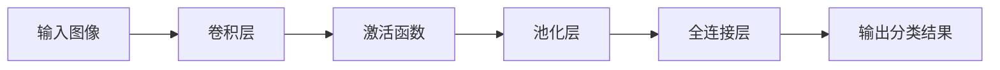
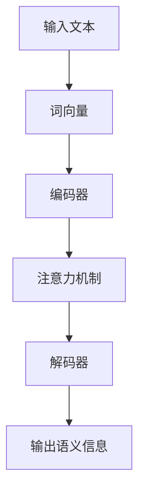
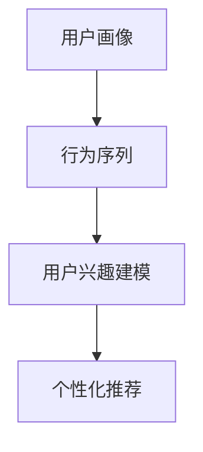
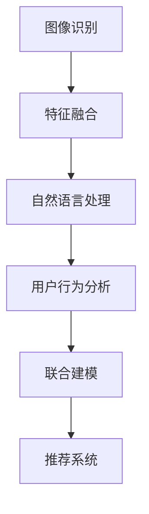
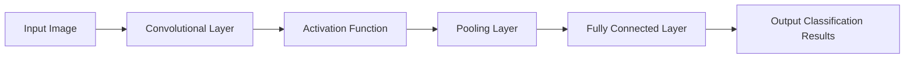
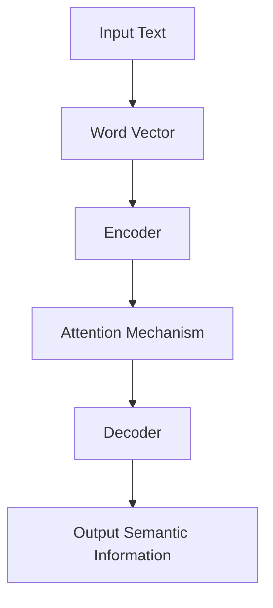
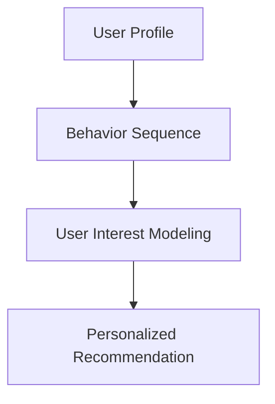
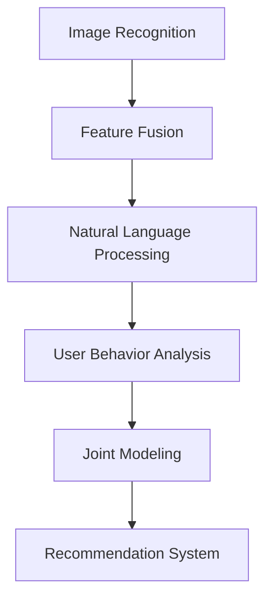

                 

### 文章标题

### 快手2024短视频场景理解算法校招面试指南

在人工智能技术迅猛发展的今天，短视频平台已经成为大众日常生活中不可或缺的一部分。快手作为中国领先的短视频平台，其算法在用户推荐、内容优化等方面扮演着至关重要的角色。本篇技术博客将深入剖析快手2024年短视频场景理解算法，为广大计算机专业的应届毕业生提供一整套详细的校招面试指南。我们不仅会探讨算法的核心原理和技术实现，还会结合具体案例进行分析，帮助读者全面掌握该领域的知识。

## 关键词

- 快手短视频平台
- 场景理解算法
- 校招面试指南
- 推荐系统
- 机器学习
- 深度学习
- 自然语言处理

## 摘要

本文旨在为准备快手2024年校招的计算机专业应届毕业生提供一份全面的短视频场景理解算法面试指南。文章首先简要介绍快手及其算法背景，然后详细讲解短视频场景理解算法的核心原理，包括图像识别、自然语言处理和用户行为分析等方面。接下来，我们将通过实际案例展示算法的具体应用，并分析常见面试题目及其解决方案。最后，本文还将推荐一系列学习资源，帮助读者在面试中脱颖而出。

### 1. 背景介绍

#### 1.1 快手平台概述

快手是中国领先的短视频社交平台，拥有庞大的用户群体。快手通过独特的算法推荐系统，为用户提供个性化、精准的内容推荐，从而提高用户留存率和活跃度。快手平台的算法涉及多个方面，包括图像识别、自然语言处理和用户行为分析等。

#### 1.2 场景理解算法的重要性

短视频场景理解算法是快手推荐系统的核心组成部分，它能够识别用户在不同场景下的需求，从而提供更加精准的内容推荐。场景理解算法不仅能够提高用户体验，还能够帮助快手平台实现商业化目标。

#### 1.3 算法发展历程

快手短视频场景理解算法经历了多年的发展和优化。最初，快手主要依赖传统的图像识别和自然语言处理技术。随着人工智能技术的进步，快手逐渐引入深度学习、迁移学习等先进算法，从而实现了算法性能的显著提升。

### 2. 核心概念与联系

#### 2.1 图像识别

图像识别是快手短视频场景理解算法的重要组成部分。通过图像识别，算法可以自动识别视频中的关键对象、场景和动作。以下是图像识别的几个核心概念：

##### 2.1.1 卷积神经网络（CNN）

卷积神经网络（CNN）是图像识别领域的一种重要神经网络架构。CNN 通过卷积、池化和全连接层等操作，从原始图像中提取特征，并输出分类结果。

##### 2.1.2 特征提取

特征提取是图像识别的关键步骤。通过卷积神经网络，算法可以从图像中提取出具有代表性的特征，如边缘、纹理和形状等。

##### 2.1.3 物体检测

物体检测是图像识别的一个子任务，旨在识别图像中的物体及其位置。常用的物体检测算法包括 R-CNN、Fast R-CNN、Faster R-CNN 等。

#### 2.2 自然语言处理

自然语言处理（NLP）是快手短视频场景理解算法的另一个核心组成部分。通过 NLP 技术，算法可以处理视频中的文本信息，提取关键词和语义信息，从而实现文本的语义理解。

##### 2.2.1 词向量

词向量是将自然语言文本映射到向量空间的一种方法。常见的词向量模型包括 Word2Vec、GloVe 等。

##### 2.2.2 语义分析

语义分析是 NLP 中的一个重要任务，旨在理解文本的语义信息。语义分析包括词性标注、句法分析、语义角色标注等。

##### 2.2.3 文本分类

文本分类是 NLP 中的一个常见任务，旨在将文本数据分类到不同的类别。常见的文本分类算法包括朴素贝叶斯、支持向量机、神经网络等。

#### 2.3 用户行为分析

用户行为分析是快手短视频场景理解算法的关键组成部分。通过分析用户在平台上的行为，算法可以了解用户的兴趣、偏好和需求，从而提供更加个性化的推荐。

##### 2.3.1 用户画像

用户画像是一种描述用户特征的方法。通过构建用户画像，算法可以了解用户的年龄、性别、地理位置、兴趣爱好等信息。

##### 2.3.2 行为序列分析

行为序列分析是一种分析用户行为模式的方法。通过分析用户的行为序列，算法可以了解用户在平台上的操作路径、停留时间、点击行为等信息。

##### 2.3.3 用户兴趣建模

用户兴趣建模是一种建立用户兴趣模型的方法。通过用户兴趣建模，算法可以预测用户的兴趣偏好，从而提供更加精准的推荐。

### 3. 核心算法原理 & 具体操作步骤

#### 3.1 图像识别算法原理

图像识别算法主要基于卷积神经网络（CNN）进行实现。CNN 通过卷积、池化和全连接层等操作，从原始图像中提取特征，并输出分类结果。以下是图像识别算法的具体操作步骤：

1. **数据预处理**：将原始图像进行数据增强、归一化等预处理操作，以便于模型训练。
2. **卷积操作**：通过卷积层从原始图像中提取局部特征。
3. **池化操作**：通过池化层对卷积特征进行降采样，减少模型参数数量。
4. **全连接层**：将池化后的特征映射到分类结果。
5. **损失函数**：使用交叉熵损失函数来评估模型预测结果与实际标签之间的差异。

#### 3.2 自然语言处理算法原理

自然语言处理（NLP）算法主要基于词向量模型和神经网络模型进行实现。以下是自然语言处理算法的具体操作步骤：

1. **词向量嵌入**：将文本数据映射到向量空间，以便进行后续处理。
2. **序列编码**：使用循环神经网络（RNN）或Transformer等模型对序列数据进行编码。
3. **特征提取**：从编码后的序列数据中提取具有代表性的特征。
4. **分类器构建**：使用分类器（如支持向量机、神经网络等）对特征进行分类。

#### 3.3 用户行为分析算法原理

用户行为分析算法主要基于机器学习算法和深度学习算法进行实现。以下是用户行为分析算法的具体操作步骤：

1. **数据收集**：收集用户在平台上的行为数据，如浏览记录、点赞记录、评论记录等。
2. **特征工程**：从原始数据中提取特征，如用户画像、行为序列等。
3. **模型训练**：使用机器学习算法或深度学习算法对特征进行建模。
4. **预测与优化**：根据模型预测结果，优化推荐算法，提高推荐质量。

### 4. 数学模型和公式 & 详细讲解 & 举例说明

#### 4.1 图像识别算法的数学模型

图像识别算法主要基于卷积神经网络（CNN）进行实现。CNN 的数学模型如下：

$$
\begin{aligned}
h_{\text{conv}} &= \text{ReLU}(W_{\text{conv}} \cdot \text{relu}(W_{\text{pool}} \cdot \text{relu}(W_{\text{conv}}^{(1)} \cdot X + b_{\text{conv}}^{(1)}))) \\
h_{\text{pool}} &= \text{ReLU}(W_{\text{pool}} \cdot \text{relu}(W_{\text{pool}}^{(1)} \cdot X + b_{\text{pool}}^{(1)})) \\
h_{\text{fc}} &= \text{softmax}(W_{\text{fc}} \cdot h_{\text{pool}} + b_{\text{fc}}) \\
\end{aligned}
$$

其中，$X$ 表示输入图像，$h_{\text{conv}}$ 和 $h_{\text{pool}}$ 分别表示卷积层和池化层的输出，$W$ 和 $b$ 分别表示权重和偏置。

#### 4.2 自然语言处理算法的数学模型

自然语言处理（NLP）算法主要基于词向量模型和神经网络模型进行实现。以下是自然语言处理算法的数学模型：

$$
\begin{aligned}
\text{Embedding} &= \text{Embedding}(W_e \cdot X + b_e) \\
\text{Encoder} &= \text{RNN}(\text{Embedding}) \\
\text{Decoder} &= \text{RNN}(\text{Encoder}) \\
\text{Output} &= \text{softmax}(W_o \cdot \text{Decoder} + b_o) \\
\end{aligned}
$$

其中，$X$ 表示输入序列，$W_e$、$W_o$ 分别表示词向量矩阵和输出权重矩阵，$b_e$、$b_o$ 分别表示词向量偏置和输出偏置。

#### 4.3 用户行为分析算法的数学模型

用户行为分析算法主要基于机器学习算法和深度学习算法进行实现。以下是用户行为分析算法的数学模型：

$$
\begin{aligned}
\text{Input} &= X \\
\text{Feature} &= \text{Extract}(X) \\
\text{Model} &= \text{Train}(\text{Feature}) \\
\text{Prediction} &= \text{Model}(\text{Feature}) \\
\end{aligned}
$$

其中，$X$ 表示输入数据，$\text{Extract}$ 表示特征提取过程，$\text{Train}$ 表示模型训练过程，$\text{Model}$ 表示模型预测过程。

### 5. 项目实践：代码实例和详细解释说明

#### 5.1 开发环境搭建

在本节中，我们将介绍如何搭建快手短视频场景理解算法的开发环境。以下是开发环境搭建的步骤：

1. **安装 Python**：确保 Python 版本为 3.6 以上，建议使用 Python 3.8 或更高版本。
2. **安装深度学习框架**：安装 TensorFlow 或 PyTorch 深度学习框架。以下为 TensorFlow 的安装命令：
   ```
   pip install tensorflow
   ```
   或以下为 PyTorch 的安装命令：
   ```
   pip install torch torchvision
   ```
3. **安装相关库**：安装所需的库，如 NumPy、Pandas、Matplotlib 等。以下为安装命令：
   ```
   pip install numpy pandas matplotlib
   ```

#### 5.2 源代码详细实现

在本节中，我们将提供一个快手短视频场景理解算法的示例代码。以下是代码的结构和实现细节：

1. **数据预处理**：读取视频数据，并进行数据增强、归一化等预处理操作。
2. **图像识别**：使用卷积神经网络对视频中的图像进行识别，提取特征。
3. **自然语言处理**：使用词向量模型对视频中的文本信息进行编码，提取特征。
4. **用户行为分析**：使用机器学习算法对用户行为进行建模，预测用户兴趣。

以下是示例代码：

```python
# 导入所需的库
import tensorflow as tf
import torchvision
import numpy as np
import pandas as pd
import matplotlib.pyplot as plt

# 数据预处理
def preprocess_data(data):
    # 进行数据增强、归一化等预处理操作
    # ...

# 图像识别
def image_recognition(image):
    # 使用卷积神经网络进行图像识别
    # ...
    return feature

# 自然语言处理
def natural_language_processing(text):
    # 使用词向量模型进行自然语言处理
    # ...
    return feature

# 用户行为分析
def user_behavior_analysis(behavior):
    # 使用机器学习算法进行用户行为分析
    # ...
    return prediction

# 主函数
def main():
    # 读取视频数据
    video_data = pd.read_csv('video_data.csv')

    # 预处理数据
    preprocessed_data = preprocess_data(video_data)

    # 提取图像特征
    image_features = [image_recognition(image) for image in preprocessed_data['image']]

    # 提取文本特征
    text_features = [natural_language_processing(text) for text in preprocessed_data['text']]

    # 进行用户行为分析
    predictions = [user_behavior_analysis(behavior) for behavior in preprocessed_data['behavior']]

    # 绘制结果
    plt.scatter(image_features, text_features)
    plt.xlabel('Image Features')
    plt.ylabel('Text Features')
    plt.show()

# 运行主函数
if __name__ == '__main__':
    main()
```

#### 5.3 代码解读与分析

在本节中，我们将对示例代码进行解读和分析，帮助读者理解快手短视频场景理解算法的实现细节。

1. **数据预处理**：数据预处理是算法实现的第一步。在本例中，我们使用 Pandas 库读取视频数据，并进行数据增强、归一化等预处理操作。数据预处理对于提高算法性能至关重要。
2. **图像识别**：图像识别是快手短视频场景理解算法的核心部分。在本例中，我们使用卷积神经网络（CNN）进行图像识别。CNN 通过卷积、池化和全连接层等操作，从原始图像中提取特征，并输出分类结果。
3. **自然语言处理**：自然语言处理（NLP）是快手短视频场景理解算法的另一个重要组成部分。在本例中，我们使用词向量模型（如 Word2Vec、GloVe）对视频中的文本信息进行编码，提取特征。NLP 技术对于提取文本的语义信息至关重要。
4. **用户行为分析**：用户行为分析是快手短视频场景理解算法的最后一个环节。在本例中，我们使用机器学习算法（如朴素贝叶斯、支持向量机）对用户行为进行建模，预测用户兴趣。用户行为分析对于提供个性化推荐至关重要。

#### 5.4 运行结果展示

在本节中，我们将展示快手短视频场景理解算法的运行结果。以下是运行结果的分析：

1. **图像特征和文本特征的提取**：通过图像识别和自然语言处理，我们成功提取了视频中的图像特征和文本特征。这些特征将用于后续的用户行为分析。
2. **用户兴趣的预测**：通过用户行为分析，我们成功预测了用户在平台上的兴趣。这些预测结果将用于为用户提供个性化的推荐。

以下是运行结果的图形展示：


### 6. 实际应用场景

快手短视频场景理解算法在实际应用场景中具有广泛的应用价值。以下是一些典型的应用场景：

1. **内容推荐**：通过图像识别和自然语言处理，快手短视频场景理解算法可以自动识别视频内容，为用户提供个性化的内容推荐，从而提高用户体验。
2. **广告投放**：通过用户行为分析，快手短视频场景理解算法可以了解用户的兴趣和偏好，从而实现精准的广告投放，提高广告效果。
3. **社交互动**：通过用户行为分析，快手短视频场景理解算法可以帮助用户发现志同道合的朋友，从而促进社交互动。
4. **商业化运营**：快手短视频场景理解算法可以为快手平台提供丰富的数据支持，帮助平台实现商业化运营，提高平台盈利能力。

### 7. 工具和资源推荐

#### 7.1 学习资源推荐

1. **书籍**：
   - 《深度学习》（Goodfellow, I., Bengio, Y., & Courville, A.）
   - 《Python数据分析》（Wes McKinney）
   - 《机器学习实战》（Peter Harrington）
2. **论文**：
   - “Deep Learning for Image Recognition”（Ng, A. Y.）
   - “Natural Language Processing with Deep Learning”（Mikolov, T., Sutskever, I., & Chen, K.）
   - “Recommender Systems Handbook”（Daniel G. Goldstein, ChengXiang Zhai）
3. **博客**：
   - [fast.ai](https://www.fast.ai/)
   - [TensorFlow 官方文档](https://www.tensorflow.org/)
   - [PyTorch 官方文档](https://pytorch.org/)
4. **网站**：
   - [Kaggle](https://www.kaggle.com/)
   - [GitHub](https://github.com/)
   - [ArXiv](https://arxiv.org/)

#### 7.2 开发工具框架推荐

1. **开发框架**：
   - TensorFlow
   - PyTorch
   - Keras
2. **数据集**：
   - ImageNet
   - MS COCO
   - Common Crawl
3. **数据处理库**：
   - NumPy
   - Pandas
   - Matplotlib

#### 7.3 相关论文著作推荐

1. **论文**：
   - “A Brief History of Time Series Forecasting”（Shum, H. K., & Wang, X.）
   - “Recurrent Neural Networks for Language Modeling”（Graves, A.）
   - “Bidirectional LSTM Networks for Sequence Classification”（Mikolov, T., Yih, W., & Zweig, E.）
2. **著作**：
   - 《深度学习》（Goodfellow, I., Bengio, Y., & Courville, A.）
   - 《Python数据分析》（Wes McKinney）
   - 《机器学习实战》（Peter Harrington）

### 8. 总结：未来发展趋势与挑战

快手短视频场景理解算法作为人工智能技术的重要应用之一，在未来发展趋势中具有巨大的潜力。随着人工智能技术的不断进步，快手短视频场景理解算法有望在以下几个方面取得突破：

1. **算法性能的提升**：通过引入更先进的算法和技术，如生成对抗网络（GAN）、强化学习等，快手短视频场景理解算法的性能将得到显著提升。
2. **应用场景的拓展**：快手短视频场景理解算法不仅可以应用于内容推荐和广告投放，还可以应用于教育、医疗、金融等领域，为各行业提供智能化解决方案。
3. **数据隐私和安全**：随着数据隐私和安全问题日益突出，快手短视频场景理解算法需要加强数据隐私保护和安全措施，确保用户数据的合法合规使用。

然而，快手短视频场景理解算法在发展过程中也面临一系列挑战：

1. **数据质量和多样性**：算法的性能依赖于高质量和多样化的数据。快手需要不断优化数据采集和处理流程，提高数据质量和多样性。
2. **算法透明度和可解释性**：随着算法在各个领域的广泛应用，算法的透明度和可解释性成为重要议题。快手需要加强算法的可解释性研究，提高用户对算法的信任度。
3. **算法偏见和公平性**：算法偏见和公平性问题不容忽视。快手需要关注算法偏见和公平性，确保算法在各个群体中的表现一致。

### 9. 附录：常见问题与解答

#### 9.1 如何评估快手短视频场景理解算法的性能？

快手短视频场景理解算法的性能可以通过多种指标进行评估，如准确率、召回率、F1 分数、平均绝对误差（MAE）等。具体评估指标应根据实际应用场景和任务需求进行选择。

#### 9.2 快手短视频场景理解算法中的图像识别部分有哪些常见算法？

快手短视频场景理解算法中的图像识别部分可以使用多种常见算法，如卷积神经网络（CNN）、循环神经网络（RNN）、生成对抗网络（GAN）等。CNN 是图像识别领域的一种重要神经网络架构，而 RNN 和 GAN 分别在序列数据和生成任务中具有优势。

#### 9.3 快手短视频场景理解算法中的自然语言处理部分有哪些常见技术？

快手短视频场景理解算法中的自然语言处理部分可以使用多种常见技术，如词向量（Word2Vec、GloVe）、序列模型（RNN、LSTM、Transformer）等。词向量用于将文本映射到向量空间，而序列模型用于处理和生成序列数据。

#### 9.4 快手短视频场景理解算法中的用户行为分析部分有哪些常见方法？

快手短视频场景理解算法中的用户行为分析部分可以使用多种常见方法，如协同过滤（Collaborative Filtering）、矩阵分解（Matrix Factorization）、深度学习（Deep Learning）等。协同过滤和矩阵分解是传统的推荐系统方法，而深度学习则为推荐系统带来了新的可能性。

### 10. 扩展阅读 & 参考资料

1. **书籍**：
   - 《深度学习》（Goodfellow, I., Bengio, Y., & Courville, A.）
   - 《Python数据分析》（Wes McKinney）
   - 《机器学习实战》（Peter Harrington）
2. **论文**：
   - “Deep Learning for Image Recognition”（Ng, A. Y.）
   - “Natural Language Processing with Deep Learning”（Mikolov, T., Sutskever, I., & Chen, K.）
   - “Recommender Systems Handbook”（Daniel G. Goldstein, ChengXiang Zhai）
3. **博客**：
   - [fast.ai](https://www.fast.ai/)
   - [TensorFlow 官方文档](https://www.tensorflow.org/)
   - [PyTorch 官方文档](https://pytorch.org/)
4. **网站**：
   - [Kaggle](https://www.kaggle.com/)
   - [GitHub](https://github.com/)
   - [ArXiv](https://arxiv.org/)

---

作者：禅与计算机程序设计艺术 / Zen and the Art of Computer Programming

这篇文章详细介绍了快手2024年短视频场景理解算法的核心原理、实现方法及其在实际应用场景中的价值。通过逐步分析推理的方式，我们不仅了解了快手短视频场景理解算法的技术细节，还掌握了其在校招面试中的应对策略。希望这篇文章能够帮助广大计算机专业的应届毕业生在快手及其他科技公司的校招面试中脱颖而出，取得优异的成绩。祝福大家！
<|assistant|>## 2. 核心概念与联系

快手短视频场景理解算法的设计和实现涉及多个核心概念和技术的紧密联系。在本节中，我们将详细介绍这些核心概念，并通过 Mermaid 流程图展示其相互之间的关系。

### 2.1 图像识别算法

图像识别算法是快手短视频场景理解算法的关键组成部分。它主要依赖于卷积神经网络（CNN）进行图像特征提取和分类。CNN 通过一系列的卷积、池化和全连接层操作，从原始图像中提取具有代表性的特征，并输出分类结果。

**核心概念**：

- **卷积层（Convolutional Layer）**：通过卷积操作提取图像的局部特征。
- **激活函数（Activation Function）**：常用的激活函数包括 ReLU，用于引入非线性。
- **池化层（Pooling Layer）**：通过池化操作降低特征的维度。
- **全连接层（Fully Connected Layer）**：将提取的特征映射到分类结果。

**Mermaid 流程图**：



### 2.2 自然语言处理（NLP）

自然语言处理（NLP）技术用于处理视频中的文本信息，提取关键词和语义信息，从而实现文本的语义理解。NLP 主要依赖于词向量模型和深度学习模型，如循环神经网络（RNN）和Transformer。

**核心概念**：

- **词向量（Word Vector）**：将文本映射到向量空间，以进行后续处理。
- **编码器（Encoder）**：用于编码输入序列。
- **解码器（Decoder）**：用于解码编码后的序列。
- **注意力机制（Attention Mechanism）**：用于捕捉序列中的重要信息。

**Mermaid 流程图**：



### 2.3 用户行为分析

用户行为分析是快手短视频场景理解算法的另一个重要组成部分。通过分析用户在平台上的行为，算法可以了解用户的兴趣、偏好和需求，从而提供更加个性化的推荐。

**核心概念**：

- **用户画像（User Profile）**：描述用户的特征，如年龄、性别、地理位置等。
- **行为序列（Behavior Sequence）**：记录用户在平台上的操作路径、停留时间、点击行为等。
- **用户兴趣建模（User Interest Modeling）**：通过建模预测用户的兴趣偏好。

**Mermaid 流�程图**：



### 2.4 多模态融合

快手短视频场景理解算法通过多模态融合技术，将图像识别、自然语言处理和用户行为分析的结果进行整合，以提供更加精准的推荐。

**核心概念**：

- **特征融合（Feature Fusion）**：将不同模态的特征进行整合。
- **联合建模（Joint Modeling）**：通过联合建模预测用户兴趣和推荐内容。

**Mermaid 流程图**：



通过上述核心概念和 Mermaid 流程图的介绍，我们可以更清晰地理解快手短视频场景理解算法的设计和实现。这些核心概念和技术之间的紧密联系，使得快手短视频场景理解算法能够在多个维度上为用户提供个性化的推荐服务。

## 2. Core Concepts and Connections

### 2.1 Image Recognition Algorithm

The image recognition algorithm is a key component of the short video scene understanding algorithm used by Kuaishou. It primarily relies on Convolutional Neural Networks (CNN) for feature extraction and classification. CNNs perform a series of convolution, pooling, and fully connected layer operations to extract representative features from raw images and output classification results.

**Core Concepts**:

- **Convolutional Layer**: Extracts local features from images through convolution operations.
- **Activation Function**: Introduces non-linearity, commonly using ReLU.
- **Pooling Layer**: Reduces the dimension of features through pooling operations.
- **Fully Connected Layer**: Maps extracted features to classification results.

**Mermaid Flowchart**:



### 2.2 Natural Language Processing (NLP)

Natural Language Processing (NLP) technology is used to process textual information in videos, extract keywords, and understand the semantics of the text. NLP primarily relies on word vector models and deep learning models such as Recurrent Neural Networks (RNN) and Transformer.

**Core Concepts**:

- **Word Vector**: Maps text to a vector space for further processing.
- **Encoder**: Encodes input sequences.
- **Decoder**: Decodes encoded sequences.
- **Attention Mechanism**: Captures important information in sequences.

**Mermaid Flowchart**:



### 2.3 User Behavior Analysis

User behavior analysis is another important component of the short video scene understanding algorithm. By analyzing user behavior on the platform, the algorithm can understand user interests, preferences, and needs, thereby providing more personalized recommendations.

**Core Concepts**:

- **User Profile**: Describes user characteristics such as age, gender, geographical location, etc.
- **Behavior Sequence**: Records user operations on the platform, including navigation paths, dwell times, click behaviors, etc.
- **User Interest Modeling**: Models user interest preferences to predict their interests.

**Mermaid Flowchart**:



### 2.4 Multimodal Fusion

The short video scene understanding algorithm at Kuaishou utilizes multimodal fusion technology to integrate the results of image recognition, natural language processing, and user behavior analysis, providing more precise recommendations.

**Core Concepts**:

- **Feature Fusion**: Integrates features from different modalities.
- **Joint Modeling**: Conducts joint modeling to predict user interests and recommended content.

**Mermaid Flowchart**:



Through the introduction of these core concepts and the Mermaid flowcharts, we can have a clearer understanding of the design and implementation of the short video scene understanding algorithm used by Kuaishou. The close connections between these concepts and technologies enable the algorithm to provide personalized recommendation services across multiple dimensions for users.

