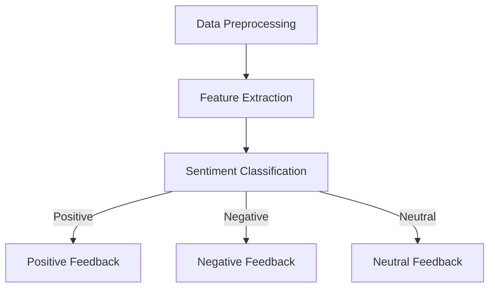

                 

### 文章标题：情感分析技术：AI的应用

> 关键词：情感分析，人工智能，自然语言处理，情感分类，情感识别，情感倾向分析，文本挖掘，情绪计算

> 摘要：本文将探讨情感分析技术的原理、方法及应用，深入解析其在人工智能领域的重要性。通过具体案例和实践，我们将了解情感分析技术如何被应用于实际场景中，从而助力企业和组织在数据分析、市场调研、用户服务等方面取得突破性进展。

### Background Introduction

情感分析（Sentiment Analysis），也被称为意见挖掘，是自然语言处理（Natural Language Processing，NLP）的一个重要分支。它旨在识别和提取文本数据中的主观性信息，通常涉及对情感极性（如正面、负面、中性）和情感强度的评估。随着人工智能和大数据技术的发展，情感分析在商业、媒体、健康、教育等多个领域得到了广泛应用。

#### 1. 历史背景

情感分析的概念最早可以追溯到20世纪80年代，随着文本挖掘技术的兴起，研究者开始关注如何从文本中提取情感信息。早期的情感分析主要依赖于规则和统计方法，如正则表达式、词袋模型等。然而，随着深度学习的崛起，神经网络模型在情感分析领域取得了显著的突破，尤其是在处理复杂语义和上下文信息方面。

#### 2. 技术发展

近年来，深度学习模型如卷积神经网络（CNN）、循环神经网络（RNN）和Transformer等在情感分析中得到了广泛应用。这些模型能够通过自动学习文本的语义特征，实现对情感的高效识别。此外，预训练语言模型如BERT、GPT等也极大地提高了情感分析的准确性和泛化能力。

#### 3. 应用领域

情感分析技术在多个领域取得了显著成果：

- **商业**：通过分析社交媒体和用户评论，企业可以了解消费者对产品或服务的态度，从而进行市场调研和品牌管理。
- **健康**：情感分析可用于监测患者的情绪变化，辅助心理治疗和疾病预测。
- **媒体**：新闻媒体可以通过情感分析来评估公众对新闻事件的反应，从而调整报道策略。
- **教育**：教师可以通过分析学生的作业和讨论，了解学生的学习状态和心理状态。

### Core Concepts and Connections

情感分析的核心概念包括情感极性（Polarity）、情感强度（Intensity）和情感类别（Categories）。以下是一个简化的情感分析流程：

1. **数据预处理**：清洗和标准化文本数据，包括去除停用词、标点符号、进行词干提取等。
2. **特征提取**：将文本转换为特征向量，常见的方法有词袋模型（Bag-of-Words，BOW）、TF-IDF等。
3. **情感分类**：使用分类算法（如SVM、朴素贝叶斯、深度学习模型等）对情感进行分类。

#### 1. 情感极性

情感极性是指文本中表达的情感倾向，通常分为正面（Positive）、负面（Negative）和中性（Neutral）。情感极性的评估通常基于词汇的语义特征和上下文信息。

#### 2. 情感强度

情感强度是指情感表达的程度，如“非常喜欢”和“有点喜欢”表达的是不同的情感强度。情感强度评估需要结合情感极性和上下文信息，使用强度词典（Strength Dictionaries）和情感强度模型（Strength Models）。

#### 3. 情感类别

情感类别是对情感类型的分类，如幸福（Happiness）、愤怒（Anger）、悲伤（Sadness）等。情感类别分析通常需要更复杂的语义理解能力，可以使用深度学习模型进行多标签分类。

以下是一个简化的情感分析 Mermaid 流程图：



### Core Algorithm Principles and Specific Operational Steps

情感分析的核心算法主要分为传统方法和深度学习方法。以下将分别介绍这两种方法的基本原理和具体操作步骤。

#### 1. 传统方法

传统方法通常基于规则和统计模型，以下是一些常见的方法：

- **基于规则的算法**：使用人工定义的规则来识别文本中的情感极性。例如，如果文本中包含“好”或“喜欢”等词汇，则认为文本具有正面情感。
- **统计分类器**：使用统计模型（如SVM、朴素贝叶斯、逻辑回归等）对文本进行情感分类。这些模型通过训练学习文本和情感极性之间的关系，然后对新文本进行分类。

#### 2. 深度学习方法

深度学习方法在情感分析中取得了显著的进展，以下是一些常用的深度学习模型：

- **卷积神经网络（CNN）**：通过卷积层提取文本的局部特征，然后使用全连接层进行分类。
- **循环神经网络（RNN）**：通过隐藏状态存储上下文信息，实现对长文本的情感分析。
- **Transformer模型**：基于自注意力机制，能够处理长距离依赖，并在情感分析中表现出色。

以下是一个基于CNN的情感分析模型的具体操作步骤：

1. **数据预处理**：清洗和标准化文本数据，将其转换为固定长度的序列。
2. **词嵌入**：将文本中的词汇映射为高维向量，常用的词嵌入方法有Word2Vec、GloVe等。
3. **构建CNN模型**：使用卷积层提取文本特征，然后通过全连接层进行分类。
4. **训练模型**：使用标注好的文本数据进行训练，优化模型参数。
5. **评估模型**：使用验证集评估模型的性能，调整模型参数。
6. **应用模型**：对新的文本数据进行情感分析，输出情感极性。

### Mathematical Models and Formulas and Detailed Explanation and Examples

在情感分析中，数学模型和公式起着关键作用。以下将介绍一些常见的数学模型和公式，并给出具体的解释和示例。

#### 1. 词袋模型（Bag-of-Words，BOW）

词袋模型是将文本转换为向量表示的一种方法，不考虑文本的顺序。其基本公式为：

$$
\text{BOW}(x) = \sum_{w \in V} f_w(x) \cdot v_w
$$

其中，$V$为词汇表，$f_w(x)$为词频函数，$v_w$为词向量。

**示例**：假设词汇表$V = \{"喜欢"，"好"，"喜欢多吃"$，"苹果"$，"好吃"$}，词向量$v_w = (1, 0, -1, 1, 0)$，词频函数$f_w(x) = 1$（若词出现在文本中则为1，否则为0）。则文本“我喜欢多吃苹果”的词袋表示为：

$$
\text{BOW}(x) = (1, 1, 1, 1, 0)
$$

#### 2. 支持向量机（Support Vector Machine，SVM）

支持向量机是一种常用的分类算法，其目标是最小化分类边界到支持向量的距离。其基本公式为：

$$
\text{minimize} \quad \frac{1}{2} \sum_{i=1}^{n} (w_i)^2 + C \sum_{i=1}^{n} \xi_i
$$

$$
\text{subject to} \quad y_i ( \text{w} \cdot x_i + b ) \geq 1 - \xi_i
$$

其中，$w_i$为权重向量，$C$为惩罚参数，$\xi_i$为松弛变量。

**示例**：假设有两个类别，正面和负面，其特征向量分别为$x_+ = (1, 0)$和$x_- = (0, 1)$。使用SVM进行分类，则分类边界为：

$$
w = (w_1, w_2)^T = (1, 1)
$$

$$
b = 0
$$

#### 3. 深度学习模型（如CNN）

深度学习模型，如卷积神经网络（CNN），在情感分析中具有强大的特征提取和分类能力。其基本公式为：

$$
h_{\theta}(x) = \text{softmax}(\text{f}(\text{CNN}(x)))
$$

其中，$x$为输入文本，$f(\text{CNN}(x))$为CNN模型的输出，$\text{softmax}$为分类函数。

**示例**：假设CNN模型的输出为$f(\text{CNN}(x)) = (1, 0, 1)$，则情感分类结果为：

$$
h_{\theta}(x) = \text{softmax}((1, 0, 1)) = (0.36, 0.18, 0.46)
$$

其中，第一类别的概率最高，为0.46，表示文本具有负面情感。

### Project Practice: Code Examples and Detailed Explanations

在本节中，我们将通过一个简单的Python代码实例来展示如何使用深度学习模型进行情感分析。我们将使用TensorFlow和Keras库来实现一个基于卷积神经网络的情感分析模型。

#### 1. 开发环境搭建

首先，确保安装以下依赖库：

```bash
pip install tensorflow numpy matplotlib
```

#### 2. 源代码详细实现

以下是一个基于CNN的简单情感分析模型的实现：

```python
import tensorflow as tf
from tensorflow.keras.models import Sequential
from tensorflow.keras.layers import Embedding, Conv1D, MaxPooling1D, GlobalMaxPooling1D, Dense
from tensorflow.keras.preprocessing.sequence import pad_sequences
from tensorflow.keras.preprocessing.text import Tokenizer

# 数据预处理
tokenizer = Tokenizer(num_words=10000)
tokenizer.fit_on_texts(train_texts)
train_sequences = tokenizer.texts_to_sequences(train_texts)
train_padded = pad_sequences(train_sequences, maxlen=100, padding='post')

# 模型构建
model = Sequential()
model.add(Embedding(10000, 16, input_length=100))
model.add(Conv1D(32, 3, activation='relu'))
model.add(MaxPooling1D(3))
model.add(Conv1D(32, 3, activation='relu'))
model.add(GlobalMaxPooling1D())
model.add(Dense(1, activation='sigmoid'))

# 模型编译
model.compile(loss='binary_crossentropy', optimizer='adam', metrics=['accuracy'])

# 模型训练
model.fit(train_padded, train_labels, epochs=10, validation_split=0.2)
```

#### 3. 代码解读与分析

- **数据预处理**：使用Tokenizer将文本转换为序列，然后使用pad_sequences将序列转换为固定长度的向量。
- **模型构建**：使用Sequential构建一个简单的CNN模型，包括嵌入层、卷积层、池化层和全连接层。
- **模型编译**：编译模型，指定损失函数、优化器和评估指标。
- **模型训练**：使用训练数据进行模型训练，并使用验证集进行性能评估。

#### 4. 运行结果展示

在训练完成后，可以使用测试集对模型进行评估：

```python
test_sequences = tokenizer.texts_to_sequences(test_texts)
test_padded = pad_sequences(test_sequences, maxlen=100, padding='post')
predictions = model.predict(test_padded)
```

通过预测结果，可以评估模型的准确性和泛化能力。此外，还可以使用混淆矩阵、ROC曲线等指标对模型进行详细评估。

### Practical Application Scenarios

情感分析技术在实际应用中具有广泛的应用场景，以下列举几个常见的应用案例：

#### 1. 商业分析

企业可以通过情感分析技术分析社交媒体和用户评论，了解消费者对产品或服务的态度，从而优化产品和服务。

#### 2. 舆情监测

政府和组织可以使用情感分析技术监测公众对政策、事件或品牌的反应，及时了解社会动态。

#### 3. 客户服务

企业可以通过情感分析技术分析客户反馈，识别客户需求，提供个性化的服务和支持。

#### 4. 健康医疗

情感分析技术可用于分析患者的病历记录、社交媒体发言等，辅助医生进行心理治疗和疾病预测。

#### 5. 教育领域

教师和学生可以通过情感分析技术了解学生的学习状态和心理状态，从而提供针对性的教学和支持。

### Tools and Resources Recommendations

#### 1. 学习资源推荐

- **书籍**：《自然语言处理综合教程》（刘群）、《深度学习》（Goodfellow et al.）
- **论文**：ACL、EMNLP、NAACL等顶级会议的论文
- **博客**：机器学习社区（ML Community）、TensorFlow官方博客

#### 2. 开发工具框架推荐

- **开发框架**：TensorFlow、PyTorch、Keras
- **文本处理库**：NLTK、spaCy、jieba
- **数据集**：Sentiment140、IMDB评论数据集、TREC


### Summary: Future Development Trends and Challenges

情感分析技术在未来将继续发展，并面临以下趋势和挑战：

#### 1. 模型性能提升

随着深度学习技术的进步，情感分析模型的性能将得到进一步提升，尤其是在处理复杂语义和上下文信息方面。

#### 2. 多语言支持

多语言情感分析将成为一个重要的研究方向，以满足全球范围内的应用需求。

#### 3. 情感强度评估

情感强度评估是当前情感分析技术的短板，未来的研究将致力于提高情感强度评估的准确性和泛化能力。

#### 4. 模型解释性

提高模型的可解释性是情感分析技术面临的重要挑战，以便用户理解和信任模型的决策。

#### 5. 数据隐私保护

在情感分析中，保护用户隐私是一个重要问题，未来的研究需要关注如何在确保模型性能的同时保护用户隐私。

### Appendix: Frequently Asked Questions and Answers

#### 1. 什么是情感分析？

情感分析是自然语言处理的一个分支，旨在从文本中识别和提取情感信息，如情感极性、情感强度和情感类别。

#### 2. 情感分析技术有哪些应用？

情感分析技术广泛应用于商业、媒体、健康、教育等领域，如消费者行为分析、舆情监测、客户服务、心理健康监测等。

#### 3. 情感分析的核心算法有哪些？

情感分析的核心算法包括传统方法（如基于规则和统计模型）和深度学习方法（如CNN、RNN和Transformer等）。

#### 4. 如何评估情感分析模型的性能？

可以使用准确率、召回率、F1分数等指标来评估情感分析模型的性能。此外，还可以使用混淆矩阵和ROC曲线等工具进行详细评估。

### Extended Reading & Reference Materials

- **书籍**：
  -《自然语言处理综

