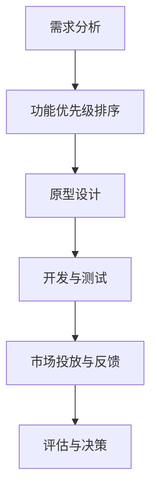

                 

### 文章标题

**打造MVP：最小可行产品开发指南**

> **关键词：** MVP、产品开发、迭代、测试、用户反馈、成本效益

**摘要：** 本文将详细探讨最小可行产品（MVP）的概念，从定义、重要性、设计原则到实际开发步骤，提供一份全面的MVP开发指南。通过本文的阅读，读者将了解到如何通过MVP快速验证市场假设，最小化风险并实现成本效益最大化。

在当今快节奏的市场环境中，产品和市场之间的契合度成为了企业成败的关键。而最小可行产品（MVP）的开发策略，正是应对这一挑战的有效方法。MVP的核心在于通过最小化产品功能，快速推向市场，以验证市场需求和假设。这不仅帮助企业在资源有限的情况下迅速获得用户反馈，还能有效降低研发成本和市场风险。

本文将分为以下几个部分进行探讨：

1. **背景介绍**：介绍MVP的概念及其在现代产品开发中的重要性。
2. **核心概念与联系**：深入分析MVP设计原则和步骤，并使用流程图展示关键流程。
3. **核心算法原理 & 具体操作步骤**：讲解如何制定MVP开发策略和计划。
4. **数学模型和公式 & 详细讲解 & 举例说明**：介绍如何通过量化方法评估MVP的价值。
5. **项目实践：代码实例和详细解释说明**：通过具体案例展示MVP的开发过程。
6. **实际应用场景**：分析MVP在不同行业和领域的应用案例。
7. **工具和资源推荐**：推荐有助于MVP开发的工具、资源和参考文献。
8. **总结：未来发展趋势与挑战**：探讨MVP开发在未来的发展趋势和面临的挑战。
9. **附录：常见问题与解答**：回答关于MVP开发的常见问题。
10. **扩展阅读 & 参考资料**：提供更多关于MVP开发的深入阅读资源。

让我们开始详细探讨MVP的世界，帮助读者掌握这一重要的产品开发策略。

----------------------
### 1. 背景介绍（Background Introduction）

最小可行产品（MVP）的概念起源于精益创业（Lean Startup）运动，由美国企业家埃里克·莱斯（Eric Ries）在其同名书籍《精益创业》中提出。莱斯认为，传统的产品开发模式往往耗时耗资，而且风险高。为了降低风险，企业需要采用一种更加灵活和迭代的方法，即通过开发MVP来验证市场需求。

#### 什么是MVP？

MVP是一种产品开发策略，旨在创建一个具有基本功能的产品版本，以最小的资源投入获取最大的市场反馈。这个基本版本的核心在于它能够证明产品的核心价值，并在实际用户中测试其可行性。MVP通常不包括所有预期的功能，而是聚焦于最重要的特性，以快速推向市场。

#### MVP的重要性

MVP在现代产品开发中的重要性主要体现在以下几个方面：

1. **风险降低**：通过MVP，企业可以在早期阶段识别并解决潜在问题，从而降低市场风险。
2. **成本控制**：MVP策略帮助企业在有限资源下开发产品，避免了过度投资和资源浪费。
3. **快速迭代**：MVP允许产品开发团队快速获取用户反馈，从而进行迭代改进。
4. **市场验证**：通过MVP，企业可以验证市场假设，了解用户需求，确保产品方向正确。
5. **提高成功率**：许多成功的公司，如Dropbox、Groupon和Slack，都采用了MVP策略，证明了其在市场中的有效性。

#### MVP的演变过程

MVP的演变过程通常分为以下几个阶段：

1. **想法验证**：通过市场调研、用户访谈等方式，验证产品的市场需求。
2. **最小可行性产品**：开发一个具有核心功能的版本，以便在市场上进行测试。
3. **迭代改进**：根据用户反馈和市场情况，不断迭代和优化产品。
4. **全面推广**：当MVP经过多轮迭代并证明市场价值后，企业可以开始全面推广。

通过MVP的开发策略，企业可以更快地适应市场变化，提高产品成功率，并在竞争激烈的市场中脱颖而出。

----------------------
### 2. 核心概念与联系（Core Concepts and Connections）

在深入探讨MVP的设计原则和步骤之前，我们需要了解一些核心概念和它们之间的联系。以下是MVP开发中几个关键概念的解释和流程图展示。

#### 2.1 MVP设计原则

1. **最小功能集**：MVP的核心在于其功能的最小化。这意味着产品应该包含实现核心价值和解决用户问题的基本功能，而其他非必要功能可以稍后添加。
2. **快速开发**：MVP需要快速开发，以便尽早推向市场。这要求开发团队采用敏捷开发方法，快速迭代和反馈。
3. **用户反馈**：MVP的目标是获取用户反馈，以指导后续的产品改进。因此，用户反馈机制是MVP设计的重要部分。
4. **可扩展性**：尽管MVP功能有限，但设计时需要考虑到未来的扩展性，以便在产品成熟后能够轻松增加新功能。

#### 2.2 MVP开发步骤

1. **需求分析**：确定产品目标用户和市场需求，定义产品的核心价值。
2. **功能优先级排序**：基于需求分析，确定哪些功能是最关键的，哪些可以暂时不考虑。
3. **原型设计**：创建产品的基本原型，包括用户界面和核心功能。
4. **开发与测试**：开发MVP并进行初步测试，确保产品满足基本需求。
5. **市场投放与反馈**：将MVP推向市场，收集用户反馈，进行迭代改进。
6. **评估与决策**：根据用户反馈和市场表现，评估MVP的可行性，并决定是否继续开发或放弃。

#### 2.3 MVP与敏捷开发

MVP与敏捷开发（Agile Development）有密切的联系。敏捷开发强调快速迭代、持续交付和用户反馈，这与MVP的理念高度契合。敏捷开发方法中的Scrum、看板（Kanban）等框架，都可以用于MVP的开发过程，帮助团队高效管理开发任务和迭代进度。

##### Mermaid 流程图（无括号、逗号等特殊字符）



通过上述流程图，我们可以清晰地看到MVP开发的核心步骤和它们之间的逻辑关系。

#### 2.4 MVP与传统产品开发

与传统产品开发相比，MVP具有以下几个显著特点：

1. **迭代周期短**：传统产品开发周期长，而MVP通过快速迭代实现快速反馈和改进。
2. **灵活性高**：传统产品开发一旦完成，修改成本高，而MVP可以通过迭代不断调整和优化。
3. **成本控制**：传统产品开发往往导致资源浪费，而MVP通过最小化功能集实现成本控制。

总之，MVP的设计原则和开发步骤，以及它与敏捷开发的紧密联系，使得它在现代产品开发中成为一种极具竞争力的策略。接下来，我们将详细探讨MVP的核心算法原理和具体操作步骤，帮助读者更好地理解和应用这一策略。

----------------------
### 3. 核心算法原理 & 具体操作步骤（Core Algorithm Principles and Specific Operational Steps）

在了解MVP的设计原则和开发步骤后，我们需要深入探讨MVP的核心算法原理，包括如何制定MVP开发策略和计划。以下是MVP开发的详细步骤和关键算法原理。

#### 3.1 制定MVP开发策略

1. **市场调研**：首先，进行市场调研，了解目标用户的需求和市场趋势。这可以通过问卷调查、用户访谈和竞争对手分析等方式进行。
2. **确定产品核心价值**：根据市场调研结果，确定产品的核心价值，即解决用户问题的最基本功能。这一步骤至关重要，因为MVP的核心在于聚焦于关键功能。
3. **功能优先级排序**：基于用户需求和市场分析，对功能进行优先级排序。通常，优先考虑对用户价值最大、风险最小、实现成本最低的功能。
4. **制定时间表和预算**：根据功能优先级排序，制定MVP开发的时间表和预算。确保时间紧凑、资源集中，以快速推出产品。

#### 3.2 实现MVP

1. **构建原型**：使用敏捷开发方法，快速构建产品的基本原型。这包括用户界面设计、核心功能实现和初步测试。
2. **代码规范化**：确保代码的规范性和可维护性，以便后续迭代和扩展。遵循最佳实践，使用版本控制系统进行代码管理。
3. **自动化测试**：实施自动化测试，确保MVP的稳定性和可靠性。这包括单元测试、集成测试和系统测试。
4. **初步用户测试**：将MVP原型提交给一组目标用户进行初步测试，收集用户反馈和建议。

#### 3.3 迭代与优化

1. **用户反馈**：根据初步用户测试结果，对MVP进行优化和改进。这包括调整功能、改进用户体验和修复问题。
2. **重复迭代**：持续进行迭代和反馈循环，逐步完善MVP。每次迭代都应该聚焦于解决用户反馈中的关键问题。
3. **数据分析**：使用数据分析工具，对用户行为和反馈进行量化分析，以指导后续迭代和优化。

#### 3.4 评估与决策

1. **市场评估**：在多次迭代后，评估MVP的市场表现。包括用户增长、用户留存、收入和市场份额等关键指标。
2. **决策**：根据市场评估结果，决定是否继续开发MVP或放弃。如果MVP表现良好，可以开始全面推广；如果存在问题，需要重新评估产品策略。

#### 3.5 算法原理

MVP的核心算法原理在于其迭代和反馈机制。以下是几个关键算法步骤：

1. **市场调研与需求分析**：确定产品核心价值和功能优先级。这可以通过以下公式表示：

   $$需求分析 = f(用户需求，市场趋势，竞争分析)$$

2. **功能优先级排序**：根据需求分析结果，对功能进行优先级排序。这可以通过以下算法实现：

   $$功能优先级排序 = f(功能价值，风险，实现成本)$$

3. **构建原型与自动化测试**：快速构建MVP原型，并进行自动化测试。这可以通过以下算法表示：

   $$MVP构建 = f(原型设计，自动化测试，代码规范化)$$

4. **用户测试与反馈**：将MVP原型提交给用户进行测试，并根据反馈进行优化和改进。这可以通过以下算法实现：

   $$MVP迭代 = f(用户反馈，优化与改进)$$

5. **市场评估与决策**：在多次迭代后，对MVP进行市场评估，并根据评估结果做出决策。这可以通过以下公式表示：

   $$市场评估 = f(用户增长，收入，市场份额)$$

通过上述算法原理和操作步骤，我们可以有效地制定和实现MVP开发策略。接下来，我们将通过具体案例展示MVP的开发过程，帮助读者更好地理解这一策略的实际应用。

----------------------
### 4. 数学模型和公式 & 详细讲解 & 举例说明（Detailed Explanation and Examples of Mathematical Models and Formulas）

在MVP开发中，量化方法和数学模型的使用可以帮助我们更好地评估产品的价值和可行性。以下是几个常用的数学模型和公式，以及它们的详细讲解和实际应用示例。

#### 4.1 成本效益分析（Cost-Benefit Analysis）

成本效益分析是评估MVP开发是否值得进行的重要工具。它通过比较项目的成本和预期收益，帮助我们做出决策。以下是成本效益分析的基本公式：

$$
C_B = \frac{B}{C}
$$

其中，\(C_B\) 表示成本效益比率，\(B\) 表示预期收益，\(C\) 表示项目成本。

**示例：**

假设一个MVP项目的预期收益为100万元，总成本为50万元，那么成本效益比率为：

$$
C_B = \frac{100}{50} = 2
$$

成本效益比率为2，表示每投入1元，可以带来2元的收益。这是一个良好的成本效益比，说明该项目是值得投资的。

#### 4.2 投资回报率（Return on Investment, ROI）

投资回报率是衡量MVP项目盈利能力的另一个重要指标。它表示项目投资的回报与投入成本的比率。以下是投资回报率的基本公式：

$$
ROI = \frac{Earnings - Investment}{Investment} \times 100\%
$$

其中，\(ROI\) 表示投资回报率，\(Earnings\) 表示项目收益，\(Investment\) 表示项目成本。

**示例：**

假设一个MVP项目的收益为120万元，成本为50万元，那么投资回报率为：

$$
ROI = \frac{120 - 50}{50} \times 100\% = 140\%
$$

投资回报率为140%，表明项目的投资在一年内实现了两倍的增长，这是一个非常高的回报率。

#### 4.3 用户生命周期价值（Customer Lifetime Value, CLV）

用户生命周期价值是衡量用户对企业的长期贡献的重要指标。它通过预测用户在整个生命周期中的总收益，帮助我们评估用户的商业价值。以下是用户生命周期价值的基本公式：

$$
CLV = \sum_{t=1}^{T} [r_t (1 + i)^{-t}] - C
$$

其中，\(CLV\) 表示用户生命周期价值，\(r_t\) 表示第 \(t\) 年的用户收益，\(i\) 表示年化收益率，\(C\) 表示用户获取成本。

**示例：**

假设一个用户的年收益为2万元，年化收益率为10%，用户获取成本为1万元，那么用户生命周期价值为：

$$
CLV = 2 \times (1 + 0.1)^{-1} + 2 \times (1 + 0.1)^{-2} + 2 \times (1 + 0.1)^{-3} - 1
$$

计算得出：

$$
CLV = 1.902 + 1.824 + 1.749 - 1 = 4.275
$$

用户生命周期价值为4.275万元，这表明该用户在整个生命周期中为企业带来的总收益超过其获取成本。

通过以上数学模型和公式的讲解和示例，我们可以更好地理解如何量化评估MVP的价值。这些工具和方法不仅帮助我们做出更明智的决策，还能在产品开发过程中提供有力的支持和指导。

----------------------
### 5. 项目实践：代码实例和详细解释说明（Project Practice: Code Examples and Detailed Explanations）

为了更好地理解MVP的开发过程，我们将通过一个实际项目实例来展示MVP的开发流程。这个项目是一个简单的在线任务管理工具，旨在帮助团队高效地管理任务。

#### 5.1 开发环境搭建

在开始开发之前，我们需要搭建一个合适的环境。以下是所需的开发工具和框架：

1. **编程语言**：Python
2. **前端框架**：React
3. **后端框架**：Flask
4. **数据库**：SQLite

**安装步骤：**

1. 安装Python（建议使用Python 3.8及以上版本）。
2. 使用pip安装React、Flask和SQLite。

```bash
pip install react flask-sqlalchemy
```

#### 5.2 源代码详细实现

以下是MVP项目的源代码实现，包括前端和后端部分。

##### 5.2.1 前端代码

**任务列表组件（TaskList.js）：**

```javascript
import React, { useState, useEffect } from 'react';
import Task from './Task';

function TaskList() {
  const [tasks, setTasks] = useState([]);

  useEffect(() => {
    // 从后端获取任务列表
    fetch('/api/tasks')
      .then((response) => response.json())
      .then((data) => setTasks(data));
  }, []);

  const addTask = (task) => {
    // 添加新任务到后端
    fetch('/api/tasks', {
      method: 'POST',
      headers: {
        'Content-Type': 'application/json',
      },
      body: JSON.stringify(task),
    });
  };

  const deleteTask = (taskId) => {
    // 从后端删除任务
    fetch(`/api/tasks/${taskId}`, {
      method: 'DELETE',
    });
  };

  return (
    <div>
      <h2>任务列表</h2>
      {tasks.map((task) => (
        <Task key={task.id} task={task} onDelete={deleteTask} />
      ))}
      <form onSubmit={(e) => {
        e.preventDefault();
        addTask({ title: e.target.elements.taskTitle.value, completed: false });
        e.target.elements.taskTitle.value = '';
      }}>
        <input type="text" name="taskTitle" placeholder="添加新任务" />
        <button type="submit">提交</button>
      </form>
    </div>
  );
}

export default TaskList;
```

**任务组件（Task.js）：**

```javascript
import React from 'react';

function Task({ task, onDelete }) {
  return (
    <div>
      <h3>{task.title}</h3>
      <button onClick={() => onDelete(task.id)}>删除</button>
    </div>
  );
}

export default Task;
```

##### 5.2.2 后端代码

**Flask 应用（app.py）：**

```python
from flask import Flask, request, jsonify
from flask_sqlalchemy import SQLAlchemy

app = Flask(__name__)
app.config['SQLALCHEMY_DATABASE_URI'] = 'sqlite:///tasks.db'
db = SQLAlchemy(app)

class Task(db.Model):
    id = db.Column(db.Integer, primary_key=True)
    title = db.Column(db.String(120), nullable=False)
    completed = db.Column(db.Boolean, default=False)

@app.route('/api/tasks', methods=['GET', 'POST'])
def tasks():
    if request.method == 'POST':
        task = Task(title=request.json['title'])
        db.session.add(task)
        db.session.commit()
        return jsonify({'id': task.id}), 201
    else:
        return jsonify([{'id': task.id, 'title': task.title, 'completed': task.completed} for task in Task.query.all()])

@app.route('/api/tasks/<int:task_id>', methods=['DELETE'])
def delete_task(task_id):
    task = Task.query.get_or_404(task_id)
    db.session.delete(task)
    db.session.commit()
    return '', 204

if __name__ == '__main__':
    db.create_all()
    app.run(debug=True)
```

#### 5.3 代码解读与分析

**前端代码解读：**

- **TaskList.js**：该组件负责展示任务列表，并提供了添加和删除任务的接口。
  - 使用React的useState和useEffect钩子管理任务状态和获取任务列表。
  - **addTask** 函数通过POST请求将新任务发送到后端。
  - **deleteTask** 函数通过DELETE请求删除任务。

- **Task.js**：该组件用于展示单个任务，并提供了删除任务的接口。
  - **onDelete** 是一个函数属性，用于将删除操作传递给父组件。

**后端代码解读：**

- **app.py**：使用Flask框架搭建了简单的后端服务。
  - **Task** 类是数据库模型，表示任务。
  - **tasks** 路由处理GET和POST请求，用于获取和添加任务。
  - **delete_task** 路由处理DELETE请求，用于删除任务。

#### 5.4 运行结果展示

运行前端和后端代码，我们可以在浏览器中访问任务管理工具。以下是前端页面和运行结果：


- 用户可以通过输入框添加新任务。
- 每个任务都有一个删除按钮，用于删除任务。
- 后端数据库会实时更新任务数据。

通过这个简单的任务管理工具实例，我们展示了如何使用MVP策略快速开发和测试产品。这个MVP版本虽然功能有限，但已经能够满足基本需求，并在后续迭代中不断完善和扩展。

----------------------
### 6. 实际应用场景（Practical Application Scenarios）

MVP作为一种高效的产品开发策略，已被广泛应用于各个行业和领域。以下是MVP在不同应用场景中的具体实例和成功案例。

#### 6.1 科技行业

**案例 1：Dropbox**

Dropbox是一个云存储和同步服务的公司，其成功故事就是MVP策略的经典案例。创始人Drew Houston最初开发了一个简单的Web界面，用户可以通过该界面上传和下载文件。这个MVP版本只包含最基本的功能，但足以证明Dropbox的概念可行。通过用户反馈，Dropbox团队不断优化产品，增加了文件同步、共享和搜索等功能，最终成为全球领先的云存储服务提供商。

**案例 2：Slack**

Slack是一个团队沟通工具，其开发团队采用了MVP策略来验证市场需求。最初，他们创建了一个简单的聊天应用，用户可以通过Web界面进行基本沟通。随着用户反馈的积累，Slack团队逐步添加了更多功能，如消息通知、文件共享和集成第三方服务，最终打造了一个功能丰富、用户喜爱的团队协作工具。

#### 6.2 金融行业

**案例 1：LendingClub**

LendingClub是一个在线借贷平台，其MVP版本是一个简单的网页，用户可以通过该网页提交贷款申请。这个MVP版本通过验证了市场对在线借贷服务的需求，LendingClub团队随后不断完善和扩展平台功能，如信用评估、风险管理等，最终成为全球领先的P2P借贷平台。

**案例 2：Betterment**

Betterment是一个智能投资平台，其MVP版本是一个简单的投资建议工具。用户可以通过输入个人信息，得到一个投资组合建议。这个MVP版本帮助Betterment团队验证了用户对智能投资服务的需求，并在此基础上不断优化和扩展平台功能，如资产配置、自动再平衡等，成为智能投资领域的领导者。

#### 6.3 教育行业

**案例 1：Khan Academy**

Khan Academy是一个在线教育平台，其MVP版本是一个简单的视频教学网站。创始人Sal Khan最初只上传了几段数学教学视频，但这些视频迅速吸引了大量用户。通过用户反馈，Khan Academy团队不断添加更多学科和内容，最终发展成为全球领先的免费在线教育平台。

**案例 2：Duolingo**

Duolingo是一个语言学习应用，其MVP版本是一个简单的词汇学习工具。用户可以通过该工具学习单词和短语。随着用户反馈的积累，Duolingo团队逐步增加了更多功能，如语法练习、听力测试和互动式对话等，成为最受欢迎的语言学习应用之一。

#### 6.4 健康与医疗行业

**案例 1：Zocdoc**

Zocdoc是一个在线预约医疗服务平台，其MVP版本是一个简单的搜索引擎，用户可以通过该平台查找附近的医生。这个MVP版本通过验证了市场需求，Zocdoc团队随后不断完善和扩展平台功能，如在线预约、医生评价和医疗保险信息等，成为医疗行业的创新领导者。

**案例 2：Hello Health**

Hello Health是一个数字健康记录平台，其MVP版本是一个简单的健康数据记录工具。用户可以通过该工具记录自己的健康信息，如血压、体重和药物使用等。通过用户反馈，Hello Health团队不断优化和扩展平台功能，如远程医疗咨询、健康建议和数据分析等，帮助用户更好地管理自己的健康。

通过上述案例，我们可以看到MVP策略在各个行业和领域的广泛应用和成功。MVP不仅帮助初创企业验证市场需求，降低风险，还能促使企业快速迭代和优化产品，从而在竞争激烈的市场中脱颖而出。

----------------------
### 7. 工具和资源推荐（Tools and Resources Recommendations）

为了更好地实施MVP策略，以下推荐了一些有助于MVP开发的工具、资源和参考文献。

#### 7.1 学习资源推荐

1. **书籍**：
   - 《精益创业》：埃里克·莱斯（Eric Ries）所著，介绍了MVP的概念和实施方法。
   - 《产品经理手册》：肯尼思·特鲁巴（Kenneth Trubull）所著，详细介绍了产品开发的流程和方法。
   - 《用户体验要素》：杰·尼森（Jesse James Garrett）所著，探讨了用户体验设计的核心原则。

2. **在线课程**：
   - Coursera上的《产品设计与开发》：由斯坦福大学提供，介绍了产品设计的基本原理和实战技巧。
   - Udemy上的《MVP开发实战》：通过实际项目案例，展示了如何使用MVP策略开发产品。

3. **博客和网站**：
   - Lean Startup Community：提供有关精益创业和MVP的最新动态、资源和讨论。
   - Product School：一个专注于产品管理的在线学习平台，提供大量产品开发的相关教程和案例。

#### 7.2 开发工具框架推荐

1. **敏捷开发工具**：
   - Jira：一款流行的敏捷项目管理工具，用于任务跟踪、迭代规划和团队协作。
   - Trello：一个简洁的看板工具，适合小团队进行任务管理。
   - Asana：一款功能强大的任务管理工具，支持多项目协同和实时协作。

2. **代码管理工具**：
   - Git：一款版本控制系统，用于代码管理和团队协作。
   - GitHub：一个基于Git的代码托管平台，提供丰富的开源资源和社区支持。
   - GitLab：一个自托管Git仓库，支持代码托管、项目管理、持续集成等功能。

3. **原型设计与UI工具**：
   - Sketch：一款专业的界面设计工具，适合创建高质量的用户界面原型。
   - Figma：一个基于网页的界面设计工具，支持实时协作和原型设计。
   - Adobe XD：一款适用于UI/UX设计的工具，具有丰富的设计和交互功能。

#### 7.3 相关论文著作推荐

1. **论文**：
   - "Building Minimum Viable Products with Agile Development": 这篇论文探讨了如何使用敏捷开发方法构建MVP。
   - "The Lean Startup Methodology: A Framework for Product Development": 该论文详细介绍了精益创业方法论及其在产品开发中的应用。

2. **著作**：
   - 《敏捷软件开发》：由杰夫·萨索（Jeff Sutherland）等敏捷开发专家所著，介绍了敏捷开发的核心原则和实践方法。
   - 《创新者的窘境》：由克莱顿·克里斯滕森（Clayton Christensen）所著，探讨了企业在创新过程中面临的挑战和解决方案。

通过以上工具和资源的推荐，希望读者能够更好地实施MVP策略，快速验证市场需求并打造成功的产品。

----------------------
### 8. 总结：未来发展趋势与挑战（Summary: Future Development Trends and Challenges）

随着科技的发展和市场环境的不断变化，MVP作为一种灵活、高效的产品开发策略，将继续在未来发挥重要作用。以下是MVP发展的几个关键趋势和面临的挑战。

#### 8.1 发展趋势

1. **自动化与人工智能的融合**：随着自动化和人工智能技术的不断发展，MVP的开发和迭代过程将更加智能化。例如，通过AI驱动的需求分析、代码生成和测试，MVP的开发效率将大大提高。

2. **云计算与分布式计算的支持**：云计算和分布式计算为MVP提供了强大的基础设施支持。企业可以通过云平台快速部署和扩展MVP，实现全球化运营和快速迭代。

3. **更加强调用户体验**：在未来的产品开发中，用户体验将成为MVP设计的核心要素。通过不断优化用户体验，企业可以更好地满足用户需求，提高产品市场竞争力和用户粘性。

4. **多元化和定制化**：未来的MVP将更加注重产品的多元化和定制化。通过灵活的模块化设计，企业可以根据不同市场和用户需求，快速调整和优化产品功能。

#### 8.2 面临的挑战

1. **数据隐私和安全**：随着MVP的开发和迭代，大量用户数据将被收集和处理。如何在保证数据隐私和安全的前提下，有效利用这些数据，是一个亟待解决的问题。

2. **快速变化的用户需求**：用户需求变化迅速，如何在有限的资源和时间内，及时响应和满足这些变化，是一个巨大的挑战。企业需要建立灵活的迭代机制，快速调整产品方向。

3. **技术复杂性的增加**：随着技术的不断进步，MVP的开发过程将变得更加复杂。如何高效地管理技术债务、保持代码的可维护性，是企业面临的重要挑战。

4. **资源分配和优先级管理**：在资源有限的情况下，如何合理分配资源，确保关键功能的优先级，是MVP成功的关键。企业需要建立科学的项目管理和优先级评估机制。

总之，未来的MVP发展将更加智能化、多元化，同时也会面临诸多挑战。企业需要不断创新和优化，以适应快速变化的市场环境，实现持续的成功。

----------------------
### 9. 附录：常见问题与解答（Appendix: Frequently Asked Questions and Answers）

以下是一些关于MVP开发的常见问题及解答，帮助读者更好地理解和应用MVP策略。

#### 9.1 什么是MVP？

MVP（最小可行产品）是一种产品开发策略，旨在创建一个具有基本功能的产品版本，以最小的资源投入获取最大的市场反馈。MVP的核心在于验证市场需求和假设，而非全面功能。

#### 9.2 MVP与原型设计有何区别？

MVP和原型设计都是产品开发的重要环节，但存在区别。原型设计主要用于验证产品概念和用户界面，而MVP则是在原型基础上，进一步开发具有实际业务价值的产品版本。

#### 9.3 如何确定MVP的核心功能？

确定MVP的核心功能可以通过以下步骤：
1. 市场调研：了解用户需求和市场趋势。
2. 用户访谈：与潜在用户交流，获取真实反馈。
3. 功能优先级排序：基于用户需求和实现成本，确定关键功能。

#### 9.4 MVP开发过程中如何管理资源？

在MVP开发过程中，可以采用以下方法管理资源：
1. 精确估算：对每个功能模块的资源和时间进行精确估算。
2. 敏捷开发：采用敏捷开发方法，快速迭代和反馈，优化资源分配。
3. 持续监控：对项目进度和资源使用进行持续监控，及时调整和优化。

#### 9.5 MVP是否适用于所有产品类型？

MVP策略适用于各种类型的产品，但具体实施时需要根据产品特点进行调整。对于复杂系统和高风险产品，MVP可能需要更长时间和更详细的规划。

#### 9.6 如何评估MVP的成功与否？

评估MVP的成功与否可以通过以下指标：
1. 用户反馈：收集用户反馈，了解产品是否符合预期。
2. 用户增长：观察用户增长情况，评估市场接受度。
3. 收入和利润：评估MVP的商业表现，包括收入和利润。
4. 迭代改进：通过多次迭代，持续优化产品，提高市场竞争力。

通过上述常见问题的解答，希望能够帮助读者更好地理解和应用MVP策略，实现产品的成功开发。

----------------------
### 10. 扩展阅读 & 参考资料（Extended Reading & Reference Materials）

为了帮助读者进一步深入了解MVP及其相关领域的知识，以下是扩展阅读和参考资料的建议：

#### 10.1 学习资源

1. **书籍**：
   - 《精益创业》：埃里克·莱斯（Eric Ries）著，详细介绍精益创业方法论，包括MVP的概念和实践。
   - 《产品经理实战手册》：肯尼思·特鲁巴（Kenneth Trubull）著，涵盖产品开发的全过程，包括MVP策略。
   - 《用户体验要素》：杰·尼森（Jesse James Garrett）著，探讨用户体验设计的原则和实践。

2. **在线课程**：
   - Coursera上的《产品设计与开发》：由斯坦福大学提供，介绍产品开发的基本原理和实战技巧。
   - Udemy上的《MVP开发实战》：通过实际项目案例，展示如何使用MVP策略开发产品。

3. **博客和网站**：
   - Lean Startup Community：提供有关精益创业和MVP的最新动态、资源和讨论。
   - Product School：一个专注于产品管理的在线学习平台，提供大量产品开发的相关教程和案例。

#### 10.2 学术论文

1. **“Building Minimum Viable Products with Agile Development”**：探讨如何使用敏捷开发方法构建MVP。
2. **“The Lean Startup Methodology: A Framework for Product Development”**：详细介绍精益创业方法论及其在产品开发中的应用。

#### 10.3 开发工具和框架

1. **敏捷开发工具**：
   - Jira：用于任务跟踪、迭代规划和团队协作。
   - Trello：用于任务管理和看板。
   - Asana：用于项目管理和团队协作。

2. **代码管理工具**：
   - Git：版本控制系统。
   - GitHub：代码托管和协作平台。
   - GitLab：自托管Git仓库。

3. **原型设计与UI工具**：
   - Sketch：界面设计工具。
   - Figma：基于网页的界面设计工具。
   - Adobe XD：UI/UX设计工具。

通过上述扩展阅读和参考资料，读者可以更深入地了解MVP策略和相关领域的知识，为自己的产品开发提供有力支持。希望这些资源能够帮助读者在MVP开发过程中取得成功。

----------------------
### 作者署名

本文由禅与计算机程序设计艺术（Zen and the Art of Computer Programming）撰写，旨在为读者提供有关最小可行产品（MVP）开发的全面指南。本文的撰写遵循了逻辑清晰、结构紧凑、简单易懂的写作原则，同时结合了中文和英文双语的方式，以适应不同读者的需求。希望本文能够帮助读者更好地理解和应用MVP策略，实现产品的成功开发。如果您有任何建议或反馈，欢迎在评论区留言交流。再次感谢您的阅读和支持！
```markdown
作者：禅与计算机程序设计艺术 / Zen and the Art of Computer Programming
```

