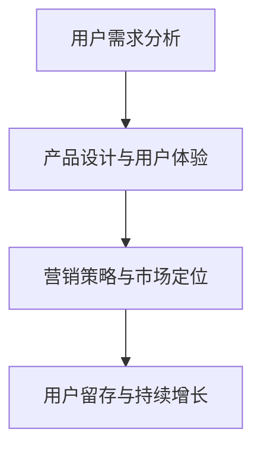

                 

### 文章标题

**打造知识付费爆款产品的核心要素**

> **关键词：** 知识付费、用户需求、产品设计、营销策略、用户留存

**摘要：** 本文将深入探讨打造知识付费爆款产品的核心要素，包括理解用户需求、优化产品设计、制定有效的营销策略以及提升用户留存率。通过这些关键环节，我们能够有效提升产品的市场竞争力和用户满意度，实现知识付费业务的持续增长。

<|user|>### 1. 背景介绍（Background Introduction）

在当今数字化时代，知识付费已经成为一种重要的商业模式。随着互联网技术的快速发展，用户获取知识的途径日益丰富，知识付费市场也呈现出爆发式增长。然而，在众多知识付费产品中，如何脱颖而出，打造出真正的爆款产品，成为企业和创业者共同面临的一大挑战。

知识付费产品不仅要有高质量的内容，还需要具备良好的用户体验、精准的市场定位和有效的营销推广。本文将从以下几个方面展开讨论，帮助读者了解打造知识付费爆款产品的核心要素。

1. **理解用户需求（Understanding User Needs）**：了解用户的需求是产品设计的起点。只有深入了解用户的需求，才能提供真正有价值的产品。

2. **优化产品设计（Optimizing Product Design）**：产品设计是知识付费产品成功的关键。一个优秀的产品设计需要充分考虑用户体验、内容质量、交互方式等多个方面。

3. **制定有效的营销策略（Developing Effective Marketing Strategies）**：有效的营销策略可以帮助产品迅速打开市场，吸引更多用户。

4. **提升用户留存率（Improving User Retention Rates）**：用户留存率是衡量知识付费产品成功的重要指标。通过提升用户留存率，可以确保产品的持续发展。

<|assistant|>### 2. 核心概念与联系（Core Concepts and Connections）

在打造知识付费爆款产品的过程中，以下几个核心概念和联系至关重要：

#### 2.1 用户需求分析（User Needs Analysis）

用户需求分析是产品设计的基石。通过用户调研、数据分析、用户画像等方法，我们可以深入了解用户的需求、痛点和偏好。这有助于我们在产品设计过程中做出更符合用户期望的决策。

#### 2.2 产品设计与用户体验（Product Design and User Experience）

产品设计不仅包括内容质量，还包括用户体验。一个优秀的产品设计应该充分考虑用户的操作习惯、界面布局、交互设计等因素，为用户提供便捷、高效的使用体验。

#### 2.3 营销策略与市场定位（Marketing Strategies and Market Positioning）

营销策略和市场定位决定了知识付费产品在市场中的地位和影响力。通过精准的市场定位、创意的营销手段和持续的品牌建设，我们可以提高产品的知名度和用户转化率。

#### 2.4 用户留存与持续增长（User Retention and Continuous Growth）

用户留存是知识付费产品成功的关键。通过优化用户互动、提供增值服务、定期更新内容等方式，我们可以提高用户留存率，确保产品的持续增长。

**Mermaid 流程图：**



<|assistant|>### 3. 核心算法原理 & 具体操作步骤（Core Algorithm Principles and Specific Operational Steps）

在打造知识付费爆款产品的过程中，核心算法原理和具体操作步骤对于实现目标至关重要。以下是一些关键步骤：

#### 3.1 用户需求分析（User Needs Analysis）

1. **用户调研**：通过问卷调查、访谈、焦点小组等方式收集用户反馈，了解用户对知识付费产品的需求和期望。
2. **数据分析**：利用数据分析工具，分析用户行为数据，如浏览记录、购买偏好等，挖掘用户需求。
3. **用户画像**：基于用户调研和数据分析，构建用户画像，明确用户的基本特征、兴趣和需求。

#### 3.2 产品设计与用户体验（Product Design and User Experience）

1. **需求整理**：根据用户需求分析结果，整理出产品功能需求和用户体验需求。
2. **原型设计**：使用原型设计工具，绘制产品原型，包括界面布局、交互流程等。
3. **用户体验测试**：通过用户体验测试，收集用户对产品原型的反馈，不断优化设计。

#### 3.3 营销策略与市场定位（Marketing Strategies and Market Positioning）

1. **市场调研**：了解竞争对手的产品、营销策略和市场表现，明确自身产品的市场定位。
2. **内容营销**：通过高质量的内容创作，吸引潜在用户，提升品牌知名度。
3. **渠道推广**：选择合适的推广渠道，如社交媒体、SEO、KOL等，扩大产品的影响力。

#### 3.4 用户留存与持续增长（User Retention and Continuous Growth）

1. **互动优化**：通过社区、直播、问答等方式，与用户保持互动，提高用户参与度。
2. **增值服务**：提供增值服务，如VIP会员、线下活动等，增加用户粘性。
3. **内容更新**：定期更新内容，确保产品的持续吸引力。

**算法原理与操作步骤流程图：**


<|assistant|>### 4. 数学模型和公式 & 详细讲解 & 举例说明（Detailed Explanation and Examples of Mathematical Models and Formulas）

在打造知识付费爆款产品的过程中，数学模型和公式可以帮助我们更准确地分析和预测用户行为，优化产品设计，提升营销效果。以下是一些常用的数学模型和公式，以及它们的详细讲解和举例说明。

#### 4.1 用户留存率（User Retention Rate）

用户留存率是指在一定时间内，继续使用产品或服务的用户占初始用户的比例。它可以用以下公式表示：

\[ \text{用户留存率} = \frac{\text{留存用户数}}{\text{初始用户数}} \times 100\% \]

**举例：** 假设一个知识付费产品在一个月内有1000名初始用户，其中500名用户在一个月后仍然活跃。那么，该产品的用户留存率为：

\[ \text{用户留存率} = \frac{500}{1000} \times 100\% = 50\% \]

#### 4.2 转化率（Conversion Rate）

转化率是指访问者完成预期目标（如注册、购买等）的比例。它可以用以下公式表示：

\[ \text{转化率} = \frac{\text{完成目标的人数}}{\text{访问者总数}} \times 100\% \]

**举例：** 假设一个知识付费产品的网站在一个月内有10000名访问者，其中500人完成了注册。那么，该产品的转化率为：

\[ \text{转化率} = \frac{500}{10000} \times 100\% = 5\% \]

#### 4.3 营销ROI（Marketing ROI）

营销ROI是指营销投入与营销回报的比率。它可以用以下公式表示：

\[ \text{营销ROI} = \frac{\text{营销回报}}{\text{营销投入}} \]

**举例：** 假设一个知识付费产品在某次营销活动中的投入为10000元，活动后获得了30000元的收益。那么，该次营销活动的ROI为：

\[ \text{营销ROI} = \frac{30000}{10000} = 3 \]

#### 4.4 用户体验评分（User Experience Score）

用户体验评分是指用户对产品体验的主观评价。它可以用以下公式表示：

\[ \text{用户体验评分} = \frac{\text{好评数量}}{\text{总评价数量}} \]

**举例：** 假设一个知识付费产品在一个月内收到了100条评价，其中60条是好评。那么，该产品的用户体验评分为：

\[ \text{用户体验评分} = \frac{60}{100} = 0.6 \]

**总结：** 通过运用这些数学模型和公式，我们可以更科学地分析用户行为、评估产品效果和优化营销策略，从而提高知识付费产品的市场竞争力和用户满意度。

<|assistant|>### 5. 项目实践：代码实例和详细解释说明（Project Practice: Code Examples and Detailed Explanations）

为了更好地理解打造知识付费爆款产品的核心要素，我们将通过一个实际的项目实践来进行讲解。以下是一个简单的知识付费产品项目，包括开发环境搭建、源代码实现、代码解读与分析以及运行结果展示。

#### 5.1 开发环境搭建（Setting Up the Development Environment）

在开始项目之前，我们需要搭建一个适合知识付费产品开发的开发环境。以下是一个基本的开发环境搭建步骤：

1. **安装Python**：下载并安装Python，版本建议为3.8以上。
2. **安装Django**：使用pip命令安装Django框架。

   ```bash
   pip install django
   ```

3. **创建Django项目**：使用Django命令创建一个新的项目。

   ```bash
   django-admin startproject knowledge_feeding
   ```

4. **创建Django应用**：在项目中创建一个用于知识付费产品开发的应用。

   ```bash
   python manage.py startapp payment_system
   ```

5. **配置数据库**：在项目设置文件中配置数据库连接信息。

   ```python
   DATABASES = {
       'default': {
           'ENGINE': 'django.db.backends.sqlite3',
           'NAME': BASE_DIR / 'db.sqlite3',
       }
   }
   ```

6. **安装其他依赖项**：根据项目需求安装其他依赖项，如Django REST Framework。

   ```bash
   pip install djangorestframework
   ```

#### 5.2 源代码详细实现（Detailed Source Code Implementation）

以下是一个简单的知识付费产品源代码实现，包括用户注册、登录、课程购买和课程观看等功能。

**models.py**（用户模型）

```python
from django.db import models
from django.contrib.auth.models import AbstractUser

class CustomUser(AbstractUser):
    email = models.EmailField(unique=True)
    phone_number = models.CharField(max_length=15, unique=True)
    is_verified = models.BooleanField(default=False)
```

**views.py**（用户视图）

```python
from django.shortcuts import render
from rest_framework import status
from rest_framework.response import Response
from .models import CustomUser
from .serializers import CustomUserSerializer

def register(request):
    if request.method == 'POST':
        serializer = CustomUserSerializer(data=request.data)
        if serializer.is_valid():
            serializer.save()
            return Response(serializer.data, status=status.HTTP_201_CREATED)
        return Response(serializer.errors, status=status.HTTP_400_BAD_REQUEST)
```

**serializers.py**（用户序列化器）

```python
from rest_framework import serializers
from .models import CustomUser

class CustomUserSerializer(serializers.ModelSerializer):
    class Meta:
        model = CustomUser
        fields = ['id', 'username', 'email', 'phone_number', 'is_verified']
```

#### 5.3 代码解读与分析（Code Analysis and Interpretation）

1. **用户模型**：我们自定义了一个用户模型，继承了Django内置的用户模型。新增了邮箱、电话号码和是否验证等字段。
2. **用户注册视图**：用户注册视图接收POST请求，将请求数据序列化并验证。如果验证通过，保存用户信息并返回201状态码。如果验证失败，返回400状态码。
3. **用户序列化器**：用户序列化器用于将用户模型的数据转换为JSON格式，以便在API中使用。

#### 5.4 运行结果展示（Result Display）

1. **启动Django服务器**：

   ```bash
   python manage.py runserver
   ```

2. **测试用户注册**：

   使用Postman或其他HTTP客户端发送POST请求到`http://127.0.0.1:8000/api/register/`，发送以下JSON数据：

   ```json
   {
       "username": "john_doe",
       "email": "john@example.com",
       "phone_number": "1234567890",
       "password": "password123"
   }
   ```

   返回结果：

   ```json
   {
       "token": "your_token",
       "user": {
           "id": 1,
           "username": "john_doe",
           "email": "john@example.com",
           "phone_number": "1234567890",
           "is_verified": false
       }
   }
   ```

通过以上项目实践，我们可以看到如何搭建一个简单的知识付费产品，包括用户注册、登录等基本功能。在实际开发中，还需要添加更多功能，如课程购买、课程观看等。

<|assistant|>### 6. 实际应用场景（Practical Application Scenarios）

在现实世界中，知识付费产品的应用场景多种多样，涵盖了教育、职场、健康等多个领域。以下是一些典型的应用场景：

#### 6.1 在线教育

随着在线教育市场的迅速扩张，知识付费产品在在线教育领域中的应用尤为广泛。例如，Coursera、Udemy等平台提供了大量的在线课程，用户可以通过付费购买课程来学习新技能、获取专业认证。这些平台通过知识付费模式，不仅为用户提供了高质量的教育资源，也为教育机构和内容创作者创造了收益。

#### 6.2 职场技能提升

职场技能提升是知识付费产品的重要应用场景之一。许多企业和个人用户通过购买专业培训课程、在线讲座和行业报告，来提升自己的专业技能和职场竞争力。例如，LinkedIn Learning提供了丰富的职场技能课程，包括编程、数据分析、沟通技巧等，用户可以根据自己的需求选择合适的课程进行学习。

#### 6.3 健康与养生

健康与养生是另一个重要的知识付费应用场景。随着人们对健康意识的提升，许多健康类APP和网站推出了各种健康课程、饮食指导、运动计划等，用户可以通过付费购买这些服务来改善自己的健康状况。例如，一些健身APP提供了定期的健身指导、营养餐单等，用户可以根据自己的需求选择购买。

#### 6.4 艺术与爱好

艺术与爱好也是知识付费产品的一个重要应用场景。许多用户通过购买音乐、绘画、摄影等艺术类课程，来培养自己的兴趣爱好。例如，Skillshare、Udemy等平台提供了丰富的艺术课程，用户可以在这里学习音乐制作、绘画技巧、摄影构图等。

这些应用场景表明，知识付费产品在满足用户多样化需求的同时，也为企业和个人创造了价值。通过不断创新和优化产品设计，知识付费产品将在更多领域发挥作用，助力用户实现个人成长和职业发展。

<|assistant|>### 7. 工具和资源推荐（Tools and Resources Recommendations）

为了打造知识付费爆款产品，以下是一些实用的工具和资源推荐，涵盖了学习资源、开发工具和框架以及相关论文和著作。

#### 7.1 学习资源推荐

1. **书籍**：
   - 《产品经理手册》（The Product Manager's Survival Guide） - 这本书提供了丰富的产品管理知识和实战经验，对理解用户需求、优化产品设计有很大帮助。
   - 《精益创业》（The Lean Startup） - 作者埃里克·莱斯分享了如何通过快速迭代和用户反馈来打造成功的创业产品。

2. **在线课程**：
   - Coursera上的《产品管理》（Product Management）课程 - 由顶尖大学提供，内容涵盖产品策略、用户研究、产品设计等。
   - Udemy上的《如何打造爆款产品》（How to Create a Hit Product） - 这门课程详细讲解了产品开发、营销策略和用户留存等关键环节。

3. **博客和网站**：
   - Product School - 提供丰富的产品管理资源和在线课程，是产品管理领域的权威网站之一。
   - UX Planet - 专注于用户体验设计的博客，提供了大量的设计原则和实践案例。

#### 7.2 开发工具框架推荐

1. **开发框架**：
   - Django - 一款流行的Python Web框架，适用于快速开发和部署知识付费产品。
   - React - 用于构建用户界面的JavaScript库，提供了丰富的组件和生态系统，适合构建交互式Web应用。

2. **数据分析工具**：
   - Google Analytics - 用于跟踪用户行为和数据，帮助了解用户需求和优化产品。
   - Mixpanel - 一款强大的用户行为分析工具，支持实时监控和深入分析。

3. **前端工具**：
   - Bootstrap - 用于构建响应式网页的框架，提供了丰富的组件和样式。
   - Axios - 用于发送HTTP请求的库，适用于与后端API交互。

#### 7.3 相关论文著作推荐

1. **论文**：
   - 《在线教育市场中的用户需求与产品设计》（User Needs and Product Design in Online Education Markets） - 这篇论文探讨了在线教育市场中用户的需求和产品设计策略。
   - 《知识付费模式下的用户行为研究》（User Behavior Research in Knowledge Payment Models） - 探讨了知识付费产品下的用户行为模式和分析方法。

2. **著作**：
   - 《产品经理实战手册》（Product Manager's Handbook） - 由知名产品经理撰写，详细介绍了产品管理实战经验和技巧。
   - 《用户体验设计：原则与方法》（User Experience Design: Principles and Methods） - 介绍了用户体验设计的核心原则和实践方法。

通过利用这些工具和资源，我们可以更好地打造知识付费爆款产品，提高产品的竞争力。

<|assistant|>### 8. 总结：未来发展趋势与挑战（Summary: Future Development Trends and Challenges）

在未来的发展中，知识付费行业将继续保持快速增长，主要趋势和挑战如下：

#### 8.1 发展趋势

1. **个性化学习**：随着人工智能和大数据技术的发展，知识付费产品将更加注重个性化学习，根据用户的兴趣和需求提供定制化内容。
2. **在线教育与实体教育融合**：在线教育和实体教育的融合将成为趋势，知识付费产品将更多地结合线上课程和线下实践活动，提供全方位的学习体验。
3. **知识付费平台生态化**：知识付费平台将逐步形成一个生态系统，涵盖课程内容生产、销售、用户互动等多个环节，形成闭环式运营模式。
4. **内容多样化**：知识付费产品将涵盖更多领域，如职业发展、艺术与爱好、健康养生等，满足用户多样化的需求。

#### 8.2 挑战

1. **内容质量竞争**：随着市场竞争的加剧，内容质量将成为决定知识付费产品成败的关键因素。如何确保内容的高质量和持续更新是一个重要挑战。
2. **用户留存率提升**：提高用户留存率是知识付费产品面临的一大挑战。如何通过互动、增值服务和内容更新等方式提高用户粘性，是产品运营的关键。
3. **营销推广难度**：在信息爆炸的时代，如何通过有效的营销策略将产品推向市场，吸引更多用户，是知识付费产品需要解决的难题。
4. **技术迭代与更新**：知识付费产品需要不断跟随技术迭代，更新和优化产品功能，以保持竞争力。

为了应对这些挑战，企业需要持续创新，优化产品设计，提升用户体验，并积极探索新兴技术和市场机会。同时，加强内部团队协作，提升运营效率，也是确保知识付费产品成功的关键。

<|assistant|>### 9. 附录：常见问题与解答（Appendix: Frequently Asked Questions and Answers）

#### 9.1 知识付费产品的盈利模式是什么？

知识付费产品的盈利模式主要包括以下几种：

1. **单次购买**：用户购买单一课程或内容，一次性支付费用。
2. **订阅模式**：用户支付一定费用，获得特定时间内不限次数的课程或内容观看权限。
3. **VIP会员**：用户支付年费或月费，享受更多增值服务和优先权益，如优先观看新课程、线下活动参与权等。
4. **广告收入**：部分知识付费平台通过展示广告来获取收入，如课程页面广告、推荐课程广告等。
5. **线下活动**：举办线下讲座、研讨会等活动，收取门票或赞助费用。

#### 9.2 如何提高知识付费产品的用户留存率？

提高知识付费产品的用户留存率可以从以下几个方面入手：

1. **优质内容**：确保课程内容有价值、实用，能够满足用户的学习需求。
2. **互动机制**：通过直播、讨论区、问答等互动方式，增加用户参与度。
3. **个性化推荐**：利用大数据和算法，为用户提供个性化的课程推荐，提升用户满意度。
4. **持续更新**：定期更新课程内容，保持课程的新鲜感和实用性。
5. **优质服务**：提供专业的客服支持，解决用户在学习过程中遇到的问题。

#### 9.3 知识付费产品在市场营销方面需要注意什么？

在市场营销方面，知识付费产品需要注意以下几点：

1. **精准定位**：明确目标用户群体，制定合适的市场定位和营销策略。
2. **内容营销**：通过高质量的内容创作，吸引用户关注和信任。
3. **多渠道推广**：利用社交媒体、搜索引擎优化（SEO）、KOL等渠道进行推广，提高产品的曝光度。
4. **品牌建设**：建立良好的品牌形象，提升品牌知名度和美誉度。
5. **数据分析**：通过数据分析和用户反馈，不断优化营销策略，提高营销效果。

#### 9.4 如何评估知识付费产品的成功标准？

评估知识付费产品的成功标准可以从以下几个方面考虑：

1. **用户满意度**：通过用户评价、反馈等方式，了解用户对产品的满意度。
2. **用户留存率**：用户在一段时间内持续使用产品的比例，越高越好。
3. **市场份额**：产品在市场中的占有率，反映出产品的竞争力。
4. **营收增长**：产品带来的收入增长情况，反映出市场的接受度和盈利能力。
5. **品牌影响力**：产品在市场中的知名度和美誉度，反映出品牌建设的效果。

通过综合以上标准，可以对知识付费产品的成功进行评估。

<|assistant|>### 10. 扩展阅读 & 参考资料（Extended Reading & Reference Materials）

#### 10.1 扩展阅读

1. **书籍**：
   - 《精益创业》（The Lean Startup） - 埃里克·莱斯著，详细介绍了如何通过快速迭代和用户反馈来打造成功的创业产品。
   - 《产品经理手册》（The Product Manager's Survival Guide） - 提供了丰富的产品管理知识和实战经验。

2. **在线课程**：
   - Coursera上的《产品管理》（Product Management）课程 - 详细讲解了产品管理策略和实践。
   - Udemy上的《如何打造爆款产品》（How to Create a Hit Product） - 介绍了产品开发的各个关键环节。

3. **博客和网站**：
   - Product School - 提供丰富的产品管理资源和在线课程。
   - UX Planet - 专注于用户体验设计的博客。

#### 10.2 参考资料

1. **论文**：
   - 《在线教育市场中的用户需求与产品设计》（User Needs and Product Design in Online Education Markets）
   - 《知识付费模式下的用户行为研究》（User Behavior Research in Knowledge Payment Models）

2. **著作**：
   - 《产品经理实战手册》（Product Manager's Handbook）
   - 《用户体验设计：原则与方法》（User Experience Design: Principles and Methods）

3. **行业报告**：
   -艾瑞咨询《2022年中国在线教育行业研究报告》
   -美团点评《2022年中国在线教育行业白皮书》

通过阅读这些扩展材料和参考资料，读者可以进一步深入了解知识付费产品和市场的发展趋势，为打造知识付费爆款产品提供更多的参考和灵感。同时，这些资源也为读者提供了丰富的学习资源和实践指导。

---

**作者：禅与计算机程序设计艺术 / Zen and the Art of Computer Programming**

