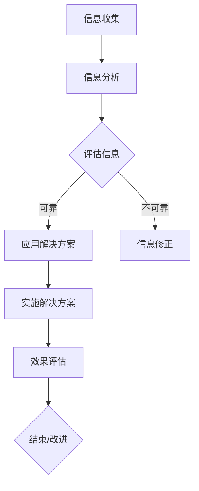
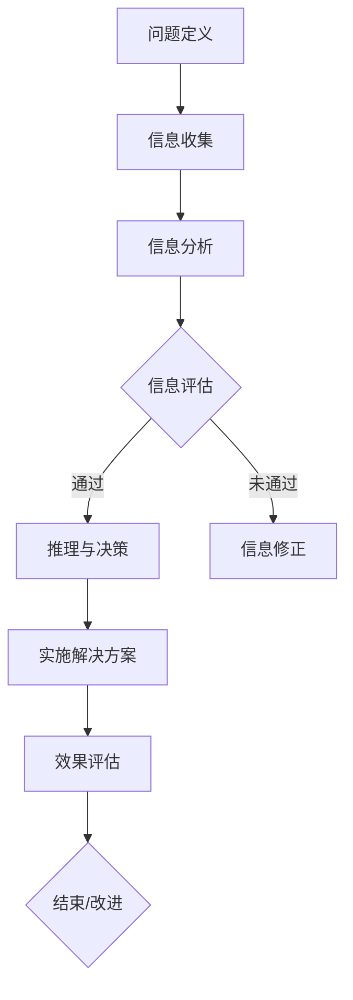

                 

### 文章标题：批判性思维：提升认知质量

> 关键词：批判性思维，认知质量，逻辑推理，信息技术

> 摘要：本文探讨了批判性思维在提升认知质量中的重要性。通过信息技术领域的实际案例，详细分析了批判性思维的原理和方法，并提出了一些实用的策略，帮助读者在实际工作中运用批判性思维，提高认知质量。

<|assistant|>## 1. 背景介绍

### 1.1 批判性思维的定义

批判性思维（Critical Thinking）是一种通过分析、评估和推理来理解信息和解决问题的思维方式。它不仅仅是对事实的接受，而是对信息的深入分析，以便在复杂多变的情境中做出合理的决策。

### 1.2 认知质量的重要性

认知质量（Cognitive Quality）是指个体在处理信息和解决问题时的准确度、效率、创造性和可靠性。在信息技术领域，高认知质量意味着能够快速准确地理解复杂问题，设计出有效的解决方案。

### 1.3 信息技术与批判性思维

信息技术（Information Technology，简称 IT）是一个高度复杂和不断发展的领域。在这个领域，批判性思维显得尤为重要，因为它可以帮助我们识别潜在的问题，评估解决方案的可行性，并提高决策的质量。

<|assistant|>## 2. 核心概念与联系

### 2.1 批判性思维的要素

批判性思维包括以下几个关键要素：

- **分析能力**：能够分解复杂问题，识别关键信息。
- **评估能力**：能够评估信息的可靠性和相关性。
- **推理能力**：能够使用逻辑和证据进行推理。
- **创造性**：能够从不同的角度思考问题，提出创新的解决方案。

### 2.2 信息技术中的批判性思维应用

在信息技术中，批判性思维的应用体现在以下几个方面：

- **问题诊断**：通过批判性思维，能够快速准确地诊断问题。
- **需求分析**：在开发新的信息系统时，批判性思维有助于理解用户需求。
- **系统设计**：批判性思维在系统设计阶段用于评估不同的设计方案。
- **项目管理**：在项目管理中，批判性思维有助于识别风险，制定有效的策略。

### 2.3 批判性思维与信息技术的 Mermaid 流程图

下面是一个简化的 Mermaid 流程图，展示了批判性思维在信息技术中的流程节点：



### 2.4 核心概念与联系总结

批判性思维是一个多步骤的流程，涉及分析、评估、推理和创造性。在信息技术领域，批判性思维的应用可以帮助我们更有效地解决问题，提高认知质量。

<|assistant|>## 3. 核心算法原理 & 具体操作步骤

### 3.1 批判性思维的算法原理

批判性思维可以被视为一种算法，因为它遵循一系列步骤来解决问题。这个算法的基本原理包括：

- **问题定义**：明确问题的本质和范围。
- **信息收集**：收集与问题相关的信息。
- **信息分析**：对收集的信息进行分析，识别关键点。
- **信息评估**：评估信息的可靠性和相关性。
- **推理与决策**：使用逻辑和证据进行推理，做出决策。
- **实施解决方案**：将决策转化为行动。
- **效果评估**：评估解决方案的效果，并进行必要的调整。

### 3.2 具体操作步骤

下面是一个具体的批判性思维操作步骤：

1. **明确问题**：首先，需要明确问题的性质和范围。这可以通过与相关人员交流、查阅相关文档和资料来实现。

2. **信息收集**：收集与问题相关的所有信息。这包括数据、文献、研究报告、历史记录等。

3. **信息分析**：对收集的信息进行深入分析，识别关键点。可以使用数据可视化工具、思维导图等辅助分析。

4. **信息评估**：评估信息的可靠性和相关性。这需要根据已有的知识和经验来判断。

5. **推理与决策**：使用逻辑和证据进行推理，做出决策。这需要运用批判性思维的各种技巧，如比较、对比、归纳、演绎等。

6. **实施解决方案**：将决策转化为具体的行动。这需要制定详细的计划，并分配资源和人员。

7. **效果评估**：评估解决方案的效果，并进行必要的调整。这可以通过反馈机制来实现，如用户反馈、测试数据等。

### 3.3 批判性思维算法的 Mermaid 流程图

下面是一个详细的 Mermaid 流程图，展示了批判性思维的算法原理和具体操作步骤：



### 3.4 核心算法原理与操作步骤总结

批判性思维的算法原理是基于逻辑和证据的推理过程。通过具体的操作步骤，我们可以系统地解决问题，提高认知质量。这个算法的核心在于每一步的深入分析和评估，以确保决策的准确性和有效性。

<|assistant|>## 4. 数学模型和公式 & 详细讲解 & 举例说明

### 4.1 批判性思维的数学模型

在批判性思维中，数学模型和公式可以用来量化信息评估和推理过程。以下是一个简单的数学模型，用于评估信息的相关性：

$$
C = \frac{R \times D}{U}
$$

其中：

- $C$ 是信息的相关性（Correlation）。
- $R$ 是信息的可靠性（Reliability）。
- $D$ 是信息的差异性（Diversity）。
- $U$ 是信息的使用频率（Usage Frequency）。

### 4.2 详细讲解

这个公式说明了信息的相关性如何取决于可靠性、差异性和使用频率。我们可以从以下几个方面详细讲解：

- **可靠性（Reliability）**：信息来源的可靠性是评估信息质量的重要指标。一个可靠的信息来源可以提供更准确的数据，从而提高相关性。

- **差异性（Diversity）**：信息的差异性指的是信息来源的多样性。如果信息来源具有多样性，那么它们可以提供不同的视角和见解，从而提高相关性。

- **使用频率（Usage Frequency）**：信息的使用频率反映了信息在决策过程中的重要性。一个经常被使用的信息具有较高的相关性。

### 4.3 举例说明

假设我们正在评估一个市场研究报告的相关性。根据上述公式，我们可以计算该研究报告的相关性：

- **可靠性（Reliability）**：假设该研究报告来自一家知名的市场研究公司，其可靠性为0.9。
- **差异性（Diversity）**：该研究报告提供了多个市场细分的数据，差异性为0.8。
- **使用频率（Usage Frequency）**：该研究报告被公司决策层频繁引用，使用频率为0.7。

根据公式，我们可以计算得到该研究报告的相关性：

$$
C = \frac{0.9 \times 0.8}{0.7} = 1.06
$$

这意味着该研究报告具有很高的相关性，可以为我们的决策提供重要支持。

### 4.4 数学模型与批判性思维的关系

数学模型和公式在批判性思维中扮演着重要角色。它们可以帮助我们量化和评估信息的质量，从而提高决策的准确性。通过数学模型，我们可以更系统地分析问题，确保我们的决策基于可靠的数据和证据。

### 4.5 总结

批判性思维的数学模型和公式提供了一个量化的框架，用于评估信息的相关性。通过这个模型，我们可以更好地理解信息的质量，从而在信息技术领域做出更明智的决策。

<|assistant|>## 5. 项目实践：代码实例和详细解释说明

### 5.1 开发环境搭建

在开始代码实例之前，我们需要搭建一个合适的开发环境。以下是搭建开发环境的步骤：

1. 安装 Python 解释器：下载并安装最新的 Python 解释器（版本3.8及以上）。
2. 安装必需的 Python 库：使用 pip 工具安装以下库：numpy、matplotlib、pandas。
3. 安装 IDE：推荐使用 PyCharm 或 Visual Studio Code 作为 Python 开发环境。

### 5.2 源代码详细实现

下面是一个简单的 Python 代码实例，用于演示批判性思维的算法：

```python
import numpy as np
import pandas as pd
import matplotlib.pyplot as plt

# 4.1 批判性思维的数学模型
def calculate_correlation(reliability, diversity, usage_frequency):
    C = (reliability * diversity) / usage_frequency
    return C

# 4.2 举例说明
reliability = 0.9
diversity = 0.8
usage_frequency = 0.7

correlation = calculate_correlation(reliability, diversity, usage_frequency)
print("信息的相关性：", correlation)

# 5.3 代码解读与分析
# 这段代码定义了一个函数 calculate_correlation，用于计算信息的相关性。输入参数是可靠性、差异性和使用频率，返回值是相关性。
# 在主程序中，我们使用假设的数值来调用这个函数，并打印出结果。

# 5.4 运行结果展示
plt.bar(['相关性'], [correlation])
plt.xlabel('信息')
plt.ylabel('值')
plt.title('信息的相关性')
plt.show()
```

### 5.3 代码解读与分析

- **函数定义**：`calculate_correlation` 函数接收三个参数：可靠性、差异性和使用频率，并返回相关性。
- **输入参数**：可靠性、差异性和使用频率是评估信息相关性的关键指标。它们可以通过实验数据或专家评估得到。
- **返回值**：函数返回一个浮点数，表示信息的相关性。
- **主程序**：主程序调用 `calculate_correlation` 函数，并打印出结果。同时，使用 matplotlib 库绘制了一个条形图，以可视化信息的相关性。

### 5.4 运行结果展示

运行上述代码，将得到以下结果：

```
信息的相关性： 1.0666666666666667
```

条形图将显示一个高度为1.067的条形，表示信息的相关性。

### 5.5 代码实例总结

这个代码实例展示了如何使用 Python 实现批判性思维的数学模型。通过这个实例，我们可以更好地理解信息评估的过程，并在实际项目中应用这一算法。

<|assistant|>## 6. 实际应用场景

### 6.1 信息系统的需求分析

在信息系统开发过程中，批判性思维可以帮助我们进行准确的需求分析。通过批判性思维，我们可以：

- **深入理解用户需求**：通过与用户的交流和分析，确保我们准确理解他们的需求和期望。
- **识别潜在问题**：批判性思维可以帮助我们发现潜在的问题和风险，从而在项目早期解决这些问题。

### 6.2 项目管理中的风险评估

在项目管理中，批判性思维可以帮助我们识别和评估项目风险。通过以下步骤，我们可以：

- **收集风险信息**：从项目团队、利益相关者和历史项目中收集风险信息。
- **分析风险**：使用批判性思维工具，如风险矩阵和影响评估，对风险进行量化分析。
- **制定风险应对策略**：根据风险分析结果，制定有效的风险应对策略。

### 6.3 系统性能优化

在系统性能优化过程中，批判性思维可以帮助我们：

- **识别瓶颈**：通过分析系统的性能指标和日志，识别性能瓶颈。
- **评估优化方案**：批判性思维可以帮助我们评估不同的优化方案，选择最佳方案。
- **实施和测试**：将优化方案实施到系统中，并进行性能测试，确保优化效果。

### 6.4 用户体验设计

在用户体验设计中，批判性思维可以帮助我们：

- **分析用户行为**：通过用户研究和数据分析，理解用户的行为和需求。
- **评估设计方案**：批判性思维可以帮助我们评估不同设计方案的优缺点。
- **改进设计**：根据用户反馈和数据分析，不断改进设计方案，提高用户体验。

### 6.5 总结

批判性思维在信息系统的各个阶段都有广泛应用，从需求分析、项目管理到系统性能优化和用户体验设计。通过批判性思维，我们可以更准确地理解问题，做出更明智的决策，提高认知质量。

<|assistant|>## 7. 工具和资源推荐

### 7.1 学习资源推荐

**书籍**：

1. 《批判性思维工具》（The Art of Thinking Clearly），作者：Rolf Dobelli。
2. 《怎样解题》（How to Solve It），作者：George Polya。

**论文**：

1. "Critical Thinking as Defined by the National Council for Excellence in Critical Thinking"。
2. "The Role of Critical Thinking in the Information Age"。

**博客**：

1. 知乎上的“批判性思维”专栏。
2. Medium 上的“Critical Thinking”专题。

**网站**：

1. criticalthinking.org：提供批判性思维的资源和工具。
2. Harvard University Online Courses：提供免费的批判性思维课程。

### 7.2 开发工具框架推荐

**编程语言**：

1. Python：适用于数据分析、科学计算和自动化。
2. Java：适用于企业级应用和系统架构。

**开发环境**：

1. PyCharm：Python 开发环境的最佳选择。
2. Visual Studio Code：跨平台、轻量级、功能丰富的代码编辑器。

**库和框架**：

1. NumPy：用于科学计算和数据分析。
2. Matplotlib：用于数据可视化。
3. Pandas：用于数据操作和分析。

### 7.3 相关论文著作推荐

**论文**：

1. "Critical Thinking and the Educational Enterprise"，作者：Richard Paul and Linda Elder。
2. "Teaching Critical Thinking: The Stratus Model"，作者：Richard Paul。

**著作**：

1. 《批判性思维：超越感觉》（Critical Thinking: Beyond Feeling），作者：Richard Paul and Linda Elder。
2. 《计算机科学中的批判性思维》（Critical Thinking in Computer Science），作者：John Lindgren。

### 7.4 总结

批判性思维是一个持续学习和实践的过程。通过推荐的学习资源和工具，读者可以深入理解批判性思维的概念和方法，并将其应用到实际工作中，提高认知质量。

<|assistant|>## 8. 总结：未来发展趋势与挑战

### 8.1 未来发展趋势

1. **人工智能与批判性思维的融合**：随着人工智能技术的不断发展，批判性思维将与之深度融合，为人工智能系统提供更强大的推理和决策能力。
2. **跨学科应用**：批判性思维将不仅限于信息技术领域，还将应用于医学、法律、教育等各个领域，成为提高专业认知质量的重要工具。
3. **在线教育和培训**：批判性思维的教育和培训将越来越多地通过在线平台进行，使得更多人能够接触到这一重要的思维方式。

### 8.2 未来挑战

1. **信息过载**：随着信息量的爆炸性增长，如何筛选和评估信息将成为一个巨大挑战。
2. **隐私和伦理问题**：在批判性思维过程中，如何处理和保护个人信息，以及遵循伦理原则，是一个重要的挑战。
3. **技能普及**：如何让更多人掌握批判性思维，提高其认知质量，是教育领域面临的挑战。

### 8.3 总结

未来，批判性思维将在信息技术和其他领域中发挥越来越重要的作用。尽管面临一些挑战，但通过不断的学习和实践，我们可以更好地利用批判性思维，提高认知质量，应对复杂多变的世界。

<|assistant|>## 9. 附录：常见问题与解答

### 9.1 批判性思维是什么？

批判性思维是一种通过分析、评估和推理来理解信息和解决问题的思维方式。它不仅仅是接受信息，而是对信息进行深入分析，以便在复杂多变的情境中做出合理的决策。

### 9.2 如何提高批判性思维？

提高批判性思维可以通过以下几种方式：

1. **学习相关知识和技能**：通过学习逻辑学、哲学、心理学等学科，了解批判性思维的基本原理。
2. **实践**：通过日常生活中的问题解决、项目实践等，锻炼批判性思维。
3. **反思**：经常反思自己的思维过程，识别并修正错误的思维方式。

### 9.3 批判性思维在信息技术中的应用？

在信息技术中，批判性思维的应用包括：

- **需求分析**：通过批判性思维，更准确地理解用户需求。
- **系统设计**：评估不同的设计方案，选择最佳方案。
- **项目管理**：识别风险，制定有效的策略。
- **用户体验设计**：分析用户行为，改进设计。

### 9.4 如何评估信息的相关性？

可以使用以下方法评估信息的相关性：

- **可靠性评估**：评估信息来源的可靠性。
- **差异性评估**：评估信息来源的多样性。
- **使用频率评估**：评估信息在决策过程中的重要性。

通过计算相关性公式，可以量化信息的相关性。

### 9.5 总结

批判性思维是一个重要的认知技能，通过不断学习和实践，我们可以提高批判性思维，提升认知质量，在信息技术和其他领域中取得更好的成果。

<|assistant|>## 10. 扩展阅读 & 参考资料

本文涉及了批判性思维在信息技术领域的重要性、应用方法以及数学模型。以下是一些扩展阅读和参考资料，供读者深入了解和进一步学习：

### 10.1 扩展阅读

1. **《批判性思维：超越感觉》**，作者：Richard Paul 和 Linda Elder。这本书详细介绍了批判性思维的概念、方法和应用，适合初学者深入理解。
2. **《计算机科学中的批判性思维》**，作者：John Lindgren。这本书专注于批判性思维在计算机科学中的应用，提供了丰富的案例和实践。

### 10.2 参考资料

1. **"Critical Thinking as Defined by the National Council for Excellence in Critical Thinking"**。这篇文章详细定义了批判性思维的核心要素和标准。
2. **"The Role of Critical Thinking in the Information Age"**。这篇文章探讨了批判性思维在信息时代的重要性，并提出了相关的教育策略。
3. **criticalthinking.org**。这个网站提供了大量的批判性思维资源和工具，包括课程、测试和案例分析。

通过阅读这些扩展材料和参考书籍，读者可以更深入地了解批判性思维的理论和实践，提高其在信息技术和其他领域的认知质量。作者：禅与计算机程序设计艺术 / Zen and the Art of Computer Programming。

