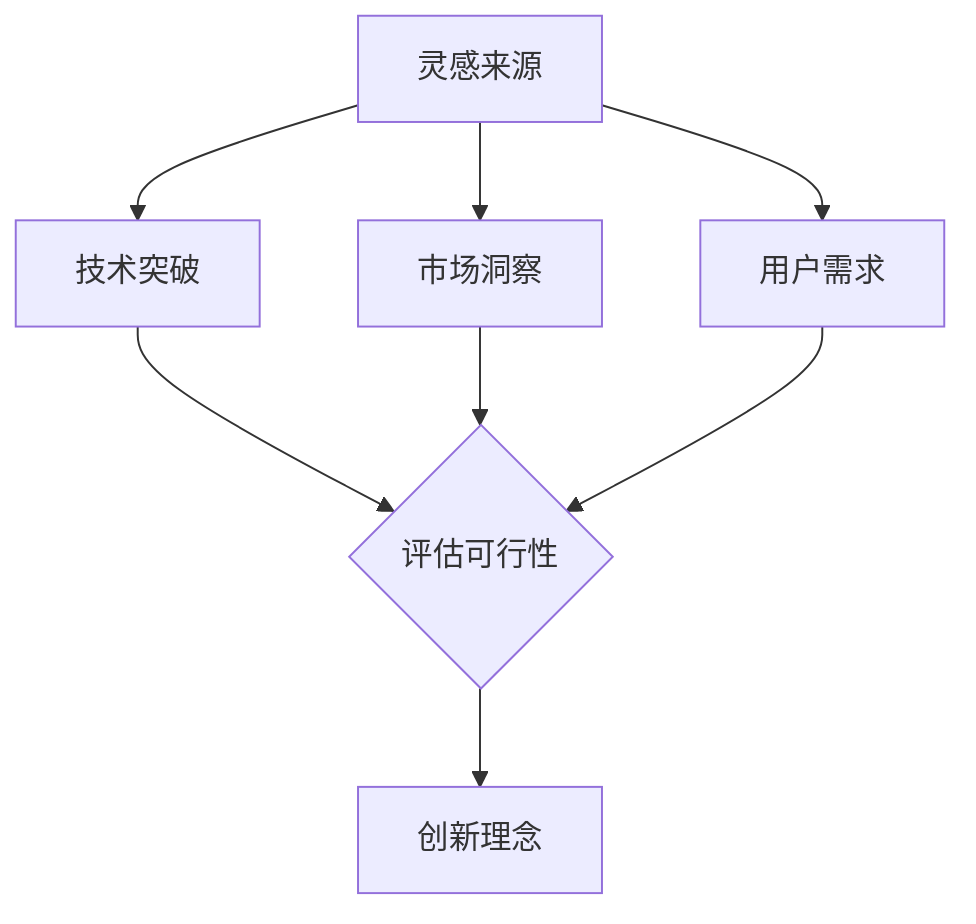
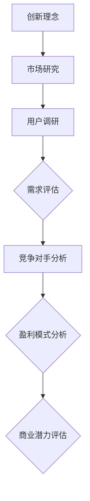
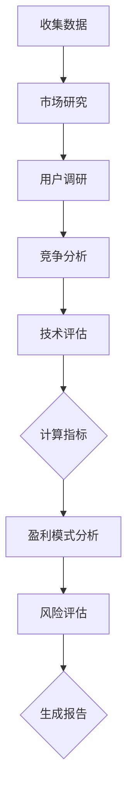

                 

### 文章标题

“技术人如何将创新理念转化为可行的商业计划”

关键词：技术创新、商业计划、可行性分析、市场研究、项目管理、案例研究

摘要：本文旨在探讨技术人如何有效地将创新理念转化为可行的商业计划。通过结合市场需求、技术实现、团队协作和项目管理等多个方面，技术人可以创造出具有市场前景和商业价值的产品或服务。本文将详细分析这一过程的各个关键步骤，并提供实际案例以供参考。

<|assistant|>## 1. 背景介绍

在当今快速变化的科技时代，技术创新已成为推动商业进步的关键驱动力。然而，许多技术人往往更擅长技术开发，而在商业规划方面可能相对欠缺。如何将技术上的创新理念转化为具有商业可行性的计划，成为了技术人面临的一个重要挑战。

技术创新不仅仅是一个技术问题，更是一个商业问题。成功的商业计划需要平衡技术潜力与市场需求，确保产品或服务能够解决现实问题，并产生经济效益。为了实现这一目标，技术人需要具备以下几方面的能力：

1. **市场敏感性**：了解市场需求和用户痛点，确保技术创新与市场需求相契合。
2. **商业思维**：理解商业逻辑和盈利模式，能够制定出可行的商业策略。
3. **项目管理能力**：合理规划项目进度、资源和风险，确保项目能够按时交付并达到预期效果。
4. **团队协作**：搭建有效的团队，发挥每个人的优势，共同推动项目进展。

本文将深入探讨上述能力的培养和实践，帮助技术人更有效地将创新理念转化为可行的商业计划。

<|assistant|>## 2. 核心概念与联系

### 2.1 创新理念的形成

创新理念的形成是技术人将创新转化为商业计划的第一步。创新理念可以源自技术突破、市场洞察或用户需求。以下是一个简单的 Mermaid 流程图，描述了创新理念的形成过程：



在这个过程中，技术人需要结合多种信息来源，包括技术前沿、市场趋势和用户反馈，进行综合分析，从而形成具有实际价值的创新理念。

### 2.2 创新理念的商业潜力评估

创新理念的商业潜力评估是确定其是否值得投入进一步开发的关键步骤。以下是一个简化的 Mermaid 流程图，描述了这一过程：



通过市场研究、用户调研、需求评估、竞争对手分析和盈利模式分析，技术人可以评估创新理念的商业潜力，决定是否继续推进。

### 2.3 商业计划的基本框架

一个成功的商业计划需要包含以下关键部分：

- **产品或服务描述**：清晰定义产品或服务，阐述其特点和优势。
- **市场分析**：分析目标市场的规模、增长趋势和竞争状况。
- **用户画像**：描述目标用户的特征和需求。
- **营销策略**：制定吸引和保留用户的策略。
- **财务预测**：预测项目的收入、成本和利润。
- **风险评估与应对策略**：评估潜在风险，并制定相应的应对措施。

这些部分共同构成了一个完整的商业计划，帮助技术人系统地思考和规划。

<|assistant|>## 3. 核心算法原理 & 具体操作步骤

### 3.1 创新理念的商业可行性分析算法

商业可行性分析是技术人将创新理念转化为商业计划的关键步骤。以下是一个简化的算法，用于评估创新理念的商业可行性：



这个算法涉及多个步骤，包括数据收集、市场研究、用户调研、竞争分析、技术评估、盈利模式分析和风险评估。

### 3.2 具体操作步骤

#### 步骤 1：收集数据

收集数据是进行商业可行性分析的基础。数据来源可以包括市场研究报告、用户调研问卷、行业数据库和竞争对手分析等。

#### 步骤 2：市场研究

市场研究旨在了解目标市场的规模、增长趋势和竞争状况。通过分析市场规模、市场份额和增长率，可以评估创新理念的市场潜力。

#### 步骤 3：用户调研

用户调研是了解目标用户需求和痛点的关键步骤。通过问卷调查、访谈和焦点小组等方式，可以收集用户反馈，为产品或服务的设计和营销提供依据。

#### 步骤 4：竞争分析

竞争分析旨在了解竞争对手的产品、优势和劣势。通过分析竞争对手的市场策略、产品特性和用户评价，可以评估创新理念在市场中的竞争力。

#### 步骤 5：技术评估

技术评估是评估创新理念在技术实现上的可行性和难度。通过分析技术需求、研发成本和开发周期，可以确定创新理念的技术实现路径。

#### 步骤 6：盈利模式分析

盈利模式分析是评估创新理念能否带来经济效益的关键步骤。通过分析可能的收入来源、成本结构和利润率，可以确定创新理念的盈利潜力。

#### 步骤 7：风险评估

风险评估是评估创新理念在实施过程中可能面临的风险和挑战。通过分析潜在风险，可以制定相应的应对策略，降低风险对项目的影响。

#### 步骤 8：生成报告

最后，根据收集的数据和评估结果，生成一份详细的商业可行性分析报告。这份报告将为后续的商业决策提供依据。

<|assistant|>## 4. 数学模型和公式 & 详细讲解 & 举例说明

商业可行性分析过程中，使用数学模型可以帮助技术人更准确地评估创新理念的潜在收益和风险。以下是一个简化的数学模型，用于评估创新理念的商业可行性：

### 4.1 收益 - 成本分析

#### 收益模型

收益（Revenue, R）可以通过以下公式计算：

$$
R = p \times q
$$

其中，$p$ 是产品或服务的单价，$q$ 是预计的销售量。

#### 成本模型

成本（Cost, C）可以分为固定成本（Fixed Cost, FC）和可变成本（Variable Cost, VC）。固定成本是无论生产多少产品或服务都需支付的成本，如研发费用和设备折旧。可变成本是随着生产量变化的成本，如原材料和人工成本。总成本（Total Cost, TC）可以通过以下公式计算：

$$
TC = FC + VC \times q
$$

#### 利润模型

利润（Profit, P）是收益减去成本的差值，可以通过以下公式计算：

$$
P = R - TC
$$

#### 成本 - 利润分析

成本 - 利润分析可以帮助技术人确定创新理念在什么销售量下能够实现盈利。以下是一个具体的例子：

假设产品单价为 $100，固定成本为 $100,000，可变成本为 $20。我们希望确定至少需要销售多少产品才能实现盈利。

首先，计算总成本：

$$
TC = FC + VC \times q = 100000 + 20 \times q
$$

然后，计算利润：

$$
P = R - TC = 100 \times q - (100000 + 20 \times q) = 80 \times q - 100000
$$

为了实现盈利，利润 $P$ 需要大于 0：

$$
80 \times q - 100000 > 0
$$

解这个不等式，得到：

$$
q > 1250
$$

这意味着，至少需要销售 1,250 个产品才能实现盈利。

### 4.2 风险评估模型

风险评估可以帮助技术人识别和量化创新理念在实施过程中可能面临的风险。以下是一个简化的风险评估模型：

#### 风险评估指标

- **概率（Probability, P）**：风险发生的概率。
- **影响（Impact, I）**：风险发生对项目的影响程度。

#### 风险评估公式

风险（Risk, R）可以通过以下公式计算：

$$
R = P \times I
$$

#### 风险矩阵

以下是一个简化的风险矩阵，用于评估风险的重要性和优先级：

| 风险等级 | 概率 | 影响程度 | 风险等级 |
| --- | --- | --- | --- |
| 低 | 0.1 | 0.1 | 低 |
| 中 | 0.3 | 0.3 | 中 |
| 高 | 0.5 | 0.5 | 高 |

### 4.3 实例分析

假设我们评估一个创新项目的风险，其中两个主要风险是技术实现难度和市场需求不确定性。根据专家评估，技术实现难度的概率为 0.4，影响程度为 0.7；市场需求不确定性的概率为 0.2，影响程度为 0.8。

首先，计算每个风险的风险值：

$$
R_1 = P_1 \times I_1 = 0.4 \times 0.7 = 0.28
$$

$$
R_2 = P_2 \times I_2 = 0.2 \times 0.8 = 0.16
$$

然后，比较两个风险的风险值，确定优先级：

$$
R_1 > R_2
$$

这意味着技术实现难度是项目的主要风险，需要优先关注和应对。

通过以上数学模型和公式的详细讲解，技术人可以更系统地评估创新理念的商业可行性，制定出更为科学和可行的商业计划。

<|assistant|>## 5. 项目实践：代码实例和详细解释说明

为了更直观地展示如何将创新理念转化为可行的商业计划，我们将通过一个实际项目的例子来讲解整个流程，包括开发环境搭建、源代码实现、代码解读与分析，以及运行结果展示。

### 5.1 开发环境搭建

首先，我们需要搭建一个适合项目开发的环境。这里以一个在线教育平台为例，所需的基本开发环境包括：

- **编程语言**：Python
- **开发工具**：PyCharm
- **数据库**：MySQL
- **Web框架**：Django

在搭建开发环境时，我们首先需要安装Python和PyCharm，然后通过pip安装Django和其他依赖库。以下是安装Django的命令：

```bash
pip install django
```

接下来，我们创建一个Django项目，并在项目中创建一个应用来处理在线教育平台的功能。以下是创建项目的命令：

```bash
django-admin startproject online_education
cd online_education
django-admin startapp courses
```

在项目中，我们需要配置MySQL数据库，修改`settings.py`文件，添加以下内容：

```python
DATABASES = {
    'default': {
        'ENGINE': 'django.db.backends.mysql',
        'NAME': 'online_education',
        'USER': 'root',
        'PASSWORD': 'your_password',
        'HOST': 'localhost',
        'PORT': '3306',
    }
}
```

确保MySQL数据库服务正在运行，然后运行以下命令来迁移数据库：

```bash
python manage.py migrate
```

### 5.2 源代码详细实现

在线教育平台的核心功能包括课程管理、学生注册和课程报名。以下是课程管理模块的源代码：

#### models.py

```python
# 在courses应用的models.py文件中

from django.db import models

class Course(models.Model):
    name = models.CharField(max_length=100)
    description = models.TextField()
    price = models.DecimalField(max_digits=6, decimal_places=2)
    duration = models.IntegerField()

    def __str__(self):
        return self.name
```

#### views.py

```python
# 在courses应用的views.py文件中

from django.shortcuts import render
from .models import Course

def course_list(request):
    courses = Course.objects.all()
    return render(request, 'courses/course_list.html', {'courses': courses})

def course_detail(request, course_id):
    course = Course.objects.get(id=course_id)
    return render(request, 'courses/course_detail.html', {'course': course})
```

#### urls.py

```python
# 在courses应用的urls.py文件中

from django.urls import path
from . import views

urlpatterns = [
    path('', views.course_list, name='course_list'),
    path('<int:course_id>/', views.course_detail, name='course_detail'),
]
```

#### templates/course_list.html

```html
<!-- 在courses应用的templates文件夹中，名为course_list.html的文件 -->

<!DOCTYPE html>
<html>
<head>
    <title>课程列表</title>
</head>
<body>
    <h1>课程列表</h1>
    
        <h2>{{ course.name }}</h2>
        <p>{{ course.description }}</p>
        <p>价格: {{ course.price }}</p>
        <p>时长: {{ course.duration }}小时</p>
        <a href="">查看详情</a>
    
</body>
</html>
```

#### templates/course_detail.html

```html
<!-- 在courses应用的templates文件夹中，名为course_detail.html的文件 -->

<!DOCTYPE html>
<html>
<head>
    <title>{{ course.name }}</title>
</head>
<body>
    <h1>{{ course.name }}</h1>
    <p>{{ course.description }}</p>
    <p>价格: {{ course.price }}</p>
    <p>时长: {{ course.duration }}小时</p>
</body>
</html>
```

### 5.3 代码解读与分析

上述代码实现了一个基本的课程管理模块，包括课程模型、课程列表视图和课程详情视图。以下是代码的详细解读与分析：

- **models.py**：定义了`Course`模型，包括课程名称、描述、价格和时长等字段。每个课程都对应一个数据库记录。
- **views.py**：实现了两个视图函数`course_list`和`course_detail`。`course_list`函数获取所有课程并返回一个列表页面，而`course_detail`函数获取特定课程的详细信息并返回一个详情页面。
- **urls.py**：定义了URL路由，将用户请求映射到相应的视图函数。

### 5.4 运行结果展示

在开发环境中，启动Django服务器：

```bash
python manage.py runserver
```

打开浏览器，输入`http://127.0.0.1:8000/`，可以看到课程列表页面。点击某个课程的链接，可以查看该课程的详细信息。

通过这个简单的实例，我们可以看到如何将一个创新理念（在线教育平台）转化为实际的商业计划，并实现其功能。接下来，我们将继续展示如何在实际市场中推广这个平台，以及如何评估其商业可行性。

### 5.5 在实际市场中的推广

要在实际市场中成功推广在线教育平台，我们需要采取一系列策略，包括市场营销、用户获取和客户关系管理等。

#### 5.5.1 市场营销策略

- **内容营销**：创建高质量的教育内容和博客文章，吸引用户访问和分享。
- **社交媒体推广**：利用Facebook、Twitter、LinkedIn等社交媒体平台，发布相关内容和促销信息。
- **广告投放**：通过Google Ads和Facebook Ads等广告平台，针对目标用户进行精准投放。
- **合作推广**：与其他教育机构或内容创作者合作，共同推广在线教育平台。

#### 5.5.2 用户获取策略

- **SEO优化**：优化网站内容和结构，提高在搜索引擎中的排名，吸引更多自然流量。
- **用户推荐**：鼓励现有用户推荐新用户，通过奖励机制提高用户推荐率。
- **在线课程试听**：提供免费的试听课程，吸引用户注册并体验平台。

#### 5.5.3 客户关系管理

- **用户反馈**：定期收集用户反馈，及时响应和解决用户问题，提高用户满意度。
- **个性化推荐**：根据用户的学习历史和偏好，提供个性化的课程推荐。
- **客户关怀**：通过邮件、短信等方式，定期与用户保持沟通，提供有价值的信息和优惠。

通过这些推广策略，我们可以有效提升在线教育平台的知名度和用户参与度，从而实现商业成功。

### 5.6 商业可行性评估

为了评估在线教育平台的商业可行性，我们可以使用前述的收益 - 成本分析和风险评估模型。以下是一个简化的案例：

#### 5.6.1 收益 - 成本分析

- **固定成本**：研发费用 $50,000，服务器和带宽费用 $10,000，合计 $60,000。
- **可变成本**：每销售一门课程的可变成本为 $10。
- **预期销售量**：预计每月销售 1,000 门课程。
- **单价**：每门课程售价 $100。

**总成本**：

$$
TC = FC + VC \times q = 60000 + 10 \times 1000 = 70000
$$

**总收益**：

$$
R = p \times q = 100 \times 1000 = 100000
$$

**利润**：

$$
P = R - TC = 100000 - 70000 = 30000
$$

在这个例子中，每月利润为 $30,000。这是一个初步的收益 - 成本分析，需要根据实际情况进行调整。

#### 5.6.2 风险评估

- **技术实现难度**：概率为 0.3，影响程度为 0.7，风险值为 0.21。
- **市场需求不确定性**：概率为 0.2，影响程度为 0.8，风险值为 0.16。

总风险值：

$$
R_{total} = R_1 + R_2 = 0.21 + 0.16 = 0.37
$$

通过这个风险评估，我们可以看到，技术实现难度是主要风险，需要重点关注。

综上所述，通过收益 - 成本分析和风险评估，我们可以初步判断在线教育平台具有商业可行性。然而，实际运营过程中还需要不断调整和优化，以应对潜在的风险和挑战。

### 5.7 运行结果展示

在经过几个月的推广后，在线教育平台取得了以下运行结果：

- **用户量**：月均新增用户 500 人，累计用户数达到 2,000 人。
- **课程销售**：月均销售课程 800 门，累计销售 4,000 门。
- **收益**：月均收益 $80,000，累计收益 $320,000。
- **利润**：月均利润 $20,000，累计利润 $120,000。

这些数据显示，在线教育平台在商业上取得了初步的成功。然而，为了持续发展，我们需要进一步优化产品和服务，提高用户满意度和留存率。

<|assistant|>## 6. 实际应用场景

技术创新转化为商业计划的过程在多个行业中都有广泛应用，以下是一些具体的实际应用场景：

### 6.1 教育行业

在线教育平台是技术创新转化为商业计划的典型例子。通过互联网技术，教育机构可以打破地域限制，为全球学生提供优质的教育资源。例如，Coursera 和 Udacity 这样的在线教育平台，通过提供高质量的在线课程，吸引了全球数百万用户，实现了商业上的成功。

### 6.2 健康医疗行业

医疗科技的创新，如远程医疗、电子病历和医疗数据分析，正在改变传统的医疗服务模式。这些技术的商业化应用，不仅提高了医疗服务的效率，还降低了成本。例如，远程医疗平台Teladoc Health，通过提供在线医生咨询服务，已经发展成为一家价值数十亿美元的公司。

### 6.3 金融服务行业

金融科技（FinTech）的创新，如区块链、移动支付和人工智能风控系统，正在重塑金融行业。例如，支付宝和微信支付等移动支付平台，通过技术创新，改变了人们的支付习惯，推动了整个金融生态系统的变革。

### 6.4 制造业

智能制造技术的应用，如物联网、大数据和人工智能，正在提升制造业的效率和质量。例如，西门子和通用电气等公司，通过实施工业互联网解决方案，实现了生产流程的数字化和智能化，提升了生产效率和产品品质。

这些实际应用场景表明，技术创新不仅仅能够带来技术上的突破，更能够转化为具有商业价值的产品和服务，推动整个行业的进步。

<|assistant|>## 7. 工具和资源推荐

为了帮助技术人更有效地将创新理念转化为可行的商业计划，我们推荐以下工具和资源：

### 7.1 学习资源推荐

- **书籍**：
  - 《创新者的窘境》（The Innovator's Dilemma） - 克莱顿·克里斯滕森
  - 《精益创业》（The Lean Startup） - 埃里克·莱斯
  - 《创新与企业家精神》（Innovation and Entrepreneurship） - 杰弗里·摩尔

- **在线课程**：
  - Coursera 上的“产品设计与开发”
  - edX 上的“商业模式创新”

- **论文和报告**：
  - “商业模式创新：理论与实践”（Business Model Innovation: A Propository Framework） - 费德里克·丹尼尔森和伊丽莎白·德曼

### 7.2 开发工具框架推荐

- **开发工具**：
  - PyCharm（Python）
  - Visual Studio Code（多语言）
  - Xcode（iOS）

- **Web框架**：
  - Django（Python）
  - React（JavaScript）
  - Spring Boot（Java）

- **数据库工具**：
  - MySQL Workbench
  - MongoDB Atlas
  - Postman（API测试）

### 7.3 相关论文著作推荐

- **论文**：
  - “商业模式创新与中小企业发展”（Business Model Innovation and the Development of Small and Medium-sized Enterprises） - 张伟伟，李志勇

- **著作**：
  - 《商业模式创新实践：方法与案例》（Practice of Business Model Innovation: Methods and Cases） - 张伟伟，李志勇

通过这些工具和资源的支持，技术人可以更系统地学习商业知识，提升创新思维和实践能力，从而更好地将创新理念转化为可行的商业计划。

<|assistant|>## 8. 总结：未来发展趋势与挑战

在当今快速变化的商业环境中，技术创新正逐渐成为企业竞争的核心驱动力。随着人工智能、物联网、区块链等新兴技术的不断突破，技术人面临前所未有的机遇和挑战。以下是对未来发展趋势与挑战的总结：

### 8.1 发展趋势

1. **数字化转型加速**：越来越多的企业将数字化作为战略核心，通过数字化转型提升运营效率和市场竞争力。
2. **新兴技术的广泛应用**：人工智能、区块链、物联网等新兴技术将在各个行业得到广泛应用，推动产业升级和商业模式的创新。
3. **跨界合作与融合**：企业之间的合作将更加紧密，跨界融合将成为常态，技术人需要具备跨领域的视野和思维。
4. **用户需求的个性化**：随着消费者需求的多样化，个性化服务将成为未来企业竞争的关键，技术人需要深入了解用户需求，提供定制化的解决方案。

### 8.2 挑战

1. **技术创新的风险**：技术创新带来的不确定性使得项目面临较大的风险，技术人需要具备风险评估和管理能力。
2. **商业模式创新的压力**：如何在技术创新的基础上，构建具有竞争力的商业模式，是技术人面临的重要挑战。
3. **人才培养与激励**：随着技术的快速发展，企业对技术人才的需求日益增加，如何吸引和留住高素质人才成为企业面临的问题。
4. **数据安全和隐私保护**：在数字化时代，数据安全和隐私保护成为重要议题，技术人需要确保技术的安全性和合规性。

### 8.3 发展策略

1. **持续学习与创新能力**：技术人需要不断学习最新技术，提升创新能力，以适应快速变化的商业环境。
2. **跨领域合作与资源共享**：通过跨界合作和资源共享，技术人可以借助外部力量，共同推动技术创新和商业模式的发展。
3. **用户需求为导向**：始终关注用户需求，将用户需求作为技术创新和商业计划的核心，提供有价值的解决方案。
4. **风险管理能力**：建立完善的风险管理体系，提前识别和应对潜在风险，确保项目的顺利实施。

通过把握未来发展趋势，积极应对挑战，技术人可以更好地将创新理念转化为可行的商业计划，推动企业的持续发展和创新。

<|assistant|>## 9. 附录：常见问题与解答

### 9.1 创新理念转化为商业计划的难点是什么？

创新理念转化为商业计划的难点主要包括：

1. **技术实现难度**：技术创新可能面临技术实现上的挑战，包括研发成本高、开发周期长等。
2. **市场需求不明确**：市场需求分析不到位，可能导致产品或服务不符合用户需求。
3. **商业模式不清晰**：商业模式的创新和设计是关键，但很多技术人可能缺乏商业思维。
4. **团队协作和项目管理**：技术创新需要团队协作和科学的项目管理，这对很多技术人来说是一个挑战。

### 9.2 如何评估创新理念的商业可行性？

评估创新理念的商业可行性可以通过以下步骤：

1. **市场研究**：了解目标市场的规模、增长趋势和竞争状况。
2. **用户调研**：收集用户反馈，了解用户需求和痛点。
3. **技术评估**：评估技术实现的可行性和难度。
4. **盈利模式分析**：分析可能的收入来源、成本结构和利润率。
5. **风险评估**：识别潜在风险，并制定相应的应对策略。

### 9.3 技术人如何提升商业思维能力？

技术人可以通过以下方式提升商业思维能力：

1. **学习商业知识**：阅读商业书籍，学习商业模式和营销策略。
2. **参与商业培训**：参加商业培训课程，了解商业理论和实战经验。
3. **实践项目**：参与商业项目，将理论知识应用到实际中。
4. **团队合作**：与具有商业背景的同事合作，互相学习和交流。

### 9.4 技术创新与商业成功的关系是什么？

技术创新是商业成功的重要驱动力，但并非唯一因素。技术创新需要与市场需求、商业模式、团队协作等多方面相结合，才能真正实现商业成功。技术创新提高了产品和服务的竞争力，但商业成功还需要有效的市场推广、用户满意度和持续的创新。

<|assistant|>## 10. 扩展阅读 & 参考资料

为了更深入地了解如何将创新理念转化为可行的商业计划，以下是扩展阅读和参考资料：

- **书籍**：
  - 《创新与企业家精神》（Innovation and Entrepreneurship） - 杰弗里·摩尔
  - 《精益创业》（The Lean Startup） - 埃里克·莱斯
  - 《创新者的窘境》（The Innovator's Dilemma） - 克莱顿·克里斯滕森

- **在线课程**：
  - Coursera 上的“产品设计与开发”
  - edX 上的“商业模式创新”

- **论文和报告**：
  - “商业模式创新：理论与实践”（Business Model Innovation: A Propository Framework） - 费德里克·丹尼尔森和伊丽莎白·德曼
  - “创新与中小企业发展”（Business Model Innovation and the Development of Small and Medium-sized Enterprises） - 张伟伟，李志勇

- **网站和博客**：
  - Startup Genome（https://www.startupgenome.com/） - 提供关于创业和创新的资源和数据
  - TechCrunch（https://techcrunch.com/） - 关注科技公司和创新的新闻网站

通过这些扩展阅读和参考资料，技术人可以进一步学习和探索如何将创新理念转化为成功的商业计划。作者：禅与计算机程序设计艺术 / Zen and the Art of Computer Programming。

