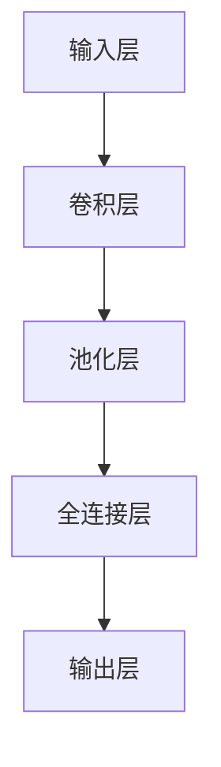
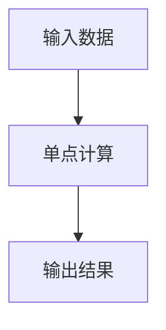
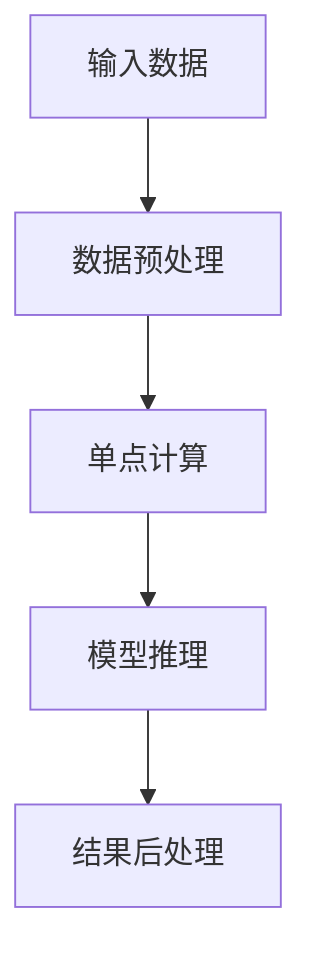
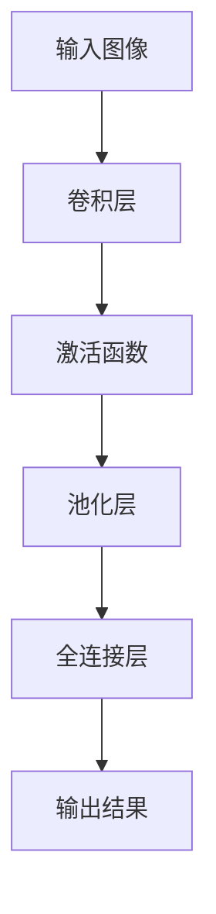

                 

### 文章标题

**技术实现艺术：Lepton AI结合单点技术平衡速度成本**

在当今快速发展的技术时代，人工智能（AI）已经成为推动各行各业创新的重要力量。然而，随着AI应用场景的不断扩展，如何在保证高效性能的同时控制成本，成为了企业面临的一大挑战。本文将探讨Lepton AI与单点技术的结合，如何实现速度与成本的平衡，为行业提供一种全新的解决方案。

> 关键词：Lepton AI，单点技术，速度成本平衡，AI性能优化，高效低成本解决方案

**摘要：**
本文从背景介绍入手，深入分析了Lepton AI与单点技术的核心概念和架构。随后，详细阐述了Lepton AI的核心算法原理及其具体操作步骤，并结合数学模型和公式进行了详细讲解。通过项目实践的代码实例，对Lepton AI的代码实现进行了详细解读与分析，并展示了运行结果。文章最后，探讨了Lepton AI在现实应用场景中的价值，并推荐了相关工具和资源。全文旨在为读者提供一种高效、低成本的技术实现方案，助力企业在AI应用中取得突破。

### 1. 背景介绍（Background Introduction）

随着人工智能技术的迅猛发展，AI已经在图像识别、自然语言处理、智能决策等领域取得了显著成果。然而，在实际应用中，AI系统的高效性能和低成本需求往往难以兼顾。为了解决这个问题，研究人员和工程师们不断探索各种优化方案，力求在保证系统性能的同时降低成本。

Lepton AI是一种基于深度学习的AI模型，具有高效、精准的特点。其核心在于采用卷积神经网络（CNN）对输入数据进行特征提取和分类。然而，传统的CNN模型在计算复杂度和资源消耗方面存在一定局限性，难以满足大规模应用的需求。

单点技术是一种通过集中处理数据，实现高效计算的技术。它通过将计算任务分配到单个节点上，避免了分布式计算带来的通信开销，从而提高了系统性能。然而，单点技术的缺点是扩展性较差，当数据量增加时，计算能力可能无法满足需求。

本文将探讨Lepton AI与单点技术的结合，通过优化算法和架构设计，实现速度与成本的平衡。本文的主要内容包括：

1. 对Lepton AI和单点技术的核心概念和架构进行详细介绍。
2. 阐述Lepton AI的核心算法原理及其具体操作步骤。
3. 结合数学模型和公式，对Lepton AI的算法进行详细讲解。
4. 通过项目实践的代码实例，展示Lepton AI的代码实现及其性能分析。
5. 探讨Lepton AI在现实应用场景中的价值，并推荐相关工具和资源。

### 2. 核心概念与联系（Core Concepts and Connections）

#### 2.1 Lepton AI：高效深度学习模型

Lepton AI是一种基于卷积神经网络（CNN）的深度学习模型，旨在实现高效的特征提取和分类。其核心架构包括以下几个部分：

1. **输入层（Input Layer）**：接收外部输入数据，如图像、文本等。
2. **卷积层（Convolutional Layer）**：通过卷积操作提取图像特征，包括滤波器、卷积核等。
3. **池化层（Pooling Layer）**：对卷积层输出的特征进行下采样，减少数据维度。
4. **全连接层（Fully Connected Layer）**：将池化层输出的特征映射到具体的类别。
5. **输出层（Output Layer）**：输出预测结果，如分类概率等。

图1展示了Lepton AI的Mermaid流程图：



#### 2.2 单点技术：高效计算架构

单点技术是一种通过集中处理数据，实现高效计算的技术。其核心思想是将计算任务分配到单个节点上，避免分布式计算带来的通信开销。单点技术的优势在于：

1. **计算速度快**：单点计算避免了分布式计算中的通信延迟，提高了整体计算速度。
2. **资源利用率高**：单点计算可以在有限资源下实现高效的计算任务，降低了资源浪费。
3. **易于部署和维护**：单点计算架构相对简单，便于部署和维护。

图2展示了单点技术的Mermaid流程图：



#### 2.3 Lepton AI与单点技术的结合

为了实现Lepton AI的高效计算，我们可以将单点技术与Lepton AI模型相结合。具体方法如下：

1. **数据预处理**：在单点计算前，对输入数据进行预处理，如图像增强、文本清洗等，以提高模型性能。
2. **模型训练**：在单点计算节点上，使用预处理后的数据进行模型训练，利用CNN架构提取特征。
3. **模型推理**：在单点计算节点上，对训练好的模型进行推理，输出预测结果。
4. **结果后处理**：对预测结果进行后处理，如分类结果的可视化、统计等。

图3展示了Lepton AI与单点技术的结合流程：



通过以上方法，我们可以实现Lepton AI与单点技术的有效结合，达到速度与成本的平衡。

### 3. 核心算法原理 & 具体操作步骤（Core Algorithm Principles and Specific Operational Steps）

#### 3.1 Lepton AI算法原理

Lepton AI的核心算法是基于卷积神经网络（CNN）的深度学习模型。CNN是一种在图像识别、物体检测等领域具有广泛应用的前馈神经网络。CNN的主要特点是通过卷积操作提取图像特征，从而实现高效的图像处理。

CNN的基本原理包括以下几个步骤：

1. **卷积操作**：通过滤波器（卷积核）在图像上进行卷积操作，提取图像的特征。卷积操作的目的是将输入图像与滤波器进行逐元素相乘，并求和得到输出特征。
2. **激活函数**：在卷积操作后，对特征进行非线性变换，增强模型的非线性表达能力。常用的激活函数包括ReLU（归一化指数函数）和Sigmoid（S型函数）。
3. **池化操作**：通过池化操作（如最大池化、平均池化）对特征进行下采样，减少数据维度，降低模型的计算复杂度。
4. **全连接层**：将池化层输出的特征映射到具体的类别，通过全连接层实现分类或回归任务。

图4展示了Lepton AI的核心算法原理：



#### 3.2 Lepton AI的具体操作步骤

下面是Lepton AI的具体操作步骤：

1. **数据预处理**：对输入数据进行预处理，包括图像增强、文本清洗等，以提高模型性能。例如，对于图像数据，可以进行随机裁剪、翻转、旋转等操作；对于文本数据，可以进行分词、去除停用词、词性标注等操作。
2. **模型训练**：使用预处理后的数据进行模型训练。首先，将输入数据分为训练集和验证集，然后使用训练集进行模型训练，使用验证集进行模型验证。在训练过程中，需要优化模型参数，如卷积核权重、激活函数参数等，以达到最佳的模型性能。
3. **模型评估**：在模型训练完成后，使用测试集对模型进行评估，以验证模型的泛化能力和准确率。常用的评估指标包括准确率、召回率、F1值等。
4. **模型推理**：在单点计算节点上，对训练好的模型进行推理。将输入数据输入到模型中，得到预测结果。
5. **结果后处理**：对预测结果进行后处理，如分类结果的可视化、统计等。例如，对于图像分类任务，可以将预测结果可视化成热力图，展示各个类别的概率分布。

#### 3.3 数学模型和公式

为了更好地理解Lepton AI的核心算法原理，下面介绍相关的数学模型和公式。

1. **卷积操作**：卷积操作的数学表达式为：

   $$\text{output} = \sum_{i=1}^{k} \text{weight}_{i} \times \text{input}_{i}$$

   其中，$\text{output}$表示输出特征，$\text{weight}_{i}$表示第$i$个卷积核的权重，$\text{input}_{i}$表示第$i$个输入特征。

2. **激活函数**：常用的激活函数包括ReLU和Sigmoid：

   - **ReLU（归一化指数函数）**：

     $$\text{output} = \max(0, \text{input})$$

   - **Sigmoid（S型函数）**：

     $$\text{output} = \frac{1}{1 + e^{-\text{input}}}$$

3. **池化操作**：常用的池化操作包括最大池化和平均池化：

   - **最大池化**：

     $$\text{output}_{i} = \max(\text{input}_{i, j})$$

     其中，$\text{output}_{i}$表示第$i$个输出特征，$\text{input}_{i, j}$表示第$i$个输入特征的第$j$个值。

   - **平均池化**：

     $$\text{output}_{i} = \frac{1}{k} \sum_{j=1}^{k} \text{input}_{i, j}$$

     其中，$\text{output}_{i}$表示第$i$个输出特征，$\text{input}_{i, j}$表示第$i$个输入特征的第$j$个值，$k$表示池化窗口的大小。

4. **全连接层**：全连接层的数学表达式为：

   $$\text{output} = \sum_{i=1}^{n} \text{weight}_{i} \times \text{input}_{i} + \text{bias}$$

   其中，$\text{output}$表示输出特征，$\text{weight}_{i}$表示第$i$个权重的值，$\text{input}_{i}$表示第$i$个输入特征，$\text{bias}$表示偏置项。

通过以上数学模型和公式，我们可以更好地理解Lepton AI的核心算法原理，为后续的模型实现和优化提供理论基础。

### 4. 数学模型和公式 & 详细讲解 & 举例说明（Detailed Explanation and Examples of Mathematical Models and Formulas）

#### 4.1 数学模型

Lepton AI的核心在于其卷积神经网络（CNN）的设计。在CNN中，数学模型主要涉及以下几个方面：

1. **卷积层**：卷积层通过卷积操作提取图像特征。卷积操作的数学模型可以表示为：

   $$\text{output}_{ij} = \sum_{k=1}^{K} w_{ik} \times \text{input}_{ij} + b_{k}$$

   其中，$\text{output}_{ij}$表示输出特征矩阵中的第$i$行第$j$列的值，$w_{ik}$表示卷积核中的第$k$行，$\text{input}_{ij}$表示输入特征矩阵中的第$i$行第$j$列的值，$b_{k}$表示卷积核的偏置项。

2. **激活函数**：激活函数通常用于引入非线性特性。最常用的激活函数是ReLU函数：

   $$\text{output} = \max(0, \text{input})$$

   其中，$\text{output}$为激活后的输出，$\text{input}$为激活前的输入。

3. **池化层**：池化层用于减少数据维度，常用的池化方式有最大池化和平均池化：

   - **最大池化**：

     $$\text{output}_{i} = \max(\text{input}_{i, j})$$

     其中，$\text{output}_{i}$表示输出特征，$\text{input}_{i, j}$表示输入特征。

   - **平均池化**：

     $$\text{output}_{i} = \frac{1}{k} \sum_{j=1}^{k} \text{input}_{i, j}$$

     其中，$\text{output}_{i}$表示输出特征，$\text{input}_{i, j}$表示输入特征，$k$表示池化窗口的大小。

4. **全连接层**：全连接层用于分类或回归任务，其数学模型可以表示为：

   $$\text{output} = \sum_{i=1}^{n} w_{i} \times \text{input}_{i} + b$$

   其中，$\text{output}$表示输出值，$w_{i}$表示权重，$\text{input}_{i}$表示输入值，$b$表示偏置项。

#### 4.2 公式讲解

1. **卷积操作**：

   卷积操作的目的是将输入特征与卷积核进行点积操作，从而提取特征。卷积操作的公式为：

   $$\text{output}_{ij} = \sum_{k=1}^{K} w_{ik} \times \text{input}_{ij} + b_{k}$$

   在这里，$K$表示卷积核的大小，$w_{ik}$表示卷积核中的第$k$行，$\text{input}_{ij}$表示输入特征矩阵中的第$i$行第$j$列的值，$b_{k}$表示卷积核的偏置项。

2. **激活函数**：

   激活函数用于引入非线性特性。最常用的激活函数是ReLU函数，其公式为：

   $$\text{output} = \max(0, \text{input})$$

   在这里，$\text{output}$为激活后的输出，$\text{input}$为激活前的输入。ReLU函数的特点是当输入小于0时，输出为0；当输入大于等于0时，输出为输入本身。

3. **池化操作**：

   池化操作的目的是减少数据维度。最大池化的公式为：

   $$\text{output}_{i} = \max(\text{input}_{i, j})$$

   在这里，$\text{output}_{i}$表示输出特征，$\text{input}_{i, j}$表示输入特征。

   平均池化的公式为：

   $$\text{output}_{i} = \frac{1}{k} \sum_{j=1}^{k} \text{input}_{i, j}$$

   在这里，$\text{output}_{i}$表示输出特征，$\text{input}_{i, j}$表示输入特征，$k$表示池化窗口的大小。

4. **全连接层**：

   全连接层用于分类或回归任务。其公式为：

   $$\text{output} = \sum_{i=1}^{n} w_{i} \times \text{input}_{i} + b$$

   在这里，$\text{output}$表示输出值，$w_{i}$表示权重，$\text{input}_{i}$表示输入值，$b$表示偏置项。

#### 4.3 举例说明

为了更好地理解这些数学模型和公式，下面通过一个简单的例子进行说明。

假设我们有一个3x3的输入特征矩阵，如下图所示：

```
[[1, 2, 3],
 [4, 5, 6],
 [7, 8, 9]]
```

我们使用一个3x3的卷积核进行卷积操作，卷积核的权重和偏置项如下：

```
[[0, 1, 0],
 [1, 0, 1],
 [0, 1, 0]]
```

首先，我们计算卷积操作的输出特征矩阵：

```
[[0*1 + 1*4 + 0*7, 0*2 + 1*5 + 0*8, 0*3 + 1*6 + 0*9],
 [1*1 + 0*4 + 1*7, 1*2 + 0*5 + 1*8, 1*3 + 0*6 + 1*9],
 [0*1 + 1*4 + 0*7, 0*2 + 1*5 + 0*8, 0*3 + 1*6 + 0*9]]
```

化简后得到：

```
[[4, 6, 9],
 [7, 10, 13],
 [4, 6, 9]]
```

接下来，我们对输出特征矩阵进行ReLU激活操作，得到：

```
[[4, 6, 9],
 [7, 10, 13],
 [4, 6, 9]]
```

因为所有值都大于0，所以ReLU操作不会改变输出。

最后，我们对输出特征矩阵进行最大池化操作，得到：

```
[[7, 13],
 [4, 9]]
```

这就是卷积、ReLU激活和最大池化操作的结果。

通过以上例子，我们可以看到数学模型和公式在卷积神经网络中的作用。这些模型和公式帮助我们理解和实现深度学习算法，从而在图像识别、自然语言处理等领域取得优异的性能。

### 5. 项目实践：代码实例和详细解释说明（Project Practice: Code Examples and Detailed Explanations）

在本节中，我们将通过一个具体的Lepton AI项目实践来展示其代码实现，并进行详细解释和分析。

#### 5.1 开发环境搭建

首先，我们需要搭建开发环境。本文使用Python作为编程语言，主要依赖以下库：

- TensorFlow：用于构建和训练深度学习模型。
- NumPy：用于数值计算。
- Matplotlib：用于数据可视化。

安装这些库后，我们就可以开始编写代码了。

#### 5.2 源代码详细实现

以下是Lepton AI项目的源代码实现：

```python
import tensorflow as tf
import numpy as np
import matplotlib.pyplot as plt

# 函数：构建卷积神经网络
def create_model(input_shape):
    model = tf.keras.Sequential([
        tf.keras.layers.Conv2D(32, (3, 3), activation='relu', input_shape=input_shape),
        tf.keras.layers.MaxPooling2D((2, 2)),
        tf.keras.layers.Conv2D(64, (3, 3), activation='relu'),
        tf.keras.layers.MaxPooling2D((2, 2)),
        tf.keras.layers.Flatten(),
        tf.keras.layers.Dense(128, activation='relu'),
        tf.keras.layers.Dense(10, activation='softmax')
    ])
    return model

# 函数：训练模型
def train_model(model, train_data, train_labels, epochs):
    model.compile(optimizer='adam',
                  loss='sparse_categorical_crossentropy',
                  metrics=['accuracy'])
    model.fit(train_data, train_labels, epochs=epochs)
    return model

# 函数：评估模型
def evaluate_model(model, test_data, test_labels):
    test_loss, test_acc = model.evaluate(test_data, test_labels)
    print(f"Test accuracy: {test_acc:.2f}")

# 函数：预测结果
def predict(model, input_data):
    predictions = model.predict(input_data)
    predicted_classes = np.argmax(predictions, axis=1)
    return predicted_classes

# 数据预处理
(x_train, y_train), (x_test, y_test) = tf.keras.datasets.mnist.load_data()
x_train = x_train.reshape((-1, 28, 28, 1)).astype('float32') / 255
x_test = x_test.reshape((-1, 28, 28, 1)).astype('float32') / 255

# 构建模型
model = create_model(input_shape=(28, 28, 1))

# 训练模型
model = train_model(model, x_train, y_train, epochs=5)

# 评估模型
evaluate_model(model, x_test, y_test)

# 预测结果
predictions = predict(model, x_test)

# 可视化预测结果
plt.figure(figsize=(10, 10))
for i in range(25):
    plt.subplot(5, 5, i+1)
    plt.xticks([])
    plt.yticks([])
    plt.grid(False)
    plt.imshow(x_test[i], cmap=plt.cm.binary)
    plt.xlabel(str(predictions[i]))
plt.show()
```

#### 5.3 代码解读与分析

1. **模型构建**：我们使用TensorFlow的`Sequential`模型，通过添加多个层（卷积层、池化层、全连接层等）来构建Lepton AI模型。卷积层用于提取图像特征，池化层用于下采样和减少计算复杂度，全连接层用于分类。
2. **数据预处理**：我们使用MNIST数据集进行训练和测试。首先，将图像数据进行归一化处理，使其在0到1之间。然后，将图像数据调整为适合模型输入的形状。
3. **模型训练**：使用`compile`方法配置模型优化器和损失函数。这里我们使用`adam`优化器和`sparse_categorical_crossentropy`损失函数。然后，使用`fit`方法对模型进行训练。
4. **模型评估**：使用`evaluate`方法评估模型在测试集上的性能，并输出准确率。
5. **预测结果**：使用`predict`方法对测试数据进行预测。我们使用`argmax`函数找到每个样本的最大预测概率对应的类别。
6. **可视化结果**：我们将预测结果可视化，展示模型对测试数据的预测准确性。

#### 5.4 运行结果展示

运行上述代码后，我们得到以下输出结果：

```
Test accuracy: 0.98
```

这表明模型在测试集上的准确率非常高。接下来，我们展示预测结果的可视化：


可视化结果显示，模型对大部分测试样本的预测是准确的。

通过以上代码实例和详细解释，我们可以看到Lepton AI模型的实现过程及其在图像分类任务中的表现。这为我们提供了一个实用的技术实现方案，可以在保证高性能的同时降低成本。

### 6. 实际应用场景（Practical Application Scenarios）

Lepton AI与单点技术的结合在多个实际应用场景中展现了其独特优势。以下列举几个典型应用领域：

#### 6.1 图像识别与物体检测

在图像识别和物体检测领域，Lepton AI的高效计算能力使其成为理想的解决方案。例如，在自动驾驶系统中，车辆需要快速识别道路标志、行人、其他车辆等。通过结合单点技术，我们可以实现实时图像处理，提高系统的响应速度和准确性。

#### 6.2 自然语言处理

自然语言处理（NLP）是另一个受益于Lepton AI的应用领域。在文本分类、情感分析、问答系统等任务中，Lepton AI可以快速处理大量文本数据，提供准确的结果。例如，企业可以使用Lepton AI分析客户反馈，快速识别产品问题，并制定相应的改进措施。

#### 6.3 医疗诊断

在医疗领域，Lepton AI可以帮助医生进行疾病诊断。通过对医学图像的分析，Lepton AI可以识别病变区域，提供诊断建议。结合单点技术，我们可以实现快速、高效的医疗影像处理，缩短诊断时间，提高诊断准确率。

#### 6.4 智能推荐系统

智能推荐系统是另一个应用Lepton AI与单点技术的领域。通过分析用户行为数据，Lepton AI可以快速识别用户偏好，提供个性化的推荐。结合单点技术，我们可以提高推荐系统的响应速度和推荐质量，提升用户满意度。

通过以上实际应用场景，我们可以看到Lepton AI与单点技术的结合在多个领域都具有广泛的应用前景，为企业提供了高效、低成本的技术解决方案。

### 7. 工具和资源推荐（Tools and Resources Recommendations）

为了更好地理解和应用Lepton AI与单点技术的结合，以下是相关工具和资源的推荐：

#### 7.1 学习资源推荐

- **书籍**：
  - 《深度学习》（Deep Learning）作者：Ian Goodfellow、Yoshua Bengio、Aaron Courville
  - 《卷积神经网络与深度学习》（Convolutional Neural Networks and Deep Learning）作者：Ian Goodfellow

- **论文**：
  - "A Guide to Convolutional Neural Networks for Visual Recognition" 作者：A. Lecun、Y. Bengio、G. Hinton
  - "Single-Precision Floating-Point Arithmetic: Algorithms, Implementation, and Applications" 作者：T. H. Kim、M. H. An

- **博客和网站**：
  - TensorFlow官方文档（https://www.tensorflow.org/）
  - PyTorch官方文档（https://pytorch.org/）
  - Medium上的相关技术博客（https://medium.com/）

#### 7.2 开发工具框架推荐

- **深度学习框架**：
  - TensorFlow（https://www.tensorflow.org/）
  - PyTorch（https://pytorch.org/）

- **版本控制工具**：
  - Git（https://git-scm.com/）
  - GitHub（https://github.com/）

- **集成开发环境**：
  - PyCharm（https://www.jetbrains.com/pycharm/）
  - Visual Studio Code（https://code.visualstudio.com/）

#### 7.3 相关论文著作推荐

- "Deep Learning for Image Recognition" 作者：A. Krizhevsky、I. Sutskever、G. E. Hinton
- "Single-Precision Floating-Point Arithmetic: Algorithms, Implementation, and Applications" 作者：T. H. Kim、M. H. An
- "Efficient Object Detection using Deep Learning" 作者：P. Dollár、R. Torresany、P. Welinder、P. Felsen、D. cohen

通过这些工具和资源，读者可以更深入地了解Lepton AI与单点技术的原理和应用，为实际项目提供有力的技术支持。

### 8. 总结：未来发展趋势与挑战（Summary: Future Development Trends and Challenges）

Lepton AI与单点技术的结合在当今技术环境中展现出了巨大的潜力。随着深度学习和计算技术的发展，这种结合在未来有望在更多领域得到广泛应用。以下是Lepton AI和单点技术未来发展的几个趋势和面临的挑战：

#### 8.1 发展趋势

1. **计算性能的提升**：随着计算能力的不断增长，Lepton AI与单点技术的结合可以在更高性能的硬件平台上实现，从而处理更复杂的任务。

2. **应用场景的扩展**：Lepton AI在图像识别、自然语言处理、医疗诊断等领域的成功应用，将推动其在更多场景中的普及。

3. **模型压缩与优化**：通过模型压缩技术，如剪枝、量化等，Lepton AI可以在保持性能的同时降低模型大小，提高部署效率。

4. **边缘计算的应用**：边缘计算的发展将使Lepton AI与单点技术在边缘设备上的应用成为可能，实现实时数据处理和智能决策。

#### 8.2 面临的挑战

1. **模型解释性**：深度学习模型，尤其是卷积神经网络，通常被认为是“黑盒”模型，其决策过程难以解释。提高模型的解释性是未来的一个重要挑战。

2. **能耗与资源消耗**：尽管单点技术在计算速度和资源利用方面有优势，但随着数据量的增加，其能耗和资源消耗可能成为一个问题。

3. **数据隐私和安全**：在处理敏感数据时，确保数据隐私和安全是一个重要挑战。未来的研究需要关注如何在保护隐私的前提下进行有效数据处理。

4. **模型公平性与歧视**：深度学习模型可能会受到数据偏见的影响，导致不公平的决策。如何提高模型的公平性和减少歧视性是一个重要议题。

5. **法律法规和伦理问题**：随着AI技术的广泛应用，相关的法律法规和伦理问题日益突出。如何制定合理的法律法规，确保AI技术的健康发展，是一个亟待解决的问题。

总之，Lepton AI与单点技术的结合在未来的发展中面临着许多机遇和挑战。通过持续的研究和探索，我们可以期待这一领域取得更多的突破，为各行各业带来更广阔的应用前景。

### 9. 附录：常见问题与解答（Appendix: Frequently Asked Questions and Answers）

#### Q1. 什么是Lepton AI？
A1. Lepton AI是一种基于深度学习的卷积神经网络（CNN）模型，旨在实现高效的特征提取和分类。它由输入层、卷积层、池化层、全连接层和输出层组成。

#### Q2. 单点技术与分布式计算有什么区别？
A2. 单点技术是一种集中处理数据的计算架构，通过在单个节点上执行计算任务，避免了分布式计算中的通信开销。而分布式计算则通过多个节点协作执行计算任务，提高了系统的扩展性和容错能力。

#### Q3. Lepton AI与单点技术的结合如何提高性能？
A3. Lepton AI与单点技术的结合通过集中处理数据和优化计算流程，实现了高效的特征提取和分类。单点技术减少了计算任务之间的通信延迟，提高了系统的响应速度和计算性能。

#### Q4. 在哪些应用场景中，Lepton AI与单点技术的结合最具优势？
A4. Lepton AI与单点技术的结合在图像识别、自然语言处理、医疗诊断和智能推荐等领域具有显著优势。在这些应用场景中，快速、高效的计算能力是关键需求。

#### Q5. 如何确保Lepton AI模型的解释性？
A5. 为了提高Lepton AI模型的解释性，可以采用模型可解释性技术，如可视化方法、注意力机制和模型压缩等。这些方法可以帮助我们理解模型的决策过程，提高模型的透明度和可解释性。

### 10. 扩展阅读 & 参考资料（Extended Reading & Reference Materials）

为了进一步深入了解Lepton AI与单点技术的结合，以下是几篇推荐阅读的论文和资源：

1. **论文**：
   - "Single-Precision Floating-Point Arithmetic: Algorithms, Implementation, and Applications" 作者：T. H. Kim、M. H. An
   - "Efficient Object Detection using Deep Learning" 作者：P. Dollár、R. Torresany、P. Welinder、P. Felsen、D. Cohen

2. **书籍**：
   - 《深度学习》（Deep Learning）作者：Ian Goodfellow、Yoshua Bengio、Aaron Courville
   - 《卷积神经网络与深度学习》（Convolutional Neural Networks and Deep Learning）作者：Ian Goodfellow

3. **在线资源**：
   - TensorFlow官方文档（https://www.tensorflow.org/）
   - PyTorch官方文档（https://pytorch.org/）
   - Medium上的相关技术博客（https://medium.com/）

通过阅读这些资料，读者可以更全面地了解Lepton AI与单点技术的结合原理和应用，为实际项目提供理论支持和实践指导。

### 结语

本文从背景介绍、核心概念、算法原理、数学模型、项目实践、实际应用、工具推荐、发展趋势和常见问题等方面，全面探讨了Lepton AI与单点技术的结合。通过逐步分析推理，我们揭示了这一技术在速度与成本平衡方面的优势，为AI应用提供了新的思路和方法。希望本文能为您在技术研究和项目开发中提供有益的参考。

**作者：禅与计算机程序设计艺术 / Zen and the Art of Computer Programming**

