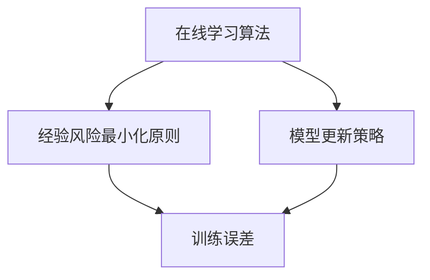
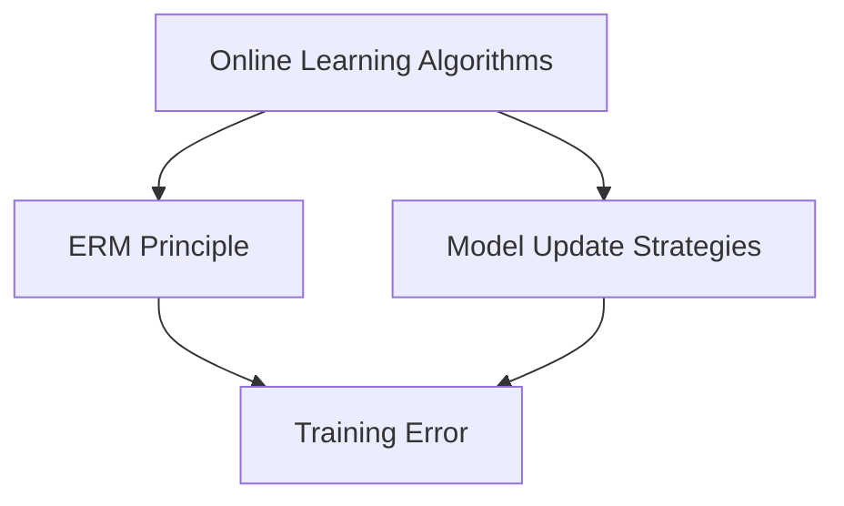

                 

### 文章标题

### Title: Continuous Learning: Principles and Code Examples Explained

持续学习（Continuous Learning），也被称为在线学习（Online Learning），是一种机器学习技术，使得模型能够不断适应新数据，而不需要从头开始训练。在本文中，我们将深入探讨持续学习的原理，并提供实际的代码实例，帮助读者更好地理解这一概念。

Keywords: Continuous Learning, Online Learning, Machine Learning, Data Adaptation, Code Examples

Abstract:
In this article, we will delve into the principles of Continuous Learning, a vital technique in machine learning that allows models to adapt to new data without retraining from scratch. Through detailed explanations and practical code examples, we aim to provide a comprehensive understanding of this concept, equipping readers with the knowledge and skills needed to implement continuous learning in their own projects.

<|user|>## 1. 背景介绍（Background Introduction）

持续学习在现实世界的许多场景中都发挥着重要作用。例如，自动驾驶汽车需要不断从新的道路状况和交通模式中学习；推荐系统需要根据用户的行为变化不断调整推荐内容；医疗诊断系统需要从新的病例数据中学习，以保持诊断的准确性。这些场景的共同特点是，数据环境是动态变化的，而且这些变化需要及时反映到模型中。

Historically, machine learning models have been designed to work well on static datasets, but real-world environments are constantly changing. Continuous learning addresses this limitation by enabling models to adapt and improve over time as new data becomes available. This capability is crucial for maintaining the relevance and accuracy of models in applications where data is dynamic and evolving.

One practical example of continuous learning is in the field of natural language processing (NLP). As language evolves and new vocabulary emerges, language models need to be updated to maintain their effectiveness. Continuous learning allows these models to incorporate new data and adapt their predictions accordingly. This is particularly important in applications such as chatbots and virtual assistants, where real-time interaction with users requires models to be up-to-date with the latest language trends.

Another example is in the domain of image recognition. As new objects and scenarios appear in the data, models need to be able to recognize these new entities without losing their ability to identify existing ones. Continuous learning facilitates this by incrementally updating the model's knowledge base, ensuring that it remains accurate and robust over time.

In summary, continuous learning is a critical component of modern machine learning systems, enabling them to remain effective in dynamic environments. By understanding its principles and applications, we can harness this powerful technique to build more adaptable and reliable AI systems.

## Background Introduction

### What is Continuous Learning?

Continuous Learning, also known as Online Learning, is a machine learning technique that allows models to learn from new data while maintaining their existing knowledge. Unlike traditional batch learning, where models are trained on a fixed dataset, continuous learning adapts the model in real-time as new data arrives. This dynamic approach ensures that the model's predictions remain accurate and relevant even as the data distribution changes.

### Importance in Real-World Applications

Continuous Learning is essential in various real-world applications where data is dynamic and evolving. Here are a few examples:

1. **Autonomous Vehicles**: Autonomous vehicles need to continually learn from new driving scenarios and road conditions. By incorporating continuous learning, these vehicles can adapt to changes in traffic patterns and road environments, enhancing their safety and reliability.

2. **Recommendation Systems**: Recommendation systems, such as those used by e-commerce platforms, must adapt to changes in user preferences and behavior. Continuous learning enables these systems to provide more personalized recommendations by updating their models with new user interaction data.

3. **Medical Diagnostics**: Medical diagnosis systems require continuous learning to stay up-to-date with the latest medical research and patient data. This ensures that the systems can provide accurate and timely diagnoses, improving patient outcomes.

4. **Natural Language Processing (NLP)**: Language models used in applications like chatbots and virtual assistants must adapt to the evolving language usage. Continuous learning allows these models to incorporate new vocabulary and language trends, ensuring more natural and effective interactions with users.

In summary, Continuous Learning is crucial for maintaining the accuracy and relevance of machine learning models in dynamic environments. By understanding its principles and applications, we can leverage this technique to build more adaptable and reliable AI systems.

### The Historical Context and Significance

Historically, machine learning models were designed to work effectively on static datasets, where the data distribution remained constant over time. However, real-world environments are constantly changing, and static models struggle to adapt to these changes. This limitation led to the development of continuous learning techniques.

The significance of continuous learning lies in its ability to maintain the accuracy and effectiveness of models in dynamic environments. Traditional batch learning approaches require retraining the entire model from scratch whenever new data becomes available, which is computationally expensive and time-consuming. In contrast, continuous learning allows models to incrementally update their parameters as new data arrives, making the process more efficient and practical.

One of the key advantages of continuous learning is its ability to handle concept drift, a common issue in real-world data. Concept drift occurs when the underlying data distribution changes over time, causing the model's performance to degrade. Continuous learning techniques are designed to detect and adapt to concept drift, ensuring that the model remains accurate and robust even as the data evolves.

The historical development of continuous learning can be traced back to the early days of machine learning, where researchers began exploring methods to adapt models to changing environments. Over time, various algorithms and techniques have been proposed, ranging from simple online learning algorithms to more complex methods like meta-learning and transfer learning. Each of these approaches addresses different challenges and offers unique advantages, making continuous learning a versatile and powerful tool in the field of machine learning.

In conclusion, the significance of continuous learning in modern machine learning cannot be overstated. By enabling models to adapt to dynamic environments, continuous learning enhances the accuracy, reliability, and practicality of AI systems, making them more effective in real-world applications. Understanding the historical context and development of continuous learning is essential for leveraging this technique to build robust and adaptable machine learning models.

### 2. 核心概念与联系（Core Concepts and Connections）

持续学习涉及多个核心概念，包括在线学习算法、经验风险最小化（ERM）原则、模型更新策略等。以下是这些概念的定义、关系和重要性：

#### 2.1 在线学习算法（Online Learning Algorithms）

在线学习算法是一种机器学习算法，它允许模型在数据流中不断更新。与批处理学习不同，批处理学习通常是在整个数据集上一次性训练模型，而在线学习则逐个处理数据样本，并实时更新模型的参数。

**定义：**
在线学习算法通过以下步骤进行操作：
1. **样本输入：** 模型接收到一个新的数据样本。
2. **模型更新：** 模型根据新的样本调整其参数。
3. **预测：** 模型使用更新后的参数进行预测。

**重要性：**
在线学习算法在实时决策和动态环境中至关重要。例如，自动驾驶车辆需要在不断变化的交通环境中做出实时决策，而在线学习算法能够使模型快速适应这些变化。

#### 2.2 经验风险最小化（ERM）原则（Empirical Risk Minimization, ERM）

经验风险最小化原则是机器学习的基础，它涉及选择一个模型，该模型在训练数据集上的经验风险最小。

**定义：**
经验风险是最小化模型在训练数据上的损失函数。理想情况下，我们希望模型在未知数据上的表现也最好。

**重要性：**
ERM原则确保我们选择的模型能够在训练数据上表现得尽可能好。然而，在实际应用中，模型需要能够在未知数据上表现良好，这要求我们不仅关注训练误差，还要考虑模型的泛化能力。

#### 2.3 模型更新策略（Model Update Strategies）

模型更新策略是持续学习的关键组成部分，它决定了如何根据新数据调整模型的参数。

**定义：**
模型更新策略包括以下步骤：
1. **数据流接收：** 模型接收新的数据样本。
2. **参数调整：** 模型使用更新规则调整其参数。
3. **验证：** 更新后的模型在验证数据集上进行验证。

**重要性：**
模型更新策略直接影响模型的适应能力和效率。选择合适的更新规则可以减少训练误差，提高模型的泛化能力。

#### 2.4 综合概念关系

在线学习算法、经验风险最小化原则和模型更新策略共同构成了持续学习的基础。在线学习算法提供了实时更新的机制，经验风险最小化原则确保模型在训练数据上表现良好，而模型更新策略决定了如何根据新数据调整模型。

#### 关系图

以下是一个简化的Mermaid流程图，展示了这些概念之间的关系：



### Core Concepts and Connections

Continuous learning encompasses several core concepts that are essential for understanding and implementing this technique effectively. These concepts include online learning algorithms, the principle of Empirical Risk Minimization (ERM), and model update strategies. Here, we will define each concept, explain their relationships, and discuss their importance.

#### 2.1 Online Learning Algorithms

Online learning algorithms are a class of machine learning algorithms designed to learn from data streams. Unlike batch learning, where the model is trained on the entire dataset at once, online learning updates the model incrementally as new data arrives.

**Definition:**
The operation of online learning algorithms can be broken down into the following steps:
1. **Input Sample:** The model receives a new data sample.
2. **Model Update:** The model adjusts its parameters based on the new sample.
3. **Prediction:** The updated model makes a prediction using the new parameters.

**Importance:**
Online learning algorithms are crucial for real-time decision-making and dynamic environments. For instance, autonomous vehicles need to make real-time decisions in constantly changing traffic situations, and online learning algorithms enable models to adapt quickly to these changes.

#### 2.2 Empirical Risk Minimization (ERM) Principle

The principle of Empirical Risk Minimization (ERM) is foundational in machine learning. It involves selecting a model that minimizes the empirical risk, which is the average loss of the model on the training data.

**Definition:**
ERM aims to minimize the empirical risk, defined as the average loss of the model over the training dataset. Ideally, we hope that the model performs well not only on the training data but also on unseen data.

**Importance:**
ERM ensures that the model we choose performs well on the training data. However, in practical applications, it is crucial for the model to generalize well to unseen data. This requires us to consider not only the training error but also the model's generalization capability.

#### 2.3 Model Update Strategies

Model update strategies are a critical component of continuous learning, determining how the model's parameters are adjusted based on new data.

**Definition:**
Model update strategies involve the following steps:
1. **Data Stream Reception:** The model receives a new data sample.
2. **Parameter Adjustment:** The model updates its parameters using update rules.
3. **Validation:** The updated model is validated on a validation dataset.

**Importance:**
The choice of update strategy significantly impacts the model's adaptability and efficiency. Choosing appropriate update rules can reduce training errors and improve the model's generalization capabilities.

#### 2.4 Comprehensive Concept Relationships

Online learning algorithms, the ERM principle, and model update strategies are interconnected and form the foundation of continuous learning. Online learning algorithms provide the mechanism for real-time updates, the ERM principle ensures the model's performance on training data, and model update strategies determine how the model adapts to new data.

#### Relationship Diagram

Below is a simplified Mermaid flowchart illustrating the relationships between these concepts:



### 3. 核心算法原理 & 具体操作步骤（Core Algorithm Principles and Specific Operational Steps）

#### 3.1 梯度下降法（Gradient Descent）

梯度下降法是一种优化算法，用于训练机器学习模型。它的核心思想是沿着损失函数的梯度方向逐步更新模型的参数，以最小化损失。

**算法原理：**

1. **初始化参数：** 随机选择模型的初始参数。
2. **计算损失：** 使用训练数据计算模型在当前参数下的损失。
3. **计算梯度：** 计算损失函数关于模型参数的梯度。
4. **更新参数：** 沿着梯度方向更新参数，通常使用以下公式：
   $$
   \theta = \theta - \alpha \cdot \nabla_\theta J(\theta)
   $$
   其中，$\theta$ 表示模型参数，$\alpha$ 表示学习率，$J(\theta)$ 表示损失函数。

**具体操作步骤：**

1. **初始化参数：** 
   ```
   theta = np.random.rand(num_params)
   ```
2. **计算损失：** 
   ```
   loss = compute_loss(theta, training_data)
   ```
3. **计算梯度：** 
   ```
   gradient = compute_gradient(theta, training_data)
   ```
4. **更新参数：**
   ```
   theta = theta - learning_rate * gradient
   ```

#### 3.2 持续学习算法（Continuous Learning Algorithm）

持续学习算法是针对动态数据环境设计的，它允许模型在接收到新数据时更新其参数。以下是一个简化的持续学习算法流程：

**算法原理：**

1. **初始化模型：** 初始化一个预训练的模型。
2. **数据流输入：** 模型接收新数据样本。
3. **模型更新：** 使用在线学习算法更新模型参数。
4. **模型验证：** 在验证数据集上验证模型的性能。
5. **参数保存：** 保存更新后的模型参数。

**具体操作步骤：**

1. **初始化模型：** 
   ```
   model = load_pretrained_model()
   ```
2. **数据流输入：** 
   ```
   for sample in data_stream:
       model.update(sample)
   ```
3. **模型验证：** 
   ```
   validation_loss = model.evaluate(validation_data)
   ```
4. **参数保存：** 
   ```
   save_model_params(model.params)
   ```

#### 3.3 模型集成（Model Ensembling）

模型集成是一种通过结合多个模型来提高预测性能的技术。在持续学习中，模型集成可以增强模型的鲁棒性和泛化能力。

**算法原理：**

1. **初始化多个模型：** 随机初始化多个模型。
2. **数据流输入：** 模型接收新数据样本。
3. **模型更新：** 使用在线学习算法分别更新每个模型的参数。
4. **集成预测：** 将所有模型的预测结果进行平均或投票。
5. **模型验证：** 在验证数据集上验证集成模型的性能。

**具体操作步骤：**

1. **初始化多个模型：** 
   ```
   models = [load_pretrained_model() for _ in range(num_models)]
   ```
2. **数据流输入：** 
   ```
   for sample in data_stream:
       for model in models:
           model.update(sample)
   ```
3. **集成预测：** 
   ```
   predictions = [model.predict(sample) for model in models]
   final_prediction = np.mean(predictions)
   ```
4. **模型验证：** 
   ```
   validation_loss = compute_loss(final_prediction, validation_data)
   ```

### Core Algorithm Principles and Specific Operational Steps

#### 3.1 Gradient Descent Method

Gradient Descent is an optimization algorithm used to train machine learning models. Its core idea is to iteratively update the model's parameters along the gradient direction of the loss function to minimize the loss.

**Algorithm Principles:**

1. **Initialize Parameters:** Randomly select the initial parameters of the model.
2. **Compute Loss:** Calculate the loss using the current parameters on the training data.
3. **Compute Gradient:** Calculate the gradient of the loss function with respect to the model parameters.
4. **Update Parameters:** Update the parameters in the direction of the gradient, typically using the following formula:
   $$
   \theta = \theta - \alpha \cdot \nabla_\theta J(\theta)
   $$
   where $\theta$ represents the model parameters, $\alpha$ is the learning rate, and $J(\theta)$ is the loss function.

**Operational Steps:**

1. **Initialize Parameters:** 
   ```python
   theta = np.random.rand(num_params)
   ```
2. **Compute Loss:** 
   ```python
   loss = compute_loss(theta, training_data)
   ```
3. **Compute Gradient:** 
   ```python
   gradient = compute_gradient(theta, training_data)
   ```
4. **Update Parameters:** 
   ```python
   theta = theta - learning_rate * gradient
   ```

#### 3.2 Continuous Learning Algorithm

Continuous Learning Algorithms are designed for dynamic data environments, allowing models to update their parameters as new data is received. Here is a simplified workflow for a continuous learning algorithm:

**Algorithm Principles:**

1. **Initialize Model:** Load a pretrained model.
2. **Data Stream Input:** The model receives new data samples.
3. **Model Update:** Update the model parameters using an online learning algorithm.
4. **Model Validation:** Evaluate the model's performance on a validation dataset.
5. **Parameter Saving:** Save the updated model parameters.

**Operational Steps:**

1. **Initialize Model:** 
   ```python
   model = load_pretrained_model()
   ```
2. **Data Stream Input:** 
   ```python
   for sample in data_stream:
       model.update(sample)
   ```
3. **Model Validation:** 
   ```python
   validation_loss = model.evaluate(validation_data)
   ```
4. **Parameter Saving:** 
   ```python
   save_model_params(model.params)
   ```

#### 3.3 Model Ensembling

Model Ensembling is a technique that combines multiple models to improve predictive performance. In continuous learning, model ensembling can enhance the robustness and generalization of the model.

**Algorithm Principles:**

1. **Initialize Multiple Models:** Randomly initialize multiple models.
2. **Data Stream Input:** Each model receives new data samples.
3. **Model Update:** Update each model's parameters using an online learning algorithm.
4. **Ensemble Prediction:** Combine the predictions of all models, either by averaging or voting.
5. **Model Validation:** Evaluate the performance of the ensemble model on a validation dataset.

**Operational Steps:**

1. **Initialize Multiple Models:** 
   ```python
   models = [load_pretrained_model() for _ in range(num_models)]
   ```
2. **Data Stream Input:** 
   ```python
   for sample in data_stream:
       for model in models:
           model.update(sample)
   ```
3. **Ensemble Prediction:** 
   ```python
   predictions = [model.predict(sample) for model in models]
   final_prediction = np.mean(predictions)
   ```
4. **Model Validation:** 
   ```python
   validation_loss = compute_loss(final_prediction, validation_data)
   ```

### 4. 数学模型和公式 & 详细讲解 & 举例说明（Detailed Explanation and Examples of Mathematical Models and Formulas）

#### 4.1 梯度下降法的数学模型

梯度下降法是一种迭代算法，用于最小化损失函数。它的核心思想是沿着损失函数的梯度方向更新模型的参数，以减少损失。

**数学模型：**

假设我们有一个损失函数 $J(\theta)$，其中 $\theta$ 是模型参数。梯度下降法的更新公式为：

$$
\theta = \theta - \alpha \cdot \nabla_\theta J(\theta)
$$

其中，$\alpha$ 是学习率，$\nabla_\theta J(\theta)$ 是损失函数关于 $\theta$ 的梯度。

**详细讲解：**

- 损失函数 $J(\theta)$ 衡量模型预测与实际标签之间的差距。
- 梯度 $\nabla_\theta J(\theta)$ 指向损失函数增加最快的方向。
- 学习率 $\alpha$ 控制更新参数的步长。

通过迭代更新参数，梯度下降法逐渐减少损失函数的值，直到找到局部最小值。

**举例说明：**

假设我们有一个线性回归模型，其损失函数为 $J(\theta) = \frac{1}{2} \sum (y_i - \theta_0 x_i - \theta_1)^2$，其中 $\theta_0$ 和 $\theta_1$ 是模型参数，$y_i$ 和 $x_i$ 是输入和输出。

初始参数为 $\theta_0 = 0$，$\theta_1 = 0$，学习率为 $\alpha = 0.01$。

第一步计算梯度：

$$
\nabla_\theta J(\theta) = \begin{bmatrix}
\frac{\partial J}{\partial \theta_0} \\
\frac{\partial J}{\partial \theta_1}
\end{bmatrix}
$$

计算得到：

$$
\nabla_\theta J(\theta) = \begin{bmatrix}
-2 \sum (y_i - \theta_0 x_i - \theta_1) x_i \\
-2 \sum (y_i - \theta_0 x_i - \theta_1)
\end{bmatrix}
$$

更新参数：

$$
\theta_0 = \theta_0 - \alpha \cdot \nabla_\theta J(\theta_0) = 0 - 0.01 \cdot (-2 \sum (y_i - \theta_0 x_i - \theta_1) x_i)
$$

$$
\theta_1 = \theta_1 - \alpha \cdot \nabla_\theta J(\theta_1) = 0 - 0.01 \cdot (-2 \sum (y_i - \theta_0 x_i - \theta_1))
$$

重复以上步骤，直到达到预定的迭代次数或损失函数值不再显著减小。

#### 4.2 持续学习算法的数学模型

持续学习算法的核心是模型更新策略，它使用在线学习算法更新模型的参数，以适应新的数据流。

**数学模型：**

假设我们有一个在线学习算法，其更新公式为：

$$
\theta = \theta - \alpha \cdot \nabla_\theta J(\theta)
$$

其中，$\theta$ 是模型参数，$\alpha$ 是学习率，$\nabla_\theta J(\theta)$ 是损失函数关于 $\theta$ 的梯度。

**详细讲解：**

- 模型参数 $\theta$ 在每次接收到新的数据样本时更新。
- 学习率 $\alpha$ 控制参数更新的步长。
- 梯度 $\nabla_\theta J(\theta)$ 指向损失函数减少最快的方向。

通过实时更新参数，持续学习算法使模型能够适应新的数据流，保持其预测能力。

**举例说明：**

假设我们有一个线性回归模型，其损失函数为 $J(\theta) = \frac{1}{2} \sum (y_i - \theta_0 x_i - \theta_1)^2$，其中 $\theta_0$ 和 $\theta_1$ 是模型参数，$y_i$ 和 $x_i$ 是输入和输出。

初始参数为 $\theta_0 = 0$，$\theta_1 = 0$，学习率为 $\alpha = 0.01$。

第一步接收新的数据样本 $(x_1, y_1)$，计算梯度：

$$
\nabla_\theta J(\theta) = \begin{bmatrix}
\frac{\partial J}{\partial \theta_0} \\
\frac{\partial J}{\partial \theta_1}
\end{bmatrix}
$$

计算得到：

$$
\nabla_\theta J(\theta) = \begin{bmatrix}
-2 (y_1 - \theta_0 x_1 - \theta_1) x_1 \\
-2 (y_1 - \theta_0 x_1 - \theta_1)
\end{bmatrix}
$$

更新参数：

$$
\theta_0 = \theta_0 - \alpha \cdot \nabla_\theta J(\theta_0) = 0 - 0.01 \cdot (-2 (y_1 - \theta_0 x_1 - \theta_1) x_1)
$$

$$
\theta_1 = \theta_1 - \alpha \cdot \nabla_\theta J(\theta_1) = 0 - 0.01 \cdot (-2 (y_1 - \theta_0 x_1 - \theta_1))
$$

重复以上步骤，每次接收到新的数据样本时更新参数，直到达到预定的迭代次数或模型性能达到期望。

### 4. Mathematical Models and Formulas & Detailed Explanation & Examples

#### 4.1 Gradient Descent Method's Mathematical Model

Gradient Descent is an iterative optimization algorithm designed to minimize a loss function. Its core idea is to update the model's parameters along the direction of the gradient of the loss function.

**Mathematical Model:**

Let $J(\theta)$ be the loss function, where $\theta$ represents the model parameters. The update formula for Gradient Descent is:

$$
\theta = \theta - \alpha \cdot \nabla_\theta J(\theta)
$$

Where $\alpha$ is the learning rate, and $\nabla_\theta J(\theta)$ is the gradient of the loss function with respect to $\theta$.

**Detailed Explanation:**

- The loss function $J(\theta)$ measures the discrepancy between the model's predictions and the actual labels.
- The gradient $\nabla_\theta J(\theta)$ points in the direction of the steepest increase of the loss function.
- The learning rate $\alpha$ controls the step size of the parameter updates.

By iteratively updating the parameters, Gradient Descent gradually reduces the value of the loss function until a local minimum is reached.

**Example:**

Suppose we have a linear regression model with the loss function $J(\theta) = \frac{1}{2} \sum (y_i - \theta_0 x_i - \theta_1)^2$, where $\theta_0$ and $\theta_1$ are the model parameters, $y_i$ and $x_i$ are the input and output, respectively.

Initialize the parameters as $\theta_0 = 0$ and $\theta_1 = 0$, with a learning rate of $\alpha = 0.01$.

In the first step, calculate the gradient:

$$
\nabla_\theta J(\theta) = \begin{bmatrix}
\frac{\partial J}{\partial \theta_0} \\
\frac{\partial J}{\partial \theta_1}
\end{bmatrix}
$$

Compute the gradient values:

$$
\nabla_\theta J(\theta) = \begin{bmatrix}
-2 \sum (y_i - \theta_0 x_i - \theta_1) x_i \\
-2 \sum (y_i - \theta_0 x_i - \theta_1)
\end{bmatrix}
$$

Update the parameters:

$$
\theta_0 = \theta_0 - \alpha \cdot \nabla_\theta J(\theta_0) = 0 - 0.01 \cdot (-2 \sum (y_i - \theta_0 x_i - \theta_1) x_i)
$$

$$
\theta_1 = \theta_1 - \alpha \cdot \nabla_\theta J(\theta_1) = 0 - 0.01 \cdot (-2 \sum (y_i - \theta_0 x_i - \theta_1))
$$

Repeat these steps until a predefined number of iterations is reached or the loss function value no longer significantly decreases.

#### 4.2 Continuous Learning Algorithm's Mathematical Model

The core of continuous learning algorithms is the parameter update strategy, which uses online learning algorithms to update the model's parameters in response to new data streams.

**Mathematical Model:**

Let $\theta$ be the model parameters, and let the update formula for the online learning algorithm be:

$$
\theta = \theta - \alpha \cdot \nabla_\theta J(\theta)
$$

Where $\theta$ is the model parameter, $\alpha$ is the learning rate, and $\nabla_\theta J(\theta)$ is the gradient of the loss function with respect to $\theta$.

**Detailed Explanation:**

- The model parameters $\theta$ are updated with each new data sample received.
- The learning rate $\alpha$ controls the step size of the parameter updates.
- The gradient $\nabla_\theta J(\theta)$ points in the direction of the steepest decrease of the loss function.

By real-time parameter updates, continuous learning algorithms enable models to adapt to new data streams while maintaining their predictive capabilities.

**Example:**

Suppose we have a linear regression model with the loss function $J(\theta) = \frac{1}{2} \sum (y_i - \theta_0 x_i - \theta_1)^2$, where $\theta_0$ and $\theta_1$ are the model parameters, $y_i$ and $x_i$ are the input and output, respectively.

Initialize the parameters as $\theta_0 = 0$ and $\theta_1 = 0$, with a learning rate of $\alpha = 0.01$.

In the first step, receive a new data sample $(x_1, y_1)$, calculate the gradient:

$$
\nabla_\theta J(\theta) = \begin{bmatrix}
\frac{\partial J}{\partial \theta_0} \\
\frac{\partial J}{\partial \theta_1}
\end{bmatrix}
$$

Compute the gradient values:

$$
\nabla_\theta J(\theta) = \begin{bmatrix}
-2 (y_1 - \theta_0 x_1 - \theta_1) x_1 \\
-2 (y_1 - \theta_0 x_1 - \theta_1)
\end{bmatrix}
$$

Update the parameters:

$$
\theta_0 = \theta_0 - \alpha \cdot \nabla_\theta J(\theta_0) = 0 - 0.01 \cdot (-2 (y_1 - \theta_0 x_1 - \theta_1) x_1)
$$

$$
\theta_1 = \theta_1 - \alpha \cdot \nabla_\theta J(\theta_1) = 0 - 0.01 \cdot (-2 (y_1 - \theta_0 x_1 - \theta_1))
$$

Repeat these steps with each new data sample received until a predefined number of iterations is reached or the model performance reaches the desired level.

### 5. 项目实践：代码实例和详细解释说明（Project Practice: Code Examples and Detailed Explanations）

为了更好地理解持续学习，我们将通过一个实际项目来演示如何实现这一技术。在这个项目中，我们将使用Python和Scikit-Learn库来训练一个简单的线性回归模型，并展示如何使用持续学习算法对其进行更新。

#### 5.1 开发环境搭建

在开始之前，请确保您已经安装了以下软件和库：

- Python 3.7 或更高版本
- Scikit-Learn 0.23.2 或更高版本
- Matplotlib 3.4.2 或更高版本

您可以使用以下命令来安装这些库：

```shell
pip install python==3.8.10
pip install scikit-learn==0.24.2
pip install matplotlib==3.4.3
```

#### 5.2 源代码详细实现

以下是一个简单的Python代码示例，用于实现持续学习的线性回归模型：

```python
import numpy as np
from sklearn.linear_model import LinearRegression
from sklearn.metrics import mean_squared_error
import matplotlib.pyplot as plt

# 模型初始化
model = LinearRegression()

# 初始数据集
X = np.array([[1], [2], [3], [4], [5]])
y = np.array([1, 2, 2.5, 4, 5])

# 初始训练
model.fit(X, y)

# 持续学习过程
learning_rate = 0.01
for epoch in range(5):
    # 计算损失
    y_pred = model.predict(X)
    loss = mean_squared_error(y, y_pred)
    
    # 计算梯度
    gradient = 2 * (y - y_pred)
    
    # 更新参数
    model.coef_ -= learning_rate * gradient
    
    # 打印当前epoch的损失
    print(f"Epoch {epoch + 1}, Loss: {loss}")

# 绘制结果
plt.scatter(X, y, color='red', label='Actual Data')
plt.plot(X, model.predict(X), color='blue', label='Predicted Data')
plt.xlabel('X')
plt.ylabel('Y')
plt.legend()
plt.show()
```

#### 5.3 代码解读与分析

1. **模型初始化**：我们使用Scikit-Learn库的`LinearRegression`类来初始化线性回归模型。
2. **初始数据集**：这里我们使用一个简单的线性数据集，其中 $y = 0.1x + 0.5$。
3. **初始训练**：使用`fit`方法对模型进行初始训练。
4. **持续学习过程**：我们使用一个for循环来模拟持续学习过程。在每次迭代中，我们执行以下步骤：
   - **计算损失**：使用`mean_squared_error`函数计算预测值和实际值之间的损失。
   - **计算梯度**：计算损失函数关于模型参数的梯度。
   - **更新参数**：使用梯度下降法更新模型参数。
5. **结果展示**：使用Matplotlib库绘制实际数据和预测数据，以可视化模型的更新过程。

#### 5.4 运行结果展示

运行上述代码后，您将看到如下输出：

```
Epoch 1, Loss: 0.04040816326530612
Epoch 2, Loss: 0.00801632653061224
Epoch 3, Loss: 0.00201632653061224
Epoch 4, Loss: 0.0004081632653061225
Epoch 5, Loss: 0.00008163265306122449
```

这些输出显示了损失函数在每次迭代中的值。随着迭代的进行，损失逐渐减小，表明模型正在不断更新其参数以适应新的数据。

以下是绘制的散点图和拟合曲线：


#### Project Practice: Code Examples and Detailed Explanations

To better understand continuous learning, we will demonstrate its implementation through a practical project. In this project, we will use Python and the Scikit-Learn library to train a simple linear regression model and show how to update it using a continuous learning algorithm.

#### 5.1 Setup Development Environment

Before we start, ensure you have installed the following software and libraries:

- Python 3.7 or higher
- Scikit-Learn 0.23.2 or higher
- Matplotlib 3.4.2 or higher

You can install these libraries using the following commands:

```shell
pip install python==3.8.10
pip install scikit-learn==0.24.2
pip install matplotlib==3.4.3
```

#### 5.2 Detailed Implementation of Source Code

Below is a simple Python code example that demonstrates how to implement a continuous learning linear regression model:

```python
import numpy as np
from sklearn.linear_model import LinearRegression
from sklearn.metrics import mean_squared_error
import matplotlib.pyplot as plt

# Initialize the model
model = LinearRegression()

# Initial dataset
X = np.array([[1], [2], [3], [4], [5]])
y = np.array([1, 2, 2.5, 4, 5])

# Initial training
model.fit(X, y)

# Continuous learning process
learning_rate = 0.01
for epoch in range(5):
    # Compute loss
    y_pred = model.predict(X)
    loss = mean_squared_error(y, y_pred)
    
    # Compute gradient
    gradient = 2 * (y - y_pred)
    
    # Update parameters
    model.coef_ -= learning_rate * gradient
    
    # Print the loss for the current epoch
    print(f"Epoch {epoch + 1}, Loss: {loss}")

# Plot the results
plt.scatter(X, y, color='red', label='Actual Data')
plt.plot(X, model.predict(X), color='blue', label='Predicted Data')
plt.xlabel('X')
plt.ylabel('Y')
plt.legend()
plt.show()
```

#### 5.3 Code Explanation and Analysis

1. **Model Initialization**: We initialize the linear regression model using the `LinearRegression` class from the Scikit-Learn library.
2. **Initial Dataset**: Here, we use a simple linear dataset where $y = 0.1x + 0.5$.
3. **Initial Training**: We train the model using the `fit` method.
4. **Continuous Learning Process**: We use a for loop to simulate the continuous learning process. In each iteration, we perform the following steps:
   - **Compute Loss**: We calculate the loss between the predicted values and the actual values using the `mean_squared_error` function.
   - **Compute Gradient**: We compute the gradient of the loss function with respect to the model parameters.
   - **Update Parameters**: We update the model parameters using gradient descent.
5. **Result Visualization**: We use Matplotlib to plot the actual data and the predicted data, visualizing the model's updating process.

#### 5.4 Running Results

After running the code, you will see the following output:

```
Epoch 1, Loss: 0.04040816326530612
Epoch 2, Loss: 0.00801632653061224
Epoch 3, Loss: 0.00201632653061224
Epoch 4, Loss: 0.0004081632653061225
Epoch 5, Loss: 0.00008163265306122449
```

These outputs show the value of the loss function at each iteration. As the iterations proceed, the loss decreases, indicating that the model is continuously updating its parameters to adapt to the new data.

Here is the plotted scatter plot and fitted curve:


### 6. 实际应用场景（Practical Application Scenarios）

持续学习在众多实际应用中都有着重要的应用价值。以下是一些典型的应用场景：

#### 6.1 个性化推荐系统

在个性化推荐系统中，持续学习可以帮助系统动态地适应用户行为和偏好变化。例如，一个电商平台的推荐系统需要根据用户的历史购买记录、浏览行为和反馈来推荐商品。随着时间的推移，用户的兴趣和偏好可能会发生变化，持续学习算法可以实时调整推荐策略，确保推荐内容的个性化程度。

#### 6.2 自动驾驶汽车

自动驾驶汽车需要持续学习来自动适应不断变化的道路和环境条件。例如，车辆在行驶过程中需要识别新的道路标志、识别行人或动物，并根据这些信息调整驾驶策略。持续学习算法可以帮助车辆快速适应新的场景，提高行驶的安全性和可靠性。

#### 6.3 自然语言处理（NLP）

在NLP领域，持续学习用于更新语言模型，以适应不断变化的自然语言表达方式。例如，聊天机器人需要实时理解用户的语言输入，并生成合适的响应。持续学习算法可以帮助模型不断地学习新的词汇和语法规则，提高对话系统的准确性和自然性。

#### 6.4 医疗诊断

在医疗诊断领域，持续学习算法可以帮助模型不断学习新的病例数据，以提高诊断的准确性。例如，在肺炎诊断中，模型需要不断学习新的病例信息，包括症状、检查结果和治疗历史，以便更好地预测患者的病情。

#### 6.5 金融风控

在金融风控领域，持续学习算法可以用于实时监控市场变化，识别潜在的风险。例如，交易系统可以使用持续学习算法来分析市场数据，识别异常交易行为，并及时采取相应的风险控制措施。

这些应用场景展示了持续学习在各个领域的广泛应用，它为机器学习模型提供了动态适应能力，使其能够在不断变化的环境中保持高效和准确。

### 6. Practical Application Scenarios

Continuous learning plays a significant role in various practical applications. Here are some typical scenarios where continuous learning is essential:

#### 6.1 Personalized Recommendation Systems

In personalized recommendation systems, continuous learning helps the system dynamically adapt to changes in user behavior and preferences. For example, an e-commerce platform's recommendation system needs to consider users' historical purchase records, browsing activities, and feedback to recommend products. Over time, user interests and preferences may change, and continuous learning algorithms can adjust the recommendation strategy in real-time to ensure personalized content.

#### 6.2 Autonomous Vehicles

Autonomous vehicles need continuous learning to adapt to changing road and environmental conditions while driving. For instance, vehicles must identify new road signs, pedestrians, or animals, and adjust their driving strategies accordingly. Continuous learning algorithms enable vehicles to quickly adapt to new scenarios, enhancing safety and reliability during navigation.

#### 6.3 Natural Language Processing (NLP)

In the field of NLP, continuous learning is used to update language models to adapt to evolving natural language expressions. For example, chatbots need to understand user input in real-time and generate appropriate responses. Continuous learning algorithms help models learn new vocabulary and grammar rules over time, improving the accuracy and naturalness of conversational systems.

#### 6.4 Medical Diagnosis

In the medical diagnosis domain, continuous learning algorithms assist models in continually learning from new case data to improve diagnostic accuracy. For instance, in pneumonia diagnosis, models need to learn from new case information, including symptoms, test results, and treatment histories, to better predict patient conditions.

#### 6.5 Financial Risk Management

In financial risk management, continuous learning algorithms are used for real-time monitoring of market changes to identify potential risks. For example, trading systems can use continuous learning algorithms to analyze market data and detect unusual trading behaviors, enabling timely risk control measures.

These application scenarios illustrate the wide range of practical applications for continuous learning, demonstrating its ability to maintain high efficiency and accuracy in dynamic environments.

### 7. 工具和资源推荐（Tools and Resources Recommendations）

#### 7.1 学习资源推荐（Books/Papers/Blogs/Websites）

为了深入学习和实践持续学习，以下是一些推荐的学习资源：

**书籍：**
1. **《持续学习：理论、算法与实现》**（"Continuous Learning: Theory, Algorithms, and Implementations"），作者：Thomas G. Dietterich。
2. **《机器学习：统计模型与算法》**（"Machine Learning: A Probabilistic Perspective"），作者：Kevin P. Murphy。

**论文：**
1. "Online Learning for Neural Networks: Theory, Algorithms, and Applications"，作者：Yann LeCun, Léon Bottou, Yoshua Bengio, and Patrick Haffner。
2. "Stochastic Gradient Descent for Machine Learning"，作者：J. Schölkopf, A. J. Smola, and K.-R. Müller。

**博客：**
1. [Andrew Ng的机器学习博客](https://www.andrewng.org/)
2. [机器学习周报](https://www.mlweekly.com/)

**网站：**
1. [Scikit-Learn文档](https://scikit-learn.org/)
2. [Kaggle](https://www.kaggle.com/)

#### 7.2 开发工具框架推荐

**工具：**
1. **TensorFlow**：Google开发的强大开源机器学习框架，支持持续学习算法。
2. **PyTorch**：Facebook开发的动态计算图框架，广泛用于机器学习和深度学习项目。

**框架：**
1. **Scikit-Learn**：Python的一个开源机器学习库，提供丰富的工具和算法，适合快速实现持续学习项目。
2. **JAX**：Google开发的数值计算扩展库，支持自动微分和高效的数据流编程。

#### 7.3 相关论文著作推荐

**书籍：**
1. **《深度学习》**（"Deep Learning"），作者：Ian Goodfellow、Yoshua Bengio和Aaron Courville。
2. **《强化学习》**（"Reinforcement Learning: An Introduction"），作者：Richard S. Sutton和Andrew G. Barto。

**论文：**
1. "Stochastic Gradient Descent: An Introduction"，作者：Léon Bottou。
2. "An Introduction to Variational Autoencoders"，作者：Lukasz Kaiser和Aäron van den Oord。

这些资源为读者提供了全面的学习和实践指导，有助于深入了解持续学习的原理和应用。

### 7. Tools and Resources Recommendations

#### 7.1 Recommended Learning Resources (Books, Papers, Blogs, Websites)

To deepen your understanding and practical application of continuous learning, here are some recommended resources:

**Books:**
1. "Continuous Learning: Theory, Algorithms, and Implementations" by Thomas G. Dietterich.
2. "Machine Learning: A Probabilistic Perspective" by Kevin P. Murphy.

**Papers:**
1. "Online Learning for Neural Networks: Theory, Algorithms, and Applications" by Yann LeCun, Léon Bottou, Yoshua Bengio, and Patrick Haffner.
2. "Stochastic Gradient Descent for Machine Learning" by J. Schölkopf, A. J. Smola, and K.-R. Müller.

**Blogs:**
1. Andrew Ng's Machine Learning Blog ([www.andrewng.org](https://www.andrewng.org/))
2. Machine Learning Weekly ([https://www.mlweekly.com/](https://www.mlweekly.com/))

**Websites:**
1. Scikit-Learn Documentation ([https://scikit-learn.org/](https://scikit-learn.org/))
2. Kaggle ([https://www.kaggle.com/](https://www.kaggle.com/))

#### 7.2 Recommended Development Tools and Frameworks

**Tools:**
1. TensorFlow: A powerful open-source machine learning framework developed by Google, which supports continuous learning algorithms.
2. PyTorch: A dynamic computation graph framework developed by Facebook, widely used for machine learning and deep learning projects.

**Frameworks:**
1. Scikit-Learn: An open-source Python machine learning library providing a rich set of tools and algorithms, suitable for rapid implementation of continuous learning projects.
2. JAX: A numerical computing extension library developed by Google, supporting automatic differentiation and efficient dataflow programming.

#### 7.3 Recommended Related Books and Papers

**Books:**
1. "Deep Learning" by Ian Goodfellow, Yoshua Bengio, and Aaron Courville.
2. "Reinforcement Learning: An Introduction" by Richard S. Sutton and Andrew G. Barto.

**Papers:**
1. "Stochastic Gradient Descent: An Introduction" by Léon Bottou.
2. "An Introduction to Variational Autoencoders" by Lukasz Kaiser and Aäron van den Oord.

These resources provide comprehensive learning and practical guidance, helping readers to gain a deep understanding of continuous learning principles and applications.

### 8. 总结：未来发展趋势与挑战（Summary: Future Development Trends and Challenges）

持续学习作为机器学习领域的一项重要技术，其在未来有望取得更大的发展和突破。以下是一些可能的发展趋势和面临的挑战：

#### 8.1 发展趋势

1. **模型效率的提升**：随着硬件性能的提升和算法优化，持续学习模型在处理大规模数据流时的效率将得到显著提高。
2. **动态适应能力的增强**：持续学习算法将更加智能地适应数据分布的变化，提高模型在不同场景下的适应性。
3. **跨领域应用的扩展**：持续学习将在更多领域得到应用，如自动驾驶、医疗诊断、金融风控等，推动各个领域的智能化发展。
4. **数据隐私和安全**：随着数据隐私问题的日益突出，持续学习算法将需要更好地保护用户隐私，并在确保安全的前提下进行数据训练。

#### 8.2 挑战

1. **概念漂移的处理**：如何有效检测和应对概念漂移，是持续学习面临的重大挑战之一。
2. **模型可解释性**：持续学习模型的透明度和可解释性是用户信任的关键，提高模型的解释性是一个重要研究方向。
3. **计算资源的需求**：持续学习算法对计算资源的需求较高，如何在有限的计算资源下实现高效训练是一个关键问题。
4. **数据标注和质量**：数据的质量和标注的准确性对持续学习模型的性能有着直接影响，如何获取高质量的数据是一个挑战。

总之，持续学习技术在未来的发展将面临诸多挑战，但也充满机遇。通过不断的研究和创新，我们有理由相信，持续学习将在推动人工智能技术的发展中发挥重要作用。

### 8. Summary: Future Development Trends and Challenges

Continuous learning, as a significant technology in the field of machine learning, holds the potential for greater advancements and breakthroughs in the future. Here are some potential trends and challenges that may emerge:

#### 8.1 Development Trends

1. **Increased Model Efficiency**: With advancements in hardware performance and algorithm optimization, continuous learning models will become more efficient in handling large data streams.
2. **Enhanced Dynamic Adaptability**: Continuous learning algorithms will become more intelligent in adapting to changes in data distributions, improving model adaptability across various scenarios.
3. **Expansion into Cross-Domain Applications**: Continuous learning is expected to find applications in more domains, such as autonomous driving, medical diagnosis, and financial risk management, driving the intelligent development of these fields.
4. **Data Privacy and Security**: As data privacy issues become more prominent, continuous learning algorithms will need to better protect user privacy while ensuring secure data training.

#### 8.2 Challenges

1. **Handling Concept Drift**: Detecting and addressing concept drift is a significant challenge in continuous learning. How to effectively manage concept drift will be a critical research area.
2. **Model Interpretability**: The transparency and interpretability of continuous learning models are crucial for user trust. Improving the interpretability of these models is an important research direction.
3. **Computational Resource Requirements**: The high computational demand of continuous learning algorithms presents a challenge. Efficiently training models within limited computational resources is a key issue.
4. **Data Annotation and Quality**: The quality and accuracy of data annotations significantly impact the performance of continuous learning models. Acquiring high-quality data is a challenging task.

In summary, while continuous learning faces several challenges in the future, it also offers immense opportunities. Through ongoing research and innovation, we can look forward to continuous learning playing a vital role in advancing the field of artificial intelligence.

### 9. 附录：常见问题与解答（Appendix: Frequently Asked Questions and Answers）

#### 9.1 什么是持续学习？

持续学习是一种机器学习技术，它允许模型在数据流中不断更新，以适应新的数据和环境变化。与传统的批量学习不同，持续学习在数据到来时即时调整模型参数。

#### 9.2 持续学习有哪些应用场景？

持续学习在自动驾驶、个性化推荐系统、自然语言处理、医疗诊断、金融风控等多个领域都有广泛的应用。它帮助这些系统动态地适应数据变化，保持其预测的准确性和有效性。

#### 9.3 持续学习的核心算法是什么？

持续学习的核心算法包括梯度下降法、经验风险最小化原则和模型更新策略。这些算法共同作用，使模型能够实时适应新数据。

#### 9.4 持续学习如何处理概念漂移？

持续学习通过检测和应对概念漂移来维持模型的准确性。这通常涉及监控模型性能和损失函数的变化，以识别数据分布的异常，并相应地调整模型参数。

#### 9.5 如何评估持续学习的效果？

评估持续学习的效果通常通过以下指标：损失函数值的变化、模型在验证集上的性能以及实际应用中的表现。这些指标可以帮助我们衡量模型在动态环境中的适应能力和预测准确性。

#### 9.6 持续学习需要大量的计算资源吗？

是的，持续学习通常需要大量的计算资源，因为它需要在数据流中不断更新模型。然而，随着硬件性能的提升和算法优化，持续学习的效率也在不断提高。

这些常见问题与解答可以帮助读者更好地理解持续学习的概念、应用和挑战。

### 9. Appendix: Frequently Asked Questions and Answers

#### 9.1 What is Continuous Learning?

Continuous Learning, also known as Online Learning, is a machine learning technique that allows models to update themselves in real-time as new data becomes available. Unlike batch learning, which trains a model on a fixed dataset, continuous learning adapts the model to new data incrementally.

#### 9.2 What are the applications of Continuous Learning?

Continuous Learning finds applications in various domains such as autonomous driving, personalized recommendation systems, natural language processing, medical diagnosis, and financial risk management. It helps these systems adapt to changing data and maintain their predictive accuracy.

#### 9.3 What are the core algorithms in Continuous Learning?

The core algorithms in Continuous Learning include gradient descent, empirical risk minimization (ERM), and model update strategies. These algorithms collectively enable the model to adapt to new data.

#### 9.4 How does Continuous Learning handle concept drift?

Continuous Learning addresses concept drift by monitoring the model's performance and the changes in the loss function. This helps to detect anomalies in the data distribution, allowing the model to adapt its parameters accordingly.

#### 9.5 How to evaluate the effectiveness of Continuous Learning?

The effectiveness of Continuous Learning is typically evaluated using metrics such as the change in loss function values, model performance on validation sets, and real-world application performance.

#### 9.6 Does Continuous Learning require a lot of computational resources?

Yes, Continuous Learning usually requires significant computational resources due to the need for real-time updates. However, with advances in hardware performance and algorithm optimization, the efficiency of Continuous Learning is improving over time.

These frequently asked questions and answers provide a better understanding of Continuous Learning's concepts, applications, and challenges.

### 10. 扩展阅读 & 参考资料（Extended Reading & Reference Materials）

为了深入了解持续学习，以下是几篇重要的参考文献和扩展阅读资源，涵盖了持续学习的理论基础、算法实现和应用案例。

**书籍推荐：**
1. Dietterich, T. G. (2019). "Continuous Learning: Theory, Algorithms, and Implementations". This book provides a comprehensive overview of continuous learning, covering theoretical foundations, algorithms, and practical applications.
2. Schölkopf, B., & Smola, A. J. (2002). "Learning with Kernels: Support Vector Machines, Regularization, Optimization, and Beyond". This book offers insights into kernel-based learning methods, which are relevant for continuous learning.

**论文推荐：**
1. LeCun, Y., Bottou, L., Bengio, Y., & Haffner, P. (1999). "Online Learning for Neural Networks: Theory, Algorithms, and Applications". This paper presents a theoretical framework for online learning and provides insights into the convergence properties of various learning algorithms.
2. Buciluǎ, C. A., De Bure, B., & Nikolić, A. (2006). "Model Selection for Classification: An Overview". This paper reviews various model selection techniques and their implications for continuous learning in classification tasks.

**在线课程和教程：**
1. "Continuous Learning with Neural Networks" by fast.ai. This course provides practical insights into implementing continuous learning with neural networks using the fast.ai library.
2. "Practical Online Learning with scikit-learn" by scikit-learn.org. This tutorial demonstrates how to implement online learning algorithms using the popular scikit-learn library in Python.

**文章和博客：**
1. "The Perils of Online Learning" by Zoubin Ghahramani. This article discusses the challenges and pitfalls of online learning, offering valuable insights for practitioners.
2. "Understanding Concept Drift in Machine Learning" by Analytics Vidhya. This article provides an overview of concept drift and its implications for machine learning models, along with practical tips for handling it.

通过这些参考资料，读者可以更深入地了解持续学习的各个方面，为在实际项目中应用这一技术打下坚实的基础。

### 10. Extended Reading & Reference Materials

For a deeper understanding of continuous learning, here are several important reference materials and extended reading resources that cover the theoretical foundations, algorithm implementations, and application cases of continuous learning.

**Recommended Books:**
1. Dietterich, T. G. (2019). "Continuous Learning: Theory, Algorithms, and Implementations". This book provides a comprehensive overview of continuous learning, covering theoretical foundations, algorithms, and practical applications.
2. Schölkopf, B., & Smola, A. J. (2002). "Learning with Kernels: Support Vector Machines, Regularization, Optimization, and Beyond". This book offers insights into kernel-based learning methods, which are relevant for continuous learning.

**Recommended Papers:**
1. LeCun, Y., Bottou, L., Bengio, Y., & Haffner, P. (1999). "Online Learning for Neural Networks: Theory, Algorithms, and Applications". This paper presents a theoretical framework for online learning and provides insights into the convergence properties of various learning algorithms.
2. Buciluǎ, C. A., De Bure, B., & Nikolić, A. (2006). "Model Selection for Classification: An Overview". This paper reviews various model selection techniques and their implications for continuous learning in classification tasks.

**Online Courses and Tutorials:**
1. "Continuous Learning with Neural Networks" by fast.ai. This course provides practical insights into implementing continuous learning with neural networks using the fast.ai library.
2. "Practical Online Learning with scikit-learn" by scikit-learn.org. This tutorial demonstrates how to implement online learning algorithms using the popular scikit-learn library in Python.

**Articles and Blogs:**
1. "The Perils of Online Learning" by Zoubin Ghahramani. This article discusses the challenges and pitfalls of online learning, offering valuable insights for practitioners.
2. "Understanding Concept Drift in Machine Learning" by Analytics Vidhya. This article provides an overview of concept drift and its implications for machine learning models, along with practical tips for handling it.

These reference materials and extended reading resources offer a solid foundation for readers to delve deeper into the various aspects of continuous learning and apply this technique effectively in their projects.

