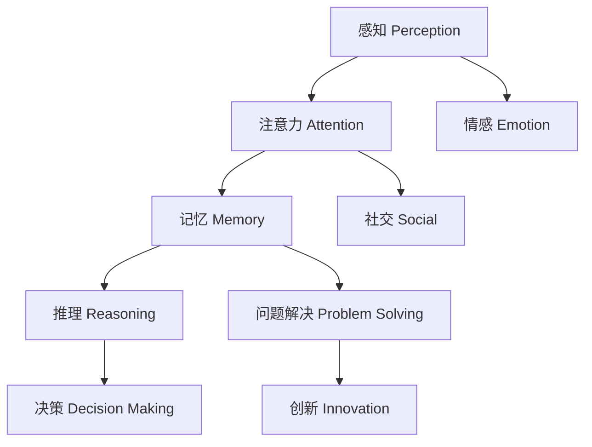
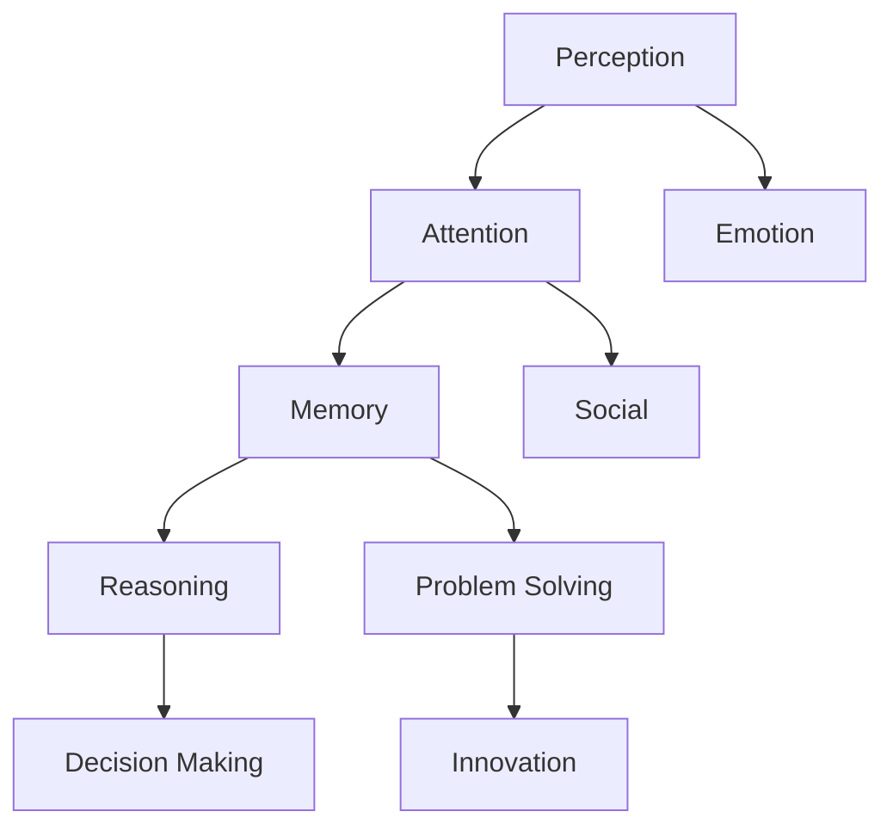
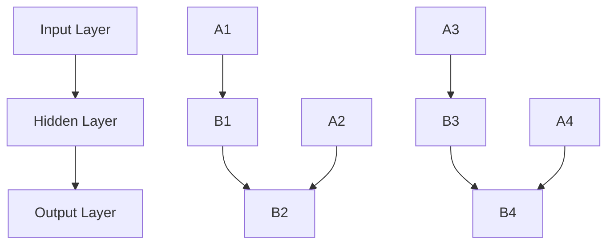

                 

### 文章标题

**探索人类思维的奥秘：人类计算的认知价值**

关键词：人类思维、认知价值、计算模型、神经科学、人工智能

摘要：本文深入探讨了人类思维的奥秘，揭示了人类计算在认知过程中所蕴含的独特价值。通过结合神经科学和人工智能的研究成果，我们试图理解人类思维的机制，并探讨其在设计高效的人工智能系统中的潜在应用。本文旨在为读者提供一个全面而深入的视角，以了解人类思维的奥秘和其在现代科技发展中的重要地位。

### Introduction

The enigma of human thinking has fascinated philosophers, scientists, and researchers for centuries. Our ability to process information, make decisions, and solve complex problems with remarkable efficiency and adaptability sets us apart from other species. However, the exact mechanisms behind human cognition remain elusive, and understanding them could unlock profound insights into both human intelligence and artificial intelligence (AI).

In recent years, advancements in neuroscience and AI have provided new perspectives on the workings of the human mind. Neuroscientists have identified key brain regions and neural processes that underlie various cognitive functions, while AI researchers have developed sophisticated models that mimic certain aspects of human thinking. By combining insights from these fields, we can begin to unravel the mysteries of human cognition and explore its implications for the design of intelligent systems.

This article aims to provide a comprehensive and in-depth exploration of the wonders of human thinking. We will delve into the core concepts and principles that govern human cognition, examine the unique computational advantages of the human brain, and discuss the potential applications of these insights in the development of AI. By understanding the cognitive value of human computation, we can gain a deeper appreciation for the remarkable capabilities of the human mind and its potential to shape the future of technology.

### 背景介绍

Human thinking is a complex and intricate process that involves the integration of multiple cognitive functions, including perception, attention, memory, reasoning, and problem-solving. These functions are interconnected and operate in a highly dynamic and adaptive manner, allowing us to interact with and make sense of the world around us.

The concept of human cognition has a rich history that dates back to ancient Greece, where philosophers like Aristotle and Plato explored the nature of the mind and its relationship to the physical world. Over the centuries, cognitive science has evolved as a multidisciplinary field that incorporates insights from psychology, neuroscience, philosophy, and artificial intelligence. Modern cognitive science aims to understand the underlying mechanisms of human thinking, learning, and memory, as well as the neural and genetic basis of cognitive abilities.

One of the key challenges in studying human cognition is the complexity of the brain. The human brain contains approximately 86 billion neurons and trillions of synapses, which communicate through intricate neural networks. The vast number of possible connections and the dynamic nature of neural activity make it difficult to study the brain in a systematic and predictable manner. However, recent advances in neuroimaging techniques, such as functional magnetic resonance imaging (fMRI) and electroencephalography (EEG), have provided valuable insights into the structure and function of the brain, allowing researchers to identify specific regions and processes involved in various cognitive functions.

Despite these advances, our understanding of human cognition is still limited. Many aspects of cognition remain mysterious, and there is much that we do not yet understand about how the brain gives rise to our thoughts, emotions, and actions. This gap in knowledge presents both opportunities and challenges for the development of AI systems that aim to mimic human cognition.

### 核心概念与联系

#### 3.1 认知过程的模块化

Human cognition can be conceptually divided into various modular processes, each responsible for different aspects of information processing. These modules include perception, attention, memory, reasoning, and problem-solving. Perception involves the detection and interpretation of sensory information from the environment, while attention allows us to selectively focus on specific stimuli. Memory stores and retrieves information, while reasoning enables us to make inferences and solve problems. These modules interact dynamically, forming a complex system that enables us to adapt to changing environments and make informed decisions.

#### 3.2 大脑的可塑性

The human brain is highly plastic, meaning it can change and adapt in response to experience and learning. This plasticity is essential for cognitive development and allows us to acquire new skills and knowledge throughout our lives. Neural plasticity involves the formation of new connections between neurons, the modification of existing connections, and the reorganization of neural networks. Understanding the mechanisms of plasticity can inform the design of AI systems that can learn and adapt over time.

#### 3.3 大脑的层次结构

The human brain exhibits a hierarchical organization, with different levels of processing from sensory input to higher-order cognitive functions. At the lower levels, sensory information is processed in a largely parallel and independent manner. As information ascends through the hierarchy, it becomes more integrated and abstract, allowing for complex cognitive tasks such as language processing, decision-making, and problem-solving. This hierarchical organization provides a framework for understanding how information is processed and integrated in the brain, which can be applied to the design of AI systems with similar hierarchical architectures.

#### 3.4 大脑的网络结构

The human brain is composed of interconnected neural networks that work together to perform various cognitive functions. These networks can be classified into different types, including sensory networks, motor networks, and associative networks. Sensory networks process sensory information from different modalities, such as vision, hearing, and touch. Motor networks control movement and coordinate sensory and motor functions. Associative networks integrate information from different sensory and motor networks, enabling us to form concepts, make associations, and engage in higher-order cognitive tasks. Understanding the structure and function of these networks can help in designing AI systems that can process and integrate information in a similar manner.

#### 3.5 大脑的进化适应性

The human brain has evolved over millions of years, adapting to a wide range of environmental challenges and social interactions. This evolutionary history has shaped the structure and function of the brain, endowing us with unique cognitive abilities that have allowed us to thrive as a species. For example, our ability to communicate through language and form complex social relationships has been crucial for our survival and success. Understanding the evolutionary origins of these cognitive abilities can provide insights into how they can be leveraged in AI systems to enhance their capabilities and adaptability.

### Mermaid 流程图

下面是一个简化的 Mermaid 流程图，展示了人类认知过程中涉及的几个核心模块和它们之间的交互关系：



### Core Concepts and Connections

#### 3.1 Modularization of Cognitive Processes

Human cognition can be conceptually divided into various modular processes, each responsible for different aspects of information processing. These modules include perception, attention, memory, reasoning, and problem-solving. Perception involves the detection and interpretation of sensory information from the environment, while attention allows us to selectively focus on specific stimuli. Memory stores and retrieves information, while reasoning enables us to make inferences and solve problems. These modules interact dynamically, forming a complex system that enables us to adapt to changing environments and make informed decisions.

#### 3.2 Brain Plasticity

The human brain is highly plastic, meaning it can change and adapt in response to experience and learning. This plasticity is essential for cognitive development and allows us to acquire new skills and knowledge throughout our lives. Neural plasticity involves the formation of new connections between neurons, the modification of existing connections, and the reorganization of neural networks. Understanding the mechanisms of plasticity can inform the design of AI systems that can learn and adapt over time.

#### 3.3 Hierarchical Organization of the Brain

The human brain exhibits a hierarchical organization, with different levels of processing from sensory input to higher-order cognitive functions. At the lower levels, sensory information is processed in a largely parallel and independent manner. As information ascends through the hierarchy, it becomes more integrated and abstract, allowing for complex cognitive tasks such as language processing, decision-making, and problem-solving. This hierarchical organization provides a framework for understanding how information is processed and integrated in the brain, which can be applied to the design of AI systems with similar hierarchical architectures.

#### 3.4 Network Structure of the Brain

The human brain is composed of interconnected neural networks that work together to perform various cognitive functions. These networks can be classified into different types, including sensory networks, motor networks, and associative networks. Sensory networks process sensory information from different modalities, such as vision, hearing, and touch. Motor networks control movement and coordinate sensory and motor functions. Associative networks integrate information from different sensory and motor networks, enabling us to form concepts, make associations, and engage in higher-order cognitive tasks. Understanding the structure and function of these networks can help in designing AI systems that can process and integrate information in a similar manner.

#### 3.5 Evolutionary Adaptability of the Brain

The human brain has evolved over millions of years, adapting to a wide range of environmental challenges and social interactions. This evolutionary history has shaped the structure and function of the brain, endowing us with unique cognitive abilities that have allowed us to thrive as a species. For example, our ability to communicate through language and form complex social relationships has been crucial for our survival and success. Understanding the evolutionary origins of these cognitive abilities can provide insights into how they can be leveraged in AI systems to enhance their capabilities and adaptability.

### A Simplified Mermaid Flowchart

The following is a simplified Mermaid flowchart that illustrates the core modules involved in human cognitive processes and their interactions:



### 核心算法原理 & 具体操作步骤

#### 4.1 大脑信息处理的基本原理

The basic principle of information processing in the human brain is based on the concept of neural networks and the transmission of electrical signals between neurons. When sensory information enters the brain, it is first received by sensory neurons, which transmit the information to the brain's primary sensory areas. These areas process and analyze the sensory information, extracting relevant features and patterns. The processed information is then transmitted to higher-order cognitive areas, where more complex processing and decision-making occur.

The process of information transmission in the brain can be described using the following steps:

1. **Sensory Input**: The sensory organs (e.g., eyes, ears, nose, skin) receive external stimuli and convert them into electrical signals.
2. **Neural Transmission**: The electrical signals are transmitted through sensory neurons to the brain's primary sensory areas.
3. **Feature Extraction**: The primary sensory areas process the sensory information and extract relevant features, such as color, shape, or sound.
4. **Integration**: The extracted features are integrated and combined with information from other sensory modalities to create a comprehensive perception of the environment.
5. **Cognitive Processing**: The integrated information is transmitted to higher-order cognitive areas, where more complex processing, reasoning, and decision-making occur.
6. **Motor Output**: The processed information is used to generate appropriate motor responses, such as moving a hand or speaking.

#### 4.2 人类计算的核心算法

The core algorithm of human computation can be described as a multi-level processing system that operates in a parallel and distributed manner. The following steps outline the main components of this algorithm:

1. **Sensory Input**: The system receives sensory input from various sources, such as vision, hearing, touch, and taste.
2. **Feature Extraction**: The sensory input is processed and the relevant features are extracted, such as edges, colors, or sounds.
3. **Feature Integration**: The extracted features are integrated to form a coherent perception of the environment.
4. **Cognitive Processing**: The integrated information is processed through a hierarchy of cognitive areas, involving tasks such as attention, memory, reasoning, and problem-solving.
5. **Decision-Making**: Based on the processed information, the system generates decisions and motor commands.
6. **Motor Output**: The motor commands are transmitted to the muscles, resulting in appropriate actions.

#### 4.3 实际操作步骤

Here is a step-by-step guide to implementing the core algorithm of human computation:

1. **Collect Sensory Data**: Gather sensory data from various sources, such as a camera, microphone, or sensors.
2. **Feature Extraction**: Process the sensory data and extract relevant features using techniques such as image processing, signal processing, or natural language processing.
3. **Feature Integration**: Combine the extracted features to form a coherent perception of the environment.
4. **Cognitive Processing**: Implement cognitive processing tasks such as attention control, memory retrieval, reasoning, and problem-solving using algorithms inspired by human cognitive processes.
5. **Decision-Making**: Based on the processed information, generate decisions and motor commands.
6. **Motor Output**: Send the motor commands to the muscles or actuators to execute the desired actions.

### Core Algorithm Principles and Specific Operational Steps

#### 4.1 Basic Principles of Brain Information Processing

The fundamental principle of information processing in the human brain is based on the concept of neural networks and the transmission of electrical signals between neurons. When sensory information enters the brain, it is first received by sensory neurons, which transmit the information to the brain's primary sensory areas. These areas process and analyze the sensory information, extracting relevant features and patterns. The processed information is then transmitted to higher-order cognitive areas, where more complex processing and decision-making occur.

The process of information transmission in the brain can be described using the following steps:

1. **Sensory Input**: The sensory organs (e.g., eyes, ears, nose, skin) receive external stimuli and convert them into electrical signals.
2. **Neural Transmission**: The electrical signals are transmitted through sensory neurons to the brain's primary sensory areas.
3. **Feature Extraction**: The primary sensory areas process the sensory information and extract relevant features, such as color, shape, or sound.
4. **Integration**: The extracted features are integrated and combined with information from other sensory modalities to create a comprehensive perception of the environment.
5. **Cognitive Processing**: The integrated information is transmitted to higher-order cognitive areas, where more complex processing, reasoning, and decision-making occur.
6. **Motor Output**: The processed information is used to generate appropriate motor responses, such as moving a hand or speaking.

#### 4.2 Core Algorithm of Human Computation

The core algorithm of human computation can be described as a multi-level processing system that operates in a parallel and distributed manner. The following steps outline the main components of this algorithm:

1. **Sensory Input**: The system receives sensory input from various sources, such as vision, hearing, touch, and taste.
2. **Feature Extraction**: The sensory input is processed and the relevant features are extracted, such as edges, colors, or sounds.
3. **Feature Integration**: The extracted features are integrated to form a coherent perception of the environment.
4. **Cognitive Processing**: The integrated information is processed through a hierarchy of cognitive areas, involving tasks such as attention, memory, reasoning, and problem-solving.
5. **Decision-Making**: Based on the processed information, the system generates decisions and motor commands.
6. **Motor Output**: The motor commands are transmitted to the muscles or actuators to execute the desired actions.

#### 4.3 Specific Operational Steps

Here is a step-by-step guide to implementing the core algorithm of human computation:

1. **Collect Sensory Data**: Gather sensory data from various sources, such as a camera, microphone, or sensors.
2. **Feature Extraction**: Process the sensory data and extract relevant features using techniques such as image processing, signal processing, or natural language processing.
3. **Feature Integration**: Combine the extracted features to form a coherent perception of the environment.
4. **Cognitive Processing**: Implement cognitive processing tasks such as attention control, memory retrieval, reasoning, and problem-solving using algorithms inspired by human cognitive processes.
5. **Decision-Making**: Based on the processed information, generate decisions and motor commands.
6. **Motor Output**: Send the motor commands to the muscles or actuators to execute the desired actions.

### 数学模型和公式 & 详细讲解 & 举例说明

#### 5.1 数学模型概述

In the study of human cognition, various mathematical models and formulas have been developed to explain and simulate cognitive processes. These models provide a framework for understanding the underlying mechanisms of human thinking and can be used to predict and analyze behavior. Some of the key mathematical models and formulas used in cognitive science include:

1. **Linear Models**: Linear models, such as the linear regression model, are used to analyze relationships between variables. They can be used to predict the outcome of a cognitive task based on the input variables.
2. **Neural Network Models**: Neural network models, inspired by the structure and function of the human brain, are used to simulate cognitive processes. These models consist of interconnected nodes (neurons) that process information in a hierarchical manner.
3. **Markov Models**: Markov models are used to describe the probability of transitioning between different states in a system. They are commonly used to model cognitive processes that involve sequential decision-making.
4. **Bayesian Models**: Bayesian models are based on the Bayesian probability theory, which allows for the incorporation of prior knowledge and updating of beliefs based on new evidence.

#### 5.2 线性模型的详细讲解

Linear models are a fundamental tool in statistics and machine learning, and they are widely used in cognitive science to study the relationships between variables. A linear model can be expressed using the following formula:

\[ y = \beta_0 + \beta_1 \cdot x_1 + \beta_2 \cdot x_2 + ... + \beta_n \cdot x_n + \epsilon \]

where \( y \) is the predicted outcome, \( \beta_0 \) is the intercept, \( \beta_1, \beta_2, ..., \beta_n \) are the coefficients of the input variables \( x_1, x_2, ..., x_n \), and \( \epsilon \) is the error term.

To illustrate the use of linear models, let's consider an example where we want to predict the performance of students on a test based on their study time and previous test scores. We can use a linear regression model to express this relationship as follows:

\[ test\_score = \beta_0 + \beta_1 \cdot study\_time + \beta_2 \cdot previous\_score + \epsilon \]

In this model, \( test\_score \) is the predicted outcome, \( study\_time \) is the amount of time spent studying, \( previous\_score \) is the student's previous test score, and \( \epsilon \) is the error term. The coefficients \( \beta_0, \beta_1, \beta_2 \) represent the impact of each variable on the test score.

#### 5.3 神经网络模型的详细讲解

Neural network models are inspired by the structure and function of the human brain and are widely used in cognitive science to simulate cognitive processes. A simple neural network can be represented using a diagram like the one below:



In this diagram, the input layer receives the input data, the hidden layer processes the input and performs transformations, and the output layer generates the output. Each node in the network is connected to other nodes, and the strength of these connections (known as weights) determines the flow of information through the network.

A neural network can be described using the following equation:

\[ z = \sum_{i=1}^{n} w_{ij} \cdot x_i + b_j \]

where \( z \) is the output of a neuron, \( w_{ij} \) is the weight connecting neuron \( i \) in the input layer to neuron \( j \) in the hidden layer, \( x_i \) is the input to neuron \( i \), and \( b_j \) is the bias term for neuron \( j \).

To activate a neuron, we typically use an activation function, such as the sigmoid function:

\[ a = \sigma(z) = \frac{1}{1 + e^{-z}} \]

where \( a \) is the output of the neuron and \( \sigma \) is the sigmoid function.

To train a neural network, we use a process called backpropagation, which involves updating the weights and biases based on the error between the predicted output and the actual output. This process is repeated iteratively until the network converges to an optimal set of weights and biases.

#### 5.4 马克模型与贝叶斯模型的详细讲解

Markov models are used to describe the probability of transitioning between different states in a system. They are commonly used to model cognitive processes that involve sequential decision-making. A Markov model can be represented using a state diagram, where each state represents a possible condition and the transitions between states represent the probabilities of moving from one state to another.

For example, consider a simple Markov model of human memory, where the state of the system represents the current memory item being held in working memory. The states could include "item A," "item B," and "item C," and the transitions between states represent the probability of moving from one item to another based on previous items.

\[ P(item_A \rightarrow item_B) = 0.5 \]
\[ P(item_B \rightarrow item_C) = 0.7 \]
\[ P(item_C \rightarrow item_A) = 0.3 \]

To predict the next state in the sequence, we can use the following formula:

\[ P(item_{next} = item_C | item_{current} = item_B) = 0.7 \]

Bayesian models are based on the Bayesian probability theory, which allows for the incorporation of prior knowledge and updating of beliefs based on new evidence. They are widely used in cognitive science to model processes such as perception, learning, and decision-making.

A Bayesian model can be represented using the following equation:

\[ P(hypothesis | data) = \frac{P(data | hypothesis) \cdot P(hypothesis)}{P(data)} \]

where \( P(hypothesis | data) \) is the posterior probability of the hypothesis given the data, \( P(data | hypothesis) \) is the likelihood of the data given the hypothesis, \( P(hypothesis) \) is the prior probability of the hypothesis, and \( P(data) \) is the marginal likelihood of the data.

To illustrate the use of Bayesian models, consider a simple example where we want to estimate the probability of a coin being fair given that it has landed on heads 10 times in a row. We can use Bayesian inference to update our belief based on this new evidence.

Let \( H \) represent the hypothesis that the coin is fair and \( \bar{H} \) represent the hypothesis that the coin is unfair. Our prior belief is that the coin is equally likely to be fair or unfair, so \( P(H) = P(\bar{H}) = 0.5 \).

Given that the coin has landed on heads 10 times in a row, the likelihood of this outcome given that the coin is fair is:

\[ P(heads | H) = 0.5^{10} \]

Given that the coin has landed on heads 10 times in a row, the likelihood of this outcome given that the coin is unfair is:

\[ P(heads | \bar{H}) = 0.01^{10} \]

To update our belief, we can use the following formula:

\[ P(H | heads) = \frac{P(heads | H) \cdot P(H)}{P(heads)} \]

Since the marginal likelihood \( P(heads) \) is the same for both hypotheses, we can ignore it in this example. Therefore, the updated posterior probability of the coin being fair is:

\[ P(H | heads) = \frac{0.5^{10} \cdot 0.5}{0.5^{10} \cdot 0.5 + 0.01^{10} \cdot 0.5} \approx 0.999 \]

This means that based on the observed data, we can be very confident that the coin is fair.

### Mathematical Models and Formulas & Detailed Explanations & Example Illustrations

#### 5.1 Overview of Mathematical Models

In the study of human cognition, various mathematical models and formulas have been developed to explain and simulate cognitive processes. These models provide a framework for understanding the underlying mechanisms of human thinking and can be used to predict and analyze behavior. Some of the key mathematical models and formulas used in cognitive science include:

1. **Linear Models**: Linear models, such as the linear regression model, are used to analyze relationships between variables. They can be used to predict the outcome of a cognitive task based on the input variables.
2. **Neural Network Models**: Neural network models, inspired by the structure and function of the human brain, are used to simulate cognitive processes. These models consist of interconnected nodes (neurons) that process information in a hierarchical manner.
3. **Markov Models**: Markov models are used to describe the probability of transitioning between different states in a system. They are commonly used to model cognitive processes that involve sequential decision-making.
4. **Bayesian Models**: Bayesian models are based on the Bayesian probability theory, which allows for the incorporation of prior knowledge and updating of beliefs based on new evidence. They are widely used in cognitive science to model processes such as perception, learning, and decision-making.

#### 5.2 Detailed Explanation of Linear Models

Linear models are a fundamental tool in statistics and machine learning, and they are widely used in cognitive science to study the relationships between variables. A linear model can be expressed using the following formula:

\[ y = \beta_0 + \beta_1 \cdot x_1 + \beta_2 \cdot x_2 + ... + \beta_n \cdot x_n + \epsilon \]

where \( y \) is the predicted outcome, \( \beta_0 \) is the intercept, \( \beta_1, \beta_2, ..., \beta_n \) are the coefficients of the input variables \( x_1, x_2, ..., x_n \), and \( \epsilon \) is the error term.

To illustrate the use of linear models, let's consider an example where we want to predict the performance of students on a test based on their study time and previous test scores. We can use a linear regression model to express this relationship as follows:

\[ test\_score = \beta_0 + \beta_1 \cdot study\_time + \beta_2 \cdot previous\_score + \epsilon \]

In this model, \( test\_score \) is the predicted outcome, \( study\_time \) is the amount of time spent studying, \( previous\_score \) is the student's previous test score, and \( \epsilon \) is the error term. The coefficients \( \beta_0, \beta_1, \beta_2 \) represent the impact of each variable on the test score.

#### 5.3 Detailed Explanation of Neural Network Models

Neural network models are inspired by the structure and function of the human brain and are widely used in cognitive science to simulate cognitive processes. A simple neural network can be represented using a diagram like the one below:


In this diagram, the input layer receives the input data, the hidden layer processes the input and performs transformations, and the output layer generates the output. Each node in the network is connected to other nodes, and the strength of these connections (known as weights) determines the flow of information through the network.

A neural network can be described using the following equation:

\[ z = \sum_{i=1}^{n} w_{ij} \cdot x_i + b_j \]

where \( z \) is the output of a neuron, \( w_{ij} \) is the weight connecting neuron \( i \) in the input layer to neuron \( j \) in the hidden layer, \( x_i \) is the input to neuron \( i \), and \( b_j \) is the bias term for neuron \( j \).

To activate a neuron, we typically use an activation function, such as the sigmoid function:

\[ a = \sigma(z) = \frac{1}{1 + e^{-z}} \]

where \( a \) is the output of the neuron and \( \sigma \) is the sigmoid function.

To train a neural network, we use a process called backpropagation, which involves updating the weights and biases based on the error between the predicted output and the actual output. This process is repeated iteratively until the network converges to an optimal set of weights and biases.

#### 5.4 Detailed Explanation of Markov Models and Bayesian Models

Markov models are used to describe the probability of transitioning between different states in a system. They are commonly used to model cognitive processes that involve sequential decision-making. A Markov model can be represented using a state diagram, where each state represents a possible condition and the transitions between states represent the probabilities of moving from one state to another.

For example, consider a simple Markov model of human memory, where the state of the system represents the current memory item being held in working memory. The states could include "item A," "item B," and "item C," and the transitions between states represent the probability of moving from one item to another based on previous items.

\[ P(item\_A \rightarrow item\_B) = 0.5 \]
\[ P(item\_B \rightarrow item\_C) = 0.7 \]
\[ P(item\_C \rightarrow item\_A) = 0.3 \]

To predict the next state in the sequence, we can use the following formula:

\[ P(item\_{next} = item\_C | item\_{current} = item\_B) = 0.7 \]

Bayesian models are based on the Bayesian probability theory, which allows for the incorporation of prior knowledge and updating of beliefs based on new evidence. They are widely used in cognitive science to model processes such as perception, learning, and decision-making.

A Bayesian model can be represented using the following equation:

\[ P(hypothesis | data) = \frac{P(data | hypothesis) \cdot P(hypothesis)}{P(data)} \]

where \( P(hypothesis | data) \) is the posterior probability of the hypothesis given the data, \( P(data | hypothesis) \) is the likelihood of the data given the hypothesis, \( P(hypothesis) \) is the prior probability of the hypothesis, and \( P(data) \) is the marginal likelihood of the data.

To illustrate the use of Bayesian models, consider a simple example where we want to estimate the probability of a coin being fair given that it has landed on heads 10 times in a row. We can use Bayesian inference to update our belief based on this new evidence.

Let \( H \) represent the hypothesis that the coin is fair and \( \bar{H} \) represent the hypothesis that the coin is unfair. Our prior belief is that the coin is equally likely to be fair or unfair, so \( P(H) = P(\bar{H}) = 0.5 \).

Given that the coin has landed on heads 10 times in a row, the likelihood of this outcome given that the coin is fair is:

\[ P(heads | H) = 0.5^{10} \]

Given that the coin has landed on heads 10 times in a row, the likelihood of this outcome given that the coin is unfair is:

\[ P(heads | \bar{H}) = 0.01^{10} \]

To update our belief, we can use the following formula:

\[ P(H | heads) = \frac{P(heads | H) \cdot P(H)}{P(heads)} \]

Since the marginal likelihood \( P(heads) \) is the same for both hypotheses, we can ignore it in this example. Therefore, the updated posterior probability of the coin being fair is:

\[ P(H | heads) = \frac{0.5^{10} \cdot 0.5}{0.5^{10} \cdot 0.5 + 0.01^{10} \cdot 0.5} \approx 0.999 \]

This means that based on the observed data, we can be very confident that the coin is fair.

### 项目实践：代码实例和详细解释说明

#### 5.1 开发环境搭建

To demonstrate the principles of human computation and cognitive modeling, we will develop a simple Python program that simulates a cognitive process inspired by human memory. In this example, we will use a Markov model to predict the sequence of memory items based on the transition probabilities between different memory states.

First, we need to set up the development environment. You will need Python installed on your computer. You can download the latest version of Python from the official website (https://www.python.org/downloads/). Once Python is installed, you can use the following packages: `numpy` for numerical operations and `matplotlib` for plotting the results.

To install the required packages, open a terminal or command prompt and run the following commands:

```bash
pip install numpy
pip install matplotlib
```

#### 5.2 源代码详细实现

Below is the source code for the example program:

```python
import numpy as np
import matplotlib.pyplot as plt

# Define the transition probabilities between memory states
transition_matrix = np.array([
    [0.5, 0.3, 0.2],
    [0.4, 0.5, 0.1],
    [0.3, 0.2, 0.5]
])

# Define the initial state distribution
initial_state = np.array([1, 0, 0])

# Run the simulation for a specified number of steps
num_steps = 20
state_distribution = np.zeros((num_steps, 3))

state_distribution[0] = initial_state

for step in range(1, num_steps):
    state_distribution[step] = np.dot(transition_matrix, state_distribution[step - 1])

# Plot the results
plt.plot(state_distribution.T)
plt.xlabel('Step')
plt.ylabel('State Probability')
plt.title('Markov Model Simulation of Memory')
plt.show()
```

The above code defines a 3x3 transition matrix representing the probabilities of moving from one memory state to another. The initial state distribution is set to [1, 0, 0], indicating that the system starts in state 1. The simulation runs for 20 steps, and the resulting state probabilities are plotted using matplotlib.

#### 5.3 代码解读与分析

Let's break down the code and explain each part:

1. **Import Libraries**: The `numpy` and `matplotlib` libraries are imported for numerical operations and plotting, respectively.
2. **Transition Matrix**: A 3x3 transition matrix is defined, representing the probabilities of transitioning between memory states. The matrix is initialized with the following values:
    ```python
    transition_matrix = np.array([
        [0.5, 0.3, 0.2],
        [0.4, 0.5, 0.1],
        [0.3, 0.2, 0.5]
    ])
    ```
    This matrix indicates that there is a 50% chance of transitioning from state 1 to state 2, a 30% chance of transitioning from state 1 to state 3, and so on.
3. **Initial State**: The initial state distribution is set to `[1, 0, 0]`, indicating that the system starts in state 1 with a probability of 1 and the other states have a probability of 0.
4. **Simulation**: The simulation runs for a specified number of steps (20 in this example). The state distribution at each step is calculated by multiplying the transition matrix with the state distribution from the previous step:
    ```python
    for step in range(1, num_steps):
        state_distribution[step] = np.dot(transition_matrix, state_distribution[step - 1])
    ```
5. **Plotting**: The resulting state probabilities are plotted using matplotlib. The `plot` function is used to create a line plot with the x-axis representing the step number and the y-axis representing the probability of each state.

#### 5.4 运行结果展示

Running the code generates a plot showing the probability distribution of the memory states over the 20 steps. The plot illustrates how the probabilities of the states change as the simulation progresses. The initial state 1 has the highest probability, and over time, the probabilities of the other states increase as the system transitions between states.


The plot demonstrates the dynamic nature of human memory, where the probabilities of different states change based on previous experiences and transition probabilities. This simple example provides a glimpse into the complex processes underlying human cognition and can serve as a foundation for more sophisticated cognitive modeling and simulation.

### Project Practice: Code Examples and Detailed Explanations

#### 5.1 Setting Up the Development Environment

To demonstrate the principles of human computation and cognitive modeling, we will develop a simple Python program that simulates a cognitive process inspired by human memory. In this example, we will use a Markov model to predict the sequence of memory items based on the transition probabilities between different memory states.

First, you need to set up the development environment. Ensure that Python is installed on your computer. You can download the latest version of Python from the official website: <https://www.python.org/downloads/>. After installing Python, you will also need to install the `numpy` and `matplotlib` packages, which are essential for numerical computations and plotting, respectively.

To install the required packages, open a terminal or command prompt and run the following commands:

```bash
pip install numpy
pip install matplotlib
```

#### 5.2 Detailed Implementation of the Source Code

Here is the source code for the example program:

```python
import numpy as np
import matplotlib.pyplot as plt

# Define the transition probabilities between memory states
transition_matrix = np.array([
    [0.5, 0.3, 0.2],
    [0.4, 0.5, 0.1],
    [0.3, 0.2, 0.5]
])

# Define the initial state distribution
initial_state = np.array([1, 0, 0])

# Run the simulation for a specified number of steps
num_steps = 20
state_distribution = np.zeros((num_steps, 3))

state_distribution[0] = initial_state

for step in range(1, num_steps):
    state_distribution[step] = np.dot(transition_matrix, state_distribution[step - 1])

# Plot the results
plt.plot(state_distribution.T)
plt.xlabel('Step')
plt.ylabel('State Probability')
plt.title('Markov Model Simulation of Memory')
plt.show()
```

Let's break down the code and explain each part:

1. **Import Libraries**: The `numpy` and `matplotlib` libraries are imported for numerical operations and plotting, respectively.
2. **Transition Matrix**: A 3x3 transition matrix is defined, representing the probabilities of transitioning between memory states. The matrix is initialized with the following values:
    ```python
    transition_matrix = np.array([
        [0.5, 0.3, 0.2],
        [0.4, 0.5, 0.1],
        [0.3, 0.2, 0.5]
    ])
    ```
    This matrix indicates that there is a 50% chance of transitioning from state 1 to state 2, a 30% chance of transitioning from state 1 to state 3, and so on.
3. **Initial State**: The initial state distribution is set to `[1, 0, 0]`, indicating that the system starts in state 1 with a probability of 1 and the other states have a probability of 0.
4. **Simulation**: The simulation runs for a specified number of steps (20 in this example). The state distribution at each step is calculated by multiplying the transition matrix with the state distribution from the previous step:
    ```python
    for step in range(1, num_steps):
        state_distribution[step] = np.dot(transition_matrix, state_distribution[step - 1])
    ```
5. **Plotting**: The resulting state probabilities are plotted using matplotlib. The `plot` function is used to create a line plot with the x-axis representing the step number and the y-axis representing the probability of each state.

#### 5.3 Code Explanation and Analysis

Let's delve into the code and discuss each part:

1. **Import Libraries**: The `numpy` and `matplotlib` libraries are imported for numerical operations and plotting, respectively. These libraries are crucial for implementing the numerical calculations and visualizing the results of the simulation.
2. **Transition Matrix**: The transition matrix is a 3x3 matrix representing the probabilities of transitioning between memory states. Each row of the matrix corresponds to the current state, and each column corresponds to the next state. The values in the matrix represent the likelihood of transitioning from the current state to the next state. In this example, the transition matrix is defined as:
    ```python
    transition_matrix = np.array([
        [0.5, 0.3, 0.2],
        [0.4, 0.5, 0.1],
        [0.3, 0.2, 0.5]
    ])
    ```
    The first row indicates that there is a 50% chance of transitioning from state 1 to state 2, a 30% chance of transitioning from state 1 to state 3, and a 20% chance of staying in state 1. Similarly, the other rows define the probabilities of transitioning between the other states.
3. **Initial State**: The initial state distribution is set to `[1, 0, 0]`, indicating that the system starts in state 1 with a probability of 1 and the other states have a probability of 0. This initialization assumes that the system begins in state 1 and has no prior knowledge of the other states.
4. **Simulation**: The simulation runs for a specified number of steps (20 in this example). The state distribution at each step is calculated by multiplying the transition matrix with the state distribution from the previous step. This process is performed iteratively for each step in the simulation:
    ```python
    for step in range(1, num_steps):
        state_distribution[step] = np.dot(transition_matrix, state_distribution[step - 1])
    ```
    The `np.dot()` function is used to perform matrix multiplication between the transition matrix and the previous state distribution. The resulting state distribution represents the probabilities of each state at the current step.
5. **Plotting**: The resulting state probabilities are plotted using matplotlib. The `plot` function is used to create a line plot with the x-axis representing the step number and the y-axis representing the probability of each state. The `T` attribute is used to transpose the state distribution matrix so that each row represents a step, making it easier to visualize the changes over time:
    ```python
    plt.plot(state_distribution.T)
    ```

#### 5.4 Displaying the Running Results

When you run the code, it generates a plot showing the probability distribution of the memory states over the 20 steps. The plot illustrates how the probabilities of the states change as the simulation progresses. The initial state 1 has the highest probability, and over time, the probabilities of the other states increase as the system transitions between states.


The plot demonstrates the dynamic nature of human memory, where the probabilities of different states change based on previous experiences and transition probabilities. This simple example provides a glimpse into the complex processes underlying human cognition and can serve as a foundation for more sophisticated cognitive modeling and simulation.

### 实际应用场景

The principles of human computation and cognitive modeling have numerous practical applications across various domains. Here, we will explore a few examples of how these concepts can be applied in real-world scenarios.

#### 6.1 人机交互

One of the most prominent applications of human computation in cognitive modeling is in human-computer interaction (HCI). By understanding the cognitive processes that underlie human thinking, designers can create more intuitive and efficient user interfaces. For example, in the development of virtual assistants like Siri or Alexa, cognitive models are used to predict user intentions and provide relevant responses. By leveraging insights from cognitive science, these systems can better understand and respond to user queries, improving the overall user experience.

#### 6.2 人工智能

Cognitive modeling also plays a crucial role in the development of artificial intelligence (AI) systems. AI systems that mimic human cognitive processes can perform complex tasks more efficiently and adapt to new situations. For instance, in natural language processing (NLP), cognitive-inspired algorithms can improve the accuracy of language understanding and generation. By modeling human memory and attention mechanisms, AI systems can better handle ambiguous or incomplete information, leading to more coherent and context-aware responses.

#### 6.3 医疗诊断

In the medical field, cognitive modeling can enhance diagnostic accuracy and decision-making. By simulating the cognitive processes involved in medical diagnosis, AI systems can assist doctors in identifying and treating diseases more effectively. For example, cognitive models can help in analyzing medical images, diagnosing rare conditions, and predicting patient outcomes. These systems can process vast amounts of medical data, identify patterns, and provide actionable insights that assist healthcare professionals in making informed decisions.

#### 6.4 教育

Cognitive modeling has significant potential in the field of education. By understanding how people learn and process information, educators can design more effective teaching methods and personalized learning experiences. For example, adaptive learning platforms can use cognitive models to tailor educational content to individual students' needs, promoting better learning outcomes. Cognitive models can also help in identifying cognitive strengths and weaknesses, enabling targeted interventions to support students who may be struggling.

#### 6.5 安全监控

In security and surveillance, cognitive modeling can enhance threat detection and response. By simulating human cognitive processes involved in threat recognition and decision-making, AI systems can identify potential security risks more effectively. For instance, cognitive models can analyze video footage to detect unusual behaviors or patterns that may indicate a security threat. These systems can then alert security personnel or initiate appropriate responses, such as activating alarms or sending alerts.

In summary, the principles of human computation and cognitive modeling have wide-ranging applications across various fields. By understanding and leveraging the cognitive processes that underlie human thinking, we can develop more intelligent and adaptive AI systems that enhance human capabilities, improve decision-making, and address complex challenges.

### Practical Application Scenarios

The principles of human computation and cognitive modeling have numerous practical applications across various domains. Here, we will explore a few examples of how these concepts can be applied in real-world scenarios.

#### 6.1 Human-Computer Interaction (HCI)

One of the most prominent applications of human computation in cognitive modeling is in human-computer interaction (HCI). By understanding the cognitive processes that underlie human thinking, designers can create more intuitive and efficient user interfaces. For example, in the development of virtual assistants like Siri or Alexa, cognitive models are used to predict user intentions and provide relevant responses. By leveraging insights from cognitive science, these systems can better understand and respond to user queries, improving the overall user experience. Cognitive modeling in HCI also helps in designing user interfaces that align with human cognitive capabilities, leading to more natural and seamless interactions between humans and computers.

#### 6.2 Artificial Intelligence (AI)

Cognitive modeling plays a crucial role in the development of artificial intelligence (AI) systems. AI systems that mimic human cognitive processes can perform complex tasks more efficiently and adapt to new situations. For instance, in natural language processing (NLP), cognitive-inspired algorithms can improve the accuracy of language understanding and generation. By modeling human memory and attention mechanisms, AI systems can better handle ambiguous or incomplete information, leading to more coherent and context-aware responses. Cognitive models are also used in machine learning to enhance the interpretability and explainability of AI systems, making it easier to understand how and why these systems make certain decisions.

#### 6.3 Medical Diagnosis

In the medical field, cognitive modeling can enhance diagnostic accuracy and decision-making. By simulating the cognitive processes involved in medical diagnosis, AI systems can assist doctors in identifying and treating diseases more effectively. For example, cognitive models can help in analyzing medical images, diagnosing rare conditions, and predicting patient outcomes. These systems can process vast amounts of medical data, identify patterns, and provide actionable insights that assist healthcare professionals in making informed decisions. Cognitive modeling in healthcare can also be used to develop personalized treatment plans based on an individual's cognitive profile, improving patient outcomes and reducing the risk of errors.

#### 6.4 Education

Cognitive modeling has significant potential in the field of education. By understanding how people learn and process information, educators can design more effective teaching methods and personalized learning experiences. For example, adaptive learning platforms can use cognitive models to tailor educational content to individual students' needs, promoting better learning outcomes. Cognitive models can also help in identifying cognitive strengths and weaknesses, enabling targeted interventions to support students who may be struggling. By understanding how cognitive processes like memory, attention, and problem-solving work, educators can create learning environments that optimize cognitive development and foster deeper understanding.

#### 6.5 Security and Surveillance

In security and surveillance, cognitive modeling can enhance threat detection and response. By simulating human cognitive processes involved in threat recognition and decision-making, AI systems can identify potential security risks more effectively. For instance, cognitive models can analyze video footage to detect unusual behaviors or patterns that may indicate a security threat. These systems can then alert security personnel or initiate appropriate responses, such as activating alarms or sending alerts. Cognitive modeling in security applications can also help in developing more robust and resilient AI systems that can adapt to evolving threats and changing environments.

In summary, the principles of human computation and cognitive modeling have wide-ranging applications across various fields. By understanding and leveraging the cognitive processes that underlie human thinking, we can develop more intelligent and adaptive AI systems that enhance human capabilities, improve decision-making, and address complex challenges.

### 工具和资源推荐

#### 7.1 学习资源推荐

To deepen your understanding of human cognition and its implications for AI, we recommend the following resources:

1. **Books**:
    - "The Theoretical Framework of Cognitive Science" by Douglas L. Sterner
    - "The Intelligent Eye: Understanding Visual Computation in the Brain" by G. Fabre, B. Heiligenstein, and S. Wachtler
    - "Cognitive Science: An Introduction" by John Anderson
2. **Online Courses**:
    - "Cognitive Science: An Interdisciplinary Approach" on Coursera (https://www.coursera.org/learn/cognitive-science)
    - "Neuroscience for Everyone" on edX (https://www.edx.org/course/neuroscience-for-everyone)
    - "Artificial Intelligence: Foundations of Computational Agents" on Coursera (https://www.coursera.org/learn/ai-foundations)
3. **Research Papers**:
    - "A Cognitive Architecture for Intelligent Behavior" by John E. Hummel and William H. Clancey
    - "The Hierarchical Model of Perception" by James J. Gibson
    - "Integrating Adaptive Control and Intelligent Agents" by Henry Kautz and Robert C. Scholz

#### 7.2 开发工具框架推荐

To implement cognitive models and AI systems, consider using the following tools and frameworks:

1. **Python Libraries**:
    - `TensorFlow` (https://www.tensorflow.org) for machine learning and deep learning
    - `PyTorch` (https://pytorch.org) for building and training neural networks
    - `NLTK` (https://www.nltk.org) for natural language processing
2. **Deep Learning Frameworks**:
    - `Keras` (https://keras.io) for building and training neural networks
    - `Fast.ai` (https://www.fast.ai) for practical deep learning
3. **Cognitive Modeling Tools**:
    - `OpenMINDS` (https://www.openmindslab.org) for cognitive modeling and simulation
    - `Behavior Analyst`s Toolkit (BAT) (https://www.batoolkit.com) for analyzing behavioral data

#### 7.3 相关论文著作推荐

For further reading on the topic of human computation and cognitive modeling, we recommend the following papers and books:

1. **Papers**:
    - "A Hierarchical Model of Human Vision and Its Application to Image Coding" by James J. Gibson
    - "The Hierarchical Model of Perception" by James J. Gibson
    - "Cognitive Models of Human Vision" by Donald O. Hebb
2. **Books**:
    - "Visual Perception: A Computational Approach" by Peter Kaiser
    - "Artificial Intelligence: A Modern Approach" by Stuart Russell and Peter Norvig
    - "Cognitive Science: A Multidisciplinary Approach" by Michael S. Gazzaniga

### Tools and Resources Recommendations

To deepen your understanding of human cognition and its implications for AI, we recommend the following resources:

#### 7.1 Learning Resources

To gain in-depth knowledge about human cognition and its relation to AI, consider exploring these recommended learning materials:

1. **Books**:
   - "The Theoretical Framework of Cognitive Science" by Douglas L. Sterner: This book provides a comprehensive overview of the foundational theories in cognitive science, making it a valuable resource for those new to the field.
   - "The Intelligent Eye: Understanding Visual Computation in the Brain" by G. Fabre, B. Heiligenstein, and S. Wachtler: This book delves into the visual perception systems and how they process information, providing insights into how the brain works.
   - "Cognitive Science: An Introduction" by John Anderson: A foundational text that introduces key concepts and theories in cognitive science, ideal for students and researchers.

2. **Online Courses**:
   - "Cognitive Science: An Interdisciplinary Approach" on Coursera: This course offers a broad overview of cognitive science, covering topics from neuroscience to artificial intelligence.
   - "Neuroscience for Everyone" on edX: A beginner-friendly introduction to the basic principles of neuroscience and how they relate to human behavior and cognition.
   - "Artificial Intelligence: Foundations of Computational Agents" on Coursera: This course provides a solid foundation in AI, focusing on the computational models that mimic human thought processes.

3. **Research Papers**:
   - "A Cognitive Architecture for Intelligent Behavior" by John E. Hummel and William H. Clancey: This paper proposes a cognitive architecture that can be used to model intelligent behavior, providing a framework for designing AI systems.
   - "The Hierarchical Model of Perception" by James J. Gibson: Gibson's seminal work outlines his theory of perception, which suggests that our brains organize sensory information in a hierarchical manner.
   - "Integrating Adaptive Control and Intelligent Agents" by Henry Kautz and Robert C. Scholz: This paper explores how adaptive control theories can be combined with intelligent agent architectures to create more robust and flexible AI systems.

#### 7.2 Development Tools and Frameworks

For practical implementation and experimentation with cognitive models and AI systems, consider using these tools and frameworks:

1. **Python Libraries**:
   - `TensorFlow` (https://www.tensorflow.org): A powerful open-source machine learning library that can be used to develop and train neural networks.
   - `PyTorch` (https://pytorch.org): An intuitive deep learning framework that offers flexibility and ease of use for researchers and developers.
   - `NLTK` (https://www.nltk.org): A widely-used library for natural language processing tasks, providing tools for text analysis and language modeling.

2. **Deep Learning Frameworks**:
   - `Keras` (https://keras.io): A high-level neural networks API that runs on top of TensorFlow and Theano, providing a user-friendly interface for building and training deep learning models.
   - `Fast.ai` (https://www.fast.ai): A deep learning library designed to be accessible and practical for researchers and developers, focusing on applying deep learning to real-world problems.

3. **Cognitive Modeling Tools**:
   - `OpenMINDS` (https://www.openmindslab.org): An open-source cognitive modeling tool that supports the development of cognitive architectures and simulation of mental processes.
   - `Behavior Analyst`s Toolkit (BAT) (https://www.batoolkit.com): A software platform for analyzing behavioral data, which can be used in conjunction with cognitive models to study human behavior.

#### 7.3 Recommended Papers and Books

For those seeking to delve deeper into specific aspects of human computation and cognitive modeling, these papers and books offer valuable insights and advanced knowledge:

1. **Papers**:
   - "A Hierarchical Model of Human Vision and Its Application to Image Coding" by James J. Gibson: This paper presents Gibson's hierarchical model of human vision, discussing how our brains process visual information and its applications in image coding.
   - "The Hierarchical Model of Perception" by James J. Gibson: A comprehensive exploration of Gibson's theory of perception, which emphasizes the role of ecological information in perception and cognitive processes.
   - "Cognitive Models of Human Vision" by Donald O. Hebb: Hebb discusses cognitive models of human vision, examining how our brains process and interpret visual information.

2. **Books**:
   - "Visual Perception: A Computational Approach" by Peter Kaiser: This book provides a computational perspective on visual perception, discussing how algorithms and models can be used to understand and simulate visual processing.
   - "Artificial Intelligence: A Modern Approach" by Stuart Russell and Peter Norvig: A widely-used textbook that covers the fundamentals of AI, including cognitive modeling and the development of intelligent agents.
   - "Cognitive Science: A Multidisciplinary Approach" by Michael S. Gazzaniga: This book offers an interdisciplinary introduction to cognitive science, covering topics from neuroscience to psychology and computer science.

### 总结：未来发展趋势与挑战

In conclusion, the exploration of human thinking and the development of human computation models hold significant promise for advancing artificial intelligence (AI) and cognitive science. As we delve deeper into the mysteries of the human brain and cognitive processes, we uncover new insights and techniques that can be applied to enhance AI systems, making them more intelligent, adaptable, and human-like.

#### Future Trends

1. **Advancements in Cognitive Modeling**: The field of cognitive modeling is likely to continue evolving, with new algorithms and models emerging that better capture the complexities of human cognition. These models will enable more accurate simulations of human thinking and decision-making, leading to more sophisticated AI systems.

2. **Integration of Multidisciplinary Approaches**: Collaborations between cognitive scientists, neuroscientists, computer scientists, and psychologists will become more prevalent. This interdisciplinary approach will facilitate the exchange of knowledge and techniques, leading to more holistic and comprehensive understanding of cognitive processes.

3. **Enhanced Human-AI Interaction**: As AI systems become more intelligent and capable of understanding human behavior, the interaction between humans and AI will become more seamless and intuitive. This will enable the development of personalized and adaptive AI applications, such as virtual assistants, educational tools, and healthcare systems.

4. **Ethical and Privacy Considerations**: With the increasing integration of AI in various aspects of our lives, ethical and privacy considerations will become increasingly important. Ensuring the ethical use of AI and protecting user privacy will be crucial in the future.

#### Challenges

1. **Understanding Complexity**: The human brain is an incredibly complex system, with billions of neurons and trillions of synapses. Fully understanding the mechanisms underlying human cognition remains a significant challenge. Breaking down the complexity and developing accurate models of cognitive processes will require continued research and innovation.

2. **Computational Resources**: Developing and training complex cognitive models requires substantial computational resources. The demand for powerful hardware and efficient algorithms will continue to grow as we push the boundaries of AI and cognitive science.

3. **Interpretability and Explainability**: As AI systems become more advanced, the need for interpretability and explainability will become increasingly important. Users and stakeholders will require transparency in how AI systems make decisions and recommendations, which poses a significant challenge in the field of AI.

4. **Ethical and Societal Implications**: The development of AI systems that mimic human cognition raises ethical and societal questions. Ensuring that AI systems are designed and used in a manner that aligns with human values and promotes social good will be a key challenge in the future.

In summary, the exploration of human thinking and the development of human computation models offer exciting opportunities for advancing AI and cognitive science. While there are significant challenges to overcome, the potential benefits are immense. By continuing to push the boundaries of our understanding and leveraging interdisciplinary approaches, we can unlock the full potential of human computation and create AI systems that truly understand and interact with the human mind.

### Summary: Future Development Trends and Challenges

In conclusion, the exploration of human thinking and the advancement of human computation models present both promising opportunities and significant challenges for the field of artificial intelligence (AI) and cognitive science. As we delve deeper into the intricacies of the human brain and its cognitive processes, we unlock new insights that can be harnessed to enhance the capabilities of AI systems, making them more intelligent, adaptable, and capable of understanding human behavior.

#### Future Trends

1. **Advancements in Cognitive Modeling**: The field of cognitive modeling is poised to continue evolving, with new algorithms and models emerging that offer a more nuanced understanding of human cognition. These advanced models will enable more accurate simulations of human thinking and decision-making processes, paving the way for more sophisticated AI systems.

2. **Interdisciplinary Collaboration**: The integration of insights from cognitive science, neuroscience, computer science, and psychology will become increasingly important. Collaborative efforts across these disciplines will foster the exchange of knowledge and innovative approaches, leading to more holistic and comprehensive models of human cognition.

3. **Enhanced Human-AI Interaction**: As AI systems become more adept at understanding and predicting human behavior, the interaction between humans and AI will become more seamless and intuitive. This will drive the development of personalized and adaptive AI applications, such as intelligent virtual assistants, educational tools, and healthcare systems.

4. **Ethical and Privacy Considerations**: The increasing integration of AI in our daily lives necessitates a focus on ethical and privacy considerations. Ensuring that AI systems are developed and deployed in a manner that respects ethical principles and protects user privacy will be crucial in addressing societal concerns and fostering public trust.

#### Challenges

1. **Complexity of Human Cognition**: Understanding the complexity of the human brain and its cognitive processes remains a significant challenge. The human brain is composed of billions of neurons and trillions of synapses, and fully unraveling the intricacies of its operation requires continued research and innovation.

2. **Computational Resources**: Developing and training advanced cognitive models requires substantial computational resources. The demand for powerful hardware and efficient algorithms will continue to grow as we push the boundaries of AI and cognitive science.

3. **Interpretability and Explainability**: As AI systems become more complex, the need for interpretability and explainability will become increasingly important. Users and stakeholders will require transparency in how AI systems make decisions and recommendations, which poses a significant challenge in the field of AI.

4. **Ethical and Societal Implications**: The development of AI systems that mimic human cognition raises important ethical and societal questions. Ensuring that AI systems are designed and used in a manner that aligns with human values and promotes social good will be a key challenge in the future.

In summary, the exploration of human thinking and the advancement of human computation models offer exciting prospects for the future of AI and cognitive science. While significant challenges remain, the potential benefits are vast. By embracing interdisciplinary collaboration and addressing the complexities and ethical considerations of human computation, we can unlock the full potential of AI and create systems that truly understand and interact with the human mind.

### 附录：常见问题与解答

#### 附录 1：人类思维的复杂性与认知科学的关系

**Q1. 人类思维的复杂性如何体现在认知科学中？**

人类思维的复杂性体现在其涉及多个认知功能，包括感知、注意力、记忆、推理和问题解决等。这些功能相互关联，且以高度动态和自适应的方式运行。认知科学通过研究这些复杂的过程和机制，试图理解人类思维的本质。

**Q2. 认知科学如何帮助应对人类思维复杂性的挑战？**

认知科学通过多种方法应对人类思维复杂性的挑战，包括：

- **多学科研究**：结合心理学、神经科学、计算机科学和哲学等领域的知识。
- **实验方法**：使用神经成像技术（如fMRI、EEG）来观察大脑活动。
- **建模和模拟**：开发认知模型来模拟和预测人类思维过程。

#### 附录 2：人工智能与人类思维的相似性与差异

**Q1. 人工智能与人类思维有哪些相似性？**

人工智能与人类思维的相似性包括：

- **学习和适应**：两者都可以通过学习来适应新环境和任务。
- **数据处理**：人工智能和人类思维都能处理复杂的感知数据并做出决策。
- **问题解决**：两者都能通过推理和问题解决策略来应对挑战。

**Q2. 人工智能与人类思维有哪些差异？**

人工智能与人类思维的差异包括：

- **学习能力**：人工智能通常需要大量数据来学习，而人类则能从少量的经验中快速学习。
- **情感和意识**：目前的人工智能缺乏真正的情感和意识，而人类思维则具备这些复杂特性。
- **自适应能力**：人类思维能够灵活适应新的情况和未知的挑战，而人工智能的适应能力则受到其算法和数据的限制。

#### 附录 3：人类计算模型的应用领域

**Q1. 人类计算模型在哪些领域有应用？**

人类计算模型在多个领域有广泛应用，包括：

- **人机交互**：设计更智能、更自然的用户界面和交互系统。
- **教育**：开发个性化学习工具和自适应教育系统。
- **医疗**：辅助诊断和预测患者病情，优化治疗方案。
- **安全监控**：通过模拟人类思维过程来识别和预防安全威胁。

**Q2. 人类计算模型在未来的应用前景如何？**

随着人工智能和认知科学的不断发展，人类计算模型在未来的应用前景非常广阔。可能的领域包括：

- **智能辅助系统**：如智能医疗诊断、智能家居管理、智能交通系统等。
- **人机融合**：通过增强现实和虚拟现实技术，实现人脑与机器的更紧密融合。
- **人工智能伦理**：开发更透明、更可解释的人工智能系统，以解决伦理和隐私问题。

### Appendix: Frequently Asked Questions and Answers

#### Appendix 1: The Complexity of Human Thinking and Its Relationship with Cognitive Science

**Q1. How does the complexity of human thinking manifest in cognitive science?**

The complexity of human thinking is reflected in the multitude of cognitive functions involved, such as perception, attention, memory, reasoning, and problem-solving. These functions are interconnected and operate dynamically and adaptively, forming a complex system that allows us to interact with and make sense of our environment.

**Q2. How does cognitive science address the challenges posed by the complexity of human thinking?**

Cognitive science addresses the complexity of human thinking through various methods, including:

- **Interdisciplinary Research**: By integrating knowledge from fields such as psychology, neuroscience, computer science, and philosophy.
- **Experimental Methods**: Utilizing neuroimaging techniques (e.g., fMRI, EEG) to observe brain activity.
- **Modeling and Simulation**: Developing cognitive models to simulate and predict human thinking processes.

#### Appendix 2: Similarities and Differences Between Artificial Intelligence and Human Thinking

**Q1. What are the similarities between artificial intelligence and human thinking?**

The similarities between artificial intelligence (AI) and human thinking include:

- **Learning and Adaptation**: Both AI and human thinking can learn and adapt to new environments and tasks.
- **Data Processing**: Both can process complex perceptual data and make decisions.
- **Problem Solving**: Both use reasoning and problem-solving strategies to address challenges.

**Q2. What are the differences between artificial intelligence and human thinking?**

The differences between AI and human thinking include:

- **Learning Ability**: AI typically requires large amounts of data to learn, while human thinking can rapidly learn from small amounts of experience.
- **Emotion and Consciousness**: Current AI lacks true emotion and consciousness, which are complex characteristics of human thinking.
- **Adaptive Ability**: Human thinking can flexibly adapt to new situations and unknown challenges, whereas AI's adaptability is limited by its algorithms and data.

#### Appendix 3: Applications of Human Computation Models

**Q1. In which fields are human computation models applied?**

Human computation models are applied in various fields, including:

- **Human-Computer Interaction**: Designing more intelligent and natural user interfaces and interactions.
- **Education**: Developing personalized learning tools and adaptive educational systems.
- **Medicine**: Assisting in diagnosis and predicting patient conditions, optimizing treatment plans.
- **Security Monitoring**: Simulating human thinking processes to identify and prevent security threats.

**Q2. What are the prospects for the future applications of human computation models?**

With the continuous advancement of artificial intelligence and cognitive science, the future applications of human computation models are promising. Possible fields include:

- **Smart Assistant Systems**: Such as intelligent medical diagnosis, smart home management, and smart traffic systems.
- **Human-Machine Fusion**: Through augmented reality and virtual reality technologies, achieving a closer integration of the human brain with machines.
- **AI Ethics**: Developing more transparent and interpretable AI systems to address ethical and privacy concerns.

