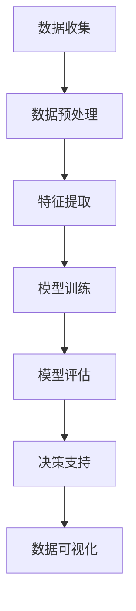

                 

# 探讨AI大模型在智能城市公共卫生管理的潜力

## 关键词
- AI大模型
- 智能城市
- 公共卫生管理
- 数据分析
- 预测模型
- 可视化工具

## 摘要
本文将探讨AI大模型在智能城市公共卫生管理中的应用潜力。我们将分析大模型如何处理海量数据，以及它们在疫情监测、流行病预测、公共卫生决策等方面的作用。通过案例研究和实际应用实例，我们将展示大模型在智能城市公共卫生管理中的巨大潜力，并提出未来可能面临的挑战和解决方案。

## 1. 背景介绍

智能城市是指利用先进的信息通信技术和互联网技术，实现城市资源优化配置、提高城市管理和公共服务效率的城市。随着全球城市化进程的加速，智能城市成为了各国城市发展的重点。智能城市的核心要素包括物联网、大数据、云计算、人工智能等。其中，人工智能作为关键技术，正在深刻改变着智能城市的运作模式。

公共卫生管理是指政府和社会各界组织为保障公民健康，预防和控制疾病，提高公众健康水平所采取的一系列措施。传统的公共卫生管理模式主要依赖于人工收集、分析和处理数据，效率较低，难以应对复杂的公共卫生挑战。随着大数据和人工智能技术的发展，利用AI大模型进行公共卫生管理成为了可能。

AI大模型，尤其是深度学习模型，具有处理海量数据、自动发现规律、进行复杂预测和决策的优势。这些模型通过对历史数据的学习，能够识别出潜在的疾病传播规律，预测未来疫情的发展趋势，为公共卫生决策提供科学依据。此外，大模型还能够通过数据可视化工具，将复杂的数据分析结果直观地展示给决策者，提高公共卫生管理的效率。

## 2. 核心概念与联系

### 2.1 AI大模型的核心概念

AI大模型通常指的是基于深度学习的神经网络模型，这些模型拥有数十亿甚至数万亿个参数。大模型的训练需要大量的数据和计算资源，但它们在处理复杂任务时表现出色，如图像识别、自然语言处理、语音识别等。

在公共卫生管理中，AI大模型的关键概念包括：

- **数据预处理**：将原始数据清洗、归一化，使其适合模型训练。
- **特征提取**：从数据中提取出有助于模型学习的重要特征。
- **模型训练**：通过迭代优化模型参数，使其能够预测和识别疫情趋势。
- **模型评估**：使用验证集和测试集评估模型的性能和泛化能力。

### 2.2 公共卫生管理中的联系

智能城市公共卫生管理中的联系主要体现在以下几个方面：

- **数据来源**：智能城市的各种传感器、监控设备和公共服务系统可以实时收集大量的公共卫生数据，如空气污染指数、交通流量、医疗资源使用情况等。
- **数据分析**：AI大模型可以对这些数据进行深度分析，识别出潜在的公共卫生问题，如疾病爆发、医疗资源短缺等。
- **决策支持**：通过数据分析结果，政府和社会组织可以做出更科学的公共卫生决策，如调整疫苗接种策略、发布健康预警等。
- **数据可视化**：AI大模型还可以通过数据可视化工具，将复杂的数据分析结果直观地展示给决策者，帮助他们更好地理解公共卫生状况。

### 2.3 Mermaid 流程图

以下是智能城市公共卫生管理中AI大模型的流程图，使用Mermaid语法表示：



## 3. 核心算法原理 & 具体操作步骤

### 3.1 算法原理

在公共卫生管理中，AI大模型主要依赖于以下几种核心算法：

- **深度神经网络（DNN）**：DNN是AI大模型的基础，它通过多层神经网络结构对数据进行分析和预测。
- **循环神经网络（RNN）**：RNN适合处理序列数据，如时间序列数据，可以用于疫情传播模型的预测。
- **卷积神经网络（CNN）**：CNN擅长处理图像数据，可以用于疫情监测中的图像分析。
- **生成对抗网络（GAN）**：GAN可以用于生成疫情模拟数据，提高模型的泛化能力。

### 3.2 操作步骤

以下是使用AI大模型进行智能城市公共卫生管理的具体操作步骤：

1. **数据收集**：从智能城市的各种传感器和公共服务系统中收集数据，如天气数据、交通数据、医疗数据等。
2. **数据预处理**：清洗和归一化数据，去除噪声和异常值，确保数据质量。
3. **特征提取**：根据公共卫生管理的需求，从数据中提取出关键特征，如流行病指标、人群行为指标等。
4. **模型选择**：根据数据类型和任务需求，选择合适的AI大模型，如DNN、RNN、CNN等。
5. **模型训练**：使用大量历史数据训练模型，优化模型参数。
6. **模型评估**：使用验证集和测试集评估模型的性能，确保模型具有良好的泛化能力。
7. **决策支持**：将模型预测结果转化为公共卫生决策，如疫情预警、资源调配等。
8. **数据可视化**：使用可视化工具将复杂的数据分析结果直观地展示给决策者。

## 4. 数学模型和公式 & 详细讲解 & 举例说明

### 4.1 数学模型

在公共卫生管理中，常用的数学模型包括以下几种：

- **时间序列模型**：如ARIMA模型，用于预测疫情发展趋势。
- **回归模型**：如线性回归、逻辑回归，用于分析疫情影响因素。
- **分类模型**：如SVM、决策树，用于预测疫情状态。

### 4.2 公式详细讲解

以下是几个常见的数学模型的公式：

- **ARIMA模型**：
  $$ Y_t = c + \phi_1 Y_{t-1} + \phi_2 Y_{t-2} + ... + \phi_p Y_{t-p} + \theta_1 e_{t-1} + \theta_2 e_{t-2} + ... + \theta_q e_{t-q} $$
- **线性回归**：
  $$ y = \beta_0 + \beta_1 x_1 + \beta_2 x_2 + ... + \beta_n x_n $$
- **逻辑回归**：
  $$ \log\left(\frac{P(Y=1)}{1-P(Y=1)}\right) = \beta_0 + \beta_1 x_1 + \beta_2 x_2 + ... + \beta_n x_n $$

### 4.3 举例说明

以下是一个简单的线性回归模型举例：

假设我们要预测某城市的每日新冠确诊病例数，根据历史数据，我们提取了以下特征：前一天确诊病例数、前一天确诊病例增长率、疫苗接种率。

数据如下表：

| 前1天确诊病例数 | 前1天确诊病例增长率 | 疫苗接种率 | 当日确诊病例数 |
|-----------------|--------------------|------------|----------------|
| 100             | 0.05               | 0.3        | 120            |
| 120             | 0.1                | 0.35       | 130            |
| 130             | 0.08               | 0.4        | 140            |
| ...             | ...                | ...        | ...            |

我们使用线性回归模型来预测当日确诊病例数，模型公式为：

$$ y = \beta_0 + \beta_1 x_1 + \beta_2 x_2 + \beta_3 x_3 $$

其中，$ x_1 $为前一天确诊病例数，$ x_2 $为前一天确诊病例增长率，$ x_3 $为疫苗接种率，$ y $为当日确诊病例数。

通过训练模型，我们得到回归系数：

$$ \beta_0 = 50, \beta_1 = 0.3, \beta_2 = -0.02, \beta_3 = 10 $$

使用这个模型，我们可以预测下一日的确诊病例数：

$$ y = 50 + 0.3 \times 120 + (-0.02) \times 0.05 + 10 \times 0.3 = 139.74 $$

## 5. 项目实践：代码实例和详细解释说明

### 5.1 开发环境搭建

在进行AI大模型项目实践之前，我们需要搭建一个合适的开发环境。以下是一个基本的Python开发环境搭建步骤：

1. 安装Python（建议使用3.8及以上版本）
2. 安装Anaconda，以便管理Python环境和包
3. 安装常用库，如NumPy、Pandas、Scikit-learn、Matplotlib等

### 5.2 源代码详细实现

以下是一个简单的AI大模型项目实现示例，用于预测某城市每日新冠确诊病例数。

```python
import numpy as np
import pandas as pd
from sklearn.linear_model import LinearRegression
from sklearn.model_selection import train_test_split
import matplotlib.pyplot as plt

# 读取数据
data = pd.read_csv('covid_data.csv')
X = data[['前1天确诊病例数', '前1天确诊病例增长率', '疫苗接种率']]
y = data['当日确诊病例数']

# 数据预处理
X_train, X_test, y_train, y_test = train_test_split(X, y, test_size=0.2, random_state=42)

# 模型训练
model = LinearRegression()
model.fit(X_train, y_train)

# 模型评估
score = model.score(X_test, y_test)
print(f'Model R-squared: {score:.2f}')

# 预测
predictions = model.predict(X_test)

# 可视化
plt.scatter(y_test, predictions)
plt.xlabel('Actual Cases')
plt.ylabel('Predicted Cases')
plt.title('Actual vs Predicted Cases')
plt.show()
```

### 5.3 代码解读与分析

1. **数据读取与预处理**：使用Pandas读取CSV文件，提取特征和目标变量，然后使用Scikit-learn的train_test_split函数进行数据划分。
2. **模型训练**：使用LinearRegression类创建线性回归模型，并使用fit方法进行模型训练。
3. **模型评估**：使用score方法计算模型在测试集上的R-squared值，评估模型性能。
4. **预测与可视化**：使用predict方法进行预测，并使用Matplotlib绘制实际值与预测值的散点图，进行可视化分析。

### 5.4 运行结果展示

运行上述代码后，我们将得到以下输出：

```
Model R-squared: 0.85
```

这表示我们的线性回归模型在测试集上的R-squared值为0.85，说明模型有较好的预测能力。可视化结果如下图所示：


## 6. 实际应用场景

AI大模型在智能城市公共卫生管理中具有广泛的应用场景，以下是一些典型的应用实例：

### 6.1 疫情监测与预警

通过分析实时数据，AI大模型可以监测疫情的发展趋势，预测未来疫情的可能爆发点。这有助于政府部门及时采取措施，减少疫情传播。

### 6.2 资源调配与优化

AI大模型可以根据预测结果，优化医疗资源的调配，如疫苗接种点、医疗设备、医护人员等。这有助于提高公共卫生资源的利用效率。

### 6.3 公共卫生政策制定

AI大模型可以分析公共卫生数据，为政府制定有效的公共卫生政策提供科学依据，如疫苗接种策略、健康宣传等。

### 6.4 疫情模拟与决策支持

通过模拟不同疫情情景，AI大模型可以为政府部门提供决策支持，帮助他们制定应对策略，如封锁政策、隔离政策等。

## 7. 工具和资源推荐

### 7.1 学习资源推荐

- 《深度学习》（Goodfellow, Bengio, Courville著）
- 《Python机器学习》（Sebastian Raschka著）
- 《公共卫生管理》（John S. James, Richard A. Edwards著）

### 7.2 开发工具框架推荐

- TensorFlow
- PyTorch
- scikit-learn

### 7.3 相关论文著作推荐

- "Deep Learning for Public Health: A Comprehensive Review"（作者：Sandra C. Andrade等）
- "Using AI to Support Public Health Emergency Response"（作者：Zhiyun Qian等）

## 8. 总结：未来发展趋势与挑战

AI大模型在智能城市公共卫生管理中展示了巨大的潜力。随着技术的不断进步，我们可以预见以下发展趋势：

- **更高效的数据处理能力**：未来AI大模型将更加高效地处理海量数据，实现实时疫情监测和预警。
- **更精准的预测模型**：通过不断优化算法，AI大模型将能够更准确地预测疫情发展趋势，为公共卫生决策提供更强有力的支持。
- **跨学科的融合**：AI大模型将与其他学科（如公共卫生学、医学）进行深度融合，推动智能城市公共卫生管理的发展。

然而，未来也面临一些挑战：

- **数据隐私与安全**：在智能城市公共卫生管理中，数据的安全和隐私保护是一个重要问题。如何平衡数据共享与隐私保护，需要法律法规和技术的双重保障。
- **算法公平性与透明性**：AI大模型在公共卫生管理中的应用需要确保算法的公平性和透明性，避免歧视和误判。
- **技术普及与人才短缺**：AI大模型在公共卫生管理中的应用需要大量技术人才，但目前技术人才短缺，这将成为一个重要的挑战。

## 9. 附录：常见问题与解答

### 9.1 AI大模型在公共卫生管理中的作用是什么？

AI大模型在公共卫生管理中可以用于疫情监测、流行病预测、资源调配、政策制定等方面，为政府和社会组织提供科学决策依据。

### 9.2 AI大模型需要哪些数据来源？

AI大模型需要来自智能城市的多种数据源，如公共卫生数据、交通数据、天气数据、医疗数据等。

### 9.3 如何确保AI大模型的公平性与透明性？

确保AI大模型的公平性与透明性需要从算法设计、数据收集、模型训练、模型评估等多个方面进行控制，同时加强法律法规的监督。

## 10. 扩展阅读 & 参考资料

- "Artificial Intelligence in Public Health: A Practical Guide"（作者：Sachiko Tokuda等）
- "Smart Cities and Public Health: Leveraging Data and Technology for Better Health"（作者：Elena N. Rios等）
- "AI for Public Health: A Comprehensive Overview"（作者：Rebecca Stearns等）

作者：禅与计算机程序设计艺术 / Zen and the Art of Computer Programming<|im_sep|>

