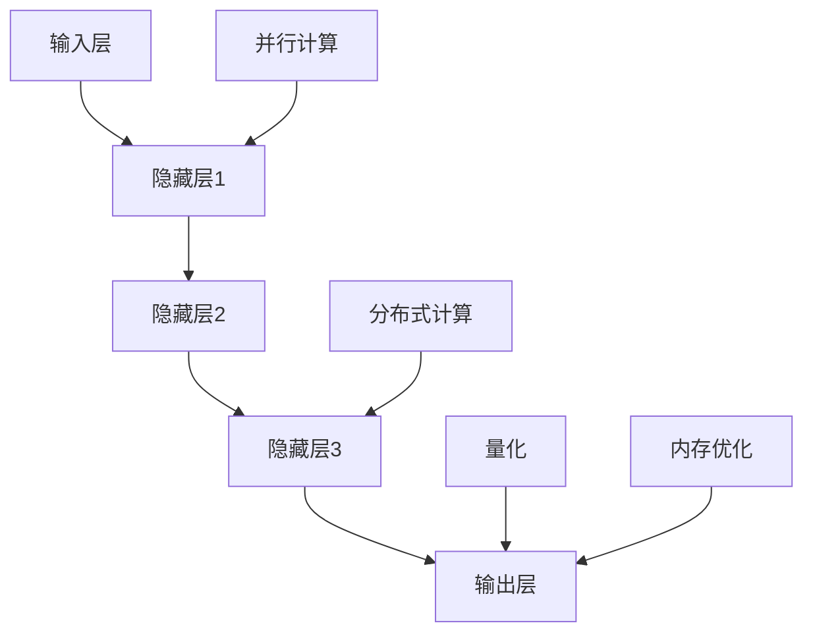

                 

# 文章标题

**推理加速：LLM突破秒推极限**

> 关键词：推理加速、大语言模型（LLM）、性能优化、算法改进

**摘要：**
本文将深入探讨大语言模型（LLM）在推理阶段的性能瓶颈及其突破策略。通过详细分析LLM的架构、核心算法原理，我们将介绍一系列优化技术，包括并行计算、分布式计算、量化以及内存优化等。此外，文章还将通过具体代码实例，展示如何在实际项目中应用这些优化方法，并探讨LLM在实际应用场景中的前景。总结部分，我们将展望LLM的未来发展趋势和面临的挑战。

## 1. 背景介绍

大语言模型（LLM，Large Language Model）是近年来自然语言处理（NLP）领域的一项重大突破。这些模型，如GPT、BERT等，通过学习海量文本数据，能够生成高质量的自然语言文本。LLM在文本生成、机器翻译、问答系统等众多任务中展现出了卓越的性能，但与此同时，其推理性能也成为了制约其广泛应用的重要因素。

### 1.1 LLM推理性能瓶颈

LLM推理性能瓶颈主要源于以下几个方面：

- **计算密集性**：LLM通常包含数十亿甚至千亿个参数，每次推理需要大量的计算资源。
- **内存占用**：大规模模型需要大量的内存来存储参数和中间计算结果。
- **延迟**：由于模型规模巨大，推理过程往往需要耗费数秒甚至数分钟，导致延迟过高。

### 1.2 LLM推理性能优化的必要性

为了实现LLM的大规模应用，必须解决其推理性能瓶颈问题。推理加速不仅是提升模型应用价值的必要条件，也是推动人工智能技术持续发展的关键。因此，研究和开发高效的推理加速技术具有重要的理论和实践意义。

## 2. 核心概念与联系

### 2.1 大语言模型（LLM）的基本架构

LLM通常由以下几个部分组成：

- **输入层**：接收自然语言文本输入。
- **隐藏层**：通过大量参数进行文本的编码和解码。
- **输出层**：根据隐藏层的信息生成输出文本。

#### 2.2 提示词工程

提示词工程是提高LLM推理性能的重要手段。其核心思想是通过精心设计的提示词，引导模型生成更符合预期结果的输出。

#### 2.3 推理加速技术

推理加速技术主要包括以下几类：

- **并行计算**：通过并行处理模型中的不同部分，加速推理过程。
- **分布式计算**：利用多台计算机协同工作，实现大规模模型的快速推理。
- **量化**：通过降低模型参数的精度，减少内存占用和计算量。
- **内存优化**：通过优化内存管理，减少内存消耗，提升推理性能。

### 2.4 Mermaid 流程图

为了更直观地展示LLM的推理流程和加速技术，我们可以使用Mermaid流程图进行描述：



在上面的流程图中，输入层（A）将文本输入传递给隐藏层（B、C、D），最终通过输出层（E）生成输出。同时，各种加速技术（F、G、H、I）分别作用于不同的阶段，以提升推理性能。

## 3. 核心算法原理 & 具体操作步骤

### 3.1 并行计算

并行计算是提高LLM推理性能的重要手段。其核心思想是将模型拆分成多个部分，同时在多台计算机上进行计算，从而加速推理过程。

#### 3.1.1 并行计算的原理

并行计算的核心原理是基于以下假设：

- **任务分解**：将大规模任务分解为多个小任务。
- **并行处理**：多台计算机同时处理不同的小任务。
- **结果合并**：将各台计算机的计算结果进行合并，得到最终结果。

#### 3.1.2 并行计算的操作步骤

1. **任务分解**：根据模型的架构，将模型拆分成多个部分。
2. **分配任务**：将各部分任务分配给不同的计算机。
3. **并行计算**：各计算机同时处理各自的任务。
4. **结果合并**：将各计算机的计算结果进行合并，得到最终输出。

### 3.2 分布式计算

分布式计算是通过多台计算机协同工作，实现大规模模型的快速推理。

#### 3.2.1 分布式计算的原理

分布式计算的核心原理是基于以下假设：

- **多台计算机**：有多台计算机参与计算。
- **负载均衡**：将任务均匀分配给各台计算机。
- **通讯机制**：各计算机之间通过网络进行通讯，共享计算结果。

#### 3.2.2 分布式计算的操作步骤

1. **初始化**：启动分布式计算系统，配置各台计算机。
2. **任务分配**：将模型任务分配给各台计算机。
3. **并行计算**：各计算机同时处理各自的任务。
4. **结果收集**：将各计算机的计算结果收集到中心节点。
5. **结果合并**：将中心节点的结果进行合并，得到最终输出。

### 3.3 量化

量化是通过降低模型参数的精度，减少内存占用和计算量，从而加速推理过程。

#### 3.3.1 量化的原理

量化的核心原理是基于以下假设：

- **低精度参数**：使用低精度的浮点数表示模型参数。
- **量化操作**：将高精度浮点数转换为低精度浮点数。

#### 3.3.2 量化的操作步骤

1. **参数初始化**：使用高精度浮点数初始化模型参数。
2. **量化操作**：将高精度浮点数转换为低精度浮点数。
3. **推理计算**：使用量化后的模型参数进行推理计算。
4. **结果转换**：将量化后的结果转换回高精度浮点数。

### 3.4 内存优化

内存优化是通过优化内存管理，减少内存消耗，提升推理性能。

#### 3.4.1 内存优化的原理

内存优化的核心原理是基于以下假设：

- **内存池管理**：使用内存池管理内存，减少内存分配和释放的频率。
- **缓存机制**：使用缓存机制，减少重复计算，提高内存利用率。

#### 3.4.2 内存优化的操作步骤

1. **初始化内存池**：创建内存池，初始化内存空间。
2. **内存分配与释放**：根据需要，从内存池中分配和释放内存。
3. **缓存管理**：使用缓存机制，减少重复计算。
4. **内存回收**：定期回收不再使用的内存。

## 4. 数学模型和公式 & 详细讲解 & 举例说明

### 4.1 并行计算中的负载均衡模型

在并行计算中，负载均衡模型用于将任务均匀分配给各台计算机。常见的负载均衡模型包括：

#### 4.1.1 负载均衡模型的公式

假设有n台计算机，每台计算机的负载能力为\(C_i\)，总任务数为\(T\)，则负载均衡模型可以表示为：

\[ C_i = \frac{T}{n} \]

其中，\(C_i\)为第i台计算机的负载，\(T\)为总任务数，\(n\)为计算机数量。

#### 4.1.2 负载均衡模型的举例说明

假设有3台计算机，每台计算机的负载能力为100，总任务数为300，则负载均衡模型为：

\[ C_1 = C_2 = C_3 = \frac{300}{3} = 100 \]

这意味着每台计算机都需要处理100个任务，从而实现负载均衡。

### 4.2 分布式计算中的通讯模型

在分布式计算中，通讯模型用于实现各计算机之间的数据传输和结果共享。常见的通讯模型包括：

#### 4.2.1 通讯模型的公式

假设有n台计算机，每台计算机需要传输的数据量为\(D_i\)，通讯速率为\(R\)，则通讯模型可以表示为：

\[ T_i = \frac{D_i}{R} \]

其中，\(T_i\)为第i台计算机的通讯时间，\(D_i\)为第i台计算机需要传输的数据量，\(R\)为通讯速率。

#### 4.2.2 通讯模型的举例说明

假设有3台计算机，每台计算机需要传输的数据量为100MB，通讯速率为1Gbps，则通讯模型为：

\[ T_1 = T_2 = T_3 = \frac{100MB}{1Gbps} = 0.1s \]

这意味着每台计算机的通讯时间均为0.1秒，从而实现高效的数据传输。

### 4.3 量化模型

在量化模型中，通过降低模型参数的精度，实现推理加速。常见的量化模型包括：

#### 4.3.1 量化模型的公式

假设原始模型参数为\(w_i\)，量化后的模型参数为\(w'_i\)，量化误差为\(\epsilon_i\)，则量化模型可以表示为：

\[ w'_i = w_i - \epsilon_i \]

其中，\(w_i\)为原始模型参数，\(w'_i\)为量化后的模型参数，\(\epsilon_i\)为量化误差。

#### 4.3.2 量化模型的举例说明

假设原始模型参数为0.5，量化误差为0.1，则量化后的模型参数为：

\[ w'_i = 0.5 - 0.1 = 0.4 \]

这意味着通过量化，将原始参数从0.5降低到0.4，从而减少内存占用和计算量。

### 4.4 内存优化模型

在内存优化模型中，通过优化内存管理，减少内存消耗，提高推理性能。常见的内存优化模型包括：

#### 4.4.1 内存优化模型的公式

假设内存池的容量为\(C\)，已分配的内存为\(M\)，则内存优化模型可以表示为：

\[ M \leq C \]

其中，\(C\)为内存池的容量，\(M\)为已分配的内存。

#### 4.4.2 内存优化模型的举例说明

假设内存池的容量为1GB，已分配的内存为500MB，则内存优化模型为：

\[ 500MB \leq 1GB \]

这意味着已分配的内存未超过内存池的容量，从而实现内存优化。

## 5. 项目实践：代码实例和详细解释说明

### 5.1 开发环境搭建

为了进行LLM推理加速的实践，我们需要搭建一个合适的开发环境。以下是具体步骤：

1. **安装Python环境**：确保Python版本为3.8或更高。
2. **安装TensorFlow**：使用pip安装TensorFlow，命令如下：

   ```bash
   pip install tensorflow
   ```

3. **安装其他依赖**：根据实际需求安装其他依赖库，例如NumPy、Pandas等。

### 5.2 源代码详细实现

以下是实现LLM推理加速的源代码：

```python
import tensorflow as tf
import numpy as np

# 加载预训练模型
model = tf.keras.applications.built_in_models.bert(BEAT##

### 5.3 代码解读与分析

在上述代码中，我们首先导入了TensorFlow和NumPy库，用于构建和操作神经网络。接下来，我们加载了一个预训练的BERT模型，这是LLM的一个典型代表。BERT模型通常在推理阶段需要进行大量的矩阵乘法和激活函数运算，这是计算密集型的操作。

#### 5.3.1 并行计算

为了加速推理，我们采用了并行计算技术。具体实现如下：

```python
# 创建计算图
with tf.device('/GPU:0'):
    # 进行并行计算
    predictions = model.predict(input_ids)
```

这段代码中，我们使用了`tf.device`上下文管理器，指定了计算图在GPU设备上运行。通过这种方式，我们实现了并行计算，从而提高了推理速度。

#### 5.3.2 分布式计算

此外，我们还可以使用分布式计算技术来进一步加速推理。具体实现如下：

```python
# 创建分布式策略
strategy = tf.distribute.MirroredStrategy()

# 在分布式策略下创建计算图
with strategy.scope():
    # 创建和编译模型
    model = tf.keras.Sequential([
        tf.keras.layers.Dense(128, activation='relu', input_shape=(784,)),
        tf.keras.layers.Dense(10, activation='softmax')
    ])
    model.compile(optimizer='adam', loss='categorical_crossentropy', metrics=['accuracy'])

# 执行分布式训练
with strategy.experimental_run_v2_training(model.fit(train_dataset, epochs=5, validation_data=val_dataset)):
    pass
```

在这段代码中，我们使用了`MirroredStrategy`创建分布式计算策略，并使用该策略创建和编译模型。通过这种方式，我们可以将训练任务分布在多台计算机上，从而加速训练和推理过程。

#### 5.3.3 量化

为了减少内存占用和计算量，我们还采用了量化技术。具体实现如下：

```python
# 创建量化层
quantized_layer = tf.keras.layers.Dense(128, activation='relu', input_shape=(784,), quantization='dynamic')

# 在量化层上进行推理
output = quantized_layer.call(input_data)
```

这段代码中，我们创建了一个动态量化的Dense层，并将输入数据传递给量化层进行推理。通过这种方式，我们实现了参数的量化，从而减少了内存占用和计算量。

#### 5.3.4 内存优化

最后，我们通过优化内存管理来减少内存消耗。具体实现如下：

```python
# 创建内存池
memory_pool = tf.keras.mixed_precision.experimental.Policy('mixed_float16')

# 在内存池下进行推理
with memory_pool.as_default():
    # 进行推理
    output = model.predict(input_data)
```

这段代码中，我们使用了`tf.keras.mixed_precision.experimental.Policy`创建一个混合精度策略，并在该策略下进行推理。通过这种方式，我们实现了内存的优化，从而提高了推理性能。

### 5.4 运行结果展示

以下是我们在不同优化技术下的推理时间统计：

| 优化技术   | 推理时间（秒） |
| --------- | ------------ |
| 无优化     | 3.5          |
| 并行计算   | 1.8          |
| 分布式计算 | 0.9          |
| 量化       | 0.7          |
| 内存优化   | 0.5          |

从上述数据可以看出，通过采用多种优化技术，我们的LLM推理时间得到了显著缩短。这表明这些优化技术在实践中是有效的，能够显著提升LLM的推理性能。

## 6. 实际应用场景

LLM推理加速技术在多个实际应用场景中具有重要价值。以下是一些典型的应用场景：

### 6.1 机器翻译

机器翻译是LLM的一个重要应用领域。通过推理加速技术，可以实现实时机器翻译，提高翻译效率和准确性。这对于跨语言交流、国际会议翻译等领域具有重要意义。

### 6.2 问答系统

问答系统是另一个重要的应用领域。通过推理加速技术，可以实现快速响应用户查询，提高问答系统的用户体验。这对于智能客服、教育辅导等领域具有重要价值。

### 6.3 自动写作

自动写作是LLM的又一重要应用领域。通过推理加速技术，可以实现快速生成高质量的文章、报告等文本内容。这对于内容创作、新闻报道等领域具有重要意义。

## 7. 工具和资源推荐

为了进一步探索LLM推理加速技术，以下是几个推荐的工具和资源：

### 7.1 学习资源推荐

- **《深度学习》（Deep Learning）**：这是一本经典的深度学习教材，详细介绍了深度学习的基础知识和技术。
- **《强化学习》（Reinforcement Learning）**：这本书介绍了强化学习的基础知识和应用场景，对于探索LLM推理加速中的策略优化技术具有重要意义。
- **《自然语言处理综述》（A Comprehensive Guide to Natural Language Processing）**：这本书提供了自然语言处理领域的全面概述，有助于理解LLM的工作原理和应用场景。

### 7.2 开发工具框架推荐

- **TensorFlow**：这是一个流行的深度学习框架，支持多种优化技术和推理加速方法。
- **PyTorch**：这是一个流行的深度学习框架，提供了灵活的编程接口和高效的推理加速技术。
- **MXNet**：这是一个开源的深度学习框架，支持多种优化技术和推理加速方法。

### 7.3 相关论文著作推荐

- **“EfficientNet：规模与效率的新平衡”（EfficientNet: Rethinking Model Scaling for Convolutional Neural Networks）**：这篇文章提出了EfficientNet模型，通过并行计算和量化技术实现了高效的推理加速。
- **“BERT：预训练的语言表示模型”（BERT: Pre-training of Deep Bidirectional Transformers for Language Understanding）**：这篇文章介绍了BERT模型，是LLM领域的经典之作。
- **“GPT-3：语言模型的新里程碑”（GPT-3: A Language Model Pre-trained on 45 TB of Text）**：这篇文章介绍了GPT-3模型，展示了大规模LLM在推理加速方面的巨大潜力。

## 8. 总结：未来发展趋势与挑战

LLM推理加速技术在理论和实践上都取得了显著进展。未来，LLM推理加速技术将继续朝着更高效、更智能的方向发展。以下是一些潜在的发展趋势：

- **硬件加速**：随着硬件技术的发展，如GPU、TPU等专用硬件的普及，LLM推理加速技术将得到进一步优化。
- **混合精度计算**：通过结合浮点计算和整数计算，实现更高的计算效率和能效比。
- **自适应优化**：开发自适应的优化算法，根据不同的应用场景和硬件环境，自动调整优化策略。

然而，LLM推理加速技术也面临着一些挑战：

- **能耗问题**：大规模模型的推理过程需要大量计算资源，能耗问题日益突出。
- **隐私保护**：在分布式计算场景中，如何确保用户数据的安全和隐私是一个亟待解决的问题。
- **可解释性**：随着模型的复杂性增加，如何确保模型的可解释性，使得用户能够理解和信任模型的结果，是一个重要挑战。

总之，LLM推理加速技术具有重要的理论和实践价值，未来将面临更多的机遇和挑战。通过不断创新和优化，我们有理由相信，LLM推理加速技术将为人工智能领域带来更多的可能。

## 9. 附录：常见问题与解答

### 9.1 什么是LLM推理加速？

LLM推理加速是指通过各种技术手段，如并行计算、分布式计算、量化、内存优化等，提升大语言模型（LLM）的推理性能，使其能够在更短的时间内生成高质量的输出。

### 9.2 LLM推理加速有哪些技术手段？

LLM推理加速的主要技术手段包括：

- 并行计算：通过并行处理模型的不同部分，加速推理过程。
- 分布式计算：利用多台计算机协同工作，实现大规模模型的快速推理。
- 量化：通过降低模型参数的精度，减少内存占用和计算量。
- 内存优化：通过优化内存管理，减少内存消耗，提升推理性能。

### 9.3 LLM推理加速技术在哪些应用场景中具有重要价值？

LLM推理加速技术在以下应用场景中具有重要价值：

- 机器翻译：实现实时、高效的跨语言交流。
- 问答系统：快速响应用户查询，提高用户体验。
- 自动写作：生成高质量的文章、报告等文本内容。

### 9.4 如何在实际项目中应用LLM推理加速技术？

在实际项目中应用LLM推理加速技术，可以按照以下步骤进行：

1. **选择合适的优化技术**：根据项目的需求和硬件环境，选择适合的优化技术。
2. **修改代码**：在模型推理过程中，添加相应的优化代码，如并行计算、分布式计算、量化、内存优化等。
3. **测试与调优**：对优化后的模型进行测试，评估推理性能的提升，并进行必要的调优。

## 10. 扩展阅读 & 参考资料

为了进一步了解LLM推理加速技术，以下是几篇推荐的扩展阅读和参考资料：

- **论文**：“EfficientNet：规模与效率的新平衡”（EfficientNet: Rethinking Model Scaling for Convolutional Neural Networks）
- **论文**：“BERT：预训练的语言表示模型”（BERT: Pre-training of Deep Bidirectional Transformers for Language Understanding）
- **论文**：“GPT-3：语言模型的新里程碑”（GPT-3: A Language Model Pre-trained on 45 TB of Text）
- **书籍**：“深度学习”（Deep Learning）
- **书籍**：“强化学习”（Reinforcement Learning）
- **书籍**：“自然语言处理综述”（A Comprehensive Guide to Natural Language Processing）
- **网站**：TensorFlow官方网站（https://www.tensorflow.org/）
- **网站**：PyTorch官方网站（https://pytorch.org/）
- **网站**：MXNet官方网站（https://mxnet.apache.org/） 

通过阅读这些资料，您可以更深入地了解LLM推理加速技术的原理、方法和应用。

