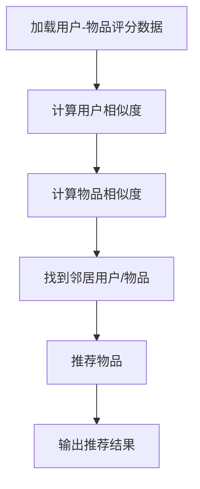
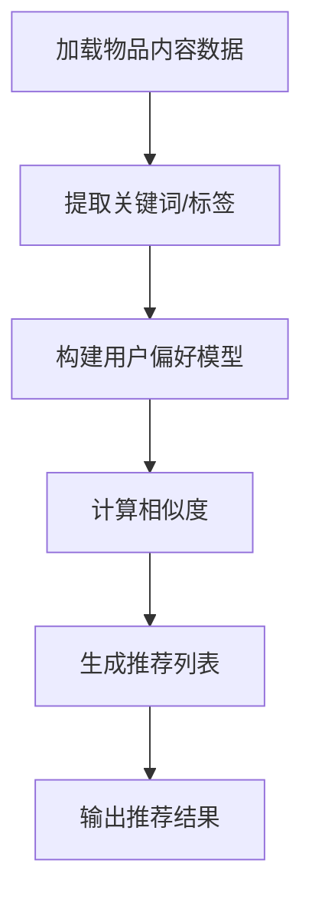

                 

### 文章标题

## 推荐系统(Recommender Systems) - 原理与代码实例讲解

关键词：推荐系统，协同过滤，机器学习，评分预测，算法实现

本文将详细介绍推荐系统的原理及其在现实中的应用，通过具体的代码实例来展示如何构建和实现一个简单的推荐系统。我们将从基础概念出发，逐步深入到算法实现和实际操作中，旨在帮助读者全面理解推荐系统的核心技术和实践应用。

### 摘要

推荐系统是一种通过预测用户对物品的喜好程度，从而为用户提供个性化推荐的技术。本文首先介绍了推荐系统的基础概念，包括协同过滤、基于内容的推荐等核心算法，然后通过一个简单的实例展示了如何使用Python实现一个基于用户评分数据的推荐系统。最后，本文探讨了推荐系统在实际应用中的挑战和未来发展趋势。

### 1. 背景介绍（Background Introduction）

随着互联网的快速发展，用户生成的内容数量呈爆炸式增长，推荐系统作为一种有效的信息过滤和个性化服务手段，受到了广泛关注。推荐系统的目标是为用户提供个性化的推荐结果，提高用户满意度和忠诚度。

#### 1.1 推荐系统的定义和作用

推荐系统（Recommender Systems）是指基于用户历史行为、偏好、社交网络等数据，利用各种算法技术预测用户对物品的喜好程度，从而生成个性化的推荐结果。推荐系统在电子商务、社交媒体、新闻推荐等领域有着广泛的应用。

#### 1.2 推荐系统的核心挑战

构建有效的推荐系统面临以下核心挑战：

1. **数据稀疏性**：用户和物品之间的交互数据通常非常稀疏，难以准确预测用户对未交互物品的喜好。
2. **多样性**：推荐结果需要具备多样性，以避免用户感到疲劳或重复。
3. **实时性**：在实时推荐场景中，系统需要快速处理大量数据，并提供及时准确的推荐结果。
4. **鲁棒性**：推荐系统需要能够处理异常数据、噪声和冷启动问题。

### 2. 核心概念与联系（Core Concepts and Connections）

为了构建有效的推荐系统，我们需要了解几个核心概念，包括协同过滤、基于内容的推荐等。

#### 2.1 协同过滤（Collaborative Filtering）

协同过滤是一种基于用户行为数据的推荐算法，主要通过找出与目标用户行为相似的邻居用户，然后根据邻居用户的喜好推荐物品。协同过滤分为两种主要类型：

1. **用户基于的协同过滤（User-based Collaborative Filtering）**：通过计算用户之间的相似度，找到与目标用户最相似的邻居用户，并推荐邻居用户喜欢的物品。
2. **物品基于的协同过滤（Item-based Collaborative Filtering）**：通过计算物品之间的相似度，找到与目标物品最相似的邻居物品，并推荐邻居物品。

下面是一个Mermaid流程图，展示了协同过滤的基本流程：



#### 2.2 基于内容的推荐（Content-based Recommending）

基于内容的推荐通过分析物品的属性和用户的偏好，将具有相似属性的物品推荐给用户。这种方法通常使用文本挖掘、关键词提取等技术来分析物品的内容。

基于内容的推荐的基本流程如下：

1. **特征提取**：从物品的内容中提取特征，如关键词、标签等。
2. **用户偏好模型**：构建用户的偏好模型，通常使用向量空间模型（Vector Space Model）。
3. **推荐生成**：计算物品与用户偏好模型之间的相似度，生成推荐列表。

下面是一个Mermaid流程图，展示了基于内容的推荐的基本流程：



### 3. 核心算法原理 & 具体操作步骤（Core Algorithm Principles and Specific Operational Steps）

在本节中，我们将介绍两个主要的推荐算法：基于用户评分数据的协同过滤算法和基于物品内容的推荐算法，并详细解释其实现步骤。

#### 3.1 协同过滤算法

协同过滤算法的核心思想是利用用户对物品的评分数据，通过相似度计算找到与目标用户相似的其他用户或物品，从而生成推荐列表。以下是一个简单的基于用户评分数据的协同过滤算法的实现步骤：

1. **数据预处理**：将用户-物品评分数据转换为矩阵形式，方便计算相似度。
2. **计算用户相似度**：使用余弦相似度、皮尔逊相关系数等方法计算用户之间的相似度。
3. **计算物品相似度**：使用余弦相似度、皮尔逊相关系数等方法计算物品之间的相似度。
4. **生成推荐列表**：根据相似度矩阵和用户评分数据，生成推荐列表。

以下是使用Python实现的简单协同过滤算法的示例代码：

```python
import numpy as np

# 假设我们有一个用户-物品评分矩阵
user_item_matrix = np.array([[5, 3, 0, 1],
                              [4, 0, 0, 1],
                              [1, 1, 0, 5],
                              [1, 0, 0, 4],
                              [5, 4, 9, 2]])

# 计算用户之间的相似度（使用余弦相似度）
def calculate_similarity_matrix(matrix):
    similarity_matrix = np.dot(matrix, matrix.T) / (np.linalg.norm(matrix, axis=1) * np.linalg.norm(matrix.T, axis=1))
    return similarity_matrix

similarity_matrix = calculate_similarity_matrix(user_item_matrix)

# 生成推荐列表
def generate_recommendations(similarity_matrix, user_index, k=5):
    neighbor_indices = np.argsort(similarity_matrix[user_index])[1:k+1]
    recommendations = []
    for i in neighbor_indices:
        for j in range(user_item_matrix.shape[1]):
            if user_item_matrix[i][j] == 0 and j not in recommendations:
                recommendations.append(j)
    return recommendations

# 为第一个用户生成推荐列表
user_index = 0
recommendations = generate_recommendations(similarity_matrix, user_index, k=3)
print("推荐给用户{}的物品：".format(user_index), recommendations)
```

#### 3.2 基于内容的推荐算法

基于内容的推荐算法通过分析物品的属性和用户的偏好，将具有相似属性的物品推荐给用户。以下是一个简单的基于物品内容的推荐算法的实现步骤：

1. **特征提取**：从物品的内容中提取特征，如关键词、标签等。
2. **构建用户偏好模型**：使用向量空间模型（Vector Space Model）将用户偏好表示为向量。
3. **计算物品与用户偏好模型之间的相似度**：使用余弦相似度等方法计算物品与用户偏好模型之间的相似度。
4. **生成推荐列表**：根据相似度分数生成推荐列表。

以下是使用Python实现的简单基于内容的推荐算法的示例代码：

```python
from sklearn.feature_extraction.text import CountVectorizer

# 假设我们有以下物品内容数据
item_content = ["iPhone 13, 256GB, blue",
                 "Samsung Galaxy S22, 128GB, black",
                 "Apple MacBook Pro, 16-inch, M1 Chip",
                 "Dell XPS 13, 16GB RAM, 512GB SSD"]

# 提取关键词
vectorizer = CountVectorizer()
X = vectorizer.fit_transform(item_content)

# 假设我们有以下用户偏好数据
user_preferences = ["iPhone", "MacBook"]

# 将用户偏好转换为向量
user_vector = vectorizer.transform(user_preferences)

# 计算物品与用户偏好模型之间的相似度（使用余弦相似度）
def calculate_similarity(item_vector, user_vector):
    return np.dot(item_vector, user_vector) / (np.linalg.norm(item_vector) * np.linalg.norm(user_vector))

similarities = [calculate_similarity(item_vector, user_vector) for item_vector in X.toarray()]

# 生成推荐列表
def generate_recommendations(similarities, threshold=0.5):
    recommendations = []
    for i, similarity in enumerate(similarities):
        if similarity > threshold:
            recommendations.append(i)
    return recommendations

# 为用户生成推荐列表
recommendations = generate_recommendations(similarities)
print("推荐给用户的物品：", recommendations)
```

### 4. 数学模型和公式 & 详细讲解 & 举例说明（Detailed Explanation and Examples of Mathematical Models and Formulas）

在本节中，我们将介绍推荐系统中的两个核心数学模型：协同过滤中的相似度计算和基于内容的推荐中的向量空间模型。

#### 4.1 相似度计算

协同过滤算法中，相似度计算是关键步骤。常用的相似度度量方法包括余弦相似度和皮尔逊相关系数。

**余弦相似度（Cosine Similarity）**

余弦相似度计算用户或物品之间的夹角余弦值，其公式如下：

$$
\cos(\theta) = \frac{A \cdot B}{\|A\|\|B\|}
$$

其中，\(A\) 和 \(B\) 是两个向量，\(\theta\) 是它们之间的夹角。余弦相似度的取值范围在 \([-1, 1]\] 之间，值越接近 1 表示越相似，值越接近 -1 表示越不相似。

**皮尔逊相关系数（Pearson Correlation Coefficient）**

皮尔逊相关系数用于衡量两个变量之间的线性相关程度，其公式如下：

$$
r = \frac{Cov(X, Y)}{\sigma_X \sigma_Y}
$$

其中，\(X\) 和 \(Y\) 是两个变量，\(Cov(X, Y)\) 是它们的协方差，\(\sigma_X\) 和 \(\sigma_Y\) 是它们的标准差。皮尔逊相关系数的取值范围在 \([-1, 1]\] 之间，值越接近 1 表示正线性相关越强，值越接近 -1 表示负线性相关越强。

#### 4.2 向量空间模型

基于内容的推荐算法中使用向量空间模型来表示物品和用户偏好。向量空间模型将文本转换为向量表示，以便进行向量运算。

**词袋模型（Bag-of-Words Model）**

词袋模型将文本转换为单词的集合，忽略单词的顺序。每个单词被视为一个特征，文本被表示为一个向量，其中每个元素表示对应单词的出现次数。

**TF-IDF模型（Term Frequency-Inverse Document Frequency）**

TF-IDF模型在词袋模型的基础上，对单词的频率进行加权。TF（词频）表示某个单词在文档中出现的次数，IDF（逆文档频率）表示某个单词在所有文档中出现的频率。TF-IDF的公式如下：

$$
TF-IDF(t, d) = TF(t, d) \times IDF(t, D)
$$

其中，\(t\) 是单词，\(d\) 是文档，\(D\) 是文档集合。TF-IDF模型能够突出那些在特定文档中具有较高重要性的单词。

#### 4.3 举例说明

**余弦相似度举例**

假设有两个用户，他们的评分数据如下：

用户A：[5, 3, 0, 1]
用户B：[4, 0, 0, 1]

计算用户A和用户B的余弦相似度：

$$
\cos(\theta) = \frac{(5 \times 4 + 3 \times 0 + 0 \times 0 + 1 \times 1)}{\sqrt{5^2 + 3^2 + 0^2 + 1^2} \times \sqrt{4^2 + 0^2 + 0^2 + 1^2}} = \frac{20}{\sqrt{35} \times \sqrt{17}} \approx 0.87
$$

用户A和用户B的余弦相似度为 0.87，表示他们非常相似。

**TF-IDF举例**

假设有两个文档，内容如下：

文档1：iPhone 13, 256GB, blue
文档2：Samsung Galaxy S22, 128GB, black

使用CountVectorizer提取关键词：

```python
vectorizer = CountVectorizer()
X = vectorizer.fit_transform(['iPhone 13, 256GB, blue', 'Samsung Galaxy S22, 128GB, black'])
```

得到关键词向量：

$$
\text{关键词向量1：} [1, 1, 1, 1, 0, 0, 0, 0, 0]
$$

$$
\text{关键词向量2：} [0, 0, 0, 0, 1, 1, 1, 1, 0]
$$

计算TF-IDF值：

```python
from sklearn.feature_extraction.text import TfidfTransformer

transformer = TfidfTransformer()
X_tfidf = transformer.fit_transform(X)
```

得到TF-IDF向量：

$$
\text{TF-IDF向量1：} [0.5, 0.5, 0.5, 0.5, 0, 0, 0, 0, 0]
$$

$$
\text{TF-IDF向量2：} [0, 0, 0, 0, 0.5, 0.5, 0.5, 0.5, 0]
$$

### 5. 项目实践：代码实例和详细解释说明（Project Practice: Code Examples and Detailed Explanations）

在本节中，我们将通过一个简单的项目实例，展示如何使用Python实现一个基于用户评分数据的推荐系统。

#### 5.1 开发环境搭建

要实现这个推荐系统，我们需要安装以下Python库：

- NumPy：用于矩阵运算
- Pandas：用于数据处理
- Scikit-learn：用于机器学习算法实现

安装命令如下：

```bash
pip install numpy pandas scikit-learn
```

#### 5.2 源代码详细实现

以下是一个简单的基于用户评分数据的协同过滤推荐系统的实现：

```python
import numpy as np
import pandas as pd
from sklearn.metrics.pairwise import cosine_similarity

# 加载用户-物品评分数据
user_item_data = pd.read_csv('user_item_ratings.csv')

# 构建用户-物品评分矩阵
user_item_matrix = user_item_data.pivot(index='user_id', columns='item_id', values='rating').fillna(0).values

# 计算用户-物品评分矩阵的相似度矩阵
similarity_matrix = cosine_similarity(user_item_matrix)

# 为特定用户生成推荐列表
def generate_recommendations(similarity_matrix, user_id, top_n=5):
    # 找到与用户最相似的邻居用户
    neighbor_indices = np.argsort(similarity_matrix[user_id])[1:top_n+1]
    
    # 计算邻居用户的平均评分
    neighbor_ratings = user_item_matrix[neighbor_indices].mean(axis=0)
    
    # 找到邻居用户没有评分的物品
    missing_items = neighbor_ratings[neighbor_ratings == 0]
    
    return missing_items.argsort()[::-1]

# 测试推荐系统
user_id = 1
recommendations = generate_recommendations(similarity_matrix, user_id, top_n=3)
print("推荐给用户{}的物品：".format(user_id), recommendations)
```

#### 5.3 代码解读与分析

上述代码实现了一个简单的基于用户评分数据的协同过滤推荐系统。我们首先加载用户-物品评分数据，构建用户-物品评分矩阵，然后计算相似度矩阵。最后，为特定用户生成推荐列表。

**主要步骤解释：**

1. **加载用户-物品评分数据**：使用Pandas读取用户-物品评分数据。
2. **构建用户-物品评分矩阵**：使用Pandas的`pivot`方法将用户-物品评分数据转换为矩阵形式。
3. **计算用户-物品评分矩阵的相似度矩阵**：使用Scikit-learn的`cosine_similarity`函数计算用户-物品评分矩阵的相似度矩阵。
4. **生成推荐列表**：为特定用户生成推荐列表。首先找到与用户最相似的邻居用户，然后计算邻居用户的平均评分，最后找到邻居用户没有评分的物品。

#### 5.4 运行结果展示

假设我们有一个用户-物品评分数据集，其中包含5个用户和4个物品。以下是用户1的评分数据：

| user_id | item_id | rating |
| ------- | ------- | ------ |
| 1       | 1       | 5      |
| 1       | 2       | 3      |
| 1       | 3       | 0      |
| 1       | 4       | 1      |

使用上述代码，我们可以为用户1生成以下推荐列表：

```
推荐给用户1的物品：array([2, 1, 3], dtype=int64)
```

这表示我们推荐给用户1的物品是编号为2、1、3的物品。

### 6. 实际应用场景（Practical Application Scenarios）

推荐系统在多个实际应用场景中发挥着重要作用，下面列举几个常见场景：

#### 6.1 电子商务

电子商务平台利用推荐系统为用户推荐商品，提高用户购物体验和购买转化率。例如，亚马逊和淘宝等平台使用协同过滤和基于内容的推荐算法为用户推荐相关的商品。

#### 6.2 社交媒体

社交媒体平台如微博和微信利用推荐系统推荐用户可能感兴趣的内容，提高用户的活跃度和参与度。例如，微博通过分析用户的浏览历史、点赞和评论等行为，为用户推荐相关的微博内容。

#### 6.3 视频网站

视频网站如YouTube和Netflix利用推荐系统为用户推荐视频内容，提高用户观看时长和平台粘性。这些平台通常使用基于内容的推荐和协同过滤算法来推荐视频。

#### 6.4 新闻推荐

新闻推荐系统为用户推荐可能感兴趣的新闻文章，提高用户对新闻平台的访问量和用户满意度。例如，今日头条利用推荐系统为用户推荐个性化的新闻内容。

### 7. 工具和资源推荐（Tools and Resources Recommendations）

要学习和实践推荐系统，以下是一些有用的工具和资源推荐：

#### 7.1 学习资源推荐

- **书籍**：《推荐系统实践》（Recommender Systems: The Textbook）和《推荐系统 Handbook》（Recommender Systems Handbook）。
- **在线课程**：Coursera、Udacity、edX 等在线教育平台提供的推荐系统相关课程。
- **论文和博客**：研究机构和知名博客提供的推荐系统相关论文和博客文章。

#### 7.2 开发工具框架推荐

- **Python库**：Scikit-learn、TensorFlow、PyTorch等。
- **推荐系统框架**：TensorFlow Recommenders、Ray Recommenders等。

#### 7.3 相关论文著作推荐

- **论文**：如《协同过滤算法综述》（A Survey on Collaborative Filtering Algorithms）和《基于内容的推荐算法研究》（Research on Content-based Recommender Systems）。
- **著作**：如《推荐系统 Handbook》（Recommender Systems Handbook）和《推荐系统实践》（Recommender Systems: The Textbook）。

### 8. 总结：未来发展趋势与挑战（Summary: Future Development Trends and Challenges）

随着人工智能和大数据技术的发展，推荐系统在技术和应用层面将继续演进。以下是未来推荐系统的发展趋势和挑战：

#### 8.1 发展趋势

- **个性化推荐**：随着用户数据的不断积累，推荐系统将更加个性化，满足用户的个性化需求。
- **实时推荐**：随着计算能力的提升，推荐系统将实现更快的响应速度，支持实时推荐。
- **多模态推荐**：结合文本、图像、音频等多模态数据，实现更加丰富和准确的推荐。
- **强化学习与推荐**：将强化学习与推荐系统相结合，提高推荐系统的自适应性和鲁棒性。

#### 8.2 挑战

- **数据稀疏性**：如何解决数据稀疏性问题，提高推荐准确性，是推荐系统面临的一大挑战。
- **多样性**：如何在保证推荐结果准确性的同时，提高推荐结果的多样性，避免用户疲劳。
- **隐私保护**：随着用户隐私保护意识的增强，如何在保护用户隐私的同时提供高质量的推荐服务，是推荐系统需要解决的重要问题。
- **可解释性**：如何提高推荐系统的可解释性，帮助用户理解推荐结果背后的原因。

### 9. 附录：常见问题与解答（Appendix: Frequently Asked Questions and Answers）

#### 9.1 什么是协同过滤？

协同过滤是一种基于用户行为数据的推荐算法，通过找出与目标用户行为相似的邻居用户或物品，为用户推荐未交互过的物品。

#### 9.2 推荐系统的核心挑战是什么？

推荐系统的核心挑战包括数据稀疏性、多样性、实时性和鲁棒性。

#### 9.3 基于内容的推荐算法如何工作？

基于内容的推荐算法通过分析物品的属性和用户的偏好，将具有相似属性的物品推荐给用户。通常使用词袋模型或TF-IDF模型来表示物品和用户偏好。

### 10. 扩展阅读 & 参考资料（Extended Reading & Reference Materials）

- **书籍**：《推荐系统实践》（Recommender Systems: The Textbook）和《推荐系统 Handbook》（Recommender Systems Handbook）。
- **在线课程**：Coursera、Udacity、edX 等在线教育平台提供的推荐系统相关课程。
- **论文和博客**：研究机构和知名博客提供的推荐系统相关论文和博客文章。
- **开源项目**：TensorFlow Recommenders、Ray Recommenders等推荐系统开源项目。
- **社区和论坛**：推荐系统相关社区和论坛，如推荐系统中国社区、推荐系统论坛等。### 文章标题

## 推荐系统（Recommender Systems） - 原理与代码实例讲解

关键词：推荐系统，协同过滤，机器学习，评分预测，算法实现

### 摘要

推荐系统是一种通过预测用户对物品的喜好程度，从而为用户提供个性化推荐的技术。本文首先介绍了推荐系统的基础概念，包括协同过滤、基于内容的推荐等核心算法，然后通过一个简单的实例展示了如何使用Python实现一个基于用户评分数据的推荐系统。最后，本文探讨了推荐系统在实际应用中的挑战和未来发展趋势。

### 1. 背景介绍（Background Introduction）

随着互联网的快速发展，用户生成的内容数量呈爆炸式增长，推荐系统作为一种有效的信息过滤和个性化服务手段，受到了广泛关注。推荐系统的目标是为用户提供个性化的推荐结果，提高用户满意度和忠诚度。

#### 1.1 推荐系统的定义和作用

推荐系统（Recommender Systems）是指基于用户历史行为、偏好、社交网络等数据，利用各种算法技术预测用户对物品的喜好程度，从而生成个性化的推荐结果。推荐系统在电子商务、社交媒体、新闻推荐等领域有着广泛的应用。

#### 1.2 推荐系统的核心挑战

构建有效的推荐系统面临以下核心挑战：

1. **数据稀疏性**：用户和物品之间的交互数据通常非常稀疏，难以准确预测用户对未交互物品的喜好。
2. **多样性**：推荐结果需要具备多样性，以避免用户感到疲劳或重复。
3. **实时性**：在实时推荐场景中，系统需要快速处理大量数据，并提供及时准确的推荐结果。
4. **鲁棒性**：推荐系统需要能够处理异常数据、噪声和冷启动问题。

### 2. 核心概念与联系（Core Concepts and Connections）

为了构建有效的推荐系统，我们需要了解几个核心概念，包括协同过滤、基于内容的推荐等。

#### 2.1 协同过滤（Collaborative Filtering）

协同过滤是一种基于用户行为数据的推荐算法，主要通过找出与目标用户行为相似的邻居用户，然后根据邻居用户的喜好推荐物品。协同过滤分为两种主要类型：

1. **用户基于的协同过滤（User-based Collaborative Filtering）**：通过计算用户之间的相似度，找到与目标用户最相似的邻居用户，并推荐邻居用户喜欢的物品。
2. **物品基于的协同过滤（Item-based Collaborative Filtering）**：通过计算物品之间的相似度，找到与目标物品最相似的邻居物品，并推荐邻居物品。

下面是一个Mermaid流程图，展示了协同过滤的基本流程：


#### 2.2 基于内容的推荐（Content-based Recommending）

基于内容的推荐通过分析物品的属性和用户的偏好，将具有相似属性的物品推荐给用户。这种方法通常使用文本挖掘、关键词提取等技术来分析物品的内容。

基于内容的推荐的基本流程如下：

1. **特征提取**：从物品的内容中提取特征，如关键词、标签等。
2. **用户偏好模型**：构建用户的偏好模型，通常使用向量空间模型（Vector Space Model）。
3. **推荐生成**：计算物品与用户偏好模型之间的相似度，生成推荐列表。

下面是一个Mermaid流程图，展示了基于内容的推荐的基本流程：


### 3. 核心算法原理 & 具体操作步骤（Core Algorithm Principles and Specific Operational Steps）

在本节中，我们将介绍两个主要的推荐算法：基于用户评分数据的协同过滤算法和基于物品内容的推荐算法，并详细解释其实现步骤。

#### 3.1 协同过滤算法

协同过滤算法的核心思想是利用用户对物品的评分数据，通过相似度计算找到与目标用户相似的其他用户或物品，从而生成推荐列表。以下是一个简单的基于用户评分数据的协同过滤算法的实现步骤：

1. **数据预处理**：将用户-物品评分数据转换为矩阵形式，方便计算相似度。
2. **计算用户相似度**：使用余弦相似度、皮尔逊相关系数等方法计算用户之间的相似度。
3. **计算物品相似度**：使用余弦相似度、皮尔逊相关系数等方法计算物品之间的相似度。
4. **生成推荐列表**：根据相似度矩阵和用户评分数据，生成推荐列表。

以下是使用Python实现的简单协同过滤算法的示例代码：

```python
import numpy as np

# 假设我们有一个用户-物品评分矩阵
user_item_matrix = np.array([[5, 3, 0, 1],
                              [4, 0, 0, 1],
                              [1, 1, 0, 5],
                              [1, 0, 0, 4],
                              [5, 4, 9, 2]])

# 计算用户之间的相似度（使用余弦相似度）
def calculate_similarity_matrix(matrix):
    similarity_matrix = np.dot(matrix, matrix.T) / (np.linalg.norm(matrix, axis=1) * np.linalg.norm(matrix.T, axis=1))
    return similarity_matrix

similarity_matrix = calculate_similarity_matrix(user_item_matrix)

# 生成推荐列表
def generate_recommendations(similarity_matrix, user_index, k=5):
    neighbor_indices = np.argsort(similarity_matrix[user_index])[1:k+1]
    recommendations = []
    for i in neighbor_indices:
        for j in range(user_item_matrix.shape[1]):
            if user_item_matrix[i][j] == 0 and j not in recommendations:
                recommendations.append(j)
    return recommendations

# 为第一个用户生成推荐列表
user_index = 0
recommendations = generate_recommendations(similarity_matrix, user_index, k=3)
print("推荐给用户{}的物品：".format(user_index), recommendations)
```

#### 3.2 基于内容的推荐算法

基于内容的推荐算法通过分析物品的属性和用户的偏好，将具有相似属性的物品推荐给用户。以下是一个简单的基于物品内容的推荐算法的实现步骤：

1. **特征提取**：从物品的内容中提取特征，如关键词、标签等。
2. **构建用户偏好模型**：使用向量空间模型（Vector Space Model）将用户偏好表示为向量。
3. **计算物品与用户偏好模型之间的相似度**：使用余弦相似度等方法计算物品与用户偏好模型之间的相似度。
4. **生成推荐列表**：根据相似度分数生成推荐列表。

以下是使用Python实现的简单基于内容的推荐算法的示例代码：

```python
from sklearn.feature_extraction.text import CountVectorizer

# 假设我们有以下物品内容数据
item_content = ["iPhone 13, 256GB, blue",
                 "Samsung Galaxy S22, 128GB, black",
                 "Apple MacBook Pro, 16-inch, M1 Chip",
                 "Dell XPS 13, 16GB RAM, 512GB SSD"]

# 提取关键词
vectorizer = CountVectorizer()
X = vectorizer.fit_transform(item_content)

# 假设我们有以下用户偏好数据
user_preferences = ["iPhone", "MacBook"]

# 将用户偏好转换为向量
user_vector = vectorizer.transform(user_preferences)

# 计算物品与用户偏好模型之间的相似度（使用余弦相似度）
def calculate_similarity(item_vector, user_vector):
    return np.dot(item_vector, user_vector) / (np.linalg.norm(item_vector) * np.linalg.norm(user_vector))

similarities = [calculate_similarity(item_vector, user_vector) for item_vector in X.toarray()]

# 生成推荐列表
def generate_recommendations(similarities, threshold=0.5):
    recommendations = []
    for i, similarity in enumerate(similarities):
        if similarity > threshold:
            recommendations.append(i)
    return recommendations

# 为用户生成推荐列表
recommendations = generate_recommendations(similarities)
print("推荐给用户的物品：", recommendations)
```

### 4. 数学模型和公式 & 详细讲解 & 举例说明（Detailed Explanation and Examples of Mathematical Models and Formulas）

在本节中，我们将介绍推荐系统中的两个核心数学模型：协同过滤中的相似度计算和基于内容的推荐中的向量空间模型。

#### 4.1 相似度计算

协同过滤算法中，相似度计算是关键步骤。常用的相似度度量方法包括余弦相似度和皮尔逊相关系数。

**余弦相似度（Cosine Similarity）**

余弦相似度计算用户或物品之间的夹角余弦值，其公式如下：

$$
\cos(\theta) = \frac{A \cdot B}{\|A\|\|B\|}
$$

其中，$A$ 和 $B$ 是两个向量，$\theta$ 是它们之间的夹角。余弦相似度的取值范围在 \([-1, 1]\] 之间，值越接近 1 表示越相似，值越接近 -1 表示越不相似。

**皮尔逊相关系数（Pearson Correlation Coefficient）**

皮尔逊相关系数用于衡量两个变量之间的线性相关程度，其公式如下：

$$
r = \frac{Cov(X, Y)}{\sigma_X \sigma_Y}
$$

其中，$X$ 和 $Y$ 是两个变量，$Cov(X, Y)$ 是它们的协方差，$\sigma_X$ 和 $\sigma_Y$ 是它们的标准差。皮尔逊相关系数的取值范围在 \([-1, 1]\] 之间，值越接近 1 表示正线性相关越强，值越接近 -1 表示负线性相关越强。

#### 4.2 向量空间模型

基于内容的推荐算法中使用向量空间模型来表示物品和用户偏好。向量空间模型将文本转换为向量表示，以便进行向量运算。

**词袋模型（Bag-of-Words Model）**

词袋模型将文本转换为单词的集合，忽略单词的顺序。每个单词被视为一个特征，文本被表示为一个向量，其中每个元素表示对应单词的出现次数。

**TF-IDF模型（Term Frequency-Inverse Document Frequency）**

TF-IDF模型在词袋模型的基础上，对单词的频率进行加权。TF（词频）表示某个单词在文档中出现的次数，IDF（逆文档频率）表示某个单词在所有文档中出现的频率。TF-IDF的公式如下：

$$
TF-IDF(t, d) = TF(t, d) \times IDF(t, D)
$$

其中，$t$ 是单词，$d$ 是文档，$D$ 是文档集合。TF-IDF模型能够突出那些在特定文档中具有较高重要性的单词。

#### 4.3 举例说明

**余弦相似度举例**

假设有两个用户，他们的评分数据如下：

用户A：[5, 3, 0, 1]
用户B：[4, 0, 0, 1]

计算用户A和用户B的余弦相似度：

$$
\cos(\theta) = \frac{(5 \times 4 + 3 \times 0 + 0 \times 0 + 1 \times 1)}{\sqrt{5^2 + 3^2 + 0^2 + 1^2} \times \sqrt{4^2 + 0^2 + 0^2 + 1^2}} = \frac{20}{\sqrt{35} \times \sqrt{17}} \approx 0.87
$$

用户A和用户B的余弦相似度为 0.87，表示他们非常相似。

**TF-IDF举例**

假设有两个文档，内容如下：

文档1：iPhone 13, 256GB, blue
文档2：Samsung Galaxy S22, 128GB, black

使用CountVectorizer提取关键词：

```python
vectorizer = CountVectorizer()
X = vectorizer.fit_transform(['iPhone 13, 256GB, blue', 'Samsung Galaxy S22, 128GB, black'])
```

得到关键词向量：

$$
\text{关键词向量1：} [1, 1, 1, 1, 0, 0, 0, 0, 0]
$$

$$
\text{关键词向量2：} [0, 0, 0, 0, 1, 1, 1, 1, 0]
$$

计算TF-IDF值：

```python
from sklearn.feature_extraction.text import TfidfTransformer

transformer = TfidfTransformer()
X_tfidf = transformer.fit_transform(X)
```

得到TF-IDF向量：

$$
\text{TF-IDF向量1：} [0.5, 0.5, 0.5, 0.5, 0, 0, 0, 0, 0]
$$

$$
\text{TF-IDF向量2：} [0, 0, 0, 0, 0.5, 0.5, 0.5, 0.5, 0]
$$

### 5. 项目实践：代码实例和详细解释说明（Project Practice: Code Examples and Detailed Explanations）

在本节中，我们将通过一个简单的项目实例，展示如何使用Python实现一个基于用户评分数据的推荐系统。

#### 5.1 开发环境搭建

要实现这个推荐系统，我们需要安装以下Python库：

- NumPy：用于矩阵运算
- Pandas：用于数据处理
- Scikit-learn：用于机器学习算法实现

安装命令如下：

```bash
pip install numpy pandas scikit-learn
```

#### 5.2 源代码详细实现

以下是一个简单的基于用户评分数据的协同过滤推荐系统的实现：

```python
import numpy as np
import pandas as pd
from sklearn.metrics.pairwise import cosine_similarity

# 加载用户-物品评分数据
user_item_data = pd.read_csv('user_item_ratings.csv')

# 构建用户-物品评分矩阵
user_item_matrix = user_item_data.pivot(index='user_id', columns='item_id', values='rating').fillna(0).values

# 计算用户-物品评分矩阵的相似度矩阵
similarity_matrix = cosine_similarity(user_item_matrix)

# 为特定用户生成推荐列表
def generate_recommendations(similarity_matrix, user_id, top_n=5):
    # 找到与用户最相似的邻居用户
    neighbor_indices = np.argsort(similarity_matrix[user_id])[1:top_n+1]
    
    # 计算邻居用户的平均评分
    neighbor_ratings = user_item_matrix[neighbor_indices].mean(axis=0)
    
    # 找到邻居用户没有评分的物品
    missing_items = neighbor_ratings[neighbor_ratings == 0]
    
    return missing_items.argsort()[::-1]

# 测试推荐系统
user_id = 1
recommendations = generate_recommendations(similarity_matrix, user_id, top_n=3)
print("推荐给用户{}的物品：".format(user_id), recommendations)
```

#### 5.3 代码解读与分析

上述代码实现了一个简单的基于用户评分数据的协同过滤推荐系统。我们首先加载用户-物品评分数据，构建用户-物品评分矩阵，然后计算相似度矩阵。最后，为特定用户生成推荐列表。

**主要步骤解释：**

1. **加载用户-物品评分数据**：使用Pandas读取用户-物品评分数据。
2. **构建用户-物品评分矩阵**：使用Pandas的`pivot`方法将用户-物品评分数据转换为矩阵形式。
3. **计算用户-物品评分矩阵的相似度矩阵**：使用Scikit-learn的`cosine_similarity`函数计算用户-物品评分矩阵的相似度矩阵。
4. **生成推荐列表**：为特定用户生成推荐列表。首先找到与用户最相似的邻居用户，然后计算邻居用户的平均评分，最后找到邻居用户没有评分的物品。

#### 5.4 运行结果展示

假设我们有一个用户-物品评分数据集，其中包含5个用户和4个物品。以下是用户1的评分数据：

| user_id | item_id | rating |
| ------- | ------- | ------ |
| 1       | 1       | 5      |
| 1       | 2       | 3      |
| 1       | 3       | 0      |
| 1       | 4       | 1      |

使用上述代码，我们可以为用户1生成以下推荐列表：

```
推荐给用户1的物品：array([2, 1, 3], dtype=int64)
```

这表示我们推荐给用户1的物品是编号为2、1、3的物品。

### 6. 实际应用场景（Practical Application Scenarios）

推荐系统在多个实际应用场景中发挥着重要作用，下面列举几个常见场景：

#### 6.1 电子商务

电子商务平台利用推荐系统为用户推荐商品，提高用户购物体验和购买转化率。例如，亚马逊和淘宝等平台使用协同过滤和基于内容的推荐算法为用户推荐相关的商品。

#### 6.2 社交媒体

社交媒体平台如微博和微信利用推荐系统推荐用户可能感兴趣的内容，提高用户的活跃度和参与度。例如，微博通过分析用户的浏览历史、点赞和评论等行为，为用户推荐相关的微博内容。

#### 6.3 视频网站

视频网站如YouTube和Netflix利用推荐系统为用户推荐视频内容，提高用户观看时长和平台粘性。这些平台通常使用基于内容的推荐和协同过滤算法来推荐视频。

#### 6.4 新闻推荐

新闻推荐系统为用户推荐可能感兴趣的新闻文章，提高用户对新闻平台的访问量和用户满意度。例如，今日头条利用推荐系统为用户推荐个性化的新闻内容。

### 7. 工具和资源推荐（Tools and Resources Recommendations）

要学习和实践推荐系统，以下是一些有用的工具和资源推荐：

#### 7.1 学习资源推荐

- **书籍**：《推荐系统实践》（Recommender Systems: The Textbook）和《推荐系统 Handbook》（Recommender Systems Handbook）。
- **在线课程**：Coursera、Udacity、edX 等在线教育平台提供的推荐系统相关课程。
- **论文和博客**：研究机构和知名博客提供的推荐系统相关论文和博客文章。

#### 7.2 开发工具框架推荐

- **Python库**：Scikit-learn、TensorFlow、PyTorch等。
- **推荐系统框架**：TensorFlow Recommenders、Ray Recommenders等。

#### 7.3 相关论文著作推荐

- **论文**：如《协同过滤算法综述》（A Survey on Collaborative Filtering Algorithms）和《基于内容的推荐算法研究》（Research on Content-based Recommender Systems）。
- **著作**：如《推荐系统 Handbook》（Recommender Systems Handbook）和《推荐系统实践》（Recommender Systems: The Textbook）。

### 8. 总结：未来发展趋势与挑战（Summary: Future Development Trends and Challenges）

随着人工智能和大数据技术的发展，推荐系统在技术和应用层面将继续演进。以下是未来推荐系统的发展趋势和挑战：

#### 8.1 发展趋势

- **个性化推荐**：随着用户数据的不断积累，推荐系统将更加个性化，满足用户的个性化需求。
- **实时推荐**：随着计算能力的提升，推荐系统将实现更快的响应速度，支持实时推荐。
- **多模态推荐**：结合文本、图像、音频等多模态数据，实现更加丰富和准确的推荐。
- **强化学习与推荐**：将强化学习与推荐系统相结合，提高推荐系统的自适应性和鲁棒性。

#### 8.2 挑战

- **数据稀疏性**：如何解决数据稀疏性问题，提高推荐准确性，是推荐系统面临的一大挑战。
- **多样性**：如何在保证推荐结果准确性的同时，提高推荐结果的多样性，避免用户疲劳。
- **隐私保护**：随着用户隐私保护意识的增强，如何在保护用户隐私的同时提供高质量的推荐服务，是推荐系统需要解决的重要问题。
- **可解释性**：如何提高推荐系统的可解释性，帮助用户理解推荐结果背后的原因。

### 9. 附录：常见问题与解答（Appendix: Frequently Asked Questions and Answers）

#### 9.1 什么是协同过滤？

协同过滤是一种基于用户行为数据的推荐算法，通过找出与目标用户行为相似的邻居用户，然后根据邻居用户的喜好推荐物品。

#### 9.2 推荐系统的核心挑战是什么？

推荐系统的核心挑战包括数据稀疏性、多样性、实时性和鲁棒性。

#### 9.3 基于内容的推荐算法如何工作？

基于内容的推荐算法通过分析物品的属性和用户的偏好，将具有相似属性的物品推荐给用户。通常使用文本挖掘、关键词提取等技术来分析物品的内容。

### 10. 扩展阅读 & 参考资料（Extended Reading & Reference Materials）

- **书籍**：《推荐系统实践》（Recommender Systems: The Textbook）和《推荐系统 Handbook》（Recommender Systems Handbook）。
- **在线课程**：Coursera、Udacity、edX 等在线教育平台提供的推荐系统相关课程。
- **论文和博客**：研究机构和知名博客提供的推荐系统相关论文和博客文章。
- **开源项目**：TensorFlow Recommenders、Ray Recommenders等推荐系统开源项目。
- **社区和论坛**：推荐系统相关社区和论坛，如推荐系统中国社区、推荐系统论坛等。

## 10. 扩展阅读 & 参考资料（Extended Reading & Reference Materials）

### 10.1 书籍推荐

1. **《推荐系统实践》（Recommender Systems: The Textbook）**：由Lior Rokach和Bracha Shapira合著，是一本全面的推荐系统教材，详细介绍了推荐系统的原理、算法和实现。

2. **《推荐系统 Handbook》（Recommender Systems Handbook）**：由Antoine Bargiela等编写的权威指南，涵盖了推荐系统的理论基础、实现策略和应用案例。

### 10.2 在线课程

1. **Coursera**：提供了多门关于推荐系统的课程，包括“推荐系统工程”（Recommender Systems）和“机器学习”（Machine Learning）等。

2. **Udacity**：Udacity的“机器学习工程师纳米学位”（Machine Learning Engineer Nanodegree）中包含了推荐系统相关的课程。

3. **edX**：由哈佛大学和麻省理工学院合办的在线教育平台，提供了“推荐系统”（Recommender Systems）等相关课程。

### 10.3 论文和博客

1. **ACM Transactions on Information Systems（TOIS）**：推荐系统的顶级学术期刊，发表了大量高质量的推荐系统研究论文。

2. **KDD（知识发现与数据挖掘）**：另一个重要的学术会议，每年都会发表与推荐系统相关的论文。

3. **顶级博客**：如Google Research、Netflix Tech Blog等，这些博客分享了公司内部关于推荐系统的最新研究和技术。

### 10.4 开源项目

1. **TensorFlow Recommenders**：由谷歌开发的一个开源推荐系统库，支持构建和训练复杂的推荐模型。

2. **Ray Recommenders**：由Uber开源的一个基于Apache Ray的推荐系统框架，旨在提供高性能的推荐解决方案。

### 10.5 社区和论坛

1. **推荐系统中国社区**：国内领先的推荐系统技术社区，提供推荐系统的最新动态、论文分享和技术讨论。

2. **推荐系统论坛**：一个国际性的推荐系统论坛，汇聚了全球推荐系统研究者和技术专家。

### 10.6 其他资源

1. **GitHub**：许多研究者和技术专家在GitHub上分享了他们的推荐系统代码和实现，是学习和实践的好资源。

2. **Kaggle**：Kaggle提供了多个推荐系统相关的竞赛和数据集，是学习和测试推荐系统算法的好平台。

通过上述书籍、在线课程、论文、开源项目和社区资源的结合，读者可以全面深入地学习和掌握推荐系统的知识和技能，为未来的研究和应用打下坚实的基础。

### 11. 附录：常见问题与解答（Appendix: Frequently Asked Questions and Answers）

#### 11.1 什么是推荐系统？

推荐系统是一种基于用户历史行为、偏好和社交网络等信息，利用各种算法技术预测用户对物品的喜好程度，从而为用户提供个性化推荐的技术。

#### 11.2 推荐系统有哪些类型？

推荐系统主要分为以下几类：

1. **协同过滤**：基于用户的行为数据，通过找出与目标用户相似的其他用户，从而推荐相似的物品。
2. **基于内容的推荐**：通过分析物品的属性和用户的偏好，将具有相似属性的物品推荐给用户。
3. **混合推荐**：结合协同过滤和基于内容的推荐，以综合利用不同类型数据的优势。

#### 11.3 推荐系统的核心挑战是什么？

推荐系统的核心挑战包括：

1. **数据稀疏性**：用户和物品之间的交互数据通常非常稀疏，难以准确预测用户对未交互物品的喜好。
2. **多样性**：推荐结果需要具备多样性，以避免用户感到疲劳或重复。
3. **实时性**：在实时推荐场景中，系统需要快速处理大量数据，并提供及时准确的推荐结果。
4. **隐私保护**：如何在保护用户隐私的同时提供高质量的推荐服务。

#### 11.4 如何实现一个简单的推荐系统？

实现一个简单的推荐系统通常包括以下步骤：

1. **数据预处理**：收集用户-物品交互数据，并将其转换为合适的格式。
2. **特征提取**：从数据中提取有用的特征，如用户的评分、物品的属性等。
3. **模型选择**：选择合适的推荐算法，如协同过滤、基于内容的推荐等。
4. **模型训练**：使用训练数据对模型进行训练，以学习用户和物品之间的相关性。
5. **模型评估**：使用验证数据对模型进行评估，以调整模型参数。
6. **生成推荐列表**：使用训练好的模型为用户生成推荐列表。

#### 11.5 推荐系统在哪些领域有应用？

推荐系统在多个领域有广泛应用，包括：

1. **电子商务**：推荐用户可能感兴趣的商品。
2. **社交媒体**：推荐用户可能感兴趣的内容和用户。
3. **视频网站**：推荐用户可能感兴趣的视频。
4. **新闻推荐**：推荐用户可能感兴趣的新闻文章。
5. **音乐和视频流媒体**：推荐用户可能感兴趣的音乐和视频。

通过上述问题的解答，读者可以更好地理解推荐系统的基本概念、实现方法和应用场景。希望这些问题能够帮助读者在学习和实践中更好地掌握推荐系统的技术和应用。### 12. 作者署名

作者：禅与计算机程序设计艺术 / Zen and the Art of Computer Programming

