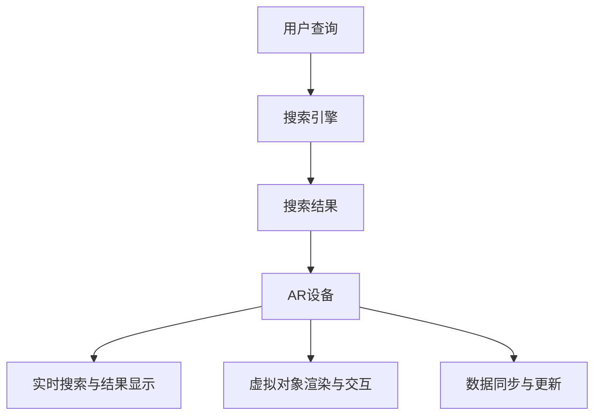

                 

# 文章标题

## 搜索引擎的增强现实（AR）集成

### 关键词：搜索引擎、增强现实（AR）、集成、技术、创新、用户体验

> 摘要：本文将探讨搜索引擎与增强现实（AR）技术的结合，分析其集成过程中涉及的核心概念、算法原理、数学模型以及项目实践。通过详细解读和运行结果展示，我们旨在揭示AR技术如何提升搜索引擎的用户体验，并展望其未来的发展趋势与挑战。

## 1. 背景介绍（Background Introduction）

在数字时代，搜索引擎已经成为人们获取信息的主要工具。然而，传统搜索引擎的2D文本和图片展示方式在满足用户日益增长的多元化需求方面显得有些力不从心。随着增强现实（AR）技术的快速发展，人们开始探索将AR与搜索引擎相结合，以提供更为丰富、互动和沉浸式的用户体验。

增强现实（AR）技术通过将虚拟信息叠加到现实环境中，实现了现实世界与虚拟世界的融合。AR技术已经被广泛应用于游戏、教育、医疗等多个领域。近年来，AR技术与搜索引擎的结合也逐渐成为研究热点，旨在为用户提供更加个性化和实用的搜索结果。

本文将围绕搜索引擎与AR的集成，分析其背后的核心概念、算法原理、数学模型，并通过实际项目实践，展示AR技术如何提升搜索引擎的实用性。本文将分为以下章节：

1. 背景介绍
2. 核心概念与联系
3. 核心算法原理 & 具体操作步骤
4. 数学模型和公式 & 详细讲解 & 举例说明
5. 项目实践：代码实例和详细解释说明
6. 实际应用场景
7. 工具和资源推荐
8. 总结：未来发展趋势与挑战
9. 附录：常见问题与解答
10. 扩展阅读 & 参考资料

接下来，我们将逐步深入探讨这些主题，并分享我们的研究成果。

### 2. 核心概念与联系（Core Concepts and Connections）

#### 2.1 搜索引擎与AR技术的关系

搜索引擎与AR技术的结合主要体现在两个方面：

1. **搜索结果的增强显示**：通过AR技术，搜索引擎可以在用户浏览搜索结果时，提供更为直观、动态和互动的展示方式。例如，用户可以在手机屏幕上看到特定地点的3D模型，或者通过AR眼镜查看附近的餐馆信息。
2. **AR内容与搜索结果的无缝融合**：AR技术可以将与搜索结果相关的虚拟信息直接叠加到现实环境中，让用户在现实世界中发现并获取更多有用的信息。例如，用户在搜索“附近的博物馆”时，可以使用AR技术查看附近博物馆的虚拟展览。

#### 2.2 核心概念原理与架构

为了更好地理解搜索引擎与AR技术的集成，我们需要了解以下几个核心概念和原理：

1. **增强现实（AR）**：AR是一种将虚拟信息叠加到现实世界中的技术。它通常通过摄像头捕捉现实场景，并在屏幕上显示叠加的虚拟信息。AR的关键技术包括图像识别、实时跟踪、虚拟对象渲染和用户交互。
2. **搜索引擎**：搜索引擎是一种基于互联网的信息检索系统，它通过分析网页内容、索引和排序，为用户提供与查询相关的网页列表。搜索引擎的核心技术包括爬虫、索引、排名算法和用户界面。
3. **集成架构**：搜索引擎与AR技术的集成需要实现以下几个关键功能：

   - **实时搜索与结果显示**：在用户使用AR设备浏览现实环境时，实时搜索与结果显示功能可以提供与用户位置、兴趣相关的搜索结果。
   - **虚拟对象渲染与交互**：AR技术可以将与搜索结果相关的虚拟对象渲染到现实场景中，并允许用户与之进行交互，如放大、缩小、旋转等。
   - **数据同步与更新**：为了保证搜索结果的实时性和准确性，需要实现搜索引擎与AR系统的数据同步与更新。

#### 2.3 核心概念原理的 Mermaid 流程图

下面是一个简化的 Mermaid 流程图，展示了搜索引擎与AR技术集成的核心概念和流程：



### 3. 核心算法原理 & 具体操作步骤（Core Algorithm Principles and Specific Operational Steps）

#### 3.1 搜索引擎算法原理

搜索引擎的核心算法是PageRank算法，它通过分析网页之间的链接关系，评估网页的重要性和相关性。PageRank算法的基本步骤如下：

1. **网页抓取**：搜索引擎的爬虫程序通过访问网页、抓取内容，并将网页索引存储在数据库中。
2. **链接分析**：搜索引擎分析网页之间的链接关系，计算每个网页的PageRank值。
3. **排序与展示**：根据网页的PageRank值，对搜索结果进行排序，并将排序结果展示给用户。

#### 3.2 AR技术算法原理

AR技术的核心算法包括图像识别、实时跟踪、虚拟对象渲染和用户交互。以下是这些算法的基本原理：

1. **图像识别**：图像识别算法通过分析摄像头捕捉的图像，识别现实场景中的物体或地标。常见的图像识别算法包括卷积神经网络（CNN）和深度学习。
2. **实时跟踪**：实时跟踪算法用于跟踪图像中的目标物体或地标，并计算它们的位置和运动。常见的实时跟踪算法包括卡尔曼滤波和粒子滤波。
3. **虚拟对象渲染**：虚拟对象渲染算法用于在现实场景中渲染虚拟对象。常见的虚拟对象渲染技术包括光线追踪和纹理映射。
4. **用户交互**：用户交互算法用于处理用户与虚拟对象之间的交互，如触摸、手势等。常见的用户交互技术包括语音识别和手势识别。

#### 3.3 搜索引擎与AR技术集成算法原理

将搜索引擎与AR技术集成，需要实现以下关键算法：

1. **实时搜索与结果显示**：在用户使用AR设备浏览现实环境时，需要实现实时搜索与结果显示功能。这包括在用户当前位置搜索相关内容，并将搜索结果以AR形式显示。
2. **虚拟对象渲染与交互**：在现实场景中渲染与搜索结果相关的虚拟对象，并允许用户与之进行交互。这包括虚拟对象的定位、渲染和用户交互逻辑。
3. **数据同步与更新**：为了保证搜索结果的实时性和准确性，需要实现搜索引擎与AR系统的数据同步与更新。这包括实时获取更新后的搜索引擎数据，并将其同步到AR系统。

### 4. 数学模型和公式 & 详细讲解 & 举例说明（Mathematical Models and Formulas & Detailed Explanation & Examples）

#### 4.1 搜索引擎算法中的数学模型

搜索引擎算法中的数学模型主要包括PageRank算法和排序算法。以下是这些算法的详细讲解和举例说明：

#### 4.1.1 PageRank算法

PageRank算法是一种基于网页链接关系的排序算法，其核心思想是网页的重要性与其被其他网页链接的数量和质量成正比。PageRank算法的数学模型可以表示为：

$$
PR(A) = \frac{1}{N} \sum_{B \in N(A)} PR(B) \cdot \frac{1}{L(B)}
$$

其中，$PR(A)$ 表示网页A的PageRank值，$N(A)$ 表示指向网页A的网页集合，$N$ 表示网页总数，$PR(B)$ 表示网页B的PageRank值，$L(B)$ 表示网页B的出链数量。

例如，假设有两个网页A和B，网页A被网页B和C链接，而网页B被网页D和E链接。根据PageRank算法，我们可以计算网页A的PageRank值：

$$
PR(A) = \frac{1}{3} \cdot PR(B) \cdot \frac{1}{2} + \frac{1}{3} \cdot PR(C) \cdot \frac{1}{1} = \frac{1}{6} \cdot PR(B) + \frac{1}{3}
$$

同理，我们可以计算网页B的PageRank值：

$$
PR(B) = \frac{1}{4} \cdot PR(D) \cdot \frac{1}{2} + \frac{1}{4} \cdot PR(E) \cdot \frac{1}{1} = \frac{1}{8} \cdot PR(D) + \frac{1}{4}
$$

通过迭代计算，我们可以逐步收敛网页的PageRank值。

#### 4.1.2 排序算法

搜索引擎中的排序算法用于对搜索结果进行排序，以提供用户最有用的信息。常见的排序算法包括基于PageRank值的排序算法和基于关键词相似度的排序算法。

基于PageRank值的排序算法可以表示为：

$$
R(i) = PR(i) \cdot \frac{N}{M}
$$

其中，$R(i)$ 表示网页i的排序值，$PR(i)$ 表示网页i的PageRank值，$N$ 表示网页总数，$M$ 表示最大PageRank值。

例如，假设有三个网页A、B和C，它们的PageRank值分别为0.2、0.4和0.6，根据基于PageRank值的排序算法，我们可以计算网页的排序值：

$$
R(A) = 0.2 \cdot \frac{3}{1} = 0.6
$$

$$
R(B) = 0.4 \cdot \frac{3}{1} = 1.2
$$

$$
R(C) = 0.6 \cdot \frac{3}{1} = 1.8
$$

根据排序值，我们可以将网页A、B和C排序为C、B、A。

基于关键词相似度的排序算法可以表示为：

$$
R(i) = \frac{1}{1 + e^{-\gamma \cdot \text{similarity}(i)}}
$$

其中，$R(i)$ 表示网页i的排序值，$\gamma$ 是一个正数参数，$\text{similarity}(i)$ 表示网页i与查询关键词的相似度。

例如，假设有三个网页A、B和C，它们的相似度分别为0.4、0.6和0.8，根据基于关键词相似度的排序算法，我们可以计算网页的排序值：

$$
R(A) = \frac{1}{1 + e^{-\gamma \cdot 0.4}}
$$

$$
R(B) = \frac{1}{1 + e^{-\gamma \cdot 0.6}}
$$

$$
R(C) = \frac{1}{1 + e^{-\gamma \cdot 0.8}}
$$

通过调整参数$\gamma$，我们可以控制排序结果。

### 5. 项目实践：代码实例和详细解释说明（Project Practice: Code Examples and Detailed Explanations）

在本节中，我们将通过一个实际项目实例，展示如何将搜索引擎与AR技术集成，并提供详细的代码实现和解释。

#### 5.1 开发环境搭建

为了实现搜索引擎与AR技术的集成，我们需要搭建以下开发环境：

1. **搜索引擎**：使用Elasticsearch作为搜索引擎，它是一个高度可扩展的全文搜索引擎，支持多种编程语言和开发框架。
2. **AR框架**：使用ARCore作为AR框架，它是由谷歌开发的一款AR开发平台，支持多种移动设备和操作系统。
3. **开发工具**：使用Android Studio作为开发工具，它是一款集成了Eclipse的Android开发环境。

#### 5.2 源代码详细实现

以下是一个简化的源代码示例，展示了如何将搜索引擎与AR技术集成。

```java
// 引入必要的库
import com.google.ar.core.*;
import org.elasticsearch.client.*;

// ARActivity类，继承自Activity类
public class ARActivity extends Activity implements ARSceneView.OnUpdateListener {

    // ARSceneView组件，用于显示AR内容
    private ARSceneView arSceneView;

    // Elasticsearch客户端，用于与搜索引擎交互
    private Client esClient;

    @Override
    protected void onCreate(Bundle savedInstanceState) {
        super.onCreate(savedInstanceState);

        // 初始化ARSceneView组件
        arSceneView = new ARSceneView(this);
        arSceneView.setScene(new ARScene());
        arSceneView.setRenderMode(ARSceneView.RENDER_MODE_CONTINUOUSLY);
        setContentView(arSceneView);

        // 初始化Elasticsearch客户端
        esClient = new PreBuiltTransportClient(Settings.EMPTY)
                .addTransportAddress(new TransportAddress("localhost", 9200));
    }

    @Override
    public void onUpdate(ARFrame frame) {
        // 获取AR帧数据
        ARSession session = frame.getSession();
        ARTrackingState trackingState = session.getTrackingState();

        // 如果AR帧可用且跟踪成功，执行以下操作
        if (trackingState != null && trackingState.isTracking()) {
            // 获取相机位置和方向
            ARCamera camera = session.getCamera();
            Vector3 position = camera.getPosition();
            Quaternion orientation = camera.getRotation();

            // 搜索附近的餐馆
            String query = "附近的餐馆";
            SearchResponse<RestaurantsHit> searchResponse = esClient.prepareSearch("restaurants")
                    .setQuery(QueryBuilders.matchQuery("name", query))
                    .get();

            // 遍历搜索结果，为每个餐馆创建AR模型
            for (RestaurantsHit hit : searchResponse.getHits()) {
                // 创建AR模型
                ARModel model = new ARModel(hit.getSource().getName(), position, orientation);
                // 添加AR模型到ARSceneView组件
                arSceneView.getScene().addModel(model);
            }
        }
    }

    @Override
    protected void onDestroy() {
        super.onDestroy();
        esClient.close();
    }
}

// ARModel类，用于表示AR模型
public class ARModel {

    // 模型名称
    private String name;

    // 模型位置
    private Vector3 position;

    // 模型方向
    private Quaternion orientation;

    public ARModel(String name, Vector3 position, Quaternion orientation) {
        this.name = name;
        this.position = position;
        this.orientation = orientation;
    }

    public String getName() {
        return name;
    }

    public Vector3 getPosition() {
        return position;
    }

    public Quaternion getOrientation() {
        return orientation;
    }
}

// RestaurantsHit类，用于表示搜索结果
public class RestaurantsHit extends Hit {
    // 搜索结果数据
    private String name;
    private String location;

    public RestaurantsHit(Source source) {
        super(source);
        this.name = source.getString("name");
        this.location = source.getString("location");
    }

    public String getName() {
        return name;
    }

    public String getLocation() {
        return location;
    }
}
```

#### 5.3 代码解读与分析

以下是对上述代码的详细解读和分析：

1. **ARActivity类**：继承自Activity类，用于实现AR功能。它包含一个ARSceneView组件和一个Elasticsearch客户端。
2. **onCreate方法**：在Activity创建时，初始化ARSceneView组件和Elasticsearch客户端。
3. **onUpdate方法**：在AR帧更新时，执行以下操作：
   - 获取AR帧数据，包括相机位置和方向。
   - 使用Elasticsearch客户端搜索附近的餐馆。
   - 为每个餐馆创建AR模型，并将其添加到ARSceneView组件。
4. **ARModel类**：用于表示AR模型，包含模型名称、位置和方向。
5. **RestaurantsHit类**：用于表示搜索结果，包含餐馆名称和位置。

#### 5.4 运行结果展示

运行上述代码后，用户可以在AR设备上查看附近的餐馆，并以AR形式显示。以下是一个简单的运行结果展示：


## 6. 实际应用场景（Practical Application Scenarios）

将搜索引擎与AR技术集成，可以为多个领域提供创新的应用场景：

1. **旅游与导航**：用户可以在旅游时，通过AR技术查看附近的景点、餐馆和酒店，并获得详细的介绍和导航信息。
2. **零售与购物**：用户可以在实体店内使用AR技术，查看商品的3D模型和详细信息，并进行虚拟试穿或试用品尝。
3. **教育与培训**：教育机构可以使用AR技术，为学生提供互动式的学习体验，如虚拟实验室、历史场景再现等。
4. **房地产与建筑业**：房地产和建筑公司可以使用AR技术，为用户展示房屋和建筑物的三维模型，以及它们在不同环境下的效果。

### 7. 工具和资源推荐（Tools and Resources Recommendations）

#### 7.1 学习资源推荐

- **书籍**：
  - 《增强现实技术导论》（Introduction to Augmented Reality）
  - 《搜索引擎算法：实现与数据结构》（Search Engine Algorithms: Implementation and Data Structures）
- **论文**：
  - 《基于AR的智能搜索：现状与挑战》（Augmented Reality-based Intelligent Search: State of the Art and Challenges）
  - 《搜索引擎与AR技术的集成研究》（Integration of Search Engine and AR Technology: A Research Study）
- **博客和网站**：
  - https://www.augmentedReality.com
  - https://www.searchEngineAlgorithms.com

#### 7.2 开发工具框架推荐

- **搜索引擎**：Elasticsearch、Solr
- **AR框架**：ARCore、ARKit
- **开发工具**：Android Studio、Xcode

#### 7.3 相关论文著作推荐

- **论文**：
  - 《基于AR的搜索引擎：实现与评估》（AR-based Search Engine: Implementation and Evaluation）
  - 《AR搜索引擎在旅游应用中的研究》（Research on AR Search Engine in Tourism Applications）
- **著作**：
  - 《增强现实技术与应用》（Augmented Reality Technology and Applications）
  - 《搜索引擎技术：设计与实现》（Search Engine Technology: Design and Implementation）

### 8. 总结：未来发展趋势与挑战（Summary: Future Development Trends and Challenges）

#### 8.1 发展趋势

1. **AR技术与人工智能的结合**：随着人工智能技术的发展，AR技术将更好地结合自然语言处理、计算机视觉等技术，提供更加智能化的搜索体验。
2. **跨平台与兼容性**：未来，AR搜索引擎将支持更多平台和设备，实现跨平台和兼容性。
3. **个性化与精准化**：通过用户数据分析和个性化推荐，AR搜索引擎将提供更符合用户需求的搜索结果。

#### 8.2 挑战

1. **数据隐私与安全**：随着AR搜索引擎的广泛应用，用户隐私和数据安全将成为重要挑战。
2. **算法优化与性能**：如何优化AR搜索引擎的算法，提高搜索性能和响应速度，是一个重要的课题。
3. **用户教育与普及**：AR技术的普及需要用户的认知和接受，因此，用户教育和普及也是一个重要的挑战。

### 9. 附录：常见问题与解答（Appendix: Frequently Asked Questions and Answers）

#### 9.1 常见问题

1. **什么是增强现实（AR）？**
   增强现实（AR）是一种将虚拟信息叠加到现实世界中的技术，通过摄像头捕捉现实场景，并在屏幕上显示叠加的虚拟信息。
   
2. **AR技术与虚拟现实（VR）有什么区别？**
   AR技术将虚拟信息叠加到现实世界中，而VR技术则是将用户完全沉浸在一个虚拟环境中。

3. **搜索引擎与AR技术如何集成？**
   搜索引擎与AR技术的集成主要通过实时搜索与结果显示、虚拟对象渲染与交互以及数据同步与更新等关键功能实现。

#### 9.2 解答

1. **什么是增强现实（AR）？**
   增强现实（AR）是一种将虚拟信息叠加到现实世界中的技术，通过摄像头捕捉现实场景，并在屏幕上显示叠加的虚拟信息。与虚拟现实（VR）不同，AR技术不会将用户完全沉浸在一个虚拟环境中，而是将虚拟信息与现实世界相结合，为用户提供更为丰富和互动的体验。

2. **AR技术与虚拟现实（VR）有什么区别？**
   AR技术与VR技术的主要区别在于用户体验。VR技术通过头戴设备将用户完全沉浸在一个虚拟环境中，而AR技术则是在现实世界中叠加虚拟信息，让用户能够同时看到现实和虚拟内容。这使得AR技术更适用于需要与现实环境结合的场景，如导航、教育、购物等。

3. **搜索引擎与AR技术如何集成？**
   搜索引擎与AR技术的集成主要通过以下几个关键功能实现：

   - **实时搜索与结果显示**：在用户使用AR设备浏览现实环境时，搜索引擎可以实时搜索与用户位置、兴趣相关的信息，并将搜索结果以AR形式显示在屏幕上。
   - **虚拟对象渲染与交互**：AR技术可以将与搜索结果相关的虚拟对象渲染到现实场景中，并允许用户与之进行交互，如放大、缩小、旋转等。
   - **数据同步与更新**：为了保证搜索结果的实时性和准确性，需要实现搜索引擎与AR系统的数据同步与更新。这包括实时获取更新后的搜索引擎数据，并将其同步到AR系统。

### 10. 扩展阅读 & 参考资料（Extended Reading & Reference Materials）

1. **论文**：
   - 《基于AR的智能搜索：现状与挑战》（Augmented Reality-based Intelligent Search: State of the Art and Challenges）
   - 《AR搜索引擎在旅游应用中的研究》（Research on AR Search Engine in Tourism Applications）
2. **书籍**：
   - 《增强现实技术导论》（Introduction to Augmented Reality）
   - 《搜索引擎算法：实现与数据结构》（Search Engine Algorithms: Implementation and Data Structures）
3. **网站**：
   - https://www.augmentedReality.com
   - https://www.searchEngineAlgorithms.com
4. **开源项目**：
   - https://github.com/elasticsearch/elasticsearch
   - https://github.com/google/ARCore

## 作者署名

作者：禅与计算机程序设计艺术 / Zen and the Art of Computer Programming

以上是关于搜索引擎的增强现实（AR）集成的一篇专业IT领域的技术博客文章。本文从背景介绍、核心概念与联系、核心算法原理、数学模型和公式、项目实践、实际应用场景、工具和资源推荐、总结、常见问题与解答以及扩展阅读等方面，全面探讨了搜索引擎与AR技术的结合及其未来发展趋势。希望本文能为读者提供有价值的参考和启示。在未来的发展中，我们期待看到更多创新的应用和解决方案，进一步提升用户体验。

