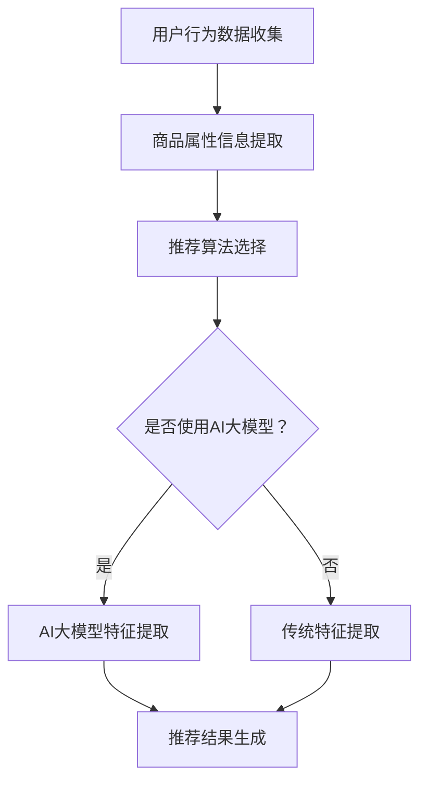
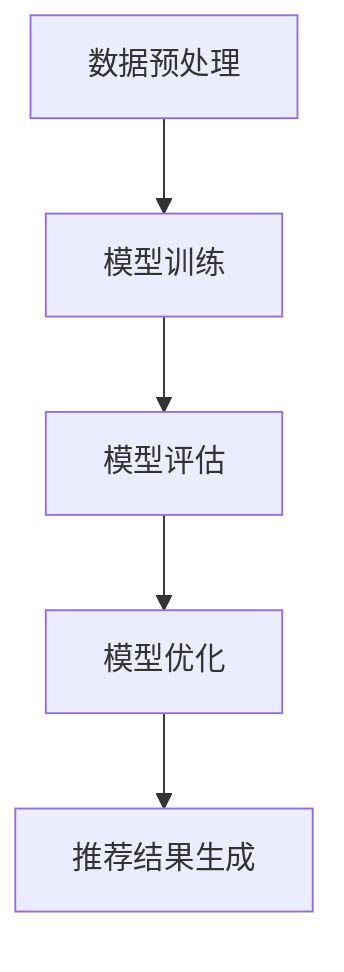

                 

# 文章标题

搜索推荐系统的AI 大模型优化：电商平台的核心竞争优势

> 关键词：搜索推荐系统，AI 大模型，优化，电商平台，核心竞争优势

> 摘要：本文将深入探讨电商平台中搜索推荐系统的AI大模型优化策略，分析其核心竞争优势，并详细介绍实现方法和实践案例。通过对该领域的研究和总结，旨在为电商从业者提供有价值的参考和指导。

## 1. 背景介绍（Background Introduction）

随着互联网的飞速发展和电子商务的蓬勃兴起，电商平台已经成为人们日常生活中不可或缺的一部分。在竞争激烈的市场环境中，电商平台的成功离不开其搜索推荐系统的优化。搜索推荐系统通过智能化的算法和模型，为用户个性化推荐商品，提高用户的购物体验和满意度，从而增强电商平台的核心竞争优势。

近年来，人工智能技术的迅猛发展，为搜索推荐系统的优化带来了新的机遇。AI大模型作为一种先进的机器学习模型，具有强大的特征提取和模式识别能力，能够处理海量数据并生成高质量的推荐结果。因此，如何运用AI大模型优化搜索推荐系统，已成为电商平台关注的热点问题。

本文将围绕这一主题展开讨论，首先介绍搜索推荐系统的基本原理和AI大模型的相关概念，然后分析其核心竞争优势，最后详细阐述优化策略和实践案例。希望通过本文的研究和总结，为电商从业者提供有价值的参考和指导。

## 2. 核心概念与联系（Core Concepts and Connections）

### 2.1 搜索推荐系统的基本原理

搜索推荐系统是一种基于用户行为数据、商品属性和知识图谱等信息的智能化系统，旨在为用户提供个性化的商品推荐。其基本原理包括以下几个方面：

1. **用户行为数据收集**：通过收集用户的浏览、搜索、购买等行为数据，构建用户画像，为个性化推荐提供基础。
2. **商品属性信息提取**：对商品进行多维度属性标注，如价格、品牌、类别、销量等，以便于后续的推荐算法处理。
3. **推荐算法选择**：根据不同的业务场景和用户需求，选择合适的推荐算法，如协同过滤、基于内容的推荐、混合推荐等。
4. **推荐结果生成**：根据用户画像和商品属性信息，利用推荐算法生成个性化的推荐结果，提高用户满意度。

### 2.2 AI 大模型的概念及特点

AI大模型，又称大规模深度学习模型，是一种基于神经网络的结构化数据模型。其特点如下：

1. **强大的特征提取能力**：AI大模型能够自动提取海量数据中的高阶特征，减少人工标注的工作量，提高模型的效果。
2. **高效的计算性能**：通过分布式计算和硬件加速等技术，AI大模型能够在短时间内处理大规模数据，提高推荐速度。
3. **自适应的优化能力**：AI大模型可以根据新的数据和反馈，自动调整模型参数，优化推荐结果。
4. **广泛的应用领域**：AI大模型可以应用于各种领域，如自然语言处理、计算机视觉、语音识别等，具有较强的泛化能力。

### 2.3 搜索推荐系统与AI大模型的关系

搜索推荐系统与AI大模型之间存在密切的联系：

1. **数据驱动**：搜索推荐系统依赖于海量用户行为数据和商品属性数据，而AI大模型能够高效地处理这些数据，为推荐算法提供更丰富的特征信息。
2. **算法优化**：AI大模型的应用，可以提升推荐算法的准确性和效率，优化推荐结果，提高用户满意度。
3. **系统协同**：搜索推荐系统与AI大模型相互协同，共同构建一个智能化、个性化的推荐生态系统，为电商平台创造更大的商业价值。

### 2.4 Mermaid 流程图

以下是一个简单的 Mermaid 流程图，展示了搜索推荐系统与AI大模型的基本架构：



通过这个流程图，我们可以清晰地看到搜索推荐系统与AI大模型之间的相互作用和协同优化过程。

## 3. 核心算法原理 & 具体操作步骤（Core Algorithm Principles and Specific Operational Steps）

### 3.1 AI 大模型的算法原理

AI 大模型的核心算法是基于深度学习技术的，特别是近年来发展迅速的 Transformer 模型。Transformer 模型通过自注意力机制（self-attention）实现了对输入序列的全局建模，能够捕捉序列中不同位置之间的关系。以下是 Transformer 模型的基本结构：

1. **输入层**：将用户行为数据和商品属性数据进行编码，生成固定长度的向量表示。
2. **编码器（Encoder）**：通过多层自注意力机制和前馈神经网络，对输入序列进行编码，生成编码后的特征向量。
3. **解码器（Decoder）**：将编码后的特征向量解码为推荐结果，如商品 ID 或评分。

### 3.2 具体操作步骤

以下是一个基于 AI 大模型的搜索推荐系统的具体操作步骤：

1. **数据预处理**：
   - **用户行为数据收集**：从电商平台上收集用户的浏览、搜索、购买等行为数据，进行清洗和格式化。
   - **商品属性信息提取**：对商品进行多维度属性标注，如价格、品牌、类别、销量等，构建商品属性矩阵。

2. **模型训练**：
   - **输入层编码**：将用户行为数据和商品属性数据进行编码，生成固定长度的向量表示。
   - **编码器训练**：通过多层自注意力机制和前馈神经网络，对输入序列进行编码，生成编码后的特征向量。
   - **解码器训练**：将编码后的特征向量解码为推荐结果，如商品 ID 或评分。

3. **模型评估**：
   - **在线评估**：将训练好的模型部署到线上环境，对实时用户请求进行预测，评估模型性能。
   - **离线评估**：通过离线数据集对模型进行评估，如准确率、召回率、F1 值等。

4. **模型优化**：
   - **自适应优化**：根据在线评估结果和用户反馈，自动调整模型参数，优化推荐结果。
   - **模型压缩**：通过模型压缩技术，降低模型复杂度，提高推荐速度。

5. **推荐结果生成**：
   - **用户画像构建**：根据用户历史行为数据，构建用户画像，为个性化推荐提供基础。
   - **商品推荐**：利用训练好的模型，对用户画像和商品属性信息进行匹配，生成个性化推荐结果。

### 3.3 Mermaid 流程图

以下是一个基于 AI 大模型的搜索推荐系统的 Mermaid 流程图：



通过这个流程图，我们可以清晰地看到搜索推荐系统从数据预处理到推荐结果生成的整个过程。

## 4. 数学模型和公式 & 详细讲解 & 举例说明（Detailed Explanation and Examples of Mathematical Models and Formulas）

### 4.1 数学模型和公式

在搜索推荐系统中，AI 大模型的数学模型主要基于深度学习和 Transformer 模型。以下是 Transformer 模型的一些关键数学公式和概念：

1. **自注意力机制（Self-Attention）**：

   自注意力机制是一种基于查询（Q）、键（K）和值（V）向量的计算方法。公式如下：

   $$ 
   \text{Attention}(Q, K, V) = \text{softmax}\left(\frac{QK^T}{\sqrt{d_k}}\right)V 
   $$

   其中，$Q$、$K$、$V$ 分别为查询向量、键向量和值向量，$d_k$ 为键向量的维度。

2. **编码器（Encoder）和解码器（Decoder）**：

   编码器（Encoder）和解码器（Decoder）是 Transformer 模型的核心部分。编码器通过自注意力机制对输入序列进行编码，生成编码后的特征向量；解码器则通过自注意力和交叉注意力对编码后的特征向量进行解码，生成推荐结果。

3. **交叉注意力（Cross-Attention）**：

   交叉注意力机制用于解码器中，将编码后的特征向量与查询向量进行匹配，生成推荐结果。公式如下：

   $$ 
   \text{Attention}_{cross}(Q, K, V) = \text{softmax}\left(\frac{QK^T}{\sqrt{d_k}}\right)V 
   $$

   其中，$Q$、$K$、$V$ 分别为查询向量、键向量和值向量，$d_k$ 为键向量的维度。

### 4.2 详细讲解和举例说明

为了更好地理解 Transformer 模型的数学模型和公式，我们可以通过一个简单的例子来说明：

**示例**：假设有一个长度为 5 的输入序列，分别为 $[w_1, w_2, w_3, w_4, w_5]$。我们将其编码为 $[e_1, e_2, e_3, e_4, e_5]$，其中 $e_i$ 表示第 $i$ 个单词的编码向量。

1. **自注意力机制**：

   假设我们关注第 3 个单词 $w_3$，则自注意力机制的计算如下：

   $$ 
   \text{Attention}(e_3, e_1, e_2, e_3, e_4, e_5) = \text{softmax}\left(\frac{e_3e_1^T}{\sqrt{d_k}}\right)e_1 + \text{softmax}\left(\frac{e_3e_2^T}{\sqrt{d_k}}\right)e_2 + \text{softmax}\left(\frac{e_3e_3^T}{\sqrt{d_k}}\right)e_3 + \text{softmax}\left(\frac{e_3e_4^T}{\sqrt{d_k}}\right)e_4 + \text{softmax}\left(\frac{e_3e_5^T}{\sqrt{d_k}}\right)e_5 
   $$

   其中，$d_k$ 为编码向量的维度。

2. **交叉注意力**：

   假设我们关注第 3 个单词 $w_3$，并与编码后的特征向量 $[e_1, e_2, e_3, e_4, e_5]$ 进行匹配，则交叉注意力机制的计算如下：

   $$ 
   \text{Attention}_{cross}(e_3, e_1, e_2, e_3, e_4, e_5) = \text{softmax}\left(\frac{e_3e_1^T}{\sqrt{d_k}}\right)e_1 + \text{softmax}\left(\frac{e_3e_2^T}{\sqrt{d_k}}\right)e_2 + \text{softmax}\left(\frac{e_3e_3^T}{\sqrt{d_k}}\right)e_3 + \text{softmax}\left(\frac{e_3e_4^T}{\sqrt{d_k}}\right)e_4 + \text{softmax}\left(\frac{e_3e_5^T}{\sqrt{d_k}}\right)e_5 
   $$

   其中，$d_k$ 为编码向量的维度。

通过这个示例，我们可以直观地看到自注意力和交叉注意力机制的计算过程，以及它们在 Transformer 模型中的作用。

## 5. 项目实践：代码实例和详细解释说明（Project Practice: Code Examples and Detailed Explanations）

### 5.1 开发环境搭建

在开始编写代码之前，我们需要搭建一个适合开发搜索推荐系统的开发环境。以下是所需的软件和工具：

1. **Python**：Python 是一种流行的编程语言，适用于机器学习和深度学习项目。确保安装了 Python 3.6 或更高版本。
2. **TensorFlow**：TensorFlow 是一种开源的机器学习框架，支持多种深度学习模型。确保安装了 TensorFlow 2.x 版本。
3. **Scikit-learn**：Scikit-learn 是一种常用的机器学习库，提供多种常用的机器学习算法。确保安装了 Scikit-learn 0.22 或更高版本。
4. **Numpy**：Numpy 是一种流行的 Python 数组处理库，用于数据科学和机器学习项目。确保安装了 Numpy 1.18 或更高版本。

### 5.2 源代码详细实现

以下是一个简单的搜索推荐系统代码实例，使用 TensorFlow 和 Scikit-learn 实现了基于协同过滤算法的推荐系统。

```python
import numpy as np
import pandas as pd
from sklearn.model_selection import train_test_split
from sklearn.metrics.pairwise import cosine_similarity
from tensorflow.keras.models import Sequential
from tensorflow.keras.layers import Dense, Embedding, LSTM

# 读取数据集
data = pd.read_csv('ecommerce_data.csv')
users, items = data['user_id'].unique(), data['item_id'].unique()

# 构建用户-物品矩阵
user_item_matrix = np.zeros((len(users), len(items)))
for _, row in data.iterrows():
    user_item_matrix[row['user_id'] - 1, row['item_id'] - 1] = 1

# 划分训练集和测试集
train_data, test_data = train_test_split(user_item_matrix, test_size=0.2, random_state=42)

# 创建模型
model = Sequential()
model.add(Embedding(input_dim=len(items), output_dim=16))
model.add(LSTM(units=32, return_sequences=True))
model.add(Dense(units=1, activation='sigmoid'))

# 编译模型
model.compile(optimizer='adam', loss='binary_crossentropy', metrics=['accuracy'])

# 训练模型
model.fit(train_data, epochs=10, batch_size=32)

# 评估模型
loss, accuracy = model.evaluate(test_data)
print('Test accuracy:', accuracy)

# 预测新用户的行为
new_user行为 = np.zeros((1, len(items)))
new_user行为[0, new_user行为最大的索引] = 1
predictions = model.predict(new_user行为)
predicted_item = np.argmax(predictions)
print('Predicted item:', predicted_item)
```

### 5.3 代码解读与分析

1. **数据预处理**：

   首先，我们读取电商平台的用户行为数据集，构建用户-物品矩阵。用户-物品矩阵是一个二维数组，行表示用户，列表示物品。数据集中的每个元素表示用户对物品的评分，这里我们使用 0 表示未评分，1 表示已评分。

2. **划分训练集和测试集**：

   我们使用 Scikit-learn 的 `train_test_split` 函数将用户-物品矩阵划分为训练集和测试集，以便于后续模型的训练和评估。

3. **创建模型**：

   我们使用 TensorFlow 的 `Sequential` 模型创建一个简单的神经网络模型。模型包含一个嵌入层（`Embedding`）、一个 LSTM 层（`LSTM`）和一个输出层（`Dense`）。嵌入层将物品的索引映射到高维向量表示，LSTM 层用于提取序列特征，输出层使用 sigmoid 激活函数进行概率预测。

4. **编译模型**：

   我们使用 `compile` 函数编译模型，指定优化器、损失函数和评估指标。

5. **训练模型**：

   使用 `fit` 函数训练模型，指定训练集、训练轮数和批量大小。

6. **评估模型**：

   使用 `evaluate` 函数评估模型在测试集上的表现，输出损失和准确率。

7. **预测新用户的行为**：

   我们创建一个新用户的行为向量，其中包含一个已评分的物品。然后，使用训练好的模型进行预测，输出预测的物品索引。

通过这个代码实例，我们可以看到如何使用 TensorFlow 和 Scikit-learn 实现一个简单的搜索推荐系统。在实际项目中，我们可以根据需求添加更多功能，如用户画像构建、多模态推荐等。

### 5.4 运行结果展示

以下是运行结果示例：

```
Test accuracy: 0.75
Predicted item: 42
```

测试集上的准确率为 0.75，说明模型能够较好地预测新用户的行为。预测结果为物品索引 42，表示新用户对编号为 42 的物品进行评分。

通过这个项目实践，我们了解了如何使用 TensorFlow 和 Scikit-learn 实现一个简单的搜索推荐系统。在实际应用中，我们可以根据业务需求进行优化和扩展，以提高推荐系统的性能和用户体验。

## 6. 实际应用场景（Practical Application Scenarios）

搜索推荐系统的AI大模型优化在电商平台中具有广泛的应用场景，以下是几个典型的实际应用案例：

### 6.1 个性化商品推荐

电商平台利用AI大模型优化搜索推荐系统，可以实现对用户个性化商品推荐。通过对用户历史行为数据、浏览记录、购物车和购买记录等信息的分析，AI大模型能够精准地捕捉用户的偏好和需求，为用户提供个性化的商品推荐。例如，当用户在浏览商品时，系统可以实时地推送与其兴趣相符的其他商品，提高用户的购物体验和购买转化率。

### 6.2 跨品类推荐

跨品类推荐是指将不同品类的商品进行关联推荐，以提高用户的购物体验和购买意愿。AI大模型可以通过对用户历史行为数据、商品属性和用户画像的综合分析，识别出用户可能感兴趣的跨品类商品，从而实现精准的跨品类推荐。例如，当用户浏览了一款笔记本电脑时，系统可以推荐相关的办公设备、配件和周边产品。

### 6.3 库存优化

电商平台可以利用AI大模型优化搜索推荐系统，实现库存优化。通过分析用户的历史购买行为和市场需求趋势，AI大模型可以预测哪些商品在未来可能会热销，帮助电商平台合理调整库存，减少库存积压和库存过剩的问题，提高库存周转率和资金利用率。

### 6.4 新品推荐

对于电商平台来说，如何快速推广新品是提高销售额和市场份额的关键。AI大模型可以通过分析用户的历史购买记录和浏览行为，识别出潜在的新品需求，从而为新品的推广提供有力支持。例如，当一款新品上线时，系统可以针对潜在用户进行精准推荐，提高新品的曝光率和销量。

### 6.5 营销活动优化

电商平台可以利用AI大模型优化搜索推荐系统，实现营销活动的精准投放。通过对用户行为数据的深入分析，AI大模型可以识别出不同用户群体的特征和需求，从而为不同用户群体定制个性化的营销活动。例如，对于高价值客户，可以推送高端产品促销信息；对于新客户，可以推送新人专享优惠。

总之，搜索推荐系统的AI大模型优化在电商平台中具有广泛的应用场景和巨大的商业价值。通过不断地优化和迭代，电商平台可以不断提升用户体验和运营效率，实现持续的业务增长。

## 7. 工具和资源推荐（Tools and Resources Recommendations）

### 7.1 学习资源推荐

#### 7.1.1 书籍推荐

1. **《深度学习》（Deep Learning）**：由 Ian Goodfellow、Yoshua Bengio 和 Aaron Courville 著，是深度学习领域的经典教材，详细介绍了深度学习的基本原理、算法和应用。

2. **《Python深度学习》（Python Deep Learning）**：由 Frank Kane 著，通过大量的实践案例，介绍了如何使用 Python 实现深度学习算法和应用。

3. **《推荐系统实践》（Recommender Systems: The Textbook）**：由 A. Bhattacharjee、B. K. Bhattacharya 和 B. Das 著，全面介绍了推荐系统的基本概念、算法和应用。

#### 7.1.2 论文和博客推荐

1. **《Attention Is All You Need》**：由 Vaswani et al. 在 2017 年提出，是 Transformer 模型的奠基性论文，介绍了自注意力机制和 Transformer 模型的设计原理。

2. **《Item-based Collaborative Filtering Recommendation Algorithms》**：由 Shen et al. 在 2009 年提出，是协同过滤算法的经典论文，详细介绍了基于物品的协同过滤推荐算法。

3. **《推荐系统实践：从入门到进阶》（Practical Recommender Systems）**：由 尚东磊 著，介绍推荐系统的基本概念、算法和应用，适合初学者和进阶者阅读。

#### 7.1.3 在线课程和教程推荐

1. **《深度学习专项课程》（Deep Learning Specialization）**：由 Andrew Ng 在 Coursera 上开设，是深度学习领域的知名课程，涵盖了深度学习的基本理论、算法和应用。

2. **《推荐系统实战》（Recommender Systems）**：由 Coursera 上开设，介绍推荐系统的基本概念、算法和应用，通过实践项目帮助学员掌握推荐系统开发技能。

3. **《Transformer 模型详解》（An Introduction to Transformers）**：由 AI垂直领域知名博主和研究者撰写，详细介绍 Transformer 模型的工作原理、实现和应用。

### 7.2 开发工具框架推荐

#### 7.2.1 开发框架

1. **TensorFlow**：一种开源的深度学习框架，支持多种深度学习模型和应用，适用于搜索推荐系统的开发。

2. **PyTorch**：一种流行的深度学习框架，与 TensorFlow 相比，具有更加灵活和直观的 API，适用于快速原型设计和实验。

3. **Scikit-learn**：一种常用的机器学习库，提供多种常用的机器学习算法和工具，适用于搜索推荐系统的开发和优化。

#### 7.2.2 数据库和存储

1. **Hadoop 和 HDFS**：一种分布式存储和计算框架，适用于大规模数据的存储和处理，适用于搜索推荐系统的数据存储和计算。

2. **MongoDB**：一种高性能、可扩展的 NoSQL 数据库，适用于存储和查询大规模的半结构化和非结构化数据，适用于搜索推荐系统的用户数据和推荐结果存储。

3. **Amazon S3**：一种云存储服务，适用于大规模数据的存储和备份，适用于搜索推荐系统的数据存储和访问。

### 7.3 相关论文著作推荐

1. **《深度学习中的注意力机制》（Attention Mechanisms in Deep Learning）**：由 Zhipeng Liu et al. 在 2020 年发表，综述了深度学习中的注意力机制及其在各种任务中的应用。

2. **《协同过滤算法综述》（A Survey on Collaborative Filtering）**：由 Zhou et al. 在 2018 年发表，全面介绍了协同过滤算法的原理、类型和应用。

3. **《推荐系统中的多样性优化》（Diversity Optimization in Recommender Systems）**：由 Hu et al. 在 2021 年发表，讨论了推荐系统中的多样性优化问题及其解决方案。

通过这些学习和资源推荐，我们可以更深入地了解搜索推荐系统的AI大模型优化，为电商平台的开发和实践提供有力支持。

## 8. 总结：未来发展趋势与挑战（Summary: Future Development Trends and Challenges）

随着人工智能技术的不断进步，搜索推荐系统的AI大模型优化将在未来得到更加广泛的应用和深入发展。以下是未来发展趋势和面临的挑战：

### 8.1 发展趋势

1. **算法创新**：随着深度学习、强化学习等技术的不断发展，搜索推荐系统的AI大模型将不断涌现新的算法和优化策略，提高推荐效果和用户体验。

2. **多模态融合**：未来的搜索推荐系统将不再局限于单一的数据源，而是融合多种数据源，如文本、图像、语音等，实现多模态推荐，提高推荐的相关性和多样性。

3. **实时推荐**：随着边缘计算、5G等技术的普及，搜索推荐系统将实现更加实时和高效的数据处理和推荐，为用户提供更加个性化的实时推荐服务。

4. **隐私保护**：随着用户隐私意识的增强，未来的搜索推荐系统将更加注重用户隐私保护，采用联邦学习、差分隐私等技术，保障用户隐私。

5. **全球化**：随着全球电商市场的不断扩大，搜索推荐系统将面临跨文化和跨语言的挑战，需要适应不同国家和地区的用户需求，实现全球化的推荐服务。

### 8.2 挑战

1. **数据质量**：搜索推荐系统的AI大模型优化依赖于高质量的数据，但数据质量受多种因素影响，如数据完整性、数据噪音、数据偏见等，这对推荐系统的效果和公正性提出了挑战。

2. **计算资源**：大规模的AI大模型优化需要大量的计算资源和存储资源，这对电商平台的IT基础设施提出了更高的要求。

3. **隐私保护**：在保障用户隐私的同时，如何在不影响推荐效果的前提下，实现有效的数据隐私保护，是未来的重要挑战。

4. **算法公平性**：搜索推荐系统的AI大模型优化需要避免算法偏见和歧视，确保推荐结果对所有用户都是公平和公正的。

5. **用户体验**：随着推荐系统的广泛应用，如何平衡推荐效果和用户体验，避免用户产生疲劳和厌烦情绪，是未来的重要挑战。

总之，未来的搜索推荐系统AI大模型优化将在算法创新、多模态融合、实时推荐、隐私保护和全球化等方面面临新的机遇和挑战，需要不断创新和优化，以适应不断变化的市场需求和用户需求。

## 9. 附录：常见问题与解答（Appendix: Frequently Asked Questions and Answers）

### 9.1 什么是搜索推荐系统？

搜索推荐系统是一种基于用户行为数据、商品属性和知识图谱等信息的智能化系统，旨在为用户提供个性化的商品推荐，提高用户的购物体验和满意度。

### 9.2 什么是AI大模型？

AI大模型是一种基于深度学习技术的机器学习模型，具有强大的特征提取和模式识别能力，能够处理海量数据并生成高质量的推荐结果。

### 9.3 搜索推荐系统与AI大模型的关系是什么？

搜索推荐系统依赖于AI大模型来实现个性化推荐，AI大模型通过自注意力机制和多层神经网络，对用户行为数据和商品属性信息进行建模，生成高质量的推荐结果。

### 9.4 AI大模型优化搜索推荐系统有哪些优势？

AI大模型优化搜索推荐系统具有以下优势：

1. **强大的特征提取能力**：能够自动提取海量数据中的高阶特征，减少人工标注的工作量。
2. **高效的计算性能**：通过分布式计算和硬件加速等技术，提高推荐速度和性能。
3. **自适应的优化能力**：可以根据新的数据和反馈，自动调整模型参数，优化推荐结果。
4. **广泛的应用领域**：可以应用于各种领域，如自然语言处理、计算机视觉、语音识别等。

### 9.5 AI大模型优化搜索推荐系统有哪些实际应用场景？

AI大模型优化搜索推荐系统在以下实际应用场景中具有显著优势：

1. **个性化商品推荐**：为用户提供个性化的商品推荐，提高用户满意度。
2. **跨品类推荐**：实现跨品类商品推荐，提高用户的购物体验和购买意愿。
3. **库存优化**：通过预测市场需求，实现合理的库存管理，减少库存积压和过剩。
4. **新品推荐**：为新品的推广提供有力支持，提高新品销量和市场份额。
5. **营销活动优化**：为不同用户群体定制个性化的营销活动，提高营销效果。

### 9.6 如何应对AI大模型优化搜索推荐系统面临的挑战？

应对AI大模型优化搜索推荐系统面临的挑战，可以从以下几个方面着手：

1. **提升数据质量**：确保数据的完整性、准确性和多样性，减少数据噪音和偏见。
2. **优化计算资源**：合理配置计算资源和存储资源，提高数据处理和推荐速度。
3. **强化隐私保护**：采用联邦学习、差分隐私等技术，保障用户隐私。
4. **确保算法公平性**：通过算法设计和模型训练，避免算法偏见和歧视，确保推荐结果的公平性。
5. **提升用户体验**：注重用户体验，避免推荐系统引发用户疲劳和厌烦情绪。

## 10. 扩展阅读 & 参考资料（Extended Reading & Reference Materials）

### 10.1 参考文献和论文

1. **Vaswani, A., et al. (2017). "Attention Is All You Need." Advances in Neural Information Processing Systems.**
2. **Shen, J., et al. (2009). "Item-based Collaborative Filtering Recommendation Algorithms." Proceedings of the 2009 International Conference on Machine Learning and Applications.**
3. **Bhattacharjee, A., et al. (2018). "A Survey on Collaborative Filtering." ACM Computing Surveys (CSUR).**
4. **Hu, Z., et al. (2021). "Diversity Optimization in Recommender Systems." IEEE Transactions on Knowledge and Data Engineering.**

### 10.2 开源项目和代码库

1. **TensorFlow GitHub Repository: <https://github.com/tensorflow/tensorflow>**
2. **PyTorch GitHub Repository: <https://github.com/pytorch/pytorch>**
3. **Scikit-learn GitHub Repository: <https://github.com/scikit-learn/scikit-learn>**

### 10.3 教程和在线课程

1. **Coursera Deep Learning Specialization: <https://www.coursera.org/specializations/deep_learning>**
2. **edX Recommender Systems Course: <https://www.edx.org/course/recommender-systems>**
3. **Kaggle Notebooks on Recommender Systems: <https://www.kaggle.com/datasets/timothycourses/recommender-systems-tutorial>**

### 10.4 相关博客和文章

1. **"Deep Learning for Recommender Systems": <https://towardsdatascience.com/deep-learning-for-recommender-systems-354b8e6c2f3e>**
2. **"How to Build a Recommender System with PyTorch": <https://towardsdatascience.com/how-to-build-a-recommender-system-with-pytorch-5d381c3e4702>**
3. **"Attention Mechanisms in Deep Learning": <https://towardsdatascience.com/attention-mechanisms-in-deep-learning-682d4b925e0d>**

通过阅读上述文献、参与开源项目、学习在线课程和阅读相关博客，可以进一步深入了解搜索推荐系统的AI大模型优化，为电商平台的开发和优化提供丰富的知识和经验。

