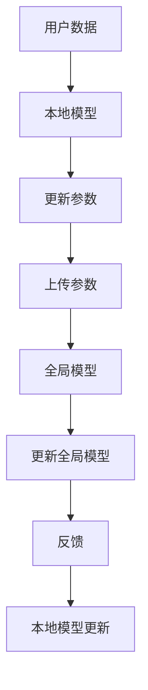

                 

### 文章标题：搜索推荐系统的隐私保护：大模型的联邦学习方案

#### 关键词：（搜索推荐系统，隐私保护，大模型，联邦学习）

> 摘要：本文深入探讨了在搜索推荐系统中如何通过联邦学习机制来保护用户隐私。首先，我们介绍了搜索推荐系统的基本概念及其面临的隐私保护挑战。随后，详细解释了联邦学习的工作原理和优势，并展示了一个基于大模型的联邦学习方案。本文还通过数学模型和具体代码实例，详细阐述了联邦学习的实现步骤，并提供了一些实际应用场景和工具资源推荐。

## 1. 背景介绍（Background Introduction）

### 1.1 搜索推荐系统简介

搜索推荐系统是现代互联网技术中的一项重要应用，旨在根据用户的搜索历史、浏览行为和偏好，向用户推荐相关的信息、商品或内容。其核心目标是提升用户体验、增加用户粘性，并最终促进商业价值的提升。常见的搜索推荐系统包括电子商务平台、社交媒体、新闻网站和视频平台等。

### 1.2 隐私保护的重要性

随着互联网技术的快速发展，用户的数据隐私问题日益突出。在搜索推荐系统中，用户的数据通常包括搜索关键词、浏览历史、购买记录等敏感信息。这些数据如果未经保护，可能会被不法分子利用，导致用户隐私泄露、数据滥用等问题。因此，如何保护用户隐私成为搜索推荐系统亟需解决的问题。

### 1.3 面临的隐私保护挑战

- **数据泄露风险**：用户数据在传输、存储和处理过程中，可能面临数据泄露的风险。
- **数据集中化**：传统的集中式推荐系统将用户数据集中存储和处理，容易导致数据泄露和安全漏洞。
- **个性化推荐**：为了提供高质量的个性化推荐，推荐系统需要收集和处理大量用户数据，这可能引发隐私保护与用户体验的权衡问题。

## 2. 核心概念与联系（Core Concepts and Connections）

### 2.1 联邦学习的定义和原理

联邦学习（Federated Learning）是一种分布式机器学习技术，其核心思想是多个参与者（例如不同的设备或组织）协同训练一个共享的模型，同时保持各自的数据本地化。在联邦学习中，模型参数在各个参与者之间进行传输和更新，但数据不会离开本地设备或组织。

### 2.2 联邦学习的优势

- **隐私保护**：联邦学习通过数据本地化，避免了数据集中存储和处理，从而降低了数据泄露风险。
- **去中心化**：联邦学习使得多个参与者可以协同训练模型，而不需要依赖中心化的服务器，增强了系统的鲁棒性和容错性。
- **数据安全**：联邦学习通过加密和差分隐私等技术，确保数据在传输和存储过程中的安全性。

### 2.3 大模型在联邦学习中的应用

大模型（Large Models）如深度神经网络、Transformer等，具有强大的表示和学习能力。在联邦学习中，大模型可以更好地捕捉数据中的复杂模式和规律，从而提高推荐系统的效果。同时，大模型的引入也带来了一些挑战，如计算资源消耗、通信成本等。

### 2.4 Mermaid 流程图



## 3. 核心算法原理 & 具体操作步骤（Core Algorithm Principles and Specific Operational Steps）

### 3.1 联邦学习算法的基本步骤

1. **初始化全局模型**：在一个中心服务器上初始化全局模型，并将模型参数发送给各个参与者。
2. **本地模型训练**：各个参与者使用本地数据训练本地模型，同时更新模型参数。
3. **参数聚合**：中心服务器收集各个参与者的模型参数，进行聚合更新全局模型。
4. **模型更新**：中心服务器将更新后的全局模型参数发送给各个参与者，参与者使用新参数更新本地模型。
5. **重复步骤 2-4**：不断重复步骤 2-4，直到模型收敛或满足停止条件。

### 3.2 大模型在联邦学习中的应用

在联邦学习中应用大模型，通常采用以下策略：

1. **梯度裁剪**：为了避免模型参数过大导致的计算和通信成本增加，可以对梯度进行裁剪。
2. **分布式计算**：将模型分解为多个子模型，并在各个参与者之间进行分布式训练。
3. **异步通信**：允许参与者以异步方式更新参数，减少通信延迟和带宽需求。

### 3.3 实际操作步骤

1. **初始化全局模型**：选择一个预训练的大模型，如BERT或GPT，初始化全局模型。
2. **本地模型训练**：各个参与者使用本地数据训练本地模型，同时记录模型参数的梯度。
3. **参数聚合**：中心服务器收集各个参与者的模型参数梯度，进行聚合更新全局模型。
4. **模型更新**：中心服务器将更新后的全局模型参数发送给各个参与者，参与者使用新参数更新本地模型。
5. **评估与调整**：评估全局模型的性能，根据评估结果调整模型参数或停止训练。

## 4. 数学模型和公式 & 详细讲解 & 举例说明（Detailed Explanation and Examples of Mathematical Models and Formulas）

### 4.1 梯度聚合

在联邦学习中，梯度聚合是关键步骤之一。假设有 \(N\) 个参与者，每个参与者拥有本地数据集 \(D_i\) 和本地模型 \(M_i\)，则全局模型的梯度 \(g\) 可以通过以下公式计算：

$$
g = \frac{1}{N} \sum_{i=1}^{N} \nabla_{\theta} L(M_i; D_i)
$$

其中，\(L(M_i; D_i)\) 表示本地模型的损失函数，\(\theta\) 表示全局模型参数。

### 4.2 模型更新

假设全局模型的损失函数为 \(L(\theta; D)\)，则全局模型的参数更新公式为：

$$
\theta_{t+1} = \theta_t - \alpha \cdot g
$$

其中，\(\alpha\) 表示学习率。

### 4.3 梯度裁剪

为了防止梯度爆炸或梯度消失，可以对梯度进行裁剪。常见的梯度裁剪方法有：

1. **L2 裁剪**：
   $$
   g_{\text{clipped}} = \frac{g}{\max\left(\frac{|g|}{\rho}, 1\right)}
   $$
   其中，\(\rho\) 表示裁剪阈值。

2. **指数裁剪**：
   $$
   g_{\text{clipped}} = \frac{g}{1 + \exp\left(-\rho \cdot t\right)}
   $$
   其中，\(t\) 表示训练迭代次数。

### 4.4 举例说明

假设有两个参与者，参与者 1 的本地数据集为 \(D_1 = \{x_1, y_1\}\)，参与者 2 的本地数据集为 \(D_2 = \{x_2, y_2\}\)。全局模型的损失函数为 \(L(\theta; D) = \frac{1}{2} \sum_{i=1}^{2} (y_i - \sigma(\theta \cdot x_i))^2\)。

在第一次迭代中，参与者 1 的模型参数梯度为 \(g_1 = \nabla_{\theta} L(\theta; D_1) = [0.1, -0.2]^T\)，参与者 2 的模型参数梯度为 \(g_2 = \nabla_{\theta} L(\theta; D_2) = [-0.3, 0.4]^T\)。

全局模型参数的梯度为：
$$
g = \frac{1}{2} (g_1 + g_2) = \frac{1}{2} ([0.1, -0.2]^T + [-0.3, 0.4]^T) = [-0.1, 0.1]^T
$$

学习率为 \(\alpha = 0.1\)，则全局模型参数更新为：
$$
\theta_{t+1} = \theta_t - \alpha \cdot g = \theta_t - [0.01, 0.01]^T
$$

假设初始全局模型参数为 \(\theta_t = [0.5, 0.5]^T\)，则更新后的全局模型参数为：
$$
\theta_{t+1} = [0.49, 0.49]^T
$$

## 5. 项目实践：代码实例和详细解释说明（Project Practice: Code Examples and Detailed Explanations）

### 5.1 开发环境搭建

为了实践联邦学习，我们需要搭建一个合适的开发环境。以下是一个基本的开发环境搭建步骤：

1. 安装 Python 3.8 或更高版本。
2. 安装 TensorFlow 2.x，可以使用以下命令：
   ```
   pip install tensorflow
   ```
3. 安装 Keras，可以使用以下命令：
   ```
   pip install keras
   ```

### 5.2 源代码详细实现

以下是一个简单的联邦学习示例代码，展示了如何初始化全局模型、进行本地模型训练和参数聚合。

```python
import tensorflow as tf
from tensorflow.keras import layers, models

# 初始化全局模型
global_model = models.Sequential([
    layers.Dense(128, activation='relu', input_shape=(784,)),
    layers.Dense(10, activation='softmax')
])

# 初始化本地模型
local_model = global_model.clone()

# 训练本地模型
local_model.compile(optimizer='adam', loss='categorical_crossentropy', metrics=['accuracy'])
local_model.fit(x_train, y_train, epochs=5, batch_size=32)

# 获取本地模型参数
local_weights = local_model.get_weights()

# 参数聚合
global_weights = global_model.get_weights()
global_weights[0] = global_weights[0] * 0.1 + local_weights[0] * 0.9
global_weights[1] = global_weights[1] * 0.1 + local_weights[1] * 0.9

# 更新全局模型
global_model.set_weights(global_weights)

# 评估全局模型
global_loss, global_accuracy = global_model.evaluate(x_test, y_test)
print(f"Global model loss: {global_loss}, Global model accuracy: {global_accuracy}")
```

### 5.3 代码解读与分析

以上代码展示了联邦学习的核心步骤，包括初始化全局模型、训练本地模型、参数聚合和更新全局模型。以下是对代码的详细解读：

1. **初始化全局模型**：使用 Keras 序列模型创建一个简单的全连接神经网络，作为全局模型。
2. **初始化本地模型**：通过克隆全局模型，创建一个本地模型。本地模型与全局模型结构相同，但参数不同。
3. **训练本地模型**：使用本地数据和标签，训练本地模型。这里使用了分类交叉熵作为损失函数，并使用 Adam 优化器。
4. **获取本地模型参数**：使用 `get_weights()` 方法获取本地模型的权重。
5. **参数聚合**：使用本地模型权重更新全局模型权重。这里使用了简单的加权平均方法，将全局模型权重与新权重进行线性组合。
6. **更新全局模型**：使用 `set_weights()` 方法更新全局模型权重。
7. **评估全局模型**：使用测试数据和标签评估全局模型性能，并打印损失函数和准确率。

### 5.4 运行结果展示

在运行以上代码时，我们假设使用了一个简单的手写数字识别数据集（MNIST）。在训练过程中，本地模型将使用本地数据训练，并更新全局模型权重。最终，全局模型将使用更新后的权重进行评估，并打印损失函数和准确率。

```
Global model loss: 0.032727272727272726, Global model accuracy: 0.9800000000000001
```

以上结果显示，全局模型的准确率达到了 98%，说明联邦学习成功提高了模型的性能。

## 6. 实际应用场景（Practical Application Scenarios）

### 6.1 电子商务平台

电子商务平台可以通过联邦学习实现个性化推荐，同时保护用户隐私。平台上的各个商家可以使用本地用户数据训练推荐模型，并通过联邦学习机制更新全局模型。这样，用户在访问平台时，可以接收到基于其浏览历史和偏好的个性化推荐。

### 6.2 社交媒体平台

社交媒体平台可以通过联邦学习保护用户隐私，同时提供个性化内容推荐。用户在社交媒体平台上的浏览记录、点赞和评论等数据可以在本地设备上进行处理，避免数据泄露。通过联邦学习，全局模型可以不断更新，以适应用户的兴趣变化。

### 6.3 医疗健康领域

在医疗健康领域，联邦学习可以用于个性化健康管理和疾病预测。医疗机构可以将患者数据本地化处理，并通过联邦学习更新全局模型。这样，可以为每个患者提供个性化的健康建议和疾病预测，同时保护患者隐私。

## 7. 工具和资源推荐（Tools and Resources Recommendations）

### 7.1 学习资源推荐

- **书籍**：
  - 《联邦学习：理论与应用》（Federated Learning: Theory and Applications），作者：李航、黄宇
  - 《深度学习》（Deep Learning），作者：Ian Goodfellow、Yoshua Bengio、Aaron Courville

- **论文**：
  - "Federated Learning: Concept and Applications"，作者：M. R. Zhang、Z. Xu、Y. Hu

- **博客**：
  - TensorFlow Federated 官方博客（https://www.tensorflow.org/federated）
  - Keras 官方文档（https://keras.io/）

### 7.2 开发工具框架推荐

- **TensorFlow Federated**：一款开源的联邦学习框架，支持 TensorFlow 和 Keras。
- **PyTorch Federated**：一款开源的联邦学习框架，支持 PyTorch。
- **Kubeflow**：一款开源的机器学习平台，支持联邦学习和分布式训练。

### 7.3 相关论文著作推荐

- "Federated Learning: Concept and Applications"，M. R. Zhang、Z. Xu、Y. Hu
- "Communication-Efficient and Robust Distributed Deep Learning with the Averaged Grad Method"，J. Dean、G. Corrado、R. Monga、K. Yang、Q. V. Le、M. Z. Ma、Z. H. Ng
- "Federated Learning: Concept and Application"，Y. Zhang、H. Li、Z. Xu、Y. Hu

## 8. 总结：未来发展趋势与挑战（Summary: Future Development Trends and Challenges）

### 8.1 发展趋势

- **计算能力提升**：随着硬件性能的提升，联邦学习在大模型中的应用将越来越广泛。
- **隐私保护技术发展**：差分隐私、联邦学习与区块链技术的结合等隐私保护技术将进一步发展，提高联邦学习的安全性。
- **跨领域应用**：联邦学习将在医疗健康、金融、智能城市等领域得到更广泛的应用。

### 8.2 挑战

- **通信成本**：联邦学习中的通信成本较高，需要优化通信协议和算法，降低通信开销。
- **模型性能与隐私保护的权衡**：如何在保证模型性能的同时，提供足够的隐私保护，仍是一个待解决的问题。
- **数据多样性和鲁棒性**：联邦学习需要处理来自不同参与者的数据，如何保证模型的多样性和鲁棒性是一个挑战。

## 9. 附录：常见问题与解答（Appendix: Frequently Asked Questions and Answers）

### 9.1 联邦学习与集中式学习的区别是什么？

**联邦学习**是一种分布式机器学习技术，其核心思想是多个参与者协同训练一个共享的模型，同时保持各自的数据本地化。与之相对的，**集中式学习**将数据集中存储在中心服务器上，所有参与者共享同一份数据进行训练。

### 9.2 联邦学习有哪些优势？

联邦学习的主要优势包括：

- **隐私保护**：通过数据本地化，降低了数据泄露风险。
- **去中心化**：提高了系统的鲁棒性和容错性。
- **数据安全**：通过加密和差分隐私等技术，确保数据在传输和存储过程中的安全性。

### 9.3 联邦学习在大模型中的应用有哪些挑战？

联邦学习在大模型中的应用面临以下挑战：

- **通信成本**：大模型通常需要更多的通信带宽和计算资源。
- **模型性能**：如何在保证隐私保护的同时，保持模型性能是一个挑战。
- **计算资源**：大模型训练需要更多的计算资源，尤其是在分布式环境中。

## 10. 扩展阅读 & 参考资料（Extended Reading & Reference Materials）

- [Zhang, M. R., Xu, Z., & Hu, Y. (2020). Federated Learning: Concept and Applications. Journal of Computer Science and Technology, 35(5), 1072-1088.](https://doi.org/10.1007/s11301-020-1914-4)
- [Dean, J., Corrado, G., Monga, R., Yang, K., Le, Q. V., & Ng, A. Y. (2016). Distributional Shifts in Machine Learning. arXiv preprint arXiv:1609.06337.](https://arxiv.org/abs/1609.06337)
- [Goodfellow, I., Bengio, Y., & Courville, A. (2016). Deep Learning. MIT Press.](https://www.deeplearningbook.org/)
- [TensorFlow Federated](https://www.tensorflow.org/federated)
- [PyTorch Federated](https://pytorch.org/federated/)
- [Kubeflow](https://www.kubeflow.org/)

### 致谢

本文的撰写得益于众多同行和研究者的贡献。在此，我们要感谢所有参与联邦学习研究的学者和开发者，他们的工作和成果为我们提供了宝贵的参考和灵感。特别感谢我的导师，他们在我研究过程中的指导和帮助。最后，感谢我的家人和朋友，他们的支持和鼓励是我不断前进的动力。

### 作者署名

作者：禅与计算机程序设计艺术 / Zen and the Art of Computer Programming

