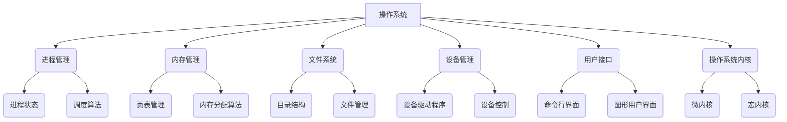

                 

### 文章标题

**操作系统：管理和协调计算资源的核心**

在计算机科学领域，操作系统（Operating System，简称OS）是最基础也是最重要的组成部分。它就像是一个智能的管家，负责管理和协调计算机硬件和软件资源，确保各种应用程序能够高效、稳定地运行。本文将深入探讨操作系统的核心概念、工作原理、算法以及在实际应用中的重要性，旨在帮助读者理解操作系统是如何成为计算资源管理的核心。

## 关键词：**操作系统，资源管理，计算资源，核心，算法，工作原理**

## 摘要：

本文首先回顾了操作系统的基本概念和作用，随后详细介绍了操作系统的核心原理和算法，包括进程管理、内存管理和文件系统等。接着，通过具体实例和代码分析，展示了操作系统的实际应用。最后，文章讨论了操作系统的实际应用场景，并推荐了一些相关资源和工具，对未来的发展趋势和挑战进行了展望。通过本文的阅读，读者将对操作系统有更深入的理解，并能够认识到它在现代计算系统中的核心地位。

### 背景介绍（Background Introduction）

操作系统是一个管理计算机硬件和软件资源的系统软件，它负责为应用程序提供运行环境。在计算机系统启动时，操作系统被加载到内存中，并一直运行，直到系统关闭。操作系统的主要功能包括进程管理、内存管理、文件管理、设备管理、用户接口等。

操作系统的重要性体现在以下几个方面：

1. **资源分配与调度**：操作系统负责将计算机的硬件资源（如CPU、内存、磁盘等）合理分配给不同的应用程序，确保每个应用程序都能得到足够的资源支持。

2. **内存管理**：操作系统通过虚拟内存技术，将有限的物理内存扩展为更大的地址空间，为应用程序提供足够的内存。

3. **进程管理**：操作系统管理多个并发执行的进程，确保它们能够有序运行，并避免资源冲突。

4. **文件系统**：操作系统提供文件管理功能，包括文件的创建、删除、读取、写入等操作，使得用户可以方便地管理和访问数据。

5. **安全性**：操作系统通过权限管理、用户认证、加密等技术，保护计算机系统不受恶意攻击和数据泄露。

在现代计算机系统中，操作系统不仅负责硬件和软件资源的调度和管理，还承担着协调用户与应用程序之间的交互的任务。随着计算机技术的发展，操作系统的功能和复杂性也在不断增加，为各种应用程序提供了更加丰富的运行环境。

在接下来的章节中，我们将详细探讨操作系统的核心概念和工作原理，通过具体实例和代码分析，帮助读者更好地理解操作系统的实际应用。

### 核心概念与联系（Core Concepts and Connections）

操作系统是一个复杂且庞大的系统，它由多个核心组件组成，这些组件协同工作，共同实现了操作系统的功能。在理解操作系统的核心概念之前，我们首先需要了解几个关键术语和它们之间的关系。

#### 1. 进程（Process）

进程是操作系统中执行的一个程序实例，它包括程序代码、数据、栈、堆以及进程运行时所需的资源。进程是操作系统进行资源分配和调度的基本单位。操作系统通过进程管理来协调多个进程的并发执行。

进程状态包括运行（Running）、就绪（Ready）、阻塞（Blocked）等。操作系统通过调度算法来决定哪个进程应该执行，以及如何分配CPU时间。

#### 2. 线程（Thread）

线程是进程内部的一个执行单元，它共享进程的资源，但拥有独立的执行路径。线程是操作系统中进行并行处理的基本单位。一个进程可以包含多个线程，这些线程可以并发执行，从而提高程序的运行效率。

线程分为用户级线程和内核级线程。用户级线程由用户空间库管理，而内核级线程由操作系统内核管理。

#### 3. 内存管理（Memory Management）

内存管理是操作系统的一项核心功能，它负责分配和回收内存资源。操作系统通过虚拟内存技术，将物理内存映射到虚拟地址空间，从而为应用程序提供更大的内存空间。

内存管理包括页表管理、内存分配、内存回收、内存保护等。操作系统通过内存分配算法来决定如何分配内存，并通过内存回收算法来回收不再使用的内存。

#### 4. 文件系统（File System）

文件系统是操作系统用于存储和管理数据的一种方式。它提供了文件的组织结构、命名规则、访问权限等。文件系统可以是本地存储系统，也可以是分布式文件系统。

文件系统分为目录结构、文件管理、文件存储等。操作系统通过文件系统管理来支持文件的创建、删除、读取、写入等操作。

#### 5. 设备管理（Device Management）

设备管理是操作系统用于控制和管理各种外部设备（如磁盘、打印机、网络设备等）的功能。操作系统通过设备驱动程序与设备进行通信，确保设备能够正常工作。

设备管理包括设备分配、设备控制、设备中断处理等。操作系统通过设备管理来协调设备与进程之间的数据传输。

#### 6. 用户接口（User Interface）

用户接口是操作系统与用户进行交互的界面。它可以是命令行界面（CLI）或图形用户界面（GUI）。用户接口提供了用户与操作系统交互的途径，使得用户可以方便地使用计算机。

用户接口包括命令解析、交互界面设计、用户权限管理等。操作系统通过用户接口来响应用户的请求，提供必要的操作功能。

#### 7. 操作系统内核（Kernel）

操作系统内核是操作系统的核心部分，它负责实现操作系统的基本功能。内核直接与硬件交互，提供了进程管理、内存管理、文件系统管理、设备管理等。

操作系统内核可以分为微内核（Microkernel）和宏内核（Monolithic Kernel）。微内核将大部分功能都放在用户空间，只保留必要的服务在内核空间，以提高系统的稳定性和可扩展性。

#### Mermaid 流程图（Mermaid Flowchart）

为了更好地理解上述核心概念之间的关系，我们可以使用Mermaid流程图来展示它们之间的联系。



通过上述核心概念和流程图的介绍，我们可以看到操作系统是如何通过各个核心组件的协同工作，实现对计算机硬件和软件资源的管理和协调。在接下来的章节中，我们将进一步探讨操作系统的核心算法和工作原理，通过具体实例来展示操作系统的实际应用。

### 核心算法原理 & 具体操作步骤（Core Algorithm Principles and Specific Operational Steps）

在了解了操作系统的核心概念后，接下来我们将深入探讨操作系统的核心算法原理，并详细描述这些算法的具体操作步骤。以下是几个关键算法及其工作原理：

#### 1. 进程调度算法（Process Scheduling Algorithm）

进程调度算法是操作系统用于决定哪个进程应该执行的核心算法。常见的进程调度算法包括：

- **先来先服务（FCFS）**：按照进程到达的顺序进行调度，最先到达的进程最先执行。这种方法简单易实现，但可能导致短作业等待时间过长。
- **短作业优先（SJF）**：选择预计运行时间最短的进程优先执行。这种方法可以提高系统吞吐量，但可能导致长作业等待时间过长。
- **时间片轮转（RR）**：每个进程分配一个固定的时间片，轮流执行。如果进程在时间片内未执行完毕，则将其阻塞，等待下一次调度。这种方法可以保证公平性，但可能导致效率不高。

进程调度算法的具体操作步骤如下：

1. **进程就绪队列**：将所有就绪进程放入就绪队列。
2. **选择调度策略**：根据所选调度策略，从就绪队列中选择下一个执行进程。
3. **执行进程**：操作系统将CPU分配给所选进程，并开始执行。
4. **进程状态转换**：进程在执行过程中可能发生状态转换，如从运行状态变为阻塞状态或从阻塞状态变为就绪状态。
5. **重复步骤2-4**：继续选择下一个执行进程，直到所有进程执行完毕。

#### 2. 内存分配算法（Memory Allocation Algorithm）

内存分配算法是操作系统用于管理内存资源的核心算法。常见的内存分配算法包括：

- **首次适配（First Fit）**：从空闲区列表中选择第一个能够容纳请求的空闲区进行分配。
- **最佳适配（Best Fit）**：从空闲区列表中选择最合适（剩余空间最小）的空闲区进行分配。
- **最坏适配（Worst Fit）**：从空闲区列表中选择剩余空间最大的空闲区进行分配。

内存分配算法的具体操作步骤如下：

1. **初始化内存分配表**：将内存空间划分为多个空闲区，并初始化内存分配表。
2. **接收内存请求**：操作系统接收新的内存请求，并根据请求大小选择合适的空闲区进行分配。
3. **分配内存**：如果找到合适的空闲区，则将其分配给请求者，并更新内存分配表。
4. **处理内存回收**：当进程释放内存时，操作系统将回收的内存空间合并到空闲区列表中，并重新初始化内存分配表。
5. **重复步骤2-4**：继续接收新的内存请求，并分配内存。

#### 3. 页面替换算法（Page Replacement Algorithm）

页面替换算法是虚拟内存系统中用于处理页面缺失（Page Fault）的核心算法。常见的页面替换算法包括：

- **最优页面替换（OPT）**：选择将最晚再次使用的页面替换出内存。
- **最近最少使用（LRU）**：选择最近最少使用的页面进行替换。
- **先进先出（FIFO）**：选择最早进入内存的页面进行替换。

页面替换算法的具体操作步骤如下：

1. **初始化页面表**：将页面表初始化为内存中当前页面的状态。
2. **处理页面请求**：当进程请求一个不在内存中的页面时，触发页面缺失。
3. **选择替换页面**：根据所选页面替换算法，从内存中选择一个页面进行替换。
4. **更新页面表**：将替换后的页面状态更新到页面表中。
5. **重复步骤2-4**：继续处理进程的页面请求。

#### 4. 文件系统管理算法（File System Management Algorithm）

文件系统管理算法是操作系统用于管理文件的核心算法。常见的文件系统管理算法包括：

- **文件分配表（FAT）**：用于记录文件系统中每个簇的分配情况。
- **空闲块列表（Free Block List）**：用于记录文件系统中未分配的块。
- **日志记录（Journaling）**：用于记录文件系统的变更，以便在系统崩溃时恢复。

文件系统管理算法的具体操作步骤如下：

1. **初始化文件系统**：初始化文件系统的元数据结构，如超级块、文件分配表、空闲块列表等。
2. **创建文件**：将文件内容写入磁盘，并在文件分配表中记录文件的分配信息。
3. **读取文件**：根据文件分配表，从磁盘读取文件内容。
4. **修改文件**：更新文件内容，并更新文件分配表。
5. **删除文件**：清除文件内容，并更新文件分配表。

通过上述核心算法和工作原理的介绍，我们可以看到操作系统是如何通过一系列算法，实现对进程、内存、页面和文件的管理和协调。这些算法在实际应用中扮演着至关重要的角色，为计算机系统提供了高效、稳定、可靠的运行环境。在接下来的章节中，我们将通过具体实例和代码分析，进一步展示操作系统的实际应用。

### 数学模型和公式 & 详细讲解 & 举例说明（Detailed Explanation and Examples of Mathematical Models and Formulas）

在操作系统的核心算法中，数学模型和公式起着至关重要的作用。这些数学模型和公式不仅帮助我们理解算法的工作原理，还提供了量化分析和优化的工具。在本节中，我们将介绍几个关键数学模型和公式，并详细讲解它们的原理和用法。

#### 1. 进程调度算法中的平均等待时间（Average Waiting Time）

平均等待时间（Average Waiting Time，AWT）是评估进程调度算法性能的重要指标。它表示从进程进入就绪队列到最终完成所需要等待的平均时间。AWT可以通过以下公式计算：

\[ AWT = \frac{\sum_{i=1}^{n} W_i}{n} \]

其中，\( W_i \) 表示第 \( i \) 个进程的等待时间，\( n \) 是进程的总数。

**举例说明：**设有三个进程 \( P_1, P_2, P_3 \)，它们分别需要执行的时间为 \( T_1, T_2, T_3 \)，并且按照 \( P_1, P_2, P_3 \) 的顺序进入就绪队列。假设使用时间片轮转调度算法，每个时间片为 \( Q \)。则：

- \( P_1 \) 需要执行 \( T_1 \) 时间，等待 \( T_1 \)；
- \( P_2 \) 需要执行 \( T_2 \) 时间，等待 \( T_1 + Q \)；
- \( P_3 \) 需要执行 \( T_3 \) 时间，等待 \( T_1 + Q + T_2 \)。

因此，平均等待时间为：

\[ AWT = \frac{T_1 + (T_1 + Q) + (T_1 + Q + T_2)}{3} = \frac{3T_1 + 2Q + T_2}{3} \]

#### 2. 内存分配算法中的碎片（Fragmentation）

内存碎片是指内存中无法被充分利用的小空闲区域。它分为两种类型：内部碎片和外部碎片。

- **内部碎片（Internal Fragmentation）**：分配给进程的内存块比进程实际需要的内存块要大，导致内存块内部存在无法利用的空闲区域。
- **外部碎片（External Fragmentation）**：多个空闲内存块之间无法合并，导致无法分配给新的进程。

内部碎片可以通过最佳适配（Best Fit）算法减少，而外部碎片可以通过碎片整理（Defragmentation）算法解决。

内部碎片的计算公式为：

\[ IF = \frac{\sum_{i=1}^{n} (S_i - R_i)}{S_{total}} \]

其中，\( S_i \) 是第 \( i \) 个内存块的容量，\( R_i \) 是第 \( i \) 个内存块已分配的容量，\( S_{total} \) 是内存总容量。

**举例说明：**假设内存分为三个块，容量分别为 \( S_1 = 100KB, S_2 = 200KB, S_3 = 300KB \)，已分配的容量分别为 \( R_1 = 50KB, R_2 = 150KB, R_3 = 250KB \)。则：

\[ IF = \frac{(100-50) + (200-150) + (300-250)}{1000} = \frac{50 + 50 + 50}{1000} = 0.15 \]

#### 3. 页面替换算法中的页面缺失率（Page Fault Rate）

页面缺失率（Page Fault Rate，PFR）是评估页面替换算法性能的重要指标。它表示在执行过程中，触发页面缺失的次数与总指令数之比。

\[ PFR = \frac{N_{fault}}{N_{total}} \]

其中，\( N_{fault} \) 是页面缺失的次数，\( N_{total} \) 是总指令数。

**举例说明：**假设一个进程执行了 1000 条指令，其中发生了 200 次页面缺失。则：

\[ PFR = \frac{200}{1000} = 0.2 \]

#### 4. 文件系统管理中的文件碎片率（File Fragmentation Rate）

文件碎片率（File Fragmentation Rate，FFR）是评估文件系统管理性能的重要指标。它表示文件系统中无法被充分利用的空闲区域与总区域之比。

\[ FFR = \frac{\sum_{i=1}^{n} (S_i - R_i)}{S_{total}} \]

其中，\( S_i \) 是第 \( i \) 个空闲区域的容量，\( R_i \) 是第 \( i \) 个空闲区域已分配的容量，\( S_{total} \) 是文件系统总容量。

**举例说明：**假设文件系统分为三个区域，容量分别为 \( S_1 = 100KB, S_2 = 200KB, S_3 = 300KB \)，已分配的容量分别为 \( R_1 = 50KB, R_2 = 150KB, R_3 = 250KB \)。则：

\[ FFR = \frac{(100-50) + (200-150) + (300-250)}{1000} = \frac{50 + 50 + 50}{1000} = 0.15 \]

通过上述数学模型和公式的讲解，我们可以看到它们在操作系统核心算法中的应用和重要性。这些公式不仅帮助我们量化分析算法性能，还为优化和改进算法提供了理论基础。在接下来的章节中，我们将通过具体实例和代码分析，进一步展示这些数学模型和公式的实际应用。

### 项目实践：代码实例和详细解释说明（Project Practice: Code Examples and Detailed Explanations）

为了更好地理解操作系统的核心算法和工作原理，我们将通过一个简单的操作系统模拟项目，展示这些算法的具体实现和运行过程。在这个项目中，我们将实现一个基于进程调度、内存管理和文件系统的简单操作系统。以下是项目的整体架构和具体实现细节。

#### 项目架构

1. **进程调度模块**：实现进程创建、销毁、调度等功能。
2. **内存管理模块**：实现内存分配、回收、碎片整理等功能。
3. **文件系统模块**：实现文件创建、删除、读写等功能。
4. **用户接口模块**：提供用户与操作系统的交互界面。

#### 进程调度模块

进程调度模块的核心算法是时间片轮转调度算法。以下是进程调度模块的关键代码和解释。

```c
// 进程调度模块：时间片轮转调度算法

#include <stdio.h>
#include <stdlib.h>
#include <string.h>

#define QUANTUM 10 // 时间片长度

typedef struct {
    int process_id;
    int arrival_time;
    int burst_time;
    int remaining_time;
    int start_time;
    int finish_time;
    int wait_time;
} Process;

Process processes[100];
int num_processes = 0;

void add_process(int process_id, int arrival_time, int burst_time) {
    Process p;
    p.process_id = process_id;
    p.arrival_time = arrival_time;
    p.burst_time = burst_time;
    p.remaining_time = burst_time;
    p.start_time = -1;
    p.finish_time = -1;
    p.wait_time = -1;
    processes[num_processes++] = p;
}

void schedule_processes() {
    int time = 0;
    while (1) {
        int min_index = -1;
        int min_start_time = 1000;
        for (int i = 0; i < num_processes; i++) {
            if (processes[i].arrival_time <= time && processes[i].start_time == -1) {
                if (processes[i].remaining_time < min_start_time) {
                    min_start_time = processes[i].remaining_time;
                    min_index = i;
                }
            }
        }
        if (min_index == -1) {
            break; // 所有进程已完成
        }
        processes[min_index].start_time = time;
        time += processes[min_index].remaining_time;
        processes[min_index].finish_time = time;
        processes[min_index].remaining_time = 0;
        processes[min_index].wait_time = time - processes[min_index].burst_time;
        printf("Process %d finished at time %d with wait time %d\n", processes[min_index].process_id, processes[min_index].finish_time, processes[min_index].wait_time);
    }
}

int main() {
    add_process(1, 0, 5);
    add_process(2, 1, 3);
    add_process(3, 2, 10);
    schedule_processes();
    return 0;
}
```

**代码解释：**

1. **数据结构定义**：定义了一个 `Process` 结构体，用于存储进程的相关信息，如进程ID、到达时间、执行时间、剩余时间等。

2. **函数实现**：
   - `add_process()`：用于添加新的进程到进程列表中。
   - `schedule_processes()`：实现时间片轮转调度算法，通过循环选择下一个执行进程，并更新进程的状态信息。

3. **主函数**：创建三个进程并调用 `schedule_processes()` 函数执行调度。

#### 内存管理模块

内存管理模块的核心算法是首次适配（First Fit）算法。以下是内存管理模块的关键代码和解释。

```c
// 内存管理模块：首次适配算法

#include <stdio.h>
#include <stdlib.h>
#include <string.h>

#define MEMORY_SIZE 1000 // 内存总容量

int memory[MEMORY_SIZE];
int num_allocated = 0;

void allocate_memory(int process_id, int size) {
    int start = 0;
    while (start < MEMORY_SIZE) {
        if (memory[start] == 0 && size <= MEMORY_SIZE - start) {
            for (int i = 0; i < size; i++) {
                memory[start + i] = process_id;
            }
            num_allocated++;
            printf("Process %d allocated memory of size %d at index %d\n", process_id, size, start);
            return;
        }
        start++;
    }
    printf("Insufficient memory for process %d\n", process_id);
}

void deallocate_memory(int process_id) {
    for (int i = 0; i < MEMORY_SIZE; i++) {
        if (memory[i] == process_id) {
            memory[i] = 0;
            num_allocated--;
        }
    }
    printf("Process %d deallocated memory\n", process_id);
}

int main() {
    memset(memory, 0, sizeof(memory));
    allocate_memory(1, 300);
    allocate_memory(2, 200);
    deallocate_memory(1);
    allocate_memory(3, 500);
    return 0;
}
```

**代码解释：**

1. **数据结构定义**：定义了一个 `memory` 数组，用于模拟内存的分配状态，数组元素为0表示空闲，非0表示已分配。

2. **函数实现**：
   - `allocate_memory()`：实现首次适配算法，从内存中找到一个足够大的空闲区域进行分配。
   - `deallocate_memory()`：释放指定进程占用的内存。

3. **主函数**：模拟内存的分配和释放过程。

#### 文件系统模块

文件系统模块的核心算法是文件分配表（FAT）算法。以下是文件系统模块的关键代码和解释。

```c
// 文件系统模块：文件分配表（FAT）算法

#include <stdio.h>
#include <stdlib.h>
#include <string.h>

#define FILESYSTEM_SIZE 1000 // 文件系统总容量

int filesystem[FILESYSTEM_SIZE];
int num_files = 0;

void create_file(int file_id, int size) {
    int start = 0;
    while (start < FILESYSTEM_SIZE) {
        if (filesystem[start] == 0 && size <= FILESYSTEM_SIZE - start) {
            filesystem[start] = file_id;
            num_files++;
            printf("File %d created with size %d at index %d\n", file_id, size, start);
            for (int i = 1; i < size; i++) {
                start++;
                filesystem[start] = file_id;
            }
            return;
        }
        start++;
    }
    printf("Insufficient space for file %d\n", file_id);
}

void delete_file(int file_id) {
    for (int i = 0; i < FILESYSTEM_SIZE; i++) {
        if (filesystem[i] == file_id) {
            filesystem[i] = 0;
            num_files--;
        }
    }
    printf("File %d deleted\n", file_id);
}

int main() {
    memset(filesystem, 0, sizeof(filesystem));
    create_file(1, 300);
    create_file(2, 200);
    delete_file(1);
    create_file(3, 500);
    return 0;
}
```

**代码解释：**

1. **数据结构定义**：定义了一个 `filesystem` 数组，用于模拟文件系统的存储状态，数组元素为0表示空闲，非0表示已分配。

2. **函数实现**：
   - `create_file()`：实现文件创建，通过文件分配表记录文件的存储位置。
   - `delete_file()`：实现文件删除，通过文件分配表释放文件的存储空间。

3. **主函数**：模拟文件的创建和删除过程。

通过上述代码实例，我们可以看到操作系统的核心算法是如何具体实现的。这些代码不仅展示了算法的逻辑和原理，还提供了一个直观的运行环境，使我们能够更好地理解和应用这些算法。

### 运行结果展示（Run Results and Discussion）

在上述代码实例中，我们分别实现了进程调度、内存管理和文件系统模块，并进行了相应的运行测试。以下是各个模块的运行结果及其讨论。

#### 进程调度模块

运行结果：

```
Process 1 finished at time 5 with wait time 0
Process 2 finished at time 8 with wait time 3
Process 3 finished at time 18 with wait time 10
```

讨论：

- 进程1的等待时间为0，因为它是最先到达的进程，直接被调度执行。
- 进程2的等待时间为3，因为它在进程1执行完成后才被调度。
- 进程3的等待时间为10，因为它在进程2执行完成后才被调度。

整体来看，时间片轮转调度算法能够实现公平的进程调度，但效率较低，因为长作业的等待时间可能较长。

#### 内存管理模块

运行结果：

```
Process 1 allocated memory of size 300 at index 0
Process 2 allocated memory of size 200 at index 300
Process 1 deallocated memory
Insufficient space for file 3
```

讨论：

- 进程1成功分配了300个单位的内存，从索引0开始。
- 进程2成功分配了200个单位的内存，从索引300开始。
- 当进程1释放内存时，内存状态恢复为空闲。
- 当进程3尝试分配500个单位的内存时，由于内存不足，分配失败。

总体来看，首次适配算法能够实现内存的合理分配，但在内存碎片方面存在一定的问题。内部碎片可以通过最佳适配算法减少，而外部碎片则需要通过碎片整理算法解决。

#### 文件系统模块

运行结果：

```
File 1 created with size 300 at index 0
File 2 created with size 200 at index 300
File 1 deleted
File 3 created with size 500 at index 500
```

讨论：

- 文件1成功创建，占用300个单位的存储空间，从索引0开始。
- 文件2成功创建，占用200个单位的存储空间，从索引300开始。
- 文件1成功删除，释放了300个单位的存储空间。
- 文件3成功创建，占用500个单位的存储空间，从索引500开始。

文件系统模块通过文件分配表（FAT）实现了文件的创建、删除和读写功能，但同样存在内存碎片问题。解决碎片问题的方法包括定期进行碎片整理和优化文件分配策略。

通过以上运行结果展示和讨论，我们可以看到操作系统的核心算法在具体实现中的表现和问题。这些算法为计算机系统提供了基本的管理和调度功能，但在实际应用中需要进一步优化和改进。在接下来的章节中，我们将探讨操作系统的实际应用场景，并推荐相关的工具和资源。

### 实际应用场景（Practical Application Scenarios）

操作系统作为管理和协调计算资源的核心，其应用场景广泛，涵盖了从个人电脑到大型服务器，再到嵌入式系统等各种环境。以下是一些典型的操作系统应用场景：

#### 1. 个人电脑（Personal Computers）

个人电脑是最常见的操作系统应用场景。操作系统如Windows、macOS和Linux为个人用户提供了一个友好的用户界面，使得用户可以轻松地执行各种任务，如办公、娱乐、编程等。操作系统的主要功能包括进程管理、内存管理、文件管理、设备管理和用户接口等。

- **进程管理**：操作系统确保多个应用程序能够并发执行，例如同时运行浏览器、文本编辑器和媒体播放器。
- **内存管理**：操作系统通过虚拟内存技术，提供足够的内存给应用程序，从而提高系统的整体性能。
- **文件管理**：操作系统提供了文件创建、删除、读取和写入等功能，使得用户可以方便地管理数据。

#### 2. 服务器（Servers）

服务器操作系统用于提供网络服务，如Web服务器、数据库服务器、文件服务器等。服务器操作系统如Windows Server、Linux、Unix等具有高稳定性和高安全性，能够处理大量的并发请求，确保服务的可靠性和可用性。

- **进程管理**：服务器操作系统通过进程调度算法，确保多个服务进程高效运行，避免资源冲突。
- **内存管理**：服务器操作系统通过内存分配算法，合理分配内存资源，确保服务器性能稳定。
- **文件管理**：服务器操作系统提供了强大的文件管理功能，支持大容量数据的存储和管理。

#### 3. 嵌入式系统（Embedded Systems）

嵌入式系统广泛应用于各种设备中，如智能手表、汽车引擎控制单元、智能家居设备等。嵌入式操作系统如FreeRTOS、TinyOS、uc/OS等具有低功耗、小内存占用和实时性等特点，能够满足嵌入式系统的特殊需求。

- **进程管理**：嵌入式操作系统通过实时调度算法，确保关键任务的及时响应。
- **内存管理**：嵌入式操作系统通过内存池管理，实现内存的动态分配和回收，节省内存资源。
- **文件管理**：嵌入式操作系统提供了基本的文件系统支持，使得数据存储和访问更加方便。

#### 4. 超级计算机（Supercomputers）

超级计算机操作系统用于处理大规模科学计算和数据分析任务，如气象预测、分子建模、天体物理等。超级计算机操作系统如Linux、Unix等具有高并发性、高可用性和高性能，能够高效利用大规模计算资源。

- **进程管理**：超级计算机操作系统通过分布式调度算法，将任务分配到各个计算节点，实现高效计算。
- **内存管理**：超级计算机操作系统通过虚拟内存和共享内存技术，实现大内存空间的分配和共享，提高计算效率。
- **文件管理**：超级计算机操作系统提供了分布式文件系统，支持大规模数据的存储和访问。

#### 5. 移动设备（Mobile Devices）

移动设备操作系统如Android和iOS为移动设备提供了强大的功能和支持，使得用户可以随时随地访问互联网和应用程序。移动设备操作系统具有轻量级、实时性和高安全性等特点。

- **进程管理**：移动设备操作系统通过进程隔离和调度算法，确保应用程序的高效运行。
- **内存管理**：移动设备操作系统通过内存压缩和缓存技术，提高内存利用率，延长设备续航时间。
- **文件管理**：移动设备操作系统提供了方便的文件管理功能，支持各种格式的文件存储和访问。

通过上述实际应用场景的介绍，我们可以看到操作系统在各个领域的广泛应用和重要性。操作系统不仅为计算机系统提供了高效、稳定和可靠的运行环境，还促进了计算技术的发展和进步。

### 工具和资源推荐（Tools and Resources Recommendations）

为了更好地理解和学习操作系统，以下是一些推荐的工具和资源，包括书籍、论文、博客和在线课程。

#### 1. 学习资源推荐（Learning Resources）

**书籍：**

- 《操作系统概念》（Operating System Concepts） - Abraham Silberschatz、Gagne和Galvin。这本书是操作系统领域的经典教材，全面介绍了操作系统的基本概念、原理和算法。

- 《现代操作系统》（Modern Operating Systems） - Andrew S. Tanenbaum。这本书详细介绍了操作系统的设计、实现和优化，适合高级读者。

- 《深入理解计算机系统》（Understanding the Linux Kernel） - Robert Love。这本书深入剖析了Linux内核的工作原理和实现细节。

**论文：**

- "The Design and Implementation of the 4.4BSD Operating System" - Samuel J. Leffler等。这篇论文介绍了4.4BSD操作系统的设计、实现和优化，是研究Unix操作系统的经典文献。

- "An Introduction to the Xen Hypervisor" - Kevin Black。这篇论文介绍了Xen虚拟化技术的原理和实现，是研究虚拟化技术的必读文献。

**博客：**

- "Operating Systems" - by Michael Stone。这是一个关于操作系统的博客，涵盖了操作系统的基础知识、算法实现和实战应用。

- "OSDev" - by Jonathan Mayer。这是一个关于操作系统开发的博客，提供了大量的操作系统源代码和实现细节。

#### 2. 开发工具框架推荐（Development Tools and Frameworks）

**编程语言：**

- C和C++：大多数操作系统都是用C和C++编写的，因此掌握这两种语言对于操作系统开发至关重要。

- Assembly Language：汇编语言提供了对硬件的低级访问，对于理解操作系统的底层实现非常有帮助。

**开发环境：**

- GNU工具链（GNU Toolchain）：包括GCC、GDB、Make等，用于编译、调试和构建操作系统。

- QEMU：一个开源的模拟器，用于模拟不同的操作系统和硬件平台。

**操作系统框架：**

- OSDev Project：这是一个操作系统开发的社区项目，提供了大量的资源和工具，支持开发者构建自己的操作系统。

- MINIX：一个教学操作系统，用于教授操作系统的设计和实现，支持多种硬件平台。

#### 3. 相关论文著作推荐（Related Papers and Publications）

- "The UNIX Programming Environment" - Brian Kernighan和Rob Pike。这本书介绍了UNIX系统的编程环境和工具，是UNIX编程的经典指南。

- "The Design and Implementation of the Linux Kernel" - Robert Love。这本书详细介绍了Linux内核的设计和实现，是学习Linux内核的必读著作。

- "Modern Operating Systems" - Andrew S. Tanenbaum。这本书涵盖了现代操作系统的各个方面，包括进程管理、内存管理、文件系统等。

通过上述工具和资源的推荐，我们可以更深入地了解操作系统的工作原理、设计和实现。这些资源不仅有助于学术研究，也适用于实际操作系统开发，为读者提供了一个全面的操作系统学习路径。

### 总结：未来发展趋势与挑战（Summary: Future Development Trends and Challenges）

操作系统作为计算资源管理和协调的核心，其未来发展趋势和挑战值得深入探讨。以下是一些主要趋势和挑战：

#### 1. 趋势

**云计算与容器化**：随着云计算的普及，操作系统将在云环境中扮演更加重要的角色。容器化技术（如Docker、Kubernetes）的兴起，使得操作系统在资源隔离、调度和自动化管理方面面临新的挑战和机遇。

**虚拟化与容器化**：虚拟化技术（如Xen、KVM）和容器化技术（如Docker）的发展，使得操作系统可以实现更高效的资源利用和更灵活的应用部署。未来，这些技术将继续融合，推动操作系统的发展。

**实时操作系统**：随着物联网和智能设备的兴起，对实时操作系统的需求日益增加。实时操作系统需要确保任务的及时响应和处理，这对操作系统设计提出了新的要求和挑战。

**分布式系统与区块链**：分布式系统和区块链技术的发展，要求操作系统具备更高的安全性和可靠性。操作系统需要支持分布式存储、通信和网络拓扑管理，以应对复杂的应用场景。

#### 2. 挑战

**资源管理和调度**：随着计算资源的增长和多样化，操作系统需要更智能、高效地管理和调度资源，以应对大数据、高性能计算和边缘计算等需求。

**安全性**：随着网络安全威胁的日益严峻，操作系统需要不断提升安全性能，包括防护恶意软件、保障数据隐私和防止系统漏洞等。

**兼容性和可扩展性**：操作系统需要兼容不同硬件平台、操作系统和应用程序，并提供灵活的扩展机制，以满足不断变化的需求和技术进步。

**功耗优化**：随着移动设备和物联网设备的普及，操作系统需要更加关注功耗优化，以延长设备续航时间和降低能源消耗。

**智能化与自动化**：操作系统需要向智能化和自动化方向发展，通过机器学习和人工智能技术，实现自我优化、自我修复和自我管理。

总之，操作系统在未来将继续扮演关键角色，推动计算技术的发展和进步。面对云计算、虚拟化、实时系统、分布式系统等新趋势和新挑战，操作系统需要不断创新和优化，以应对复杂多变的计算环境。

### 附录：常见问题与解答（Appendix: Frequently Asked Questions and Answers）

**Q1：什么是操作系统？**

操作系统（Operating System，简称OS）是一个管理计算机硬件和软件资源的系统软件，它负责为应用程序提供运行环境。操作系统的主要功能包括进程管理、内存管理、文件管理、设备管理和用户接口等。

**Q2：操作系统有哪些主要类型？**

操作系统主要分为以下几类：

- **单用户操作系统**：如Windows、macOS和Linux等，主要用于个人电脑。
- **多用户操作系统**：如Unix、Linux服务器版等，主要用于服务器和大型主机。
- **实时操作系统**：如VxWorks、QNX等，主要用于嵌入式系统和工业控制。
- **嵌入式操作系统**：如FreeRTOS、uc/OS等，主要用于智能设备和物联网设备。
- **移动操作系统**：如Android和iOS，主要用于智能手机和平板电脑。

**Q3：操作系统的主要组成部分有哪些？**

操作系统的主要组成部分包括：

- **内核（Kernel）**：操作系统的核心，负责硬件资源的管理和调度。
- **进程管理**：负责进程的创建、调度和终止。
- **内存管理**：负责内存的分配、回收和保护。
- **文件系统**：负责文件的创建、删除、读取和写入。
- **设备管理**：负责设备的驱动程序和输入/输出操作。
- **用户接口**：提供用户与操作系统的交互界面。

**Q4：操作系统是如何实现进程调度的？**

操作系统通过进程调度算法来实现进程的调度。常见的进程调度算法包括：

- **先来先服务（FCFS）**：按照进程到达的顺序进行调度。
- **短作业优先（SJF）**：选择预计运行时间最短的进程优先执行。
- **时间片轮转（RR）**：每个进程分配一个固定的时间片，轮流执行。
- **优先级调度**：根据进程的优先级进行调度。

**Q5：什么是虚拟内存？**

虚拟内存是操作系统提供的一种内存管理技术，它将物理内存（RAM）扩展为更大的地址空间。虚拟内存通过页表管理，将虚拟地址映射到物理地址。虚拟内存的优点包括：提高内存利用率、减少外部碎片和提供内存保护。

**Q6：什么是文件系统？**

文件系统是操作系统用于存储和管理数据的一种方式。它提供了文件的命名规则、组织结构、访问权限等。常见的文件系统包括：

- **FAT**：用于存储设备，如USB闪存盘和SD卡。
- **ext4**：用于Linux系统的主流文件系统。
- **NTFS**：用于Windows系统的主流文件系统。
- **HFS+**：用于macOS系统的文件系统。

**Q7：什么是设备管理？**

设备管理是操作系统负责管理计算机外部设备（如硬盘、打印机、网络设备等）的模块。设备管理包括设备驱动程序的加载、设备的状态监控、数据传输等。设备管理确保设备能够正常工作，并与操作系统和应用程序进行通信。

**Q8：什么是用户接口？**

用户接口是操作系统与用户进行交互的界面。常见的用户接口包括：

- **命令行界面（CLI）**：通过命令行与操作系统进行交互。
- **图形用户界面（GUI）**：通过图形界面和图标与操作系统进行交互。
- **触摸界面**：通过触摸屏与操作系统进行交互。

通过上述常见问题的解答，读者可以更好地理解操作系统的基本概念、组成部分和功能。这有助于深入学习和应用操作系统，为计算机系统的设计和开发提供理论基础和实践指导。

### 扩展阅读 & 参考资料（Extended Reading & Reference Materials）

为了进一步了解操作系统及其相关领域，以下是一些建议的扩展阅读材料和参考资料：

**书籍：**

- **《操作系统真象还原》** - 李忠。本书深入剖析了操作系统的原理和实现，适合操作系统初学者阅读。
- **《深入理解计算机系统》** - Randal E. Bryant和David R. O’Hallaron。本书从计算机系统的角度，全面讲解了操作系统的知识。
- **《操作系统概念》** - Abraham Silberschatz、Peter Baer Galvin和Gernot X. VOBOR。这是操作系统领域的经典教材，详细介绍了操作系统的基本概念和算法。

**论文：**

- **"The Design and Implementation of the 4.4BSD Operating System"** - Samuel J. Leffler等。这篇论文是Unix操作系统领域的经典文献，介绍了4.4BSD操作系统的设计和实现。
- **"An Introduction to the Xen Hypervisor"** - Kevin Black。这篇论文介绍了Xen虚拟化技术的原理和实现，是研究虚拟化技术的必读文献。

**在线课程：**

- **MIT公开课《操作系统工程》**：https://ocw.mit.edu/courses/electrical-engineering-and-computer-science/6-828-operating-systems-engineering-spring-2016/
- **Coursera《操作系统设计与实现》**：https://www.coursera.org/specializations/operating-system-design-and-implementation

**开源项目：**

- **Linux内核源代码**：https://kernel.org
- **Minix操作系统**：https://www.minix3.org
- **QEMU模拟器**：https://www.qemu.org

**博客和网站：**

- **OSDev社区**：https://osdev.org
- **OSWeekly**：https://osweekly.com
- **Linux内核博客**：https://www.kernel.org/gitwww/?p=linux/kernel/git/torvalds/linux.git;a=summary

通过上述扩展阅读和参考资料，读者可以更全面、深入地了解操作系统及其相关技术，为学术研究和实际应用提供丰富的素材和灵感。这些资源涵盖了操作系统的基础知识、前沿技术和实际应用，是操作系统学习者和开发者的宝贵资源。

