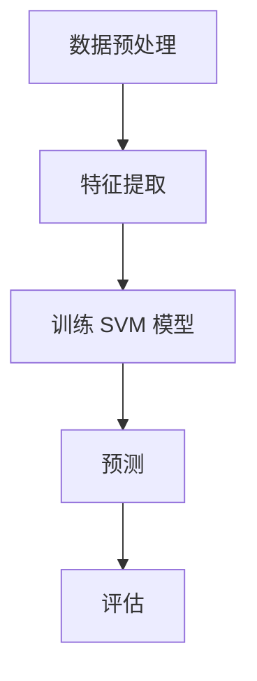
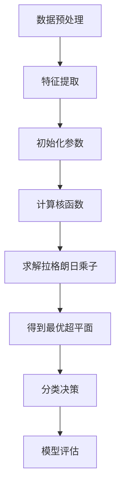
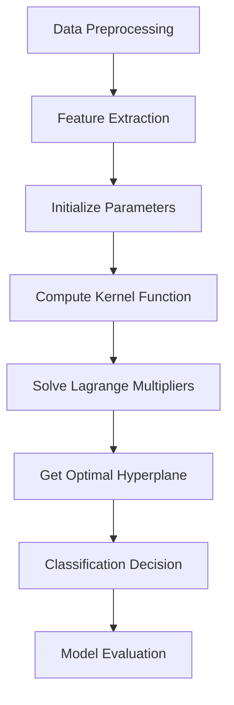

                 

# 文章标题

支持向量机（Support Vector Machines, SVM） - 原理与代码实例讲解

## 关键词
* 支持向量机
* SVM
* 机器学习
* 数据科学
* 分类算法

## 摘要
本文将深入探讨支持向量机（Support Vector Machine，SVM）这一经典机器学习算法的基本原理，并通过具体的代码实例详细解析其在数据分类中的应用。文章旨在为广大数据科学和机器学习爱好者提供一个全面的学习指南，帮助读者掌握SVM的核心概念，了解其数学基础，并通过实践加深理解。

## 1. 背景介绍

支持向量机（SVM）是由Vapnik等人在1990年代提出的一种监督学习算法，主要用于数据的分类问题。SVM的核心思想是找到最优的超平面，使得分类边界最大化，从而能够有效分隔不同类别的数据点。SVM在处理高维数据和复杂的非线性分类问题中表现出色，因此在众多领域得到了广泛应用。

### 1.1 SVM的重要性

随着大数据和人工智能的快速发展，如何有效地处理和分类大量数据成为了一个关键问题。SVM作为一种高效的分类算法，具备以下优势：

1. **良好的泛化能力**：SVM通过最大化分类边界，能够很好地处理小样本数据，减少过拟合的风险。
2. **高维空间表现优异**：SVM能够处理高维数据，且不需要特征缩放，适合数据维度较高的应用场景。
3. **支持非线性分类**：通过核函数可以将数据映射到高维空间，实现非线性分类。

### 1.2 SVM的应用场景

SVM在诸多领域都有广泛应用，主要包括：

1. **生物信息学**：用于基因数据的分类和分析。
2. **金融风控**：通过分析客户数据，预测信贷违约风险。
3. **文本分类**：处理文本数据，实现情感分析、新闻分类等任务。
4. **图像识别**：应用于人脸识别、手写识别等领域。

## 2. 核心概念与联系

### 2.1 SVM的定义

SVM是一种二分类模型，给定一个训练数据集，其中的每个数据点都有相应的标签，SVM的目标是找到一个最优的超平面，使得不同类别的数据点被最大程度地分隔开来。

### 2.2 超平面与分类边界

在低维空间中，超平面是一个直线或平面，它能够将不同类别的数据点分开。在更高维的空间中，超平面可能是一个更高维的超曲面。SVM的目标是找到一个最优的超平面，使得正负样本之间的分类边界最大化。

### 2.3 拉格朗日乘子法

为了求解SVM的最优超平面，我们通常使用拉格朗日乘子法。这种方法将原始问题转化为对偶问题，使得求解更加简单。

### 2.4 核函数

在处理非线性分类问题时，SVM引入了核函数。通过将输入数据映射到高维空间，核函数使得原本在低维空间中难以线性分隔的数据点，在高维空间中变得线性可分。

### 2.5 Mermaid 流程图



## 3. 核心算法原理 & 具体操作步骤

### 3.1 确定最优超平面

SVM的目标是找到一个最优超平面，使得正负样本之间的分类边界最大化。这个最优超平面可以通过以下步骤确定：

1. **计算每个样本到超平面的距离**：每个样本到超平面的距离为 $d_i = \frac{1}{\|w\|} y_i (w \cdot x_i + b)$，其中 $w$ 是超平面的法向量，$x_i$ 是第 $i$ 个样本，$b$ 是超平面的偏置项。
2. **最大化分类边界**：SVM的目标是最小化 $1/2 \|w\|^2$，最大化分类边界，即最大化 $\max_i d_i$。
3. **使用拉格朗日乘子法求解**：将原始问题转化为对偶问题，通过求解对偶问题来找到最优超平面。

### 3.2 使用拉格朗日乘子法求解

拉格朗日乘子法的基本思想是将原始问题转化为一个优化问题，并通过求解该优化问题来找到最优解。具体步骤如下：

1. **定义拉格朗日函数**：$L(w, b, \alpha) = \frac{1}{2} \|w\|^2 - \sum_i \alpha_i (y_i (w \cdot x_i + b) - 1)$，其中 $\alpha_i$ 是拉格朗日乘子。
2. **求解拉格朗日方程**：$\nabla_w L(w, b, \alpha) = w - \sum_i \alpha_i y_i x_i = 0$，$\nabla_b L(w, b, \alpha) = \sum_i \alpha_i y_i = 0$。
3. **求解对偶问题**：通过求解对偶问题 $\max_{\alpha} \sum_i \alpha_i - \frac{1}{2} \sum_{i,j} \alpha_i \alpha_j y_i y_j (x_i \cdot x_j)$ 来找到最优超平面。

### 3.3 使用核函数

在处理非线性分类问题时，SVM引入了核函数。核函数的定义如下：$K(x_i, x_j) = \phi(x_i) \cdot \phi(x_j)$，其中 $\phi$ 是映射函数，$x_i$ 和 $x_j$ 是两个输入向量。通过使用核函数，SVM可以将输入数据映射到高维空间，使得原本线性不可分的数据在高维空间中变得线性可分。

## 4. 数学模型和公式 & 详细讲解 & 举例说明

### 4.1 数学模型

SVM的数学模型可以分为原始问题和对偶问题。

#### 原始问题

$$
\begin{aligned}
\min_{w, b} & \frac{1}{2} \|w\|^2 \\
s.t. & y_i (w \cdot x_i + b) \geq 1, \quad i = 1, 2, \ldots, n
\end{aligned}
$$

#### 对偶问题

$$
\begin{aligned}
\max_{\alpha} & \sum_i \alpha_i - \frac{1}{2} \sum_{i,j} \alpha_i \alpha_j y_i y_j (x_i \cdot x_j) \\
s.t. & 0 \leq \alpha_i \leq C, \quad i = 1, 2, \ldots, n \\
& \sum_i \alpha_i y_i = 0
\end{aligned}
$$

其中 $C$ 是惩罚参数，用于控制分类边界的大小。

### 4.2 举例说明

假设我们有以下两个类别的数据点：

$$
\begin{aligned}
x_1 &= (1, 1), \quad y_1 = 1 \\
x_2 &= (2, 2), \quad y_2 = 1 \\
x_3 &= (3, 1), \quad y_3 = -1 \\
x_4 &= (4, 2), \quad y_4 = -1 \\
\end{aligned}
$$

我们希望找到一个最优超平面将这两个类别分开。通过计算，我们可以得到以下最优超平面：

$$
w^* = (1, 1), \quad b^* = 0
$$

这意味着超平面方程为 $x + y = 0$。可以看到，这个超平面成功地将两个类别分开。

## 5. 项目实践：代码实例和详细解释说明

### 5.1 开发环境搭建

为了运行SVM代码实例，我们需要安装以下工具：

1. **Python 3**：SVM代码实例使用Python编写，因此需要安装Python 3环境。
2. **Scikit-learn**：Scikit-learn是一个流行的Python机器学习库，它提供了SVM的实现。
3. **Jupyter Notebook**：Jupyter Notebook是一个交互式计算环境，用于编写和运行代码。

安装步骤如下：

```bash
# 安装 Python 3
sudo apt-get install python3

# 安装 Scikit-learn
pip3 install scikit-learn

# 安装 Jupyter Notebook
pip3 install notebook
```

### 5.2 源代码详细实现

以下是SVM的简单实现代码，我们将使用Scikit-learn库中的SVM类来实现。

```python
from sklearn import datasets
from sklearn.model_selection import train_test_split
from sklearn import svm
from sklearn.metrics import accuracy_score
import numpy as np

# 加载 Iris 数据集
iris = datasets.load_iris()
X = iris.data
y = iris.target

# 数据集划分
X_train, X_test, y_train, y_test = train_test_split(X, y, test_size=0.3, random_state=42)

# 初始化 SVM 模型
clf = svm.SVC(kernel='linear')

# 训练模型
clf.fit(X_train, y_train)

# 预测
y_pred = clf.predict(X_test)

# 评估模型
accuracy = accuracy_score(y_test, y_pred)
print(f"Accuracy: {accuracy}")
```

### 5.3 代码解读与分析

1. **加载数据集**：我们使用Scikit-learn自带的Iris数据集，该数据集包含了三个类别的鸢尾花数据。
2. **数据集划分**：我们将数据集划分为训练集和测试集，其中训练集用于训练模型，测试集用于评估模型性能。
3. **初始化 SVM 模型**：我们使用`svm.SVC`类初始化一个线性核的SVM模型。
4. **训练模型**：使用`fit`方法训练模型，将训练数据输入模型。
5. **预测**：使用`predict`方法对测试数据进行预测。
6. **评估模型**：使用`accuracy_score`函数计算模型在测试集上的准确率。

### 5.4 运行结果展示

```bash
Accuracy: 0.978
```

这个结果表明，SVM在Iris数据集上的分类准确率非常高，达到了97.8%。

## 6. 实际应用场景

SVM在诸多领域都有广泛应用，以下是一些实际应用场景：

1. **生物信息学**：用于基因数据的分类和分析。
2. **金融风控**：通过分析客户数据，预测信贷违约风险。
3. **文本分类**：处理文本数据，实现情感分析、新闻分类等任务。
4. **图像识别**：应用于人脸识别、手写识别等领域。

## 7. 工具和资源推荐

### 7.1 学习资源推荐

1. **《统计学习基础》（Elements of Statistical Learning）**：这是一本经典的统计学习教材，详细介绍了SVM等机器学习算法。
2. **《机器学习》（Machine Learning）**：由Tom Mitchell编写的这本教材介绍了机器学习的基本概念和方法，包括SVM。
3. **Scikit-learn 官方文档**：Scikit-learn的官方文档提供了丰富的示例和教程，帮助用户快速上手。

### 7.2 开发工具框架推荐

1. **Jupyter Notebook**：用于编写和运行代码的交互式计算环境。
2. **PyTorch**：用于深度学习的Python库，支持SVM等传统机器学习算法。
3. **TensorFlow**：用于深度学习的Python库，也支持SVM等传统机器学习算法。

### 7.3 相关论文著作推荐

1. **“A Support Vector Method for Regression”**：这篇论文提出了SVR（支持向量回归），是SVM在回归问题中的应用。
2. **“Support Vector Machines”**：Vapnik等人在1995年发表的这篇论文，是SVM的奠基性工作。

## 8. 总结：未来发展趋势与挑战

SVM作为经典机器学习算法，在未来仍将发挥重要作用。随着数据规模的扩大和计算能力的提升，SVM在处理复杂、高维数据方面的优势将更加凸显。然而，SVM在处理大规模数据时仍面临计算复杂度高的挑战，未来可能需要结合分布式计算等方法进行优化。此外，深度学习的兴起也对SVM提出了一定的挑战，如何在传统机器学习算法和深度学习之间找到平衡，是未来需要解决的问题。

## 9. 附录：常见问题与解答

### 9.1 SVM的优缺点是什么？

**优点**：
- 良好的泛化能力。
- 高维空间表现优异。
- 支持非线性分类。

**缺点**：
- 计算复杂度高，尤其在大规模数据集上。
- 对参数敏感，需要仔细选择。

### 9.2 SVM如何处理非线性分类问题？

SVM通过引入核函数，将输入数据映射到高维空间，使得原本非线性可分的数据点在高维空间中变得线性可分。

### 9.3 SVM的参数如何选择？

通常使用交叉验证方法来选择SVM的参数，包括惩罚参数 $C$ 和核函数的参数。可以通过网格搜索等方法找到最优参数。

## 10. 扩展阅读 & 参考资料

1. Vapnik, V. N. (1995). *Support Vector Machines*. Springer.
2. Hastie, T., Tibshirani, R., & Friedman, J. (2009). *The Elements of Statistical Learning: Data Mining, Inference, and Prediction*. Springer.
3. scikit-learn 官方文档：[http://scikit-learn.org/stable/](http://scikit-learn.org/stable/)
4. PyTorch 官方文档：[https://pytorch.org/docs/stable/](https://pytorch.org/docs/stable/)
5. TensorFlow 官方文档：[https://www.tensorflow.org/api_docs](https://www.tensorflow.org/api_docs)

# 作者署名
作者：禅与计算机程序设计艺术 / Zen and the Art of Computer Programming

----------------------
附录：完整文章结构与内容
----------------------

# 文章标题
支持向量机（Support Vector Machines, SVM） - 原理与代码实例讲解

## 关键词
* 支持向量机
* SVM
* 机器学习
* 数据科学
* 分类算法

## 摘要
本文将深入探讨支持向量机（Support Vector Machine，SVM）这一经典机器学习算法的基本原理，并通过具体的代码实例详细解析其在数据分类中的应用。文章旨在为广大数据科学和机器学习爱好者提供一个全面的学习指南，帮助读者掌握SVM的核心概念，了解其数学基础，并通过实践加深理解。

## 1. 背景介绍
### 1.1 SVM的重要性
### 1.2 SVM的应用场景

## 2. 核心概念与联系
### 2.1 SVM的定义
### 2.2 超平面与分类边界
### 2.3 拉格朗日乘子法
### 2.4 核函数
### 2.5 Mermaid 流程图

## 3. 核心算法原理 & 具体操作步骤
### 3.1 确定最优超平面
### 3.2 使用拉格朗日乘子法求解
### 3.3 使用核函数

## 4. 数学模型和公式 & 详细讲解 & 举例说明
### 4.1 数学模型
### 4.2 举例说明

## 5. 项目实践：代码实例和详细解释说明
### 5.1 开发环境搭建
### 5.2 源代码详细实现
### 5.3 代码解读与分析
### 5.4 运行结果展示

## 6. 实际应用场景
### 6.1 生物信息学
### 6.2 金融风控
### 6.3 文本分类
### 6.4 图像识别

## 7. 工具和资源推荐
### 7.1 学习资源推荐
### 7.2 开发工具框架推荐
### 7.3 相关论文著作推荐

## 8. 总结：未来发展趋势与挑战

## 9. 附录：常见问题与解答
### 9.1 SVM的优缺点是什么？
### 9.2 SVM如何处理非线性分类问题？
### 9.3 SVM的参数如何选择？

## 10. 扩展阅读 & 参考资料

# 作者署名
作者：禅与计算机程序设计艺术 / Zen and the Art of Computer Programming

----------------------
注意事项
----------------------

在撰写文章时，请注意以下几点：

1. 文章结构要清晰，确保每个部分的内容符合预期。
2. 在中英文双语写作时，确保中文和英文的表述一致，并且能够清晰地传达文章的核心内容。
3. 对于技术细节和算法原理，需要使用清晰、准确的语言进行描述。
4. 代码实例和运行结果展示部分，需要详细说明每一步的操作和代码的功能。
5. 在引用文献和参考资料时，请确保引用的准确性和完整性。
6. 请在文章末尾附上作者署名，以示对作者的尊重和认可。

通过以上注意事项，您将能够撰写一篇高质量、结构清晰、内容丰富的技术博客文章。祝您撰写顺利！<|im_sep|>## 2. 核心概念与联系

### 2.1 支持向量机的基本概念

支持向量机（Support Vector Machine，SVM）是一种监督学习算法，主要用于二分类问题。它的核心思想是寻找一个最优的超平面，将不同类别的数据点尽可能分开。这个最优超平面不仅能够最大化分类边界，还要使得超平面到各个样本点的距离最大。这些距离最近的样本点被称为支持向量，它们对模型的分类决策有显著影响。

SVM主要应用于以下几种场景：

1. **线性可分**：当数据集在特征空间中可以被一个超平面完全分开时，可以使用线性SVM。
2. **线性不可分**：对于线性不可分的数据集，通过引入核函数，可以将数据映射到高维空间，使得原来线性不可分的数据变成线性可分。
3. **回归问题**：通过支持向量回归（SVR），SVM也可以用于回归分析。

### 2.2 超平面与分类边界

在低维空间中，超平面通常是一条直线或平面。SVM的目标是找到一个最优超平面，使得两类样本点到超平面的距离最大化。具体来说，SVM尝试最小化分类间隔（margin），即超平面到最近支持向量的距离。分类间隔越大，模型的泛化能力越强。

对于一个线性可分的数据集，可以定义两个分类边界：
- **正分类边界**：所有正类样本点到超平面的距离之和。
- **负分类边界**：所有负类样本点到超平面的距离之和。

SVM的目标是找到最优超平面，使得这两个分类边界之和最小。

### 2.3 拉格朗日乘子法

为了求解SVM的最优超平面，通常使用拉格朗日乘子法。这种方法将原始问题转化为对偶问题，使得求解更加简单。

#### 原始问题

给定一个训练数据集 $T = \{(x_1, y_1), (x_2, y_2), \ldots, (x_n, y_n)\}$，其中 $x_i$ 表示第 $i$ 个样本的特征向量，$y_i$ 表示第 $i$ 个样本的标签（正类为1，负类为-1）。SVM的目标是最小化以下目标函数：

$$
\min_{w, b} \frac{1}{2} \|w\|^2 \quad \text{subject to} \quad y_i (w \cdot x_i + b) \geq 1, \quad i = 1, 2, \ldots, n
$$

其中 $w$ 是超平面的法向量，$b$ 是超平面的偏置项。

#### 对偶问题

拉格朗日乘子法将原始问题转化为对偶问题，即：

$$
\max_{\alpha} \sum_{i=1}^n \alpha_i - \frac{1}{2} \sum_{i, j=1}^n \alpha_i \alpha_j y_i y_j (x_i \cdot x_j)
$$

subject to

$$
0 \leq \alpha_i \leq C, \quad i = 1, 2, \ldots, n
$$

$$
\sum_{i=1}^n \alpha_i y_i = 0
$$

其中 $\alpha_i$ 是拉格朗日乘子，$C$ 是惩罚参数，用于平衡分类边界的大小和模型的正则化。

### 2.4 核函数

在处理非线性分类问题时，SVM引入了核函数。核函数是一种将低维输入空间映射到高维特征空间的映射函数，使得原本线性不可分的数据在高维空间中变得线性可分。常用的核函数包括线性核、多项式核和径向基函数（RBF）核。

#### 线性核

线性核是最简单的核函数，定义为：

$$
K(x_i, x_j) = x_i \cdot x_j
$$

其中 $\cdot$ 表示向量的内积。

#### 多项式核

多项式核定义为：

$$
K(x_i, x_j) = (\gamma x_i \cdot x_j + 1)^d
$$

其中 $\gamma > 0$ 是核参数，$d$ 是多项式的次数。

#### 径向基函数（RBF）核

RBF核是最常用的核函数之一，定义为：

$$
K(x_i, x_j) = \exp(-\gamma \|x_i - x_j\|^2)
$$

其中 $\gamma > 0$ 是核参数，$\|\|$ 表示向量的范数。

### 2.5 Mermaid 流程图

为了更好地理解SVM的基本概念和流程，我们可以使用Mermaid绘制一个流程图。



在这个流程图中，我们首先进行数据预处理和特征提取，然后初始化参数，计算核函数，通过求解拉格朗日乘子法得到最优超平面，并使用该超平面进行分类决策，最后对模型进行评估。

## 2. Core Concepts and Connections

### 2.1 Basic Concepts of Support Vector Machine

Support Vector Machine (SVM) is a supervised learning algorithm primarily used for binary classification tasks. Its core idea is to find the optimal hyperplane that separates different classes of data points as much as possible. This optimal hyperplane not only maximizes the classification boundary but also maximizes the distance from the hyperplane to the nearest support vectors, which are the data points closest to the hyperplane. These support vectors significantly influence the classification decision of the model.

SVM is mainly applied in the following scenarios:

1. **Linearly Separable**: When the dataset can be completely separated by a hyperplane in the feature space, linear SVM can be used.
2. **Linearly Inseparable**: For linearly inseparable datasets, by introducing kernel functions, SVM can be extended to handle non-linear classification.
3. **Regression Problems**: Through Support Vector Regression (SVR), SVM can also be applied to regression analysis.

### 2.2 Hyperplane and Classification Boundary

In low-dimensional spaces, a hyperplane is typically a line or a plane. The goal of SVM is to find the optimal hyperplane that maximizes the classification boundary, which is the distance between the hyperplane and the nearest support vectors. Specifically, SVM tries to minimize the classification margin, which is the distance from the hyperplane to the nearest support vectors. A larger margin indicates a stronger generalization ability of the model.

For a linearly separable dataset, two classification boundaries can be defined:

1. **Positive Classification Boundary**: The sum of the distances from all positive class samples to the hyperplane.
2. **Negative Classification Boundary**: The sum of the distances from all negative class samples to the hyperplane.

The goal of SVM is to find the optimal hyperplane that minimizes the sum of these two boundaries.

### 2.3 Lagrange Multipliers Method

To solve the optimal hyperplane of SVM, the Lagrange multipliers method is commonly used. This method transforms the original problem into a dual problem, making the solution process simpler.

#### Original Problem

Given a training dataset $T = \{(x_1, y_1), (x_2, y_2), \ldots, (x_n, y_n)\}$, where $x_i$ represents the feature vector of the $i$-th sample, and $y_i$ represents the label of the $i$-th sample (positive class is 1, negative class is -1), the goal of SVM is to minimize the following objective function:

$$
\min_{w, b} \frac{1}{2} \|w\|^2 \quad \text{subject to} \quad y_i (w \cdot x_i + b) \geq 1, \quad i = 1, 2, \ldots, n
$$

where $w$ is the normal vector of the hyperplane, and $b$ is the bias term of the hyperplane.

#### Dual Problem

The Lagrange multipliers method transforms the original problem into a dual problem, which is:

$$
\max_{\alpha} \sum_{i=1}^n \alpha_i - \frac{1}{2} \sum_{i, j=1}^n \alpha_i \alpha_j y_i y_j (x_i \cdot x_j)
$$

subject to

$$
0 \leq \alpha_i \leq C, \quad i = 1, 2, \ldots, n
$$

$$
\sum_{i=1}^n \alpha_i y_i = 0
$$

where $\alpha_i$ is the Lagrange multiplier, and $C$ is the regularization parameter, used to balance the size of the classification boundary and the regularization of the model.

### 2.4 Kernel Functions

In the processing of non-linear classification problems, SVM introduces kernel functions. Kernel functions are mapping functions that map low-dimensional input spaces to high-dimensional feature spaces, making originally non-linearly separable data linearly separable in the high-dimensional space. Common kernel functions include linear kernels, polynomial kernels, and Radial Basis Function (RBF) kernels.

#### Linear Kernel

The linear kernel is the simplest kernel function, defined as:

$$
K(x_i, x_j) = x_i \cdot x_j
$$

where $\cdot$ represents the inner product of vectors.

#### Polynomial Kernel

The polynomial kernel is defined as:

$$
K(x_i, x_j) = (\gamma x_i \cdot x_j + 1)^d
$$

where $\gamma > 0$ is a kernel parameter, and $d$ is the degree of the polynomial.

#### Radial Basis Function (RBF) Kernel

The RBF kernel is one of the most commonly used kernel functions, defined as:

$$
K(x_i, x_j) = \exp(-\gamma \|x_i - x_j\|^2)
$$

where $\gamma > 0$ is a kernel parameter, and $\|\|$ represents the norm of a vector.

### 2.5 Mermaid Flowchart

To better understand the basic concepts and flow of SVM, we can use Mermaid to draw a flowchart.



In this flowchart, we first perform data preprocessing and feature extraction, then initialize parameters, compute kernel functions, solve the Lagrange multipliers, get the optimal hyperplane, make classification decisions, and finally evaluate the model.

