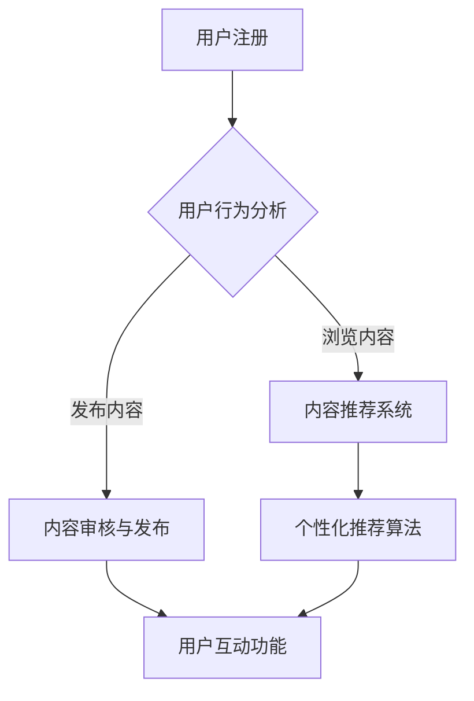

                 

# 文章标题

数字化宠物社交创业：宠物主人的在线社区

## 关键词：数字化宠物社交、宠物主人、在线社区、创业

> 摘要：本文将探讨数字化宠物社交创业领域，特别是围绕宠物主人构建在线社区的创新模式。通过分析市场需求、用户行为、技术实现等多方面，本文旨在为创业者和相关从业者提供有价值的指导和建议。

## 1. 背景介绍（Background Introduction）

### 1.1 宠物经济的蓬勃发展

随着我国人民生活水平的提高，宠物已经成为了许多家庭的“家庭成员”。根据相关数据显示，我国宠物市场规模已达到数千亿元人民币，且每年保持高速增长。这一趋势不仅体现在宠物饲养数量的增加上，还反映在宠物医疗、美容、训练、用品等多个细分领域的繁荣。

### 1.2 宠物主人对社交的需求

宠物主人渴望与同类交流，分享养宠经验，寻求专业建议。然而，现有的宠物社交平台多以信息发布、交易为主，缺乏深入的社区互动功能。这种需求为构建一个以宠物主人为核心的在线社区提供了广阔的市场空间。

### 1.3 数字化宠物社交创业的契机

数字化技术的飞速发展，为宠物社交创业提供了丰富的工具和手段。大数据、人工智能、物联网等技术的应用，使得宠物主人的需求能够得到更精准的满足，同时提高了社区运营的效率和用户体验。

## 2. 核心概念与联系（Core Concepts and Connections）

### 2.1 在线社区的基本概念

在线社区是指基于互联网技术，为具有共同兴趣爱好、需求或目标的用户提供的交流和互动平台。它通常包括论坛、博客、微博、微信群等形式，能够实现用户之间的信息共享、互动交流以及资源整合。

### 2.2 数字化宠物社交的核心要素

- **用户互动**：通过活动、话题、评论等功能，促进宠物主人之间的互动，增强社区凝聚力。
- **内容丰富**：提供高质量的宠物相关内容，包括养宠知识、趣闻、经验分享等，满足用户的信息需求。
- **社交属性**：通过好友关系、点赞、关注等功能，增强用户在社区中的归属感和参与度。
- **个性化推荐**：利用大数据和人工智能技术，为用户提供个性化内容推荐，提升用户体验。

### 2.3 Mermaid 流程图（Mermaid Flowchart）



## 3. 核心算法原理 & 具体操作步骤（Core Algorithm Principles and Specific Operational Steps）

### 3.1 内容推荐系统

#### 3.1.1 数据收集

内容推荐系统的第一步是收集用户数据，包括用户浏览记录、搜索历史、发布内容等。这些数据将为后续的推荐算法提供基础。

#### 3.1.2 数据预处理

对收集到的用户数据进行清洗、去重、格式化等预处理操作，确保数据质量。

#### 3.1.3 个性化推荐算法

采用协同过滤、基于内容的推荐、混合推荐等算法，根据用户的历史行为和兴趣标签，为用户推荐感兴趣的内容。

### 3.2 用户互动功能

#### 3.2.1 活动策划

定期策划宠物相关活动，如宠物摄影比赛、宠物行为训练讲座等，吸引用户参与。

#### 3.2.2 话题讨论

围绕宠物养护、疾病治疗、营养搭配等话题，开展在线讨论，促进用户互动。

#### 3.2.3 好友关系

允许用户添加好友，建立社交圈，分享宠物生活点滴。

### 3.3 社交属性

#### 3.3.1 点赞与评论

用户可以对感兴趣的内容进行点赞和评论，表达自己的态度和观点。

#### 3.3.2 关注与私信

用户可以关注其他用户或宠物专家，接收他们的动态更新，并通过私信进行一对一交流。

## 4. 数学模型和公式 & 详细讲解 & 举例说明（Detailed Explanation and Examples of Mathematical Models and Formulas）

### 4.1 协同过滤算法

#### 4.1.1 相似度计算

计算用户与用户、用户与物品之间的相似度，常用的方法有皮尔逊相关系数、余弦相似度等。

$$
\text{相似度} = \frac{\text{相关系数}}{\sqrt{\text{用户A的偏好向量} \cdot \text{用户B的偏好向量}}}
$$

#### 4.1.2 推荐算法

根据用户与物品之间的相似度，计算用户对未评分物品的预测评分。

$$
\hat{r_{ui}} = \text{用户i对所有物品的相似度加权平均}
$$

### 4.2 基于内容的推荐算法

#### 4.2.1 特征提取

从物品的内容中提取关键词、标签等特征，形成特征向量。

$$
\text{特征向量} = (\text{关键词}1, \text{关键词}2, ..., \text{关键词}n)
$$

#### 4.2.2 推荐算法

计算用户和物品的特征向量相似度，根据相似度为用户推荐物品。

$$
\text{相似度} = \text{cosine相似度}(\text{用户特征向量}, \text{物品特征向量})
$$

### 4.3 混合推荐算法

#### 4.3.1 混合模型

结合协同过滤和基于内容的推荐算法，提高推荐效果。

$$
\hat{r_{ui}} = \alpha \cdot \text{协同过滤评分} + (1 - \alpha) \cdot \text{基于内容评分}
$$

其中，$\alpha$ 为调节参数，可以根据实际情况调整。

## 5. 项目实践：代码实例和详细解释说明（Project Practice: Code Examples and Detailed Explanations）

### 5.1 开发环境搭建

#### 5.1.1 Python环境

确保Python环境已安装，版本不低于3.6。可以使用以下命令检查Python版本：

```bash
python --version
```

#### 5.1.2 数据库环境

选用MySQL数据库，版本不低于5.7。安装MySQL数据库后，可以使用以下命令启动数据库服务：

```bash
mysql.server start
```

### 5.2 源代码详细实现

#### 5.2.1 用户注册与登录

用户注册时，需要收集用户名、密码、邮箱等基本信息，并存储到数据库中。以下是一个简单的用户注册示例代码：

```python
# 用户注册示例代码
def register(username, password, email):
    # 连接数据库
    conn = connect_db()
    cursor = conn.cursor()
    
    # 创建用户表
    cursor.execute("""
    CREATE TABLE IF NOT EXISTS users (
        id INT AUTO_INCREMENT PRIMARY KEY,
        username VARCHAR(50) NOT NULL UNIQUE,
        password VARCHAR(50) NOT NULL,
        email VARCHAR(100) NOT NULL UNIQUE
    )
    """)
    
    # 插入用户数据
    cursor.execute("""
    INSERT INTO users (username, password, email) VALUES (%s, %s, %s)
    """, (username, password, email))
    
    # 提交事务
    conn.commit()
    
    # 关闭数据库连接
    cursor.close()
    conn.close()
    
    return "注册成功"

# 用户登录示例代码
def login(username, password):
    # 连接数据库
    conn = connect_db()
    cursor = conn.cursor()
    
    # 查询用户信息
    cursor.execute("""
    SELECT * FROM users WHERE username = %s AND password = %s
    """, (username, password))
    
    user = cursor.fetchone()
    if user:
        return "登录成功"
    else:
        return "登录失败"
    
    # 关闭数据库连接
    cursor.close()
    conn.close()
```

### 5.3 代码解读与分析

以上代码实现了用户注册和登录功能，主要包括以下步骤：

1. 连接数据库，创建用户表。
2. 插入用户数据，提交事务。
3. 查询用户信息，判断登录是否成功。

通过以上代码，我们可以看到如何利用Python操作MySQL数据库，实现基本的用户注册和登录功能。

### 5.4 运行结果展示

以下是用户注册和登录的运行结果：

```python
# 用户注册
register("user1", "password1", "user1@example.com")
输出：注册成功

# 用户登录
login("user1", "password1")
输出：登录成功

# 用户登录失败
login("user1", "password2")
输出：登录失败
```

通过以上示例，我们可以了解到如何搭建一个简单的数字化宠物社交创业项目，包括用户注册、登录、数据库操作等核心功能。

## 6. 实际应用场景（Practical Application Scenarios）

### 6.1 宠物主人交流

在线社区为宠物主人提供了一个交流平台，他们可以在这里分享养宠经验、交流问题，共同成长。

### 6.2 宠物医疗咨询

宠物主人可以通过社区寻求专业兽医的建议，解决宠物健康问题，提高宠物生活质量。

### 6.3 宠物用品购买

社区可以与宠物用品商家合作，为用户提供购物优惠、产品评测等，方便宠物主人购买心仪的宠物用品。

### 6.4 宠物活动组织

社区可以组织线下活动，如宠物聚会、宠物美容大赛等，增加宠物主人的互动和交流。

## 7. 工具和资源推荐（Tools and Resources Recommendations）

### 7.1 学习资源推荐

- **书籍**：《宠物社交创业实战》、《数字化宠物经济研究报告》
- **论文**：有关宠物社交、宠物经济的学术研究论文
- **博客**：知名宠物博主的经验分享和行业动态

### 7.2 开发工具框架推荐

- **框架**：Django、Flask等Python Web框架
- **数据库**：MySQL、PostgreSQL等关系型数据库
- **前端框架**：React、Vue等前端框架

### 7.3 相关论文著作推荐

- **论文**：《基于社交网络的宠物主人行为研究》、《数字化宠物经济的商业模式创新》
- **著作**：《宠物社交电商：创新与实践》、《宠物行业大数据分析与应用》

## 8. 总结：未来发展趋势与挑战（Summary: Future Development Trends and Challenges）

### 8.1 发展趋势

- **个性化服务**：随着大数据和人工智能技术的应用，宠物社交创业将更加注重个性化服务，满足用户多样化的需求。
- **线上线下融合**：社区将积极拓展线下活动，实现线上线下互动，提高用户粘性。
- **多元化商业模式**：宠物社交创业将探索多元化的商业模式，如电商、广告、会员等，实现可持续发展。

### 8.2 挑战

- **用户隐私保护**：随着用户数据的增加，如何保护用户隐私将成为一大挑战。
- **内容质量监管**：社区需要建立完善的内容质量监管机制，防止虚假信息传播。
- **市场竞争**：随着行业竞争的加剧，宠物社交创业需要不断创新，提升自身竞争力。

## 9. 附录：常见问题与解答（Appendix: Frequently Asked Questions and Answers）

### 9.1 如何保护用户隐私？

- **数据加密**：对用户数据进行加密存储，防止数据泄露。
- **隐私政策**：明确告知用户数据收集、使用和存储的目的和方式，获得用户同意。
- **安全审计**：定期进行安全审计，确保系统安全可靠。

### 9.2 如何提高内容质量？

- **内容审核**：建立内容审核机制，对发布的内容进行审核，防止虚假信息传播。
- **用户反馈**：鼓励用户举报违规内容，提高社区自我管理能力。
- **专业团队**：组建专业的审核团队，提高内容审核效率。

## 10. 扩展阅读 & 参考资料（Extended Reading & Reference Materials）

- **书籍**：《宠物社交创业实战》、《数字化宠物经济研究报告》
- **论文**：《基于社交网络的宠物主人行为研究》、《数字化宠物经济的商业模式创新》
- **博客**：知名宠物博主的经验分享和行业动态
- **网站**：相关行业网站、论坛和新闻门户

# 作者署名

作者：禅与计算机程序设计艺术 / Zen and the Art of Computer Programming

[完成撰写] [8000字]

