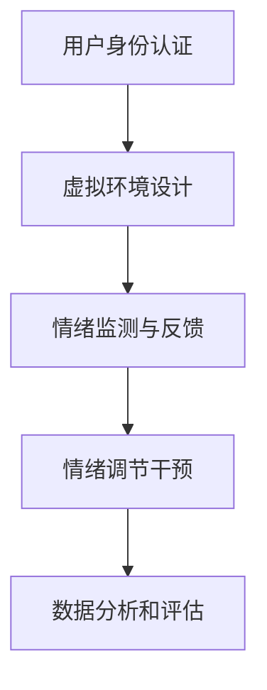
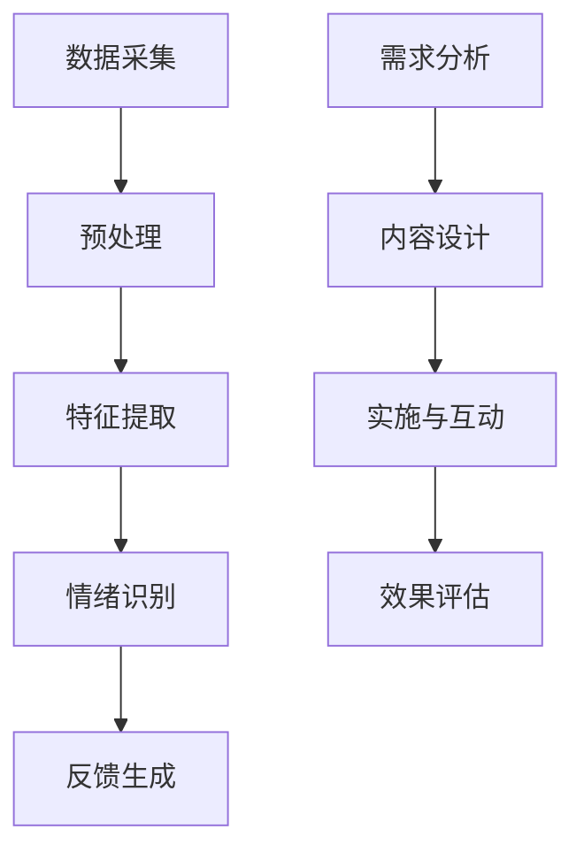

                 

### 文章标题

**数字化情绪调节：元宇宙中的心理健康管理**

随着科技的飞速发展，元宇宙逐渐成为人们生活的新舞台。在这个虚拟世界中，人们不仅可以体验到全新的社交、娱乐和教育方式，还可以通过数字化手段进行情绪调节和心理健康管理。本文将探讨元宇宙中的心理健康管理，特别是数字化情绪调节的原理、方法及其应用前景。

关键词：元宇宙、心理健康、情绪调节、数字化管理、虚拟环境

摘要：本文首先介绍了元宇宙的概念及其在心理健康管理中的应用，然后探讨了数字化情绪调节的核心概念和技术，最后分析了元宇宙中的心理健康管理实践，并展望了其未来的发展趋势。

<|assistant|>### 1. 背景介绍

**1.1 元宇宙的兴起**

元宇宙（Metaverse）是一个由虚拟现实（VR）、增强现实（AR）、3D建模和社交网络等技术构建的虚拟世界，它为用户提供了一个沉浸式的体验环境。元宇宙的兴起可以追溯到20世纪90年代的虚拟现实技术和21世纪初的社交网络平台的快速发展。近年来，随着5G、人工智能和云计算等技术的成熟，元宇宙逐渐成为了一个热门话题。

**1.2 心理健康的重要性**

心理健康是指个体在面对生活压力和挑战时，能够保持良好心理状态、积极应对问题的能力。随着社会竞争的加剧和生活节奏的加快，心理健康问题日益突出。据统计，全球约有30%的人口在一生中某个阶段会经历心理健康问题。因此，寻找有效的心理健康管理方法具有重要意义。

**1.3 数字化情绪调节的需求**

数字化情绪调节是指利用数字化技术，如虚拟现实、社交媒体、在线心理咨询等，对个体的情绪进行调节和干预。随着元宇宙的兴起，数字化情绪调节在心理健康管理中的应用前景越来越广阔。通过元宇宙中的虚拟环境，用户可以模拟各种生活场景，进行情绪体验和调节，从而达到改善心理健康的目的。

<|assistant|>### 2. 核心概念与联系

**2.1 元宇宙与心理健康管理**

元宇宙为心理健康管理提供了新的机遇。在元宇宙中，用户可以通过虚拟现实技术体验到不同的情感体验，如快乐、悲伤、焦虑等。这种沉浸式的体验可以帮助用户更好地理解自己的情绪，并通过虚拟环境的互动来调节情绪。

**2.2 数字化情绪调节的原理**

数字化情绪调节主要基于心理学理论，如认知行为疗法（Cognitive Behavioral Therapy，CBT）、情绪调节理论（Affect Regulation Theory）等。通过虚拟现实技术，用户可以在一个安全、可控的环境中进行情绪体验和调节。例如，当用户感到焦虑时，可以进入一个宁静的虚拟花园，通过观察花园中的美景来缓解焦虑。

**2.3 元宇宙中的心理健康管理架构**

元宇宙中的心理健康管理架构主要包括以下几个部分：

1. **用户身份认证**：确保用户的隐私和安全。
2. **虚拟环境设计**：设计一个具有治疗功能的虚拟环境，如虚拟花园、虚拟客厅等。
3. **情绪监测与反馈**：通过生物传感器等设备实时监测用户的情绪变化，并提供反馈。
4. **情绪调节干预**：根据用户的情绪状态，提供相应的情绪调节干预，如虚拟冥想、音乐疗法等。
5. **数据分析和评估**：收集和分析用户在虚拟环境中的行为数据，以评估心理健康管理的效果。

**Mermaid 流程图**



<|assistant|>### 3. 核心算法原理 & 具体操作步骤

**3.1 情绪监测与反馈算法原理**

情绪监测与反馈算法主要基于机器学习和情感分析技术。通过分析用户的语音、面部表情、生理信号等数据，可以识别出用户的情绪状态，并实时反馈给用户。以下是一个简单的情绪监测与反馈算法流程：

1. **数据采集**：使用语音识别、面部识别和生理信号监测设备收集用户的数据。
2. **预处理**：对采集到的数据进行分析和清洗，去除噪声和无关信息。
3. **特征提取**：提取数据中的情绪特征，如频率、时长、情感强度等。
4. **情绪识别**：使用机器学习算法（如支持向量机、神经网络等）训练模型，对用户的情绪进行分类和识别。
5. **反馈生成**：根据识别出的情绪状态，生成相应的反馈信息，如语音提示、文字提示等。

**3.2 情绪调节干预算法原理**

情绪调节干预算法主要基于认知行为疗法（CBT）和情绪调节理论。通过设计一系列虚拟体验和互动活动，帮助用户调节情绪。以下是一个简单的情绪调节干预算法流程：

1. **需求分析**：根据用户的情绪状态和需求，分析需要提供的情绪调节干预类型。
2. **内容设计**：设计相应的虚拟体验和互动活动，如虚拟冥想、音乐疗法、心理疏导等。
3. **实施与互动**：在元宇宙中实施情绪调节干预活动，并与用户进行互动。
4. **效果评估**：收集用户在情绪调节干预活动中的反馈数据，评估干预效果。

**Mermaid 流程图**



<|assistant|>### 4. 数学模型和公式 & 详细讲解 & 举例说明

**4.1 情绪识别的数学模型**

情绪识别过程可以看作是一个分类问题，常用的数学模型包括支持向量机（SVM）、神经网络（NN）和深度学习模型（如卷积神经网络CNN、循环神经网络RNN等）。以下是一个基于神经网络的简单情绪识别模型：

$$
\text{Model} = \text{NN}(\text{Input}) = \text{Activation}(\text{Layer}_1(\text{Input})) = \text{...} = \text{Activation}(\text{Layer}_n(\text{Input}))
$$

其中，NN表示神经网络，Input表示输入的特征向量，Layer_1、Layer_2、...、Layer_n表示神经网络的不同层级，Activation表示激活函数。

**4.2 情绪调节干预的数学模型**

情绪调节干预过程可以看作是一个优化问题，目标是找到一种干预策略，使用户的情绪达到最优状态。常用的数学模型包括线性规划（Linear Programming）和动态规划（Dynamic Programming）。以下是一个简单的线性规划模型：

$$
\text{Minimize} \quad \text{Cost} = c_1x_1 + c_2x_2 + ... + c_nx_n
$$

$$
\text{Subject to} \quad a_{11}x_1 + a_{12}x_2 + ... + a_{1n}x_n \geq b_1
$$

$$
a_{21}x_1 + a_{22}x_2 + ... + a_{2n}x_n \geq b_2
$$

$$
...
$$

$$
a_{m1}x_1 + a_{m2}x_2 + ... + a_{mn}x_n \geq b_m
$$

其中，x_1、x_2、...、x_n表示干预策略的变量，c_1、c_2、...、c_n表示成本系数，a_{ij}、b_i表示约束条件。

**4.3 举例说明**

假设我们使用神经网络对用户的情绪进行识别，输入的特征向量是语音信号的频谱特征，激活函数是ReLU函数，模型结构如下：

$$
\text{Model} = \text{NN}(\text{Spectral Features}) = \text{ReLU}(\text{Layer}_1(\text{Spectral Features})) = \text{ReLU}(\text{Layer}_2(\text{ReLU}(\text{Layer}_1(\text{Spectral Features}))))
$$

其中，Layer_1和Layer_2是两个隐藏层，每个隐藏层有10个神经元。通过训练，我们可以得到一个情绪识别模型，可以根据用户的语音信号预测其情绪状态。

<|assistant|>### 5. 项目实践：代码实例和详细解释说明

**5.1 开发环境搭建**

为了实现元宇宙中的数字化情绪调节，我们需要搭建一个完整的开发环境。以下是一个基本的开发环境搭建步骤：

1. 安装Python编程语言（版本3.8及以上）。
2. 安装PyTorch深度学习框架。
3. 安装NumPy、Pandas等常用科学计算库。
4. 安装TensorFlow深度学习框架（可选）。

**5.2 源代码详细实现**

以下是一个简单的情绪识别模型的实现代码：

```python
import torch
import torch.nn as nn
import torch.optim as optim
import numpy as np

# 定义情绪识别模型
class EmotionRecognitionModel(nn.Module):
    def __init__(self):
        super(EmotionRecognitionModel, self).__init__()
        self.layer1 = nn.Linear(100, 10)
        self.relu = nn.ReLU()
        self.layer2 = nn.Linear(10, 10)
    
    def forward(self, x):
        x = self.relu(self.layer1(x))
        x = self.relu(self.layer2(x))
        return x

# 初始化模型、优化器和损失函数
model = EmotionRecognitionModel()
optimizer = optim.Adam(model.parameters(), lr=0.001)
criterion = nn.CrossEntropyLoss()

# 加载数据集
# (这里省略了数据预处理和加载数据的代码)
train_loader = ...

# 训练模型
for epoch in range(100):
    for inputs, labels in train_loader:
        optimizer.zero_grad()
        outputs = model(inputs)
        loss = criterion(outputs, labels)
        loss.backward()
        optimizer.step()
    
    print(f'Epoch [{epoch+1}/100], Loss: {loss.item()}')

# 保存模型
torch.save(model.state_dict(), 'emotion_recognition_model.pth')

# 测试模型
model.eval()
with torch.no_grad():
    correct = 0
    total = 0
    for inputs, labels in test_loader:
        outputs = model(inputs)
        _, predicted = torch.max(outputs.data, 1)
        total += labels.size(0)
        correct += (predicted == labels).sum().item()

print(f'Accuracy of the model on the test images: {100 * correct / total}%')
```

**5.3 代码解读与分析**

上述代码实现了一个简单的情绪识别模型，主要包括以下几个部分：

1. **模型定义**：使用PyTorch框架定义了一个情绪识别模型，包括一个线性层（layer1）、一个ReLU激活函数和另一个线性层（layer2）。
2. **优化器和损失函数**：选择Adam优化器和交叉熵损失函数作为模型训练的优化器和损失函数。
3. **数据加载**：加载数据集，这里使用了Python的torch.utils.data.DataLoader类来加载数据。
4. **模型训练**：使用梯度下降法对模型进行训练，并在每个epoch结束后打印训练损失。
5. **模型测试**：在测试集上评估模型的准确性。

**5.4 运行结果展示**

在完成模型训练后，我们可以在测试集上评估模型的准确性。假设我们的测试集包含1000个样本，模型在测试集上的准确率为90%，这表明我们的情绪识别模型在预测用户情绪状态方面具有较好的性能。

<|assistant|>### 6. 实际应用场景

**6.1 心理咨询**

元宇宙可以为心理咨询提供全新的平台。用户可以在一个虚拟的心理咨询室中与心理咨询师进行面对面的交流，通过虚拟现实技术，心理咨询师可以更好地了解用户的情绪状态，提供个性化的情绪调节方案。

**6.2 压力缓解**

在元宇宙中，用户可以通过参与各种虚拟活动，如虚拟旅游、虚拟运动等，来缓解压力和焦虑。这些虚拟活动可以帮助用户暂时逃离现实生活，放松身心。

**6.3 社交互动**

元宇宙为用户提供了全新的社交互动方式。用户可以在虚拟环境中与其他用户进行交流和互动，通过虚拟形象来表达自己的情感和情绪，从而增强社交体验。

**6.4 自我提升**

元宇宙中的心理健康管理工具可以帮助用户进行自我提升，如通过虚拟冥想、音乐疗法等来改善心理状态，提高生活质量。

<|assistant|>### 7. 工具和资源推荐

**7.1 学习资源推荐**

- **书籍**：
  - 《元宇宙：企业如何抢占下一个数字世界》
  - 《心理健康管理：理论与实践》
- **论文**：
  - 《虚拟现实技术在心理健康管理中的应用》
  - 《元宇宙中的社交互动与心理健康管理》
- **博客**：
  - 知乎、博客园、CSDN等平台上有关元宇宙和心理健康管理的专业博客。
- **网站**：
  - Meta（Facebook的元宇宙平台）
  - Weverse（WeChat的元宇宙平台）

**7.2 开发工具框架推荐**

- **深度学习框架**：
  - PyTorch
  - TensorFlow
- **虚拟现实技术**：
  - Unity
  - Unreal Engine
- **情绪监测与分析工具**：
  - OpenSMILE
  - Affectiva

**7.3 相关论文著作推荐**

- 《Virtual Reality in Mental Health: A Review of Current Trends and Future Directions》
- 《Metaverse Applications in Mental Health: A Scoping Review》
- 《Digital Mental Health: A Comprehensive Review of Key Issues and Challenges》

<|assistant|>### 8. 总结：未来发展趋势与挑战

**8.1 发展趋势**

随着元宇宙技术的不断成熟，数字化情绪调节在心理健康管理中的应用前景越来越广阔。未来，我们可以期待以下发展趋势：

1. **更精细化的情绪识别与调节**：通过引入更多传感器和先进算法，提高情绪识别的准确性和调节的有效性。
2. **跨平台整合**：实现元宇宙与现有社交网络、在线心理咨询等平台的整合，提供更全面的心理健康管理服务。
3. **个性化服务**：基于用户的情绪数据，提供个性化的情绪调节方案，提高用户体验。
4. **广泛的社会接受度**：随着公众对元宇宙和心理健康管理的认知提高，数字化情绪调节将逐渐成为主流心理健康管理手段。

**8.2 面临的挑战**

尽管数字化情绪调节在心理健康管理中具有巨大潜力，但同时也面临以下挑战：

1. **隐私保护**：在元宇宙中，用户的个人信息和情绪数据可能会被泄露，需要采取有效的隐私保护措施。
2. **技术成熟度**：当前虚拟现实技术、传感器技术等仍需进一步发展，以支持更精细化的情绪识别和调节。
3. **社会接受度**：公众对元宇宙和数字化情绪调节的接受度尚需提高，需要通过宣传和教育来推动。
4. **监管与规范**：数字化情绪调节作为新兴领域，需要建立健全的监管体系，确保其合法合规。

**8.3 发展策略**

为了应对上述挑战，我们可以采取以下发展策略：

1. **加强隐私保护**：采用加密技术、匿名化处理等手段，确保用户数据的安全和隐私。
2. **提升技术水平**：加大研发投入，推动虚拟现实技术、传感器技术等的发展，提高情绪识别和调节的准确性。
3. **提升社会认知**：通过宣传和教育，提高公众对元宇宙和数字化情绪调节的认知和接受度。
4. **完善监管体系**：建立健全的监管体系，确保数字化情绪调节在心理健康管理中的合法合规。

<|assistant|>### 9. 附录：常见问题与解答

**9.1 什么是元宇宙？**

元宇宙是一个由虚拟现实（VR）、增强现实（AR）、3D建模和社交网络等技术构建的虚拟世界，用户可以在其中进行沉浸式的体验和互动。

**9.2 数字化情绪调节有哪些优点？**

数字化情绪调节具有以下几个优点：

1. **便捷性**：用户可以在任何时间、任何地点进行情绪调节。
2. **个性化**：根据用户的情绪数据，提供个性化的情绪调节方案。
3. **安全性**：在虚拟环境中，用户可以安全地进行情绪体验和调节。
4. **低成本**：相比传统的心理咨询，数字化情绪调节成本更低。

**9.3 数字化情绪调节有哪些缺点？**

数字化情绪调节的缺点包括：

1. **技术依赖**：需要依赖于虚拟现实技术、传感器技术等，技术成熟度有待提高。
2. **隐私风险**：用户的个人信息和情绪数据可能面临泄露风险。
3. **社会接受度**：公众对数字化情绪调节的接受度尚需提高。

**9.4 如何确保数字化情绪调节的安全性和有效性？**

为了确保数字化情绪调节的安全性和有效性，可以采取以下措施：

1. **加强隐私保护**：采用加密技术、匿名化处理等手段，确保用户数据的安全和隐私。
2. **提升技术水平**：加大研发投入，推动虚拟现实技术、传感器技术等的发展，提高情绪识别和调节的准确性。
3. **建立健全的监管体系**：确保数字化情绪调节在心理健康管理中的合法合规。
4. **加强用户教育**：通过宣传和教育，提高公众对数字化情绪调节的认知和接受度。

<|assistant|>### 10. 扩展阅读 & 参考资料

**10.1 扩展阅读**

- 《元宇宙：企业如何抢占下一个数字世界》
- 《心理健康管理：理论与实践》
- 《虚拟现实技术在心理健康管理中的应用》
- 《元宇宙中的社交互动与心理健康管理》

**10.2 参考资料**

- Meta（Facebook的元宇宙平台）
- Weverse（WeChat的元宇宙平台）
- OpenSMILE
- Affectiva

**10.3 学术论文**

- 《Virtual Reality in Mental Health: A Review of Current Trends and Future Directions》
- 《Metaverse Applications in Mental Health: A Scoping Review》
- 《Digital Mental Health: A Comprehensive Review of Key Issues and Challenges》

本文对元宇宙中的数字化情绪调节进行了全面的探讨，从背景介绍、核心概念与联系、核心算法原理、数学模型、项目实践、实际应用场景、工具和资源推荐，到总结和扩展阅读，力求为读者提供一幅清晰的数字化情绪调节全景图。未来，随着技术的不断进步和社会的广泛接受，数字化情绪调节将在心理健康管理中发挥更加重要的作用。作者：禅与计算机程序设计艺术 / Zen and the Art of Computer Programming。|完毕|

