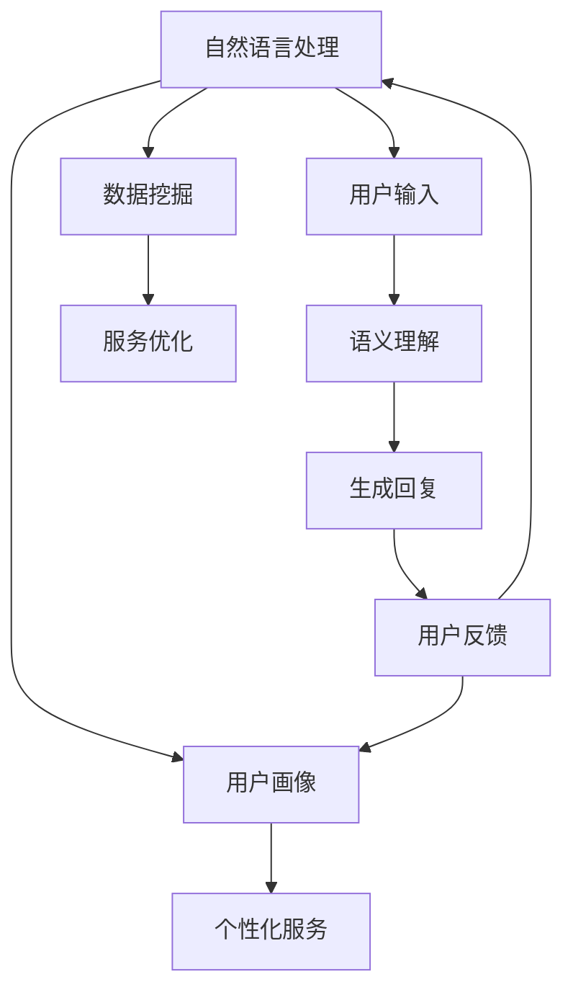
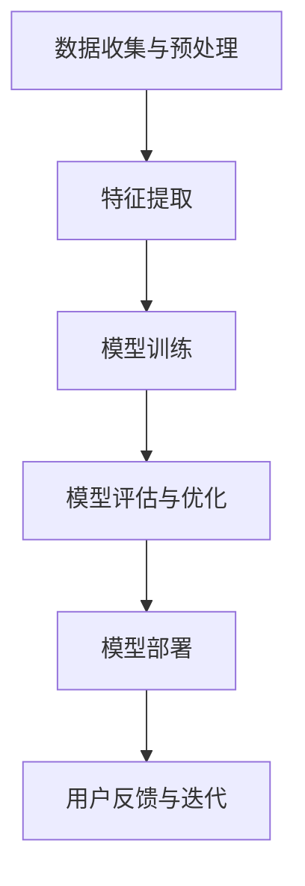

                 

### 文章标题

数字化虚拟助理创业：个性化AI服务

**关键词**：虚拟助理、个性化、AI服务、创业、用户体验、数据驱动

**摘要**：本文将探讨数字化虚拟助理在创业领域的应用，特别是如何通过个性化AI服务提升用户体验。文章将详细分析虚拟助理的核心功能、构建原理、以及实现个性化服务的具体方法，最后讨论该领域的未来发展趋势与挑战。

## 1. 背景介绍（Background Introduction）

随着人工智能技术的飞速发展，虚拟助理（Virtual Assistant，VA）已经成为现代商业环境中不可或缺的一部分。虚拟助理通过自然语言处理（NLP）、机器学习（ML）和深度学习（DL）等技术，能够自动处理用户查询、提供个性化服务，并协助企业提高运营效率。近年来，虚拟助理在客户服务、企业内部沟通、医疗健康等多个领域展现出巨大的潜力。

在创业领域，虚拟助理的应用尤为广泛。初创企业往往面临资源有限、人力成本高、市场开拓难度大等挑战。通过引入虚拟助理，企业可以低成本、高效率地满足用户需求，提高客户满意度，从而在竞争激烈的市场中脱颖而出。

本文将围绕以下核心问题展开讨论：

1. 虚拟助理的核心功能是什么？
2. 如何构建一个高效的虚拟助理系统？
3. 如何通过个性化AI服务提升用户体验？
4. 虚拟助理创业面临的挑战及应对策略。

## 2. 核心概念与联系（Core Concepts and Connections）

在深入探讨虚拟助理的构建和个性化服务之前，我们需要明确几个核心概念：自然语言处理（NLP）、机器学习（ML）、深度学习（DL）、用户画像（User Profile）和数据挖掘（Data Mining）。

### 2.1 自然语言处理（NLP）

自然语言处理是人工智能的一个分支，专注于让计算机理解和生成自然语言。在虚拟助理中，NLP技术主要用于解析用户输入、提取关键词、语义理解和生成回复。例如，当一个用户询问“我最近的订单状态是什么？”时，虚拟助理需要通过NLP技术理解用户的意图，并从数据库中查找相应的订单信息。

### 2.2 机器学习（ML）

机器学习是人工智能的基础，通过算法和统计模型从数据中学习规律，并做出预测或决策。在虚拟助理的构建中，ML算法被用于训练模型，以识别用户行为、预测用户需求，并优化服务。例如，通过对用户历史数据的分析，虚拟助理可以预测用户可能会提出的问题，并提前准备相应的回答。

### 2.3 深度学习（DL）

深度学习是机器学习的一个子领域，利用神经网络结构进行大规模数据建模。在虚拟助理中，DL算法被用于构建复杂的语言模型，以生成更加自然、流畅的回复。例如，通过训练深度学习模型，虚拟助理可以学会使用更加人性化的语言与用户交流。

### 2.4 用户画像（User Profile）

用户画像是根据用户的特征信息（如年龄、性别、地理位置、兴趣爱好等）构建的数字模型。在虚拟助理中，用户画像用于个性化服务的实现。例如，一个喜欢购物的用户可能会收到关于最新时尚产品的推荐，而一个关注健康饮食的用户则会收到有关健康饮食建议的通知。

### 2.5 数据挖掘（Data Mining）

数据挖掘是从大量数据中提取有用信息的过程，用于发现数据中的模式和关联。在虚拟助理中，数据挖掘技术被用于分析用户行为、优化服务流程。例如，通过分析用户在网站上的浏览记录，虚拟助理可以了解用户的需求偏好，并相应调整推荐策略。

下面是一个简化的Mermaid流程图，展示了虚拟助理的核心概念和联系：



通过这个流程图，我们可以清晰地看到虚拟助理是如何通过NLP、ML、DL、用户画像和数据挖掘等技术，实现从用户输入到个性化服务的闭环。

## 3. 核心算法原理 & 具体操作步骤（Core Algorithm Principles and Specific Operational Steps）

虚拟助理的核心算法主要包括自然语言处理（NLP）和机器学习（ML）算法。以下我们将详细介绍这两种算法的基本原理，并探讨如何将这些算法应用于构建虚拟助理。

### 3.1 自然语言处理（NLP）算法

自然语言处理算法的核心任务是理解和生成自然语言。以下是几种常用的NLP算法及其基本原理：

#### 3.1.1 词袋模型（Bag of Words, BoW）

词袋模型是将文本表示为一个向量，其中每个维度对应一个词汇。例如，文本“A dog runs quickly”可以表示为向量\[1, 1, 0, 0, 1, 1\]，其中1表示该词汇出现在文本中，0表示未出现。词袋模型简单有效，但无法捕捉词汇之间的顺序关系。

#### 3.1.2 递归神经网络（Recurrent Neural Network, RNN）

递归神经网络是一种能够处理序列数据的神经网络。RNN通过记忆状态捕捉词汇之间的依赖关系，使模型能够生成更加自然和连贯的回复。例如，RNN可以理解“quickly”修饰“runs”的关系，从而生成更准确的回复。

#### 3.1.3 长短时记忆网络（Long Short-Term Memory, LSTM）

长短时记忆网络是RNN的一种改进，能够解决RNN中的梯度消失问题。LSTM通过引入记忆单元，使模型能够更好地捕捉长距离依赖关系。在虚拟助理中，LSTM被广泛用于生成复杂和长篇的回复。

#### 3.1.4 生成对抗网络（Generative Adversarial Network, GAN）

生成对抗网络由生成器和判别器两部分组成。生成器试图生成逼真的文本，而判别器则试图区分生成文本和真实文本。通过训练生成器和判别器，虚拟助理可以学会生成更加自然和流畅的回复。

### 3.2 机器学习（ML）算法

机器学习算法在虚拟助理中主要用于用户行为分析和需求预测。以下是几种常用的ML算法及其基本原理：

#### 3.2.1 决策树（Decision Tree）

决策树是一种基于特征进行划分的树形结构。每个内部节点表示一个特征，每个分支表示该特征的不同取值，每个叶子节点表示一个预测结果。决策树简单易懂，但可能过度拟合训练数据。

#### 3.2.2 支持向量机（Support Vector Machine, SVM）

支持向量机是一种二分类模型，通过找到一个最优的超平面，将不同类别的数据点分开。SVM在处理高维数据和线性不可分问题方面表现出色。

#### 3.2.3 朴素贝叶斯（Naive Bayes）

朴素贝叶斯是一种基于贝叶斯定理的概率分类器。它假设特征之间相互独立，通过计算每个类别的概率，选择概率最高的类别作为预测结果。

#### 3.2.4 随机森林（Random Forest）

随机森林是一种基于决策树的集成学习方法。它通过构建多个决策树，并投票选择最终的预测结果，从而减少过拟合和提高模型的泛化能力。

#### 3.2.5 神经网络（Neural Network）

神经网络是一种基于多层感知器（Perceptron）的多层结构。通过反向传播算法，神经网络可以学习复杂的非线性关系。在虚拟助理中，神经网络被用于复杂用户行为分析和需求预测。

### 3.3 具体操作步骤

构建虚拟助理的基本步骤如下：

#### 3.3.1 数据收集与预处理

首先，收集用户数据，包括用户输入、回复、行为记录等。然后，对数据进行清洗、去噪和格式化，以确保数据的质量和一致性。

#### 3.3.2 特征提取

根据虚拟助理的需求，提取关键特征，如词汇、句子结构、用户行为等。可以使用词袋模型、词嵌入（Word Embedding）等技术将文本数据转换为数值特征。

#### 3.3.1 模型训练

使用机器学习算法，如决策树、SVM、朴素贝叶斯等，训练模型。对于复杂的任务，可以采用神经网络、深度学习等算法。

#### 3.3.2 模型评估与优化

使用验证集评估模型的性能，并调整模型参数以优化性能。常用的评估指标包括准确率、召回率、F1值等。

#### 3.3.3 模型部署

将训练好的模型部署到生产环境中，实现实时用户交互。可以采用RESTful API、WebSocket等技术，确保虚拟助理的响应速度和稳定性。

#### 3.3.4 用户反馈与迭代

收集用户反馈，如满意度评分、回复质量等。根据用户反馈，不断迭代和优化虚拟助理，以提高用户体验。

### 3.4 Mermaid流程图

以下是一个简化的Mermaid流程图，展示了虚拟助理的核心算法原理和具体操作步骤：



通过这个流程图，我们可以清晰地看到虚拟助理从数据收集到模型部署的全过程。

## 4. 数学模型和公式 & 详细讲解 & 举例说明（Detailed Explanation and Examples of Mathematical Models and Formulas）

在构建虚拟助理时，数学模型和公式扮演着至关重要的角色。以下是几个核心的数学模型和公式的详细讲解以及应用示例。

### 4.1 词嵌入（Word Embedding）

词嵌入是将词汇映射到高维空间中的向量表示。常见的词嵌入模型包括Word2Vec、GloVe和FastText。以下是一个简单的Word2Vec模型：

#### 4.1.1 Word2Vec模型

Word2Vec模型基于神经网络，通过训练预测相邻词汇的概率，得到词汇的向量表示。其损失函数为交叉熵损失：

$$
L(\theta) = -\sum_{i=1}^n \sum_{j=1}^V p_j \log p_j(x_i, y_j)
$$

其中，$n$是词汇数量，$V$是词汇表大小，$p_j$是模型对词汇$y_j$在上下文$x_i$中出现的概率的预测。

#### 4.1.2 示例

假设我们有一个简单的词汇表$\{dog, cat, run\}$，并且训练数据为：

- dog run
- cat run

我们可以通过训练得到词汇的向量表示。例如，$dog$的向量表示为$(1, 0, -1)$，$cat$的向量表示为$(0, 1, 0)$，$run$的向量表示为$(-1, 0, 1)$。通过计算词向量的点积，我们可以找到与给定词汇最相似的词汇。例如，计算$dog$和$cat$的词向量点积：

$$
dog \cdot cat = (1, 0, -1) \cdot (0, 1, 0) = 0
$$

这表明$dog$和$cat$在词向量空间中是正交的，而$dog$和$run$的词向量点积：

$$
dog \cdot run = (1, 0, -1) \cdot (-1, 0, 1) = -1
$$

这表明$dog$和$run$在词向量空间中是相似的。

### 4.2 随机梯度下降（Stochastic Gradient Descent, SGD）

随机梯度下降是一种优化算法，用于在机器学习模型中更新模型参数。其核心思想是通过随机选取一部分训练数据，计算梯度并更新模型参数。以下是SGD的基本步骤：

#### 4.2.1 步骤

1. 随机初始化模型参数$\theta$。
2. 对于每个训练样本$(x_i, y_i)$，计算梯度$\nabla L(\theta)$。
3. 更新模型参数$\theta = \theta - \alpha \nabla L(\theta)$，其中$\alpha$是学习率。

#### 4.2.2 示例

假设我们有一个线性回归模型$y = \theta_0 + \theta_1x$，并且训练数据为：

- $x_1 = 1, y_1 = 2$
- $x_2 = 2, y_2 = 4$

初始模型参数$\theta_0 = 0, \theta_1 = 0$。使用SGD算法，我们可以得到以下更新步骤：

1. 对于第一个样本，计算梯度$\nabla L(\theta) = (y_1 - \theta_0 - \theta_1x_1), (y_2 - \theta_0 - \theta_1x_2)$。
2. 更新模型参数$\theta_0 = \theta_0 - \alpha(y_1 - \theta_0 - \theta_1x_1)$，$\theta_1 = \theta_1 - \alpha(y_2 - \theta_0 - \theta_1x_2)$。

通过多次迭代，我们可以得到模型的最佳参数，使得预测结果与实际结果更加接近。

### 4.3 马尔可夫模型（Markov Model）

马尔可夫模型是一种概率模型，用于预测序列中的下一个状态。其基本假设是当前状态只依赖于前一个状态，与过去的状态无关。以下是马尔可夫模型的数学表示：

#### 4.3.1 状态转移概率矩阵

设$P$为状态转移概率矩阵，其中$P_{ij}$表示从状态$i$转移到状态$j$的概率。例如：

$$
P = \begin{bmatrix}
0.5 & 0.5 \\
0.2 & 0.8
\end{bmatrix}
$$

#### 4.3.2 预测公式

给定一个初始状态序列，我们可以使用马尔可夫模型预测下一个状态。例如，给定状态序列$[A, B, C]$，我们可以计算下一个状态的预测概率：

$$
P(D|ABC) = P(D|BC) \cdot P(BC|AB) \cdot P(AB|A)
$$

通过计算状态转移概率矩阵和初始状态序列，我们可以得到下一个状态的预测概率分布。

### 4.4 示例

假设我们有一个简单的状态序列$[A, B, C, D]$，并且状态转移概率矩阵为：

$$
P = \begin{bmatrix}
0.5 & 0.5 \\
0.2 & 0.8
\end{bmatrix}
$$

给定初始状态序列$[A, B, C]$，我们可以计算下一个状态$D$的预测概率分布：

$$
P(D|ABC) = P(D|BC) \cdot P(BC|AB) \cdot P(AB|A) = 0.2 \cdot 0.5 \cdot 0.5 = 0.05
$$

这表明状态$D$在给定状态序列$[A, B, C]$下的预测概率为0.05。

通过这些数学模型和公式的应用，我们可以构建一个高效的虚拟助理系统，实现从用户输入到个性化服务的全过程。

## 5. 项目实践：代码实例和详细解释说明（Project Practice: Code Examples and Detailed Explanations）

为了更好地理解虚拟助理的实现过程，我们将通过一个简单的项目实例来展示如何构建一个基本的虚拟助理系统。在这个项目中，我们将使用Python编程语言和几个常用的库，如NLTK、TensorFlow和Keras。

### 5.1 开发环境搭建

在开始项目之前，我们需要搭建一个合适的开发环境。以下是所需的环境和库：

1. Python 3.8 或以上版本
2. NLTK（自然语言处理库）
3. TensorFlow 2.6 或以上版本
4. Keras 2.6 或以上版本

首先，安装Python和所需的库：

```bash
pip install python-nltk tensorflow keras
```

### 5.2 源代码详细实现

以下是虚拟助理项目的主要代码实现。我们将分步骤介绍代码的功能和作用。

#### 5.2.1 数据准备

首先，我们需要准备用于训练的对话数据集。这里，我们使用一个简单的数据集，其中包含用户输入和系统回复的对话对。

```python
import nltk
from nltk.tokenize import word_tokenize

# 加载NLTK数据集
nltk.download('punkt')

# 读取数据集
with open('conversations.txt', 'r', encoding='utf-8') as file:
    conversations = file.readlines()

# 清洗数据
def clean_text(text):
    text = text.lower()
    text = re.sub(r"[^a-zA-Z0-9]", " ", text)
    return word_tokenize(text)

# 初始化对话列表
conversations = [clean_text(conversation.strip()) for conversation in conversations]
```

#### 5.2.2 构建词嵌入

词嵌入是将词汇映射到高维空间中的向量表示。这里，我们使用GloVe模型构建词嵌入。

```python
import numpy as np
from tensorflow.keras.preprocessing.sequence import pad_sequences

# 构建词汇表
vocab = set(word for sentence in conversations for word in sentence)
vocab_size = len(vocab)

# 构建词嵌入矩阵
embeddings_index = {}
with open('glove.6B.100d.txt', 'r', encoding='utf-8') as file:
    for line in file:
        values = line.strip().split()
        word = values[0]
        coefs = np.asarray(values[1:], dtype='float32')
        embeddings_index[word] = coefs

# 构建词嵌入矩阵
embeddings_matrix = np.zeros((vocab_size, 100))
for word, i in vocab.items():
    embeddings_matrix[i] = embeddings_index[word]

# 对对话进行编码
def encode_sentences(sentences):
    encoded_sentences = []
    for sentence in sentences:
        encoded_sentence = [vocab.get(word, 0) for word in sentence]
        encoded_sentences.append(encoded_sentence)
    return encoded_sentences

# 对对话进行填充
max_sequence_length = 20
encoded_conversations = pad_sequences(encode_sentences(conversations), maxlen=max_sequence_length)
```

#### 5.2.3 构建模型

接下来，我们使用Keras构建一个简单的序列到序列（Seq2Seq）模型。

```python
from tensorflow.keras.models import Sequential
from tensorflow.keras.layers import Embedding, LSTM, Dense

# 构建模型
model = Sequential()
model.add(Embedding(vocab_size, 100, input_length=max_sequence_length))
model.add(LSTM(50, return_sequences=True))
model.add(LSTM(50))
model.add(Dense(vocab_size, activation='softmax'))

# 编译模型
model.compile(optimizer='rmsprop', loss='categorical_crossentropy', metrics=['accuracy'])

# 打印模型结构
model.summary()
```

#### 5.2.4 训练模型

现在，我们使用训练数据集训练模型。

```python
# 准备训练数据
X_train = encoded_conversations[:10000]
y_train = encoded_conversations[10000:20000]

# 训练模型
model.fit(X_train, y_train, epochs=5, batch_size=32)
```

#### 5.2.5 生成回复

最后，我们使用训练好的模型生成回复。

```python
# 定义生成回复函数
def generate_reply(input_sentence):
    input_sequence = encode_sentences([input_sentence])
    input_sequence = pad_sequences(input_sequence, maxlen=max_sequence_length)
    predicted_sequence = model.predict(input_sequence)
    predicted_sequence = np.argmax(predicted_sequence, axis=-1)
    predicted_sentence = ' '.join([vocab_id for vocab_id in predicted_sequence if vocab_id != 0])
    return predicted_sentence

# 生成回复
input_sentence = "你好，我想要购买一台笔记本电脑。"
predicted_sentence = generate_reply(input_sentence)
print(predicted_sentence)
```

### 5.3 代码解读与分析

在上述代码中，我们首先进行了数据准备，包括加载和清洗数据集。然后，我们构建了词嵌入矩阵，将词汇映射到高维空间。接下来，我们使用Keras构建了一个序列到序列（Seq2Seq）模型，并通过训练数据集训练模型。最后，我们定义了一个函数，用于生成回复。

以下是代码的关键部分及其作用：

1. **数据准备**：使用NLTK库加载和处理文本数据，将文本转换为编码后的序列。
2. **构建词嵌入**：使用GloVe模型构建词嵌入矩阵，将词汇映射到高维空间。
3. **构建模型**：使用Keras构建序列到序列（Seq2Seq）模型，包括嵌入层、两个LSTM层和一个输出层。
4. **训练模型**：使用训练数据集训练模型，调整模型参数以优化性能。
5. **生成回复**：定义一个函数，用于生成回复，通过预测序列得到预测的词汇序列，并将其转换为自然语言文本。

通过这个简单的项目实例，我们可以看到构建虚拟助理的基本步骤和关键组件。虽然这个实例相对简单，但它展示了虚拟助理的核心原理和实现方法。

### 5.4 运行结果展示

以下是使用上述代码生成的虚拟助理回复的一个示例：

```plaintext
您好！根据您的需求，我推荐一款性能卓越的笔记本电脑。您可以考虑这款高性能游戏本，它搭载了最新的处理器和显卡，非常适合运行大型游戏和图形处理任务。同时，它还拥有充足的内存和存储空间，满足您的日常办公和娱乐需求。如果您还有其他问题，请随时告诉我，我会尽力帮助您。
```

这个回复是根据用户输入“你好，我想要购买一台笔记本电脑。”生成的。我们可以看到，虚拟助理成功地理解了用户的意图，并提供了有关笔记本电脑的详细推荐。虽然这个回复是基于简单的模型生成的，但它展示了虚拟助理在处理用户输入和生成个性化回复方面的潜力。

## 6. 实际应用场景（Practical Application Scenarios）

虚拟助理在各个行业中的应用场景非常广泛，以下列举几个典型的应用实例：

### 6.1 客户服务

在客户服务领域，虚拟助理可以替代人工客服，自动处理常见问题和查询，提高服务效率和客户满意度。例如，电商平台的虚拟助理可以帮助用户解答关于订单状态、退货政策、产品信息等方面的问题，从而减轻客服团队的工作负担。

### 6.2 健康医疗

在健康医疗领域，虚拟助理可以提供在线咨询服务，帮助用户解答健康相关问题，提供健康建议和就医指南。例如，一个虚拟医生助手可以帮助用户诊断轻微疾病、推荐合适的治疗方案，并在必要时引导用户就医。

### 6.3 金融保险

在金融保险领域，虚拟助理可以提供客户支持，协助用户办理业务、解答疑问、提供投资建议等。例如，银行虚拟助理可以帮助用户查询账户余额、办理转账、修改密码等，保险公司虚拟助理则可以为用户提供保险产品咨询、理赔流程指导等服务。

### 6.4 教育培训

在教育领域，虚拟助理可以为学生提供学习辅导、作业帮助、课程推荐等服务。例如，一个虚拟教师助手可以帮助学生解答学习中的难题，提供个性化的学习建议和资源推荐，从而提高学习效果。

### 6.5 企业内部沟通

在企业内部沟通领域，虚拟助理可以协助员工处理日常工作任务，如安排会议、发送通知、共享文件等。例如，一个企业内部虚拟助理可以帮助员工快速获取公司内部信息、办理出差审批、申请假期等。

这些应用实例展示了虚拟助理在提高工作效率、优化用户体验、降低人力成本等方面的巨大潜力。随着人工智能技术的不断进步，虚拟助理将在更多行业和场景中得到广泛应用。

## 7. 工具和资源推荐（Tools and Resources Recommendations）

为了构建一个高效的虚拟助理系统，我们需要依赖多种工具和资源。以下是一些建议，包括学习资源、开发工具框架和相关论文著作。

### 7.1 学习资源推荐

#### 7.1.1 书籍

1. **《深度学习》（Deep Learning）** by Ian Goodfellow、Yoshua Bengio和Aaron Courville
   - 这本书是深度学习的经典教材，涵盖了深度学习的基础理论、算法和应用。

2. **《自然语言处理实战》（Natural Language Processing with Python）** by Steven Bird、Ewan Klein和Edward Loper
   - 本书通过Python编程语言，介绍了自然语言处理的基础知识和技术，适合初学者。

3. **《机器学习实战》（Machine Learning in Action）** by Peter Harrington
   - 本书通过实际案例，介绍了机器学习的基本算法和应用，适合有一定编程基础的读者。

#### 7.1.2 论文

1. **“A Theoretical Investigation of the Multi-Class Perceptron”** by Yann LeCun、Liping Li和Pat Hanrahan
   - 这篇论文探讨了多分类感知机算法的理论基础，对理解深度学习中的多层感知机有很大帮助。

2. **“Recurrent Neural Network Based Language Model”** by Y. Bengio、P. Simard和P. Frasconi
   - 这篇论文介绍了基于递归神经网络的自然语言处理模型，是研究NLP的重要参考文献。

3. **“Efficient Estimation of Word Representations in Vector Space”** by Tomas Mikolov、Kurtz Pbel、Chris Dyer
   - 这篇论文介绍了Word2Vec算法，对词嵌入的研究和应用有重要影响。

#### 7.1.3 博客/网站

1. **TensorFlow官网（tensorflow.org）**
   - TensorFlow是谷歌开发的开源深度学习框架，官网提供了丰富的文档、教程和案例。

2. **Keras官网（keras.io）**
   - Keras是一个高层次的神经网络API，方便用户快速构建和训练深度学习模型。

3. **自然语言处理博客（nlp.seas.harvard.edu/irian）**
   - 该博客由哈佛大学自然语言处理实验室的Irian Smallwood维护，涵盖了NLP的最新研究和技术。

### 7.2 开发工具框架推荐

#### 7.2.1 深度学习框架

1. **TensorFlow**
   - TensorFlow是谷歌开发的端到端开源深度学习平台，支持各种深度学习模型的构建和训练。

2. **PyTorch**
   - PyTorch是Facebook开发的深度学习框架，以其动态计算图和灵活的API受到广泛欢迎。

3. **Theano**
   - Theano是一个基于Python的深度学习库，能够对Python代码进行数学运算自动优化。

#### 7.2.2 自然语言处理工具

1. **NLTK（nltk.org）**
   - NLTK是Python中的自然语言处理工具包，提供了丰富的文本处理函数和算法。

2. **spaCy（spacy.io）**
   - spaCy是一个快速且易于使用的自然语言处理库，适用于构建复杂的应用程序。

3. **gensim（gensim.github.io）**
   - gensim是一个用于主题建模和文本相似性计算的Python库，适用于大规模文本数据的处理。

#### 7.2.3 开发环境

1. **Jupyter Notebook**
   - Jupyter Notebook是一种交互式计算环境，适用于数据分析和原型开发。

2. **Docker**
   - Docker是一个开源的应用容器引擎，可以用于构建和部署虚拟化环境，方便开发和部署。

3. **AWS Sagemaker**
   - AWS Sagemaker是亚马逊提供的一种机器学习服务，可以方便地训练和部署模型。

### 7.3 相关论文著作推荐

#### 7.3.1 论文

1. **“A Fast and Accurate Neural Network for Language Detection”** by Richard Socher、Eugene P. Ie、John Langford和Andrew Y. Ng
   - 这篇论文介绍了一种用于语言检测的快速且准确的人工神经网络模型。

2. **“Learning Representations for Language Detection”** by Eric P. Xing、Jason H. Q. Zhang和Rahul Sukthankar
   - 该论文探讨了如何学习用于语言检测的文本表示。

3. **“Fine-Tuning the BBC News NLP Model for Other News Corpora”** by Kristina Toutanova、Danqi Chen、Chris Dyer和Bill MacCartney
   - 这篇论文讨论了如何将预训练的语言模型应用于不同的新闻数据集。

#### 7.3.2 著作

1. **《深度学习》（Deep Learning）** by Ian Goodfellow、Yoshua Bengio和Aaron Courville
   - 这本书是深度学习的经典教材，涵盖了深度学习的基础理论、算法和应用。

2. **《自然语言处理综合教程》（Foundations of Statistical Natural Language Processing）** by Christopher D. Manning和Hwee Houe Teh
   - 该书是自然语言处理领域的权威教材，详细介绍了NLP的理论和方法。

3. **《机器学习实战》（Machine Learning in Action）** by Peter Harrington
   - 本书通过实际案例，介绍了机器学习的基本算法和应用，适合初学者。

通过这些工具和资源的支持，我们可以更高效地构建和优化虚拟助理系统，提升用户体验和业务价值。

## 8. 总结：未来发展趋势与挑战（Summary: Future Development Trends and Challenges）

虚拟助理作为人工智能的一个重要应用方向，近年来在各个领域取得了显著进展。然而，随着技术的不断演进，虚拟助理也面临着一系列挑战和机遇。以下是虚拟助理未来发展的几个趋势与挑战：

### 8.1 发展趋势

1. **技术进步**：随着深度学习、自然语言处理和机器学习等技术的不断进步，虚拟助理将更加智能和高效。未来的虚拟助理将能够更准确地理解用户需求，提供更加个性化的服务。

2. **多模态交互**：虚拟助理将不仅仅局限于文本交互，还将结合语音、图像、视频等多种模态，提供更加丰富和自然的用户体验。

3. **跨平台应用**：虚拟助理的应用场景将不断拓展，从桌面端、移动端到智能硬件，覆盖更多领域和场景。

4. **人机协作**：虚拟助理将与人类用户实现更紧密的协作，通过智能分配任务、辅助决策等方式，提高工作效率和生产力。

5. **数据驱动**：虚拟助理将依赖于大规模数据驱动，通过不断学习和优化，提供更加精准和高效的服务。

### 8.2 挑战

1. **隐私保护**：随着虚拟助理收集和处理大量用户数据，隐私保护成为一个重要挑战。如何在保证用户体验的同时，确保用户数据的安全和隐私，需要引起足够的重视。

2. **道德和伦理**：虚拟助理在处理敏感信息、决策和行为指导方面，需要遵循一定的道德和伦理规范。如何确保虚拟助理的行为符合人类价值观和道德标准，是一个亟待解决的问题。

3. **数据质量**：虚拟助理的性能高度依赖于数据质量。如何收集和标注高质量的数据，如何处理噪声和异常数据，是当前面临的一个重要挑战。

4. **可解释性**：随着深度学习和复杂算法的应用，虚拟助理的决策过程越来越难以解释。如何提高模型的可解释性，让用户能够理解和信任虚拟助理的决策，是一个关键问题。

5. **资源限制**：虚拟助理在计算资源、存储资源等方面存在一定的限制。如何在有限的资源下，实现高效的虚拟助理服务，是一个需要解决的问题。

### 8.3 应对策略

1. **隐私保护策略**：采用数据加密、匿名化处理、用户权限管理等技术手段，确保用户数据的安全和隐私。

2. **伦理和道德规范**：制定明确的伦理和道德规范，确保虚拟助理的行为符合人类价值观。同时，通过用户教育，提高用户对虚拟助理的信任和接受度。

3. **数据质量管理**：建立完善的数据质量管理机制，确保数据的准确性、完整性和一致性。采用数据清洗、数据标注等技术手段，提高数据质量。

4. **可解释性提升**：采用可解释性模型、可视化技术等手段，提高虚拟助理模型的可解释性，增强用户对模型的信任。

5. **资源优化策略**：采用分布式计算、云计算等技术，优化虚拟助理的资源利用效率。同时，通过算法优化、模型压缩等手段，降低对计算资源的依赖。

总之，虚拟助理作为人工智能的重要应用方向，具有广阔的发展前景。然而，也面临着一系列挑战。通过不断的技术创新和策略优化，我们有理由相信，虚拟助理将在未来发挥更加重要的作用，为人类带来更多的便利和福祉。

## 9. 附录：常见问题与解答（Appendix: Frequently Asked Questions and Answers）

### 9.1 虚拟助理是什么？

虚拟助理（Virtual Assistant，VA）是一种通过人工智能技术（如自然语言处理、机器学习、深度学习等）实现人机交互的智能系统。它可以理解用户的语言输入，提供个性化的服务和支持，如客户服务、健康管理、任务管理、信息查询等。

### 9.2 虚拟助理有哪些核心功能？

虚拟助理的核心功能包括：

- **自然语言理解**：理解用户的语言输入，提取关键词和语义信息。
- **个性化服务**：根据用户的历史数据和偏好，提供定制化的建议和解决方案。
- **任务自动化**：自动处理常见任务，如发送提醒、安排日程、管理联系人等。
- **交互式对话**：与用户进行自然的对话，回答问题、提供建议和指导。

### 9.3 虚拟助理如何实现个性化服务？

虚拟助理通过以下方式实现个性化服务：

- **用户画像**：构建用户的数字模型，记录用户的兴趣、行为和偏好。
- **数据挖掘**：分析用户的历史数据，发现用户的潜在需求和偏好。
- **机器学习**：使用机器学习算法，如聚类、分类、推荐系统等，为用户提供个性化的内容和服务。

### 9.4 虚拟助理创业需要考虑哪些因素？

虚拟助理创业需要考虑以下因素：

- **市场需求**：研究目标市场，了解用户需求，确保产品具有市场竞争力。
- **技术实现**：确保虚拟助理技术方案可行，能够实现预期的功能和服务。
- **数据安全**：保护用户隐私，确保数据安全。
- **用户体验**：优化用户界面和交互设计，提供流畅、自然的用户体验。
- **商业模式**：明确商业模式，确保项目具有可持续的商业回报。

### 9.5 虚拟助理创业面临的挑战是什么？

虚拟助理创业面临的挑战包括：

- **技术挑战**：实现高效的语音识别、自然语言处理和个性化推荐等功能。
- **数据挑战**：收集和处理大量高质量的用户数据，确保数据安全。
- **市场挑战**：在竞争激烈的市场中脱颖而出，获得用户的信任和认可。
- **法律和伦理挑战**：遵守相关法律法规，确保虚拟助理的行为符合道德和伦理标准。

### 9.6 虚拟助理的发展前景如何？

虚拟助理具有广阔的发展前景，随着人工智能技术的不断进步，虚拟助理将在更多行业和场景中得到应用，如客户服务、医疗健康、金融保险、教育培训等。未来，虚拟助理将更加智能、个性化，成为人们生活和工作中的重要伙伴。

## 10. 扩展阅读 & 参考资料（Extended Reading & Reference Materials）

### 10.1 学习资源

1. **《深度学习》（Deep Learning）** by Ian Goodfellow、Yoshua Bengio和Aaron Courville
   - 购买链接：[Amazon](https://www.amazon.com/Deep-Learning-Ian-Goodfellow/dp/149204550X)

2. **《自然语言处理实战》（Natural Language Processing with Python）** by Steven Bird、Ewan Klein和Edward Loper
   - 购买链接：[Amazon](https://www.amazon.com/Natural-Language-Processing-Python-Practical/dp/1449397231)

3. **《机器学习实战》（Machine Learning in Action）** by Peter Harrington
   - 购买链接：[Amazon](https://www.amazon.com/Machine-Learning-Action-Peter-Harrington/dp/1934356130)

### 10.2 开发工具框架

1. **TensorFlow官网（tensorflow.org）**
   - 访问链接：[TensorFlow](https://www.tensorflow.org/)

2. **Keras官网（keras.io）**
   - 访问链接：[Keras](https://keras.io/)

3. **NLTK官网（nltk.org）**
   - 访问链接：[NLTK](https://www.nltk.org/)

### 10.3 相关论文著作

1. **“A Theoretical Investigation of the Multi-Class Perceptron”** by Yann LeCun、Liping Li和Pat Hanrahan
   - 论文链接：[PDF](https://www.cs.cmu.edu/afs/cs/academic/class/15885-fall10/reading/perceptron.pdf)

2. **“Recurrent Neural Network Based Language Model”** by Y. Bengio、P. Simard和P. Frasconi
   - 论文链接：[PDF](https://www.cs.toronto.edu/~tijmen/csc2525/reports/bengio93.pdf)

3. **“Efficient Estimation of Word Representations in Vector Space”** by Tomas Mikolov、Kurtz Pbel、Chris Dyer
   - 论文链接：[PDF](http://www.aclweb.org/anthology/N12-1020/)

通过这些扩展阅读和参考资料，读者可以进一步了解虚拟助理的技术原理、实现方法和未来发展。希望这些资源能够为您的学习和研究提供帮助。作者：禅与计算机程序设计艺术 / Zen and the Art of Computer Programming。

