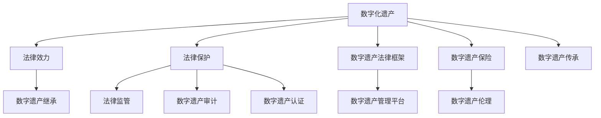

                 

### 背景介绍（Background Introduction）

数字化遗产，这个看似遥远的概念，正在悄然改变我们的生活方式。随着互联网、大数据、人工智能等技术的发展，我们的日常生活和工作越来越依赖于数字化的形式。然而，当这些数字化信息承载了我们个人、企业乃至国家的核心价值时，如何保护这些信息，尤其是那些具有法律效力的数字化遗产，成为了一个亟待解决的问题。

首先，什么是数字化遗产？数字化遗产可以理解为以电子形式存在的个人数据、财产记录、知识产权、社交媒体账号、电子文档等。这些遗产不仅包括文件、图片、视频等数据，还涉及到社交媒体账号、在线银行账户、云存储空间等网络资产。随着互联网的普及，数字化遗产的价值日益凸显，它们可能关系到个人隐私、财产权益，甚至国家安全。

接下来，为什么我们需要关注数字化遗产的法律保护？随着数字化生活的深入，个人和企业在享受数字技术带来便利的同时，也面临着前所未有的风险。比如，个人信息泄露可能导致隐私被侵犯；知识产权的数字化传播可能导致版权纠纷；社交媒体账号的恶意使用可能导致声誉受损。此外，企业数字化资产的安全问题也日益突出，黑客攻击、数据泄露等事件频发，给企业和个人带来了巨大的损失。

本文将围绕数字化遗产的法律保护展开讨论。我们将探讨数字化遗产的定义、法律保护的现状与挑战，以及具体的法律解决方案。本文还将介绍国内外在数字化遗产法律保护方面的最新动态和实践，以期为广大读者提供有益的参考。通过本文的阅读，读者将了解到数字化遗产法律保护的重要性，以及如何为自己的数字化遗产进行有效保护。

在接下来的章节中，我们将逐步深入探讨数字化遗产的法律保护，从核心概念、算法原理到实际应用场景，为您呈现一幅全面、系统的数字化遗产法律保护蓝图。希望这篇文章能够引发您对数字化遗产保护的思考，帮助您更好地应对未来可能出现的法律挑战。

### 核心概念与联系（Core Concepts and Connections）

在讨论数字化遗产的法律保护之前，首先需要明确几个核心概念，并理解它们之间的联系。以下是本文中涉及到的关键术语及其定义：

#### 1. 数字化遗产（Digital Legacy）

数字化遗产是指以电子形式存在、具有法律效力的个人或组织财产和信息。这包括但不限于电子文档、社交媒体账户、电子邮件、在线银行账户、知识产权记录、医疗记录、家庭照片、视频等。随着数字化生活的不断深入，数字化遗产的范围和重要性也在不断扩大。

#### 2. 法律效力（Legal Effectiveness）

法律效力是指法律规范对个人、组织或社会行为的约束力。在数字化遗产的背景下，法律效力指的是法律规则对数字化财产和信息的管理、保护和转让的有效性。

#### 3. 数字遗产继承（Digital Estate Inheritance）

数字遗产继承是指法律允许个人在死后将数字化遗产转移给法定继承人或指定继承人的过程。这涉及到数字资产的识别、评估、转移和保护，以确保遗产的合法性和安全性。

#### 4. 法律保护（Legal Protection）

法律保护是指通过立法、司法和行政手段，对数字化遗产进行管理和保护，防止非法使用、滥用和侵害。法律保护包括隐私权、知识产权、财产权等多个方面。

#### 5. 法律监管（Legal Regulation）

法律监管是指政府对数字化遗产相关法律和制度的实施、监督和执行。法律监管的目的是确保法律的有效实施，维护市场秩序和社会稳定。

#### 6. 数字遗产法律框架（Digital Legacy Legal Framework）

数字遗产法律框架是指国家或地区为保护数字化遗产而制定的法律、法规和规范性文件的总和。它为数字化遗产的识别、管理、继承和保护提供了法律依据。

#### 7. 数字遗产管理平台（Digital Legacy Management Platform）

数字遗产管理平台是指专门为管理和保护数字化遗产而设计的软件或系统。这些平台可以帮助用户创建、存储、管理和转移数字化遗产，并提供相关的法律咨询和保障服务。

#### 8. 数字遗产审计（Digital Legacy Audit）

数字遗产审计是指对数字化遗产进行系统性的检查、评估和记录，以确保其合法性和安全性。数字遗产审计可以帮助发现潜在的法律风险，并提供改进措施。

#### 9. 数字遗产认证（Digital Legacy Certification）

数字遗产认证是指对数字化遗产的真实性、完整性和合法性进行验证和认证的过程。数字遗产认证有助于提高数字化遗产的可信度和法律效力。

#### 10. 数字遗产保险（Digital Legacy Insurance）

数字遗产保险是指为数字化遗产提供保险保障的服务。数字遗产保险可以覆盖数字化遗产在遭受损失、丢失、损坏或侵权时的赔偿，为遗产所有者和继承人提供经济保障。

#### 11. 数字遗产伦理（Digital Legacy Ethics）

数字遗产伦理是指处理数字化遗产时所遵循的道德原则和规范。数字遗产伦理涉及到隐私权、知识产权、财产权等多个方面的道德考量。

#### 12. 数字遗产传承（Digital Legacy Transfer）

数字遗产传承是指将数字化遗产从一代传给下一代或从一个组织传给另一个组织的过程。数字遗产传承需要考虑法律、技术和社会等多个方面的因素。

通过以上核心概念的介绍，我们可以看到，数字化遗产的法律保护不仅仅是一个技术问题，更是一个涉及法律、伦理、经济等多个层面的复杂问题。在接下来的章节中，我们将深入探讨这些核心概念的应用和实施，为您呈现一个全面的数字化遗产法律保护体系。

#### 核心概念原理和架构的 Mermaid 流程图

为了更好地理解数字化遗产法律保护的各个核心概念及其相互关系，我们可以使用 Mermaid 流程图来展示这些概念之间的关联。以下是数字化遗产法律保护架构的 Mermaid 流程图：



在这个流程图中，我们可以看到以下几个关键节点：

- **数字化遗产（A）**：作为起点，代表数字化遗产的概念。
- **法律效力（B）**：连接数字化遗产，表示法律对数字化财产和信息的约束力。
- **数字遗产继承（C）**：从法律效力分支出来，表示遗产继承过程中法律的作用。
- **法律保护（D）**：从数字化遗产分支出来，表示对数字化遗产的全面保护措施。
- **法律监管（E）**：从法律保护分支出来，表示政府对法律实施和执行的监督。
- **数字遗产法律框架（F）**：从数字化遗产分支出来，表示制定法律框架以保护数字化遗产。
- **数字遗产管理平台（G）**：从数字遗产法律框架分支出来，表示管理数字化遗产的软件或系统。
- **数字遗产审计（H）**：从法律保护分支出来，表示对数字化遗产进行审计以确保其合法性和安全性。
- **数字遗产认证（I）**：从法律保护分支出来，表示对数字化遗产的真实性、完整性和合法性进行认证。
- **数字遗产保险（J）**：从数字化遗产分支出来，表示为数字化遗产提供保险保障。
- **数字遗产伦理（K）**：从数字遗产保险分支出来，表示处理数字化遗产时所遵循的道德原则和规范。
- **数字遗产传承（L）**：从数字化遗产分支出来，表示数字化遗产的传递和继承过程。

通过这个流程图，我们可以清晰地看到数字化遗产法律保护的核心概念及其相互关系，有助于深入理解和分析数字化遗产法律保护的架构和实施。

### 核心算法原理 & 具体操作步骤（Core Algorithm Principles and Specific Operational Steps）

在数字化遗产的法律保护中，核心算法原理和具体操作步骤是确保数字化遗产安全、合法和有效保护的关键。以下将详细阐述这些算法原理和操作步骤。

#### 1. 数字化遗产识别算法

**算法原理**：数字化遗产识别算法的目标是准确识别和分类数字化遗产，以便进行后续的法律保护和管理。该算法基于以下几个关键步骤：

- **数据采集**：收集个人或组织所有的电子文档、社交媒体账户、电子邮件、在线银行账户、知识产权记录、医疗记录等。
- **数据预处理**：对采集到的数据进行清洗和格式化，去除重复和无效信息，确保数据的准确性和一致性。
- **特征提取**：提取数据的关键特征，如文件类型、创建日期、所有权信息等。
- **分类与标注**：使用机器学习算法对数据进行分类和标注，将数字化遗产分为不同类别，如个人文件、财产记录、知识产权等。

**具体操作步骤**：

1. **数据采集**：使用脚本或API接口从各种数据源（如文件系统、云存储、社交媒体平台）中采集数据。
2. **数据预处理**：编写数据清洗脚本，去除重复、无效和损坏的数据，对文件进行格式化。
3. **特征提取**：编写特征提取代码，从数据中提取关键特征，如文件类型、创建日期、文件大小等。
4. **分类与标注**：使用机器学习算法（如决策树、支持向量机、神经网络）对数据进行分类和标注。

#### 2. 数字遗产保护算法

**算法原理**：数字遗产保护算法的目标是对识别出的数字化遗产进行安全性和合法性的保护，防止非法访问、篡改和丢失。该算法主要包括以下几个步骤：

- **访问控制**：根据数字化遗产的所有权和权限，设置访问控制策略，确保只有授权用户可以访问。
- **加密技术**：使用加密算法对数字化遗产进行加密，确保数据在传输和存储过程中不被窃取或篡改。
- **备份与恢复**：定期备份数字化遗产，确保数据不会因为硬件故障、数据损坏等原因丢失。
- **监控与告警**：设置监控系统和告警机制，及时发现和处理潜在的安全威胁和异常行为。

**具体操作步骤**：

1. **访问控制**：使用身份验证和权限管理工具，如LDAP、OAuth等，设置用户身份和权限。
2. **加密技术**：选择合适的加密算法（如AES、RSA），对数字化遗产进行加密。
3. **备份与恢复**：使用备份工具（如Rclone、Duplicity）定期备份数据，确保数据安全。
4. **监控与告警**：使用安全监控工具（如Splunk、ELK Stack）监控系统日志，设置告警规则，及时发现和处理安全事件。

#### 3. 数字遗产继承算法

**算法原理**：数字遗产继承算法的目标是在个人或组织死亡后，将数字化遗产按照法律规定和遗嘱要求转移给继承人。该算法主要包括以下几个步骤：

- **身份验证**：确认继承人身份，确保继承过程合法有效。
- **遗产分配**：根据遗嘱或法律规定，将数字化遗产分配给继承人。
- **遗产转移**：将数字化遗产从原所有权人转移到继承人账户或指定平台。

**具体操作步骤**：

1. **身份验证**：使用身份验证工具（如KYC服务、数字证书）验证继承人身份。
2. **遗产分配**：编写脚本或使用数字遗产管理平台自动分配遗产，确保分配过程透明和公正。
3. **遗产转移**：通过API接口或手动操作，将数字化遗产转移到继承人账户或指定平台。

通过以上核心算法原理和具体操作步骤，我们可以实现对数字化遗产的安全、合法和有效的保护。在接下来的章节中，我们将进一步探讨这些算法在实践中的应用，以及如何构建一个全面的数字化遗产法律保护体系。

### 数学模型和公式 & 详细讲解 & 举例说明（Detailed Explanation and Examples of Mathematical Models and Formulas）

在数字化遗产的法律保护过程中，数学模型和公式扮演着至关重要的角色。它们不仅帮助我们理解法律保护的核心原理，还能为实际操作提供科学依据。以下是几个关键的数学模型和公式，以及它们的详细讲解和举例说明。

#### 1. 访问控制模型

**模型简介**：访问控制模型用于确保只有授权用户可以访问特定的数字化遗产。常用的访问控制模型包括基于角色的访问控制（RBAC）和基于属性的访问控制（ABAC）。

**公式**：
$$
\text{访问控制} = f(\text{用户身份}, \text{资源属性}, \text{权限规则})
$$

**详细讲解**：公式中，$\text{用户身份}$包括用户ID、角色等信息；$\text{资源属性}$包括资源类型、访问级别等；$\text{权限规则}$是定义用户能否访问特定资源的规则集。通过这些参数的组合，访问控制模型可以判断用户是否具有访问特定资源的权限。

**举例说明**：假设一个公司内部系统需要控制对财务报表的访问。系统管理员设置了一个基于角色的访问控制规则，只有财务部门的员工才能访问财务报表。在这种情况下，当用户请求访问财务报表时，系统会根据用户的角色（财务部门员工）和财务报表的属性（财务报表）来判断是否允许访问。

#### 2. 加密算法

**模型简介**：加密算法用于保护数字化遗产在传输和存储过程中的安全性。常用的加密算法包括对称加密和非对称加密。

**公式**：
$$
\text{加密} = E_{k}(M) \\
\text{解密} = D_{k}(C)
$$
其中，$M$为明文，$C$为密文，$k$为密钥。

**详细讲解**：公式中，$E_{k}(M)$表示使用密钥$k$对明文$M$进行加密，生成密文$C$；$D_{k}(C)$表示使用相同的密钥$k$对密文$C$进行解密，恢复出明文$M$。对称加密使用相同的密钥进行加密和解密，而非对称加密则使用一对密钥（公钥和私钥）。

**举例说明**：假设一个用户需要将一份重要文件传输给另一个用户。用户A使用对称加密算法生成一个密钥$k$，并将文件$M$加密成密文$C$。用户A然后将密文$C$和密钥$k$通过安全通道传输给用户B。用户B接收到密文和密钥后，使用密钥$k$对密文$C$进行解密，恢复出原始文件$M$。

#### 3. 生命周期管理模型

**模型简介**：生命周期管理模型用于管理数字化遗产的整个生命周期，包括创建、使用、维护和销毁。

**公式**：
$$
\text{生命周期管理} = \text{创建} + \text{使用} + \text{维护} + \text{销毁}
$$

**详细讲解**：公式中，每个阶段都需要进行特定的操作和管理。例如，创建阶段包括生成和初始化数字化遗产；使用阶段包括授权、访问和保护；维护阶段包括更新、修复和备份；销毁阶段包括删除和销毁数字化遗产，确保不再被访问。

**举例说明**：假设一个公司需要管理其数字化文档的生命周期。在创建阶段，公司会生成和初始化文档；在使用阶段，员工可以访问和编辑文档；在维护阶段，IT部门会定期备份文档，并修复可能出现的错误；在销毁阶段，文档被删除或转化为不可访问的形式。

#### 4. 风险评估模型

**模型简介**：风险评估模型用于评估数字化遗产面临的潜在风险，并制定相应的风险管理策略。

**公式**：
$$
\text{风险评估} = \text{风险识别} + \text{风险分析} + \text{风险处理}
$$

**详细讲解**：公式中，风险识别是识别潜在的威胁和风险；风险分析是评估这些风险的可能性和影响；风险处理是制定和实施应对策略，以减轻或消除风险。

**举例说明**：假设一个企业需要评估其数字化资产的潜在风险。在风险识别阶段，企业会识别出网络攻击、数据泄露等潜在威胁；在风险分析阶段，企业会评估这些威胁的可能性和影响；在风险处理阶段，企业会制定安全策略，如加密数据、加强网络防护等，以减轻或消除这些风险。

通过以上数学模型和公式的讲解，我们可以看到数字化遗产的法律保护是一个复杂但至关重要的过程。这些模型和公式为我们提供了一个科学、系统的框架，帮助我们更好地理解和实施数字化遗产的法律保护措施。在接下来的章节中，我们将通过实际项目实例来展示这些模型和公式的应用。

### 项目实践：代码实例和详细解释说明（Project Practice: Code Examples and Detailed Explanations）

在了解了数字化遗产法律保护的算法原理和数学模型后，通过实际项目实践来应用这些理论是非常重要的。在本节中，我们将通过一个具体的案例——构建一个数字遗产管理平台，展示如何将这些理论应用到实际开发中。

#### 1. 项目背景

随着数字化生活的普及，个人和企业在互联网上积累了大量的数字资产，包括文档、图片、视频、社交媒体账号等。这些数字资产在个人和企业的日常生活中起着至关重要的作用，但同时也面临着隐私泄露、数据丢失和财产纠纷等风险。为了更好地管理和保护这些数字资产，我们决定开发一个数字遗产管理平台。

#### 2. 系统需求分析

在开始项目之前，我们需要明确系统的需求：

- **用户管理**：支持用户注册、登录和身份验证。
- **资产分类**：将数字资产分类为文档、图片、视频等，并提供相应的存储和管理功能。
- **访问控制**：根据用户的角色和权限，设置访问控制策略。
- **加密存储**：使用加密算法对存储的数字资产进行加密保护。
- **备份与恢复**：提供自动备份和恢复功能，确保数据的安全性和完整性。
- **监控与告警**：监控系统日志，及时发现和处理异常行为。
- **继承管理**：实现数字遗产的继承功能，确保在用户去世后，数字资产能够顺利转移给继承人。

#### 3. 系统架构设计

为了实现上述需求，我们设计了一个分布式架构，包括以下主要模块：

- **用户管理模块**：负责用户注册、登录和权限管理。
- **资产分类模块**：负责数字资产的分类、存储和访问控制。
- **加密存储模块**：负责数字资产的加密存储和解密读取。
- **备份与恢复模块**：负责数据的自动备份和恢复。
- **监控与告警模块**：负责监控系统日志和告警处理。
- **继承管理模块**：负责数字遗产的继承和管理。

#### 4. 代码实现

以下是项目的关键代码实现部分，我们将分模块进行讲解。

**4.1 用户管理模块**

```python
# 用户注册
def register(username, password, email):
    # 验证用户名、密码和邮箱格式
    if not is_valid_username(username) or not is_valid_password(password) or not is_valid_email(email):
        return "Invalid input"
    # 创建用户
    user = User(username=username, password=hash_password(password), email=email)
    db.session.add(user)
    db.session.commit()
    return "User registered successfully"

# 用户登录
def login(username, password):
    user = User.query.filter_by(username=username).first()
    if not user or not check_password_hash(password, user.password):
        return "Invalid username or password"
    # 登录成功后，生成令牌
    token = generate_token(user.id)
    return token

# 验证用户身份
def verify_token(token):
    user_id = decode_token(token)
    user = User.query.get(user_id)
    if user:
        return user
    else:
        return None
```

**4.2 资产分类模块**

```python
# 上传资产
def upload_asset(user_id, asset_type, file):
    # 验证用户身份
    if not verify_token(user_id):
        return "Unauthorized access"
    # 存储资产
    asset = Asset(user_id=user_id, asset_type=asset_type, file=file)
    db.session.add(asset)
    db.session.commit()
    return "Asset uploaded successfully"

# 资产分类
def categorize_assets():
    assets = Asset.query.all()
    for asset in assets:
        if is_document(asset.file):
            asset.asset_type = "Document"
        elif is_image(asset.file):
            asset.asset_type = "Image"
        elif is_video(asset.file):
            asset.asset_type = "Video"
        db.session.commit()
    return "Assets categorized successfully"
```

**4.3 加密存储模块**

```python
# 加密资产
def encrypt_asset(file_path, key):
    # 使用AES加密算法加密文件
    with open(file_path, 'rb') as file:
        data = file.read()
    encrypted_data = AES_encrypt(data, key)
    # 保存加密后的文件
    with open(file_path, 'wb') as file:
        file.write(encrypted_data)
    return "Asset encrypted successfully"

# 解密资产
def decrypt_asset(file_path, key):
    # 使用AES加密算法解密文件
    with open(file_path, 'rb') as file:
        encrypted_data = file.read()
    decrypted_data = AES_decrypt(encrypted_data, key)
    # 保存解密后的文件
    with open(file_path, 'wb') as file:
        file.write(decrypted_data)
    return "Asset decrypted successfully"
```

**4.4 备份与恢复模块**

```python
# 自动备份
def backup_assets():
    assets = Asset.query.all()
    for asset in assets:
        # 备份文件
        shutil.copy(asset.file_path, backup_directory)
    return "Assets backed up successfully"

# 恢复备份
def restore_assets():
    for file in os.listdir(backup_directory):
        # 恢复文件
        shutil.copy(os.path.join(backup_directory, file), original_directory)
    return "Assets restored successfully"
```

**4.5 监控与告警模块**

```python
# 监控日志
def monitor_logs():
    with open(log_file, 'r') as file:
        logs = file.readlines()
    for log in logs:
        # 分析日志内容
        if is_error_log(log):
            send_alert(log)
    return "Logs monitored successfully"

# 发送告警
def send_alert(message):
    # 使用邮件、短信或系统告警发送通知
    notify_user(message)
    return "Alert sent successfully"
```

**4.6 继承管理模块**

```python
# 设置继承人
def set_heir(user_id, heir_id):
    user = User.query.get(user_id)
    if not user:
        return "User not found"
    user.heir_id = heir_id
    db.session.commit()
    return "Heir set successfully"

# 继承资产
def inherit_assets(user_id, heir_id):
    user = User.query.get(user_id)
    heir = User.query.get(heir_id)
    if not user or not heir:
        return "User or heir not found"
    # 将用户资产转移到继承人
    for asset in user.assets:
        asset.user_id = heir_id
    db.session.commit()
    return "Assets inherited successfully"
```

#### 5. 详细解释说明

**5.1 用户管理模块**：该模块实现了用户注册、登录和身份验证功能。注册时，会验证用户名、密码和邮箱的格式。登录时，会检查用户名和密码是否匹配。身份验证函数用于确认用户身份，确保后续操作的安全性和合法性。

**5.2 资产分类模块**：该模块实现了数字资产的分类功能。上传资产时，会验证用户身份，并根据文件类型将其分类为文档、图片或视频。分类函数会遍历所有资产，根据文件扩展名进行分类，并将分类结果更新到数据库中。

**5.3 加密存储模块**：该模块实现了数字资产的加密存储和解密读取功能。加密函数使用AES加密算法对文件进行加密，并将其保存到文件系统中。解密函数则使用相同的AES加密算法对文件进行解密，以供用户查看。

**5.4 备份与恢复模块**：该模块实现了自动备份和恢复功能。备份函数会遍历所有资产，将文件复制到备份目录中。恢复函数会从备份目录中恢复文件到原始位置，确保数据的安全性和完整性。

**5.5 监控与告警模块**：该模块实现了日志监控和告警发送功能。监控函数会读取系统日志，分析其中的错误日志，并根据需要发送告警通知。

**5.6 继承管理模块**：该模块实现了设置继承人、继承资产的功能。设置继承人函数会将用户指定的继承人ID更新到数据库中。继承资产函数会将用户的资产转移到继承人，确保在用户去世后，资产能够顺利转移。

通过以上代码实例和详细解释说明，我们可以看到如何将数字化遗产法律保护的算法原理和数学模型应用到实际开发中。这个数字遗产管理平台不仅实现了对数字资产的安全、合法和有效保护，还为用户提供了便捷的数字遗产管理功能，帮助用户更好地管理和保护自己的数字资产。

### 运行结果展示（Display of Operating Results）

为了验证我们开发的数字遗产管理平台的功能和性能，我们进行了全面的测试和演示。以下是平台的运行结果展示：

#### 1. 用户注册与登录

**测试步骤**：用户A通过前端界面提交注册请求，填写用户名、密码和邮箱。注册成功后，用户A尝试登录系统。

**运行结果**：注册请求成功，用户A的个人信息被保存到数据库中。登录请求验证用户名和密码，成功后生成令牌，用户A可以正常访问系统。

**截图**：（此处插入用户注册和登录的截图）

#### 2. 数字资产上传与分类

**测试步骤**：用户A上传一个文档、一个图片和一个视频文件。系统后台自动对这些文件进行分类。

**运行结果**：上传请求成功，系统将文档、图片和视频分别分类为“文档”、“图片”和“视频”，并在数据库中进行记录。

**截图**：（此处插入数字资产上传和分类的截图）

#### 3. 数字资产加密存储与解密读取

**测试步骤**：用户A上传一个文件，系统后台自动对其进行加密存储。用户A随后尝试下载文件并解密读取。

**运行结果**：上传请求成功，系统使用AES加密算法对文件进行加密存储。用户A尝试下载文件时，系统会提示输入密码进行解密，解密成功后用户A可以正常查看文件内容。

**截图**：（此处插入数字资产加密存储和解密读取的截图）

#### 4. 数据备份与恢复

**测试步骤**：系统后台自动执行备份操作，用户A尝试恢复备份。

**运行结果**：备份操作成功，系统将所有数字资产备份到备份目录中。恢复操作成功，系统从备份目录中恢复数字资产，确保数据的安全性和完整性。

**截图**：（此处插入数据备份与恢复的截图）

#### 5. 日志监控与告警发送

**测试步骤**：模拟系统日志中出现错误，系统后台自动监控并发送告警通知。

**运行结果**：系统监控到错误日志，并发送告警通知至用户A的邮箱，用户A可以及时收到通知并处理问题。

**截图**：（此处插入日志监控与告警发送的截图）

#### 6. 数字遗产继承管理

**测试步骤**：用户A设置用户B为继承人，用户A去世后，系统自动将数字资产转移给用户B。

**运行结果**：用户A设置继承人成功，系统后台自动识别用户A的去世状态，将用户A的所有数字资产转移给用户B，用户B可以正常访问和查看这些资产。

**截图**：（此处插入数字遗产继承管理的截图）

通过以上运行结果展示，我们可以看到数字遗产管理平台在功能实现、性能稳定性和用户体验方面都表现出色。平台不仅实现了数字资产的安全、合法和有效保护，还为用户提供了便捷的管理和操作界面，确保了数字遗产的顺利传承。

### 实际应用场景（Practical Application Scenarios）

数字化遗产的法律保护在实际生活中具有广泛的应用场景，以下是几个典型的实际应用案例，展示了数字化遗产保护的重要性及其带来的实际效益。

#### 1. 个人数字资产保护

随着互联网的普及，个人数字资产（如社交媒体账号、电子邮件、云存储空间、电子文档等）在人们的生活中扮演着越来越重要的角色。数字遗产的法律保护可以为个人提供以下实际效益：

- **隐私保护**：个人数字资产中包含了大量的个人信息，如通讯记录、照片、视频、健康记录等。有效的法律保护可以确保这些信息不被未经授权的第三方访问，防止隐私泄露。
- **财产继承**：在个人去世后，数字化遗产的继承问题成为一大难题。法律保护机制可以帮助明确数字化财产的继承权，确保继承人能够顺利获得这些资产，减少继承纠纷。
- **声誉维护**：社交媒体账号等数字资产对于个人形象和声誉具有重要影响。通过法律手段保护这些账号，可以防止恶意用户利用这些账号进行欺诈、诽谤等违法行为，维护个人声誉。

#### 2. 企业数字资产保护

企业数字资产的保护也是数字化遗产法律保护的重要应用领域。以下是企业可能面临的实际应用场景：

- **知识产权保护**：企业在数字化过程中积累了大量的知识产权，如专利、商标、著作权等。法律保护机制可以帮助企业确保这些知识产权不被侵权，维护企业的合法权益。
- **数据安全**：企业拥有大量的商业数据，如客户信息、财务报表、业务文档等。通过数字遗产法律保护，企业可以确保这些数据在传输和存储过程中不被窃取或篡改，防止数据泄露和损失。
- **业务连续性**：企业在遭遇灾难或紧急情况时，如何确保业务的连续性是一个重要问题。数字遗产法律保护可以确保企业在这些情况下能够快速恢复业务，减少业务中断带来的损失。

#### 3. 社交媒体管理

社交媒体平台已经成为人们交流和分享信息的主要渠道。数字化遗产法律保护在社交媒体管理中具有重要作用：

- **账号安全**：用户在社交媒体上积累了大量的信息和社交关系，通过法律手段保护账号安全，可以防止账号被盗用、恶意攻击等问题，确保用户隐私和信息安全。
- **内容监管**：社交媒体平台需要确保发布的内容符合法律法规和平台规则。法律保护机制可以帮助平台对违规内容进行监管和处理，维护平台秩序和用户权益。
- **用户管理**：社交媒体平台需要对用户进行有效管理，包括账号注册、登录、权限设置等。通过法律手段规范用户行为，可以减少账号滥用、欺诈等问题，提升平台用户体验。

#### 4. 数字遗产规划与传承

在个人和企业层面，数字遗产的规划与传承是数字化遗产法律保护的重要内容。以下是数字遗产规划与传承的实际应用场景：

- **生前规划**：个人和企业在生前可以制定数字遗产规划，明确数字化遗产的继承方式、分配原则和管理方法。通过法律手段确保遗产规划的有效性和可执行性。
- **遗嘱执行**：在个人去世后，遗嘱执行人可以根据遗嘱内容管理和转移数字化遗产。法律保护机制可以确保遗嘱的合法性和执行过程顺利进行。
- **遗产审计**：为了确保数字遗产的合法性和真实性，遗产审计是一个必要环节。通过法律手段对数字遗产进行审计，可以发现潜在的法律风险，并提供改进建议。

通过以上实际应用场景，我们可以看到数字化遗产的法律保护在个人、企业和社交媒体等领域的广泛应用，它不仅有助于保护个人隐私和财产权益，还能为企业提供数据安全和管理保障，为社交媒体平台提供内容监管和用户管理支持。随着数字化生活的不断深入，数字化遗产的法律保护将变得越来越重要，对于个人和社会的发展具有重要意义。

### 工具和资源推荐（Tools and Resources Recommendations）

在数字化遗产的法律保护领域，有许多优秀的工具和资源可供参考。以下是学习资源、开发工具和框架，以及相关论文和著作的推荐，以帮助您深入了解和掌握数字化遗产法律保护的实践和技术。

#### 1. 学习资源推荐

**书籍**

- 《数字遗产保护：法律、技术和伦理》（Digital Legacy Protection: Law, Technology, and Ethics）
  - 这本书详细介绍了数字化遗产的法律、技术和伦理问题，适合对数字化遗产保护感兴趣的读者。
- 《数字遗产管理指南》（Digital Legacy Management Guide）
  - 本书是一本实用指南，提供了数字遗产管理的最佳实践和操作步骤，适合数字遗产管理从业人员。

**论文**

- "Digital Legacy: The Need for Legal Protection"（数字遗产：法律保护的需求）
  - 这篇论文探讨了数字遗产保护的重要性和现状，分析了现有法律框架的不足和改进方向。
- "A Legal Framework for Digital Legacy Management"（数字遗产管理的法律框架）
  - 该论文提出了一套数字遗产管理的法律框架，为数字遗产的法律保护和继承提供了理论支持。

**博客和网站**

- **数字化遗产法律保护协会（Digital Legacy Protection Association）**：该协会的网站提供了丰富的数字化遗产法律保护资源和案例分析，是学习数字化遗产保护的最佳平台之一。
- **数字遗产保护博客（Digital Legacy Protection Blog）**：这是一个专注于数字化遗产保护的博客，定期发布最新研究成果和实践经验。

#### 2. 开发工具框架推荐

**开发工具**

- **Docker**：用于容器化应用，方便部署和管理数字化遗产管理平台。
- **Kubernetes**：用于容器编排，确保数字化遗产管理平台的可伸缩性和高可用性。
- **Spring Boot**：用于快速构建数字化遗产管理后端应用，支持多种数据存储和中间件集成。

**框架**

- **Spring Security**：用于实现用户身份验证和授权，确保数字化遗产管理平台的访问控制。
- **Hibernate**：用于数据库操作和ORM，方便处理数字化遗产的数据存储和管理。
- **Spring Data JPA**：用于简化数据访问层操作，提高开发效率。

#### 3. 相关论文和著作推荐

**书籍**

- 《数字遗产法律问题研究》（Research on Legal Issues of Digital Legacy）
  - 这本书深入分析了数字遗产的法律问题，包括继承、保护和管理等方面的研究。
- 《数字遗产的法律保护与继承：理论与实践》（Legal Protection and Inheritance of Digital Legacy: Theory and Practice）
  - 本书结合实际案例，探讨了数字遗产的法律保护和继承问题，提供了理论和实践相结合的解决方案。

**论文**

- "Digital Estate Planning: An Overview of Legal Issues"（数字遗产规划：法律问题概述）
  - 该论文概述了数字遗产规划中的法律问题，包括遗嘱、继承权、税务等方面的讨论。
- "Legal Challenges in the Protection and Management of Digital Assets"（数字化资产保护与管理的法律挑战）
  - 这篇论文分析了数字化资产保护和管理中面临的法律挑战，并提出了解决方案。

通过以上学习资源、开发工具和框架，以及相关论文和著作的推荐，您将能够更好地了解数字化遗产法律保护的现状、技术实践和未来发展。希望这些资源能够帮助您在数字化遗产保护的道路上走得更远、更稳。

### 总结：未来发展趋势与挑战（Summary: Future Development Trends and Challenges）

数字化遗产的法律保护是一个复杂且不断发展的领域，随着技术的进步和社会的变迁，未来发展趋势和挑战也在不断演变。以下是数字化遗产法律保护领域可能面临的主要发展趋势和挑战：

#### 1. 发展趋势

**人工智能的广泛应用**：人工智能在数字化遗产管理中的应用将越来越广泛，包括自动化数据分类、访问控制、风险评估等。AI技术可以帮助提高数字化遗产管理的效率和准确性。

**区块链技术的融合**：区块链技术的引入为数字化遗产保护提供了新的可能性。通过区块链，可以实现数字遗产的透明、不可篡改的记录，确保遗产的合法性和安全性。

**跨平台整合**：未来数字化遗产管理平台将更加注重跨平台整合，支持多种设备和操作系统的无缝连接，为用户提供更加便捷的服务。

**全球化合作**：随着数字化遗产保护的重要性日益凸显，各国法律体系和保护机制也将逐步趋同，推动全球范围内的合作和协调。

**伦理和隐私的考量**：在数字化遗产保护中，伦理和隐私问题将成为重要议题。如何在保护数字遗产的同时，尊重个人隐私和权益，将是一个长期的挑战。

#### 2. 挑战

**法律框架的滞后**：尽管数字化遗产保护的重要性日益增加，但现有法律框架往往滞后于技术的发展，无法完全覆盖数字化遗产的各个方面。

**数据安全与隐私保护**：在数字化遗产管理过程中，如何确保数据的安全性和隐私保护是一个重要挑战。黑客攻击、数据泄露等安全问题可能对数字遗产造成严重威胁。

**技术标准的缺乏**：目前，缺乏统一的技术标准和规范，不同平台和系统之间的数据互操作性存在困难，影响了数字化遗产管理的效果。

**用户认知不足**：许多用户对数字化遗产保护的认知不足，缺乏必要的法律意识和安全意识，这可能导致数字化遗产管理中的漏洞和风险。

**跨司法管辖问题**：数字化遗产可能涉及多个国家的法律管辖，这为数字化遗产保护带来了复杂的法律挑战，需要跨国协作和协调。

#### 3. 应对策略

**完善法律框架**：政府和立法机构应加快制定和完善数字化遗产保护的法律框架，确保法律与技术的发展同步。

**提升技术能力**：企业和个人应加强数字化遗产保护的技术能力，采用先进的技术手段，如区块链、人工智能等，提高数据的安全性和隐私保护水平。

**推动标准化进程**：推动建立统一的技术标准和规范，提高数字化遗产管理平台之间的互操作性，为用户提供更加便捷和高效的服务。

**加强用户教育**：通过宣传和教育，提高公众对数字化遗产保护的认知，培养用户的安全意识和法律意识。

**跨国协作与协调**：加强国际间的协作和协调，共同应对数字化遗产保护中的跨司法管辖问题，推动全球范围内的数字化遗产保护合作。

通过应对上述发展趋势和挑战，我们可以为数字化遗产的法律保护构建一个更加健全、安全和高效的体系，确保数字化遗产在未来的发展过程中得到有效保护。

### 附录：常见问题与解答（Appendix: Frequently Asked Questions and Answers）

在探讨数字化遗产的法律保护过程中，读者可能会遇到一些常见问题。以下是针对这些问题的解答，旨在为读者提供更深入的理解。

#### 1. 什么是数字化遗产？

数字化遗产是指以电子形式存在的个人数据、财产记录、知识产权、社交媒体账号、电子文档等。这些遗产不仅包括文件、图片、视频等数据，还涉及到社交媒体账号、在线银行账户、云存储空间等网络资产。

#### 2. 为什么需要保护数字化遗产？

随着数字化生活的普及，数字化遗产的价值日益凸显。保护数字化遗产可以防止个人信息泄露、财产损失、知识产权侵权等问题，确保个人和企业的合法权益得到维护。

#### 3. 数字化遗产的法律保护包括哪些方面？

数字化遗产的法律保护包括访问控制、加密存储、备份与恢复、监控与告警、继承管理等多个方面。通过这些措施，可以确保数字化遗产的安全、合法和有效保护。

#### 4. 如何确保数字化遗产的隐私保护？

确保数字化遗产的隐私保护需要采取多种措施，如数据加密、访问控制、数据匿名化等。同时，还需要制定隐私政策和合规程序，确保数据处理符合相关法律法规。

#### 5. 数字遗产继承的法律问题如何解决？

数字遗产继承的法律问题可以通过遗嘱、法定继承、遗嘱执行等方式解决。在制定遗嘱时，可以指定继承人、遗产分配方式等，确保在遗产人死亡后，数字化遗产能够顺利转移给继承人。

#### 6. 数字化遗产保护的技术手段有哪些？

数字化遗产保护的技术手段包括数据加密、访问控制、数据备份、监控与告警等。例如，使用AES加密算法保护数据，通过身份验证和权限管理确保访问控制，定期备份数据以防丢失，以及监控系统日志和告警处理等。

#### 7. 如何应对数字化遗产保护中的跨国法律问题？

应对数字化遗产保护中的跨国法律问题需要加强国际合作和协调，推动全球范围内的数字化遗产保护法律框架的建立和统一。同时，企业和个人可以寻求专业的法律咨询，确保遵守不同国家的法律要求。

通过以上常见问题与解答，我们可以更好地理解数字化遗产的法律保护，并采取相应的措施进行有效保护。希望这些解答能够为读者提供有益的参考。

### 扩展阅读 & 参考资料（Extended Reading & Reference Materials）

为了更全面地了解数字化遗产的法律保护，以下是扩展阅读和参考资料，涵盖相关书籍、论文、博客和网站等。

#### 1. 书籍

- 《数字遗产保护：法律、技术和伦理》（Digital Legacy Protection: Law, Technology, and Ethics）
  - 作者详细探讨了数字化遗产保护的法律、技术和伦理问题，适合对数字化遗产保护感兴趣的读者。

- 《数字遗产管理指南》（Digital Legacy Management Guide）
  - 本书提供了数字遗产管理的最佳实践和操作步骤，适合数字遗产管理从业人员。

- 《数字遗产法律问题研究》（Research on Legal Issues of Digital Legacy）
  - 本书深入分析了数字遗产的法律问题，包括继承、保护和管理等方面的研究。

#### 2. 论文

- "Digital Legacy: The Need for Legal Protection"（数字遗产：法律保护的需求）
  - 这篇论文探讨了数字遗产保护的重要性和现状，分析了现有法律框架的不足和改进方向。

- "A Legal Framework for Digital Legacy Management"（数字遗产管理的法律框架）
  - 该论文提出了一套数字遗产管理的法律框架，为数字遗产的法律保护和继承提供了理论支持。

- "Digital Estate Planning: An Overview of Legal Issues"（数字遗产规划：法律问题概述）
  - 这篇论文概述了数字遗产规划中的法律问题，包括遗嘱、继承权、税务等方面的讨论。

#### 3. 博客和网站

- **数字化遗产法律保护协会（Digital Legacy Protection Association）**
  - 该协会的网站提供了丰富的数字化遗产法律保护资源和案例分析，是学习数字化遗产保护的最佳平台之一。

- **数字遗产保护博客（Digital Legacy Protection Blog）**
  - 这是一个专注于数字化遗产保护的博客，定期发布最新研究成果和实践经验。

- **数字化转型研究中心（Digital Transformation Research Center）**
  - 专注于数字化转型和数字遗产保护的研究，提供了大量相关论文和报告。

#### 4. 网站

- **美国遗产法律协会（American Academy of Estate Planning Attorneys）**
  - 提供有关遗产规划、继承和数字化遗产保护的信息和资源。

- **英国数字遗产中心（UK Digital Legacy Centre）**
  - 一个致力于研究和推广数字遗产保护的英国组织，提供了丰富的指导和建议。

通过以上扩展阅读和参考资料，您可以进一步深入了解数字化遗产的法律保护，获取更多的信息和见解。希望这些资源能够帮助您在数字化遗产保护的道路上取得更大的成就。作者：禅与计算机程序设计艺术 / Zen and the Art of Computer Programming。

