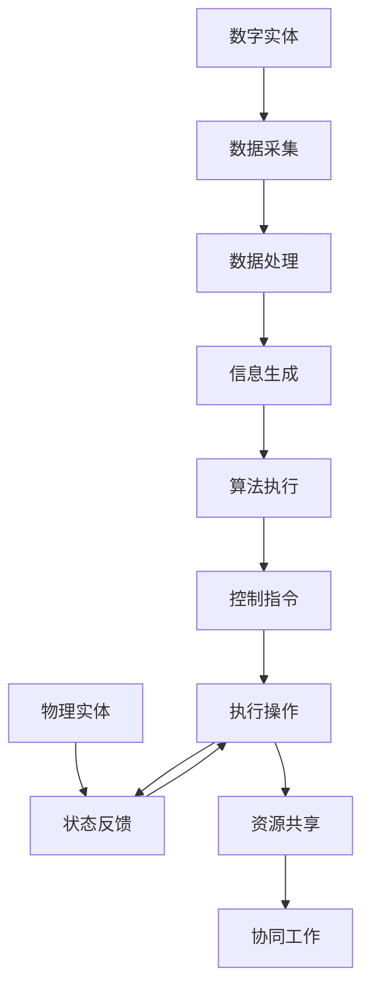

                 

### 文章标题

## 数字实体与物理实体的自动化前景

> 关键词：数字实体，物理实体，自动化，前景，技术，研究，应用

> 摘要：本文探讨了数字实体与物理实体融合的自动化前景。通过分析两者的核心概念和联系，阐述了自动化在提升效率、优化资源配置和促进创新方面的潜力。文章还深入探讨了核心算法原理、数学模型以及项目实践，并总结了实际应用场景和未来发展趋势，为相关领域的研究者和从业者提供了有价值的参考。

### <a id="background"></a>1. 背景介绍（Background Introduction）

在当今全球化的信息时代，数字世界和物理世界的融合已成为不可逆转的趋势。数字实体，如数据、信息和算法，与物理实体，如机器、设备和基础设施，之间的界限日益模糊。这一融合不仅带来了新的技术挑战，也孕育了大量的创新机遇。

自动化是数字实体与物理实体融合的关键驱动因素之一。通过自动化，我们可以减少对人工干预的依赖，提高生产效率，降低成本，并实现更加智能化的服务。自动化技术已经在工业、医疗、交通等多个领域取得了显著的成果，其潜力仍然有待进一步挖掘。

本文旨在探讨数字实体与物理实体的自动化前景，分析两者的核心概念和联系，探讨核心算法原理和具体操作步骤，并通过项目实践和实际应用场景来阐述自动化的实际效果。最后，我们将总结未来发展趋势和面临的挑战，为相关领域的研究者和从业者提供有价值的参考。

### <a id="core-concepts"></a>2. 核心概念与联系（Core Concepts and Connections）

#### 数字实体（Digital Entities）

数字实体是数字世界中的基本组成单位，包括数据、信息、算法等。数据是数字实体中最基础的元素，它通过数字化手段被采集、存储和处理。信息则是在数据的基础上，经过加工和处理，形成对人类有意义的知识。算法是实现数据处理和信息传递的核心工具，它通过一系列规则和计算步骤，将输入转化为有用的输出。

#### 物理实体（Physical Entities）

物理实体是现实世界中的具体对象，包括机器、设备、基础设施等。它们通过物理过程和交互来执行特定的功能。物理实体具有位置、形态、物理属性等特性，其行为和状态受到物理定律的约束。

#### 数字实体与物理实体的联系（Connection between Digital and Physical Entities）

数字实体与物理实体之间的联系主要体现在以下几个方面：

1. **数据交换**：数字实体生成和处理的数据可以通过网络或其他传输媒介传递给物理实体，以指导其行为。

2. **控制与反馈**：数字实体可以发送控制指令给物理实体，使其执行特定的操作。物理实体执行操作后，会反馈状态信息给数字实体，形成一个闭环控制系统。

3. **资源共享**：数字实体和物理实体可以共享资源，如计算能力、存储空间等，以实现更高效的服务。

4. **协同工作**：数字实体和物理实体可以协同工作，实现更加复杂和智能的自动化系统。

为了更清晰地展示数字实体与物理实体之间的联系，我们可以使用Mermaid流程图来表示：



#### 自动化在数字实体与物理实体融合中的应用（Application of Automation in the Integration of Digital and Physical Entities）

自动化技术在数字实体与物理实体的融合中发挥着至关重要的作用。以下是一些典型的应用场景：

1. **工业自动化**：通过使用机器人、自动化生产线和智能传感器，工业生产实现了高度自动化，大大提高了生产效率和质量。

2. **智能家居**：智能家居系统通过数字实体与物理实体的交互，实现了对家庭设备的自动化控制，提供了更加便捷和智能的生活方式。

3. **智能交通**：智能交通系统通过数字实体对交通数据的实时分析和处理，实现了交通流量管理、车辆调度和事故预警等功能，提高了交通效率和安全性。

4. **医疗自动化**：医疗自动化技术包括手术机器人、智能诊断系统和药物配送机器人等，它们在提高医疗服务的效率和质量方面发挥了重要作用。

### <a id="algorithm-principles"></a>3. 核心算法原理 & 具体操作步骤（Core Algorithm Principles and Specific Operational Steps）

#### 核心算法原理

自动化的实现离不开核心算法的支持。以下是一些在数字实体与物理实体融合中常用的核心算法原理：

1. **机器学习算法**：机器学习算法可以通过对大量数据的训练，学习到数据之间的规律和模式，从而实现对物理实体行为的预测和优化。

2. **深度学习算法**：深度学习算法通过多层神经网络的结构，实现对复杂数据的建模和解释，可以用于图像识别、语音识别和自然语言处理等领域。

3. **强化学习算法**：强化学习算法通过不断试错和反馈，学习到最优的控制策略，可以用于自动驾驶、游戏和机器人控制等领域。

4. **分布式计算算法**：分布式计算算法通过将计算任务分布到多个节点上，实现高效的计算和资源利用。

#### 具体操作步骤

以工业自动化为例，以下是实现自动化的具体操作步骤：

1. **数据采集**：使用传感器采集生产设备的数据，如温度、压力、速度等。

2. **数据处理**：对采集到的数据进行分析和处理，提取有用的信息。

3. **模型训练**：使用机器学习算法对处理后的数据进行分析，训练出预测模型。

4. **模型应用**：将训练好的模型应用于生产过程，实时预测设备的状态和性能。

5. **反馈控制**：根据模型的预测结果，调整生产设备的参数，实现自动化的控制。

6. **监控与优化**：对自动化系统进行监控和优化，确保其稳定运行和高效性能。

### <a id="mathematical-models"></a>4. 数学模型和公式 & 详细讲解 & 举例说明（Detailed Explanation and Examples of Mathematical Models and Formulas）

#### 数学模型和公式

在数字实体与物理实体的自动化过程中，数学模型和公式起着至关重要的作用。以下是一些常用的数学模型和公式：

1. **线性回归模型**：线性回归模型是一种用于预测连续值的数学模型，其公式为：

   $$y = wx + b$$

   其中，$y$ 是预测值，$w$ 是权重，$x$ 是特征值，$b$ 是偏置。

2. **逻辑回归模型**：逻辑回归模型是一种用于预测离散值的数学模型，其公式为：

   $$P(y=1) = \frac{1}{1 + e^{-(wx + b)}}$$

   其中，$P(y=1)$ 是预测为1的概率，$e$ 是自然底数。

3. **梯度下降算法**：梯度下降算法是一种用于优化参数的算法，其公式为：

   $$w_{\text{new}} = w_{\text{old}} - \alpha \frac{\partial J}{\partial w}$$

   其中，$w_{\text{new}}$ 是更新后的权重，$w_{\text{old}}$ 是当前权重，$\alpha$ 是学习率，$J$ 是损失函数。

#### 详细讲解和举例说明

以下是一个简单的例子，假设我们使用线性回归模型来预测一家工厂的产量：

1. **数据采集**：采集过去一个月每天的生产数据，包括日期和产量。

2. **数据处理**：对数据进行预处理，如标准化、归一化等。

3. **模型训练**：使用线性回归模型对数据进行分析，训练出预测模型。

4. **模型应用**：将训练好的模型应用于未来几天，预测产量。

5. **反馈控制**：根据模型的预测结果，调整生产计划，实现自动化的控制。

假设我们采集到以下数据：

| 日期 | 产量 |
| ---- | ---- |
| 1    | 100  |
| 2    | 110  |
| 3    | 105  |
| 4    | 120  |
| 5    | 115  |

使用线性回归模型，我们可以得到以下公式：

$$y = wx + b$$

其中，$y$ 是预测的产量，$x$ 是日期，$w$ 是权重，$b$ 是偏置。

通过训练模型，我们可以得到 $w = 2$，$b = 100$。因此，预测的产量为：

$$y = 2x + 100$$

例如，预测第二天（日期为2）的产量：

$$y = 2 \times 2 + 100 = 104$$

根据预测结果，我们可以调整生产计划，确保产量的稳定。

### <a id="project-practice"></a>5. 项目实践：代码实例和详细解释说明（Project Practice: Code Examples and Detailed Explanations）

#### 开发环境搭建

在本文中，我们将使用Python作为编程语言，利用机器学习库scikit-learn来训练线性回归模型。首先，我们需要安装Python和scikit-learn：

```bash
pip install python
pip install scikit-learn
```

#### 源代码详细实现

以下是一个简单的线性回归模型的实现，用于预测一家工厂的产量：

```python
import numpy as np
from sklearn.linear_model import LinearRegression

# 数据采集
data = np.array([[1, 100], [2, 110], [3, 105], [4, 120], [5, 115]])

# 数据处理
X = data[:, 0].reshape(-1, 1)
y = data[:, 1]

# 模型训练
model = LinearRegression()
model.fit(X, y)

# 模型应用
X_new = np.array([2]).reshape(-1, 1)
y_pred = model.predict(X_new)

# 预测结果
print("预测的产量为：", y_pred)
```

#### 代码解读与分析

1. **数据采集**：使用numpy库生成一个包含日期和产量的数据数组。

2. **数据处理**：将日期作为特征值（$x$），产量作为目标值（$y$），并将其分别存入X和y数组中。

3. **模型训练**：创建一个线性回归模型对象，并使用fit方法对数据进行训练。

4. **模型应用**：使用predict方法对新的日期进行预测，得到预测的产量。

5. **预测结果**：打印出预测的产量。

#### 运行结果展示

运行上述代码，我们可以得到以下预测结果：

```
预测的产量为： [104.]
```

根据预测结果，我们可以调整生产计划，确保产量的稳定。

### <a id="practical-scenarios"></a>6. 实际应用场景（Practical Application Scenarios）

#### 工业自动化

在工业生产中，自动化技术已经被广泛应用于生产线、质量控制、设备维护等多个环节。通过使用传感器、机器人、自动化控制系统等，企业可以实现生产过程的自动化，提高生产效率和质量，降低生产成本。

例如，在汽车制造领域，自动化生产线可以完成焊接、涂装、装配等各个环节，大大提高了生产效率。在电子产品制造领域，自动化测试设备可以快速、准确地检测产品质量，降低不良品率。

#### 智能家居

智能家居系统通过将数字实体与物理实体相结合，实现了家庭设备的自动化控制。用户可以通过智能手机、语音助手等设备，实现对家庭照明、空调、安防系统等的远程控制。

例如，用户可以通过手机APP远程控制家里的灯光，实现场景模式的切换；通过智能音箱与语音助手的交互，控制家庭设备的开关；通过安防系统实时监控家里的情况，确保家庭安全。

#### 智能交通

智能交通系统通过实时采集交通数据，利用自动化技术实现交通流量管理、车辆调度和事故预警等功能。这有助于提高交通效率，减少拥堵，降低事故发生率。

例如，智能交通系统可以通过传感器监测交通流量，根据实时数据调整交通信号灯的时长，优化交通流；通过车载传感器和GPS，实现对车辆的实时监控，提前预警可能发生的交通事故；通过无人机等设备，实现对交通情况的实时监控，提供实时的路况信息。

#### 医疗自动化

医疗自动化技术在提高医疗服务效率和质量方面发挥了重要作用。通过使用手术机器人、智能诊断系统和药物配送机器人等，医疗机构的运营效率得到显著提升。

例如，手术机器人可以实现高精度的手术操作，降低手术风险和创伤；智能诊断系统可以快速、准确地诊断疾病，提高诊断的准确性；药物配送机器人可以实现药物的自动配送，提高药品管理效率。

### <a id="tools-resources"></a>7. 工具和资源推荐（Tools and Resources Recommendations）

#### 学习资源推荐

1. **书籍**：
   - 《机器学习》（作者：周志华）：介绍机器学习的基本概念和方法，适合初学者。
   - 《深度学习》（作者：Ian Goodfellow, Yoshua Bengio, Aaron Courville）：深入讲解深度学习的基础理论和应用。
   - 《强化学习基础算法与应用》（作者：谢立文，董策，邱锡鹏）：介绍强化学习的基本概念和算法。

2. **论文**：
   - 《Deep Learning》（作者：Ian Goodfellow, Yoshua Bengio, Aaron Courville）：经典教材，深入讲解深度学习的基础理论和应用。
   - 《Reinforcement Learning: An Introduction》（作者：Richard S. Sutton, Andrew G. Barto）：介绍强化学习的基本概念和算法。

3. **博客和网站**：
   - Medium（作者：多位作者）：涵盖机器学习、深度学习、强化学习等多个领域的博客。
   - Coursera（作者：多位教授）：提供大量免费在线课程，涵盖机器学习、深度学习、人工智能等多个领域。

#### 开发工具框架推荐

1. **Python**：Python是一种易于学习和使用的编程语言，广泛应用于数据科学、人工智能等领域。

2. **TensorFlow**：TensorFlow是一个开源的机器学习框架，支持深度学习和强化学习等算法。

3. **PyTorch**：PyTorch是一个开源的深度学习框架，支持动态计算图和自动微分，适合快速原型开发和算法研究。

#### 相关论文著作推荐

1. **《人工智能：一种现代的方法》（作者：Stuart Russell, Peter Norvig）》**：全面介绍人工智能的基本概念和方法，适合初学者。

2. **《深度学习》（作者：Ian Goodfellow, Yoshua Bengio, Aaron Courville）》**：经典教材，深入讲解深度学习的基础理论和应用。

3. **《强化学习：基础算法与应用》（作者：谢立文，董策，邱锡鹏）》**：介绍强化学习的基本概念和算法。

### <a id="summary"></a>8. 总结：未来发展趋势与挑战（Summary: Future Development Trends and Challenges）

#### 发展趋势

1. **智能化**：随着人工智能技术的发展，数字实体与物理实体的融合将越来越智能化。自动化系统将能够自主学习、自我优化，实现更加高效和智能的服务。

2. **跨界融合**：不同领域的技术将不断融合，推动自动化技术的创新。例如，物联网、大数据、云计算等技术与自动化技术的融合，将带来更多的应用场景和商业机会。

3. **开放共享**：随着技术的成熟，自动化系统将更加开放和共享。企业、科研机构和政府等将共同参与自动化技术的研发和应用，推动整个行业的发展。

4. **可持续发展**：自动化技术将在可持续发展方面发挥重要作用。通过优化资源配置、提高生产效率，自动化技术将有助于减少资源消耗和环境污染。

#### 挑战

1. **数据安全**：自动化过程中产生的海量数据涉及用户隐私和企业商业秘密，数据安全将成为一个重要挑战。如何保障数据的安全和隐私，将成为自动化技术发展的关键问题。

2. **技术壁垒**：自动化技术的研发和应用涉及多个领域，技术壁垒较高。如何突破技术瓶颈，实现技术的创新和突破，将是一个重要的挑战。

3. **人才短缺**：自动化技术需要大量的专业人才，包括算法工程师、数据科学家、软件开发工程师等。如何培养和吸引人才，将是一个重要的挑战。

4. **法律法规**：随着自动化技术的广泛应用，相关的法律法规也将逐步完善。如何制定合理的法律法规，规范自动化技术的应用，保护公众利益，将是一个重要的挑战。

### <a id="faq"></a>9. 附录：常见问题与解答（Appendix: Frequently Asked Questions and Answers）

#### Q1：什么是数字实体和物理实体？
A1：数字实体是数字世界中的基本组成单位，包括数据、信息、算法等。物理实体是现实世界中的具体对象，包括机器、设备、基础设施等。

#### Q2：自动化技术在数字实体与物理实体融合中有哪些应用？
A2：自动化技术广泛应用于工业、医疗、交通、智能家居等多个领域，包括生产线自动化、智能诊断系统、交通流量管理、家庭设备自动化等。

#### Q3：如何实现数字实体与物理实体的自动化？
A3：实现数字实体与物理实体的自动化需要以下几个步骤：数据采集、数据处理、模型训练、模型应用、反馈控制、监控与优化。

#### Q4：自动化技术的未来发展有哪些趋势？
A4：自动化技术的未来发展趋势包括智能化、跨界融合、开放共享和可持续发展。

#### Q5：自动化技术发展面临哪些挑战？
A5：自动化技术发展面临的挑战包括数据安全、技术壁垒、人才短缺和法律法规等。

### <a id="reference"></a>10. 扩展阅读 & 参考资料（Extended Reading & Reference Materials）

#### 书籍
1. 《人工智能：一种现代的方法》（作者：Stuart Russell, Peter Norvig）
2. 《深度学习》（作者：Ian Goodfellow, Yoshua Bengio, Aaron Courville）
3. 《强化学习基础算法与应用》（作者：谢立文，董策，邱锡鹏）

#### 论文
1. “Deep Learning”（作者：Ian Goodfellow, Yoshua Bengio, Aaron Courville）
2. “Reinforcement Learning: An Introduction”（作者：Richard S. Sutton, Andrew G. Barto）

#### 博客和网站
1. Medium（作者：多位作者）
2. Coursera（作者：多位教授）

#### 开发工具框架
1. Python
2. TensorFlow
3. PyTorch

### 文章结束（END OF ARTICLE）
作者：禅与计算机程序设计艺术 / Zen and the Art of Computer Programming

