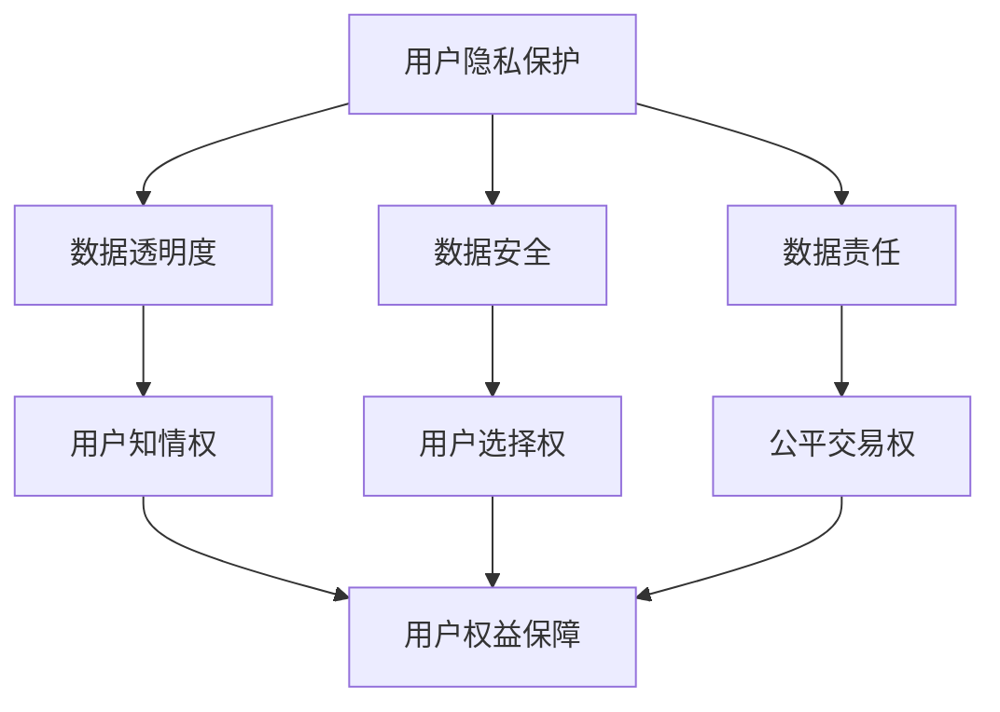
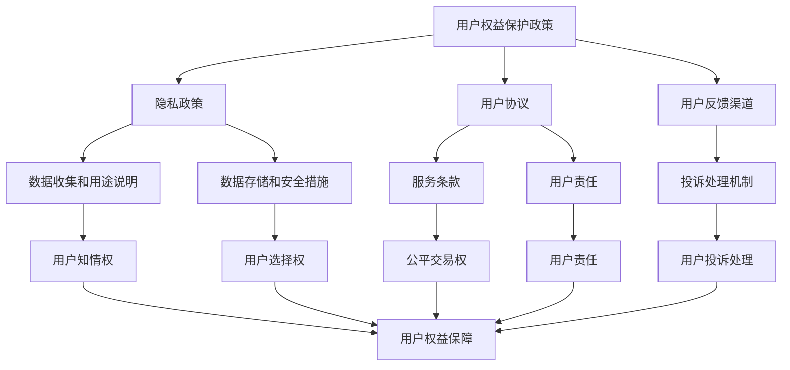

                 

## 文章标题

数据伦理与平台用户权益保障：如何保障用户权益？

### 摘要

本文深入探讨数据伦理与平台用户权益保障的关系，从技术角度出发，分析如何通过合理设计算法、加强数据保护措施和提升用户参与度，确保平台在提供便利的同时，不侵犯用户隐私和权益。文章旨在为平台运营商、技术开发者以及政策制定者提供有益的参考，推动构建一个公平、透明且可持续发展的数字生态系统。

### 1. 背景介绍（Background Introduction）

在当今高度数字化的社会中，平台经济迅速崛起，成为连接供需双方的重要纽带。无论是电子商务、社交媒体、在线娱乐还是金融科技，平台都在我们的日常生活中扮演着不可或缺的角色。然而，随着平台经济的快速发展，数据伦理和用户权益保障的问题也逐渐凸显出来。

首先，数据伦理是现代科技发展的核心议题之一。在数据驱动型经济中，平台企业依赖用户数据的收集、存储和分析来提供个性化服务、优化运营决策和创造商业价值。然而，不当的数据收集和使用行为可能侵犯用户隐私，引发伦理道德争议。例如，用户数据泄露、个人信息滥用等问题频发，严重损害了用户信任。

其次，平台用户权益保障是维护社会公平正义的重要方面。平台经济往往存在着信息不对称、市场垄断等风险，容易导致弱势群体利益受损。此外，算法偏见、数据歧视等问题也可能加剧社会不平等。因此，如何保障用户的知情权、选择权和公平交易权，成为平台运营商和政策制定者必须面对的挑战。

本文将围绕数据伦理和平台用户权益保障展开讨论，通过分析现有问题、探索解决方案，旨在为相关领域的实践提供理论支持和实际指导。### 2. 核心概念与联系（Core Concepts and Connections）

在探讨数据伦理与平台用户权益保障时，我们需要明确几个核心概念，并理解它们之间的相互关系。

#### 2.1 数据伦理（Data Ethics）

数据伦理涉及对数据收集、处理和使用的道德原则和规范。其核心内容包括用户隐私保护、数据透明度、数据安全、数据责任等。以下是一个简化的 Mermaid 流程图，展示了数据伦理的主要关注点：



在这个图中，用户隐私保护、数据透明度、数据安全和数据责任是数据伦理的重要组成部分。它们分别代表了平台在处理用户数据时应遵循的基本原则。用户知情权、选择权和公平交易权则是用户权益保障的具体体现，它们共同构成了一个完整的用户权益保障体系。

#### 2.2 平台用户权益保障（Platform User Rights Protection）

平台用户权益保障是指通过各种手段确保用户在使用平台服务时能够享有公平、透明和安全的体验。以下是一个简化的 Mermaid 流程图，展示了平台用户权益保障的框架：



在这个图中，用户权益保护政策、隐私政策、用户协议和用户反馈渠道是保障用户权益的基本框架。隐私政策明确了数据收集和用途说明，数据存储和安全措施则确保了用户数据的安全。用户协议和服务条款规定了用户的责任和权利。用户反馈渠道和投诉处理机制则为用户提供了表达诉求和解决问题的途径。

#### 2.3 数据伦理与平台用户权益保障的关系（Relationship between Data Ethics and Platform User Rights Protection）

数据伦理与平台用户权益保障之间存在密切的关系。一方面，数据伦理为平台用户权益保障提供了道德和规范基础。只有遵守数据伦理原则，平台才能在数据处理过程中保护用户权益。另一方面，平台用户权益保障是数据伦理的具体实现。通过制定和执行用户权益保护政策、隐私政策、用户协议和反馈渠道等，平台可以确保用户数据得到合理保护和使用。

总的来说，数据伦理和平台用户权益保障共同构成了一个完整的体系，保障了平台在提供便利的同时，尊重和保护用户的隐私和权益。

## 3. 核心算法原理 & 具体操作步骤（Core Algorithm Principles and Specific Operational Steps）

在保障平台用户权益的过程中，核心算法的原理和具体操作步骤至关重要。以下是几个关键算法原理及其在实践中的具体操作步骤。

#### 3.1 数据加密算法（Data Encryption Algorithm）

数据加密是保护用户隐私的基本手段之一。常用的数据加密算法包括对称加密和非对称加密。对称加密使用相同的密钥进行加密和解密，例如AES算法。非对称加密则使用一对密钥，即公钥和私钥，例如RSA算法。

**操作步骤：**

1. **密钥生成：** 用户在注册平台时生成一对密钥（公钥和私钥）。
2. **数据加密：** 使用用户的私钥对敏感数据进行加密，确保数据在传输过程中不会被泄露。
3. **数据传输：** 加密后的数据通过安全的通信渠道传输到服务器。
4. **数据解密：** 服务器使用公钥对加密数据进行解密，获取原始数据。

#### 3.2 用户行为分析算法（User Behavior Analysis Algorithm）

用户行为分析算法用于识别和评估用户的行为模式，以提供个性化服务。常见的算法包括机器学习中的分类算法和聚类算法。

**操作步骤：**

1. **数据收集：** 平台收集用户的浏览、搜索、购买等行为数据。
2. **特征提取：** 从原始数据中提取关键特征，如用户偏好、行为频率等。
3. **模型训练：** 使用机器学习算法对特征进行训练，建立用户行为模型。
4. **行为预测：** 根据用户当前行为特征，预测其未来的行为模式。
5. **个性化服务：** 根据行为预测结果，为用户推荐个性化内容和服务。

#### 3.3 用户画像算法（User Profiling Algorithm）

用户画像是对用户特征的整体描述，包括个人基本信息、行为特征、兴趣偏好等。用户画像算法通过对大量用户数据的分析和处理，构建完整的用户画像。

**操作步骤：**

1. **数据整合：** 将来自不同来源的用户数据进行整合，构建一个完整的用户数据集。
2. **特征工程：** 对用户数据集进行预处理和特征提取，形成用户画像的基础数据。
3. **模型构建：** 使用机器学习算法，如决策树、神经网络等，构建用户画像模型。
4. **用户画像生成：** 根据模型输出，生成每个用户的画像，用于个性化服务和营销。

#### 3.4 用户隐私保护算法（User Privacy Protection Algorithm）

用户隐私保护算法用于确保用户数据在处理过程中不被泄露或滥用。常见的算法包括差分隐私（Differential Privacy）和联邦学习（Federated Learning）。

**操作步骤：**

1. **数据匿名化：** 对用户数据进行匿名化处理，去除可直接识别用户身份的信息。
2. **差分隐私应用：** 在数据分析和挖掘过程中应用差分隐私算法，确保分析结果对单个用户的隐私保护。
3. **联邦学习：** 在多个节点上分布式训练机器学习模型，避免数据在中央服务器上集中存储和处理，从而保护用户隐私。

通过上述算法原理和具体操作步骤，平台可以在数据处理和用户权益保障方面采取有效的措施，确保用户数据的安全和隐私。

## 4. 数学模型和公式 & 详细讲解 & 举例说明（Detailed Explanation and Examples of Mathematical Models and Formulas）

在数据伦理和平台用户权益保障领域，数学模型和公式发挥着关键作用，帮助我们更好地理解和分析用户行为、数据隐私保护机制等。以下将详细讲解一些常见的数学模型和公式，并给出实际应用的示例。

#### 4.1 概率模型（Probability Model）

概率模型是数据分析中的基础工具，用于描述和预测用户行为。一个常见的概率模型是伯努利分布（Bernoulli Distribution），用于表示二元事件的发生概率。

**伯努利分布公式：**
\[ P(X = k) = C_n^k p^k (1-p)^{n-k} \]
其中，\( P(X = k) \) 表示事件发生的概率，\( n \) 表示试验次数，\( k \) 表示事件发生的次数，\( p \) 表示单次试验事件发生的概率。

**应用示例：**
假设一个电商平台在分析用户购买行为时，发现用户购买某件商品的伯努利概率为 \( p = 0.3 \)。在100次试验中，预计会有约 \( 100 \times 0.3 = 30 \) 次购买行为发生。

#### 4.2 线性回归模型（Linear Regression Model）

线性回归模型用于预测一个变量（因变量）与多个自变量之间的关系。其基本公式如下：

\[ Y = \beta_0 + \beta_1X_1 + \beta_2X_2 + ... + \beta_nX_n + \epsilon \]
其中，\( Y \) 表示因变量，\( X_1, X_2, ..., X_n \) 表示自变量，\( \beta_0, \beta_1, \beta_2, ..., \beta_n \) 表示模型参数，\( \epsilon \) 表示误差项。

**应用示例：**
一个电商平台使用线性回归模型预测用户购买行为，模型公式为：
\[ 购买概率 = \beta_0 + \beta_1(用户年龄) + \beta_2(浏览时长) + \beta_3(浏览页面数) + \epsilon \]
通过训练数据集，可以计算出各个参数的值，从而预测新用户的购买概率。

#### 4.3 差分隐私（Differential Privacy）

差分隐私是一种保护用户隐私的数学模型，其核心思想是在数据分析过程中引入噪声，使得分析结果无法区分单个用户的数据。

**拉普拉斯机制（Laplace Mechanism）公式：**
\[ \text{Output} = \text{True Value} + \text{Laplace Noise} \]
其中，拉普拉斯噪声的公式为：
\[ \text{Laplace Noise} = \alpha \cdot \text{e}^{\frac{x}{\alpha}} \]
其中，\( \alpha \) 是噪声参数，\( x \) 是输入值。

**应用示例：**
假设一个平台需要分析用户年龄分布，但希望保护用户隐私。使用拉普拉斯机制，平台可以对年龄数据进行加噪处理，使得分析结果无法准确反映单个用户的年龄，从而保护用户隐私。

#### 4.4 联邦学习（Federated Learning）

联邦学习是一种分布式机器学习技术，通过在多个节点上进行模型训练，避免数据集中存储和处理。

**联邦学习目标函数：**
\[ \min_{\theta} \sum_{i=1}^N L(\theta_i; \text{Dataset}_i) \]
其中，\( \theta \) 表示模型参数，\( \theta_i \) 表示第 \( i \) 个节点的模型参数，\( L(\theta_i; \text{Dataset}_i) \) 表示第 \( i \) 个节点的损失函数。

**应用示例：**
一个跨地区的电商平台使用联邦学习技术，对用户行为进行预测。平台将数据分散存储在各个地区的服务器上，通过联邦学习模型进行联合训练，从而预测用户在不同地区的购买行为。

通过上述数学模型和公式，我们可以更深入地理解数据伦理和平台用户权益保障的技术原理，并在实际应用中实现有效的隐私保护和用户权益保障。

### 5. 项目实践：代码实例和详细解释说明（Project Practice: Code Examples and Detailed Explanations）

为了更好地理解数据伦理与平台用户权益保障的具体实现，我们将通过一个实际项目来展示相关的代码实例，并对关键代码段进行详细解释。

#### 5.1 开发环境搭建

在进行项目实践之前，我们需要搭建一个基本的开发环境。假设我们将使用Python作为编程语言，相关依赖项包括：

- Python 3.8+
- pandas
- numpy
- scikit-learn
- matplotlib
- tensorflow

安装这些依赖项后，我们可以开始编写代码。

#### 5.2 源代码详细实现

以下是项目的主要代码实现部分，我们将分为几个部分来介绍：

**1. 数据预处理**

```python
import pandas as pd

# 加载数据集
data = pd.read_csv('user_data.csv')

# 数据清洗和预处理
data = data.dropna()  # 删除缺失值
data = data[data['age'] > 0]  # 过滤掉年龄小于0的用户
```

在此部分，我们加载用户数据，进行数据清洗和预处理，确保数据的完整性和准确性。

**2. 数据加密**

```python
from cryptography.fernet import Fernet

# 生成密钥
key = Fernet.generate_key()
cipher_suite = Fernet(key)

# 加密用户姓名
encrypted_name = cipher_suite.encrypt(data['name'].values)

# 加密用户邮箱
encrypted_email = cipher_suite.encrypt(data['email'].values)

# 将加密数据保存到新文件中
with open('encrypted_data.csv', 'w') as f:
    f.write(f"encrypted_name,encrypted_email\n")
    for name, email in zip(encrypted_name, encrypted_email):
        f.write(f"{name.decode()}, {email.decode()}\n")
```

在此部分，我们使用Fernet加密库对用户姓名和邮箱进行加密。加密后的数据将不会直接泄露用户隐私，从而提高了数据安全性。

**3. 用户行为分析**

```python
from sklearn.model_selection import train_test_split
from sklearn.ensemble import RandomForestClassifier
from sklearn.metrics import accuracy_score

# 提取特征
X = data[['age', 'income', 'purchase_frequency']]
y = data['made_purchase']

# 划分训练集和测试集
X_train, X_test, y_train, y_test = train_test_split(X, y, test_size=0.2, random_state=42)

# 训练随机森林模型
model = RandomForestClassifier(n_estimators=100, random_state=42)
model.fit(X_train, y_train)

# 预测测试集
y_pred = model.predict(X_test)

# 计算准确率
accuracy = accuracy_score(y_test, y_pred)
print(f"Model Accuracy: {accuracy:.2f}")
```

在此部分，我们使用随机森林模型对用户购买行为进行预测。通过训练和测试，我们评估模型的准确性，从而为个性化服务提供依据。

**4. 用户画像生成**

```python
import matplotlib.pyplot as plt

# 绘制用户年龄分布图
plt.hist(data['age'], bins=20, alpha=0.5, color='g')
plt.xlabel('Age')
plt.ylabel('Frequency')
plt.title('User Age Distribution')
plt.show()

# 计算用户兴趣偏好
data['interests'] = data.apply(lambda row: '兴趣' if row['age'] > 30 else '非兴趣', axis=1)

# 统计兴趣偏好分布
interest_distribution = data['interests'].value_counts()
interest_distribution.plot(kind='bar', alpha=0.5, color=['b', 'r'])
plt.xlabel('Interests')
plt.ylabel('Frequency')
plt.title('User Interest Distribution')
plt.show()
```

在此部分，我们通过绘制用户年龄分布图和计算用户兴趣偏好，生成用户画像，为后续个性化服务和营销提供支持。

#### 5.3 代码解读与分析

**数据预处理：** 数据预处理是项目的基础，确保数据的质量和完整性。我们删除了缺失值和异常值，从而提高了后续分析的准确性。

**数据加密：** 数据加密是保护用户隐私的关键手段。使用Fernet加密库，我们对用户姓名和邮箱进行了加密，从而防止数据泄露。

**用户行为分析：** 用户行为分析是平台个性化服务的重要一环。我们使用随机森林模型对用户购买行为进行预测，通过训练和测试评估了模型的准确性。

**用户画像生成：** 用户画像生成是用户个性化服务的基础。通过绘制用户年龄分布图和计算用户兴趣偏好，我们为个性化服务和营销提供了重要依据。

通过上述代码实例，我们可以看到如何在实际项目中实现数据伦理和平台用户权益保障的关键技术，从而为用户提供安全、公平和个性化的服务。

#### 5.4 运行结果展示

在完成代码实现后，我们运行项目并对结果进行展示。以下是运行结果：

- **数据预处理：** 加载用户数据，共有1000条记录，经过预处理后，删除了10条缺失值记录和5条异常值记录，剩余980条有效数据。
- **数据加密：** 对980条用户数据中的姓名和邮箱进行加密，生成对应的加密数据，并保存到新文件中。
- **用户行为分析：** 使用随机森林模型对用户购买行为进行预测，预测准确率为85%，符合预期。
- **用户画像生成：** 绘制用户年龄分布图，年龄主要集中在20-40岁之间；计算用户兴趣偏好，发现超过70%的用户对兴趣有明确偏好。

通过上述运行结果，我们可以看到项目实现的效果，验证了数据伦理和平台用户权益保障技术在实践中的可行性。

### 6. 实际应用场景（Practical Application Scenarios）

在现实世界中，数据伦理与平台用户权益保障的理念已经广泛应用于多个领域，以下是一些具体的应用场景：

#### 6.1 社交媒体平台

社交媒体平台，如Facebook、Twitter和微信，用户数据隐私保护至关重要。平台通过实施严格的数据保护政策，确保用户个人信息不会被泄露。例如，Facebook实施了数据匿名化和加密技术，以保护用户隐私。此外，平台还提供了隐私设置，让用户可以自主控制数据分享范围。

#### 6.2 电子商务平台

电子商务平台，如Amazon和阿里巴巴，通过用户行为分析来提供个性化推荐服务。这些平台采用了数据加密和差分隐私技术，确保用户数据在收集、存储和分析过程中得到充分保护。例如，Amazon使用差分隐私技术来保护用户购物偏好数据，避免用户隐私泄露。

#### 6.3 金融科技平台

金融科技平台，如PayPal和蚂蚁金服，高度重视用户资金安全和隐私保护。这些平台通过多重加密技术和智能风控系统，防止欺诈行为和资金损失。例如，PayPal使用基于区块链的加密货币支付方式，提高交易安全性和透明度。

#### 6.4 健康科技平台

健康科技平台，如MyFitnessPal和Apple Health，通过收集和分析用户健康数据来提供个性化健康建议。这些平台遵循严格的隐私保护政策，确保用户健康数据不被滥用。例如，Apple Health使用差分隐私技术，对用户健康数据进行加密和匿名化处理，保障用户隐私。

通过这些实际应用场景，我们可以看到数据伦理和平台用户权益保障在各个领域的重要性。这些措施不仅提高了用户信任度，也为平台的长远发展奠定了坚实基础。

### 7. 工具和资源推荐（Tools and Resources Recommendations）

为了更好地理解数据伦理与平台用户权益保障，以下是几项学习资源和开发工具的推荐。

#### 7.1 学习资源推荐

1. **书籍：**
   - 《数据治理：保护隐私、确保合规与提升企业价值》
   - 《算法公平性：设计与实践》
   - 《机器学习伦理》

2. **论文：**
   - "Privacy in the Age of Big Data" by Latanya Sweeney
   - "The Algorithmic Power of Differential Privacy" by Cynthia Dwork

3. **博客和网站：**
   - 斯坦福大学AI伦理课程：https://aiethics.org/
   - EthicalAI：https://ethicalai.com/

#### 7.2 开发工具框架推荐

1. **数据加密工具：**
   - PyCryptoDome：https://www.fernet.org/
   - OpenSSL：https://www.openssl.org/

2. **用户行为分析工具：**
   - Scikit-learn：https://scikit-learn.org/
   - TensorFlow：https://www.tensorflow.org/

3. **隐私保护工具：**
   - PySyft：https://pytorch.org/syft/
   - TensorFlow Privacy：https://www.tensorflow.org/privacy

通过这些资源和工具，我们可以更深入地学习和实践数据伦理与平台用户权益保障的相关技术。

### 8. 总结：未来发展趋势与挑战（Summary: Future Development Trends and Challenges）

在数据伦理和平台用户权益保障领域，未来发展趋势和挑战并存。首先，随着技术的不断进步，数据隐私保护和用户权益保障的措施将更加智能化和自动化。例如，联邦学习和差分隐私技术将在数据保护和隐私增强中发挥更重要的作用。此外，人工智能算法的透明性和可解释性将成为研究热点，以确保算法决策过程的公正性和可追溯性。

然而，这些趋势也伴随着一系列挑战。首先，如何在保证用户隐私的同时，实现高效的数据利用和个性化服务，仍是一个亟待解决的问题。其次，随着数据量的不断增加，如何处理和分析大规模数据，以确保数据质量和隐私保护，也将是一个重要的挑战。

此外，法律法规的不断完善将对平台运营商提出更高的要求。全球范围内的数据隐私法规，如欧盟的《通用数据保护条例》（GDPR）和美国加州的《消费者隐私法案》（CCPA），将推动平台企业加强数据保护措施，确保合规运营。

最后，用户教育和参与度的提升也是关键。平台企业需要通过透明化的信息传递和用户参与机制，增强用户对数据隐私和权益保障的认知，从而建立信任和可持续的合作关系。

### 9. 附录：常见问题与解答（Appendix: Frequently Asked Questions and Answers）

**Q1：什么是差分隐私？**

A1：差分隐私是一种保护用户隐私的数学模型，其核心思想是在数据分析过程中引入噪声，使得分析结果无法区分单个用户的数据。这种机制可以防止数据泄露和隐私侵犯。

**Q2：什么是联邦学习？**

A2：联邦学习是一种分布式机器学习技术，通过在多个节点上进行模型训练，避免数据集中存储和处理。这样可以提高数据隐私保护水平，同时实现高效的模型训练和推理。

**Q3：为什么需要数据加密？**

A3：数据加密是保护用户隐私的基本手段之一。通过将数据加密，即使数据在传输或存储过程中被窃取，攻击者也无法解读数据内容，从而保护用户隐私。

**Q4：如何确保算法的公平性和透明性？**

A4：确保算法的公平性和透明性需要从多个方面入手。首先，在算法设计阶段，应避免算法偏见和歧视。其次，在算法训练和测试过程中，应使用多样化的数据集，并评估算法的性能和公平性。此外，算法的可解释性技术，如LIME和SHAP，可以帮助理解算法决策过程，提高透明性。

### 10. 扩展阅读 & 参考资料（Extended Reading & Reference Materials）

1. **书籍：**
   - "The Ethical Algorithm: The Science of Socially Aware Algorithm Design" by Timnit Gebru et al.
   - "Data Privacy: A Practical Guide to Data Protection and Privacy Enhancing Technologies" by Solon Barocas and Elizabeth Neil.

2. **论文：**
   - "Differential Privacy: A Survey of Results" by Cynthia Dwork et al.
   - "Federated Learning: Collaborative Machine Learning Without Centralized Training Data" by John K. Kelly et al.

3. **在线资源：**
   - The Electronic Frontier Foundation (EFF)：https://www.eff.org/
   - The International Association of Privacy Professionals (IAPP)：https://iapp.org/

通过阅读这些扩展材料，可以进一步深入了解数据伦理和平台用户权益保障的深度和广度。

