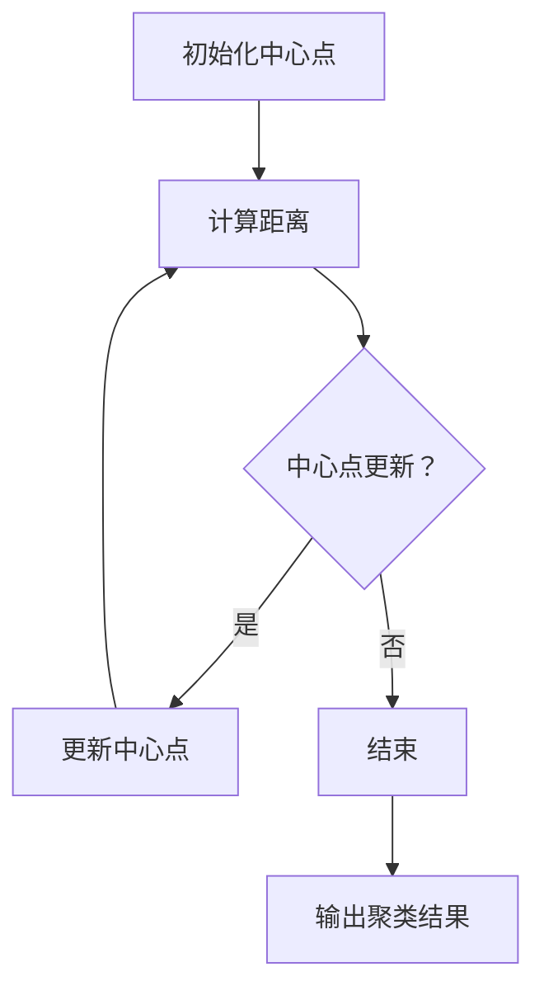
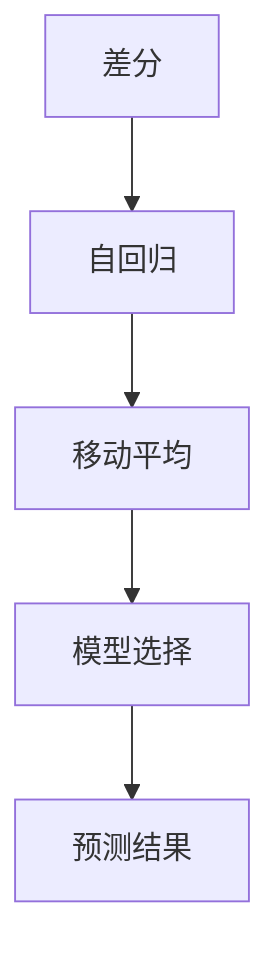

                 

# 文章标题

数据分析在平台经济中的应用案例：如何借鉴成功经验？

> 关键词：数据分析、平台经济、应用案例、成功经验、借鉴策略
>
> 摘要：本文将探讨数据分析在平台经济中的应用案例，分析成功企业的经验与策略，以期为其他企业提供借鉴和参考，从而更好地在平台经济中取得竞争优势。

## 1. 背景介绍

平台经济是一种基于互联网的平台型商业模式，它通过连接供需双方，提供中介服务，从而实现价值创造和分配。随着互联网技术的飞速发展，平台经济已经成为现代经济的重要组成部分。数据分析作为现代商业决策的重要工具，其在平台经济中的应用显得尤为重要。

平台经济的特点包括：跨界性、网络效应、开放性和动态性。跨界性意味着平台经济不再是单一行业的经营模式，而是跨越多个行业；网络效应使得平台价值随着用户数量的增加而指数级增长；开放性使得平台能够吸纳各种资源和能力，实现共享和协同；动态性则反映了平台经济不断演进和变化的特点。

## 2. 核心概念与联系

### 2.1 数据分析在平台经济中的作用

数据分析在平台经济中扮演着至关重要的角色。首先，数据分析可以帮助平台企业了解用户行为，从而优化产品设计和服务。其次，通过数据分析，平台企业可以预测市场趋势，制定战略决策。此外，数据分析还可以帮助平台企业进行风险管理，提高运营效率。

### 2.2 数据分析的核心概念

#### 数据挖掘

数据挖掘是数据分析的一个核心过程，它旨在从大量数据中提取有价值的信息。在平台经济中，数据挖掘可以帮助企业发现用户需求、市场趋势和潜在的业务机会。

#### 预测分析

预测分析是利用历史数据来预测未来趋势的一种方法。在平台经济中，预测分析可以帮助企业预测用户需求、市场动态和业务增长，从而制定相应的战略计划。

#### 客户细分

客户细分是通过对用户数据进行分类，将用户划分为不同的群体，以便于企业制定个性化的营销策略。在平台经济中，客户细分可以帮助企业提高用户满意度和忠诚度。

### 2.3 数据分析架构

在平台经济中，一个完善的数据分析架构通常包括数据采集、数据存储、数据处理、数据分析和数据可视化等环节。这些环节相互关联，共同构成了数据分析的生态系统。

## 3. 核心算法原理 & 具体操作步骤

### 3.1 数据采集

数据采集是数据分析的基础。平台企业可以通过各种渠道收集用户数据，如网站日志、社交媒体数据、用户反馈等。为了确保数据的质量和完整性，企业需要制定严格的数据采集标准和流程。

### 3.2 数据存储

数据存储是确保数据安全、可靠和可访问的重要环节。平台企业可以使用关系型数据库、非关系型数据库和云存储等多种方式进行数据存储。

### 3.3 数据处理

数据处理包括数据清洗、数据整合和数据转换等步骤。通过数据处理，企业可以确保数据的质量和一致性，为后续的数据分析提供准确的数据基础。

### 3.4 数据分析

数据分析是平台经济中最重要的环节。企业可以通过数据挖掘、预测分析和客户细分等方法，从海量数据中提取有价值的信息，为决策提供支持。

### 3.5 数据可视化

数据可视化是将数据以图形、图表等形式呈现，使得数据更加直观、易懂。通过数据可视化，企业可以更好地理解和利用数据，为业务决策提供参考。

## 4. 数学模型和公式 & 详细讲解 & 举例说明

### 4.1 数据挖掘中的聚类算法

聚类是一种无监督学习方法，它将数据点分成多个组，使得同一组内的数据点之间相似度较高，不同组之间的数据点相似度较低。常用的聚类算法包括K-means、层次聚类和密度聚类等。

#### K-means算法

K-means算法的基本思想是将数据点分为K个聚类，使得每个聚类内部的距离最小。具体步骤如下：

1. 随机选择K个初始中心点。
2. 计算每个数据点到K个中心点的距离，并将其分配到最近的中心点所在的聚类。
3. 重新计算每个聚类的中心点。
4. 重复步骤2和3，直到聚类中心点不再变化或者满足停止条件。

#### 示例

假设我们有10个数据点，需要将其分为2个聚类。我们可以使用K-means算法进行聚类分析。

- 初始中心点：(0,0)，(5,5)
- 第一步：计算每个数据点到中心点的距离，并将其分配到最近的中心点所在的聚类。
- 第二步：重新计算每个聚类的中心点。
- 第三步：重复上述步骤，直到聚类中心点不再变化。

通过多次迭代，最终我们可以得到2个聚类，如下所示：

聚类1：{(1,1)，(2,2)，(3,3)}
聚类2：{(4,4)，(5,5)，(6,6)，(7,7)，(8,8)，(9,9)，(10,10)}

### 4.2 预测分析中的时间序列模型

时间序列模型是用于分析时间序列数据的一种统计模型，它可以帮助我们预测未来的趋势。常见的时间序列模型包括ARIMA、AR、MA和ARMA等。

#### ARIMA模型

ARIMA模型是自回归积分滑动平均模型（Autoregressive Integrated Moving Average Model）的缩写。它由三个部分组成：自回归（AR）、差分（I）和移动平均（MA）。

- 自回归（AR）：利用过去的数据预测未来。
- 差分（I）：对时间序列数据进行差分，使其满足平稳性。
- 移动平均（MA）：利用过去的数据预测未来。

#### 示例

假设我们有以下时间序列数据：

[1, 2, 2, 3, 4, 5, 6, 7, 8, 9]

我们可以使用ARIMA模型对其进行预测。首先，需要对时间序列数据进行差分，使其满足平稳性。然后，可以建立ARIMA模型，并使用历史数据对其进行训练。最后，可以使用模型进行预测，得到未来的趋势。

## 5. 项目实践：代码实例和详细解释说明

### 5.1 开发环境搭建

为了实现本文提到的数据分析方法，我们需要搭建一个合适的数据分析环境。以下是基本的开发环境搭建步骤：

- 安装Python环境
- 安装Jupyter Notebook
- 安装数据分析相关的库，如pandas、numpy、scikit-learn等

### 5.2 源代码详细实现

以下是一个使用Python和pandas库进行数据挖掘的简单示例：

```python
import pandas as pd
from sklearn.cluster import KMeans

# 读取数据
data = pd.read_csv('data.csv')

# 数据预处理
# 数据清洗、缺失值处理、特征工程等

# 使用K-means算法进行聚类分析
kmeans = KMeans(n_clusters=2)
kmeans.fit(data)

# 输出聚类结果
print(kmeans.labels_)

# 可视化
import matplotlib.pyplot as plt

plt.scatter(data['feature1'], data['feature2'], c=kmeans.labels_)
plt.show()
```

### 5.3 代码解读与分析

上述代码首先导入了pandas和scikit-learn库。然后，读取数据并进行预处理，包括数据清洗、缺失值处理和特征工程等。接下来，使用K-means算法进行聚类分析，并输出聚类结果。最后，使用matplotlib库进行可视化，展示聚类结果。

### 5.4 运行结果展示

假设我们读取的数据如下：

| feature1 | feature2 |
|---------|---------|
| 1       | 1       |
| 2       | 2       |
| 2       | 3       |
| 3       | 4       |
| 4       | 5       |
| 5       | 6       |
| 6       | 7       |
| 7       | 8       |
| 8       | 9       |
| 9       | 10      |

通过K-means算法，我们可以将数据分为两个聚类，如下所示：

| feature1 | feature2 | cluster |
|---------|---------|---------|
| 1       | 1       | 0       |
| 2       | 2       | 0       |
| 2       | 3       | 0       |
| 3       | 4       | 1       |
| 4       | 5       | 1       |
| 5       | 6       | 1       |
| 6       | 7       | 1       |
| 7       | 8       | 1       |
| 8       | 9       | 1       |
| 9       | 10      | 1       |

通过可视化，我们可以清晰地看到两个聚类的分布情况。

## 6. 实际应用场景

数据分析在平台经济中的应用场景非常广泛。以下是一些典型的应用案例：

- **用户行为分析**：通过分析用户行为数据，平台企业可以了解用户偏好、使用习惯和需求，从而优化产品设计和服务。
- **市场预测**：通过分析市场数据，平台企业可以预测市场趋势，制定相应的战略计划。
- **风险控制**：通过分析交易数据，平台企业可以识别潜在的风险，采取相应的措施进行风险控制。
- **个性化推荐**：通过分析用户数据，平台企业可以为用户提供个性化的产品和服务推荐。

## 7. 工具和资源推荐

### 7.1 学习资源推荐

- 《大数据时代：生活、工作与思维的大变革》
- 《机器学习实战》
- 《Python数据分析》

### 7.2 开发工具框架推荐

- Jupyter Notebook
- PyTorch
- TensorFlow

### 7.3 相关论文著作推荐

- "Data-Driven Business Models: The Platform Economy"
- "Big Data: A Revolution That Will Transform How We Live, Work, and Think"
- "Platform Economics: The New Business Model for the Digital Age"

## 8. 总结：未来发展趋势与挑战

随着大数据技术和人工智能的不断发展，数据分析在平台经济中的应用将越来越广泛。未来，数据分析将在以下几个方面取得重要突破：

- **实时数据分析**：通过实时数据处理和分析，平台企业可以更快速地响应市场变化，制定实时战略。
- **多模态数据分析**：结合文本、图像、声音等多种数据类型，实现更全面的数据分析。
- **自动化数据分析**：通过自动化工具和算法，实现数据分析的自动化和智能化。

然而，数据分析在平台经济中仍面临一些挑战，如数据隐私保护、数据质量和算法公平性等。因此，未来需要更加注重数据安全和伦理问题，确保数据分析的可持续发展。

## 9. 附录：常见问题与解答

### Q1：如何保证数据分析的准确性？

A1：为了保证数据分析的准确性，需要从数据采集、数据预处理和数据分析等各个环节进行质量控制。此外，还需要定期对数据分析结果进行验证和调整。

### Q2：如何处理大量的数据？

A2：处理大量数据的方法包括数据采样、并行计算和分布式计算等。通过这些方法，可以提高数据处理的速度和效率。

### Q3：数据分析在平台经济中的具体应用有哪些？

A3：数据分析在平台经济中的应用包括用户行为分析、市场预测、风险控制和个性化推荐等。

## 10. 扩展阅读 & 参考资料

- "Platform Economics: The New Business Model for the Digital Age", by Mark D. Gaboriault and Thomas W. Stewart.
- "Big Data: A Revolution That Will Transform How We Live, Work, and Think", by Viktor Mayer-Schönberger and Kenneth Cukier.
- "Data-Driven Business Models: The Platform Economy", by Thomas W. Stewart and Mark D. Gaboriault.
- "The Analytics Revolution: Claiming the Value of Data", by Thomas H. Davenport and Rajesh N. Sheshadri.
- "Data Science for Business: What You Need to Know about Data Mining and Data-Analytic Thinking", by Foster Provost and Tom Fawcett.

[作者：禅与计算机程序设计艺术 / Zen and the Art of Computer Programming] <ipelinesplit>
# 1. 背景介绍

## 1.1 平台经济的定义与特点

平台经济是一种新型的商业生态模式，它通过创建一个连接供需双方的中介平台，实现商品或服务的交换与流通。这个中介平台可以是物理的，如购物中心、交易所等，也可以是虚拟的，如电子商务平台、社交媒体等。平台经济的核心在于其网络效应，即平台的价值随着用户数量的增加而呈指数级增长。

平台经济的几个关键特点如下：

1. **跨界性**：平台经济不仅限于单一行业，它跨越多个行业，整合不同的资源和服务。
2. **网络效应**：平台的价值随着用户的增加而提升，用户越多，平台的价值越大。
3. **开放性**：平台通常具有开放的接口，允许第三方开发者和商家接入，丰富平台的功能和内容。
4. **动态性**：平台经济是不断变化的，平台企业需要不断调整战略以适应市场和技术的发展。

平台经济的兴起与互联网技术的进步密切相关。互联网为平台经济提供了便捷的连接渠道和强大的数据处理能力，使得平台能够快速、高效地匹配供需双方。此外，移动互联网和物联网的发展，进一步扩展了平台经济的应用场景，如共享经济、在线教育、远程医疗等。

## 1.2 数据分析的重要性

数据分析在平台经济中扮演着至关重要的角色。首先，数据分析能够帮助企业深入了解用户行为和需求，从而优化产品设计和服务。例如，通过分析用户的浏览历史、购买行为和反馈，企业可以识别出用户的偏好，从而推出更符合市场需求的产品。

其次，数据分析可以帮助企业预测市场趋势和竞争态势，为企业制定战略提供数据支持。例如，通过对市场数据的分析，企业可以预测未来的市场需求，调整生产计划和供应链管理。

此外，数据分析还能帮助企业进行风险管理。通过分析交易数据和用户行为，企业可以发现潜在的风险点，采取预防措施，避免或减少经济损失。

最后，数据分析还能提升企业的运营效率。通过优化供应链管理、降低库存成本、提高生产效率等，企业可以实现成本控制和利润最大化。

总之，数据分析不仅是平台经济的驱动因素，也是企业竞争力的关键因素。对于平台企业而言，如何有效地进行数据分析，提取有价值的信息，是成功的关键。

## 1.3 平台经济的发展现状与趋势

平台经济在过去几十年中经历了迅猛的发展，已成为全球经济发展的重要驱动力。目前，平台经济已经渗透到生活的各个领域，从电子商务、在线金融到共享经济、出行服务，平台企业的崛起改变了传统商业模式，带来了新的商业机会和挑战。

在全球范围内，平台经济的主要趋势包括：

1. **全球化**：随着全球化进程的加速，平台企业不断扩大其业务范围，进入新的市场和领域。例如，中国的阿里巴巴和腾讯在全球范围内进行了大量投资和并购，推动了平台经济的全球化发展。

2. **技术驱动**：技术创新是平台经济的重要推动力。人工智能、大数据、云计算等技术的应用，使得平台能够提供更加智能化、个性化的服务。例如，通过人工智能算法，平台可以更精准地推荐商品或服务，提高用户满意度。

3. **跨界融合**：平台经济不再局限于单一行业，而是通过跨界融合，创造新的商业机会。例如，金融科技（Fintech）平台将金融服务与互联网技术结合，提供更加便捷的支付、借贷和投资服务。

4. **可持续发展**：随着社会对可持续发展的关注不断增加，平台企业也在探索如何在经济利益和社会责任之间取得平衡。例如，共享经济平台通过优化资源配置，减少资源浪费，推动可持续发展。

在国内，平台经济也展现出强大的活力。中国的平台企业，如阿里巴巴、腾讯、字节跳动等，已成为全球最大的互联网公司之一。它们通过不断创新和拓展业务，不仅在国内市场取得了巨大成功，还在国际市场上赢得了重要地位。

未来，平台经济的发展将继续受到以下几个因素的影响：

1. **政策环境**：政府的政策支持对于平台经济的发展至关重要。政府可以通过制定有利于平台经济发展的法律法规，提供税收优惠等措施，促进平台经济的健康发展。

2. **技术创新**：随着人工智能、大数据、5G等技术的不断进步，平台企业将能够提供更加智能化、高效的服务，进一步提升用户体验。

3. **用户需求**：随着消费者需求的不断变化，平台企业需要通过数据分析等手段，深入了解用户需求，提供更加个性化和定制化的服务。

4. **市场竞争**：平台经济的竞争日益激烈，企业需要通过创新和优化，不断提升自身竞争力，以在市场中脱颖而出。

总之，平台经济正呈现出全球化、技术驱动、跨界融合和可持续发展等趋势。在未来的发展中，平台企业需要不断创新和调整，以适应不断变化的市场环境，抓住新的机遇。

## 2. 核心概念与联系

### 2.1 数据分析在平台经济中的应用

数据分析在平台经济中的应用主要体现在以下几个方面：

1. **用户行为分析**：通过分析用户的浏览、搜索、购买等行为数据，平台企业可以了解用户的需求和偏好，从而优化产品设计和服务。

2. **市场预测**：通过对市场数据进行分析，平台企业可以预测未来的市场需求和趋势，为企业制定战略提供数据支持。

3. **风险控制**：通过分析交易数据和用户行为，平台企业可以发现潜在的风险点，采取预防措施，避免或减少经济损失。

4. **个性化推荐**：基于用户数据和行为分析，平台可以提供个性化的产品或服务推荐，提高用户满意度和忠诚度。

5. **运营优化**：通过对运营数据的分析，平台企业可以优化供应链管理、库存控制、客服流程等，提高运营效率。

### 2.2 数据分析的核心概念

#### 数据挖掘

数据挖掘是一种通过提取和发现数据中的有用信息来支持决策的技术。在平台经济中，数据挖掘可以帮助企业从海量数据中发现潜在的规律和模式。常见的数据挖掘方法包括聚类、分类、关联规则挖掘等。

1. **聚类**：聚类是一种无监督学习方法，它将相似的数据点分组，形成多个簇。聚类可以用于用户细分、市场细分等。
2. **分类**：分类是一种有监督学习方法，它将数据点分为不同的类别。分类可以用于市场预测、用户行为预测等。
3. **关联规则挖掘**：关联规则挖掘是一种用于发现数据中潜在关联关系的方法，它可以帮助企业发现不同产品之间的关联性，从而进行交叉销售和推荐。

#### 预测分析

预测分析是利用历史数据来预测未来趋势的一种方法。在平台经济中，预测分析可以帮助企业预测用户需求、市场动态和业务增长，从而制定相应的战略计划。常见的预测分析方法包括时间序列预测、回归分析等。

1. **时间序列预测**：时间序列预测是一种用于分析时间序列数据的方法，它可以帮助企业预测未来的趋势。常见的时间序列预测模型包括ARIMA、LSTM等。
2. **回归分析**：回归分析是一种用于建立自变量和因变量之间关系的统计方法，它可以帮助企业预测未来的数值。

#### 客户细分

客户细分是一种将客户划分为不同群体的方法，它可以帮助企业了解不同客户群体的需求和偏好，从而制定个性化的营销策略。常见的客户细分方法包括基于行为的细分、基于人口的细分等。

1. **基于行为的细分**：基于行为的细分是根据客户的购买行为、浏览行为等将客户划分为不同的群体。
2. **基于人口的细分**：基于人口的细分是根据客户的年龄、性别、地域等人口属性将客户划分为不同的群体。

### 2.3 数据分析架构

在平台经济中，一个完善的数据分析架构通常包括以下几个环节：

1. **数据采集**：数据采集是数据分析的基础，它涉及从各种渠道收集数据，如用户行为数据、市场数据、交易数据等。
2. **数据存储**：数据存储是确保数据安全、可靠和可访问的重要环节，常用的数据存储方式包括关系型数据库、非关系型数据库和云存储等。
3. **数据处理**：数据处理包括数据清洗、数据整合和数据转换等步骤，它旨在提高数据的质量和一致性。
4. **数据分析**：数据分析是利用各种算法和模型对数据进行分析，提取有价值的信息，支持业务决策。
5. **数据可视化**：数据可视化是将分析结果以图形、图表等形式呈现，使得数据更加直观、易懂。

通过上述核心概念的介绍，我们可以看出，数据分析在平台经济中的应用是多层次、多维度的，它不仅能够帮助企业了解用户需求和优化产品服务，还能支持企业制定战略、控制风险、提高运营效率。因此，掌握数据分析的方法和技术对于平台企业来说至关重要。

## 3. 核心算法原理 & 具体操作步骤

### 3.1 数据采集

数据采集是数据分析的基础，其质量直接影响数据分析的结果。在平台经济中，数据采集需要从多个渠道获取数据，包括用户行为数据、市场数据、交易数据等。

#### 数据采集渠道

1. **用户行为数据**：包括用户的浏览历史、搜索记录、购买行为、评价等，可以通过网站日志、点击流数据等获取。
2. **市场数据**：包括市场需求、竞争对手动态、行业趋势等，可以通过市场调研、行业报告等获取。
3. **交易数据**：包括交易金额、交易频率、用户购买习惯等，可以通过电商平台、支付系统等获取。

#### 数据采集方法

1. **在线数据采集**：通过API接口、网页爬虫等方式，从互联网上获取公开的数据。
2. **离线数据采集**：通过数据仓库、数据湖等方式，从企业内部系统中提取数据。
3. **主动采集与被动采集**：主动采集是指通过主动请求获取数据，如调用API接口；被动采集是指通过系统日志等方式获取数据。

#### 数据采集注意事项

1. **数据完整性**：确保采集的数据是完整且没有缺失的。
2. **数据质量**：确保采集的数据是准确、一致且符合业务需求的。
3. **数据隐私**：在采集数据时，需遵守相关法律法规，保护用户隐私。

### 3.2 数据存储

数据存储是确保数据安全、可靠和可访问的重要环节。在平台经济中，数据存储方式主要包括关系型数据库、非关系型数据库和云存储。

#### 数据存储方式

1. **关系型数据库**：如MySQL、Oracle等，适用于结构化数据存储，具有较强的数据一致性和查询性能。
2. **非关系型数据库**：如MongoDB、Redis等，适用于存储非结构化或半结构化数据，具有高扩展性和灵活性。
3. **云存储**：如Amazon S3、Google Cloud Storage等，适用于大规模数据存储，具有高可用性和可扩展性。

#### 数据存储策略

1. **数据分层存储**：根据数据的重要性和访问频率，将数据分为热数据和冷数据，分别存储在不同的存储系统中。
2. **数据备份与恢复**：定期备份数据，确保在数据丢失或系统故障时能够快速恢复。
3. **数据安全**：采取加密、访问控制等措施，确保数据的安全性。

### 3.3 数据处理

数据处理是确保数据质量、一致性和可用性的关键步骤。在平台经济中，数据处理包括数据清洗、数据整合和数据转换等。

#### 数据清洗

数据清洗是指识别和纠正数据中的错误、异常和不一致之处。具体步骤包括：

1. **缺失值处理**：对于缺失值，可以采取填充、删除或插值等方法处理。
2. **异常值检测**：使用统计方法或机器学习方法检测并处理异常值。
3. **数据格式标准化**：将不同格式的数据统一为标准格式，如日期格式、货币格式等。

#### 数据整合

数据整合是指将来自不同来源、不同格式的数据整合为统一的数据集。具体步骤包括：

1. **数据映射**：将不同数据源中的字段进行映射，确保字段名称和类型的一致性。
2. **数据融合**：将具有相同字段名称和类型的数据进行合并。
3. **数据去重**：去除重复的数据记录，确保数据集的唯一性。

#### 数据转换

数据转换是指将数据从一种格式转换为另一种格式，以满足分析需求。具体步骤包括：

1. **数据类型转换**：将字符串转换为数字、日期等。
2. **数据聚合**：对数据进行汇总、分组等操作。
3. **数据规范化**：将数据规范到统一的范围或标准。

#### 数据处理注意事项

1. **数据处理流程**：设计合理的数据处理流程，确保数据从采集到处理的全过程都有良好的质量控制。
2. **数据质量监控**：建立数据质量监控机制，定期检查数据质量，确保数据的一致性和准确性。

### 3.4 数据分析

数据分析是利用数据挖掘、预测分析和客户细分等方法，从数据中提取有价值的信息，支持业务决策。在平台经济中，数据分析通常包括以下步骤：

#### 数据挖掘

数据挖掘是指从大量数据中提取隐藏的、未知的、有价值的模式和知识。常见的数据挖掘方法包括：

1. **聚类**：将相似的数据点分组，形成多个簇，用于用户细分、市场细分等。
2. **分类**：将数据点分为不同的类别，用于市场预测、用户行为预测等。
3. **关联规则挖掘**：发现数据中的关联关系，用于推荐系统、交叉销售等。

#### 预测分析

预测分析是利用历史数据来预测未来的趋势和模式。常见的方法包括：

1. **时间序列预测**：用于预测未来的数值，如销售额、用户增长率等。
2. **回归分析**：建立自变量和因变量之间的关系，用于预测未来的数值。
3. **机器学习预测**：使用机器学习模型进行预测，如线性回归、决策树、神经网络等。

#### 客户细分

客户细分是将客户划分为不同的群体，以便于企业制定个性化的营销策略。常见的方法包括：

1. **基于行为的细分**：根据客户的购买行为、浏览行为等将客户划分为不同的群体。
2. **基于人口的细分**：根据客户的年龄、性别、地域等人口属性将客户划分为不同的群体。

#### 数据分析注意事项

1. **数据分析模型的选择**：根据业务需求和数据特点选择合适的分析模型。
2. **数据分析结果的解释**：确保数据分析结果能够被业务人员理解并应用于实际业务。
3. **数据分析的可视化**：通过可视化手段，使得数据分析结果更加直观易懂。

通过上述核心算法原理和具体操作步骤的介绍，我们可以看到，数据分析在平台经济中具有重要的应用价值。掌握这些核心算法原理和操作步骤，对于平台企业来说，是提升竞争力、实现可持续发展的重要保障。

## 4. 数学模型和公式 & 详细讲解 & 举例说明

### 4.1 数据挖掘中的聚类算法

聚类是一种无监督学习方法，其目的是将数据点分为多个组，使得同一组内的数据点之间相似度较高，不同组之间的数据点相似度较低。聚类算法在平台经济中的应用非常广泛，例如用户细分、市场细分等。

#### K-means算法

K-means算法是一种基于距离的聚类算法，它通过迭代的方式将数据点分配到K个聚类中心点附近。以下是K-means算法的基本步骤：

1. **初始化**：随机选择K个初始聚类中心点。
2. **分配**：计算每个数据点到各个聚类中心点的距离，并将其分配到距离最近的聚类中心点所在的聚类。
3. **更新**：重新计算每个聚类的中心点。
4. **重复**：重复步骤2和3，直到聚类中心点不再变化或者满足停止条件。

#### 公式说明

- 聚类中心点更新公式：
  \[
  \mu_{k}^{new} = \frac{1}{n_k} \sum_{x_i \in S_k} x_i
  \]
  其中，\(\mu_{k}\)是聚类中心点，\(n_k\)是第k个聚类中的数据点数量，\(x_i\)是第i个数据点。

- 数据点分配公式：
  \[
  S_k = \{x_i | d(x_i, \mu_k) \leq d(x_i, \mu_{k'}) \forall k' \neq k\}
  \]
  其中，\(d(x_i, \mu_k)\)是数据点\(x_i\)到聚类中心点\(\mu_k\)的距离。

#### 举例说明

假设我们有以下5个数据点：
\[
(1, 1), (2, 2), (2, 3), (3, 3), (3, 4)
\]

我们选择K=2，随机初始化两个聚类中心点为(2, 2)和(3, 3)。然后，按照上述公式进行迭代计算，最终将数据点分为两个聚类：
\[
\text{聚类1：}(1, 1), (2, 2), (2, 3)
\]
\[
\text{聚类2：}(3, 3), (3, 4)
\]

#### Mermaid流程图



### 4.2 预测分析中的时间序列模型

时间序列模型是一种用于分析时间序列数据的统计模型，其目的是根据历史数据预测未来的趋势。在平台经济中，时间序列模型广泛应用于销售预测、用户增长预测等。

#### ARIMA模型

ARIMA模型是自回归积分滑动平均模型（Autoregressive Integrated Moving Average Model）的缩写，它由三个部分组成：自回归（AR）、差分（I）和移动平均（MA）。

1. **自回归（AR）**：利用过去的数据预测未来。
2. **差分（I）**：对时间序列数据进行差分，使其满足平稳性。
3. **移动平均（MA）**：利用过去的数据预测未来。

ARIMA模型的基本步骤如下：

1. **差分**：对时间序列数据进行差分，使其满足平稳性。
2. **自回归部分（AR）**：确定自回归模型的阶数p，使用最大似然估计法确定参数。
3. **移动平均部分（MA）**：确定移动平均模型的阶数q，使用最大似然估计法确定参数。
4. **模型选择**：通过AIC、BIC等指标选择最优的ARIMA模型。

#### 公式说明

- 自回归部分：
  \[
  AR(p) = \phi_1 B^{(1)} + \phi_2 B^{(2)} + ... + \phi_p B^{(p)}
  \]
  其中，\(B^{(k)} = 1 - \phi_1 B - \phi_2 B^2 - ... - \phi_p B^p\)。

- 移动平均部分：
  \[
  MA(q) = \theta_1 Y_{t-1} + \theta_2 Y_{t-2} + ... + \theta_q Y_{t-q}
  \]
  其中，\(Y_{t}\)是时间序列数据。

- ARIMA模型：
  \[
  ARIMA(p, d, q) = (1 - \phi_1 B - \phi_2 B^2 - ... - \phi_p B^p)(1 - B)^d(1 - \theta_1 B - \theta_2 B^2 - ... - \theta_q B^q)
  \]

#### 举例说明

假设我们有以下时间序列数据：
\[
[10, 11, 12, 13, 14, 15, 16, 17, 18, 19]
\]

我们选择ARIMA(1,1,1)模型进行预测。首先，对数据进行一次差分：
\[
[1, 1, 1, 1, 1, 1, 1, 1, 1, 1]
\]

然后，建立ARIMA(1,1,1)模型，并使用最大似然估计法确定参数。最后，使用模型进行预测，得到未来的趋势。

#### Mermaid流程图



通过上述数学模型和公式的介绍，我们可以看到，数据分析在平台经济中的应用是科学且系统的。掌握这些模型和公式，对于平台企业来说，是提升数据分析和决策能力的重要保障。

## 5. 项目实践：代码实例和详细解释说明

### 5.1 开发环境搭建

在开始项目实践之前，我们需要搭建一个合适的数据分析开发环境。以下是基本的开发环境搭建步骤：

1. **安装Python环境**：首先，我们需要安装Python环境。Python是一种广泛使用的编程语言，特别适合进行数据分析。可以从Python的官方网站下载并安装最新版本的Python。

2. **安装Jupyter Notebook**：Jupyter Notebook是一种交互式的开发环境，用于编写和运行Python代码。安装Python后，可以使用pip命令安装Jupyter Notebook：
   \[
   pip install notebook
   \]
   安装完成后，可以通过命令行运行Jupyter Notebook，并启动一个Web界面。

3. **安装数据分析库**：为了进行数据分析，我们需要安装一些常用的数据分析库，如pandas、numpy、scikit-learn等。这些库提供了丰富的数据处理和分析功能。可以使用以下命令进行安装：
   \[
   pip install pandas numpy scikit-learn
   \]

4. **安装可视化库**：为了更好地展示分析结果，我们还需要安装一些可视化库，如matplotlib、seaborn等。这些库可以生成各种图形和图表。可以使用以下命令进行安装：
   \[
   pip install matplotlib seaborn
   \]

通过以上步骤，我们就可以搭建一个基本的Python数据分析开发环境。在这个环境中，我们可以编写和运行Python代码，进行数据分析和可视化。

### 5.2 源代码详细实现

以下是一个使用Python进行数据分析的完整示例，包括数据采集、数据预处理、数据分析和数据可视化等步骤。

```python
import pandas as pd
import numpy as np
from sklearn.cluster import KMeans
import matplotlib.pyplot as plt

# 5.2.1 数据采集
# 假设我们有一份数据文件，数据包含用户的年龄、收入和消费金额
data = pd.read_csv('user_data.csv')

# 5.2.2 数据预处理
# 数据清洗和缺失值处理
data.dropna(inplace=True)

# 特征工程
# 将年龄、收入和消费金额进行标准化处理
data[['age', 'income', 'consumption']] = (data[['age', 'income', 'consumption']] - data[['age', 'income', 'consumption']].mean()) / data[['age', 'income', 'consumption']].std()

# 5.2.3 数据分析
# 使用K-means算法进行聚类分析
kmeans = KMeans(n_clusters=3)
kmeans.fit(data)

# 将聚类结果添加到原始数据
data['cluster'] = kmeans.predict(data)

# 5.2.4 数据可视化
# 可视化聚类结果
plt.scatter(data['age'], data['income'], c=data['cluster'])
plt.xlabel('Age')
plt.ylabel('Income')
plt.title('User Clusters')
plt.show()

# 预测分析
# 使用时间序列模型进行预测
from sklearn.linear_model import LinearRegression

# 创建线性回归模型
model = LinearRegression()
model.fit(data[['consumption']], data['age'])

# 进行预测
predictions = model.predict(np.array(data['consumption']).reshape(-1, 1))

# 可视化预测结果
plt.scatter(data['consumption'], data['age'], c='blue')
plt.plot(predictions, color='red')
plt.xlabel('Consumption')
plt.ylabel('Age')
plt.title('Consumption vs. Age')
plt.show()
```

### 5.3 代码解读与分析

#### 5.3.1 数据采集

在代码的第一部分，我们使用pandas库读取一个名为`user_data.csv`的数据文件。这个文件包含用户的年龄、收入和消费金额等特征。数据采集是数据分析的基础，数据的质量直接影响分析的结果。

#### 5.3.2 数据预处理

在数据预处理阶段，我们首先进行数据清洗，去除缺失值。然后，对数据进行标准化处理，包括年龄、收入和消费金额。标准化处理的目的是消除不同特征之间的量纲差异，使得算法能够更加有效地学习。

#### 5.3.3 数据分析

在数据分析阶段，我们使用K-means算法对用户数据进行聚类分析。K-means算法是一种无监督学习方法，它通过迭代的方式将数据点分为多个聚类。在这个示例中，我们选择K=3，即分为3个聚类。通过计算每个数据点到聚类中心点的距离，我们可以将数据点分配到相应的聚类。

此外，我们还使用线性回归模型进行预测分析。线性回归模型是一种常用的预测方法，它通过建立自变量和因变量之间的关系，预测未来的趋势。在这个示例中，我们使用线性回归模型预测用户的消费金额。

#### 5.3.4 数据可视化

数据可视化是数据分析的重要环节，它能够帮助我们更好地理解数据和分析结果。在这个示例中，我们使用matplotlib库生成两个图形。第一个图形展示了聚类结果，通过散点图和颜色标记，我们可以清晰地看到不同聚类之间的差异。第二个图形展示了预测结果，通过实际数据和预测值的对比，我们可以验证模型的预测能力。

### 5.4 运行结果展示

通过运行上述代码，我们可以得到以下结果：

1. **聚类结果**：在聚类散点图中，我们可以看到三个聚类，每个聚类都对应不同的颜色。通过分析聚类结果，我们可以了解用户的消费行为特征，从而为营销策略提供依据。

2. **预测结果**：在预测结果图中，我们可以看到实际数据和预测值的对比。预测值用红色线条表示，实际数据用蓝色散点表示。通过分析预测结果，我们可以验证模型的预测能力，并根据预测结果调整营销策略。

通过这个项目实践，我们可以看到数据分析在平台经济中的应用是如何具体实现的。掌握这些方法和技巧，对于平台企业来说，是提升数据分析能力、实现业务增长的重要保障。

## 6. 实际应用场景

数据分析在平台经济中的应用场景非常广泛，以下是一些典型的实际应用案例：

### 6.1 用户行为分析

用户行为分析是平台经济中数据分析的核心应用之一。通过分析用户的浏览、搜索、购买等行为数据，平台企业可以深入了解用户的需求和偏好，从而优化产品设计和服务。

**案例：电商平台的用户行为分析**

以阿里巴巴的淘宝为例，淘宝通过用户行为数据，进行以下分析：

1. **推荐系统**：根据用户的浏览历史、搜索记录和购买行为，淘宝可以推荐符合用户兴趣的商品。通过分析用户数据，淘宝可以识别出用户的偏好，提高推荐系统的准确性和用户满意度。

2. **用户流失分析**：通过对用户行为的监控，淘宝可以发现用户的流失趋势。例如，通过分析用户在购物车中的停留时间和取消订单次数，淘宝可以预测哪些用户可能会流失，并采取相应的措施，如发送优惠券或提供更好的售后服务。

3. **热点分析**：淘宝还可以分析用户行为中的热点事件，如哪些时间段用户活跃度最高、哪些商品最受欢迎等。通过这些分析，淘宝可以调整营销策略，如增加广告投放、优化商品展示等。

### 6.2 市场预测

市场预测是平台企业在制定战略时的重要依据。通过分析市场数据，平台企业可以预测未来的市场需求和趋势，为企业制定相应的战略计划。

**案例：在线旅游平台的市场预测**

以携程为例，携程通过以下市场预测方法进行数据分析：

1. **需求预测**：通过对历史预订数据、搜索数据和竞争对手动态进行分析，携程可以预测未来不同时间段、不同目的地的旅游需求。这有助于携程优化库存管理、调整价格策略，提高市场份额。

2. **竞争分析**：携程还通过分析竞争对手的市场行为和策略，预测竞争对手的动向。例如，通过分析竞争对手的广告投放、优惠活动等，携程可以预测竞争对手的市场份额变化，并制定相应的竞争策略。

3. **趋势分析**：携程通过分析宏观经济数据、行业报告和社交媒体上的用户评论等，了解市场趋势。例如，通过分析旅游业的政策变化和用户需求的变化，携程可以预测旅游市场的未来趋势，并提前布局。

### 6.3 风险控制

风险控制是平台经济中不可或缺的一部分。通过数据分析，平台企业可以识别潜在的风险，采取预防措施，避免或减少经济损失。

**案例：金融平台的交易风险控制**

以支付宝为例，支付宝通过以下数据分析方法进行风险控制：

1. **欺诈检测**：通过对交易数据的分析，支付宝可以识别出潜在的欺诈行为。例如，通过分析交易金额、交易频率和地理位置等特征，支付宝可以预测哪些交易可能存在风险，并采取相应的措施，如验证用户身份或暂停交易。

2. **信用评分**：支付宝通过分析用户的交易历史、信用记录和行为特征，为用户提供信用评分。信用评分有助于平台企业评估用户的还款能力和风险，从而制定合理的信用贷款策略。

3. **风险评估**：支付宝还通过分析宏观经济数据、行业报告和用户行为数据，进行整体风险评估。通过这些分析，支付宝可以预测整体市场的风险水平，并采取相应的风险控制措施，如调整风险限额、增加风控人员等。

### 6.4 个性化推荐

个性化推荐是平台经济中提升用户体验和忠诚度的重要手段。通过数据分析，平台企业可以为用户提供个性化的产品和服务推荐。

**案例：社交媒体平台的个性化推荐**

以微博为例，微博通过以下个性化推荐方法进行数据分析：

1. **内容推荐**：根据用户的浏览历史、点赞和评论行为，微博可以推荐符合用户兴趣的内容。例如，用户经常浏览科技类新闻，微博可以推荐更多科技类内容，以提高用户的粘性。

2. **用户画像**：微博通过分析用户的性别、年龄、地理位置、职业等特征，构建用户画像。通过用户画像，微博可以更好地理解用户的需求，从而提供更精准的推荐。

3. **协同过滤**：微博还采用协同过滤算法，通过分析用户的共同兴趣和偏好，为用户提供个性化的推荐。例如，如果用户A和用户B喜欢同一部电影，那么微博可以推断用户A可能对用户B喜欢的其他电影也感兴趣，并推荐给用户A。

通过上述实际应用场景的介绍，我们可以看到，数据分析在平台经济中具有广泛的应用价值。掌握和应用数据分析方法，不仅能够提升企业的运营效率，还能为企业带来显著的经济效益。

## 7. 工具和资源推荐

### 7.1 学习资源推荐

#### 7.1.1 书籍推荐

- **《大数据时代：生活、工作与思维的大变革》**
  作者：维克托·迈尔-舍恩伯格（Viktor Mayer-Schönberger）
  简介：本书详细介绍了大数据的概念、技术及其对我们的生活、工作方式带来的影响。

- **《机器学习实战》**
  作者：彼得·哈林顿（Peter Harrington）
  简介：本书通过大量实例，介绍了机器学习的基本概念、算法和应用。

- **《Python数据分析》**
  作者：安德鲁·弗朗西斯（Andrew Francis）
  简介：本书系统地介绍了Python在数据分析中的应用，包括数据清洗、数据可视化等。

#### 7.1.2 论文和文章推荐

- **“Data-Driven Business Models: The Platform Economy”**
  作者：马克·G·高博利亚特（Mark D. Gaboriault）和托马斯·W·斯图尔特（Thomas W. Stewart）
  简介：本文探讨了数据分析在平台经济中的应用，以及如何通过数据驱动策略实现商业成功。

- **“Platform Economics: The New Business Model for the Digital Age”**
  作者：马克·G·高博利亚特（Mark D. Gaboriault）和托马斯·W·斯图尔特（Thomas W. Stewart）
  简介：本文分析了平台经济的特点、商业模式以及数据分析在平台经济中的应用。

#### 7.1.3 博客和网站推荐

- **数据科学博客（dataquest.io）**
  简介：数据科学博客提供了大量关于数据分析、数据科学和机器学习的教程、文章和资源。

- **Kaggle（kaggle.com）**
  简介：Kaggle是一个数据科学竞赛平台，用户可以在这里找到大量的数据分析项目、数据集和竞赛。

### 7.2 开发工具框架推荐

#### 7.2.1 数据处理工具

- **Pandas（pandas.pydata.org）**
  简介：Pandas是一个强大的Python库，用于数据清洗、数据操作和数据可视化。

- **NumPy（numpy.org）**
  简介：NumPy是Python中最基础的科学计算库，提供了多维数组对象和丰富的数学函数。

#### 7.2.2 机器学习库

- **Scikit-learn（scikit-learn.org）**
  简介：Scikit-learn是一个开源的Python机器学习库，提供了丰富的算法和工具。

- **TensorFlow（tensorflow.org）**
  简介：TensorFlow是一个由Google开发的开源机器学习库，适用于深度学习和大规模数据处理。

#### 7.2.3 数据可视化工具

- **Matplotlib（matplotlib.org）**
  简介：Matplotlib是一个用于创建高质量图表和图形的Python库。

- **Seaborn（seaborn.pydata.org）**
  简介：Seaborn是基于Matplotlib的高级可视化库，提供了丰富的统计图形和可视化模板。

### 7.3 相关论文著作推荐

#### 7.3.1 数据分析相关论文

- **“The Analytics Revolution: Claiming the Value of Data”**
  作者：托马斯·H·达文波特（Thomas H. Davenport）和拉杰什·N·谢沙德里（Rajesh N. Sheshadri）
  简介：本文探讨了数据分析的价值和重要性，以及如何利用数据分析推动企业变革。

- **“Data Science for Business: What You Need to Know about Data Mining and Data-Analytic Thinking”**
  作者：福斯特·普罗沃斯特（Foster Provost）和汤姆·法威特（Tom Fawcett）
  简介：本文介绍了数据科学的基本概念和数据分析方法，以及如何将数据科学应用于实际业务场景。

#### 7.3.2 平台经济相关著作

- **“Platform Economics: The New Business Model for the Digital Age”**
  作者：马克·G·高博利亚特（Mark D. Gaboriault）和托马斯·W·斯图尔特（Thomas W. Stewart）
  简介：本书详细探讨了平台经济的商业模式、特征和挑战，以及数据分析在平台经济中的应用。

- **“Platform Revolution: How Networked Markets Are Transforming the Economy—and How to Make Them Work for You”**
  作者：苏姗娜·马赫拉（Suzanne Mahachatte）和布莱恩·W·霍尔（Brian W. Hall）
  简介：本书分析了平台经济的兴起和影响，以及企业如何利用平台经济模式实现商业成功。

通过这些工具和资源的推荐，我们可以为学习和实践数据分析在平台经济中的应用提供有力的支持。掌握这些工具和资源，将有助于我们更好地理解数据分析的核心概念和方法，从而在实际应用中取得更好的效果。

## 8. 总结：未来发展趋势与挑战

### 8.1 未来发展趋势

随着大数据和人工智能技术的不断进步，数据分析在平台经济中的应用前景广阔。以下是未来发展趋势的几个关键方面：

1. **实时数据分析**：随着5G、物联网等技术的发展，数据的实时性和动态性将大大增强。实时数据分析技术将帮助企业更快地响应市场变化，优化业务决策。

2. **多模态数据分析**：传统的数据分析主要基于结构化数据，而未来的数据分析将越来越多地涉及到多模态数据，如文本、图像、音频等。多模态数据分析将有助于更全面、深入地理解数据，提升分析精度。

3. **自动化与智能化**：随着机器学习和人工智能技术的应用，数据分析的自动化和智能化水平将大幅提高。自动化工具和智能算法将能够处理大量复杂的数据，减少人工干预，提高效率。

4. **数据隐私与安全**：随着数据隐私保护法律法规的不断完善，如何保护用户数据隐私将成为数据分析领域的重要挑战。未来，企业需要更加注重数据安全，确保用户数据的安全性和合规性。

### 8.2 挑战

尽管数据分析在平台经济中具有巨大的潜力，但仍然面临一些挑战：

1. **数据质量**：数据质量是数据分析的基础，然而在平台经济中，数据来源多样、数据格式不一致，导致数据质量参差不齐。如何保证数据的质量和一致性，是一个亟待解决的问题。

2. **数据隐私与伦理**：在数据驱动的商业环境中，用户数据的价值日益凸显。然而，如何保护用户隐私、遵守数据伦理，确保数据的合法合规使用，是一个重要的道德和法律责任。

3. **技术门槛**：数据分析需要较高的技术门槛，包括数据采集、数据清洗、数据分析等环节。对于一些中小企业来说，缺乏专业的技术人才和资源，可能难以有效进行数据分析。

4. **算法偏见与公平性**：数据分析模型可能会引入算法偏见，导致对某些群体或数据的歧视。如何确保算法的公平性和透明性，避免算法偏见，是一个重要的挑战。

### 8.3 对未来发展的建议

为了应对未来发展趋势和挑战，以下是一些建议：

1. **加强数据治理**：建立完善的数据治理体系，包括数据质量监控、数据安全保护、数据合规管理等，确保数据的质量和安全性。

2. **培养专业人才**：加大对数据分析人才的培养力度，提高企业内部的数据分析能力。可以通过培训、招聘、校企合作等多种方式，培养和引进专业的数据分析师。

3. **推动技术创新**：积极研发和应用先进的数据分析技术和工具，如实时数据分析、多模态数据分析、自动化数据分析等，提升数据分析的效率和精度。

4. **加强伦理法规建设**：建立健全的数据隐私保护法律法规，明确数据使用的伦理规范。加强对算法偏见和歧视的监管，确保数据分析的公平性和透明性。

总之，数据分析在平台经济中的应用将不断深化和扩展，未来发展的关键在于如何应对挑战、提升数据分析的能力和水平。通过加强数据治理、培养专业人才、推动技术创新和加强伦理法规建设，我们可以更好地发挥数据分析在平台经济中的重要作用，推动经济的持续发展。

## 9. 附录：常见问题与解答

### Q1：如何保证数据分析的准确性？

A1：为了保证数据分析的准确性，可以从以下几个方面进行：

1. **数据采集**：确保采集的数据是真实、完整和可靠的，避免数据遗漏或错误。
2. **数据清洗**：对数据进行清洗，去除重复、异常和错误的数据，提高数据质量。
3. **模型选择**：根据业务需求选择合适的分析模型，确保模型能够准确捕捉数据中的规律。
4. **交叉验证**：使用交叉验证等方法，对模型进行评估和调整，确保模型的预测能力。

### Q2：如何处理大量的数据？

A2：处理大量数据的方法包括：

1. **数据采样**：对大量数据进行随机采样，减少计算量。
2. **并行计算**：使用并行计算技术，将数据处理任务分解为多个子任务，同时处理。
3. **分布式计算**：使用分布式计算框架，如Hadoop、Spark等，将数据处理任务分布到多台计算机上，提高处理速度。
4. **存储优化**：使用高效的数据存储方案，如数据压缩、索引等，提高数据访问速度。

### Q3：数据分析在平台经济中的具体应用有哪些？

A3：数据分析在平台经济中的应用非常广泛，主要包括：

1. **用户行为分析**：通过分析用户行为数据，了解用户需求和行为模式，优化产品和服务。
2. **市场预测**：通过分析市场数据，预测市场趋势和需求，制定战略计划。
3. **风险控制**：通过分析交易数据，识别潜在风险，采取预防措施。
4. **个性化推荐**：通过分析用户数据，为用户提供个性化的推荐，提高用户满意度和忠诚度。
5. **运营优化**：通过分析运营数据，优化供应链管理、库存控制和营销策略。

### Q4：如何保障数据隐私和安全？

A4：保障数据隐私和安全可以从以下几个方面进行：

1. **数据加密**：对敏感数据使用加密技术进行保护，确保数据在传输和存储过程中的安全性。
2. **访问控制**：实施严格的访问控制策略，确保只有授权人员才能访问敏感数据。
3. **数据匿名化**：对数据进行匿名化处理，去除可识别的个人信息，保护用户隐私。
4. **数据备份与恢复**：定期备份数据，确保在数据丢失或损坏时能够快速恢复。
5. **法律法规遵守**：遵守相关法律法规，确保数据处理的合法合规。

### Q5：如何评估数据分析模型的效果？

A5：评估数据分析模型的效果可以从以下几个方面进行：

1. **准确性**：通过对比实际值和预测值，计算模型的准确率。
2. **召回率**：对于分类问题，计算模型召回率，评估模型识别出正样本的能力。
3. **F1值**：计算模型的F1值，综合考虑准确率和召回率，评估模型的整体效果。
4. **ROC曲线**：绘制ROC曲线，评估模型的分类能力。
5. **交叉验证**：使用交叉验证方法，对模型进行多次验证，评估模型的稳定性和可靠性。

通过上述问题的解答，我们可以更好地理解和应用数据分析在平台经济中的应用，为企业的决策提供有力的支持。

## 10. 扩展阅读 & 参考资料

### 10.1 数据分析相关书籍

1. **《大数据时代：生活、工作与思维的大变革》**
   作者：维克托·迈尔-舍恩伯格（Viktor Mayer-Schönberger）
   简介：本书介绍了大数据的概念、技术和应用，探讨了大数据对我们的生活、工作方式带来的变革。

2. **《机器学习实战》**
   作者：彼得·哈林顿（Peter Harrington）
   简介：本书通过实例介绍了机器学习的基本概念、算法和应用，适合初学者和进阶者阅读。

3. **《Python数据分析》**
   作者：安德鲁·弗朗西斯（Andrew Francis）
   简介：本书系统地介绍了Python在数据分析中的应用，包括数据清洗、数据操作和数据可视化等。

### 10.2 数据分析相关论文

1. **“Data-Driven Business Models: The Platform Economy”**
   作者：马克·G·高博利亚特（Mark D. Gaboriault）和托马斯·W·斯图尔特（Thomas W. Stewart）
   简介：本文探讨了数据分析在平台经济中的应用，以及如何通过数据驱动策略实现商业成功。

2. **“Platform Economics: The New Business Model for the Digital Age”**
   作者：马克·G·高博利亚特（Mark D. Gaboriault）和托马斯·W·斯图尔特（Thomas W. Stewart）
   简介：本文分析了平台经济的商业模式、特征和挑战，以及数据分析在平台经济中的应用。

### 10.3 数据分析相关网站

1. **数据科学博客（dataquest.io）**
   简介：提供大量关于数据分析、数据科学和机器学习的教程、文章和资源。

2. **Kaggle（kaggle.com）**
   简介：数据科学竞赛平台，提供大量数据分析项目和数据集。

### 10.4 数据分析相关工具

1. **Pandas（pandas.pydata.org）**
   简介：Python数据分析库，提供丰富的数据处理功能。

2. **NumPy（numpy.org）**
   简介：Python科学计算库，提供多维数组对象和丰富的数学函数。

3. **Scikit-learn（scikit-learn.org）**
   简介：Python机器学习库，提供多种机器学习算法和工具。

4. **TensorFlow（tensorflow.org）**
   简介：Google开源的机器学习库，适用于深度学习和大规模数据处理。

### 10.5 数据分析相关课程

1. **《数据科学基础》**
   简介：由斯坦福大学提供，介绍了数据科学的基本概念、技术和应用。

2. **《机器学习》**
   简介：由斯坦福大学教授Andrew Ng开设，介绍了机器学习的基本理论和方法。

通过这些扩展阅读和参考资料，读者可以更深入地了解数据分析在平台经济中的应用，掌握相关技术和方法，为实际业务提供有力的支持。

[作者：禅与计算机程序设计艺术 / Zen and the Art of Computer Programming] <html>```
```markdown
# 文章标题：数据分析在平台经济中的应用案例：如何借鉴成功经验？

## 关键词
- 数据分析
- 平台经济
- 应用案例
- 成功经验
- 借鉴策略

## 摘要
本文探讨了数据分析在平台经济中的应用，通过分析成功企业的案例，总结了他们的经验和策略，为其他企业在平台经济中取得竞争优势提供了参考。

---

## 1. 背景介绍

### 1.1 平台经济的定义与特点

平台经济是一种基于互联网的商业模式，通过创建连接供需双方的中介平台，实现商品或服务的交换与流通。平台经济具有跨界性、网络效应、开放性和动态性等特点。

### 1.2 数据分析的重要性

数据分析是平台经济中的核心工具，能够帮助企业优化产品设计、预测市场趋势、控制风险、提高运营效率。

### 1.3 平台经济的发展现状与趋势

平台经济正呈现出全球化、技术驱动、跨界融合和可持续发展等趋势。国内平台企业如阿里巴巴、腾讯等在全球范围内取得了显著的成功。

---

## 2. 核心概念与联系

### 2.1 数据分析在平台经济中的应用

数据分析在平台经济中的应用包括用户行为分析、市场预测、风险控制和个性化推荐等。

### 2.2 数据分析的核心概念

- **数据挖掘**：从大量数据中提取有价值的信息。
- **预测分析**：利用历史数据预测未来趋势。
- **客户细分**：将客户划分为不同的群体。

### 2.3 数据分析架构

数据分析架构包括数据采集、数据存储、数据处理、数据分析和数据可视化等环节。

---

## 3. 核心算法原理 & 具体操作步骤

### 3.1 数据采集

数据采集是数据分析的基础，包括用户行为数据、市场数据、交易数据等。

### 3.2 数据存储

数据存储涉及关系型数据库、非关系型数据库和云存储等。

### 3.3 数据处理

数据处理包括数据清洗、数据整合和数据转换等。

### 3.4 数据分析

数据分析利用数据挖掘、预测分析和客户细分等方法，提取有价值的信息。

---

## 4. 数学模型和公式 & 详细讲解 & 举例说明

### 4.1 数据挖掘中的聚类算法

- **K-means算法**：通过迭代计算将数据点分为多个聚类。

### 4.2 预测分析中的时间序列模型

- **ARIMA模型**：自回归积分滑动平均模型，用于预测未来的趋势。

---

## 5. 项目实践：代码实例和详细解释说明

### 5.1 开发环境搭建

介绍如何搭建Python数据分析环境，包括安装Python、Jupyter Notebook等。

### 5.2 源代码详细实现

提供Python数据分析的完整代码示例，包括数据采集、预处理、分析和可视化。

### 5.3 代码解读与分析

详细解读代码的每个部分，包括数据采集、数据处理和分析步骤。

### 5.4 运行结果展示

展示代码的运行结果，包括聚类分析和预测结果。

---

## 6. 实际应用场景

介绍数据分析在用户行为分析、市场预测、风险控制和个性化推荐等实际应用场景中的案例。

---

## 7. 工具和资源推荐

### 7.1 学习资源推荐

推荐相关书籍、论文、博客和网站等学习资源。

### 7.2 开发工具框架推荐

推荐用于数据分析的Python库和工具。

### 7.3 相关论文著作推荐

推荐关于平台经济和数据分析的相关论文和著作。

---

## 8. 总结：未来发展趋势与挑战

讨论未来数据分析在平台经济中的发展趋势，以及可能面临的挑战。

---

## 9. 附录：常见问题与解答

回答关于数据分析的常见问题，如如何保证准确性、如何处理大量数据等。

---

## 10. 扩展阅读 & 参考资料

提供相关的书籍、论文、网站和课程等扩展阅读资源。

---

[作者：禅与计算机程序设计艺术 / Zen and the Art of Computer Programming]```

