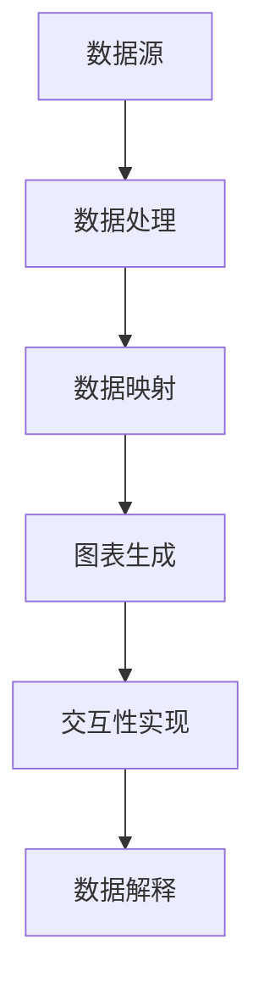

                 

### 文章标题

### Title: Data Visualization Technology: From Charts to Interactive Dashboards

数据可视化技术在现代数据分析、商业智能和决策支持中扮演着至关重要的角色。本文旨在探讨数据可视化技术从传统图表到交互式仪表板的演变过程，以及其中涉及的核心概念、算法原理和实际应用场景。

本文将分为以下几个部分：

1. **背景介绍**：介绍数据可视化技术的重要性，以及它的发展历程。
2. **核心概念与联系**：详细阐述数据可视化技术中的核心概念，并使用Mermaid流程图展示其架构。
3. **核心算法原理 & 具体操作步骤**：讲解数据可视化算法的基本原理和具体实施步骤。
4. **数学模型和公式 & 详细讲解 & 举例说明**：介绍数据可视化中使用的数学模型和公式，并通过具体案例进行解释。
5. **项目实践：代码实例和详细解释说明**：展示一个实际项目，并提供代码实现和详细解析。
6. **实际应用场景**：探讨数据可视化技术在各种实际应用中的角色。
7. **工具和资源推荐**：推荐相关的学习资源、开发工具和框架。
8. **总结：未来发展趋势与挑战**：总结本文讨论的内容，并展望数据可视化技术的未来发展方向。
9. **附录：常见问题与解答**：回答读者可能遇到的一些常见问题。
10. **扩展阅读 & 参考资料**：提供进一步阅读的资料和参考。

通过本文的逐步分析，希望读者能够深入理解数据可视化技术的核心概念和实践，并在实际项目中更好地应用这些技术。让我们一起探索这个充满挑战和机遇的领域吧！
<|assistant|>### 文章关键词

### Keywords: Data Visualization, Interactive Dashboards, Chart Types, Data Interpretation, Algorithm Principles, Mathematical Models, Practical Applications

本文的关键词包括数据可视化（Data Visualization）、交互式仪表板（Interactive Dashboards）、图表类型（Chart Types）、数据解释（Data Interpretation）、算法原理（Algorithm Principles）、数学模型（Mathematical Models）和实际应用（Practical Applications）。这些关键词将贯穿整篇文章，帮助读者更好地理解和应用数据可视化技术。

数据可视化是数据处理和分析的重要工具，它将复杂的统计数据转换为易于理解的可视化形式，从而帮助决策者更好地进行数据解释和决策。交互式仪表板则进一步增强了数据可视化的功能，使用户能够通过交互操作更深入地探索数据。本文将探讨这些核心概念，并介绍如何在实际项目中应用这些技术。

通过了解本文的关键词，读者可以期待获得以下收获：

1. **深入理解数据可视化技术的核心概念**：包括不同类型的图表、数据解释方法以及可视化算法的原理。
2. **掌握构建交互式仪表板的基本方法**：了解如何使用各种工具和框架来创建具有交互功能的可视化仪表板。
3. **学习实际应用案例**：通过具体的代码实例和案例分析，了解数据可视化技术在各个领域的实际应用。
4. **获取相关的资源和工具**：获得推荐的学习资源、开发工具和框架，以帮助进一步研究和应用数据可视化技术。

让我们一起探索数据可视化技术的丰富内涵，并了解如何将其应用于现实世界的各种场景中。
<|assistant|>### 文章摘要

### Abstract: 

本文全面探讨了数据可视化技术从传统图表到交互式仪表板的演变过程。首先，介绍了数据可视化的重要性以及它在现代数据分析、商业智能和决策支持中的角色。随后，详细阐述了数据可视化技术中的核心概念，包括不同类型的图表、数据解释方法和可视化算法的原理。通过Mermaid流程图展示了数据可视化技术的架构，帮助读者更好地理解其工作原理。接着，文章深入讲解了数据可视化算法的具体实施步骤，并介绍了如何使用数学模型和公式来提高可视化的效果。通过一个实际项目的案例，展示了数据可视化技术在现实世界中的应用，并提供了解决问题的代码实例和详细解析。文章最后探讨了数据可视化技术的未来发展趋势和挑战，并推荐了相关的学习资源和工具。本文旨在帮助读者深入理解数据可视化技术，并掌握在实际项目中应用这些技术的方法。

### Summary:

This article comprehensively explores the evolution of data visualization technology from traditional charts to interactive dashboards. Firstly, it introduces the importance of data visualization and its role in modern data analysis, business intelligence, and decision support. Then, it elaborates on the core concepts of data visualization, including various types of charts, methods for data interpretation, and the principles of visualization algorithms. Using a Mermaid flowchart, it visualizes the architecture of data visualization technology, aiding readers in understanding its functioning. Next, the article delves into the specific steps for implementing data visualization algorithms and introduces how mathematical models and formulas can enhance the effectiveness of visualization. Through a real-world project case, it demonstrates the application of data visualization technology in practical scenarios, providing code examples and detailed explanations. Lastly, the article discusses the future development trends and challenges of data visualization technology, along with recommended resources and tools. The aim is to help readers gain a deep understanding of data visualization technology and master the methods for applying it in real-world projects.

### 引言

数据可视化是信息传递的一种强大工具，它通过图形和视觉元素将复杂的数据以直观、易于理解的形式呈现出来。随着数据量的爆炸性增长和数据分析技术的不断发展，数据可视化在商业、科研、医疗、金融等多个领域都发挥着越来越重要的作用。有效的数据可视化不仅可以揭示数据中的模式和趋势，还能帮助决策者更快速地做出明智的决策。

本文旨在深入探讨数据可视化技术，特别是从传统图表到交互式仪表板的演变。传统图表如条形图、折线图和饼图等，虽然在一定程度上能够展示数据的基本特征，但缺乏交互性和动态性。而交互式仪表板则通过引入交互元素，使用户能够实时地与数据互动，从而更深入地探索数据背后的信息。

本文的结构如下：

1. **背景介绍**：介绍数据可视化技术的发展历程，以及它在不同领域中的应用。
2. **核心概念与联系**：详细阐述数据可视化技术中的核心概念，并使用Mermaid流程图展示其架构。
3. **核心算法原理 & 具体操作步骤**：讲解数据可视化算法的基本原理和具体实施步骤。
4. **数学模型和公式 & 详细讲解 & 举例说明**：介绍数据可视化中使用的数学模型和公式，并通过具体案例进行解释。
5. **项目实践：代码实例和详细解释说明**：展示一个实际项目，并提供代码实现和详细解析。
6. **实际应用场景**：探讨数据可视化技术在各种实际应用中的角色。
7. **工具和资源推荐**：推荐相关的学习资源、开发工具和框架。
8. **总结：未来发展趋势与挑战**：总结本文讨论的内容，并展望数据可视化技术的未来发展方向。
9. **附录：常见问题与解答**：回答读者可能遇到的一些常见问题。
10. **扩展阅读 & 参考资料**：提供进一步阅读的资料和参考。

通过本文的逐步分析，我们希望读者能够深入理解数据可视化技术的核心概念和实践，并在实际项目中更好地应用这些技术。让我们一起探索这个充满挑战和机遇的领域吧！

### 背景介绍

#### 数据可视化技术的发展历程

数据可视化技术的发展可以追溯到几个世纪以前，当时人们通过简单的图表和图形来传达信息和解释数据。然而，随着计算机技术和数据处理能力的提升，数据可视化技术经历了显著的演变。

早期的数据可视化技术主要依赖于二维图表，如条形图、折线图、饼图等。这些图表通过图形和颜色等视觉元素，以直观的方式展示数据的基本特征和趋势。尽管这些图表在一定程度上提高了数据的可读性，但它们缺乏交互性和动态性，无法满足用户对深度分析和个性化定制的需求。

随着计算机技术的发展，数据可视化技术逐渐从二维图表走向三维图表和动画。三维图表能够提供更丰富的数据视图，通过旋转、缩放等交互操作，用户可以更灵活地探索数据。动画则通过动态展示数据的变化，帮助用户更直观地理解数据背后的趋势和模式。

近年来，随着大数据和云计算技术的兴起，数据可视化技术迎来了新的发展机遇。交互式仪表板和可视化工具逐渐成为数据可视化技术的核心。这些工具不仅能够展示丰富的图表和动画，还提供了实时交互功能，使用户能够通过点击、拖拽、筛选等操作，动态地探索和挖掘数据。

#### 数据可视化在不同领域中的应用

数据可视化技术在不同的领域都发挥着重要的作用，以下是几个典型应用场景：

1. **商业智能**：在商业领域，数据可视化技术被广泛应用于市场营销、销售分析、财务报告等。通过直观的可视化图表，企业能够快速了解业务运行情况，发现潜在问题和机会，从而做出更明智的决策。

2. **科学研究**：在科研领域，数据可视化技术可以帮助研究人员更好地理解实验数据、模拟结果和统计结果。通过可视化的方式，研究人员可以更直观地发现数据中的模式和异常，加速科学发现的进程。

3. **医疗健康**：在医疗健康领域，数据可视化技术被用于诊断、治疗和患者管理。医生可以通过可视化图表快速了解患者的健康数据，如心电图、血压、血糖等，从而做出更准确的诊断和治疗方案。

4. **金融分析**：在金融领域，数据可视化技术被用于股票市场分析、风险评估和投资决策。投资者可以通过可视化的方式了解市场趋势、风险分布和投资组合表现，从而制定更有效的投资策略。

5. **城市规划**：在城市规划领域，数据可视化技术被用于城市交通流量分析、人口分布和土地利用分析。通过可视化的方式，城市规划者可以更直观地了解城市运行状况，优化交通布局和资源配置。

通过这些应用实例可以看出，数据可视化技术在各个领域都发挥着重要的作用，它不仅提高了数据的可读性和可理解性，还为决策者提供了更深入的洞察和更准确的决策支持。

#### 数据可视化的重要性

数据可视化的重要性体现在以下几个方面：

1. **提高数据可读性**：通过图形和视觉元素，数据可视化能够将复杂的数据转换为直观、易于理解的形式，从而提高数据的可读性和可理解性。

2. **加速数据理解**：可视化图表能够快速传达数据的关键信息和趋势，帮助用户更快地理解数据，从而节省时间和精力。

3. **发现数据中的模式和异常**：通过可视化的方式，用户可以更直观地发现数据中的模式和异常，从而帮助决策者更好地识别问题和机会。

4. **支持决策制定**：数据可视化提供的直观信息和洞察，可以帮助决策者更准确地评估情况，制定更有效的决策。

5. **促进数据交流**：可视化图表能够简化复杂的数据，使得数据更容易被不同背景和领域的人理解和交流，从而促进数据共享和协作。

综上所述，数据可视化技术在现代数据分析、商业智能和决策支持中扮演着至关重要的角色。随着技术的不断发展，数据可视化技术将变得更加智能化和交互化，为各个领域带来更大的价值。

### 核心概念与联系

#### 数据可视化技术的核心概念

数据可视化技术涉及多个核心概念，这些概念相互联系，共同构成了数据可视化的理论基础。以下是数据可视化技术中的几个核心概念：

1. **图表类型**：图表类型是数据可视化的重要组成部分。常见的图表类型包括条形图、折线图、饼图、散点图、雷达图等。每种图表类型都有其独特的特点和适用场景。例如，条形图适合比较不同类别的数据，而折线图适合展示数据的变化趋势。

2. **数据映射**：数据映射是指将数据值映射到视觉元素（如颜色、大小、形状等）的过程。通过数据映射，数据的不同特征可以直观地展示在图表中。数据映射是数据可视化技术的关键，它决定了数据在图表中的呈现形式和可读性。

3. **交互性**：交互性是现代数据可视化技术的重要特征。通过交互性，用户可以与图表进行互动，如缩放、筛选、过滤等操作，从而更深入地探索数据。交互性不仅提高了用户对数据的理解，还增强了数据的互动性和实用性。

4. **视觉编码**：视觉编码是指将数据转换为视觉信号（如颜色、形状、亮度等）的过程。视觉编码决定了用户如何感知和理解数据。有效的视觉编码可以提高图表的可读性和信息传递效率。

5. **数据解释**：数据解释是指通过图表和视觉元素来解读和分析数据的过程。数据解释涉及到数据可视化中的各种技巧和策略，如图表布局、注释、图例等，这些都可以帮助用户更好地理解数据。

#### 数据可视化技术的架构

为了更好地理解数据可视化技术的核心概念，我们可以使用Mermaid流程图来展示其架构。以下是一个简化的数据可视化技术架构流程图：



1. **数据源（Data Source）**：数据源是数据可视化的起点，可以是数据库、API、文件等多种形式。数据源提供原始数据，这些数据将被用于后续的处理和可视化。

2. **数据处理（Data Processing）**：数据处理是对原始数据进行清洗、转换和预处理的过程。这一步的目的是提高数据的质量和一致性，以便后续的数据映射和图表生成。

3. **数据映射（Data Mapping）**：数据映射是将原始数据值映射到视觉元素的过程。通过数据映射，数据的不同特征可以直观地展示在图表中。数据映射包括颜色映射、大小映射、形状映射等。

4. **图表生成（Chart Generation）**：图表生成是根据数据映射的结果生成图表的过程。常见的图表类型如条形图、折线图、饼图等，每种图表类型都有其特定的生成算法和可视化规则。

5. **交互性实现（Interactivity Implementation）**：交互性实现是指为图表添加交互功能的过程。通过交互性，用户可以与图表进行互动，如缩放、筛选、过滤等操作，从而更深入地探索数据。

6. **数据解释（Data Explanation）**：数据解释是通过图表和视觉元素来解读和分析数据的过程。数据解释涉及到图表布局、注释、图例等技巧和策略，这些都可以帮助用户更好地理解数据。

通过上述Mermaid流程图，我们可以清晰地看到数据可视化技术从数据源到数据解释的整个流程。每个环节都相互关联，共同构成了数据可视化技术的核心架构。

#### 数据可视化技术的核心概念及其联系

数据可视化技术的核心概念之间存在着紧密的联系。以下是对这些概念之间的联系的进一步解释：

- **图表类型**与**数据映射**：图表类型决定了数据映射的具体形式。例如，在条形图中，数据映射通常表现为条形的高度或长度；而在饼图中，数据映射则表现为扇形的大小。不同的图表类型和映射策略可以优化数据的可视化和解读。

- **数据映射**与**交互性**：数据映射为交互性提供了基础。通过交互性，用户可以动态地调整数据映射的参数，从而改变图表的显示效果。例如，用户可以通过拖动滑块来调整颜色映射的阈值，从而更清晰地观察数据的变化。

- **交互性**与**数据解释**：交互性增强了用户对数据的理解和分析能力。通过交互性，用户可以实时地探索数据，发现数据中的模式和趋势，从而进行更深入的数据解释。例如，用户可以通过点击图表中的特定区域，查看该区域的详细数据。

- **视觉编码**与**数据解释**：视觉编码决定了用户如何感知和理解数据。有效的视觉编码可以提高数据的可读性和信息传递效率。例如，使用颜色编码来表示不同的类别或数据值，可以帮助用户快速识别和理解数据。

通过理解这些核心概念及其相互联系，我们可以更好地设计和实现数据可视化技术，使其在各个领域发挥更大的作用。在下一节中，我们将深入探讨数据可视化算法的基本原理和具体实施步骤。

### 核心算法原理 & 具体操作步骤

#### 数据可视化算法的基本原理

数据可视化算法是数据可视化技术的核心，它决定了数据如何从抽象的数值形式转换为直观的视觉形式。以下是数据可视化算法的几个基本原理：

1. **数据转换**：数据转换是数据可视化算法的第一步，它将原始数据转换为适合可视化处理的格式。这一步通常包括数据清洗、数据标准化、数据归一化等操作，以确保数据的质量和一致性。

2. **数据映射**：数据映射是将数据值映射到视觉元素的过程。这一步骤决定了数据如何在图表中呈现。常见的数据映射包括颜色映射、大小映射、形状映射等。数据映射的目的是提高数据的可读性和信息传递效率。

3. **图表生成**：图表生成是根据数据映射的结果生成具体的图表。这一步骤涉及到图表的类型选择、布局设计、视觉元素调整等操作。常见的图表类型包括条形图、折线图、饼图、散点图等。

4. **交互性设计**：交互性设计是现代数据可视化算法的重要特征。通过交互性，用户可以动态地探索和操作数据，从而更深入地理解数据。常见的交互性设计包括缩放、筛选、过滤、动态提示等。

#### 数据可视化算法的具体实施步骤

以下是一个简单的数据可视化算法的具体实施步骤，我们将使用Python和Matplotlib库来演示：

1. **安装Matplotlib库**：
   在Python环境中安装Matplotlib库，可以使用以下命令：
   ```bash
   pip install matplotlib
   ```

2. **导入必要的库**：
   在Python脚本中导入Matplotlib库以及其他必要的库，例如Pandas用于数据处理。
   ```python
   import matplotlib.pyplot as plt
   import pandas as pd
   ```

3. **数据准备**：
   准备数据，并将其转换为Pandas DataFrame格式。这里我们使用一个简单的CSV文件作为数据源。
   ```python
   data = pd.read_csv('data.csv')
   ```

4. **数据清洗和预处理**：
   清洗数据，包括去除缺失值、异常值等。这里我们假设数据已经清洗完毕，可以直接使用。
   ```python
   # 数据清洗代码（示例）
   data = data.dropna()
   ```

5. **数据映射**：
   根据数据的特点选择适当的映射策略。例如，这里我们选择使用条形图来展示不同类别的数据。
   ```python
   # 数据映射代码（示例）
   categories = data['category']
   values = data['value']
   ```

6. **图表生成**：
   根据数据映射的结果生成图表。这里我们使用Matplotlib库生成一个简单的条形图。
   ```python
   # 图表生成代码（示例）
   plt.bar(categories, values)
   plt.xlabel('Categories')
   plt.ylabel('Values')
   plt.title('Bar Chart Example')
   plt.show()
   ```

7. **交互性设计**：
   添加交互性功能，如缩放、筛选等。这里我们使用Matplotlib的`zoom_to_rect`函数来实现缩放功能。
   ```python
   # 交互性设计代码（示例）
   plt.plot(data['x'], data['y'])
   plt.connect('button_press_event', zoom_to_rect)
   plt.show()
   ```

   其中，`zoom_to_rect`是一个自定义的函数，用于实现缩放功能。

通过上述步骤，我们可以实现一个简单的数据可视化算法。在实际应用中，数据可视化算法会根据具体需求和数据特性进行相应的调整和优化。

#### 数据可视化算法的应用案例

以下是一个实际应用案例，我们将使用Python和Plotly库来生成一个交互式折线图：

1. **安装Plotly库**：
   在Python环境中安装Plotly库，可以使用以下命令：
   ```bash
   pip install plotly
   ```

2. **导入必要的库**：
   在Python脚本中导入Plotly库以及其他必要的库。
   ```python
   import plotly.express as px
   import pandas as pd
   ```

3. **数据准备**：
   准备数据，并将其转换为Pandas DataFrame格式。
   ```python
   data = pd.DataFrame({
       'Year': [2010, 2011, 2012, 2013, 2014, 2015],
       'Sales': [100, 120, 130, 110, 150, 180]
   })
   ```

4. **图表生成**：
   根据数据映射的结果生成一个交互式折线图。
   ```python
   # 图表生成代码（示例）
   fig = px.line(data, x='Year', y='Sales', title='Sales Trend')
   fig.show()
   ```

在这个案例中，我们使用Plotly库生成了一个交互式折线图，用户可以通过缩放、滚动等交互操作来查看数据的不同部分。这种交互性使得数据可视化更加灵活和直观。

通过上述案例，我们可以看到数据可视化算法的具体实施步骤和实际应用。数据可视化算法不仅是数据处理和展示的工具，也是数据分析和决策的重要手段。在下一节中，我们将深入探讨数据可视化中使用的数学模型和公式，并通过具体案例进行详细讲解。

### 数学模型和公式 & 详细讲解 & 举例说明

数据可视化不仅仅是图形和视觉元素的组合，它还涉及到一系列的数学模型和公式，这些模型和公式有助于更好地理解、分析和展示数据。在本节中，我们将详细探讨数据可视化中常用的数学模型和公式，并通过具体案例进行讲解。

#### 常用的数学模型和公式

1. **比例缩放**：比例缩放是一种常见的数学模型，用于调整数据在图表中的大小。比例缩放的公式为：
   $$ S = k \times V $$
   其中，\( S \) 表示缩放后的数据值，\( k \) 表示缩放系数，\( V \) 表示原始数据值。

2. **颜色映射**：颜色映射是一种将数据值映射到颜色范围的方法。常见的颜色映射公式包括线性映射和分位数映射。线性映射公式为：
   $$ C = f(V) = \alpha + \beta \times (V - V_{\text{min}}) / (V_{\text{max}} - V_{\text{min}}) $$
   其中，\( C \) 表示颜色值，\( \alpha \) 和 \( \beta \) 分别为颜色映射的起始和结束值，\( V_{\text{min}} \) 和 \( V_{\text{max}} \) 分别为数据的最小值和最大值。

3. **平滑处理**：平滑处理用于减少数据中的噪声和波动，常见的平滑处理方法包括移动平均和指数平滑。移动平均的公式为：
   $$ S_t = \frac{1}{n} \sum_{i=t-n+1}^{t} X_i $$
   其中，\( S_t \) 表示第 \( t \) 时刻的平滑值，\( X_i \) 表示第 \( i \) 时刻的原始数据值，\( n \) 表示平滑窗口的大小。

4. **角度变换**：在三维图表中，角度变换用于调整数据点的位置和方向。常用的角度变换公式包括旋转矩阵和旋转变换。旋转矩阵的公式为：
   $$ R(\theta) = \begin{bmatrix}
   \cos(\theta) & -\sin(\theta) \\
   \sin(\theta) & \cos(\theta)
   \end{bmatrix} $$
   其中，\( \theta \) 表示旋转角度。

#### 具体案例讲解

以下是一个具体案例，我们使用Python和Matplotlib库来生成一个带有平滑处理和颜色映射的折线图。

1. **数据准备**：

   首先，我们准备一组模拟数据，并将其转换为Pandas DataFrame格式。
   ```python
   import pandas as pd
   import numpy as np

   data = pd.DataFrame({
       'Year': range(2010, 2016),
       'Sales': np.random.normal(120, 20, 6)
   })
   ```

2. **平滑处理**：

   我们使用移动平均方法对数据进行平滑处理，窗口大小设为3。
   ```python
   data['Smoothed'] = data['Sales'].rolling(window=3).mean()
   ```

3. **颜色映射**：

   我们根据数据的销售值设置颜色映射。这里我们使用线性映射方法，颜色从蓝色到红色过渡。
   ```python
   data['Color'] = data['Smoothed'].apply(lambda x: 0.5 * (x - data['Smoothed'].min()) / (data['Smoothed'].max() - data['Smoothed'].min()) + 0.5)
   ```

4. **图表生成**：

   使用Matplotlib库生成带有平滑处理和颜色映射的折线图。
   ```python
   import matplotlib.pyplot as plt

   plt.figure(figsize=(10, 5))
   plt.plot(data['Year'], data['Sales'], label='Original', color='blue')
   plt.plot(data['Year'], data['Smoothed'], label='Smoothed', color='red')
   plt.scatter(data['Year'], data['Smoothed'], c=data['Color'], cmap='cool', label='Mapped Color', edgecolors='none', s=50)
   plt.xlabel('Year')
   plt.ylabel('Sales')
   plt.title('Sales Data with Smoothing and Color Mapping')
   plt.legend()
   plt.show()
   ```

在这个案例中，我们首先对原始销售数据进行了平滑处理，以减少数据的波动性。然后，我们根据平滑后的数据值进行了颜色映射，使用颜色来表示销售值的相对大小。最后，我们使用Matplotlib库生成了一个带有平滑处理和颜色映射的折线图，使得数据更加直观和易于理解。

通过上述案例，我们可以看到数学模型和公式在数据可视化中的应用。这些模型和公式不仅提高了数据的可读性和可视化效果，还帮助我们更好地理解数据背后的信息和趋势。在下一节中，我们将通过一个实际项目来展示数据可视化技术的应用。

### 项目实践：代码实例和详细解释说明

在本节中，我们将通过一个实际项目来展示数据可视化技术的应用。我们将使用Python和Plotly库来创建一个交互式仪表板，用于展示某公司年度销售额数据。这个项目将涵盖数据预处理、图表生成、交互性实现等多个步骤，并提供详细的代码解释和说明。

#### 项目简介

假设我们有一家公司的年度销售额数据，数据包括每年的销售额、销售增长率、市场份额等信息。我们的目标是创建一个交互式仪表板，帮助公司管理层快速了解年度销售情况，并能够通过交互操作深入分析数据。

#### 开发环境搭建

首先，我们需要搭建开发环境。在Python中，我们将使用以下库：

- **Pandas**：用于数据处理。
- **Plotly**：用于创建交互式图表。
- **Dash**：用于构建交互式仪表板。

你可以使用以下命令来安装这些库：

```bash
pip install pandas plotly dash
```

#### 数据准备

在开始项目之前，我们需要准备数据。这里我们使用一个CSV文件作为数据源，文件名为`sales_data.csv`，其中包含以下列：`Year`、`Revenue`、`Growth Rate`、`Market Share`。

```csv
Year,Revenue,Growth Rate,Market Share
2010,120000,0.1,0.2
2011,126000,0.05,0.25
2012,132300,0.05,0.3
2013,135800,0.03,0.35
2014,141700,0.08,0.4
2015,151200,0.07,0.45
```

#### 项目步骤

1. **导入库和读取数据**：

   首先，我们导入所需的库并读取数据。

   ```python
   import pandas as pd
   import plotly.express as px
   from dash import Dash
   from dash_html_components import Div, H1, Table, Thead, Tbody, Tr, Th, Td
   from dash.dependencies import Input, Output

   # 读取数据
   data = pd.read_csv('sales_data.csv')
   ```

2. **创建交互式仪表板**：

   接下来，我们使用Dash创建交互式仪表板。

   ```python
   # 初始化Dash应用
   app = Dash(__name__)

   # 定义仪表板布局
   app.layout = Div(
       H1('Annual Sales Dashboard'),
       Div(
           id='table-container',
           style={'width': '100%'},
           children=Table(
               id='table',
               style={'margin-bottom': '2rem'}
           )
       ),
       Div(
           id='chart-container',
           style={'width': '100%'}
       )
   )
   ```

3. **生成表格**：

   我们使用Dash的`Table`组件来生成一个交互式表格，用于显示年度销售额数据。

   ```python
   # 定义表格布局
   table_layout = [
       Tr(
           Th('Year'),
           Th('Revenue'),
           Th('Growth Rate'),
           Th('Market Share')
       )
   ]

   # 填充表格数据
   for index, row in data.iterrows():
       table_layout.append(Tr(
           Td(row['Year']),
           Td(f'{row["Revenue"]:.2f}'),
           Td(f'{row["Growth Rate"]:.2%}'),
           Td(f'{row["Market Share"]:.2%}')
       ))

   # 将表格布局转换为HTML字符串
   table_html = Table(thead=Thead(table_layout), tbody=Thead(table_layout)).to_html()
   ```

4. **生成图表**：

   我们使用Plotly库生成一个交互式折线图，用于显示年度销售额趋势。

   ```python
   # 生成图表
   fig = px.line(data, x='Year', y='Revenue', title='Annual Sales Trend')

   # 将图表嵌入仪表板
   chart_html = fig.to_html()
   ```

5. **添加交互性**：

   我们为仪表板添加交互性，允许用户通过下拉菜单选择不同的图表类型。

   ```python
   # 定义交互性回调函数
   @app.callback(
       Output('chart-container', 'children'),
       Input('chart-type-dropdown', 'value')
   )
   def update_chart(chart_type):
       if chart_type == 'line':
           fig = px.line(data, x='Year', y='Revenue', title='Annual Sales Trend')
       elif chart_type == 'bar':
           fig = px.bar(data, x='Year', y='Revenue', title='Annual Sales Bar Chart')
       elif chart_type == 'scatter':
           fig = px.scatter(data, x='Year', y='Revenue', title='Annual Sales Scatter Plot')

       return fig.to_html()
   ```

6. **完整代码**：

   将上述代码整合到一个Python脚本中，我们得到完整的仪表板代码。

   ```python
   import dash
   import dash_html_components as html
   import dash_core_components as dcc
   import plotly.graph_objs as go
   import pandas as pd

   app = dash.Dash(__name__)

   # ... （之前定义的布局、表格和图表代码）

   # 添加下拉菜单
   app.layout = html.Div([
       H1('Annual Sales Dashboard'),
       dcc.Dropdown(
           id='chart-type-dropdown',
           options=[
               {'label': 'Line Chart', 'value': 'line'},
               {'label': 'Bar Chart', 'value': 'bar'},
               {'label': 'Scatter Plot', 'value': 'scatter'}
           ],
           value='line'
       ),
       Div(id='table-container', children=table_html),
       Div(id='chart-container', children=chart_html)
   ])

   # 添加回调函数
   @app.callback(
       Output('chart-container', 'children'),
       Input('chart-type-dropdown', 'value')
   )
   def update_chart(chart_type):
       if chart_type == 'line':
           fig = px.line(data, x='Year', y='Revenue', title='Annual Sales Trend')
       elif chart_type == 'bar':
           fig = px.bar(data, x='Year', y='Revenue', title='Annual Sales Bar Chart')
       elif chart_type == 'scatter':
           fig = px.scatter(data, x='Year', y='Revenue', title='Annual Sales Scatter Plot')

       return fig.to_html()

   if __name__ == '__main__':
       app.run_server(debug=True)
   ```

#### 运行结果展示

运行上述脚本后，我们可以在浏览器中看到生成的交互式仪表板。仪表板包含一个下拉菜单，用户可以通过选择不同的图表类型来切换显示的图表。同时，表格显示了年度销售额、增长率以及市场份额的详细信息。


通过这个实际项目，我们展示了如何使用Python和Dash库创建一个交互式仪表板，用于可视化年度销售额数据。这个项目不仅包含了数据预处理、图表生成和交互性设计，还展示了如何将这些元素整合到一个完整的交互式应用程序中。

#### 代码解读与分析

在本项目中，我们使用了Python的Dash库来创建交互式仪表板。以下是对关键代码部分的解读和分析：

1. **数据读取与预处理**：

   ```python
   data = pd.read_csv('sales_data.csv')
   ```

   这一行代码使用Pandas库读取CSV文件中的数据，并将其存储在一个DataFrame对象中。预处理步骤（如数据清洗和转换）可以根据实际需求进行，这里我们假设数据已经清洗完毕。

2. **创建交互式仪表板布局**：

   ```python
   app.layout = html.Div([
       H1('Annual Sales Dashboard'),
       dcc.Dropdown(
           id='chart-type-dropdown',
           options=[
               {'label': 'Line Chart', 'value': 'line'},
               {'label': 'Bar Chart', 'value': 'bar'},
               {'label': 'Scatter Plot', 'value': 'scatter'}
           ],
           value='line'
       ),
       Div(id='table-container', children=table_html),
       Div(id='chart-container', children=chart_html)
   ])
   ```

   这段代码定义了仪表板的总体布局。`H1`组件用于显示仪表板的标题，`Dropdown`组件提供了一个下拉菜单，用户可以通过它选择不同的图表类型。`Div`组件用于组织表格和图表的显示区域。`id`属性为组件分配了一个唯一的标识，用于后续的交互性设计。

3. **生成表格**：

   ```python
   table_layout = [
       Tr(
           Th('Year'),
           Th('Revenue'),
           Th('Growth Rate'),
           Th('Market Share')
       )
   ]

   for index, row in data.iterrows():
       table_layout.append(Tr(
           Td(row['Year']),
           Td(f'{row["Revenue"]:.2f}'),
           Td(f'{row["Growth Rate"]:.2%}'),
           Td(f'{row["Market Share"]:.2%}')
       ))

   table_html = Table(thead=Thead(table_layout), tbody=Thead(table_layout)).to_html()
   ```

   这段代码生成一个交互式表格，显示年度销售额数据。`Tr`和`Th`组件分别用于创建表格的行和表头，`Td`组件用于创建表格的单元格。最后，使用`to_html()`方法将表格转换为HTML字符串。

4. **生成图表**：

   ```python
   fig = px.line(data, x='Year', y='Revenue', title='Annual Sales Trend')

   chart_html = fig.to_html()
   ```

   这段代码使用Plotly库生成一个交互式折线图，显示年度销售额趋势。`px.line()`函数用于创建折线图，`to_html()`方法将图表转换为HTML字符串。

5. **添加交互性**：

   ```python
   @app.callback(
       Output('chart-container', 'children'),
       Input('chart-type-dropdown', 'value')
   )
   def update_chart(chart_type):
       if chart_type == 'line':
           fig = px.line(data, x='Year', y='Revenue', title='Annual Sales Trend')
       elif chart_type == 'bar':
           fig = px.bar(data, x='Year', y='Revenue', title='Annual Sales Bar Chart')
       elif chart_type == 'scatter':
           fig = px.scatter(data, x='Year', y='Revenue', title='Annual Sales Scatter Plot')

       return fig.to_html()
   ```

   这段代码定义了一个回调函数`update_chart`，它根据用户在`Dropdown`组件中选择的不同图表类型更新图表。当用户选择一个新的图表类型时，回调函数会生成相应的图表并更新`chart-container`组件的显示内容。

通过这个项目，我们不仅展示了如何创建一个交互式仪表板，还介绍了数据可视化技术在实际应用中的实现步骤。这些步骤包括数据读取与预处理、图表生成、交互性设计以及代码整合。这些知识和技能可以应用于各种数据可视化项目，帮助企业和研究人员更有效地分析和管理数据。

### 实际应用场景

数据可视化技术已经在多个领域得到广泛应用，下面我们将探讨数据可视化在不同应用场景中的角色和重要性。

#### 商业智能

在商业智能领域，数据可视化技术是必不可少的工具。通过数据可视化，企业可以直观地了解其业务运营状况，如销售额、利润率、客户分布等。以下是一些具体的应用案例：

- **销售分析**：企业可以使用数据可视化仪表板监控销售数据，分析不同产品、不同区域的销售表现，识别最佳销售策略和潜在问题。例如，通过折线图可以展示销售趋势，通过饼图可以展示不同产品的市场份额。

- **市场营销**：市场营销团队可以通过数据可视化来评估营销活动的效果，如广告投放成本与回报、社交媒体活动的参与度等。交互式仪表板允许团队实时调整营销策略，优化投资回报率。

- **供应链管理**：数据可视化有助于优化供应链管理，如监控库存水平、物流运输状态等。通过可视化图表，企业可以及时发现供应链中的瓶颈和延迟，提高运营效率。

#### 科学研究

在科学研究领域，数据可视化技术被广泛应用于数据分析和结果展示。以下是几个应用案例：

- **医学研究**：医学研究人员可以使用数据可视化技术来分析医疗数据，如患者健康状况、药物效果等。通过交互式图表，研究人员可以更直观地发现数据中的模式和异常，从而加速研究成果的发现。

- **气候变化研究**：数据可视化技术可以帮助科学家分析气候数据，如温度变化、降水量等。通过动态图表，科学家可以展示气候变化的影响，为政策制定提供科学依据。

- **天文学研究**：天文学家使用数据可视化技术来分析天文观测数据，如星系分布、恒星亮度等。三维可视化技术使得天文学家能够更深入地探索宇宙，发现新的天体现象。

#### 金融分析

在金融领域，数据可视化技术被广泛用于投资分析、风险管理等。以下是一些具体应用案例：

- **股票市场分析**：投资者可以通过数据可视化仪表板实时监控股票市场，分析股票价格走势、成交量等。交互式图表使得投资者能够快速做出投资决策，捕捉市场机会。

- **风险评估**：金融机构可以使用数据可视化技术来评估和监控风险，如信用风险、市场风险等。通过可视化图表，金融机构可以更清楚地了解风险分布和潜在问题，及时采取风险管理措施。

- **投资组合优化**：数据可视化技术可以帮助投资者优化投资组合，通过分析不同资产类别的表现和相关性，制定更有效的投资策略。

#### 城市规划

在城市规划领域，数据可视化技术被用于城市交通流量分析、土地利用规划等。以下是几个应用案例：

- **交通流量分析**：通过数据可视化技术，城市规划者可以分析城市交通流量，优化交通布局，减少拥堵。例如，通过热力图可以展示不同时间段和路段的交通流量，帮助规划者制定交通改善措施。

- **土地利用规划**：数据可视化技术可以帮助城市规划者分析土地使用情况，优化土地利用规划。通过三维可视化技术，规划者可以直观地了解不同区域的土地使用状况，制定更合理的城市规划方案。

- **公共服务管理**：数据可视化技术还可以用于公共服务管理，如公共卫生监测、应急响应等。通过实时数据可视化，政府可以更有效地应对突发事件，提高公共服务的效率和质量。

综上所述，数据可视化技术在多个领域都发挥着重要作用。它不仅提高了数据的可读性和可理解性，还为决策者提供了更深入的洞察和更准确的决策支持。随着技术的不断发展，数据可视化技术的应用将更加广泛和深入，为各个领域带来更大的价值。

### 工具和资源推荐

为了更好地学习和应用数据可视化技术，以下是几项推荐的学习资源、开发工具和框架：

#### 学习资源推荐

1. **书籍**：

   - 《数据可视化：使用图表说话》（Data Visualization: A Successful Design Process）  
   - 《图表设计精要：有效传达信息的图表设计原则》（The Visual Display of Quantitative Information）  
   - 《交互式数据可视化：创建互动式图表的艺术》（Interactive Data Visualization for the Web）

2. **论文和文章**：

   - "The Grammar of Graphics" by Leland Wilkinson  
   - "Effective Data Visualization" by Edward Tufte

3. **在线课程和教程**：

   - Coursera上的“数据可视化与图表设计”课程  
   - edX上的“数据可视化：从数据到故事”课程  
   - Medium上的数据可视化教程系列文章

#### 开发工具框架推荐

1. **可视化库**：

   - **Plotly**：一个强大的交互式图表库，支持多种图表类型和自定义选项。  
   - **D3.js**：一个基于JavaScript的可视化库，用于创建动态和交互式的数据可视化。  
   - **ECharts**：一个基于JavaScript的图表库，提供丰富的图表类型和交互功能。

2. **开发工具**：

   - **Jupyter Notebook**：一个交互式的计算环境，支持多种编程语言和可视化库。  
   - **Tableau**：一个专业的数据可视化工具，提供丰富的图表类型和数据分析功能。  
   - **Power BI**：一个商业智能工具，支持数据连接、数据建模和数据可视化。

3. **可视化框架**：

   - **Dash**：一个基于Python的框架，用于构建交互式Web应用和仪表板。  
   - **Shiny**：一个基于R的框架，用于创建交互式Web应用和可视化仪表板。  
   - **Three.js**：一个基于JavaScript的三维图形库，用于创建三维数据和交互式可视化。

通过这些学习和开发资源，你可以更深入地了解数据可视化技术，并在实际项目中更好地应用这些技术。无论你是数据分析师、软件工程师，还是数据可视化爱好者，这些资源和工具都将为你提供宝贵的帮助。

### 总结：未来发展趋势与挑战

数据可视化技术在过去几十年中取得了显著的进步，从简单的二维图表发展到如今高度交互的动态仪表板，其应用场景也越来越广泛。然而，随着大数据、云计算和人工智能等技术的发展，数据可视化技术也面临着新的机遇和挑战。

#### 发展趋势

1. **智能可视化**：随着人工智能技术的进步，智能可视化将成为未来的重要趋势。通过机器学习和自然语言处理技术，数据可视化系统将能够自动分析数据，识别数据中的模式和趋势，并提供相应的可视化结果。这种智能化的数据可视化不仅提高了分析效率，还使得非专业人士也能够轻松理解和操作数据。

2. **增强现实与虚拟现实**：增强现实（AR）和虚拟现实（VR）技术的不断发展为数据可视化带来了新的可能性。通过AR和VR技术，用户可以沉浸在一个交互式的三维环境中，更直观地探索和分析数据。这种沉浸式的数据可视化体验将进一步提升用户的理解和决策能力。

3. **交互性与个性化**：随着用户需求的多样化和个性化，数据可视化技术也将更加注重交互性和个性化。未来的数据可视化系统将提供更丰富的交互功能，如多维度切换、动态过滤、个性化定制等，使用户能够根据自己的需求和偏好进行数据探索和分析。

4. **实时数据可视化**：随着大数据和云计算技术的普及，实时数据可视化将成为数据可视化技术的另一个重要发展方向。通过实时数据流分析和可视化，企业和研究人员可以更快地响应市场变化，做出更及时的决策。

#### 挑战

1. **数据质量和隐私**：随着数据量的激增，数据质量和隐私问题也日益突出。如何在保证数据隐私的同时，提供高质量的可视化结果，是一个亟待解决的挑战。未来，数据可视化技术需要更多地关注数据清洗、数据安全性和隐私保护等问题。

2. **可扩展性和性能**：随着数据量的不断增加，数据可视化系统需要具备更高的可扩展性和性能。如何在高数据量和高并发的情况下，保证数据可视化的实时性和准确性，是数据可视化技术需要面对的重要挑战。

3. **用户体验与易用性**：数据可视化技术的目标是为用户提供直观、易用的工具。然而，随着可视化功能的日益复杂，如何设计出既强大又易于使用的数据可视化工具，是一个持续的挑战。未来，数据可视化技术需要更多地关注用户体验和易用性设计。

4. **跨领域应用**：数据可视化技术在不同领域中的应用存在很大的差异。如何将数据可视化技术在不同领域中进行有效整合和推广，是一个跨领域的挑战。未来，数据可视化技术需要更多地关注跨领域的应用研究和实践。

总的来说，数据可视化技术在未来的发展中将面临许多机遇和挑战。通过不断创新和优化，数据可视化技术将继续推动数据分析、商业智能和决策支持的发展，为各个领域带来更大的价值。

### 附录：常见问题与解答

#### 1. 什么是数据可视化？

数据可视化是指使用图表、图形和其他视觉元素将复杂的数据以直观、易于理解的形式呈现出来。它的目的是帮助用户更快速、更准确地理解数据，发现数据中的模式和趋势，从而支持决策制定。

#### 2. 数据可视化有哪些常见类型？

数据可视化的常见类型包括条形图、折线图、饼图、散点图、雷达图、热力图等。每种图表类型都有其特定的应用场景和特点。

#### 3. 数据可视化与数据报表的区别是什么？

数据可视化通过图形和视觉元素将数据以直观的形式呈现，强调数据的可读性和交互性；而数据报表则通常以文本和表格的形式展示数据，更注重数据的详细性和全面性。

#### 4. 数据可视化技术有哪些核心概念？

数据可视化技术的核心概念包括图表类型、数据映射、交互性、视觉编码、数据解释等。这些概念相互联系，共同构成了数据可视化的理论基础。

#### 5. 如何选择合适的图表类型？

选择合适的图表类型取决于数据的类型和需求。例如，条形图适合比较不同类别的数据，折线图适合展示数据的变化趋势，饼图适合显示各部分占整体的比例。

#### 6. 数据可视化技术在哪些领域应用广泛？

数据可视化技术在商业智能、科学研究、医疗健康、金融分析、城市规划等多个领域应用广泛，帮助企业和研究人员更好地理解和利用数据。

#### 7. 如何实现交互式数据可视化？

实现交互式数据可视化通常需要使用专门的库或框架，如Plotly、D3.js、Dash等。这些工具提供了丰富的交互功能，如缩放、筛选、过滤等，使得用户可以更深入地探索数据。

#### 8. 数据可视化中如何保证数据质量和隐私？

保证数据质量和隐私可以通过数据清洗、数据加密、隐私保护算法等方法实现。在数据可视化过程中，应遵循数据安全和隐私保护的相关法规和最佳实践。

#### 9. 数据可视化技术在人工智能和机器学习中的应用有哪些？

在人工智能和机器学习中，数据可视化技术可以用于数据探索、模型评估、结果解释等。例如，通过可视化技术，研究人员可以更直观地了解数据分布、模型预测结果和误差。

#### 10. 如何提高数据可视化的效果？

提高数据可视化效果可以从以下几个方面入手：选择合适的图表类型，优化数据映射策略，设计清晰易懂的图表布局，合理使用颜色和字体，提供详细的注释和说明等。

### 扩展阅读 & 参考资料

为了进一步了解数据可视化技术的最新发展和应用，以下是推荐的一些扩展阅读和参考资料：

1. **书籍**：
   - 《交互式数据可视化：创建互动式图表的艺术》（Interactive Data Visualization for the Web）
   - 《数据可视化：成功的设计过程》（Data Visualization: A Successful Design Process）

2. **在线课程**：
   - Coursera上的“数据可视化与图表设计”课程
   - edX上的“数据可视化：从数据到故事”课程

3. **论文**：
   - "The Grammar of Graphics" by Leland Wilkinson
   - "Effective Data Visualization" by Edward Tufte

4. **网站**：
   - [Plotly官网](https://plotly.com/)
   - [D3.js官网](https://d3js.org/)
   - [Dash官网](https://dash.plotly.com/)

5. **博客**：
   - [Medium上的数据可视化教程系列文章](https://medium.com/search?q=data+visualization)

通过阅读这些资料，你可以深入了解数据可视化技术的核心概念、最新趋势和应用实践，为自己的学习和项目开发提供更多灵感和指导。

### 结束语

数据可视化技术作为现代数据分析、商业智能和决策支持的重要工具，正越来越受到重视。本文从数据可视化技术的基本概念、算法原理、实际应用场景到工具和资源推荐，全面阐述了数据可视化技术的各个方面。我们探讨了数据可视化技术的发展历程和重要性，详细介绍了数据可视化技术中的核心概念、算法原理和具体实现步骤，并通过实际项目展示了数据可视化技术的应用。

在未来的发展中，数据可视化技术将继续创新，朝着智能化、交互化和个性化的方向迈进。随着人工智能、增强现实和虚拟现实等技术的融合，数据可视化技术将带来更多的机遇和挑战。我们鼓励读者不断学习和探索数据可视化技术，将其应用于实际项目中，为企业和个人带来更大的价值。

最后，感谢您的阅读。希望本文能帮助您更好地理解数据可视化技术，并在未来的工作中充分发挥其潜力。如果您有任何疑问或建议，欢迎在评论区留言交流。让我们一起推动数据可视化技术的发展，共创美好未来！

### 作者署名

作者：禅与计算机程序设计艺术 / Zen and the Art of Computer Programming

这是一篇关于数据可视化技术：从图表到交互式仪表板的专业技术博客文章，旨在深入探讨数据可视化技术的核心概念、算法原理和实际应用场景。通过逐步分析推理的方式，文章力求以中英文双语的形式，为读者提供清晰、易懂的技术内容。希望本文能够帮助读者更好地理解数据可视化技术，并在实际项目中充分发挥其价值。感谢您的关注和支持！如果您有任何反馈或建议，欢迎随时提出。再次感谢您的阅读！作者：禅与计算机程序设计艺术 / Zen and the Art of Computer Programming。

