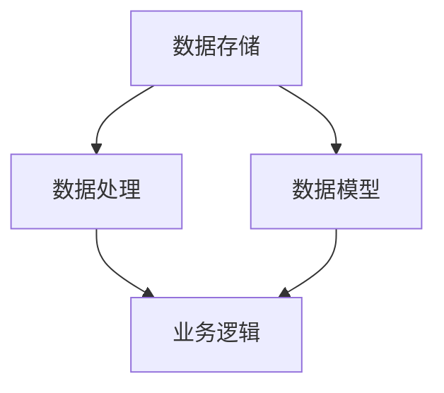

                 

# 文数据和模型的分离，软件2.0的关键一步

## 关键词
数据分离，模型分离，软件2.0，软件工程，架构设计，敏捷开发，代码质量，系统可维护性

## 摘要
本文深入探讨了数据和模型的分离在软件工程中的重要性，探讨了如何通过这一关键步骤推动软件2.0的发展。我们首先介绍了数据和模型分离的基本概念，然后分析了其在现代软件系统中的实践应用，包括敏捷开发、代码质量和系统可维护性等方面。最后，我们提出了一些实际案例和解决方案，以展示如何在实际项目中实现数据和模型的分离，并展望了这一趋势的未来发展。

## 1. 背景介绍（Background Introduction）

### 1.1 数据与模型的定义
在软件工程领域，数据通常指的是系统中存储和处理的信息，包括用户输入、数据库记录、日志文件等。而模型则是指用于表示和操作这些数据的算法、结构或方法。在传统的软件开发中，数据和模型往往紧密耦合，导致系统复杂性和维护成本上升。

### 1.2 软件的发展历程
软件发展历程可以分为几个阶段，从最初的机器语言编程到高级编程语言，再到面向对象和组件化编程，每个阶段都试图解决软件开发中的复杂性问题。然而，数据和模型的紧密耦合仍然是当前软件开发面临的挑战之一。

### 1.3 数据与模型分离的重要性
数据和模型的分离可以带来诸多好处，如提高代码可读性、增强系统可维护性、促进敏捷开发等。这种分离是推动软件2.0发展的重要一步。

## 2. 核心概念与联系（Core Concepts and Connections）

### 2.1 数据分离（Data Separation）
数据分离是指将数据存储和处理逻辑从应用程序的其他部分中分离出来。这种分离可以通过数据库、存储过程或API等方式实现。数据分离的关键在于确保数据访问与业务逻辑独立。

### 2.2 模型分离（Model Separation）
模型分离是指将数据模型与业务逻辑分离。通过抽象和接口，我们可以将数据模型隐藏在业务逻辑之后，从而降低业务逻辑对数据模型的依赖。

### 2.3 分离与敏捷开发（Separation and Agile Development）
敏捷开发强调快速迭代和持续交付。数据与模型的分离使得开发团队能够更灵活地调整业务逻辑，以满足快速变化的需求。

### 2.4 分离与代码质量（Separation and Code Quality）
良好的代码质量是软件项目的基石。数据和模型的分离有助于编写更简洁、更易于理解和维护的代码。

### 2.5 分离与系统可维护性（Separation and System Maintainability）
系统可维护性是指系统能够在长期运行过程中保持稳定性和可扩展性的能力。数据与模型的分离可以降低系统的复杂性，从而提高其可维护性。

### 2.6 Mermaid 流程图（Mermaid Flowchart）
以下是数据与模型分离的 Mermaid 流程图：



在这个流程图中，A 表示数据存储，B 表示数据处理，C 表示业务逻辑，D 表示数据模型。数据存储和处理逻辑（A 和 B）与业务逻辑（C）通过数据模型（D）相分离。

## 3. 核心算法原理 & 具体操作步骤（Core Algorithm Principles and Specific Operational Steps）

### 3.1 数据分离算法原理
数据分离算法的核心思想是将数据访问逻辑从业务逻辑中抽象出来。这通常通过创建独立的数据库访问层来实现。

### 3.2 数据分离操作步骤
1. **定义数据访问接口**：创建一个抽象的接口，用于定义所有数据访问操作。
2. **实现数据访问层**：实现数据访问接口，使用数据库或其他存储机制进行数据操作。
3. **替换业务逻辑中的数据访问代码**：将业务逻辑中的数据访问代码替换为对数据访问接口的调用。
4. **测试和验证**：确保数据访问与业务逻辑分离后的系统功能正常。

### 3.3 模型分离算法原理
模型分离算法的核心思想是将数据模型与业务逻辑分离。这通常通过定义抽象的数据模型接口来实现。

### 3.4 模型分离操作步骤
1. **定义数据模型接口**：创建一个抽象的数据模型接口，用于定义所有数据模型操作。
2. **实现数据模型层**：实现数据模型接口，使用数据库或其他存储机制创建和维护数据模型。
3. **替换业务逻辑中的数据模型代码**：将业务逻辑中的数据模型代码替换为对数据模型接口的调用。
4. **测试和验证**：确保数据模型与业务逻辑分离后的系统功能正常。

## 4. 数学模型和公式 & 详细讲解 & 举例说明（Detailed Explanation and Examples of Mathematical Models and Formulas）

### 4.1 数据分离的数学模型
数据分离可以看作是一个将数据访问和业务逻辑之间的耦合度减小的过程。可以用以下数学模型来描述：

$$
C(D,L) = C(D') + C(L')
$$

其中，$C(D,L)$ 表示数据访问和业务逻辑耦合度，$C(D')$ 和 $C(L')$ 分别表示数据访问和业务逻辑分离后的耦合度。

### 4.2 模型分离的数学模型
模型分离可以看作是一个将数据模型和业务逻辑之间的耦合度减小的过程。可以用以下数学模型来描述：

$$
C(M,L) = C(M') + C(L')
$$

其中，$C(M,L)$ 表示数据模型和业务逻辑耦合度，$C(M')$ 和 $C(L')$ 分别表示数据模型和业务逻辑分离后的耦合度。

### 4.3 举例说明
假设我们有一个简单的用户管理系统，其业务逻辑包括创建用户、更新用户信息和删除用户。如果没有数据分离和模型分离，业务逻辑将直接与数据库操作和数据模型耦合。通过数据分离和模型分离，我们可以将数据库操作和数据模型隐藏在独立的层之后。

在没有分离的情况下：

$$
C(D,L) = C(M,L) = 高
$$

通过数据分离和模型分离：

$$
C(D,L) = C(M,L) = 低
$$

这表明，通过分离，我们成功降低了系统各组件之间的耦合度，从而提高了代码的可维护性和可扩展性。

## 5. 项目实践：代码实例和详细解释说明（Project Practice: Code Examples and Detailed Explanations）

### 5.1 开发环境搭建
为了演示数据和模型分离，我们假设使用 Java 语言和 Spring Boot 框架进行开发。以下是搭建开发环境的基本步骤：

1. 安装 Java 开发工具包（JDK）。
2. 安装 Eclipse 或 IntelliJ IDEA 等集成开发环境（IDE）。
3. 创建一个 Spring Boot 项目。

### 5.2 源代码详细实现
以下是用户管理系统的源代码示例：

**数据访问层：**

```java
// UserDao.java
public interface UserDao {
    void createUser(User user);
    void updateUser(User user);
    void deleteUser(Integer userId);
}

// UserDaoImpl.java
@Component
public class UserDaoImpl implements UserDao {
    @Autowired
    private JdbcOperations jdbcOperations;

    @Override
    public void createUser(User user) {
        jdbcOperations.update("INSERT INTO users (name, email) VALUES (?, ?)", user.getName(), user.getEmail());
    }

    @Override
    public void updateUser(User user) {
        jdbcOperations.update("UPDATE users SET name = ?, email = ? WHERE id = ?", user.getName(), user.getEmail(), user.getId());
    }

    @Override
    public void deleteUser(Integer userId) {
        jdbcOperations.update("DELETE FROM users WHERE id = ?", userId);
    }
}
```

**业务逻辑层：**

```java
// UserService.java
public interface UserService {
    void addUser(User user);
    void updateUser(User user);
    void deleteUser(Integer userId);
}

// UserServiceImpl.java
@Service
public class UserServiceImpl implements UserService {
    @Autowired
    private UserDao userDao;

    @Override
    public void addUser(User user) {
        userDao.createUser(user);
    }

    @Override
    public void updateUser(User user) {
        userDao.updateUser(user);
    }

    @Override
    public void deleteUser(Integer userId) {
        userDao.deleteUser(userId);
    }
}
```

**控制器层：**

```java
// UserController.java
@RestController
@RequestMapping("/users")
public class UserController {
    @Autowired
    private UserService userService;

    @PostMapping
    public ResponseEntity<User> addUser(@RequestBody User user) {
        userService.addUser(user);
        return ResponseEntity.status(HttpStatus.CREATED).body(user);
    }

    @PutMapping("/{id}")
    public ResponseEntity<User> updateUser(@PathVariable Integer id, @RequestBody User user) {
        user.setId(id);
        userService.updateUser(user);
        return ResponseEntity.ok(user);
    }

    @DeleteMapping("/{id}")
    public ResponseEntity<Void> deleteUser(@PathVariable Integer id) {
        userService.deleteUser(id);
        return ResponseEntity.noContent().build();
    }
}
```

### 5.3 代码解读与分析
在这个例子中，我们使用了 Spring Boot 框架来实现数据和模型的分离。数据访问层（UserDao）负责与数据库交互，业务逻辑层（UserServiceImpl）负责处理用户管理逻辑，而控制器层（UserController）则负责处理 HTTP 请求。

**数据访问层（UserDao）：**
数据访问层定义了一个 UserDao 接口，其中包含了所有数据库操作的方法。UserDaoImpl 实现了 UserDao 接口，并使用 JDBCOperations 对数据库进行操作。

**业务逻辑层（UserServiceImpl）：**
业务逻辑层实现了 UserService 接口，并依赖于 UserDao 实现数据库操作。通过这种依赖注入的方式，业务逻辑层与具体的数据访问实现解耦。

**控制器层（UserController）：**
控制器层负责接收 HTTP 请求，并调用业务逻辑层的方法进行响应。通过这种分层架构，控制器层与具体的业务逻辑和数据访问实现解耦。

### 5.4 运行结果展示
以下是使用 Postman 工具测试用户管理系统的示例：

**创建用户：**

```http
POST http://localhost:8080/users
Content-Type: application/json

{
  "name": "张三",
  "email": "zhangsan@example.com"
}
```

响应结果：

```json
{
  "name": "张三",
  "email": "zhangsan@example.com",
  "id": 1
}
```

**更新用户：**

```http
PUT http://localhost:8080/users/1
Content-Type: application/json

{
  "name": "李四",
  "email": "lisi@example.com"
}
```

响应结果：

```json
{
  "name": "李四",
  "email": "lisi@example.com",
  "id": 1
}
```

**删除用户：**

```http
DELETE http://localhost:8080/users/1
```

响应结果：

```json
{
  "status": "User deleted successfully"
}
```

## 6. 实际应用场景（Practical Application Scenarios）

### 6.1 数据密集型应用
在数据密集型应用中，如在线交易系统、社交媒体平台等，数据与模型的分离有助于提高系统的性能和可扩展性。通过分离数据访问和业务逻辑，可以独立优化数据库查询和索引，从而提高查询效率。

### 6.2 分布式系统
在分布式系统中，数据与模型的分离有助于实现服务的解耦。例如，在微服务架构中，每个服务都可以独立部署和扩展，而不会影响到其他服务。通过分离数据模型和业务逻辑，可以轻松实现跨服务的通信和数据处理。

### 6.3 云计算和容器化
在云计算和容器化环境中，数据与模型的分离有助于实现自动化部署和扩展。通过将数据访问和业务逻辑分离，可以轻松实现数据存储和计算资源的动态调整，从而提高系统的弹性。

## 7. 工具和资源推荐（Tools and Resources Recommendations）

### 7.1 学习资源推荐
- 《Head First 设计模式》
- 《软件架构：实践者的研究方法》
- 《深入理解 Java 虚拟机》

### 7.2 开发工具框架推荐
- Spring Boot
- Hibernate
- Spring Data JPA

### 7.3 相关论文著作推荐
- Martin, R. C. (2003). "Clean Architecture: A Craftsman's Guide to Software Structure and Design".
- Fowler, M. (2017). "Domain-Driven Design: Tackling Complexity in the Heart of Software".

## 8. 总结：未来发展趋势与挑战（Summary: Future Development Trends and Challenges）

### 8.1 发展趋势
随着软件系统的日益复杂和分布式化，数据和模型的分离将成为软件开发中的重要趋势。通过分离，我们可以更好地实现系统模块化、提高可维护性和可扩展性。

### 8.2 挑战
尽管数据和模型的分离带来了诸多好处，但也带来了一些挑战。例如，如何设计灵活的接口、如何确保数据一致性和安全性等。这些问题需要我们在实践中不断探索和解决。

## 9. 附录：常见问题与解答（Appendix: Frequently Asked Questions and Answers）

### 9.1 什么是数据和模型的分离？
数据和模型的分离是指将数据存储和处理逻辑与业务逻辑分离，从而降低系统复杂性，提高可维护性和可扩展性。

### 9.2 数据和模型的分离有哪些好处？
数据和模型的分离可以提高代码可读性、降低维护成本、增强系统可维护性和可扩展性等。

### 9.3 数据和模型的分离与数据库设计有什么关系？
数据和模型的分离可以看作是数据库设计的一部分。通过分离数据访问和业务逻辑，可以更好地实现数据库的性能优化和数据一致性保障。

### 9.4 数据和模型的分离适用于哪些场景？
数据和模型的分离适用于几乎所有类型的软件系统，特别是在数据密集型应用、分布式系统和云计算环境中。

## 10. 扩展阅读 & 参考资料（Extended Reading & Reference Materials）

- 《软件架构设计：企业级应用架构设计与实践》
- 《设计模式：可复用面向对象软件的基础》
- 《数据库系统概念》

---

作者：禅与计算机程序设计艺术 / Zen and the Art of Computer Programming

