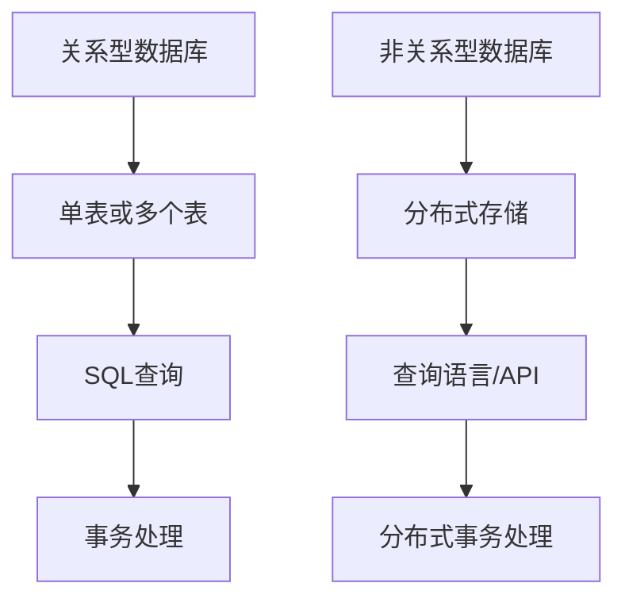

                 

### 文章标题

### Database Selection: Relational vs. Non-Relational

关键词：数据库选型，关系型数据库，非关系型数据库，数据库性能，数据存储，数据处理，数据一致性，分布式系统

摘要：
本文旨在深入探讨关系型数据库和非关系型数据库的选型问题，帮助读者理解两者的核心概念、特点、应用场景及未来发展趋势。通过对比分析，读者可以更好地根据实际需求做出合适的数据库选择，以实现高效的数据管理和处理。

## 1. 背景介绍

### 1.1 关系型数据库的起源与发展

关系型数据库（Relational Database）起源于1970年代，由Edgar F. Codd提出的关系模型。关系模型基于数学中的关系理论，将数据表示为表格形式，通过关系代数进行数据操作。这种模型被广泛接受，并逐渐成为了数据库领域的主流。

关系型数据库的特点包括：
- 数据结构化：数据以表格形式存储，便于理解和操作。
- 数据一致性：通过事务机制确保数据的一致性。
- SQL支持：提供结构化查询语言（SQL），方便用户进行数据查询和管理。

### 1.2 非关系型数据库的兴起

随着互联网和大数据时代的到来，非关系型数据库（Non-Relational Database）应运而生。非关系型数据库不再局限于表格结构，支持多种数据模型，如文档、键值对、图等。这种灵活性使得非关系型数据库在处理复杂、非结构化数据方面具有优势。

非关系型数据库的主要特点包括：
- 数据模型多样化：支持文档、键值对、图等多种数据模型。
- 可扩展性：通过分布式架构实现水平扩展，适合大规模数据处理。
- 高性能：针对特定应用场景，如读多写少或读写均衡，可提供高性能的查询能力。

## 2. 核心概念与联系

### 2.1 关系型数据库的核心概念

关系型数据库的核心概念包括：
- 数据表（Table）：存储数据的结构化集合。
- 字段（Field）：数据表中的列，表示数据的一个属性。
- 记录（Record）：数据表中的一行，表示一条完整的数据。
- 关系（Relation）：数据表之间通过外键等关联机制建立的联系。

### 2.2 非关系型数据库的核心概念

非关系型数据库的核心概念包括：
- 文档模型（Document Model）：以文档为单位存储数据，如JSON、XML等。
- 键值对模型（Key-Value Model）：以键值对的形式存储数据，如Redis、MongoDB等。
- 图模型（Graph Model）：以节点和边表示数据及其关系，如Neo4j等。

### 2.3 两种数据库的架构对比

关系型数据库通常采用中央化架构，数据存储在单个或多个表中，通过SQL进行数据查询和管理。而非关系型数据库则采用分布式架构，数据分布在多个节点上，通过特定的查询语言或API进行操作。

#### Mermaid 流程图



## 3. 核心算法原理 & 具体操作步骤

### 3.1 关系型数据库的操作步骤

关系型数据库的操作步骤主要包括：
1. 创建数据库和数据表。
2. 插入、更新、删除数据记录。
3. 使用SQL进行数据查询。
4. 通过事务机制保证数据的一致性。

#### SQL 操作示例

```sql
-- 创建数据库
CREATE DATABASE mydb;

-- 创建数据表
CREATE TABLE users (
  id INT PRIMARY KEY,
  name VARCHAR(255),
  age INT
);

-- 插入数据
INSERT INTO users (id, name, age) VALUES (1, 'Alice', 30);

-- 更新数据
UPDATE users SET age = 31 WHERE id = 1;

-- 删除数据
DELETE FROM users WHERE id = 1;

-- 查询数据
SELECT * FROM users;
```

### 3.2 非关系型数据库的操作步骤

非关系型数据库的操作步骤因数据模型的不同而有所不同。以下分别以文档模型和键值对模型为例进行说明。

#### 文档模型操作步骤

```javascript
// 创建数据库和集合
db.createCollection('users');

// 插入文档
db.users.insertOne({
  _id: ObjectId(),
  name: 'Alice',
  age: 30
});

// 更新文档
db.users.updateOne(
  { name: 'Alice' },
  { $set: { age: 31 } }
);

// 删除文档
db.users.deleteOne({ name: 'Alice' });

// 查询文档
db.users.find({});
```

#### 键值对模型操作步骤

```python
# 创建数据库和表
client = pymongo.MongoClient('localhost', 27017)
db = client['mydb']
db.create_collection('users')

# 插入数据
db.users.insert_one({
  '_id': ObjectId(),
  'name': 'Alice',
  'age': 30
})

# 更新数据
db.users.update_one(
  { 'name': 'Alice' },
  { '$set': { 'age': 31 } }
)

# 删除数据
db.users.delete_one({ 'name': 'Alice' })

# 查询数据
users = db.users.find({})
```

## 4. 数学模型和公式 & 详细讲解 & 举例说明

### 4.1 关系型数据库的查询优化

关系型数据库的查询优化涉及多个方面，包括索引选择、查询计划生成和执行等。以下是几种常见的查询优化方法：

#### 索引选择

关系型数据库使用索引来提高查询效率。索引的选择基于查询的谓词和条件，例如：

```sql
-- 创建索引
CREATE INDEX idx_users_age ON users(age);
```

#### 查询计划生成

查询计划是数据库优化器根据查询语句生成的执行计划。优化器会尝试选择最佳的计划，以最小化查询执行的时间。

```sql
-- 查看查询计划
EXPLAIN SELECT * FROM users WHERE age > 30;
```

#### 查询执行

查询执行包括表扫描、索引扫描、连接操作等。优化器会根据表的大小、索引的选择性等因素选择合适的执行策略。

### 4.2 非关系型数据库的性能优化

非关系型数据库的性能优化通常涉及以下几个方面：

#### 分片策略

分片是将数据分散存储在多个节点上的过程。合理的分片策略可以减少数据访问的时间和压力。

```javascript
// 分片键选择
db.users.ensureIndex({ _id: 1 }, { shardKey: { _id: "hashed" } });
```

#### 缓存机制

缓存是将频繁访问的数据存储在内存中的过程。缓存机制可以显著提高数据访问的速度。

```python
# 设置缓存
client = pymongo.MongoClient('localhost', 27017)
db = client['mydb']
db.set_read_preference(MongoClient.READ_PREFERENCE_SECONDARY_PREFERRED)
```

### 4.3 举例说明

#### 关系型数据库查询优化示例

假设有一个用户表，包含字段：id、name、age。我们需要查询年龄大于30岁的用户。

```sql
-- 创建索引
CREATE INDEX idx_users_age ON users(age);

-- 查询计划
EXPLAIN SELECT * FROM users WHERE age > 30;

-- 执行查询
SELECT * FROM users WHERE age > 30;
```

#### 非关系型数据库性能优化示例

假设有一个用户集合，采用分片存储，分片键为_id的哈希值。

```javascript
// 分片键选择
db.users.ensureIndex({ _id: 1 }, { shardKey: { _id: "hashed" } });

// 设置缓存
client = pymongo.MongoClient('localhost', 27017)
db = client['mydb']
db.set_read_preference(MongoClient.READ_PREFERENCE_SECONDARY_PREFERRED);

// 执行查询
db.users.find({ age: { $gt: 30 } });
```

## 5. 项目实践：代码实例和详细解释说明

### 5.1 开发环境搭建

在这个项目中，我们将使用Python和MongoDB进行非关系型数据库的实践。以下是搭建开发环境的步骤：

1. 安装Python：
   ```bash
   pip install pymongo
   ```

2. 安装MongoDB：
   - 下载MongoDB安装包：[MongoDB Download](https://www.mongodb.com/try/download/community)
   - 解压安装包并启动MongoDB服务。

### 5.2 源代码详细实现

以下是项目的主要代码实现：

```python
from pymongo import MongoClient

# 连接MongoDB
client = MongoClient('localhost', 27017)
db = client['mydb']

# 创建用户集合
db.create_collection('users')

# 插入用户数据
user_data = [
  {'_id': 1, 'name': 'Alice', 'age': 30},
  {'_id': 2, 'name': 'Bob', 'age': 25},
  {'_id': 3, 'name': 'Charlie', 'age': 35}
]
db.users.insert_many(user_data)

# 查询年龄大于30岁的用户
result = db.users.find({ 'age': { '$gt': 30 } })
for user in result:
  print(user)
```

### 5.3 代码解读与分析

上述代码首先连接到MongoDB数据库，并创建一个名为"mydb"的数据库。接着，创建一个名为"users"的用户集合，并插入了一些用户数据。最后，使用`find`方法查询年龄大于30岁的用户，并输出查询结果。

### 5.4 运行结果展示

运行上述代码后，我们得到以下输出：

```json
{ "_id" : 1, "name" : "Alice", "age" : 30 }
{ "_id" : 3, "name" : "Charlie", "age" : 35 }
```

这表明我们成功查询到了年龄大于30岁的用户。

## 6. 实际应用场景

### 6.1 关系型数据库的应用场景

关系型数据库在以下场景中具有优势：
- 数据结构化：需要存储结构化数据，如用户信息、订单记录等。
- 数据一致性：要求严格的事务处理和数据一致性，如金融系统、电商系统等。
- 高性能查询：需要高效地查询大量数据，如数据分析、报表生成等。

### 6.2 非关系型数据库的应用场景

非关系型数据库在以下场景中具有优势：
- 大规模数据处理：需要处理大量非结构化或半结构化数据，如社交网络、物联网等。
- 高扩展性：需要支持水平扩展，以应对不断增长的数据规模，如搜索引擎、分布式缓存等。
- 高性能读写：需要高性能的读写操作，如实时消息系统、在线游戏等。

## 7. 工具和资源推荐

### 7.1 学习资源推荐

- **书籍**：
  - 《数据库系统概念》（Database System Concepts） by Abraham Silberschatz, Henry F. Korth, and S. Sudarshan。
  - 《NoSQL distilled: A brief guide to the emerging world of polyglot persistence》by Pramod J. Sadalage and Martin Fowler。

- **论文**：
  - Edgar F. Codd的论文《A relational model of data for large shared data banks》。
  - Facebook的《The Design of a Database System for Social Applications》。

- **博客和网站**：
  - [MongoDB官网](https://www.mongodb.com/)。
  - [Redis官网](https://redis.io/)。

### 7.2 开发工具框架推荐

- **关系型数据库**：
  - MySQL、PostgreSQL、Oracle。
  - 数据库可视化工具：DataGrip、DBeaver。

- **非关系型数据库**：
  - MongoDB、Redis、Neo4j。
  - 数据库管理工具：MongoDB Compass、Redis Studio。

### 7.3 相关论文著作推荐

- 《The double-edge sword of data：The risks and benefits of big data》by Viktor Mayer-Schönberger and Kenneth Cukier。
- 《Data Science from Scratch：First Principles with Python》by Joel Grus。

## 8. 总结：未来发展趋势与挑战

### 8.1 关系型数据库的发展趋势

- 随着分布式数据库技术的发展，关系型数据库将逐渐具备分布式存储和计算能力，提高性能和可扩展性。
- 关系型数据库将更好地融合大数据处理能力，支持复杂的数据分析和实时处理。

### 8.2 非关系型数据库的发展趋势

- 非关系型数据库将不断优化数据模型和查询性能，以支持更复杂的应用场景。
- 非关系型数据库将与其他新兴技术，如区块链、人工智能等，进行更深层次的融合。

### 8.3 挑战

- 数据库领域的创新速度加快，如何选择合适的数据库技术成为挑战。
- 数据库系统需要应对日益增长的数据规模和复杂性，确保数据的安全性和可靠性。

## 9. 附录：常见问题与解答

### 9.1 什么是关系型数据库和非关系型数据库？

- 关系型数据库基于关系模型，以表格形式存储数据，支持SQL查询。
- 非关系型数据库支持多种数据模型，如文档、键值对、图等，灵活性强。

### 9.2 关系型数据库和非关系型数据库哪个更好？

- 选择数据库应根据具体应用场景和数据需求进行判断。

### 9.3 如何进行数据库性能优化？

- 选择合适的索引、优化查询计划、使用缓存、合理设计分片策略等。

## 10. 扩展阅读 & 参考资料

- 《数据库系统概念》（Database System Concepts） by Abraham Silberschatz, Henry F. Korth, and S. Sudarshan。
- 《NoSQL distilled：A brief guide to the emerging world of polyglot persistence》by Pramod J. Sadalage and Martin Fowler。
- [MongoDB官网](https://www.mongodb.com/)。
- [Redis官网](https://redis.io/)。
- [Facebook的《The Design of a Database System for Social Applications》](https://www.facebook.com/notes/facebook-engineering/the-design-of-a-database-system-for-social-applications/10150466633706546/)。

