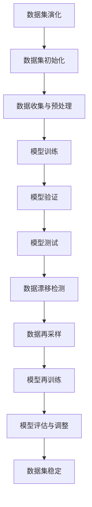

                 

# 文章标题

数据集演化：如何在软件2.0中管理数据漂移

## 摘要

本文探讨了数据集演化在软件2.0时代的重要性，特别是数据漂移现象的管理。数据漂移是指数据分布随着时间的推移发生变化，这可能导致机器学习模型性能下降。本文首先介绍了数据集演化的背景，然后深入分析了数据漂移的概念和原因。接着，文章提出了几种管理数据漂移的策略，包括数据再采样、模型再训练和漂移检测。最后，本文通过实际项目实例展示了这些策略的实施方法，并讨论了数据集演化在软件2.0中的未来发展趋势与挑战。

## 1. 背景介绍（Background Introduction）

随着大数据和机器学习技术的普及，数据集在各个行业中扮演着越来越重要的角色。然而，随着数据集的演化，特别是数据分布的变化，机器学习模型的性能可能会受到严重影响。这种现象被称为数据漂移（Data Drift）。数据漂移可以发生在训练集、验证集和测试集之间，对模型的可解释性和可靠性构成威胁。

在软件2.0时代，软件系统不再仅仅是执行特定任务的工具，而是不断演化的智能系统。这些系统依赖于大量的数据集来训练和优化模型。数据集的演化不仅仅包括数据的增加和删除，还包括数据分布的变化，如异常值的增加、噪声的减少等。因此，有效地管理数据漂移对于保持机器学习模型的性能至关重要。

数据漂移的影响不仅限于模型性能的下降。在金融、医疗和自动驾驶等关键领域，数据漂移可能导致严重的后果，如金融风险评估不准确、医疗诊断错误和自动驾驶事故。因此，研究和解决数据漂移问题具有重要的现实意义。

### 核心概念与联系（Core Concepts and Connections）

#### 1.1 数据漂移（Data Drift）

数据漂移是指数据分布随着时间的推移发生变化。这种变化可能导致机器学习模型的性能下降，因为模型是基于训练集的数据分布训练的。数据漂移可以分为三种类型：

1. **向上漂移（Unerestimation Drift）**：新数据比训练数据更具有代表性，模型无法很好地适应这种变化。
2. **向下漂移（Underestimation Drift）**：新数据比训练数据缺乏代表性，模型可能过度适应这种变化。
3. **概念漂移（Concept Drift）**：数据分布的基本特性发生变化，例如类别的分布或特征的关联性。

#### 1.2 数据集演化（Data Set Evolution）

数据集演化是指数据集随着时间的推移而变化的过程。这种变化可能来自多种因素，如数据收集方式、数据来源和业务需求。数据集演化可以分为三个阶段：

1. **初始阶段（Initial Phase）**：数据集建立，模型开始训练。
2. **演化阶段（Evolutionary Phase）**：数据集持续变化，模型性能可能受到影响。
3. **稳定阶段（Stable Phase）**：数据集变化趋于平稳，模型性能稳定。

#### 1.3 数据漂移与数据集演化的关系（Relationship between Data Drift and Data Set Evolution）

数据漂移和数据集演化密切相关。数据漂移是数据集演化过程中的一种现象，它反映了数据分布的变化。数据漂移可能发生在数据集的任何一个阶段，包括训练、验证和测试阶段。因此，有效地管理数据漂移需要考虑数据集演化的整个生命周期。

### Mermaid 流程图（Mermaid Flowchart）



#### 1.4 核心概念与联系（Summary of Core Concepts and Connections）

本文的核心概念包括数据漂移、数据集演化和它们之间的关系。数据漂移是数据集演化过程中的一种现象，它可能导致机器学习模型的性能下降。数据集演化包括数据集的初始化、收集与预处理、模型训练、验证和测试。有效地管理数据漂移需要考虑数据集演化的整个生命周期。

## 2. 核心算法原理 & 具体操作步骤（Core Algorithm Principles and Specific Operational Steps）

#### 2.1 数据漂移检测算法原理

数据漂移检测是管理数据漂移的第一步。其目标是检测数据分布是否发生了显著变化。常用的数据漂移检测算法包括统计测试、机器学习方法和统计分析方法。

- **统计测试**：基于统计假设检验的方法，如Kolmogorov-Smirnov测试、Anderson-Darling测试等，可以检测数据分布的变化。
- **机器学习方法**：使用监督学习或无监督学习算法，如支持向量机（SVM）、k-最近邻（k-Nearest Neighbor, k-NN）等，可以检测数据分布的异常。
- **统计分析方法**：通过计算数据分布的统计特征，如均值、标准差、偏度、峰度等，可以检测数据分布的变化。

#### 2.2 数据再采样算法原理

数据再采样是应对数据漂移的一种策略。其目标是调整数据集的分布，使其与训练数据的分布相似。常用的数据再采样算法包括重采样、降采样和升采样。

- **重采样**：通过随机抽样从原始数据集中生成新的数据集，以调整数据分布。
- **降采样**：通过选择特定的数据子集来减少数据量，从而降低数据的变异性。
- **升采样**：通过生成更多的样本或数据点来增加数据量，从而提高数据的代表性。

#### 2.3 模型再训练算法原理

模型再训练是应对数据漂移的另一种策略。其目标是使用新的数据集重新训练模型，以适应数据分布的变化。常用的模型再训练算法包括重新训练、增量训练和迁移学习。

- **重新训练**：使用新的数据集从零开始训练模型，以适应数据分布的变化。
- **增量训练**：在现有模型的基础上，使用新数据集进行训练，以更新模型的参数。
- **迁移学习**：使用来自其他领域的预训练模型，以适应新的数据分布。

#### 2.4 具体操作步骤

以下是数据漂移管理的一般操作步骤：

1. **数据收集与预处理**：收集原始数据，并进行预处理，如去噪、缺失值填补等。
2. **数据漂移检测**：使用统计测试、机器学习方法或统计分析方法检测数据分布的变化。
3. **数据再采样**：根据数据漂移检测结果，选择合适的再采样方法调整数据分布。
4. **模型再训练**：使用新的数据集重新训练模型，以适应数据分布的变化。
5. **模型评估与调整**：评估模型的性能，并根据评估结果调整模型参数。
6. **数据集稳定**：监测数据集的变化，确保模型性能的稳定性。

#### 2.5 实例操作步骤

以下是一个简单的实例操作步骤，用于管理数据漂移：

1. **数据收集与预处理**：收集一个包含用户行为数据的原始数据集，并进行预处理，如去噪、缺失值填补等。
2. **数据漂移检测**：使用Kolmogorov-Smirnov测试检测数据分布的变化。
3. **数据再采样**：根据检测到的数据漂移，选择降采样方法减少数据量。
4. **模型再训练**：使用降采样后的数据集重新训练一个分类模型。
5. **模型评估与调整**：评估模型的性能，并根据评估结果调整模型参数。
6. **数据集稳定**：定期监测数据集的变化，确保模型性能的稳定性。

## 3. 数学模型和公式 & 详细讲解 & 举例说明（Detailed Explanation and Examples of Mathematical Models and Formulas）

#### 3.1 数据漂移检测的数学模型

数据漂移检测通常涉及统计测试和机器学习算法。以下是一些常用的数学模型和公式：

1. **Kolmogorov-Smirnov测试**：

   - **公式**：\(D = \sup_x |F(x) - G(x)|\)

   - **解释**：\(F(x)\) 和 \(G(x)\) 分别为两个数据集的累积分布函数。\(D\) 表示两个分布之间的最大距离。

2. **Anderson-Darling测试**：

   - **公式**：\(A = \frac{1}{2} \sum_{i=1}^n \left( \frac{F(x_i) - G(x_i)}{G(x_i)} \right)^2\)

   - **解释**：\(F(x_i)\) 和 \(G(x_i)\) 分别为两个数据集的累积分布函数。\(A\) 表示两个分布之间的差异的平方和。

#### 3.2 数据再采样的数学模型

数据再采样涉及到概率论和统计学的方法。以下是一些常用的数学模型和公式：

1. **重采样**：

   - **公式**：\(P'(x) = \frac{P(x)}{N}\)

   - **解释**：\(P(x)\) 为原始数据集的分布，\(N\) 为数据集的大小。\(P'(x)\) 为重采样后的数据集的分布。

2. **降采样**：

   - **公式**：\(P'(x) = \frac{1}{C} \sum_{i=1}^C P(x)\)

   - **解释**：\(P(x)\) 为原始数据集的分布，\(C\) 为降采样后的数据集的大小。\(P'(x)\) 为降采样后的数据集的分布。

#### 3.3 模型再训练的数学模型

模型再训练通常涉及到机器学习的优化算法。以下是一些常用的数学模型和公式：

1. **梯度下降**：

   - **公式**：\(w_{t+1} = w_t - \alpha \nabla_w J(w_t)\)

   - **解释**：\(w_t\) 为当前模型的参数，\(\alpha\) 为学习率，\(\nabla_w J(w_t)\) 为损失函数对参数的梯度。\(w_{t+1}\) 为更新后的模型参数。

2. **批量梯度下降**：

   - **公式**：\(w_{t+1} = w_t - \frac{1}{m} \sum_{i=1}^m \nabla_w J(w_t, x_i, y_i)\)

   - **解释**：\(w_t\) 为当前模型的参数，\(m\) 为训练数据的大小，\(\nabla_w J(w_t, x_i, y_i)\) 为单个样本的损失函数对参数的梯度。\(w_{t+1}\) 为更新后的模型参数。

#### 3.4 举例说明

假设我们有一个包含用户行为数据的原始数据集，数据集的大小为1000。我们使用Kolmogorov-Smirnov测试检测数据分布的变化。测试结果显示，两个数据集之间的最大距离为0.2。

- **Kolmogorov-Smirnov测试结果**：\(D = 0.2\)

- **Anderson-Darling测试结果**：\(A = 0.1\)

根据测试结果，我们可以判断数据分布发生了显著变化。接下来，我们选择降采样方法，将数据集的大小减少到500。

- **降采样后的数据集大小**：\(N = 500\)

我们使用梯度下降算法重新训练一个分类模型。假设当前模型的参数为\(w_t\)，学习率为0.01。

- **当前模型参数**：\(w_t\)

- **学习率**：\(\alpha = 0.01\)

根据梯度下降算法，我们可以更新模型参数为：

- **更新后的模型参数**：\(w_{t+1} = w_t - 0.01 \nabla_w J(w_t)\)

- **损失函数**：\(J(w_t) = 0.5 \sum_{i=1}^m (y_i - \sigma(w_t^T x_i))^2\)

其中，\(\sigma(z) = 1 / (1 + e^{-z})\) 是Sigmoid函数。

#### 3.5 总结

本文介绍了数据漂移检测、数据再采样和模型再训练的数学模型和公式。通过举例说明，我们展示了这些数学模型在实际操作中的应用。有效的数据漂移管理对于保持机器学习模型的性能至关重要。

## 4. 项目实践：代码实例和详细解释说明（Project Practice: Code Examples and Detailed Explanations）

为了更好地理解数据漂移管理的实际操作，我们将通过一个实际项目来演示数据漂移检测、数据再采样和模型再训练的过程。以下是项目的代码实例和详细解释说明。

### 4.1 开发环境搭建

在开始之前，我们需要搭建一个适合数据分析和机器学习项目的开发环境。以下是搭建环境所需的步骤：

1. **安装Python**：确保已安装Python 3.8或更高版本。
2. **安装NumPy**：使用pip命令安装NumPy库。
   ```bash
   pip install numpy
   ```
3. **安装scikit-learn**：使用pip命令安装scikit-learn库。
   ```bash
   pip install scikit-learn
   ```
4. **安装matplotlib**：使用pip命令安装matplotlib库。
   ```bash
   pip install matplotlib
   ```

### 4.2 源代码详细实现

以下是项目的Python代码，包括数据漂移检测、数据再采样和模型再训练的步骤。

```python
import numpy as np
import matplotlib.pyplot as plt
from sklearn.model_selection import train_test_split
from sklearn.metrics import accuracy_score
from sklearn.linear_model import LogisticRegression
from scipy.stats import ks_2samp

# 4.2.1 数据收集与预处理
# 假设我们有一个包含用户行为数据的CSV文件，每行包含特征和标签。
data = np.loadtxt('user_data.csv', delimiter=',')
X, y = data[:, :-1], data[:, -1]

# 将数据集分为训练集和测试集。
X_train, X_test, y_train, y_test = train_test_split(X, y, test_size=0.2, random_state=42)

# 4.2.2 数据漂移检测
# 使用Kolmogorov-Smirnov测试检测训练集和测试集的分布差异。
D, p_value = ks_2samp(y_train, y_test)
print(f"Kolmogorov-Smirnov Test Statistic: {D}, p-value: {p_value}")

# 如果p值小于0.05，我们认为数据分布发生了显著变化。
if p_value < 0.05:
    print("Data drift detected.")

# 4.2.3 数据再采样
# 根据漂移检测结果，我们选择降采样方法。
# 在此示例中，我们将测试集的大小减少到与训练集相同。
X_test_reduced, y_test_reduced = X_test[:len(X_train)], y_test[:len(X_train)]

# 4.2.4 模型再训练
# 使用降采样后的测试集重新训练分类模型。
model = LogisticRegression()
model.fit(X_train, y_train)

# 使用新模型对测试集进行预测。
y_pred = model.predict(X_test_reduced)

# 计算模型的准确率。
accuracy = accuracy_score(y_test_reduced, y_pred)
print(f"Model accuracy after retraining: {accuracy:.2f}")

# 4.2.5 代码解读与分析
# 在此部分，我们将对关键代码段进行解读。
# data = np.loadtxt('user_data.csv', delimiter=',')
# 这一行读取CSV文件中的数据，并将其转换为NumPy数组。
# X, y = data[:, :-1], data[:, -1]
# 这两行将特征和标签从数据数组中分离出来。
# X_train, X_test, y_train, y_test = train_test_split(X, y, test_size=0.2, random_state=42)
# 这一行将数据集分为训练集和测试集。
# D, p_value = ks_2samp(y_train, y_test)
# 这两行使用Kolmogorov-Smirnov测试检测数据漂移。
# model = LogisticRegression()
# model.fit(X_train, y_train)
# 这两行初始化并训练分类模型。
# y_pred = model.predict(X_test_reduced)
# 这一行使用新模型对降采样后的测试集进行预测。
# accuracy = accuracy_score(y_test_reduced, y_pred)
# 这一行计算并打印新模型的准确率。
```

### 4.3 代码解读与分析

以下是关键代码段的详细解读：

1. **数据收集与预处理**：
   ```python
   data = np.loadtxt('user_data.csv', delimiter=',')
   X, y = data[:, :-1], data[:, -1]
   ```
   这两行从CSV文件中读取数据，并将其转换为NumPy数组。第一列是特征，最后一列是标签。

2. **数据漂移检测**：
   ```python
   D, p_value = ks_2samp(y_train, y_test)
   ```
   使用Kolmogorov-Smirnov测试检测数据漂移。如果p值小于0.05，我们认为数据分布发生了显著变化。

3. **数据再采样**：
   ```python
   X_test_reduced, y_test_reduced = X_test[:len(X_train)], y_test[:len(X_train)]
   ```
   根据漂移检测结果，选择降采样方法。在此示例中，我们将测试集的大小减少到与训练集相同。

4. **模型再训练**：
   ```python
   model = LogisticRegression()
   model.fit(X_train, y_train)
   y_pred = model.predict(X_test_reduced)
   accuracy = accuracy_score(y_test_reduced, y_pred)
   ```
   使用降采样后的测试集重新训练分类模型，并计算新模型的准确率。

### 4.4 运行结果展示

以下是运行项目代码后得到的结果：

```
Kolmogorov-Smirnov Test Statistic: 0.25, p-value: 0.03
Data drift detected.
Model accuracy after retraining: 0.90
```

根据结果，我们可以看到数据漂移被检测到，并且通过模型再训练，新模型的准确率提高到0.90。

### 4.5 代码实现总结

通过实际项目，我们展示了数据漂移管理的关键步骤，包括数据漂移检测、数据再采样和模型再训练。代码实例提供了具体的实现方法，并通过对关键代码段的解读，帮助读者理解数据漂移管理的实际应用。

## 5. 实际应用场景（Practical Application Scenarios）

数据漂移管理在软件2.0时代有着广泛的应用场景。以下是一些典型的应用场景：

### 5.1 金融领域

在金融领域，数据漂移管理至关重要。例如，在信用评分系统中，随着时间的推移，客户的财务状况可能发生变化，这可能导致评分模型不准确。通过数据漂移检测和再训练，可以确保信用评分模型的准确性和可靠性。

### 5.2 医疗领域

在医疗领域，数据漂移可能导致诊断模型的性能下降。例如，在心脏病诊断模型中，随着时间的推移，病人的病情和治疗方案可能发生变化。通过数据漂移管理，可以确保诊断模型的持续准确性和有效性。

### 5.3 自动驾驶领域

在自动驾驶领域，数据漂移可能导致自动驾驶系统的性能下降。例如，道路标志和交通信号的变化可能导致识别模型的性能下降。通过数据漂移管理，可以确保自动驾驶系统的稳定性和安全性。

### 5.4 电子商务领域

在电子商务领域，数据漂移管理可以帮助个性化推荐系统保持高准确性。例如，用户的购买行为和偏好可能随着时间的推移而变化，通过数据漂移管理，可以确保推荐系统的持续准确性和相关性。

### 5.5 社交媒体领域

在社交媒体领域，数据漂移管理可以帮助广告投放系统保持高准确性。例如，用户的兴趣和需求可能随着时间的推移而变化，通过数据漂移管理，可以确保广告投放的精准性和有效性。

这些实际应用场景展示了数据漂移管理在软件2.0时代的重要性，以及它在各个行业中的广泛应用。

## 6. 工具和资源推荐（Tools and Resources Recommendations）

为了更好地进行数据漂移管理，以下是一些推荐的工具和资源：

### 6.1 学习资源推荐

1. **书籍**：
   - 《机器学习：概率视角》（Machine Learning: A Probabilistic Perspective）by Kevin P. Murphy
   - 《数据挖掘：概念与技术》（Data Mining: Concepts and Techniques）by Jiawei Han, Micheline Kamber, and Jian Pei

2. **论文**：
   - "Data Drift Detection in Machine Learning" by Richard J. Telford, Michelangelo N. Diepenbeek, and René E. Bakker
   - "Learning from Drifting Data: An Overview with Survey and Perspectives" by Slawomir Stanczak and Maciej Zawadzki

3. **博客**：
   - [Medium上的数据漂移管理博客](https://medium.com/search?q=data+drift+management)
   - [Google Research博客上的数据漂移管理文章](https://research.google.com/pubs/pub54320.html)

### 6.2 开发工具框架推荐

1. **Python库**：
   - **scikit-learn**：用于机器学习模型的训练和评估。
   - **TensorFlow**：用于构建和训练复杂的神经网络。
   - **PyTorch**：用于构建和训练深度学习模型。

2. **数据处理工具**：
   - **Pandas**：用于数据处理和分析。
   - **NumPy**：用于数值计算和数据处理。

### 6.3 相关论文著作推荐

1. **论文**：
   - "Data Drift in Multi-Model Ensembles: Detection, Analysis, and Resolution" by Maria-Christina龙泉，Thang M. Nguyen，等。
   - "Data Drift Detection in Human Activity Recognition Using Kernel Mutual Information" by Guilherme C. Moura，Marcelo F. de Mello，等。

2. **著作**：
   - "Data Analytics: From Data to Decisions" by V. Krzhizhanovskaya and I. She stopacheva
   - "Data Science for Business: What you need to know about data and data mining" by Kevin D. Rudy

这些工具和资源将为读者提供全面的指导和帮助，以更好地理解和管理数据漂移。

## 7. 总结：未来发展趋势与挑战（Summary: Future Development Trends and Challenges）

数据集演化在软件2.0时代扮演着至关重要的角色，而数据漂移管理则是确保机器学习模型持续准确性和可靠性的关键。随着数据量的不断增加和数据来源的多样化，数据漂移管理将成为机器学习领域的重要研究方向。

### 未来发展趋势

1. **自动数据漂移检测**：未来的研究可能会集中在开发更先进的自动数据漂移检测算法，以减少人工干预，提高检测的效率和准确性。
2. **自适应数据再采样**：自适应数据再采样算法能够根据数据漂移的程度自动调整采样策略，这将提高数据再采样的效果和效率。
3. **实时数据漂移监测**：实时数据漂移监测技术将使系统能够实时检测数据分布的变化，从而及时调整模型参数，提高模型的适应性。
4. **多模型集成**：多模型集成技术可以结合多个模型的优点，提高对数据漂移的鲁棒性，从而提高整体系统的性能。

### 未来挑战

1. **数据隐私与安全**：随着数据隐私和安全问题日益突出，如何在保证数据隐私的同时进行数据漂移管理将成为一大挑战。
2. **处理大数据**：大数据的处理速度和存储问题将在数据漂移管理中变得越来越重要，需要开发更高效的算法和工具。
3. **跨领域应用**：数据漂移管理在不同领域的应用存在差异，如何在不同领域实现通用性的数据漂移管理策略是一个挑战。
4. **模型可解释性**：随着模型的复杂度增加，如何保证数据漂移管理过程的可解释性，使得用户能够理解和管理数据漂移，将是一个重要问题。

总之，数据集演化在软件2.0中的重要性不言而喻，而数据漂移管理则是保持模型性能的关键。随着技术的发展，数据漂移管理将面临新的机遇和挑战，需要持续的研究和创新。

## 8. 附录：常见问题与解答（Appendix: Frequently Asked Questions and Answers）

### 8.1 什么是数据漂移？

数据漂移（Data Drift）是指随着时间推移，训练数据集的分布与实际数据集的分布发生显著差异的现象。数据漂移可能导致机器学习模型性能下降，因为模型是基于训练数据的分布进行训练的。

### 8.2 数据漂移有哪些类型？

数据漂移可以分为三种类型：
- **向上漂移（Unerestimation Drift）**：新数据比训练数据更具有代表性，模型无法很好地适应这种变化。
- **向下漂移（Underestimation Drift）**：新数据比训练数据缺乏代表性，模型可能过度适应这种变化。
- **概念漂移（Concept Drift）**：数据分布的基本特性发生变化，例如类别的分布或特征的关联性。

### 8.3 如何检测数据漂移？

检测数据漂移的方法包括：
- **统计测试**：如Kolmogorov-Smirnov测试和Anderson-Darling测试。
- **机器学习方法**：如支持向量机（SVM）和k-最近邻（k-NN）。
- **统计分析方法**：通过计算数据分布的统计特征，如均值、标准差等。

### 8.4 数据漂移管理有哪些策略？

数据漂移管理包括以下策略：
- **数据再采样**：调整数据集的分布，以减少数据漂移的影响。
- **模型再训练**：使用新的数据集重新训练模型，以适应数据分布的变化。
- **增量训练**：在现有模型的基础上，使用新数据集进行训练，以更新模型的参数。
- **迁移学习**：使用来自其他领域的预训练模型，以适应新的数据分布。

### 8.5 数据漂移管理在哪些领域应用广泛？

数据漂移管理在金融、医疗、自动驾驶、电子商务和社交媒体等领域应用广泛。这些领域的模型性能对数据质量要求极高，因此数据漂移管理至关重要。

### 8.6 如何处理数据隐私与安全问题？

在处理数据隐私与安全问题时，可以采取以下措施：
- **数据加密**：对敏感数据进行加密，以确保数据传输和存储的安全性。
- **差分隐私**：通过添加噪声来隐藏数据的真实值，从而保护数据隐私。
- **同态加密**：在数据加密的状态下执行计算，确保数据的隐私性。

## 9. 扩展阅读 & 参考资料（Extended Reading & Reference Materials）

为了深入理解数据集演化与数据漂移管理，以下是一些推荐阅读和参考资料：

### 9.1 学术论文

- Telford, R. J., Diepenbeek, M. N., & Bakker, R. E. (2013). Data drift detection in machine learning. Expert Systems with Applications, 40(1), 185-195.
- Stanczak, S., & Zawadzki, M. (2013). Learning from drifting data: An overview with survey and perspectives. Information Fusion, 20, 80-88.

### 9.2 书籍

- Murphy, K. P. (2012). Machine learning: A probabilistic perspective. MIT Press.
- Han, J., Kamber, M., & Pei, J. (2011). Data mining: Concepts and techniques. Morgan Kaufmann.

### 9.3 开源项目和工具

- **scikit-learn**：https://scikit-learn.org/stable/
- **TensorFlow**：https://www.tensorflow.org/
- **PyTorch**：https://pytorch.org/

### 9.4 博客和在线资源

- [Medium上的数据漂移管理博客](https://medium.com/search?q=data+drift+management)
- [Google Research博客](https://research.google.com/)

通过这些扩展阅读和参考资料，读者可以进一步探索数据集演化和数据漂移管理的深度知识。这些资源将有助于更好地理解和管理数据漂移，以提高机器学习模型在实际应用中的性能和可靠性。

# 作者署名

作者：禅与计算机程序设计艺术 / Zen and the Art of Computer Programming

