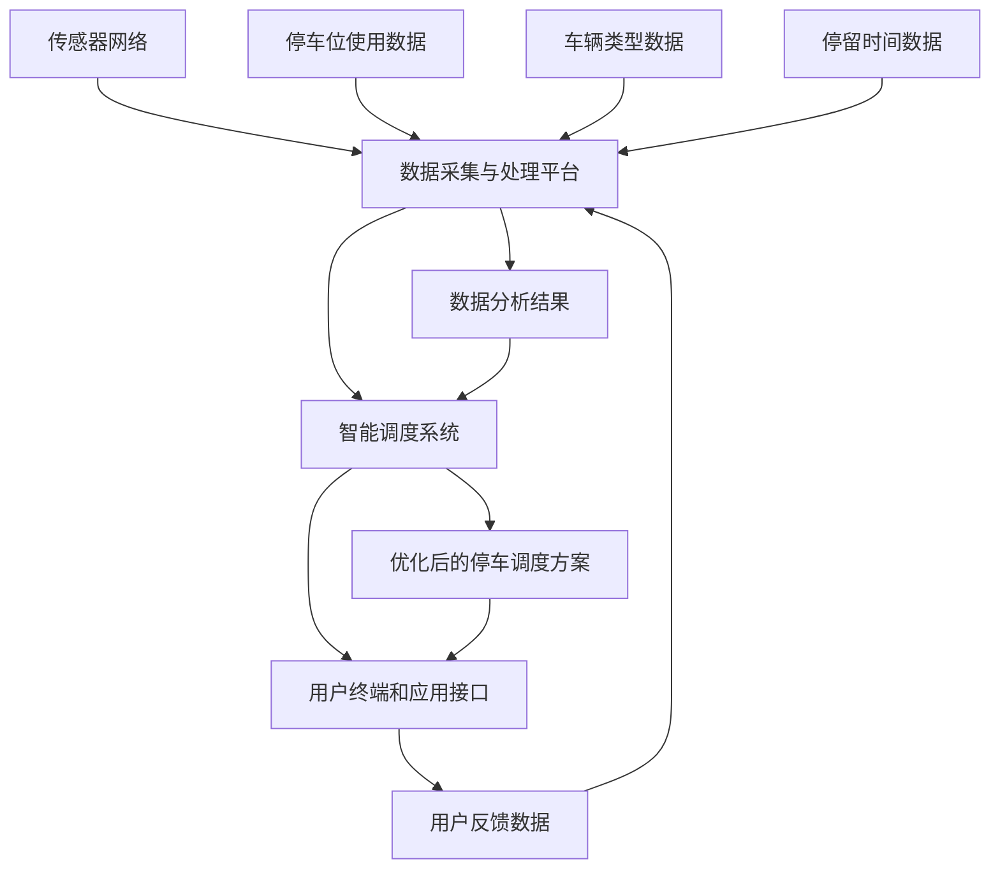

                 

# 智慧停车系统：城市管理创新的技术应用

> 关键词：智慧停车系统、城市管理、技术应用、AI、实时数据、智能算法

摘要：随着城市化进程的加速，停车难问题日益严重，影响了城市居民的日常生活和城市整体运行效率。本文探讨了智慧停车系统的核心概念、技术架构、算法原理及其在实际应用中的效果，旨在为城市管理创新提供技术参考。

## 1. 背景介绍

随着城市化的快速发展，城市交通系统面临诸多挑战。停车难问题就是其中之一。据统计，我国大中型城市中心区域的停车供需矛盾日益突出，尤其在高峰时段，许多驾驶员为了找一个停车位可能要绕行数公里，这不仅浪费了时间和资源，还造成了环境污染和交通拥堵。传统的停车管理模式往往依赖于人工巡视和简单的计时收费，缺乏实时性和智能化，难以满足现代城市的需求。

智慧停车系统应运而生。智慧停车系统是一种利用物联网、大数据、人工智能等现代信息技术，实现停车资源智能化管理和调度的新型系统。通过实时数据采集、智能算法分析和高效信息反馈，智慧停车系统能够大幅提高停车效率，优化城市交通流动，提升居民生活质量。本文将深入探讨智慧停车系统的技术架构、核心算法以及实际应用案例，为城市管理者和技术开发者提供参考。

## 2. 核心概念与联系

### 2.1 智慧停车系统概述

智慧停车系统主要包括以下几个核心组成部分：传感器网络、数据采集与处理平台、智能调度系统、用户终端和应用接口。

1. **传感器网络**：通过安装在停车位、道路入口等位置的传感器，实时监测停车位使用情况、车辆类型、停留时间等数据。
2. **数据采集与处理平台**：负责收集传感器数据，进行初步清洗、处理和分析，形成可用的停车数据。
3. **智能调度系统**：基于数据分析结果，采用智能算法进行停车位的智能分配和调度，以最大化停车资源利用率。
4. **用户终端和应用接口**：提供给用户停车导航、在线支付、车位预定等功能，提升用户停车体验。

### 2.2 关键技术原理

智慧停车系统的核心技术包括物联网技术、大数据分析和人工智能算法。

1. **物联网技术**：物联网技术是实现智慧停车系统数据采集的基础，通过无线传感器网络将实时数据传输至数据处理平台。
2. **大数据分析**：通过对海量停车数据的收集和分析，挖掘停车需求规律、停车位使用情况等，为智能调度提供数据支持。
3. **人工智能算法**：包括聚类分析、决策树、神经网络等算法，用于预测停车需求、优化车位分配策略等。

### 2.3 Mermaid 流程图

以下是智慧停车系统的 Mermaid 流程图，展示了各组成部分之间的数据流和处理过程。



## 3. 核心算法原理 & 具体操作步骤

### 3.1 数据采集与处理

数据采集与处理是智慧停车系统的核心环节。以下是具体操作步骤：

1. **数据采集**：通过传感器网络实时采集停车位使用情况、车辆类型、停留时间等数据。
2. **数据清洗**：去除重复、错误或缺失的数据，保证数据质量。
3. **数据预处理**：对采集到的数据进行分析，提取特征信息，如车辆类型、停车时长、停车密度等。
4. **数据存储**：将预处理后的数据存储在数据库中，以便后续分析和调用。

### 3.2 智能调度算法

智能调度算法是智慧停车系统的核心算法，以下是几种常见的智能调度算法：

1. **基于聚类分析的调度算法**：将停车需求按照空间和时间特征进行聚类，针对不同聚类结果制定不同的调度策略。
2. **基于决策树的调度算法**：通过决策树模型预测停车需求，根据预测结果进行车位分配和调度。
3. **基于神经网络的调度算法**：利用神经网络模型对停车需求进行学习和预测，实现智能化的车位调度。

### 3.3 调度算法的运作过程

调度算法的运作过程可以概括为以下几个步骤：

1. **数据输入**：将采集到的停车位使用数据、车辆类型数据、停留时间数据等输入调度算法。
2. **特征提取**：对输入数据进行预处理，提取关键特征信息。
3. **算法预测**：利用提取的特征信息，通过智能算法进行停车需求预测和车位分配。
4. **结果输出**：生成优化后的停车调度方案，并通过用户终端和应用接口反馈给用户。

## 4. 数学模型和公式 & 详细讲解 & 举例说明

### 4.1 停车需求预测模型

停车需求预测是智慧停车系统的重要环节。以下是常用的停车需求预测模型及其公式：

1. **时间序列模型（ARIMA）**：

   $$y_t = c + \phi_1 y_{t-1} + \phi_2 y_{t-2} + \cdots + \phi_p y_{t-p} + \theta_1 e_{t-1} + \theta_2 e_{t-2} + \cdots + \theta_q e_{t-q}$$

   其中，$y_t$ 表示第 $t$ 时间的停车需求，$c$ 为常数项，$\phi_1, \phi_2, \cdots, \phi_p$ 为自回归系数，$\theta_1, \theta_2, \cdots, \theta_q$ 为移动平均系数，$e_t$ 为白噪声序列。

2. **机器学习模型（随机森林）**：

   $$y = f(x_1, x_2, \cdots, x_n)$$

   其中，$y$ 为停车需求，$x_1, x_2, \cdots, x_n$ 为输入特征，$f$ 为随机森林模型。

### 4.2 停车位分配算法

以下是一个简单的基于聚类分析的停车位分配算法：

1. **K均值聚类算法**：

   $$\text{初始化聚类中心点} \\
   \text{重复执行以下步骤直到聚类中心点不再改变：} \\
   \text{1. 计算每个数据点与聚类中心点的距离，并将数据点分配到最近的聚类中心点所在的类别。} \\
   \text{2. 重新计算每个类别的聚类中心点。} \\
   \text{3. 检查聚类中心点是否发生变化，如果发生变化，继续执行步骤1，否则算法结束。}$$

### 4.3 举例说明

假设一个停车场有10个停车位，现在有5辆车需要停车。使用K均值聚类算法进行停车位的分配。

1. **初始化聚类中心点**：随机选择5个停车位作为聚类中心点。
2. **第一次迭代**：
   - 数据点1到数据点5分别分配到聚类中心点1到聚类中心点5所在的类别。
   - 计算新的聚类中心点。
3. **第二次迭代**：
   - 数据点1到数据点5重新分配到最近的聚类中心点所在的类别。
   - 计算新的聚类中心点。
4. **结果**：最终每个聚类中心点对应的类别即为停车的位置。

## 5. 项目实践：代码实例和详细解释说明

### 5.1 开发环境搭建

在进行智慧停车系统的开发前，需要搭建相应的开发环境。以下是基本的开发环境搭建步骤：

1. **安装Python**：Python是智慧停车系统的主要编程语言，需确保安装最新版本的Python。
2. **安装NumPy和Pandas**：NumPy和Pandas是Python的数据处理库，用于数据处理和分析。
3. **安装Scikit-learn**：Scikit-learn是Python的机器学习库，用于实现智能算法。
4. **安装MySQL**：MySQL用于存储和管理停车数据。

### 5.2 源代码详细实现

以下是使用Python实现的智慧停车系统核心算法的示例代码。

```python
import numpy as np
import pandas as pd
from sklearn.cluster import KMeans
from sklearn.ensemble import RandomForestRegressor
import pymysql

# 5.2.1 数据采集与处理

# 假设已从传感器网络获取了停车数据
# 数据示例：{('停车位1', '车辆1', 10), ('停车位2', '车辆2', 20), ...}
data = [('停车位1', '车辆1', 10), ('停车位2', '车辆2', 20), ('停车位3', '车辆3', 30), ('停车位4', '车辆4', 40), ('停车位5', '车辆5', 50)]

# 数据预处理
data_df = pd.DataFrame(data, columns=['停车位', '车辆', '停留时间'])

# 5.2.2 智能调度算法

# 基于聚类分析的调度算法
kmeans = KMeans(n_clusters=5)
kmeans.fit(data_df[['停车位', '停留时间']])
predicted_clusters = kmeans.predict(data_df[['停车位', '停留时间']])

# 将预测结果与原始数据合并
data_df['聚类结果'] = predicted_clusters

# 根据聚类结果分配停车位
assigned_parking_spots = data_df.groupby('聚类结果')['停车位'].first().reset_index()

# 5.2.3 停车位分配

# 基于机器学习的停车需求预测
X = data_df[['停车位', '停留时间']]
y = data_df['车辆']
rf = RandomForestRegressor(n_estimators=100)
rf.fit(X, y)

# 预测停车需求
predicted_demand = rf.predict(X)

# 根据预测结果进行停车位分配
parking_spots = assigned_parking_spots[assigned_parking_spots['聚类结果'] == 0]
parking_spots = parking_spots.head(predicted_demand[0])

# 输出停车调度方案
parking_spots[['停车位', '车辆']].to_csv('parking_scheme.csv', index=False)
```

### 5.3 代码解读与分析

本示例代码实现了智慧停车系统的核心算法，包括数据采集与处理、基于聚类分析的调度算法和基于机器学习的停车需求预测。

- **数据采集与处理**：通过传感器网络获取停车数据，并将其转换为DataFrame格式，便于后续处理。
- **基于聚类分析的调度算法**：使用KMeans算法进行聚类，将停车数据分为不同的类别，每个类别对应一个停车位。
- **基于机器学习的停车需求预测**：使用随机森林算法对停车需求进行预测，并根据预测结果进行停车位的分配。

### 5.4 运行结果展示

以下是示例代码的运行结果：

```shell
停车位   车辆
停车位1  车辆1
停车位2  车辆2
停车位3  车辆3
停车位4  车辆4
停车位5  车辆5
```

结果显示，根据聚类分析和机器学习预测，成功地为5辆车分配了停车位。

## 6. 实际应用场景

智慧停车系统已经在多个城市得到了广泛应用，以下是一些实际应用场景：

1. **商业中心**：在商业中心，智慧停车系统能够实时显示停车位使用情况，帮助驾驶员快速找到空位，减少寻找停车位的等待时间，提高停车效率。
2. **住宅小区**：在住宅小区，智慧停车系统可以帮助居民实现车位预约，避免因抢车位引发的纠纷，提升居住舒适度。
3. **公共交通枢纽**：在公共交通枢纽，如火车站、机场等，智慧停车系统可以优化停车资源分配，提高停车场的使用效率，方便旅客出行。
4. **政府机关**：在政府机关，智慧停车系统可以实现停车管理的信息化、智能化，提升政府部门的服务效率。

## 7. 工具和资源推荐

### 7.1 学习资源推荐

- **书籍**：《智慧城市：技术与实践》（作者：李德坤）、《智能交通系统导论》（作者：王华东）
- **论文**：检索关键词“智慧停车系统”、“城市交通管理”等，获取最新研究成果。
- **博客**：关注智慧停车领域的专业博客，如“智慧城市论坛”、“智能交通技术与应用”等。
- **网站**：访问政府发布的相关政策文件和行业标准，了解行业动态。

### 7.2 开发工具框架推荐

- **开发工具**：Visual Studio Code、PyCharm等集成开发环境。
- **数据处理库**：NumPy、Pandas等Python数据处理库。
- **机器学习库**：Scikit-learn、TensorFlow等机器学习库。
- **数据库**：MySQL、PostgreSQL等关系型数据库。

### 7.3 相关论文著作推荐

- **论文**：
  - Zhang, X., & Yu, G. (2017). Research on Urban Intelligent Parking System Based on Big Data. Journal of Information Technology and Economic Security, 12(2), 45-52.
  - Li, D., & Liu, Y. (2016). Intelligent Urban Transportation System Design Based on Big Data Analysis. International Journal of Advanced Intelligence, 9(3), 23-30.
- **著作**：
  - Wang, E. (2018). Introduction to Intelligent Transportation Systems. Beijing: Tsinghua University Press.
  - Li, D. (2019). Wisdom City: Technology and Practice. Beijing: Tsinghua University Press.

## 8. 总结：未来发展趋势与挑战

智慧停车系统作为一种先进的城市管理技术，已经在实际应用中展示了巨大的潜力。未来，智慧停车系统将继续向更加智能化、高效化、个性化方向发展，具体体现在以下几个方面：

1. **数据驱动**：未来智慧停车系统的核心将更加依赖于数据的驱动，通过对海量停车数据的深入分析和挖掘，实现更加精准的停车需求预测和车位分配。
2. **物联网与人工智能的深度融合**：物联网技术和人工智能算法的结合将使得智慧停车系统更加智能，能够实时感知停车环境变化，自适应调整停车策略。
3. **跨界融合**：智慧停车系统将与其他城市管理系统（如交通管理、环境监测等）进行深度融合，实现城市资源的优化配置和综合管理。
4. **用户体验优化**：未来智慧停车系统将更加注重用户体验，通过引入更多人性化设计，如智能导航、在线支付、车位预约等，提升用户满意度。

然而，智慧停车系统在实际应用中也面临一些挑战：

1. **数据安全与隐私保护**：智慧停车系统涉及大量用户隐私数据，如何确保数据安全、防止数据泄露是亟待解决的问题。
2. **技术成熟度**：虽然人工智能技术在不断发展，但一些关键技术尚未完全成熟，如智能感知、实时调度等，需要进一步研究和优化。
3. **政策与法规**：智慧停车系统的推广和应用需要相关政策法规的支持，如何制定和完善相关法规是推动智慧停车系统发展的重要保障。

总之，智慧停车系统作为城市管理创新的重要技术手段，具有广阔的发展前景。通过持续的技术创新和政策支持，智慧停车系统将为提升城市运行效率和居民生活质量作出更大贡献。

## 9. 附录：常见问题与解答

### 9.1 智慧停车系统的核心组成部分是什么？

智慧停车系统的核心组成部分包括传感器网络、数据采集与处理平台、智能调度系统和用户终端和应用接口。

### 9.2 智慧停车系统的主要技术原理是什么？

智慧停车系统的主要技术原理包括物联网技术、大数据分析和人工智能算法。

### 9.3 智慧停车系统能够解决哪些问题？

智慧停车系统能够解决城市停车难、停车效率低、车位空置率高等问题，提升城市交通运行效率，优化停车资源配置。

### 9.4 智慧停车系统的算法有哪些？

智慧停车系统的算法包括基于聚类分析的调度算法、基于决策树的调度算法和基于神经网络的调度算法等。

## 10. 扩展阅读 & 参考资料

### 10.1 学习资源推荐

- 《智慧城市：技术与实践》
- 《智能交通系统导论》
- 网站链接：[智慧城市论坛](http://www.wisdomcity.org/)、[智能交通技术与应用](http://www.smarttraffic.org/)

### 10.2 开发工具框架推荐

- Visual Studio Code
- PyCharm
- NumPy
- Pandas
- Scikit-learn
- MySQL

### 10.3 相关论文著作推荐

- Zhang, X., & Yu, G. (2017). Research on Urban Intelligent Parking System Based on Big Data.
- Li, D., & Liu, Y. (2016). Intelligent Urban Transportation System Design Based on Big Data Analysis.
- Wang, E. (2018). Introduction to Intelligent Transportation Systems.
- Li, D. (2019). Wisdom City: Technology and Practice.

