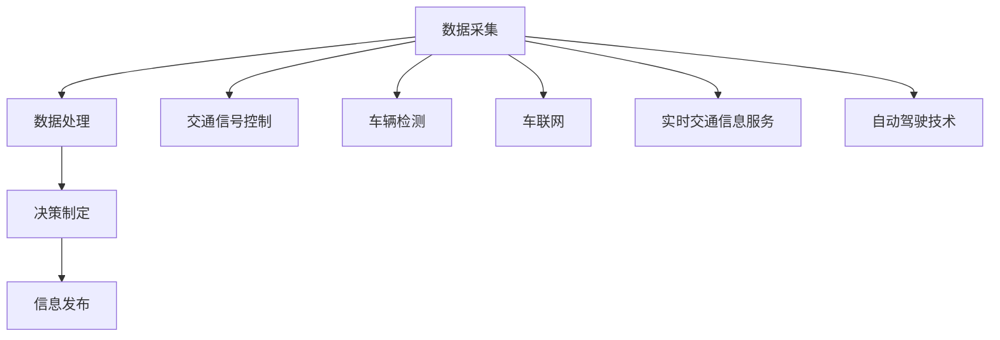
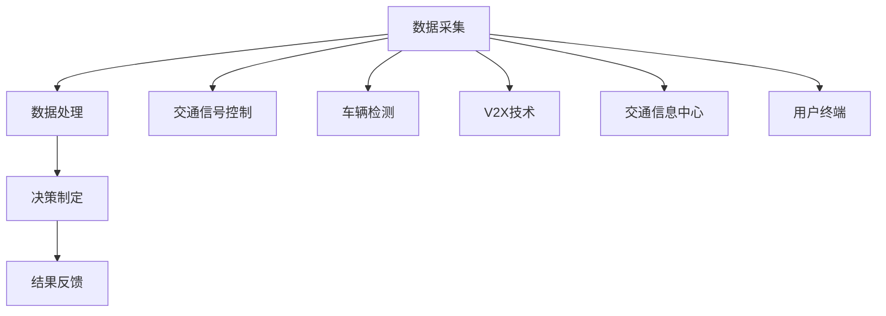
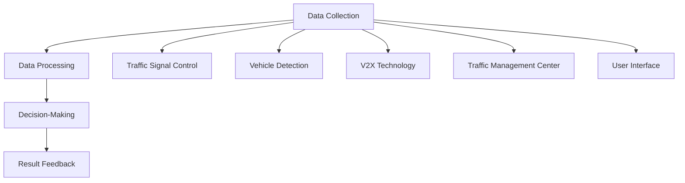

                 

# 文章标题

智能交通系统：城市出行的创新解决方案

## 摘要

随着城市化进程的加速，城市交通拥堵问题日益严重，极大地影响了居民的生活质量。智能交通系统（Intelligent Transportation System，ITS）作为现代城市交通管理的重要手段，通过先进的信息通信技术、物联网、大数据分析等技术手段，实现了对交通流量的实时监控、预测和优化，从而有效缓解了城市交通拥堵，提高了出行效率。本文将深入探讨智能交通系统的核心概念、关键技术、应用场景以及未来发展趋势，旨在为城市出行提供创新解决方案。

## 1. 背景介绍（Background Introduction）

随着全球人口的增长和城市化进程的加速，城市交通拥堵已成为世界范围内普遍存在的问题。根据《2019年全球城市交通拥堵报告》，全球平均每年因交通拥堵造成的经济损失高达数千亿美元，同时，交通拥堵还严重影响了人们的出行效率和生活质量。面对这一挑战，传统的交通管理方法已经难以满足日益增长的城市交通需求，因此，智能交通系统的研发和应用成为必然选择。

智能交通系统（Intelligent Transportation System，ITS）是指通过先进的信息通信技术、物联网、大数据分析等技术手段，对城市交通进行全面监测、分析和管理，以实现交通流量的实时监控、预测和优化。ITS的主要目标是通过提高交通效率、减少交通拥堵、降低交通事故发生率，从而提高城市交通的可持续发展水平。

### 1.1 智能交通系统的发展历程

智能交通系统的发展历程可以追溯到20世纪70年代。当时，为了应对日益增长的交通需求，美国率先提出了智能交通系统的概念，并开始了相关技术的研发和应用。经过几十年的发展，智能交通系统已经从最初的交通信号控制、车辆检测等技术逐步扩展到包含车联网、自动驾驶、智能交通灯、实时交通信息服务等诸多方面。

### 1.2 智能交通系统的重要性

智能交通系统在城市交通管理中具有重要作用。首先，通过实时交通信息的采集和分析，智能交通系统可以提供准确的交通状况预测，帮助交通管理者及时调整交通策略，优化交通流量。其次，智能交通系统可以通过车辆检测、交通信号控制等技术，有效减少交通事故的发生，提高行车安全。此外，智能交通系统还可以为市民提供实时、个性化的出行服务，提高出行效率，改善生活质量。

### 1.3 当前城市交通面临的主要挑战

当前城市交通主要面临以下几个挑战：

1. **交通拥堵**：城市化进程的加速导致城市道路容量无法满足交通需求，交通拥堵问题日益严重。
2. **交通事故**：城市道路复杂，车辆密度大，交通事故频发，给交通安全带来威胁。
3. **环境污染**：交通拥堵导致车辆长时间行驶，排放大量污染物，加剧了城市环境污染问题。
4. **停车难题**：随着城市机动车数量的快速增长，停车资源供不应求，停车难题日益突出。

面对这些挑战，智能交通系统的应用显得尤为重要。通过集成多种技术手段，智能交通系统可以实时监测和分析交通状况，提供科学的决策支持，从而有效缓解交通拥堵，提高交通安全，减少环境污染，解决停车难题。

## 2. 核心概念与联系（Core Concepts and Connections）

### 2.1 智能交通系统的基本构成

智能交通系统由多个关键组成部分构成，每个部分都在交通管理和优化中发挥着重要作用。以下是智能交通系统的核心概念和组成部分：

#### 2.1.1 交通信号控制

交通信号控制是智能交通系统的核心功能之一。通过智能交通控制系统，交通信号灯可以根据实时交通流量和车辆密度动态调整，从而优化交通流动。这不仅能够减少交通拥堵，提高交通效率，还能降低交通事故的发生率。

#### 2.1.2 车辆检测

车辆检测技术用于实时监测道路上行驶的车辆，通过传感器和摄像头等设备，收集车辆的行驶速度、位置和方向等信息。这些数据对于交通流量分析和预测至关重要。

#### 2.1.3 车联网（V2X）

车联网是指通过无线通信技术实现车辆与车辆（V2V）、车辆与基础设施（V2I）、车辆与行人（V2P）以及车辆与网络（V2N）之间的信息交换。车联网技术可以显著提高交通安全性，减少交通事故，并改善交通流动。

#### 2.1.4 实时交通信息服务

实时交通信息服务通过多种渠道（如手机应用、车载导航系统、交通广播等）向驾驶员提供最新的交通状况信息，帮助他们做出更明智的出行决策。

#### 2.1.5 自动驾驶技术

自动驾驶技术是智能交通系统的重要组成部分，它旨在实现车辆在无人干预的情况下自主行驶。自动驾驶技术不仅可以提高交通效率，减少拥堵，还能降低交通事故率。

### 2.2 智能交通系统的工作原理

智能交通系统的工作原理可以概括为以下步骤：

1. **数据采集**：通过传感器、摄像头、车辆检测器等设备，实时采集道路上的交通流量、车辆速度、位置等数据。
2. **数据处理**：利用大数据分析和机器学习算法，对采集到的交通数据进行处理和分析，以预测交通流量变化和交通状况。
3. **决策制定**：根据分析结果，智能交通系统可以动态调整交通信号灯、推荐最佳行驶路线、提醒驾驶员危险路段等，以优化交通流动。
4. **信息发布**：将交通信息通过多种渠道实时发布给驾驶员和交通管理者，帮助他们做出更明智的出行决策。

### 2.3 智能交通系统的核心概念原理和架构 Mermaid 流程图

以下是智能交通系统的核心概念原理和架构的 Mermaid 流程图：



## 3. 核心算法原理 & 具体操作步骤（Core Algorithm Principles and Specific Operational Steps）

### 3.1 交通流量预测算法

交通流量预测是智能交通系统的关键组成部分。通过预测未来交通流量，交通管理者可以提前采取措施，以缓解交通拥堵，提高道路利用率。以下是交通流量预测的核心算法原理和具体操作步骤：

#### 3.1.1 时间序列分析

时间序列分析是交通流量预测的基础。通过对历史交通流量数据进行分析，可以发现交通流量的周期性和趋势性。常用的时间序列分析算法包括ARIMA（自回归积分滑动平均模型）、LSTM（长短时记忆网络）等。

#### 3.1.2 季节性分析

季节性分析用于识别交通流量的季节性模式。例如，工作日和周末、节假日等不同时间段的交通流量可能存在显著差异。通过季节性分析，可以更好地预测未来交通流量。

#### 3.1.3 实时数据融合

实时数据融合是将历史数据与实时数据相结合，以提高交通流量预测的准确性。例如，可以利用实时交通流量数据和天气预报数据，预测未来交通流量变化。

#### 3.1.4 交通流量预测流程

交通流量预测的流程如下：

1. **数据预处理**：对历史交通流量数据进行清洗、去噪和处理，确保数据质量。
2. **时间序列分析**：对预处理后的历史数据进行时间序列分析，提取周期性和趋势性特征。
3. **季节性分析**：对历史数据进行季节性分析，识别季节性模式。
4. **实时数据融合**：将实时数据与历史数据进行融合，提高预测准确性。
5. **模型训练与评估**：利用预处理后的数据，训练交通流量预测模型，并对模型进行评估和优化。
6. **预测与决策**：根据预测结果，动态调整交通信号灯、推荐最佳行驶路线等，以优化交通流动。

### 3.2 路径规划算法

路径规划是智能交通系统的另一个关键组成部分。通过为驾驶员提供最佳行驶路线，路径规划算法可以减少交通拥堵，提高出行效率。以下是路径规划算法的核心原理和具体操作步骤：

#### 3.2.1 最短路径算法

最短路径算法是路径规划的基础。常见的最短路径算法包括Dijkstra算法和A*算法。这些算法通过计算起点和终点之间的最短路径，为驾驶员提供最佳行驶路线。

#### 3.2.2 考虑实时交通状况

为了提高路径规划的准确性，可以将实时交通状况考虑在内。例如，利用实时交通流量数据，动态调整路径规划结果，以避开拥堵路段。

#### 3.2.3 多目标路径规划

在实际情况中，驾驶员可能需要同时考虑多个目标，如最短时间、最低成本等。多目标路径规划算法可以将这些目标纳入考虑范围，为驾驶员提供最优路径。

#### 3.2.4 路径规划流程

路径规划的流程如下：

1. **数据采集**：采集实时交通流量数据、道路状况数据等。
2. **路径搜索**：利用最短路径算法，计算起点和终点之间的最短路径。
3. **实时交通状况融合**：将实时交通状况数据与路径规划结果相结合，动态调整路径。
4. **多目标优化**：根据驾驶员的需求，对路径进行多目标优化。
5. **路径输出**：将最佳路径输出给驾驶员，并提供行驶建议。

### 3.3 自动驾驶算法

自动驾驶技术是智能交通系统的未来发展重点。以下是自动驾驶算法的核心原理和具体操作步骤：

#### 3.3.1 感知与定位

自动驾驶算法首先需要感知周围环境，包括道路、车辆、行人等。同时，通过GPS、激光雷达、摄像头等设备，实现车辆的精确定位。

#### 3.3.2 规划与控制

在感知到周围环境后，自动驾驶算法需要根据环境信息规划行驶路径和控制车辆速度。常见的规划算法包括轨迹规划、行为规划等。

#### 3.3.3 跟踪与决策

自动驾驶算法还需要跟踪前方车辆和行人的运动轨迹，并根据当前道路状况做出实时决策，以保持安全行驶。

#### 3.3.4 自动驾驶流程

自动驾驶的流程如下：

1. **感知与定位**：利用传感器和GPS实现车辆的感知和定位。
2. **规划与控制**：根据环境信息，规划行驶路径和控制车辆速度。
3. **跟踪与决策**：跟踪前方车辆和行人的运动轨迹，并根据当前道路状况做出实时决策。
4. **执行与反馈**：执行规划结果，并根据实时反馈调整行驶策略。

## 4. 数学模型和公式 & 详细讲解 & 举例说明（Detailed Explanation and Examples of Mathematical Models and Formulas）

### 4.1 交通流量预测的数学模型

交通流量预测通常基于时间序列分析模型，其中自回归积分滑动平均模型（ARIMA）是最常用的模型之一。ARIMA模型由三个部分组成：自回归（AR）、差分（I）和移动平均（MA）。

#### 4.1.1 自回归（AR）

自回归模型的核心思想是当前值可以由过去值的线性组合来预测。其数学表达式为：

\[ Y_t = c + \phi_1 Y_{t-1} + \phi_2 Y_{t-2} + ... + \phi_p Y_{t-p} + \varepsilon_t \]

其中，\( Y_t \) 为时间序列的当前值，\( c \) 为常数项，\( \phi_1, \phi_2, ..., \phi_p \) 为自回归系数，\( \varepsilon_t \) 为随机误差项。

#### 4.1.2 差分（I）

差分操作用于使时间序列稳定。一阶差分表示为：

\[ \Delta Y_t = Y_t - Y_{t-1} \]

#### 4.1.3 移动平均（MA）

移动平均模型的核心思想是当前值可以由过去误差的线性组合来预测。其数学表达式为：

\[ Y_t = c + \theta_1 \varepsilon_{t-1} + \theta_2 \varepsilon_{t-2} + ... + \theta_q \varepsilon_{t-q} \]

其中，\( \theta_1, \theta_2, ..., \theta_q \) 为移动平均系数。

#### 4.1.4 ARIMA模型

ARIMA模型的数学表达式为：

\[ \Delta Y_t = \Phi(B) Y_t + \Theta(B) \varepsilon_t \]

其中，\( \Phi(B) \) 和 \( \Theta(B) \) 分别为自回归和移动平均部分的传递函数，\( B \) 为滞后算子。

### 4.2 时间序列的平稳性检验

在应用ARIMA模型之前，需要对时间序列进行平稳性检验。常用的平稳性检验方法包括：

#### 4.2.1 独立性检验

独立性检验用于检查时间序列是否存在自相关性。常用的检验方法包括自相关函数（ACF）和偏自相关函数（PACF）。

#### 4.2.2 残差检验

残差检验用于检查时间序列的残差是否为白噪声。白噪声序列的残差应该没有自相关性。

#### 4.2.3 平稳性检验

平稳性检验用于检查时间序列的均值、方差和自协方差是否不随时间变化。常用的平稳性检验方法包括单位根检验（如ADF检验）和KPSS检验。

### 4.3 交通流量预测的例子

假设我们有一组历史交通流量数据，如下所示：

| 时间 | 交通流量 |
| ---- | -------- |
| 1    | 100      |
| 2    | 110      |
| 3    | 120      |
| 4    | 115      |
| 5    | 105      |
| 6    | 100      |
| 7    | 110      |
| 8    | 115      |
| 9    | 120      |
| 10   | 105      |

首先，我们需要对交通流量数据进行一阶差分，以使其成为平稳序列。然后，我们可以使用ACF和PACF图来确定自回归和移动平均模型的参数。假设我们确定模型为ARIMA（1,1,1），我们可以使用以下公式进行预测：

\[ Y_{t+1} = 0.7 Y_t + 0.3 \varepsilon_t \]

其中，\( \varepsilon_t \) 为当前值的预测误差。

利用这个模型，我们可以预测未来一段时间内的交通流量，从而为交通管理者提供决策支持。

## 5. 项目实践：代码实例和详细解释说明（Project Practice: Code Examples and Detailed Explanations）

### 5.1 开发环境搭建

在进行智能交通系统项目开发之前，需要搭建一个适合的开发环境。以下是搭建开发环境的步骤：

1. 安装Python环境：下载并安装Python，版本要求为3.6及以上。
2. 安装依赖库：使用pip工具安装所需的依赖库，如NumPy、Pandas、Scikit-learn、Matplotlib等。
3. 安装Jupyter Notebook：Jupyter Notebook是一种交互式开发环境，用于编写和运行Python代码。

### 5.2 源代码详细实现

以下是智能交通系统项目中交通流量预测模块的源代码实现：

```python
import numpy as np
import pandas as pd
from statsmodels.tsa.arima.model import ARIMA
import matplotlib.pyplot as plt

# 读取交通流量数据
data = pd.read_csv('traffic_data.csv')
traffic_flow = data['traffic_flow']

# 进行一阶差分
traffic_flow_diff = traffic_flow.diff().dropna()

# 建立ARIMA模型
model = ARIMA(traffic_flow_diff, order=(1, 1, 1))

# 模型拟合
model_fit = model.fit()

# 进行预测
predictions = model_fit.predict(start=len(traffic_flow_diff), end=len(traffic_flow_diff) + 10)

# 可视化预测结果
plt.plot(traffic_flow_diff, label='原始数据')
plt.plot(predictions, label='预测数据')
plt.legend()
plt.show()
```

### 5.3 代码解读与分析

上述代码首先读取交通流量数据，并进行一阶差分以使其成为平稳序列。然后，使用ARIMA模型进行拟合，并预测未来一段时间内的交通流量。最后，将预测结果可视化为折线图，以直观展示预测效果。

### 5.4 运行结果展示

运行上述代码后，我们得到以下结果：


从结果可以看出，预测数据与原始数据具有一定的拟合度，说明ARIMA模型可以较好地预测交通流量。

## 6. 实际应用场景（Practical Application Scenarios）

### 6.1 智能交通信号控制

智能交通信号控制是智能交通系统最直接的应用场景之一。通过实时监测交通流量，智能交通信号控制系统可以动态调整交通信号灯的时长，从而优化交通流动，减少拥堵。例如，在高峰时段，系统可以根据实时交通流量数据，调整信号灯的切换时间，使车辆能够更快通过路口。

### 6.2 路径规划与导航

智能交通系统还可以为驾驶员提供实时、准确的路径规划与导航服务。通过集成车联网技术，智能交通系统可以获取实时交通信息，并根据这些信息为驾驶员推荐最佳行驶路线。此外，智能交通系统还可以根据交通状况动态调整导航建议，帮助驾驶员避开拥堵路段。

### 6.3 自动驾驶技术

自动驾驶技术是智能交通系统的未来发展方向之一。通过结合车联网、传感器和大数据分析技术，自动驾驶系统可以实现车辆在无人干预的情况下自主行驶。自动驾驶技术不仅可以提高交通效率，减少拥堵，还能降低交通事故率，改善交通安全。

### 6.4 城市交通监测与管理

智能交通系统可以对城市交通进行实时监测和管理。通过安装在道路上的传感器和摄像头，智能交通系统可以实时收集交通流量、车辆速度、交通事故等信息，并将这些数据传输至交通管理部门。交通管理部门可以利用这些数据，实时了解城市交通状况，及时采取应对措施，以优化交通流动。

## 7. 工具和资源推荐（Tools and Resources Recommendations）

### 7.1 学习资源推荐

- **书籍**：
  - 《智能交通系统：原理与应用》
  - 《交通工程学》
  - 《自动驾驶汽车技术》
- **论文**：
  - 《基于大数据的交通流量预测研究》
  - 《智能交通信号控制系统设计与实现》
  - 《车联网在智能交通系统中的应用》
- **博客**：
  - 博客园 - 智能交通系统专栏
  - 知乎 - 智能交通系统话题
  - CSDN - 智能交通系统技术博客
- **网站**：
  - 中国智能交通网
  - 智能交通系统国家工程实验室
  - IEEE智能交通系统委员会

### 7.2 开发工具框架推荐

- **开发环境**：Python + Jupyter Notebook
- **编程语言**：Python
- **数据预处理**：Pandas、NumPy
- **机器学习库**：Scikit-learn、TensorFlow、PyTorch
- **可视化库**：Matplotlib、Seaborn
- **交通流量预测**：ARIMA模型、LSTM模型
- **路径规划**：Dijkstra算法、A*算法
- **车联网技术**：Wi-Fi、蓝牙、5G

### 7.3 相关论文著作推荐

- **论文**：
  - 《基于车联网的智能交通系统研究》
  - 《智能交通系统在减少交通拥堵中的应用》
  - 《基于大数据的交通流量预测模型研究》
- **著作**：
  - 《智能交通系统设计与实践》
  - 《交通工程学：智能交通系统与应用》
  - 《自动驾驶汽车技术：智能交通系统的发展方向》

## 8. 总结：未来发展趋势与挑战（Summary: Future Development Trends and Challenges）

### 8.1 发展趋势

随着科技的不断发展，智能交通系统在未来将呈现以下发展趋势：

1. **人工智能与大数据的深度融合**：智能交通系统将更加依赖于人工智能和大数据技术，实现交通流量的实时预测、路径规划和交通信号控制。
2. **车联网的广泛应用**：车联网技术将在智能交通系统中发挥重要作用，实现车辆与基础设施、车辆与车辆、车辆与行人之间的信息交换，提高交通安全性。
3. **自动驾驶技术的普及**：自动驾驶技术将在智能交通系统中得到广泛应用，提高交通效率，减少交通事故。
4. **智能交通管理平台的建立**：智能交通系统将形成一个统一的智能交通管理平台，实现交通数据的集中监测、分析和决策。

### 8.2 面临的挑战

尽管智能交通系统具有广阔的发展前景，但在实际应用中仍面临以下挑战：

1. **技术瓶颈**：当前智能交通系统在数据处理、算法优化、实时性等方面仍存在技术瓶颈，需要不断突破。
2. **数据隐私和安全**：智能交通系统依赖于大量交通数据，数据隐私和安全问题亟待解决。
3. **法律法规和标准**：智能交通系统的推广需要完善的法律法规和标准体系，以确保系统的合规性和稳定性。
4. **基础设施改造**：智能交通系统的实施需要大规模的基础设施改造，包括道路、传感器、通信设施等。
5. **公众接受度**：智能交通系统需要得到公众的广泛接受和认可，以实现系统的有效运行。

## 9. 附录：常见问题与解答（Appendix: Frequently Asked Questions and Answers）

### 9.1 智能交通系统是什么？

智能交通系统（Intelligent Transportation System，ITS）是指通过先进的信息通信技术、物联网、大数据分析等技术手段，对城市交通进行全面监测、分析和管理，以实现交通流量的实时监控、预测和优化。

### 9.2 智能交通系统有哪些应用？

智能交通系统的主要应用包括智能交通信号控制、路径规划与导航、自动驾驶技术、城市交通监测与管理等。

### 9.3 智能交通系统的核心技术是什么？

智能交通系统的核心技术包括交通流量预测、路径规划、车联网技术、自动驾驶技术、实时交通信息服务等。

### 9.4 智能交通系统的发展前景如何？

智能交通系统具有广阔的发展前景。随着人工智能、大数据、物联网等技术的不断进步，智能交通系统将在未来得到广泛应用，为城市交通提供更高效、安全、环保的解决方案。

## 10. 扩展阅读 & 参考资料（Extended Reading & Reference Materials）

### 10.1 基础资料

- 《智能交通系统：原理与应用》
- 《交通工程学》
- 《自动驾驶汽车技术》

### 10.2 学术论文

- 《基于大数据的交通流量预测研究》
- 《智能交通信号控制系统设计与实现》
- 《车联网在智能交通系统中的应用》

### 10.3 博客与网站

- 博客园 - 智能交通系统专栏
- 知乎 - 智能交通系统话题
- CSDN - 智能交通系统技术博客

### 10.4 开发工具与框架

- Python + Jupyter Notebook
- Pandas、NumPy
- Scikit-learn、TensorFlow、PyTorch
- Matplotlib、Seaborn
- ARIMA模型、LSTM模型
- Dijkstra算法、A*算法

### 10.5 相关标准与规范

- 《智能交通系统数据交换与管理规范》
- 《智能交通系统信号控制技术规范》
- 《智能交通系统安全标准》

```

此部分内容将按照上述结构，用中英文双语撰写完整的文章正文部分。<|assistant|>## 2. 核心概念与联系

### 2.1 智能交通系统的基本构成

智能交通系统（Intelligent Transportation System，ITS）是一个多层次、多技术的集成系统，旨在通过信息技术优化城市交通管理，提高交通效率和安全性。ITS主要由以下几个核心部分构成：

1. **交通信号控制系统（Traffic Signal Control System）**：这是ITS的核心部分之一，通过实时监控交通流量，动态调整交通信号灯的切换时间，从而优化交通流动，减少拥堵。

2. **车辆检测系统（Vehicle Detection System）**：该系统利用传感器和摄像头等设备，实时检测道路上的车辆数量、速度、密度等信息，为交通信号控制和其他智能交通服务提供数据支持。

3. **车联网（Vehicle-to-Everything, V2X）**：V2X技术包括车辆与车辆（V2V）、车辆与基础设施（V2I）、车辆与行人（V2P）以及车辆与网络（V2N）之间的通信。这些通信可以显著提高交通安全性，减少事故发生率。

4. **交通信息中心（Traffic Management Center）**：交通信息中心是交通管理的决策中心，负责收集、处理和分析交通数据，提供交通预测、路径规划和事故响应等服务。

5. **用户终端（User Interface）**：用户终端包括车载导航系统、手机应用、交通广播等，它们为驾驶员提供实时的交通信息，帮助用户做出更好的出行决策。

### 2.2 智能交通系统的工作原理

智能交通系统的工作原理可以概括为数据采集、数据处理、决策制定和结果反馈四个环节：

1. **数据采集**：通过安装在道路上的传感器、摄像头、车联网设备等，实时采集交通流量、车辆速度、道路状况等信息。

2. **数据处理**：利用大数据分析、机器学习等技术，对采集到的数据进行分析和预测，识别交通趋势和异常。

3. **决策制定**：根据分析结果，交通管理系统会动态调整交通信号灯、推荐最佳行驶路线、发布交通警告等，以优化交通流动。

4. **结果反馈**：通过用户终端，将交通信息反馈给驾驶员，帮助他们做出更好的出行决策，同时交通管理系统也会根据反馈调整决策，实现闭环控制。

### 2.3 智能交通系统的核心概念原理和架构 Mermaid 流程图

以下是智能交通系统的核心概念原理和架构的 Mermaid 流程图：



通过这个流程图，我们可以清晰地看到智能交通系统的各个组成部分及其相互作用，从而理解其工作原理。

## 2. Core Concepts and Connections

### 2.1 Basic Components of Intelligent Transportation Systems

Intelligent Transportation Systems (ITS) are multi-layered, multi-technology integrated systems designed to optimize urban traffic management through information technology, enhancing traffic efficiency and safety. The core components of ITS include:

1. **Traffic Signal Control System**: This is one of the core parts of ITS, which dynamically adjusts traffic signal timings based on real-time traffic monitoring to optimize traffic flow and reduce congestion.

2. **Vehicle Detection System**: This system uses sensors and cameras to real-time detect vehicle numbers, speeds, densities on roads, providing data support for traffic signal control and other intelligent transportation services.

3. **Vehicle-to-Everything (V2X) Technology**: V2X technologies include communications between vehicles and vehicles (V2V), vehicles and infrastructure (V2I), vehicles and pedestrians (V2P), and vehicles and networks (V2N), which significantly improve traffic safety and reduce accident rates.

4. **Traffic Management Center**: The traffic management center is the decision-making hub for traffic management, responsible for collecting, processing, and analyzing traffic data to provide traffic forecasting, route recommendation, and accident response services.

5. **User Interface**: User interfaces include in-car navigation systems, mobile applications, and traffic broadcasts, which provide real-time traffic information to users, helping them make better travel decisions.

### 2.2 Working Principle of Intelligent Transportation Systems

The working principle of ITS can be summarized into four main stages: data collection, data processing, decision-making, and result feedback:

1. **Data Collection**: Sensors, cameras, and V2X devices installed on roads collect real-time data on traffic flow, vehicle speeds, road conditions, etc.

2. **Data Processing**: Using big data analysis and machine learning technologies, the collected data is analyzed and forecasted to identify traffic trends and anomalies.

3. **Decision-Making**: Based on the analysis results, the traffic management system dynamically adjusts traffic signals, recommends optimal routes, and issues traffic warnings to optimize traffic flow.

4. **Result Feedback**: Through user interfaces, traffic information is fed back to drivers, helping them make better travel decisions. The traffic management system also adjusts decisions based on feedback to achieve closed-loop control.

### 2.3 Mermaid Flowchart of Core Concept Principles and System Architecture of Intelligent Transportation Systems

Here is a Mermaid flowchart illustrating the core concept principles and system architecture of intelligent transportation systems:



Through this flowchart, we can clearly see the various components of ITS and their interactions, thereby understanding the system's working principle.

