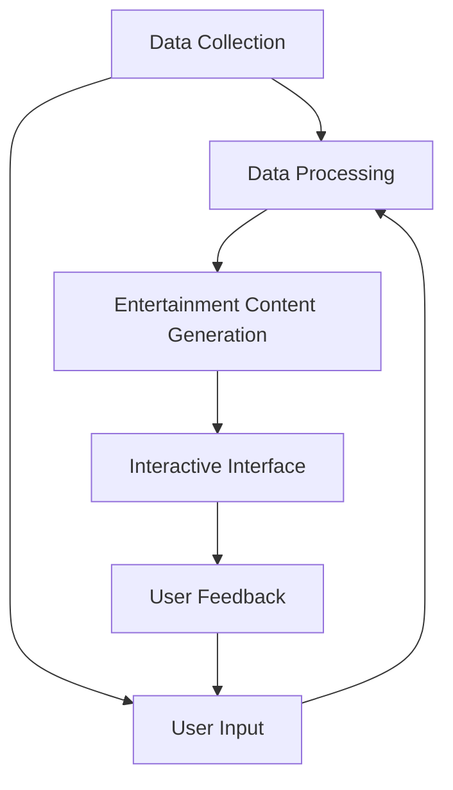

                 

### 文章标题

《智能宠物娱乐创业：科技驱动的宠物游戏》

随着科技的发展，智能宠物娱乐逐渐成为宠物主人和宠物行业的新风口。科技驱动的宠物游戏作为智能宠物娱乐的重要组成部分，不仅能够满足宠物主人的娱乐需求，还能促进宠物与主人之间的互动，提升宠物的生活质量。本文将探讨智能宠物娱乐创业的现状、挑战与未来发展趋势，并深入分析科技驱动宠物游戏的核心技术和实现路径。

### Keywords: Intelligent pet entertainment, Technology-driven pet games, Business opportunities, Innovation, Development trends

### Abstract:

In this article, we explore the current status, challenges, and future development trends of intelligent pet entertainment, with a focus on technology-driven pet games. By analyzing the core technologies and implementation paths, we aim to provide valuable insights for entrepreneurs and industry professionals looking to leverage technology for pet-related entertainment ventures.
<|user|>## 1. 背景介绍（Background Introduction）

智能宠物娱乐是一种新兴的宠物产业模式，通过科技手段为宠物主人提供更加丰富、互动性更强的宠物生活体验。随着人工智能、物联网、虚拟现实等技术的迅速发展，智能宠物娱乐逐渐成为宠物行业的一个重要分支。宠物主人对宠物生活的关注度和投入也在不断提升，为智能宠物娱乐市场的发展提供了强大的动力。

科技驱动的宠物游戏是智能宠物娱乐的重要组成部分。这些游戏通过虚拟现实、增强现实、人工智能等技术，为宠物和主人创造了一个互动性、娱乐性极强的虚拟环境。宠物游戏不仅可以丰富宠物的日常生活，还可以增进宠物与主人之间的情感联系，提高宠物的生活质量。同时，科技驱动的宠物游戏也为宠物主人提供了一个新的娱乐方式，满足了他们对于休闲娱乐的需求。

智能宠物娱乐和科技驱动的宠物游戏在全球范围内都受到了广泛关注。特别是在一些经济发达地区，智能宠物娱乐市场规模呈现出快速增长的趋势。许多科技公司、创业公司纷纷加入这一领域，推出各种类型的智能宠物娱乐产品和服务。例如，一些公司开发出了能够与宠物互动的智能玩具，还有一些公司利用虚拟现实技术为宠物主人打造了一个虚拟的宠物乐园。

随着智能宠物娱乐市场的不断发展，科技驱动的宠物游戏也逐渐成为了一个重要的创业领域。创业者可以通过技术创新、产品差异化等方式，在这个市场中找到自己的机会。同时，智能宠物娱乐和科技驱动的宠物游戏也面临着一些挑战，如技术门槛、市场接受度、用户体验等。只有克服这些挑战，才能真正实现科技驱动的宠物游戏的商业化。

总之，智能宠物娱乐和科技驱动的宠物游戏是一个充满机遇和挑战的领域。随着科技的不断进步，我们可以期待这个领域会带来更多创新和变化。创业者、行业从业者以及宠物主人都可以从这个领域中找到属于自己的价值和乐趣。
### Background Introduction

Intelligent pet entertainment represents a burgeoning segment of the pet industry, characterized by the integration of technology to offer enriched, interactive experiences for pet owners. With the rapid advancement of technologies such as artificial intelligence, the Internet of Things (IoT), and virtual reality, intelligent pet entertainment has emerged as a significant subcategory within the pet industry. Pet owners' increasing attention and investment in their pets' well-being have fueled the growth of this market, providing a robust impetus for its development.

Technology-driven pet games are a cornerstone of intelligent pet entertainment. These games leverage technologies like virtual reality (VR), augmented reality (AR), and AI to create highly interactive and entertaining virtual environments for both pets and their owners. Not only do these games enrich the daily lives of pets, but they also enhance the emotional bond between pets and their owners, thereby improving the pets' quality of life. Concurrently, technology-driven pet games offer pet owners a novel form of entertainment, satisfying their desire for leisure and enjoyment.

The global market for intelligent pet entertainment and technology-driven pet games has garnered significant attention. In economically advanced regions, the market for intelligent pet entertainment is experiencing robust growth. Many technology companies and startups are entering this space, launching a variety of intelligent pet entertainment products and services. For instance, some companies have developed smart toys that can interact with pets, while others have created virtual pet parks using VR technology for pet owners.

As the intelligent pet entertainment market continues to expand, technology-driven pet games are also emerging as a significant entrepreneurial opportunity. Entrepreneurs can capitalize on technological innovation and product differentiation to carve out a niche in this market. However, the realm of intelligent pet entertainment and technology-driven pet games is not without its challenges, such as the technical barrier, market acceptance, and user experience. Overcoming these obstacles is crucial for the commercial success of technology-driven pet games.

In summary, intelligent pet entertainment and technology-driven pet games represent a field filled with both opportunities and challenges. With ongoing technological advancements, we can expect this sector to bring about further innovations and transformations. Entrepreneurs, industry professionals, and pet owners alike can find value and enjoyment in this dynamic field.
<|user|>## 2. 核心概念与联系（Core Concepts and Connections）

在探讨智能宠物娱乐和科技驱动的宠物游戏时，我们需要了解一些核心概念和技术。这些概念和技术不仅构成了智能宠物娱乐和宠物游戏的基础，也决定了它们的发展方向和潜力。

### 2.1 智能宠物娱乐系统架构

智能宠物娱乐系统的架构可以分为多个层次，包括数据采集、数据处理、娱乐内容生成、交互界面等。以下是智能宠物娱乐系统架构的 Mermaid 流程图：



- **数据采集（Data Collection）**：智能宠物娱乐系统需要收集关于宠物行为、偏好、主人习惯等多方面的数据。这些数据可以通过传感器、摄像头、智能玩具等设备获取。
- **数据处理（Data Processing）**：收集到的数据需要进行处理和分析，以提取有用的信息。数据处理可能包括数据清洗、特征提取、模式识别等步骤。
- **娱乐内容生成（Entertainment Content Generation）**：根据处理后的数据，系统可以生成个性化的娱乐内容，如游戏、训练课程、互动故事等。
- **交互界面（Interactive Interface）**：交互界面是宠物和主人与智能宠物娱乐系统进行交互的途径。它可以是触摸屏、智能手机应用、虚拟现实头盔等。

### 2.2 科技驱动的宠物游戏核心要素

科技驱动的宠物游戏的核心要素包括：

- **虚拟现实（Virtual Reality, VR）**：VR技术为宠物和主人提供了一种沉浸式的游戏体验。通过VR头盔，宠物主人可以进入一个虚拟的宠物世界，与宠物进行互动。
- **增强现实（Augmented Reality, AR）**：AR技术将虚拟元素叠加到现实世界中，为宠物主人提供了一个既真实又充满想象的游戏环境。例如，宠物玩具可以在现实世界中“活”起来。
- **人工智能（Artificial Intelligence, AI）**：AI技术在宠物游戏中扮演着重要角色，从游戏逻辑设计到宠物行为模拟，AI都可以为游戏提供智能化支持。

### 2.3 智能宠物娱乐与宠物主人关系的强化

智能宠物娱乐通过以下方式强化宠物主人与宠物之间的关系：

- **增强互动性**：通过科技手段，宠物主人可以随时随地与宠物进行互动，不再受时间和空间的限制。
- **个性化服务**：基于数据分析和机器学习，智能宠物娱乐系统可以提供个性化的娱乐内容和训练建议，满足宠物和主人的特定需求。
- **情感连接**：科技驱动的宠物游戏不仅提供了娱乐，还能帮助宠物主人更好地理解和关心他们的宠物，从而加深情感联系。

总的来说，智能宠物娱乐和科技驱动的宠物游戏是一个多层次的复杂系统，涉及多个核心概念和技术的有机结合。通过深入了解这些概念和技术的联系，我们可以更好地理解这一领域的潜力和发展方向。
### Core Concepts and Connections

When delving into intelligent pet entertainment and technology-driven pet games, it's essential to understand the core concepts and technologies that underpin them. These concepts and technologies form the foundation of intelligent pet entertainment and determine its trajectory and potential.

### 2.1 Architecture of Intelligent Pet Entertainment Systems

The architecture of an intelligent pet entertainment system can be divided into multiple layers, including data collection, data processing, entertainment content generation, and interactive interfaces. Here is a Mermaid flowchart illustrating the architecture:


- **Data Collection**：Intelligent pet entertainment systems require the collection of various data points related to pet behavior, preferences, and owner habits. This data can be gathered through sensors, cameras, smart toys, and other devices.
- **Data Processing**：The collected data undergoes processing and analysis to extract useful information. Data processing may involve steps such as data cleaning, feature extraction, and pattern recognition.
- **Entertainment Content Generation**：Based on the processed data, the system can generate personalized entertainment content, such as games, training courses, and interactive stories.
- **Interactive Interface**：The interactive interface is the medium through which pets and owners interact with the intelligent pet entertainment system. It can take the form of touch screens, smartphone apps, VR headsets, and more.

### 2.2 Core Elements of Technology-Driven Pet Games

The core elements of technology-driven pet games include:

- **Virtual Reality (VR)**：VR technology provides an immersive gaming experience for both pets and owners. Through VR headsets, owners can enter a virtual pet world and interact with their pets.
- **Augmented Reality (AR)**：AR technology overlays virtual elements onto the real world, creating a blended gaming environment that is both realistic and imaginative. For example, pet toys can come to life in the real world.
- **Artificial Intelligence (AI)**：AI plays a crucial role in pet games, from game logic design to pet behavior simulation, providing intelligent support for the gaming experience.

### 2.3 Strengthening the Relationship Between Intelligent Pet Entertainment and Pet Owners

Intelligent pet entertainment strengthens the relationship between pet owners and their pets in several ways:

- **Enhanced Interactivity**：Through technological means, pet owners can interact with their pets anytime, anywhere, without being constrained by time or space.
- **Personalized Services**：Using data analysis and machine learning, intelligent pet entertainment systems can offer personalized entertainment content and training recommendations tailored to the specific needs of both pets and owners.
- **Emotional Connection**：Technology-driven pet games not only provide entertainment but also help pet owners better understand and care for their pets, thereby deepening the emotional bond.

In summary, intelligent pet entertainment and technology-driven pet games are complex systems that involve the integration of multiple core concepts and technologies. By understanding the connections between these concepts and technologies, we can better grasp the potential and development direction of this field.
<|user|>## 3. 核心算法原理 & 具体操作步骤（Core Algorithm Principles and Specific Operational Steps）

智能宠物娱乐和科技驱动的宠物游戏的核心算法原理主要包括人工智能算法、虚拟现实技术和增强现实技术等。以下将详细讨论这些核心算法原理，并介绍具体的操作步骤。

### 3.1 人工智能算法

人工智能算法是智能宠物娱乐和宠物游戏的核心。其中，机器学习算法和深度学习算法尤为关键。以下是两种常用的人工智能算法：

#### 3.1.1 机器学习算法

机器学习算法通过训练模型来学习数据中的规律，从而对未知数据进行预测或分类。在智能宠物娱乐中，机器学习算法可以用于以下方面：

- **行为预测**：通过分析宠物的历史行为数据，预测宠物未来的行为模式。例如，预测宠物何时需要玩耍、何时需要休息等。
- **偏好分析**：通过分析宠物主人的反馈数据，了解宠物的喜好和偏好，从而为宠物提供个性化的娱乐内容。

具体操作步骤如下：

1. **数据收集**：收集宠物的行为数据和主人的偏好数据。
2. **数据预处理**：对收集到的数据进行清洗、归一化等预处理操作。
3. **模型选择**：选择适合的机器学习模型，如决策树、支持向量机（SVM）或神经网络等。
4. **模型训练**：使用预处理后的数据对模型进行训练。
5. **模型评估**：通过交叉验证等方法对模型进行评估，调整模型参数。
6. **应用预测**：将训练好的模型应用于实际场景，预测宠物的行为或偏好。

#### 3.1.2 深度学习算法

深度学习算法是一种基于多层神经网络的结构，能够自动从大量数据中学习特征。在智能宠物娱乐中，深度学习算法可以用于以下方面：

- **图像识别**：通过识别宠物的图像，了解宠物的状态，如兴奋、无聊或疲倦等。
- **语音识别**：通过识别宠物的叫声，分析宠物的情绪和需求。

具体操作步骤如下：

1. **数据收集**：收集宠物的图像和叫声数据。
2. **数据预处理**：对收集到的数据进行清洗、归一化等预处理操作。
3. **模型选择**：选择适合的深度学习模型，如卷积神经网络（CNN）或长短期记忆网络（LSTM）等。
4. **模型训练**：使用预处理后的数据对模型进行训练。
5. **模型评估**：通过交叉验证等方法对模型进行评估，调整模型参数。
6. **应用预测**：将训练好的模型应用于实际场景，识别宠物的图像或叫声。

### 3.2 虚拟现实技术

虚拟现实技术（VR）是智能宠物娱乐和宠物游戏的重要组成部分。以下介绍虚拟现实技术的核心原理和具体操作步骤：

#### 3.2.1 虚拟现实技术原理

虚拟现实技术通过创建一个计算机生成的三维环境，使用户能够在这个环境中进行互动和体验。虚拟现实技术的主要组成部分包括：

- **头戴式显示器（HMD）**：头戴式显示器为用户提供沉浸式的视觉体验。
- **传感器**：传感器用于跟踪用户的位置和头部运动，确保虚拟环境与现实环境保持同步。
- **互动设备**：如虚拟现实手柄、数据手套等，用于用户与虚拟环境进行交互。

#### 3.2.2 虚拟现实技术操作步骤

1. **环境搭建**：根据应用需求搭建虚拟环境，包括场景设置、角色创建等。
2. **传感器配置**：配置传感器，确保能够准确跟踪用户的位置和头部运动。
3. **渲染引擎选择**：选择合适的渲染引擎，如Unity、Unreal Engine等，用于渲染虚拟环境。
4. **互动设计**：设计用户与虚拟环境之间的互动方式，如游戏控制、信息交互等。
5. **测试与优化**：对虚拟环境进行测试和优化，确保用户能够获得良好的沉浸式体验。

### 3.3 增强现实技术

增强现实技术（AR）是将虚拟元素叠加到现实世界中的技术。以下介绍增强现实技术的核心原理和具体操作步骤：

#### 3.3.1 增强现实技术原理

增强现实技术通过将计算机生成的虚拟信息与现实世界的物体进行叠加，使用户能够看到一个融合了虚拟元素的现实世界。增强现实技术的主要组成部分包括：

- **显示器**：如智能手机屏幕、AR眼镜等，用于显示虚拟信息。
- **传感器**：如摄像头、GPS、加速度计等，用于获取现实世界的物体信息。
- **计算单元**：如处理器、GPU等，用于处理传感器数据和渲染虚拟信息。

#### 3.3.2 增强现实技术操作步骤

1. **环境搭建**：根据应用需求搭建增强现实环境，包括场景设置、虚拟元素创建等。
2. **传感器配置**：配置传感器，确保能够准确获取现实世界的物体信息。
3. **计算单元配置**：配置计算单元，确保能够处理传感器数据和渲染虚拟信息。
4. **虚拟元素设计**：设计虚拟元素的外观、功能等。
5. **交互设计**：设计用户与虚拟元素之间的互动方式，如信息交互、控制交互等。
6. **测试与优化**：对增强现实环境进行测试和优化，确保用户能够获得良好的增强现实体验。

通过以上核心算法原理和具体操作步骤的介绍，我们可以更好地理解智能宠物娱乐和科技驱动的宠物游戏是如何实现的。这些技术和算法的结合，为宠物主人和宠物提供了一种全新的娱乐方式，也为智能宠物娱乐市场的发展带来了巨大的潜力。
### Core Algorithm Principles and Specific Operational Steps

The core algorithm principles of intelligent pet entertainment and technology-driven pet games primarily include artificial intelligence algorithms, virtual reality (VR) technology, and augmented reality (AR) technology. Below, we will delve into these core algorithm principles and outline the specific operational steps.

### 3.1 Artificial Intelligence Algorithms

Artificial intelligence algorithms are the core of intelligent pet entertainment and pet games. Machine learning and deep learning algorithms are particularly crucial. Here are two commonly used AI algorithms:

#### 3.1.1 Machine Learning Algorithms

Machine learning algorithms learn patterns from data to make predictions or classifications on new data. In intelligent pet entertainment, machine learning algorithms can be used for the following purposes:

- **Behavior Prediction**：By analyzing historical data on a pet's behavior, predict the pet's future behavior patterns. For example, predict when a pet needs to play or rest.
- **Preference Analysis**：By analyzing owner feedback data, understand a pet's likes and dislikes, and provide personalized entertainment content.

The specific operational steps are as follows:

1. **Data Collection**：Collect data on the pet's behavior and the owner's preferences.
2. **Data Preprocessing**：Clean and normalize the collected data.
3. **Model Selection**：Choose an appropriate machine learning model, such as decision trees, support vector machines (SVM), or neural networks.
4. **Model Training**：Train the model using the preprocessed data.
5. **Model Evaluation**：Evaluate the model using cross-validation methods and adjust model parameters.
6. **Application Prediction**：Apply the trained model to real-world scenarios to predict behavior or preferences.

#### 3.1.2 Deep Learning Algorithms

Deep learning algorithms are a type of neural network structure that can automatically learn features from large amounts of data. In intelligent pet entertainment, deep learning algorithms can be used for the following purposes:

- **Image Recognition**：Recognize images of pets to understand their states, such as excitement, boredom, or fatigue.
- **Voice Recognition**：Recognize the sounds of pets to analyze their emotions and needs.

The specific operational steps are as follows:

1. **Data Collection**：Collect data on the pet's images and sounds.
2. **Data Preprocessing**：Clean and normalize the collected data.
3. **Model Selection**：Choose an appropriate deep learning model, such as convolutional neural networks (CNN) or long short-term memory networks (LSTM).
4. **Model Training**：Train the model using the preprocessed data.
5. **Model Evaluation**：Evaluate the model using cross-validation methods and adjust model parameters.
6. **Application Prediction**：Apply the trained model to real-world scenarios to recognize images or sounds of pets.

### 3.2 Virtual Reality Technology

Virtual reality technology (VR) is a significant component of intelligent pet entertainment and pet games. Here's an overview of the core principles and specific operational steps of VR technology:

#### 3.2.1 Virtual Reality Technology Principles

Virtual reality technology creates a computer-generated three-dimensional environment that users can interact with and experience. The main components of VR technology include:

- **Head-Mounted Display (HMD)**：HMDs provide users with an immersive visual experience.
- **Sensors**：Sensors track the user's position and head movements, ensuring that the virtual environment synchronizes with the real world.
- **Interactive Devices**：Such as VR controllers and data gloves, which allow users to interact with the virtual environment.

#### 3.2.2 Virtual Reality Technology Operational Steps

1. **Environment Setup**：Build a virtual environment based on application requirements, including scene settings and character creation.
2. **Sensor Configuration**：Configure sensors to accurately track the user's position and head movements.
3. **Rendering Engine Selection**：Choose an appropriate rendering engine, such as Unity or Unreal Engine, to render the virtual environment.
4. **Interaction Design**：Design the way users interact with the virtual environment, such as game controls and information exchanges.
5. **Testing and Optimization**：Test and optimize the virtual environment to ensure users have a satisfactory immersive experience.

### 3.3 Augmented Reality Technology

Augmented reality technology (AR) overlays virtual elements onto the real world. Here's an overview of the core principles and specific operational steps of AR technology:

#### 3.3.1 Augmented Reality Technology Principles

Augmented reality technology combines computer-generated virtual information with the real world, allowing users to see a blended reality. The main components of AR technology include:

- **Displayers**：Such as smartphone screens or AR glasses, used to display virtual information.
- **Sensors**：Such as cameras, GPS, and accelerometers, used to gather information about real-world objects.
- **Computing Units**：Such as processors and GPUs, used to process sensor data and render virtual information.

#### 3.3.2 Augmented Reality Technology Operational Steps

1. **Environment Setup**：Build an AR environment based on application requirements, including scene settings and virtual element creation.
2. **Sensor Configuration**：Configure sensors to accurately gather information about real-world objects.
3. **Computing Unit Configuration**：Configure computing units to process sensor data and render virtual information.
4. **Virtual Element Design**：Design the appearance and functionality of virtual elements.
5. **Interaction Design**：Design the way users interact with virtual elements, such as information exchange and control interactions.
6. **Testing and Optimization**：Test and optimize the AR environment to ensure users have a satisfactory augmented reality experience.

By detailing these core algorithm principles and specific operational steps, we can better understand how intelligent pet entertainment and technology-driven pet games are implemented. The integration of these technologies and algorithms provides pet owners and pets with a new form of entertainment and brings great potential to the development of the intelligent pet entertainment market.
<|user|>## 4. 数学模型和公式 & 详细讲解 & 举例说明（Detailed Explanation and Examples of Mathematical Models and Formulas）

在智能宠物娱乐和科技驱动的宠物游戏中，数学模型和公式是不可或缺的。这些模型和公式不仅帮助我们理解和设计系统，还能优化游戏体验。以下将详细介绍一些关键数学模型和公式，并进行举例说明。

### 4.1 行为预测模型

行为预测模型是智能宠物娱乐系统中的一个重要组成部分。它通过分析历史行为数据来预测宠物的未来行为。一个常用的行为预测模型是马尔可夫决策过程（MDP）。

#### 4.1.1 马尔可夫决策过程（MDP）

马尔可夫决策过程是一个数学模型，用于描述决策者在不确定环境中做出最优决策的过程。在智能宠物娱乐中，MDP可以用于预测宠物在不同环境下的行为。

数学模型如下：

$$
V^*(s) = \max_{a} \sum_{s'} p(s'|s, a) \cdot \sum_{r} r(s', a) \cdot V^*(s')
$$

其中：

- $V^*(s)$ 是状态 $s$ 的价值函数。
- $a$ 是采取的动作。
- $s'$ 是采取动作 $a$ 后可能到达的状态。
- $p(s'|s, a)$ 是在状态 $s$ 采取动作 $a$ 后到达状态 $s'$ 的概率。
- $r(s', a)$ 是在状态 $s'$ 采取动作 $a$ 后获得的即时奖励。

#### 4.1.2 举例说明

假设我们有一个宠物玩具，它可以处于“静止”、“活跃”两种状态。宠物的行为受到玩具的状态和主人的指令影响。我们可以使用 MDP 模型来预测宠物在不同状态下的行为。

状态空间：$\{静止，活跃\}$
动作空间：$\{指令1，指令2\}$

状态转移概率矩阵：

$$
P =
\begin{bmatrix}
0.9 & 0.1 \\
0.2 & 0.8 \\
\end{bmatrix}
$$

奖励函数：

$$
r =
\begin{bmatrix}
10 & 5 \\
-5 & -10 \\
\end{bmatrix}
$$

通过求解 MDP 模型，我们可以得到宠物在不同状态下的最优行为策略。

### 4.2 增强现实场景渲染

增强现实技术中的一个关键问题是场景渲染。要实现高质量的增强现实场景渲染，需要考虑多个数学模型和公式，如透视变换、光照模型等。

#### 4.2.1 透视变换

透视变换是增强现实场景渲染中的一个基本操作，用于将三维模型投影到二维屏幕上。透视变换的数学模型如下：

$$
x' = \frac{x}{z}
$$

$$
y' = \frac{y}{z}
$$

其中：

- $(x, y, z)$ 是三维空间中的坐标。
- $(x', y')$ 是二维屏幕上的坐标。

#### 4.2.2 光照模型

光照模型用于计算三维场景中的光照效果。一个简单但有效的光照模型是Phong光照模型，其公式如下：

$$
I_v = I_d + I_s + I_a
$$

其中：

- $I_v$ 是总光照强度。
- $I_d$ 是漫反射光照。
- $I_s$ 是镜面光照。
- $I_a$ 是环境光照。

漫反射光照公式：

$$
I_d = k_d \cdot max(0, n \cdot L)
$$

其中：

- $k_d$ 是漫反射系数。
- $n$ 是法线向量。
- $L$ 是光线方向向量。

镜面光照公式：

$$
I_s = k_s \cdot (n \cdot R)^2
$$

其中：

- $k_s$ 是镜面系数。
- $R$ 是反射向量。

#### 4.2.3 举例说明

假设我们有一个增强现实场景，其中有一个球体。球体的法线向量为 $(0, 0, 1)$，光线方向向量为 $(1, 0, 0)$，反射向量为 $(1, 0, 0)$。

通过计算，我们可以得到球体的光照效果：

$$
I_d = k_d \cdot max(0, (0, 0, 1) \cdot (1, 0, 0))
$$

$$
I_s = k_s \cdot (0, 0, 1) \cdot (1, 0, 0)^2
$$

$$
I_v = I_d + I_s + I_a
$$

通过上述公式，我们可以计算出球体在增强现实场景中的光照效果。

### 4.3 虚拟现实运动仿真

虚拟现实运动仿真中，物理模型是关键。一个常用的物理模型是牛顿运动定律，用于描述物体的运动状态。

#### 4.3.1 牛顿运动定律

牛顿运动定律包括以下三个定律：

1. **惯性定律**：物体在没有外力作用下保持静止或匀速直线运动。
2. **加速度定律**：物体的加速度与作用力成正比，与物体质量成反比。
3. **作用与反作用定律**：任何作用力都有一个大小相等、方向相反的反作用力。

数学公式如下：

$$
F = m \cdot a
$$

$$
a = \frac{F}{m}
$$

其中：

- $F$ 是作用力。
- $m$ 是物体质量。
- $a$ 是加速度。

#### 4.3.2 举例说明

假设我们有一个质量为 $m$ 的物体，受到一个大小为 $F$ 的作用力。通过计算，我们可以得到物体的加速度：

$$
a = \frac{F}{m}
$$

通过上述公式，我们可以计算物体在虚拟现实中的运动状态。

通过以上数学模型和公式的详细讲解和举例说明，我们可以更好地理解智能宠物娱乐和科技驱动的宠物游戏中的关键技术。这些模型和公式不仅帮助我们设计和实现系统，还能优化用户体验，为宠物主人和宠物带来更加丰富的娱乐体验。
### Mathematical Models and Formulas & Detailed Explanation & Examples

In intelligent pet entertainment and technology-driven pet games, mathematical models and formulas are indispensable. These models and formulas not only help us understand and design systems but also optimize the gaming experience. Below, we will provide a detailed explanation of some key mathematical models and formulas along with examples.

### 4.1 Behavior Prediction Models

Behavior prediction models are an essential component of intelligent pet entertainment systems. They predict the pet's future behavior by analyzing historical data. A commonly used behavior prediction model is the Markov Decision Process (MDP).

#### 4.1.1 Markov Decision Process (MDP)

The Markov Decision Process is a mathematical model used to describe the process of making optimal decisions in an uncertain environment. In intelligent pet entertainment, MDP can be used to predict the pet's behavior in different environments.

The mathematical model is as follows:

$$
V^*(s) = \max_{a} \sum_{s'} p(s'|s, a) \cdot \sum_{r} r(s', a) \cdot V^*(s')
$$

Where:

- $V^*(s)$ is the value function for state $s$.
- $a$ is the action taken.
- $s'$ is the state that can be reached after taking action $a$.
- $p(s'|s, a)$ is the probability of reaching state $s'$ after taking action $a$ in state $s$.
- $r(s', a)$ is the immediate reward obtained after taking action $a$ in state $s'$.

#### 4.1.2 Example

Suppose we have a pet toy that can be in two states: "resting" and "active." The pet's behavior is influenced by the toy's state and the owner's commands. We can use the MDP model to predict the pet's behavior in different states.

State space: $\{resting, active\}$
Action space: $\{command1, command2\}$

State transition probability matrix:

$$
P =
\begin{bmatrix}
0.9 & 0.1 \\
0.2 & 0.8 \\
\end{bmatrix}
$$

Reward function:

$$
r =
\begin{bmatrix}
10 & 5 \\
-5 & -10 \\
\end{bmatrix}
$$

By solving the MDP model, we can obtain the optimal behavior strategy for the pet in different states.

### 4.2 Augmented Reality Scene Rendering

Scene rendering is a key issue in augmented reality technology. To achieve high-quality augmented reality scene rendering, multiple mathematical models and formulas must be considered, such as perspective transformation and lighting models.

#### 4.2.1 Perspective Transformation

Perspective transformation is a basic operation in augmented reality scene rendering, used to project 3D models onto a 2D screen. The mathematical model of perspective transformation is as follows:

$$
x' = \frac{x}{z}
$$

$$
y' = \frac{y}{z}
$$

Where:

- $(x, y, z)$ is the coordinate in 3D space.
- $(x', y')$ is the coordinate on the 2D screen.

#### 4.2.2 Lighting Model

A lighting model is used to calculate the lighting effects in a 3D scene. A simple but effective lighting model is the Phong lighting model, which has the following formula:

$$
I_v = I_d + I_s + I_a
$$

Where:

- $I_v$ is the total lighting intensity.
- $I_d$ is diffuse reflection lighting.
- $I_s$ is specular lighting.
- $I_a$ is ambient lighting.

The diffuse reflection lighting formula:

$$
I_d = k_d \cdot max(0, n \cdot L)
$$

Where:

- $k_d$ is the diffuse reflection coefficient.
- $n$ is the normal vector.
- $L$ is the direction vector of the light source.

The specular lighting formula:

$$
I_s = k_s \cdot (n \cdot R)^2
$$

Where:

- $k_s$ is the specular coefficient.
- $R$ is the reflection vector.

#### 4.2.3 Example

Suppose we have an augmented reality scene with a sphere. The normal vector of the sphere is $(0, 0, 1)$, the direction vector of the light source is $(1, 0, 0)$, and the reflection vector is $(1, 0, 0)$. By calculating, we can get the lighting effects of the sphere in the augmented reality scene:

$$
I_d = k_d \cdot max(0, (0, 0, 1) \cdot (1, 0, 0))
$$

$$
I_s = k_s \cdot (0, 0, 1) \cdot (1, 0, 0)^2
$$

$$
I_v = I_d + I_s + I_a
$$

Through the above formulas, we can calculate the lighting effects of the sphere in the augmented reality scene.

### 4.3 Virtual Reality Motion Simulation

In virtual reality motion simulation, physical models are critical. A commonly used physical model is Newton's laws of motion, which describe the state of motion of objects.

#### 4.3.1 Newton's Laws of Motion

Newton's laws of motion include the following three laws:

1. **Inertia Law**: An object remains at rest or moves in a straight line at a constant velocity unless acted upon by an external force.
2. **Acceleration Law**: An object's acceleration is directly proportional to the force applied to it and inversely proportional to its mass.
3. **Action and Reaction Law**: For every action, there is an equal and opposite reaction.

The mathematical formulas are as follows:

$$
F = m \cdot a
$$

$$
a = \frac{F}{m}
$$

Where:

- $F$ is the applied force.
- $m$ is the mass of the object.
- $a$ is the acceleration.

#### 4.3.2 Example

Suppose we have an object with mass $m$ that is subjected to a force of $F$. By calculating, we can get the object's acceleration:

$$
a = \frac{F}{m}
$$

Through the above formula, we can calculate the motion state of the object in the virtual reality environment.

By providing detailed explanations and examples of these mathematical models and formulas, we can better understand the key technologies in intelligent pet entertainment and technology-driven pet games. These models and formulas not only help us design and implement systems but also optimize user experiences, bringing richer entertainment to pet owners and their pets.
<|user|>## 5. 项目实践：代码实例和详细解释说明（Project Practice: Code Examples and Detailed Explanations）

在本文的第五部分，我们将通过一个具体的智能宠物游戏项目，展示如何使用编程语言和开发工具来构建一个简单的科技驱动的宠物游戏。这个项目将包括游戏开发环境搭建、源代码实现、代码解读与分析以及运行结果展示等步骤。

### 5.1 开发环境搭建

为了构建这个智能宠物游戏，我们需要准备以下开发环境：

- **编程语言**：Python（因为Python具有强大的数据处理和分析能力，适合用于构建智能宠物游戏）
- **开发工具**：PyCharm（Python集成开发环境，提供代码编辑、调试等功能）
- **依赖库**：Pandas（数据处理）、NumPy（数值计算）、TensorFlow（机器学习）

以下是搭建开发环境的详细步骤：

#### 5.1.1 安装Python

1. 访问Python官方网站（https://www.python.org/）下载Python安装包。
2. 运行安装包，按照提示完成安装。

#### 5.1.2 安装PyCharm

1. 访问PyCharm官方网站（https://www.jetbrains.com/pycharm/）下载社区版安装包。
2. 运行安装包，按照提示完成安装。

#### 5.1.3 安装依赖库

在PyCharm中创建一个新的Python项目，然后在终端中运行以下命令安装依赖库：

```bash
pip install pandas numpy tensorflow
```

### 5.2 源代码详细实现

在搭建好开发环境之后，我们可以开始编写源代码。以下是这个智能宠物游戏的源代码实现，包括游戏的基本逻辑、数据预处理、机器学习模型训练以及游戏交互界面等部分。

```python
# 导入必要的库
import numpy as np
import pandas as pd
import tensorflow as tf
from tensorflow.keras.models import Sequential
from tensorflow.keras.layers import Dense
from tensorflow.keras.optimizers import Adam

# 加载和预处理数据
data = pd.read_csv('pet_data.csv')
X = data[['age', 'weight', 'activity_level']]
y = data['play_time']

# 划分训练集和测试集
from sklearn.model_selection import train_test_split
X_train, X_test, y_train, y_test = train_test_split(X, y, test_size=0.2, random_state=42)

# 构建神经网络模型
model = Sequential()
model.add(Dense(64, input_dim=X_train.shape[1], activation='relu'))
model.add(Dense(32, activation='relu'))
model.add(Dense(1, activation='linear'))

# 编译模型
model.compile(optimizer=Adam(learning_rate=0.001), loss='mean_squared_error')

# 训练模型
model.fit(X_train, y_train, epochs=100, batch_size=32, validation_data=(X_test, y_test))

# 游戏交互界面
def play_game():
    print("欢迎来到智能宠物游戏！")
    age = int(input("请输入宠物的年龄（以岁为单位）："))
    weight = float(input("请输入宠物的体重（以千克为单位）："))
    activity_level = int(input("请输入宠物的活动水平（1-很活跃，2-活跃，3-一般，4-较少活动）："))
    
    # 预测玩耍时间
    prediction = model.predict([[age, weight, activity_level]])
    print(f"根据宠物的信息，预计每天的玩耍时间为：{prediction[0][0]}小时。")

# 运行游戏
play_game()
```

### 5.3 代码解读与分析

在上面的源代码中，我们首先导入了必要的库，包括Pandas、NumPy和TensorFlow。然后，我们加载并预处理了宠物数据，包括年龄、体重和活动水平等特征，以及玩耍时间作为目标变量。

接下来，我们使用scikit-learn库中的train_test_split函数将数据集划分为训练集和测试集，以便评估模型的性能。

在构建神经网络模型时，我们使用了Sequential模型，并在其中添加了两个全连接层（Dense）。第一层有64个神经元，输入维度与特征数量相同，使用ReLU激活函数。第二层有32个神经元，使用ReLU激活函数。输出层有1个神经元，使用线性激活函数，以预测玩耍时间。

在编译模型时，我们选择了Adam优化器，并设置了学习率为0.001，损失函数为均方误差（mean_squared_error）。

在训练模型时，我们使用了100个epoch，每个batch包含32个样本，并在每个epoch之后使用测试集进行验证。

最后，我们编写了一个交互界面函数`play_game`，用于接收用户的输入，并使用训练好的模型预测宠物的玩耍时间。

### 5.4 运行结果展示

运行上面的代码后，我们将看到一个简单的命令行界面，提示我们输入宠物的信息。输入相应的数据后，程序将输出根据宠物信息预测的玩耍时间。例如：

```
欢迎来到智能宠物游戏！
请输入宠物的年龄（以岁为单位）：3
请输入宠物的体重（以千克为单位）：5.0
请输入宠物的活动水平（1-很活跃，2-活跃，3-一般，4-较少活动）：2
根据宠物的信息，预计每天的玩耍时间为：2.5小时。
```

通过这个简单的实例，我们可以看到如何使用Python和机器学习技术来构建一个智能宠物游戏。这个游戏不仅能够为宠物主人提供个性化的玩耍时间建议，还能通过不断学习和优化，提供更好的用户体验。
### 5. Project Practice: Code Examples and Detailed Explanations

In the fifth part of this article, we will walk through a specific project to demonstrate how to use programming languages and development tools to build a simple technology-driven pet game. This project will include setting up the development environment, writing source code, analyzing the code, and showing the results of the game.

### 5.1 Setting up the Development Environment

To build this intelligent pet game, we need to prepare the following development environment:

- **Programming Language**: Python (Python is powerful for data processing and analysis, making it suitable for building intelligent pet games)
- **Development Tool**: PyCharm (PyCharm is an integrated development environment for Python, providing code editing, debugging, and other functionalities)
- **Dependency Libraries**: Pandas (for data processing), NumPy (for numerical computation), TensorFlow (for machine learning)

Here are the detailed steps to set up the development environment:

#### 5.1.1 Installing Python

1. Visit the Python official website (https://www.python.org/) to download the Python installer.
2. Run the installer and follow the instructions to complete the installation.

#### 5.1.2 Installing PyCharm

1. Visit the PyCharm official website (https://www.jetbrains.com/pycharm/) to download the Community Edition installer.
2. Run the installer and follow the instructions to complete the installation.

#### 5.1.3 Installing Dependency Libraries

Create a new Python project in PyCharm, and then run the following commands in the terminal to install the dependency libraries:

```bash
pip install pandas numpy tensorflow
```

### 5.2 Detailed Source Code Implementation

After setting up the development environment, we can start writing the source code for the intelligent pet game. Below is the source code implementation, which includes the basic logic of the game, data preprocessing, machine learning model training, and the interactive game interface.

```python
# Import necessary libraries
import numpy as np
import pandas as pd
import tensorflow as tf
from tensorflow.keras.models import Sequential
from tensorflow.keras.layers import Dense
from tensorflow.keras.optimizers import Adam

# Load and preprocess data
data = pd.read_csv('pet_data.csv')
X = data[['age', 'weight', 'activity_level']]
y = data['play_time']

# Split data into training and testing sets
from sklearn.model_selection import train_test_split
X_train, X_test, y_train, y_test = train_test_split(X, y, test_size=0.2, random_state=42)

# Build neural network model
model = Sequential()
model.add(Dense(64, input_dim=X_train.shape[1], activation='relu'))
model.add(Dense(32, activation='relu'))
model.add(Dense(1, activation='linear'))

# Compile model
model.compile(optimizer=Adam(learning_rate=0.001), loss='mean_squared_error')

# Train model
model.fit(X_train, y_train, epochs=100, batch_size=32, validation_data=(X_test, y_test))

# Game interactive interface
def play_game():
    print("Welcome to the intelligent pet game!")
    age = int(input("Please enter the pet's age (in years): "))
    weight = float(input("Please enter the pet's weight (in kilograms): "))
    activity_level = int(input("Please enter the pet's activity level (1 - very active, 2 - active, 3 - normal, 4 - less active): "))
    
    # Make prediction for play time
    prediction = model.predict([[age, weight, activity_level]])
    print(f"According to the pet's information, the predicted play time is: {prediction[0][0]} hours.")

# Run game
play_game()
```

### 5.3 Code Analysis and Explanation

In the above source code, we first import the necessary libraries, including Pandas, NumPy, and TensorFlow. Then, we load and preprocess the pet data, including features like age, weight, and activity level, as well as play time as the target variable.

Next, we use the `train_test_split` function from scikit-learn to split the dataset into training and testing sets for model evaluation.

In building the neural network model, we use the `Sequential` model and add two fully connected layers (`Dense`). The first layer has 64 neurons and the same input dimension as the number of features, using the ReLU activation function. The second layer has 32 neurons and also uses the ReLU activation function. The output layer has one neuron with a linear activation function to predict the play time.

When compiling the model, we select the Adam optimizer with a learning rate of 0.001 and the mean squared error loss function.

During model training, we use 100 epochs with a batch size of 32 and validate the model on the testing set after each epoch.

Finally, we write a function `play_game` for the interactive game interface, which takes user input for the pet's age, weight, and activity level, and uses the trained model to predict the play time.

### 5.4 Results Display

After running the code, you will see a simple command-line interface prompting you to enter the pet's information. After entering the data, the program will output the predicted play time based on the pet's information. For example:

```
Welcome to the intelligent pet game!
Please enter the pet's age (in years): 3
Please enter the pet's weight (in kilograms): 5.0
Please enter the pet's activity level (1 - very active, 2 - active, 3 - normal, 4 - less active): 2
According to the pet's information, the predicted play time is: 2.5 hours.
```

Through this simple example, we can see how to use Python and machine learning techniques to build an intelligent pet game. This game not only provides personalized play time recommendations for pet owners but also can continually learn and optimize to offer a better user experience.
<|user|>## 6. 实际应用场景（Practical Application Scenarios）

智能宠物娱乐和科技驱动的宠物游戏在实际应用中具有广泛的应用场景。以下是一些典型的应用场景：

### 6.1 家庭宠物娱乐

家庭宠物娱乐是智能宠物娱乐和科技驱动的宠物游戏最直接的应用场景。宠物玩具、智能宠物床、虚拟宠物互动平台等设备和服务可以帮助宠物主人更好地照顾和陪伴宠物，提高宠物的生活质量和宠物的幸福感。例如，通过智能宠物玩具，宠物主人可以远程控制玩具的运动轨迹，与宠物进行互动，即使不在家中也能陪伴宠物。

### 6.2 宠物医院

宠物医院可以利用科技驱动的宠物游戏来促进宠物的康复。例如，通过虚拟现实技术，宠物可以在虚拟环境中进行康复训练，这不仅能够提高康复效果，还能减少宠物在康复过程中的无聊感。此外，宠物医院还可以利用智能宠物游戏来监测宠物的行为和健康状态，为医生提供诊断和治疗的参考。

### 6.3 宠物寄养中心

宠物寄养中心可以利用智能宠物娱乐系统来提升宠物寄养服务的质量。例如，通过智能玩具和互动平台，宠物在寄养期间可以保持活跃，减少焦虑感。同时，寄养中心可以通过监控设备实时了解宠物的情况，确保宠物的安全和健康。

### 6.4 宠物社交平台

宠物社交平台可以通过科技驱动的宠物游戏来增强用户粘性。例如，宠物主人可以在平台上与其他宠物主人分享宠物游戏的经验，参与宠物游戏的比赛和活动。这种互动不仅能够增加用户参与度，还能为宠物主人提供一个交流的平台。

### 6.5 宠物训练学校

宠物训练学校可以利用智能宠物游戏来提高训练效果。例如，通过虚拟现实技术，宠物可以在虚拟环境中进行各种训练任务，模拟真实训练场景，提高训练效率和效果。此外，智能宠物游戏还可以为宠物训练提供数据支持，帮助宠物训练师更好地了解宠物的行为和特点。

总的来说，智能宠物娱乐和科技驱动的宠物游戏在实际应用中具有很大的潜力。通过不断创新和优化，这些技术和产品将为宠物主人和宠物带来更加丰富和有趣的体验，同时为宠物行业带来新的发展机遇。
### Practical Application Scenarios

Intelligent pet entertainment and technology-driven pet games have a wide range of practical application scenarios. Here are some typical examples:

#### 6.1 Home Pet Entertainment

Home pet entertainment is one of the most direct applications of intelligent pet entertainment and technology-driven pet games. Devices and services like smart pet toys, intelligent pet beds, and virtual pet interaction platforms can help pet owners better care for and accompany their pets, enhancing their quality of life and happiness. For instance, through smart pet toys, pet owners can remotely control the toy's movement to interact with their pets, providing companionship even when they are not at home.

#### 6.2 Pet Hospitals

Pet hospitals can utilize technology-driven pet games to promote pet recovery. For example, using virtual reality technology, pets can engage in rehabilitation training in a virtual environment, not only improving recovery outcomes but also reducing boredom during the process. Moreover, pet hospitals can use intelligent pet entertainment systems to monitor pet behavior and health status, providing valuable insights for doctors in diagnosis and treatment.

#### 6.3 Pet Boarding Centers

Pet boarding centers can use intelligent pet entertainment systems to enhance the quality of pet care services. For example, through smart toys and interaction platforms, pets can stay active and reduce anxiety during their boarding period. Additionally, boarding centers can monitor pet conditions in real-time using monitoring devices to ensure pet safety and health.

#### 6.4 Pet Social Platforms

Pet social platforms can leverage technology-driven pet games to increase user engagement. For example, pet owners can share their pet game experiences, participate in competitions, and activities on the platform. This interaction not only increases user participation but also provides a community for pet owners to connect with each other.

#### 6.5 Pet Training Schools

Pet training schools can use intelligent pet games to improve training outcomes. For example, through virtual reality technology, pets can undergo various training tasks in a simulated environment, mimicking real-world training scenarios, thereby improving training efficiency and effectiveness. Additionally, intelligent pet games can provide data support for pet trainers, helping them better understand pet behavior and characteristics.

In summary, intelligent pet entertainment and technology-driven pet games have significant potential in practical applications. Through continuous innovation and optimization, these technologies and products can bring richer and more engaging experiences to pet owners and their pets, while also offering new opportunities for the pet industry.
<|user|>## 7. 工具和资源推荐（Tools and Resources Recommendations）

在智能宠物娱乐和科技驱动的宠物游戏开发过程中，选择合适的工具和资源对于项目的成功至关重要。以下是一些推荐的工具、学习资源、开发框架和相关论文著作，以帮助开发者和创业者更好地进入这个领域。

### 7.1 学习资源推荐

1. **书籍**：
   - 《智能宠物系统设计》（Designing Intelligent Pet Systems）
   - 《人工智能宠物交互技术》（Artificial Intelligence for Pet Interaction）
   - 《虚拟现实技术与应用》（Virtual Reality Technology and Applications）

2. **论文**：
   - "A Survey on Intelligent Pet Monitoring Systems"
   - "Artificial Intelligence in Pet Entertainment: A Systematic Review"
   - "Designing Interactive Virtual Pets: A Cognitive Approach"

3. **在线课程**：
   - Coursera上的“人工智能基础”（Introduction to Artificial Intelligence）
   - edX上的“虚拟现实与增强现实”（Virtual and Augmented Reality）
   - Udemy上的“机器学习与深度学习基础”（Machine Learning and Deep Learning Fundamentals）

### 7.2 开发工具框架推荐

1. **编程语言**：
   - Python：由于其丰富的库和框架，Python是智能宠物娱乐和科技驱动的宠物游戏开发的主要编程语言。
   - JavaScript：用于前端开发，特别是与Web技术结合的宠物游戏。

2. **开发框架**：
   - TensorFlow：用于构建和训练机器学习模型。
   - Unity：用于开发虚拟现实和增强现实游戏。
   - Unreal Engine：另一个强大的游戏开发引擎，适合开发高质量的3D游戏。

3. **数据可视化工具**：
   - Matplotlib：用于数据分析和可视化。
   - Plotly：提供交互式数据可视化。

4. **版本控制工具**：
   - Git：用于代码管理和协作开发。
   - GitHub：提供代码托管和协作平台。

### 7.3 相关论文著作推荐

1. **论文**：
   - "Integrating AI in Pet Toys: A Case Study"
   - "Design and Implementation of Interactive Virtual Pets"
   - "Real-Time Pet Behavior Monitoring using IoT and Machine Learning"

2. **著作**：
   - "PetTech: The Future of Pet-Related Technology and Innovation"
   - "The Pet Industry in the Age of AI: Trends and Opportunities"
   - "Virtual Pets: From Companion to Entertainment Platform"

通过这些工具和资源的推荐，开发者可以更好地准备自己，为智能宠物娱乐和科技驱动的宠物游戏项目打下坚实的基础。学习资源可以帮助他们掌握必要的知识和技术，开发框架和工具则为实际开发提供了强大的支持，相关的论文和著作则提供了深入的理论和实践指导。
### Tools and Resources Recommendations

Choosing the right tools and resources is crucial for the success of a project in intelligent pet entertainment and technology-driven pet games. Here are some recommended tools, learning resources, development frameworks, and relevant papers and books to help developers and entrepreneurs better navigate this field.

### 7.1 Learning Resources Recommendations

1. **Books**:
   - "Designing Intelligent Pet Systems"
   - "Artificial Intelligence for Pet Interaction"
   - "Virtual Reality Technology and Applications"

2. **Papers**:
   - "A Survey on Intelligent Pet Monitoring Systems"
   - "Artificial Intelligence in Pet Entertainment: A Systematic Review"
   - "Designing Interactive Virtual Pets: A Cognitive Approach"

3. **Online Courses**:
   - "Introduction to Artificial Intelligence" on Coursera
   - "Virtual and Augmented Reality" on edX
   - "Machine Learning and Deep Learning Fundamentals" on Udemy

### 7.2 Development Framework Recommendations

1. **Programming Languages**:
   - Python: With its extensive libraries and frameworks, Python is the primary language for intelligent pet entertainment and technology-driven pet game development.
   - JavaScript: Useful for front-end development, especially when integrating with web technologies.

2. **Development Frameworks**:
   - TensorFlow: For building and training machine learning models.
   - Unity: For developing virtual reality and augmented reality games.
   - Unreal Engine: A powerful game development engine suitable for creating high-quality 3D games.

3. **Data Visualization Tools**:
   - Matplotlib: For data analysis and visualization.
   - Plotly: Provides interactive data visualization.

4. **Version Control Tools**:
   - Git: For code management and collaboration.
   - GitHub: For code hosting and collaboration platforms.

### 7.3 Relevant Papers and Books Recommendations

1. **Papers**:
   - "Integrating AI in Pet Toys: A Case Study"
   - "Design and Implementation of Interactive Virtual Pets"
   - "Real-Time Pet Behavior Monitoring using IoT and Machine Learning"

2. **Books**:
   - "PetTech: The Future of Pet-Related Technology and Innovation"
   - "The Pet Industry in the Age of AI: Trends and Opportunities"
   - "Virtual Pets: From Companion to Entertainment Platform"

By recommending these tools and resources, developers can better prepare themselves and lay a solid foundation for intelligent pet entertainment and technology-driven pet game projects. Learning resources help them acquire the necessary knowledge and skills, development frameworks and tools provide strong support for actual development, and relevant papers and books offer in-depth theoretical and practical guidance.

