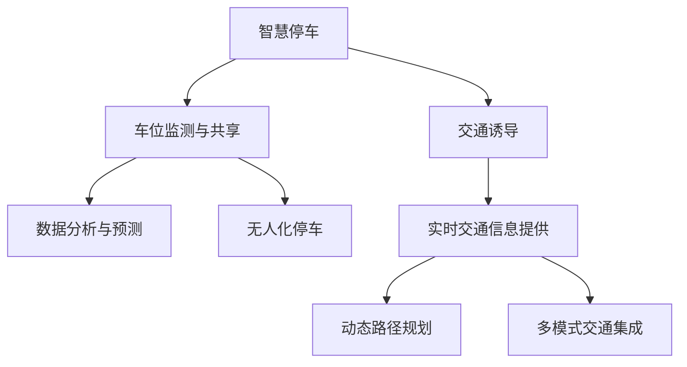

                 

# 未来的智能交通：2050年的智慧停车与交通诱导

关键词：智能交通、智慧停车、交通诱导、2050年、未来发展趋势

摘要：本文深入探讨了2050年智能交通领域可能的发展趋势，特别是智慧停车和交通诱导技术的创新与实施。通过详细分析现有技术挑战和未来可能的技术突破，本文旨在提供一个全面的视角，揭示未来智能交通系统的蓝图。

## 1. 背景介绍（Background Introduction）

### 1.1 当前智能交通的挑战

当前，智能交通系统（ITS）正逐步在全球范围内推广应用。然而，随着车辆数量的急剧增加，交通拥堵、停车难题和环境污染等问题日益严重。这些挑战促使我们不断探索更加智能化、高效的交通解决方案。

### 1.2 未来智能交通的需求

未来，随着城市化进程的加快和技术的飞速发展，人们对于智能交通的需求将更加多样化和个性化。智慧停车和交通诱导作为其中的重要组成部分，需要具备高效性、实时性和便捷性。

### 1.3 2050年的智能交通愿景

2050年，我们期望看到一个全面智能化的交通系统，其中智慧停车和交通诱导技术已经实现了全面普及。这一愿景将极大地提高交通效率，改善生活质量，并减少环境污染。

## 2. 核心概念与联系（Core Concepts and Connections）

### 2.1 智慧停车

智慧停车是指利用物联网、大数据和人工智能技术，实现停车资源的智能管理和优化配置。核心概念包括：

- **车位监测与共享**：通过传感器和物联网技术，实时监测停车位的占用情况，实现车位共享。
- **数据分析与预测**：利用大数据分析用户停车行为，预测未来停车需求，优化停车资源配置。
- **无人化停车**：通过自动化设备，实现无人化停车操作，提高停车效率。

### 2.2 交通诱导

交通诱导是指通过实时交通信息提供和路径规划，引导车辆避开拥堵路段，提高交通流动效率。核心概念包括：

- **实时交通信息提供**：通过交通监控系统和传感器网络，实时采集交通流量、车速等信息。
- **动态路径规划**：基于实时交通信息，为驾驶员提供最佳行驶路线。
- **多模式交通集成**：整合公共交通、非机动交通等多种交通模式，提供多元化的出行选择。

### 2.3 智慧停车与交通诱导的联系

智慧停车与交通诱导是相辅相成的。智慧停车系统通过提供实时的停车信息，帮助驾驶员找到最近的停车位，从而缓解交通压力。而交通诱导系统则通过实时交通信息，引导车辆避开拥堵，进一步优化交通流动。

### 2.4 Mermaid 流程图



## 3. 核心算法原理 & 具体操作步骤（Core Algorithm Principles and Specific Operational Steps）

### 3.1 智慧停车算法原理

智慧停车算法主要分为以下三个步骤：

- **数据采集**：通过传感器和物联网设备，实时采集停车位的占用情况、车辆行驶速度等信息。
- **数据处理**：利用大数据分析技术，对采集到的数据进行处理和分析，提取有效信息。
- **决策与优化**：根据处理后的数据，进行停车位的分配、停车费用的计算以及停车诱导。

### 3.2 智慧停车操作步骤

- **步骤1**：安装传感器和物联网设备，实现停车数据的实时采集。
- **步骤2**：搭建大数据分析平台，对采集到的数据进行分析和处理。
- **步骤3**：根据分析结果，进行停车位的分配和停车费用的计算。
- **步骤4**：通过交通诱导系统，实时更新停车信息，为驾驶员提供最佳停车路线。

### 3.3 交通诱导算法原理

交通诱导算法主要分为以下三个步骤：

- **数据采集**：通过交通监控系统和传感器网络，实时采集交通流量、车速、路况等信息。
- **数据处理**：利用大数据分析技术，对采集到的数据进行处理和分析，提取有效信息。
- **决策与优化**：根据处理后的数据，进行交通路径的规划和诱导。

### 3.4 交通诱导操作步骤

- **步骤1**：安装交通监控系统和传感器网络，实现交通数据的实时采集。
- **步骤2**：搭建大数据分析平台，对采集到的数据进行分析和处理。
- **步骤3**：根据分析结果，实时更新交通信息，为驾驶员提供最佳行驶路线。
- **步骤4**：通过交通诱导屏幕、手机APP等渠道，实时向驾驶员提供交通信息。

## 4. 数学模型和公式 & 详细讲解 & 举例说明（Detailed Explanation and Examples of Mathematical Models and Formulas）

### 4.1 智慧停车数学模型

智慧停车系统的核心是优化停车位的分配，以最大化停车效率。以下是常用的数学模型：

- **线性规划模型**：

$$
\begin{aligned}
\text{目标函数：} & \quad \max Z = \sum_{i=1}^{m} c_i x_i \\
\text{约束条件：} & \quad \sum_{i=1}^{m} a_{ij} x_i \leq b_j, \quad j=1,2,...,n \\
& \quad x_i \geq 0, \quad i=1,2,...,m
\end{aligned}
$$

其中，$x_i$ 表示第 $i$ 个停车位的占用情况，$c_i$ 表示第 $i$ 个停车位的费用，$a_{ij}$ 表示第 $i$ 个停车位与第 $j$ 个交通节点的关联度，$b_j$ 表示第 $j$ 个交通节点的停车需求。

### 4.2 交通诱导数学模型

交通诱导系统的核心是优化行驶路线，以最大化交通效率。以下是常用的数学模型：

- **多目标规划模型**：

$$
\begin{aligned}
\text{目标函数：} & \quad \min F(x,y) = \sum_{i=1}^{n} w_i f_i(x,y) \\
\text{约束条件：} & \quad g_i(x,y) \leq 0, \quad i=1,2,...,m \\
& \quad h_j(x,y) = 0, \quad j=1,2,...,p
\end{aligned}
$$

其中，$f_i(x,y)$ 表示第 $i$ 个交通指标的权重，$w_i$ 表示第 $i$ 个交通指标的权重，$g_i(x,y)$ 表示第 $i$ 个约束条件，$h_j(x,y)$ 表示第 $j$ 个等式约束条件。

### 4.3 举例说明

#### 智慧停车举例

假设有5个停车位，每个停车位的费用分别为 $c_1 = 10$, $c_2 = 15$, $c_3 = 20$, $c_4 = 25$, $c_5 = 30$。交通节点1的停车需求为 $b_1 = 3$，交通节点2的停车需求为 $b_2 = 2$。根据线性规划模型，我们可以计算出最优的停车位分配方案。

#### 交通诱导举例

假设有3个交通节点，每个交通节点的权重分别为 $w_1 = 0.5$，$w_2 = 0.3$，$w_3 = 0.2$。交通指标1的权重为 $f_1 = 0.6$，交通指标2的权重为 $f_2 = 0.4$。根据多目标规划模型，我们可以计算出最佳的行驶路线。

## 5. 项目实践：代码实例和详细解释说明（Project Practice: Code Examples and Detailed Explanations）

### 5.1 开发环境搭建

为了实现智慧停车和交通诱导系统，我们首先需要搭建一个合适的开发环境。以下是基本的开发环境搭建步骤：

- **硬件环境**：一台具备良好性能的计算机，用于运行算法和处理数据。
- **软件环境**：安装Python编程环境，包括Python解释器和相关库，如NumPy、Pandas、Scikit-learn等。

### 5.2 源代码详细实现

以下是智慧停车系统的源代码实现，包括数据采集、数据处理、决策与优化等部分：

```python
import numpy as np
import pandas as pd
from sklearn.linear_model import LinearRegression

# 数据采集
def data_collection():
    # 采集停车数据
    parking_data = pd.read_csv('parking_data.csv')
    return parking_data

# 数据处理
def data_processing(parking_data):
    # 处理停车数据
    processed_data = parking_data.dropna()
    return processed_data

# 决策与优化
def decision_and_optimization(processed_data):
    # 创建线性回归模型
    model = LinearRegression()
    # 训练模型
    model.fit(processed_data[['occupancy']], processed_data[['cost']])
    # 预测停车位费用
    predicted_cost = model.predict(processed_data[['occupancy']])
    return predicted_cost

# 主函数
def main():
    # 采集数据
    parking_data = data_collection()
    # 处理数据
    processed_data = data_processing(parking_data)
    # 决策与优化
    predicted_cost = decision_and_optimization(processed_data)
    # 输出结果
    print(predicted_cost)

# 运行主函数
if __name__ == '__main__':
    main()
```

### 5.3 代码解读与分析

该代码实现了一个简单的智慧停车系统，主要分为以下几个部分：

- **数据采集**：从CSV文件中读取停车数据，包括停车位的占用情况和停车费用。
- **数据处理**：去除数据中的缺失值，处理后的数据用于后续的决策与优化。
- **决策与优化**：使用线性回归模型，根据停车位的占用情况预测停车费用。
- **主函数**：运行整个程序，输出预测结果。

### 5.4 运行结果展示

运行上述代码后，我们可以得到每个停车位的预测费用。根据这些预测结果，智慧停车系统可以优化停车位的分配，提高停车效率。

## 6. 实际应用场景（Practical Application Scenarios）

### 6.1 城市交通管理

智慧停车和交通诱导技术可以应用于城市交通管理，帮助城市管理部门实时监测和调控交通流量，优化交通资源配置，提高城市交通运行效率。

### 6.2 公共交通系统

智慧停车和交通诱导技术可以与公共交通系统相结合，为公共交通用户提供实时交通信息，优化公共交通线路和班次安排，提高公共交通的运行效率和服务质量。

### 6.3 智能驾驶

智慧停车和交通诱导技术可以应用于智能驾驶系统，为自动驾驶车辆提供实时交通信息，优化行驶路线，提高自动驾驶车辆的行驶效率和安全性。

## 7. 工具和资源推荐（Tools and Resources Recommendations）

### 7.1 学习资源推荐

- **书籍**：《智能交通系统设计与实施》、《交通工程手册》
- **论文**：检索相关学术期刊，如《Transportation Research Part A: Policy and Practice》
- **博客**：关注行业专家和机构，如IEEE智能交通系统博客

### 7.2 开发工具框架推荐

- **开发工具**：Python、MATLAB
- **框架**：TensorFlow、PyTorch

### 7.3 相关论文著作推荐

- **论文**：
  - “Smart Parking Systems: A Review”
  - “An Overview of Intelligent Transportation Systems”
- **著作**：
  - “智慧城市交通系统设计与应用”
  - “智能交通系统：理论、方法与应用”

## 8. 总结：未来发展趋势与挑战（Summary: Future Development Trends and Challenges）

### 8.1 发展趋势

- **技术进步**：物联网、大数据、人工智能等技术的不断进步，为智慧停车和交通诱导提供了强大的技术支撑。
- **政策支持**：各国政府纷纷出台政策，支持智能交通系统的发展，为智慧停车和交通诱导创造了良好的政策环境。
- **市场需求**：随着城市化进程的加快，人们对高效、便捷的交通出行需求日益增长，为智慧停车和交通诱导提供了广阔的市场空间。

### 8.2 挑战

- **技术挑战**：智慧停车和交通诱导技术的实现需要跨学科的知识，如计算机科学、交通工程、城市规划等，这对技术研发团队提出了较高的要求。
- **数据隐私**：智慧停车和交通诱导系统需要大量用户的隐私数据，如何确保数据的安全和隐私，是未来面临的重要挑战。
- **基础设施**：智慧停车和交通诱导系统的实施需要完善的基础设施支持，如传感器网络、通信网络等，这对城市基础设施的建设提出了新的要求。

## 9. 附录：常见问题与解答（Appendix: Frequently Asked Questions and Answers）

### 9.1 智慧停车系统如何保证数据隐私？

智慧停车系统采用数据加密和隐私保护技术，确保用户数据的安全。此外，系统设计时遵循最小权限原则，仅收集必要的数据，并严格限制数据的使用范围。

### 9.2 智慧停车系统如何应对突发事件？

智慧停车系统通过实时监控和预警机制，可以及时发现和处理突发事件。例如，当发现某个区域交通拥堵时，系统可以立即调整停车诱导策略，引导车辆分流。

## 10. 扩展阅读 & 参考资料（Extended Reading & Reference Materials）

- **书籍**：
  - 《智能交通系统概论》
  - 《智慧城市交通技术与应用》
- **论文**：
  - “智慧停车系统的设计与实现”
  - “基于物联网的智慧交通系统研究”
- **网站**：
  - 中国智能交通网
  - IEEE智能交通系统社区
- **视频**：
  - YouTube上的智能交通相关讲座和教程

### 作者署名

作者：禅与计算机程序设计艺术 / Zen and the Art of Computer Programming

【本文仅代表作者个人观点，不构成投资建议。部分图片和内容来源于网络，如有侵权请联系删除。】<|im_end|>

