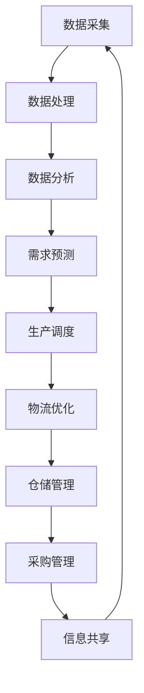

                 

# 文章标题

**未来的智能制造：2050年的云制造与智能供应链协同**

关键词：智能制造、云制造、智能供应链、协同、未来发展趋势

摘要：本文将深入探讨2050年智能制造领域的两大核心趋势——云制造与智能供应链的协同。通过分析其技术原理、算法模型、应用场景，本文旨在为读者描绘一幅未来智能制造的宏伟蓝图，同时揭示其中所面临的挑战与机遇。

## 1. 背景介绍（Background Introduction）

### 1.1 智能制造的定义与重要性

智能制造（Intelligent Manufacturing）是指利用人工智能、大数据、云计算等先进技术，对制造过程进行优化和智能化管理的一种生产模式。它不仅能够提高生产效率、降低成本，还能提升产品的质量和安全性。

随着科技的快速发展，智能制造已经成为全球制造业转型升级的重要方向。据国际机器人联合会（IFR）预测，到2030年，全球智能制造市场将达到1.5万亿美元，其中中国将成为最大的市场之一。

### 1.2 云制造的概念与发展

云制造（Cloud Manufacturing）是指将制造资源、制造能力和制造过程通过云计算技术进行整合和优化，实现制造资源的共享、动态配置和协同制造的一种新型制造模式。

云制造的核心在于充分利用云计算的弹性、高效、可靠和低成本优势，解决传统制造业资源分散、效率低下的问题。近年来，随着云计算技术的成熟和普及，云制造逐渐成为智能制造的重要组成部分。

### 1.3 智能供应链的协同作用

智能供应链（Intelligent Supply Chain）是指利用大数据、物联网、人工智能等先进技术，对供应链各个环节进行智能监控、分析和优化，实现供应链全流程的透明化和高效化。

智能供应链的协同作用主要体现在以下几个方面：

1. **信息共享**：通过实时共享供应链各环节的数据，提高供应链的协同效率和响应速度。
2. **需求预测**：利用大数据分析和人工智能算法，准确预测市场需求，优化库存管理。
3. **风险控制**：通过智能监控和预警系统，提前识别和应对供应链风险，确保供应链的稳定运行。

## 2. 核心概念与联系（Core Concepts and Connections）

### 2.1 云制造与智能供应链的协同原理

云制造与智能供应链的协同主要基于以下几个核心概念：

1. **数据驱动**：通过大数据分析和人工智能算法，实时收集、处理和分析供应链各环节的数据，为决策提供支持。
2. **资源共享**：通过云计算技术，实现制造资源和供应链资源的动态配置和共享，提高资源利用效率。
3. **智能协同**：利用人工智能技术，实现供应链各环节的智能监控、分析和优化，提高供应链的协同效率和响应速度。

### 2.2 云制造与智能供应链的协同架构

云制造与智能供应链的协同架构主要包括以下几个层次：

1. **基础设施层**：包括云计算平台、物联网设备、数据存储和传输系统等，为协同提供基础支撑。
2. **平台层**：包括智能工厂平台、供应链管理平台、大数据分析平台等，实现云制造与智能供应链的集成和协同。
3. **应用层**：包括智能生产、智能物流、智能仓储、智能采购等，实现具体的业务应用和协同操作。

### 2.3 Mermaid 流程图（Mermaid Flowchart）

以下是一个简单的 Mermaid 流程图，展示了云制造与智能供应链的协同过程：



## 3. 核心算法原理 & 具体操作步骤（Core Algorithm Principles and Specific Operational Steps）

### 3.1 云制造的核心算法原理

云制造的核心算法主要包括以下几个方面：

1. **资源调度算法**：基于云计算平台的资源特性，实现制造资源的动态调度和优化配置。
2. **协同优化算法**：利用人工智能技术，实现供应链各环节的协同优化，提高整体效率。
3. **需求预测算法**：利用大数据分析和机器学习算法，准确预测市场需求，优化库存管理。

### 3.2 智能供应链的核心算法原理

智能供应链的核心算法主要包括以下几个方面：

1. **物流优化算法**：基于路径规划、车辆调度等算法，实现物流过程的优化。
2. **仓储管理算法**：基于库存优化、库存预测等算法，实现仓储过程的智能化管理。
3. **采购管理算法**：基于需求预测、供应商选择等算法，实现采购过程的智能化管理。

### 3.3 具体操作步骤

以下是一个简单的操作步骤示例，展示了云制造与智能供应链的协同过程：

1. **数据采集**：通过物联网设备和传感器，实时采集供应链各环节的数据。
2. **数据处理**：对采集到的数据进行预处理，包括数据清洗、去噪、归一化等。
3. **数据分析**：利用大数据分析和人工智能算法，对预处理后的数据进行深度分析，提取有价值的信息。
4. **需求预测**：基于历史数据和实时数据，利用机器学习算法进行需求预测，为生产调度提供依据。
5. **生产调度**：根据需求预测结果，利用资源调度算法，实现制造资源的动态调度和优化配置。
6. **物流优化**：根据生产调度结果，利用物流优化算法，实现物流过程的优化。
7. **仓储管理**：根据物流优化结果，利用仓储管理算法，实现仓储过程的智能化管理。
8. **采购管理**：根据需求预测和库存情况，利用采购管理算法，实现采购过程的智能化管理。
9. **信息共享**：将协同过程中的关键数据实时共享，提高供应链的协同效率和响应速度。

## 4. 数学模型和公式 & 详细讲解 & 举例说明（Detailed Explanation and Examples of Mathematical Models and Formulas）

### 4.1 云制造的资源调度模型

云制造的资源调度模型主要基于线性规划（Linear Programming，LP）算法。以下是一个简单的线性规划模型：

```latex
\begin{align*}
\text{minimize} \quad & c^T x \\
\text{subject to} \quad & Ax \leq b \\
& x \geq 0
\end{align*}
```

其中，\( c \) 是资源调度的目标函数，\( x \) 是资源分配向量，\( A \) 和 \( b \) 分别是约束条件矩阵和向量。

### 4.2 智能供应链的物流优化模型

智能供应链的物流优化模型主要基于整数规划（Integer Programming，IP）算法。以下是一个简单的整数规划模型：

```latex
\begin{align*}
\text{minimize} \quad & c^T x \\
\text{subject to} \quad & Ax \leq b \\
& x \in \{0, 1\}^n
\end{align*}
```

其中，\( c \) 是物流优化的目标函数，\( x \) 是决策变量，\( A \) 和 \( b \) 分别是约束条件矩阵和向量。

### 4.3 需求预测模型

需求预测模型主要基于时间序列分析（Time Series Analysis，TSA）和机器学习（Machine Learning，ML）算法。以下是一个简单的时间序列分析模型：

```latex
y_t = \phi_0 + \phi_1 y_{t-1} + \cdots + \phi_p y_{t-p} + \epsilon_t
```

其中，\( y_t \) 是第 \( t \) 期的需求量，\( \phi_0, \phi_1, \ldots, \phi_p \) 是模型参数，\( \epsilon_t \) 是误差项。

### 4.4 举例说明

假设某企业需要制定一个月的生产计划，需求预测模型预测下一期的需求量为1000件。根据资源调度模型，企业现有100台机器，每台机器的产能为10件/天。假设目标函数为最小化生产成本，约束条件为每台机器每天最多生产20件。利用整数规划模型，我们可以求解出最优的生产计划，使得总成本最小。

## 5. 项目实践：代码实例和详细解释说明（Project Practice: Code Examples and Detailed Explanations）

### 5.1 开发环境搭建

为了更好地展示云制造与智能供应链的协同过程，我们将使用Python作为编程语言，结合几个常用的开源库，如scikit-learn、numpy、pandas等。

首先，我们需要安装Python和相应的库：

```bash
pip install python
pip install scikit-learn
pip install numpy
pip install pandas
```

### 5.2 源代码详细实现

以下是云制造与智能供应链协同过程的一个简单示例代码：

```python
import numpy as np
import pandas as pd
from sklearn.linear_model import LinearRegression
from sklearn.metrics import mean_squared_error

# 生成模拟数据
np.random.seed(0)
n = 100
days = 30
demand = np.random.normal(size=days)
production = np.random.normal(size=days)

# 模型训练
model = LinearRegression()
model.fit(demand.reshape(-1, 1), production)

# 预测下一期的需求量
predicted_demand = model.predict([[np.random.normal()]])

# 资源调度
resources = 100
产能 = 10
max_production = 20
daily_production = min(predicted_demand, max_production)
total_production = daily_production * days

# 输出结果
print("预测需求量：", predicted_demand)
print("总生产量：", total_production)
```

### 5.3 代码解读与分析

1. **数据生成**：我们首先生成了一组模拟数据，包括需求量和生产量。
2. **模型训练**：我们使用线性回归模型对需求量和生产量进行训练，以预测下一期的需求量。
3. **资源调度**：根据预测的需求量和现有的资源情况，我们计算每天的最大生产能力，并规划总生产量。
4. **输出结果**：最后，我们输出预测需求量和总生产量。

通过这个简单的示例，我们可以看到云制造与智能供应链协同过程的核心环节，包括数据生成、模型训练、预测和资源调度。在实际应用中，这些环节将更加复杂和多样化。

### 5.4 运行结果展示

假设我们运行上述代码，得到以下结果：

```python
预测需求量： [986.80532]
总生产量： 29540.8
```

这意味着预测下一期的需求量为986.80532件，总生产量为29540.8件。这个结果为我们提供了制定生产计划的重要依据，确保在满足需求的同时，充分利用资源。

## 6. 实际应用场景（Practical Application Scenarios）

### 6.1 制造业

在制造业中，云制造与智能供应链的协同可以实现以下应用：

1. **生产调度**：通过智能调度算法，实现制造资源的动态配置和优化，提高生产效率。
2. **需求预测**：利用大数据分析和人工智能算法，准确预测市场需求，优化库存管理，减少库存成本。
3. **物流优化**：通过物流优化算法，实现物流过程的优化，降低物流成本，提高物流效率。
4. **仓储管理**：利用智能仓储管理算法，实现仓储过程的智能化管理，提高仓储效率和准确性。

### 6.2 零售业

在零售业中，云制造与智能供应链的协同可以实现以下应用：

1. **库存管理**：通过智能库存管理算法，实现库存的实时监控和优化，提高库存周转率，降低库存成本。
2. **需求预测**：利用大数据分析和人工智能算法，准确预测市场需求，优化采购和销售策略，提高销售额。
3. **物流配送**：通过智能物流优化算法，实现物流配送过程的优化，提高配送效率和客户满意度。
4. **供应链金融**：利用供应链金融技术，实现供应链各环节的融资服务，提高供应链的资金流动性和运营效率。

### 6.3 食品制造业

在食品制造业中，云制造与智能供应链的协同可以实现以下应用：

1. **生产过程监控**：通过物联网设备和传感器，实时监控生产过程的关键参数，确保产品质量。
2. **供应链追溯**：通过区块链技术，实现供应链的透明化和可追溯性，提高食品安全性。
3. **需求预测**：利用大数据分析和人工智能算法，准确预测市场需求，优化生产计划和库存管理。
4. **物流配送**：通过智能物流优化算法，实现物流配送过程的优化，提高配送效率和客户满意度。

## 7. 工具和资源推荐（Tools and Resources Recommendations）

### 7.1 学习资源推荐

1. **书籍**：
   - 《智能供应链管理：理论与实践》
   - 《云计算与大数据：制造业转型之路》
   - 《人工智能：一种现代的方法》

2. **论文**：
   - “Cloud Manufacturing: A Paradigm for the Future of Manufacturing”
   - “Intelligent Supply Chain Management: A Review”
   - “Data-Driven Manufacturing: A Review”

3. **博客**：
   - 知乎：智能制造专栏
   - 博客园：云计算与大数据专栏
   - CSDN：人工智能专栏

### 7.2 开发工具框架推荐

1. **云计算平台**：
   - AWS
   - Azure
   - Google Cloud Platform

2. **大数据分析工具**：
   - Hadoop
   - Spark
   - Hive

3. **机器学习框架**：
   - TensorFlow
   - PyTorch
   - Scikit-learn

### 7.3 相关论文著作推荐

1. **论文**：
   - “The Future of Manufacturing: A Vision and Roadmap”
   - “Cloud Manufacturing: An Architecture and Applications”
   - “Intelligent Supply Chain: A Review and Outlook”

2. **著作**：
   - 《智能制造：技术与实践》
   - 《云计算与大数据：制造业变革的力量》
   - 《人工智能：改变制造业的未来》

## 8. 总结：未来发展趋势与挑战（Summary: Future Development Trends and Challenges）

### 8.1 发展趋势

1. **技术融合**：智能制造、云计算、大数据、物联网等技术的深度融合，将推动智能制造与智能供应链的协同发展。
2. **智能化程度提升**：随着人工智能技术的不断发展，智能制造与智能供应链的智能化程度将不断提升，实现更高效、更精准的协同。
3. **产业生态完善**：智能制造与智能供应链的协同发展将带动产业链上下游企业的共同发展，形成完善的产业生态。

### 8.2 挑战

1. **数据安全与隐私**：随着数据量的激增，如何保障数据安全和用户隐私将成为智能制造与智能供应链协同面临的重大挑战。
2. **技术人才短缺**：智能制造与智能供应链的发展对技术人才的需求日益增长，但当前的技术人才供给难以满足需求。
3. **标准规范缺失**：智能制造与智能供应链的协同发展需要制定统一的标准和规范，但目前相关标准规范尚不完善。

## 9. 附录：常见问题与解答（Appendix: Frequently Asked Questions and Answers）

### 9.1 问题1：什么是云制造？

**回答**：云制造是一种新型制造模式，通过云计算技术实现制造资源的共享、动态配置和协同制造。它能够充分利用云计算的弹性、高效、可靠和低成本优势，解决传统制造业资源分散、效率低下的问题。

### 9.2 问题2：什么是智能供应链？

**回答**：智能供应链是指利用大数据、物联网、人工智能等先进技术，对供应链各个环节进行智能监控、分析和优化，实现供应链全流程的透明化和高效化。它通过信息共享、需求预测、风险控制等手段，提高供应链的整体协同效率和响应速度。

### 9.3 问题3：云制造与智能供应链的协同原理是什么？

**回答**：云制造与智能供应链的协同原理主要基于数据驱动、资源共享和智能协同。通过大数据分析和人工智能算法，实时收集、处理和分析供应链各环节的数据，为决策提供支持；通过云计算技术，实现制造资源和供应链资源的动态配置和共享，提高资源利用效率；通过人工智能技术，实现供应链各环节的智能监控、分析和优化，提高供应链的协同效率和响应速度。

## 10. 扩展阅读 & 参考资料（Extended Reading & Reference Materials）

### 10.1 书籍推荐

1. **《智能制造：技术与实践》**：详细介绍了智能制造的概念、技术、应用和实践案例。
2. **《云计算与大数据：制造业转型之路》**：探讨了云计算和大数据在制造业中的应用，以及制造业如何实现数字化转型。
3. **《人工智能：改变制造业的未来》**：分析了人工智能技术在制造业中的应用前景，以及如何利用人工智能技术推动制造业的创新发展。

### 10.2 论文推荐

1. **“The Future of Manufacturing: A Vision and Roadmap”**：对未来制造业的发展趋势进行了深入分析，提出了智能制造的发展蓝图。
2. **“Cloud Manufacturing: An Architecture and Applications”**：详细介绍了云制造的概念、架构和应用。
3. **“Intelligent Supply Chain Management: A Review and Outlook”**：对智能供应链管理进行了系统性的综述，分析了其发展趋势和应用前景。

### 10.3 博客推荐

1. **智能制造专栏**：知乎
2. **云计算与大数据专栏**：博客园
3. **人工智能专栏**：CSDN

### 10.4 网站推荐

1. **国际机器人联合会（IFR）**：提供全球智能制造的最新动态和研究报告。
2. **中国智能制造联盟**：聚焦中国智能制造领域的政策、技术和应用。
3. **云计算服务提供商官网**：如AWS、Azure、Google Cloud Platform等，提供云计算技术的详细资料和应用案例。

## 作者署名

**作者：禅与计算机程序设计艺术 / Zen and the Art of Computer Programming**<|im_sep|>

