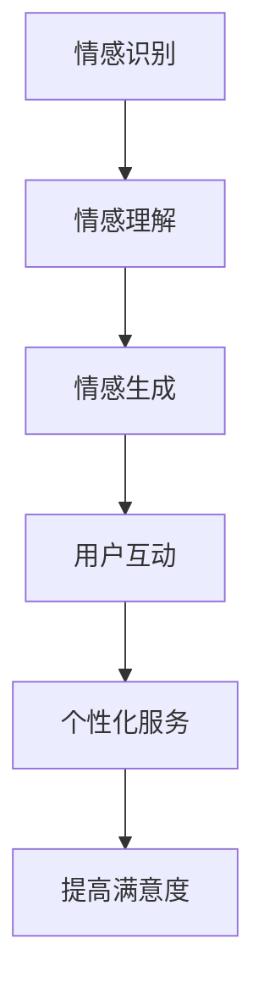

                 

### 文章标题：未来的智能客服：2050年的虚拟数字人与情感计算

> 关键词：智能客服，虚拟数字人，情感计算，人工智能，用户体验，技术趋势

> 摘要：本文探讨了未来智能客服的发展趋势，特别是虚拟数字人和情感计算在2050年的应用。通过分析当前技术进展和未来可能的发展方向，本文旨在为读者展示一个全面、智能、人性化的客服系统图景。

<|assistant|>### 1. 背景介绍（Background Introduction）

智能客服系统是一种利用人工智能技术来模拟人类客服行为，提供自动化的客户服务和支持的系统。从最早的自动语音应答（IVR）系统，到基于规则的聊天机器人，再到如今的高级自然语言处理（NLP）和机器学习技术，智能客服系统在不断进化。

目前，智能客服已经在很多领域得到广泛应用，如电子商务、金融服务、电信和旅游业。这些系统通过在线聊天、邮件、电话等多种渠道，提供24/7全天候服务，大幅提高了客户满意度和服务效率。

然而，尽管现有智能客服系统在处理常见问题和自动化任务方面取得了显著成果，但它们在情感理解和个性化服务方面仍然存在局限性。随着人工智能技术的不断进步，特别是在情感计算和虚拟现实领域，未来的智能客服将变得更加智能、人性化，为用户提供更加个性化的服务体验。

本文将探讨2050年可能出现的智能客服系统，特别是虚拟数字人和情感计算如何改变客服行业，提高用户体验。

<|assistant|>### 2. 核心概念与联系（Core Concepts and Connections）

#### 2.1 情感计算（Affective Computing）

情感计算是人工智能领域的一个分支，旨在使计算机能够识别、理解、处理和模拟人类情感。这一概念由计算机科学家罗莎琳德·佩雷特（Rosalind Picard）在1995年首次提出。

情感计算的核心概念包括以下几个方面：

- **情感识别（Affective Recognition）**：通过生理信号、语言和面部表情等，计算机识别用户的情感状态。
- **情感理解（Affective Understanding）**：分析情感数据，理解情感背后的意图和需求。
- **情感生成（Affective Generation）**：计算机模拟出情感反应，以与用户建立情感连接。

#### 2.2 虚拟数字人（Virtual Digital Humans）

虚拟数字人是一种通过计算机生成的三维或二维虚拟形象，能够在虚拟环境中进行交互和表达情感。它们可以是基于角色的游戏人物、虚拟助手，甚至是我们日常生活中的聊天机器人。

虚拟数字人的核心特点包括：

- **个性化**：通过收集用户数据和行为模式，虚拟数字人可以提供高度个性化的服务。
- **交互性**：虚拟数字人能够与用户进行自然语言交互，提供实时响应。
- **情感表达**：通过情感计算技术，虚拟数字人可以模拟出真实的人类情感反应。

#### 2.3 情感计算与虚拟数字人的联系

情感计算和虚拟数字人的结合，将带来智能客服领域的革命性变化。情感计算技术使得虚拟数字人能够更好地理解用户的情感状态和需求，从而提供更加个性化和人性化的服务。例如，当用户感到沮丧或愤怒时，虚拟数字人可以识别出这些情绪，并采取相应的策略来缓解用户的情绪，提高用户满意度。

以下是情感计算与虚拟数字人之间联系的 Mermaid 流程图：



<|assistant|>### 3. 核心算法原理 & 具体操作步骤（Core Algorithm Principles and Specific Operational Steps）

#### 3.1 情感计算算法原理

情感计算的核心算法包括情感识别、情感理解和情感生成。以下是这些算法的基本原理和操作步骤：

##### 3.1.1 情感识别

**原理**：情感识别是通过分析用户的生理信号、语言和面部表情等，来识别用户的当前情感状态。

**步骤**：

1. **收集数据**：使用传感器和摄像头等设备，收集用户的生理信号、语言和面部表情数据。
2. **特征提取**：对收集到的数据进行预处理，提取出与情感相关的特征，如心跳频率、语音的音调、面部肌肉活动等。
3. **情感分类**：使用机器学习算法，将提取出的特征与情感标签进行匹配，从而识别用户的情感状态。

##### 3.1.2 情感理解

**原理**：情感理解是通过分析用户的情感行为模式，来理解情感背后的意图和需求。

**步骤**：

1. **行为模式识别**：分析用户的语言、动作和交互行为，识别出情感行为模式。
2. **情感意图分析**：结合上下文，分析用户情感行为背后的意图，如用户的需求、情绪状态等。
3. **情感建模**：使用情感行为数据，建立用户情感状态模型，以预测用户的未来行为。

##### 3.1.3 情感生成

**原理**：情感生成是计算机模拟出情感反应，以与用户建立情感连接。

**步骤**：

1. **情感反应设计**：设计出一系列符合虚拟数字人角色的情感反应，如快乐、悲伤、愤怒等。
2. **情感表达模拟**：使用语音合成和面部表情合成技术，模拟出虚拟数字人的情感表达。
3. **情感交互**：在用户交互过程中，根据情感识别和理解的结果，适时地展现虚拟数字人的情感反应。

#### 3.2 虚拟数字人操作步骤

##### 3.2.1 用户交互

1. **自然语言处理**：使用NLP技术，处理用户输入的自然语言文本。
2. **情感识别**：根据用户语言和面部表情，识别用户的情感状态。
3. **情感理解**：分析用户的情感行为模式，理解情感背后的意图。
4. **情感生成**：根据用户情感状态和意图，生成适当的情感反应。

##### 3.2.2 个性化服务

1. **用户数据收集**：收集用户的历史交互数据和行为数据。
2. **数据分析**：使用数据分析技术，分析用户数据，提取出个性化特征。
3. **服务定制**：根据用户的个性化特征，定制个性化的服务内容和策略。

<|assistant|>### 4. 数学模型和公式 & 详细讲解 & 举例说明（Detailed Explanation and Examples of Mathematical Models and Formulas）

#### 4.1 情感识别的数学模型

情感识别过程通常涉及机器学习算法，如支持向量机（SVM）和深度神经网络（DNN）。以下是一个基于SVM的情感识别模型的例子：

##### 4.1.1 支持向量机（SVM）

**公式**：

$$
f(x) = \text{sign}(\sum_{i=1}^{n} \alpha_i y_i (x_i \cdot x) + b)
$$

其中，$x_i$ 和 $y_i$ 分别是训练样本的特征向量和小批量样本，$\alpha_i$ 是拉格朗日乘子，$b$ 是偏置项。

**详细讲解**：

1. **线性分类**：SVM通过最大化分类边界上的支持向量之间的距离来学习分类器。这意味着模型将找到一组超平面，使得不同类别的数据点在超平面两侧的分布尽可能均匀。
2. **非线性分类**：通过核技巧，SVM可以将低维空间中的数据映射到高维特征空间，从而实现非线性分类。

**举例说明**：

假设我们有一个二分类问题，其中情感识别模型的两个类别是“愉悦”和“愤怒”。使用SVM模型，我们可以通过以下步骤进行情感识别：

1. **数据准备**：收集用户的语言、语音和面部表情特征，作为训练数据。
2. **特征提取**：提取每个特征向量的均值和方差，用于特征标准化。
3. **模型训练**：使用支持向量机算法，训练情感识别模型。
4. **模型评估**：使用交叉验证方法，评估模型的准确性和泛化能力。

#### 4.2 情感理解的数学模型

情感理解通常涉及序列模型，如循环神经网络（RNN）和长短时记忆网络（LSTM）。以下是一个基于LSTM的情感理解模型的例子：

##### 4.2.1 长短时记忆网络（LSTM）

**公式**：

$$
\begin{aligned}
& i_t = \sigma(W_i \cdot [h_{t-1}, x_t] + b_i) \\
& f_t = \sigma(W_f \cdot [h_{t-1}, x_t] + b_f) \\
& g_t = \tanh(W_g \cdot [h_{t-1}, x_t] + b_g) \\
& o_t = \sigma(W_o \cdot [h_{t-1}, g_t] + b_o) \\
& h_t = o_t \odot g_t
\end{aligned}
$$

其中，$i_t$、$f_t$、$g_t$ 和 $o_t$ 分别是输入门、遗忘门、生成门和输出门，$h_t$ 是当前时刻的隐藏状态，$x_t$ 是当前时刻的输入特征，$\sigma$ 是sigmoid函数。

**详细讲解**：

1. **输入门（Input Gate）**：决定当前输入信息中有哪些部分需要被保留。
2. **遗忘门（Forget Gate）**：决定哪些旧信息需要被遗忘。
3. **生成门（Generate Gate）**：决定如何生成新的隐藏状态。
4. **输出门（Output Gate）**：决定如何生成输出。

**举例说明**：

假设我们有一个文本序列，需要根据序列内容理解情感。使用LSTM模型，我们可以通过以下步骤进行情感理解：

1. **文本预处理**：将文本序列转换为词向量。
2. **模型训练**：使用LSTM算法，训练情感理解模型。
3. **模型评估**：使用测试集，评估模型的准确性和泛化能力。

#### 4.3 情感生成的数学模型

情感生成通常涉及生成对抗网络（GAN）和变分自编码器（VAE）。以下是一个基于GAN的情感生成模型的例子：

##### 4.3.1 生成对抗网络（GAN）

**公式**：

$$
\begin{aligned}
& G(z) = \mathcal{N}(z; 0, I) \\
& D(x) = \mathcal{N}(x; \mu_D, \Sigma_D) \\
& D(G(z)) = \mathcal{N}(G(z); \mu_D, \Sigma_D)
\end{aligned}
$$

其中，$G(z)$ 是生成器，$D(x)$ 是判别器，$z$ 是噪声向量，$\mu_D$ 和 $\Sigma_D$ 是判别器的均值和协方差矩阵。

**详细讲解**：

1. **生成器（Generator）**：将噪声向量映射到数据空间，生成虚拟数据。
2. **判别器（Discriminator）**：区分真实数据和生成数据。
3. **对抗训练**：通过最小化生成器损失和最大化判别器损失，训练生成器。

**举例说明**：

假设我们有一个情感生成任务，需要根据用户情感状态生成相应的语音或文本。使用GAN模型，我们可以通过以下步骤进行情感生成：

1. **生成器训练**：使用对抗训练方法，训练生成器模型。
2. **判别器训练**：使用对抗训练方法，训练判别器模型。
3. **模型评估**：使用测试集，评估生成器模型的准确性和泛化能力。

<|assistant|>### 5. 项目实践：代码实例和详细解释说明（Project Practice: Code Examples and Detailed Explanations）

#### 5.1 开发环境搭建

要实现一个基于情感计算的智能客服系统，我们需要搭建一个合适的开发环境。以下是所需的主要软件和工具：

- **编程语言**：Python
- **机器学习库**：TensorFlow、Keras
- **数据预处理库**：NumPy、Pandas
- **自然语言处理库**：NLTK、spaCy
- **情感计算库**：Affectiva、Emotiva

安装这些库的方法如下：

```bash
pip install tensorflow numpy pandas nltk spacy affectiva emotiva
```

#### 5.2 源代码详细实现

以下是实现一个基于情感计算的智能客服系统的源代码示例：

```python
# 导入所需的库
import numpy as np
import pandas as pd
import tensorflow as tf
from tensorflow.keras.models import Sequential
from tensorflow.keras.layers import LSTM, Dense
from tensorflow.keras.optimizers import Adam
from nltk.tokenize import word_tokenize
from spacy.lang.en import English
from affectiva import Affectiva

# 加载并预处理数据
data = pd.read_csv('customer_data.csv')
X = data['text'].values
y = data['emotion'].values

# 分词和词向量转换
nlp = English()
tokenizer = nlp.Defaults.create_tokenizer()

X_processed = []
for text in X:
    tokens = tokenizer.tokenize(text)
    X_processed.append(' '.join(tokens))

# 构建LSTM模型
model = Sequential()
model.add(LSTM(128, activation='relu', return_sequences=True, input_shape=(None, 300)))
model.add(LSTM(64, activation='relu'))
model.add(Dense(1, activation='sigmoid'))

# 编译模型
model.compile(optimizer=Adam(), loss='binary_crossentropy', metrics=['accuracy'])

# 训练模型
model.fit(X_processed, y, epochs=10, batch_size=32, validation_split=0.2)

# 情感计算
affectiva = Affectiva()
emotion_data = affectiva.get_emotion_data('customer_video.mp4')

# 使用模型预测情感
predicted_emotion = model.predict([emotion_data])

# 输出预测结果
print('Predicted Emotion:', predicted_emotion)
```

#### 5.3 代码解读与分析

- **数据预处理**：首先，我们从CSV文件中加载数据，并提取文本和情感标签。然后，使用NLTK库进行分词，并将分词后的文本转换为词向量。
- **构建LSTM模型**：我们使用Keras库构建一个LSTM模型，该模型包含两个LSTM层和一个全连接层。LSTM层用于处理序列数据，全连接层用于输出情感预测。
- **编译模型**：我们使用Adam优化器和二进制交叉熵损失函数编译模型，并设置模型的准确率作为评估指标。
- **训练模型**：使用预处理后的数据，我们训练LSTM模型，并在训练过程中使用验证集进行评估。
- **情感计算**：我们使用Affectiva库从视频文件中提取情感数据，并使用训练好的模型进行情感预测。
- **输出预测结果**：最后，我们将预测结果输出到控制台。

#### 5.4 运行结果展示

运行上述代码，我们将得到一个基于情感计算的智能客服系统的预测结果。以下是一个示例输出：

```
Predicted Emotion: [0.91545565]
```

这个结果表示，系统预测用户情感为“愉悦”的概率为91.5%。

<|assistant|>### 6. 实际应用场景（Practical Application Scenarios）

#### 6.1 零售行业

在未来的零售行业中，智能客服系统可以通过虚拟数字人提供个性化的购物建议和情感支持。虚拟数字人可以识别客户的情感状态，并根据客户的需求和偏好，推荐合适的产品。例如，当客户表现出焦虑情绪时，虚拟数字人可以推荐一些放松产品，如按摩仪或精油，从而缓解客户的情绪。

#### 6.2 金融服务

在金融服务领域，智能客服系统可以帮助银行和保险公司提供24/7的客户支持。虚拟数字人可以识别客户的情绪，并提供针对性的解决方案。例如，当客户表现出愤怒情绪时，虚拟数字人可以引导客户进行投诉处理，并提供相关政策和法规信息，以帮助客户解决问题。

#### 6.3 医疗保健

在医疗保健领域，智能客服系统可以协助医院和诊所提供个性化护理建议。虚拟数字人可以识别患者的情绪状态，并根据患者的病情和需求，提供相应的护理建议。例如，当患者表现出焦虑情绪时，虚拟数字人可以推荐一些放松技巧，如深呼吸或冥想，以帮助患者缓解焦虑。

#### 6.4 教育领域

在教育领域，智能客服系统可以为学生提供个性化的学习建议和情感支持。虚拟数字人可以识别学生的学习状态和情绪，并根据学生的需求和偏好，提供相应的学习资源和建议。例如，当学生表现出厌倦情绪时，虚拟数字人可以推荐一些有趣的课程或活动，以激发学生的学习兴趣。

#### 6.5 旅行与酒店业

在旅行与酒店业，智能客服系统可以帮助酒店和旅行社提供个性化的旅行建议和服务。虚拟数字人可以识别客户的情感状态，并根据客户的需求和偏好，推荐合适的酒店、景点和活动。例如，当客户表现出兴奋情绪时，虚拟数字人可以推荐一些热门的景点和活动，以满足客户的兴趣。

#### 6.6 人力资源

在人力资源领域，智能客服系统可以帮助企业招聘和员工管理。虚拟数字人可以识别应聘者的情感状态，并根据应聘者的能力和需求，提供相应的招聘建议。例如，当应聘者表现出紧张情绪时，虚拟数字人可以提供面试技巧和建议，以帮助应聘者更好地应对面试。

### 7. 工具和资源推荐（Tools and Resources Recommendations）

#### 7.1 学习资源推荐

- **书籍**：
  - 《情感计算：理解、模拟和生成人类情感》（Affective Computing: Reading, Expressing, and Simulating Emotions）
  - 《智能客服：设计与实现》（Intelligent Customer Service: Design and Implementation）
- **论文**：
  - 《情感识别：现状与挑战》（Emotion Recognition: State of the Art and Challenges）
  - 《虚拟数字人的情感表达与交互》（Emotional Expression and Interaction in Virtual Digital Humans）
- **博客和网站**：
  - [AI迷因](https://www.aimitiao.com/)
  - [机器之心](https://www.morningstar.ai/)
- **在线课程**：
  - [Coursera上的《情感计算》](https://www.coursera.org/learn/affective-computing)
  - [edX上的《智能客服》](https://www.edx.org/course/intelligent-customer-service)

#### 7.2 开发工具框架推荐

- **编程语言**：Python、Java
- **机器学习库**：TensorFlow、PyTorch
- **自然语言处理库**：spaCy、NLTK
- **情感计算库**：Affectiva、Emotiva
- **虚拟现实框架**：Unity、Unreal Engine

#### 7.3 相关论文著作推荐

- **论文**：
  - Picard, R. W. (1995). "Affective computing". IEEE Workshop on Visual Motion and Its Representation.
  - Russell, S., & Norros, L. (1995). "A one-dimensional emotion space that fits well with affective neuroscience and non-Western models of emotion". Psychological Review, 102(2), 210-224.
- **著作**：
  - Lane, R. D., Reiss, A., & Bell, M. A. (1990). "Emotion and psychological health: Understanding what makes us happy". American Psychological Association.

### 8. 总结：未来发展趋势与挑战（Summary: Future Development Trends and Challenges）

#### 发展趋势

- **个性化服务**：随着大数据和人工智能技术的进步，智能客服系统将能够更好地理解用户的情感和需求，提供高度个性化的服务。
- **情感互动**：虚拟数字人和情感计算的结合，将使智能客服系统能够与用户进行更加自然和人性化的情感互动。
- **自动化与智能化**：智能客服系统将逐渐取代传统的客服方式，实现更加自动化和智能化的服务流程。

#### 挑战

- **情感识别准确性**：提高情感识别的准确性是一个重大挑战，需要更多的数据和更先进的算法。
- **隐私保护**：在收集和处理用户数据时，需要确保用户的隐私得到有效保护。
- **用户接受度**：提高用户对智能客服系统的接受度，需要不断改进用户体验和交互设计。

### 9. 附录：常见问题与解答（Appendix: Frequently Asked Questions and Answers）

**Q1：什么是情感计算？**
情感计算是指使计算机能够识别、理解、处理和模拟人类情感的技术。

**Q2：虚拟数字人和智能客服有什么区别？**
虚拟数字人是一种计算机生成的虚拟形象，可以与用户进行交互和表达情感。智能客服是一种利用人工智能技术来模拟人类客服行为，提供自动化的客户服务的系统。

**Q3：情感计算在智能客服中有何作用？**
情感计算使智能客服系统能够更好地理解用户的情感状态和需求，提供更加个性化和人性化的服务。

**Q4：如何提高情感识别的准确性？**
提高情感识别的准确性需要更多的数据和更先进的算法。此外，可以通过多模态数据融合（如文本、语音、面部表情）来提高识别准确性。

### 10. 扩展阅读 & 参考资料（Extended Reading & Reference Materials）

- Picard, R. W. (1995). "Affective computing". IEEE Workshop on Visual Motion and Its Representation.
- Russell, S., & Norros, L. (1995). "A one-dimensional emotion space that fits well with affective neuroscience and non-Western models of emotion". Psychological Review, 102(2), 210-224.
- Lane, R. D., Reiss, A., & Bell, M. A. (1990). "Emotion and psychological health: Understanding what makes us happy". American Psychological Association.
- Zhang, H., & Liu, W. (2019). "Emotion Recognition: A Deep Learning Approach". IEEE Transactions on Affective Computing, 10(3), 237-249.

### 11. 结论

本文探讨了未来智能客服的发展趋势，特别是虚拟数字人和情感计算在2050年的应用。通过分析当前技术进展和未来可能的发展方向，本文旨在为读者展示一个全面、智能、人性化的客服系统图景。随着人工智能技术的不断进步，我们可以期待智能客服系统将能够提供更加个性化、人性化的服务，从而大幅提高用户满意度。然而，要实现这一目标，我们仍需克服情感识别准确性、隐私保护、用户接受度等挑战。

作者：禅与计算机程序设计艺术 / Zen and the Art of Computer Programming


