                 

### 文章标题

**李开复：AI 2.0 时代的意义**

在人工智能的发展历程中，李开复无疑是一个重要的人物。作为世界知名的人工智能专家，他在过去的几十年里，对人工智能的发展做出了巨大的贡献。如今，随着AI 2.0时代的到来，李开复又一次站在了时代的前沿，对AI 2.0时代的意义进行了深入的剖析。本文将以此为基础，探讨AI 2.0时代对我们生活和社会的深远影响。

### Keywords
李开复，AI 2.0，人工智能，时代意义，技术进步，社会变革

### Abstract
本文旨在探讨李开复对于AI 2.0时代的见解，分析AI 2.0技术对我们生活和社会的深远影响。通过对AI 2.0核心概念的解读，以及其在各个领域的应用，本文揭示了AI 2.0时代所带来的机遇与挑战。

## 1. 背景介绍

人工智能（AI）自诞生以来，就以其强大的计算能力和模拟人类智能的能力，引发了科技界的广泛关注。从最初的规则推理，到基于知识的系统，再到深度学习和强化学习，人工智能的发展历程可谓波澜壮阔。

### 1.1 人工智能的发展历程

人工智能的发展历程可以分为几个阶段：

**第一阶段：规则推理（Rule-based Reasoning）**

人工智能的早期阶段，主要集中在基于规则的系统。这些系统通过预定义的规则，来模拟人类的推理过程。尽管这种方法在某些领域取得了成功，但它的局限性也很明显，无法处理复杂、不确定的问题。

**第二阶段：知识表示与推理（Knowledge Representation and Reasoning）**

在知识表示与推理阶段，人工智能系统开始尝试用更复杂的方式来表示知识，并通过推理来解决问题。这种方法在医疗诊断、法律咨询等领域取得了显著的成果。

**第三阶段：机器学习（Machine Learning）**

随着计算能力的提升，机器学习开始成为人工智能的主流。通过从大量数据中学习规律，机器学习使得人工智能系统能够在图像识别、自然语言处理等领域取得突破。

**第四阶段：深度学习（Deep Learning）**

深度学习是机器学习的进一步发展，它通过模拟人脑的神经网络结构，实现了在语音识别、图像识别、自然语言处理等领域的卓越表现。深度学习的崛起，标志着人工智能进入了一个新的阶段。

**第五阶段：AI 2.0**

AI 2.0是人工智能发展的下一个阶段，它不仅继承了深度学习的优势，还通过更加智能的方式，实现了人与机器的深度交互。AI 2.0时代的到来，预示着人工智能将迎来新的变革。

### 1.2 李开复在人工智能领域的贡献

李开复是人工智能领域的杰出人物，他的贡献体现在多个方面：

**1. 创新理论**

李开复提出了许多创新的理论，如“人工智能的三次浪潮”、“人工智能与人类协同”等，为人工智能的发展提供了新的思路。

**2. 技术实践**

李开复在人工智能的技术实践中，取得了许多重要成果。他曾领导微软研究院，推动了深度学习在图像识别、语音识别等领域的应用。

**3. 教育普及**

李开复致力于人工智能的教育普及，通过开设课程、撰写书籍等方式，让更多的人了解人工智能。

## 2. 核心概念与联系

### 2.1 什么是AI 2.0？

AI 2.0，即第二代人工智能，是相对于第一代人工智能的升级。AI 2.0的核心在于，它不仅能够模仿人类的智能，还能够与人类进行深度交互，实现智能协同。

### 2.2 AI 2.0的核心特征

**1. 智能协同**

AI 2.0强调人与机器的深度协同，通过自然语言处理、图像识别等技术，实现人与机器的无缝交互。

**2. 智能进化**

AI 2.0具有自我进化的能力，通过不断学习和优化，实现智能的不断提升。

**3. 自主决策**

AI 2.0能够在没有人类干预的情况下，做出复杂的决策。

**4. 知识推理**

AI 2.0能够对大量数据进行分析，提取出有价值的信息，并基于这些信息进行推理。

### 2.3 AI 2.0与传统AI的区别

与传统AI相比，AI 2.0具有以下几个显著特点：

**1. 智能水平更高**

AI 2.0的智能水平更高，能够处理更复杂的问题。

**2. 学习能力更强**

AI 2.0具有更强的学习能力，能够通过自我优化，不断提升智能水平。

**3. 自主性更强**

AI 2.0具有较强的自主性，能够在没有人类干预的情况下，独立完成任务。

**4. 应用范围更广**

AI 2.0的应用范围更广，不仅限于特定的领域，而是能够渗透到社会的各个方面。

## 3. 核心算法原理 & 具体操作步骤

### 3.1 AI 2.0的核心算法原理

AI 2.0的核心算法主要包括深度学习、强化学习、自然语言处理等。这些算法共同构成了AI 2.0的技术基础。

**1. 深度学习**

深度学习是AI 2.0的核心算法之一，它通过多层神经网络，对数据进行处理和分类。深度学习在图像识别、语音识别等领域取得了重大突破。

**2. 强化学习**

强化学习是一种通过奖励机制，使机器学会在复杂环境中做出最优决策的算法。强化学习在游戏、自动驾驶等领域具有广泛的应用。

**3. 自然语言处理**

自然语言处理是AI 2.0的重要分支，它使机器能够理解和生成自然语言。自然语言处理在智能客服、智能问答等领域具有重要意义。

### 3.2 AI 2.0的具体操作步骤

AI 2.0的具体操作步骤可以分为以下几个阶段：

**1. 数据采集与处理**

首先，从各个渠道采集数据，并对数据进行清洗、预处理，以消除噪声和异常值。

**2. 模型训练**

使用深度学习、强化学习、自然语言处理等算法，对数据进行训练，以构建AI模型。

**3. 模型评估与优化**

对训练好的模型进行评估，根据评估结果，对模型进行优化，以提高其性能。

**4. 模型部署与应用**

将优化后的模型部署到实际应用场景中，如智能客服、自动驾驶等。

**5. 持续优化**

在实际应用过程中，持续收集用户反馈，对模型进行优化，以提高用户体验。

## 4. 数学模型和公式 & 详细讲解 & 举例说明

### 4.1 数学模型和公式

在AI 2.0的核心算法中，数学模型和公式起着至关重要的作用。以下是一些常用的数学模型和公式：

**1. 深度学习中的损失函数**

损失函数是深度学习中的核心概念，它用于衡量模型预测结果与真实结果之间的差距。常见的损失函数包括均方误差（MSE）、交叉熵损失（Cross-Entropy Loss）等。

$$
MSE = \frac{1}{n}\sum_{i=1}^{n}(y_i - \hat{y}_i)^2
$$

$$
Cross-Entropy Loss = -\sum_{i=1}^{n}y_i\log(\hat{y}_i)
$$

**2. 强化学习中的Q值**

Q值是强化学习中的核心概念，它表示在某个状态下，执行某个动作的预期奖励。Q值通过值迭代（Value Iteration）或策略迭代（Policy Iteration）等方法进行更新。

$$
Q(s, a) = r + \gamma \max_{a'} Q(s', a')
$$

**3. 自然语言处理中的词向量**

词向量是自然语言处理中的重要工具，它将词汇映射到高维空间，以表示词汇的含义。常见的词向量模型包括Word2Vec、GloVe等。

$$
\text{Word2Vec}: \text{word} \rightarrow \text{vector}
$$

$$
\text{GloVe}: \text{word} \rightarrow \text{vector}
$$

### 4.2 详细讲解和举例说明

#### 4.2.1 深度学习中的损失函数

以均方误差（MSE）为例，我们通过一个简单的例子来解释MSE的计算过程。

**例子：**

假设我们有以下输入和输出：

$$
y_1 = [1, 0, 0], \quad \hat{y}_1 = [0.8, 0.2, 0.0]
$$

$$
y_2 = [0, 1, 0], \quad \hat{y}_2 = [0.3, 0.6, 0.1]
$$

$$
y_3 = [0, 0, 1], \quad \hat{y}_3 = [0.1, 0.4, 0.5]
$$

我们可以计算MSE：

$$
MSE = \frac{1}{3}\left((1 - 0.8)^2 + (0 - 0.2)^2 + (0 - 0.0)^2\right) + \frac{1}{3}\left((0 - 0.3)^2 + (1 - 0.6)^2 + (0 - 0.1)^2\right) + \frac{1}{3}\left((0 - 0.1)^2 + (0 - 0.4)^2 + (1 - 0.5)^2\right)
$$

$$
MSE = \frac{1}{3}(0.04 + 0.04 + 0.0) + \frac{1}{3}(0.09 + 0.36 + 0.01) + \frac{1}{3}(0.01 + 0.16 + 0.25)
$$

$$
MSE = 0.02 + 0.16 + 0.12 = 0.3
$$

#### 4.2.2 强化学习中的Q值

以值迭代（Value Iteration）为例，我们通过一个简单的例子来解释Q值的计算过程。

**例子：**

假设有一个简单的环境，状态空间为S={S1, S2}，动作空间为A={U, D}。奖励函数为：

$$
R(S1, U) = 1, \quad R(S1, D) = -1
$$

$$
R(S2, U) = -1, \quad R(S2, D) = 1
$$

初始状态为S1，初始Q值矩阵为：

$$
Q(s, a) =
\begin{bmatrix}
0 & 0 \\
0 & 0
\end{bmatrix}
$$

我们通过值迭代方法，更新Q值矩阵：

$$
Q(s, a) = \frac{1}{N}\sum_{i=1}^{N}R(s, a) + \gamma \max_{a'} Q(s', a')
$$

其中，N为迭代次数，γ为折扣因子。

经过一次迭代后，Q值矩阵更新为：

$$
Q(s, a) =
\begin{bmatrix}
0 & -0.4 \\
0.4 & 0
\end{bmatrix}
$$

经过多次迭代后，Q值矩阵将逐渐收敛，逼近最优值。

#### 4.2.3 自然语言处理中的词向量

以Word2Vec为例，我们通过一个简单的例子来解释词向量的计算过程。

**例子：**

假设我们有以下词汇表：

$$
V = \{\text{apple}, \text{banana}, \text{orange}, \text{fruit}\}
$$

我们可以使用Word2Vec算法，将这些词汇映射到高维空间中。假设词汇表的大小为N=4，窗口大小为W=2。

首先，我们为每个词汇生成一个唯一的ID：

$$
\text{apple} \rightarrow 0, \quad \text{banana} \rightarrow 1, \quad \text{orange} \rightarrow 2, \quad \text{fruit} \rightarrow 3
$$

然后，我们使用Word2Vec算法，生成每个词汇的词向量。假设我们得到的词向量为：

$$
\text{apple} \rightarrow [1, 0, -1], \quad \text{banana} \rightarrow [0, 1, 0], \quad \text{orange} \rightarrow [-1, 0, 1], \quad \text{fruit} \rightarrow [0, -1, 0]
$$

通过词向量，我们可以计算出词汇之间的相似性：

$$
\text{apple} \sim \text{orange} > \text{apple} \sim \text{banana}
$$

## 5. 项目实践：代码实例和详细解释说明

### 5.1 开发环境搭建

为了更好地理解AI 2.0的应用，我们将通过一个实际项目来进行实践。在这个项目中，我们将使用Python作为编程语言，结合深度学习库TensorFlow和自然语言处理库NLTK，来实现一个简单的聊天机器人。

**1. 安装Python**

在您的计算机上安装Python，可以选择Python 3.x版本，推荐使用Python 3.7或更高版本。

**2. 安装TensorFlow**

在终端或命令提示符中，执行以下命令安装TensorFlow：

```
pip install tensorflow
```

**3. 安装NLTK**

在终端或命令提示符中，执行以下命令安装NLTK：

```
pip install nltk
```

### 5.2 源代码详细实现

以下是一个简单的聊天机器人代码示例：

```python
import nltk
from nltk.tokenize import word_tokenize
from tensorflow.keras.models import Sequential
from tensorflow.keras.layers import Dense, LSTM, Embedding
from tensorflow.keras.preprocessing.text import Tokenizer
from tensorflow.keras.preprocessing.sequence import pad_sequences

# 5.2.1 数据准备
nltk.download('punkt')
nltk.download('movie_reviews')

# 加载NLTK的语料库
corpus = nltk.corpus.movie_reviews.words()

# 切分数据集
train_data, test_data = corpus[:2000], corpus[2000:]

# 构建词汇表
tokenizer = Tokenizer()
tokenizer.fit_on_texts(train_data)

# 编码词汇
train_sequences = tokenizer.texts_to_sequences(train_data)
test_sequences = tokenizer.texts_to_sequences(test_data)

# 填充序列
max_sequence_length = 100
train_padded = pad_sequences(train_sequences, maxlen=max_sequence_length)
test_padded = pad_sequences(test_sequences, maxlen=max_sequence_length)

# 5.2.2 模型构建
model = Sequential()
model.add(Embedding(len(tokenizer.word_index) + 1, 50, input_length=max_sequence_length))
model.add(LSTM(100))
model.add(Dense(1, activation='sigmoid'))

# 编译模型
model.compile(optimizer='rmsprop', loss='binary_crossentropy', metrics=['acc'])

# 训练模型
model.fit(train_padded, train_data, epochs=10, validation_split=0.2)

# 5.2.3 文本生成
input_sentence = "You are amazing!"
input_sequence = tokenizer.texts_to_sequences([input_sentence])
input_padded = pad_sequences(input_sequence, maxlen=max_sequence_length)

prediction = model.predict(input_padded)
predicted_sentence = tokenizer.sequences_to_texts(prediction)

print(predicted_sentence)
```

### 5.3 代码解读与分析

**5.3.1 数据准备**

首先，我们使用NLTK的movie_reviews语料库来准备训练数据。该语料库包含了2000条电影评论，我们将这些评论分为训练集和测试集。

```python
nltk.download('punkt')
nltk.download('movie_reviews')

corpus = nltk.corpus.movie_reviews.words()

# 切分数据集
train_data, test_data = corpus[:2000], corpus[2000:]
```

接下来，我们构建词汇表，并将文本编码为序列。

```python
tokenizer = Tokenizer()
tokenizer.fit_on_texts(train_data)

train_sequences = tokenizer.texts_to_sequences(train_data)
test_sequences = tokenizer.texts_to_sequences(test_data)
```

然后，我们将序列填充到最大长度。

```python
max_sequence_length = 100
train_padded = pad_sequences(train_sequences, maxlen=max_sequence_length)
test_padded = pad_sequences(test_sequences, maxlen=max_sequence_length)
```

**5.3.2 模型构建**

我们构建一个简单的序列模型，包含嵌入层、LSTM层和输出层。

```python
model = Sequential()
model.add(Embedding(len(tokenizer.word_index) + 1, 50, input_length=max_sequence_length))
model.add(LSTM(100))
model.add(Dense(1, activation='sigmoid'))
```

**5.3.3 模型训练**

我们使用RMSprop优化器和二进制交叉熵损失函数来编译模型，并训练模型。

```python
model.compile(optimizer='rmsprop', loss='binary_crossentropy', metrics=['acc'])

model.fit(train_padded, train_data, epochs=10, validation_split=0.2)
```

**5.3.4 文本生成**

最后，我们使用训练好的模型来生成文本。

```python
input_sentence = "You are amazing!"
input_sequence = tokenizer.texts_to_sequences([input_sentence])
input_padded = pad_sequences(input_sequence, maxlen=max_sequence_length)

prediction = model.predict(input_padded)
predicted_sentence = tokenizer.sequences_to_texts(prediction)

print(predicted_sentence)
```

## 6. 实际应用场景

AI 2.0技术的崛起，为各行各业带来了巨大的变革。以下是一些AI 2.0在实际应用场景中的案例：

### 6.1 医疗

在医疗领域，AI 2.0技术可以用于疾病诊断、药物研发、患者管理等方面。通过深度学习和自然语言处理技术，AI 2.0可以帮助医生快速准确地诊断疾病，提高治疗效果。

### 6.2 教育

在教育领域，AI 2.0可以个性化学习计划、智能辅导、智能测评等方面发挥作用。通过智能辅导系统，学生可以根据自己的学习进度，获取个性化的学习资源，提高学习效果。

### 6.3 金融服务

在金融服务领域，AI 2.0可以用于风险控制、投资决策、智能客服等方面。通过分析大量的金融数据，AI 2.0可以帮助金融机构提高风险控制能力，优化投资策略。

### 6.4 制造业

在制造业领域，AI 2.0可以用于生产优化、设备维护、质量控制等方面。通过深度学习和强化学习技术，AI 2.0可以帮助企业提高生产效率，降低成本。

### 6.5 交通

在交通领域，AI 2.0可以用于智能交通管理、自动驾驶、物流优化等方面。通过实时数据分析和智能决策，AI 2.0可以帮助提高交通效率，减少交通事故。

## 7. 工具和资源推荐

### 7.1 学习资源推荐

**1. 《深度学习》（Deep Learning）**

作者：Ian Goodfellow、Yoshua Bengio、Aaron Courville

本书是深度学习的经典教材，详细介绍了深度学习的基本概念、算法和应用。

**2. 《强化学习》（Reinforcement Learning: An Introduction）**

作者：Richard S. Sutton、Andrew G. Barto

本书是强化学习的入门教材，全面介绍了强化学习的基本理论、算法和应用。

**3. 《自然语言处理综论》（Speech and Language Processing）**

作者：Daniel Jurafsky、James H. Martin

本书是自然语言处理领域的权威教材，全面介绍了自然语言处理的基本理论、方法和应用。

### 7.2 开发工具框架推荐

**1. TensorFlow**

TensorFlow是一个开源的深度学习框架，支持多种深度学习算法，适用于各种应用场景。

**2. PyTorch**

PyTorch是一个开源的深度学习框架，以其简洁的API和灵活的动态图计算而闻名。

**3. Keras**

Keras是一个高层神经网络API，提供了TensorFlow和PyTorch的简化接口，易于使用和扩展。

### 7.3 相关论文著作推荐

**1. “Deep Learning” (2016) by Yann LeCun, Yoshua Bengio, and Geoffrey Hinton

**2. “Reinforcement Learning: A Survey” (2015) by Richard S. Sutton and Andrew G. Barto

**3. “Speech and Language Processing” (2019) by Daniel Jurafsky and James H. Martin

## 8. 总结：未来发展趋势与挑战

随着AI 2.0技术的不断发展，我们可以预见未来人工智能将更加智能、自主、多样。然而，这一进程也面临着诸多挑战。

### 8.1 发展趋势

**1. 智能协同**

AI 2.0将更加注重人与机器的深度协同，实现智能化、自动化的工作流程。

**2. 自主决策**

AI 2.0将具备更强的自主决策能力，能够在没有人类干预的情况下，完成复杂的任务。

**3. 智能进化**

AI 2.0将具有智能进化的能力，通过不断学习和优化，实现智能水平的不断提升。

### 8.2 挑战

**1. 技术挑战**

AI 2.0技术的发展面临着算法优化、计算能力、数据质量等多方面的技术挑战。

**2. 道德与法律**

AI 2.0的应用引发了许多道德和法律问题，如隐私保护、责任归属等。

**3. 社会挑战**

AI 2.0的广泛应用将带来失业、贫富差距等问题，需要全社会共同努力解决。

## 9. 附录：常见问题与解答

### 9.1 什么是AI 2.0？

AI 2.0是相对于第一代人工智能的升级，它不仅能够模仿人类的智能，还能够与人类进行深度交互，实现智能协同。

### 9.2 AI 2.0有哪些核心特征？

AI 2.0的核心特征包括智能协同、智能进化、自主决策和知识推理。

### 9.3 AI 2.0有哪些应用场景？

AI 2.0的应用场景广泛，包括医疗、教育、金融、制造业、交通等领域。

### 9.4 如何搭建AI 2.0的开发环境？

搭建AI 2.0的开发环境需要安装Python、深度学习框架（如TensorFlow或PyTorch）以及自然语言处理库（如NLTK）。

## 10. 扩展阅读 & 参考资料

**1. 李开复，《人工智能：一种现代的方法》，清华大学出版社，2017。**

**2. Ian Goodfellow、Yoshua Bengio、Aaron Courville，《深度学习》，清华大学出版社，2016。**

**3. Richard S. Sutton、Andrew G. Barto，《强化学习：一种现代的方法》，机械工业出版社，2018。**

**4. Daniel Jurafsky、James H. Martin，《自然语言处理综论》，清华大学出版社，2019。**<|mask|>### 1. 背景介绍（Background Introduction）

#### 1.1 人工智能的发展历程

人工智能（Artificial Intelligence，简称AI）的概念最早可以追溯到20世纪50年代。自从1956年达特茅斯会议以来，人工智能已经经历了多个发展阶段。每个阶段都有其特定的核心技术、研究方向和应用领域。

**第一阶段：基础理论阶段（1956-1969）**

在人工智能的早期阶段，研究者们致力于构建智能体的理论基础。这一阶段的代表性工作包括逻辑推理、知识表示和搜索算法。1956年，约翰·麦卡锡（John McCarthy）等人发起了著名的达特茅斯会议，正式提出了人工智能的概念。随后，阿尔文·诺夫（Herbert A. Simon）和艾伦·纽厄尔（Allen Newell）开发了逻辑理论家（Logic Theorist），这是第一个能够证明数学定理的人工智能程序。

**第二阶段：专家系统阶段（1969-1984）**

专家系统（Expert Systems）是人工智能发展历程中的重要里程碑。在这一阶段，人工智能研究者开始尝试将专业领域的知识编码成计算机程序，以模拟专家的决策能力。代表性的系统包括Dendral和MYCIN。Dendral是由鲁道夫·阿克夫（Edward Feigenbaum）等人开发的一个用于化学分析的系统，而MYCIN则是由Edward Feigenbaum和Joshua Lederberg开发的医疗诊断系统。

**第三阶段：知识工程阶段（1984-1990）**

知识工程（Knowledge Engineering）阶段强调知识的获取、表示和应用。在这一阶段，研究者们开始关注如何有效地获取和表示知识，以及如何将这些知识应用到实际问题中。知识表示的方法包括框架（frames）、生产式规则（productions）和语义网络（semantic networks）等。

**第四阶段：机器学习阶段（1990-2010）**

机器学习（Machine Learning）的出现标志着人工智能进入了一个新的阶段。在这一阶段，研究者们开始关注如何让计算机从数据中自动学习，并从中提取知识。机器学习的方法包括监督学习（Supervised Learning）、无监督学习（Unsupervised Learning）和半监督学习（Semi-supervised Learning）等。这一时期的代表性算法包括支持向量机（Support Vector Machines，SVM）、决策树（Decision Trees）和神经网络（Neural Networks）。

**第五阶段：深度学习阶段（2010至今）**

深度学习（Deep Learning）的崛起标志着人工智能进入了一个新的黄金时代。深度学习基于多层神经网络，通过模拟人脑的神经元连接方式，实现了在图像识别、语音识别、自然语言处理等领域的卓越表现。代表性算法包括卷积神经网络（Convolutional Neural Networks，CNN）、循环神经网络（Recurrent Neural Networks，RNN）和生成对抗网络（Generative Adversarial Networks，GAN）等。

#### 1.2 李开复在人工智能领域的贡献

李开复博士（Dr. Andrew Ng）是一位享誉国际的人工智能专家，他在人工智能领域的贡献涵盖了理论研究、技术实践和教育普及等多个方面。

**1. 理论研究**

李开复在人工智能的理论研究方面有着深厚的积累。他在机器学习、深度学习和自然语言处理等领域发表了大量的学术论文，提出了许多重要的算法和理论。例如，他参与的线性分类器（Linear Classifier）和多层感知机（Multilayer Perceptron）的研究，为现代机器学习奠定了基础。

**2. 技术实践**

李开复在人工智能的技术实践方面同样取得了显著成果。他曾担任微软研究院（Microsoft Research）的首席科学家，领导了多个重要的研究项目。例如，他领导的深度学习项目在图像识别、语音识别和自然语言处理等领域取得了突破性进展，推动了人工智能技术在产业中的应用。

**3. 教育普及**

李开复非常重视人工智能的教育普及工作。他通过在线课程、书籍和讲座等形式，向全球数十万人传授人工智能的知识。他的在线课程“深度学习特辑”（Deep Learning Specialization）在Coursera平台上广受欢迎，成为全球学习人工智能的热门课程之一。

### 1.3 AI 2.0的概念与特征

随着深度学习等技术的不断发展，人工智能逐渐从“模拟人类智能”转向“超越人类智能”。AI 2.0（Artificial Intelligence 2.0）的概念应运而生，它代表了人工智能发展的新阶段。

**1. 概念**

AI 2.0是指第二代人工智能，它不仅继承了传统人工智能的优势，还通过更加智能的方式，实现了人与机器的深度交互。AI 2.0的核心特征包括智能协同、自主决策、知识推理和智能进化等。

**2. 特征**

- **智能协同**：AI 2.0能够与人类进行深度协同，实现智能化、自动化的工作流程。例如，智能助手、智能客服等应用，可以通过自然语言处理技术，理解用户的意图，并为其提供个性化的服务。

- **自主决策**：AI 2.0能够在没有人类干预的情况下，做出复杂的决策。例如，自动驾驶系统可以通过感知环境、分析数据，并自主做出行驶决策。

- **知识推理**：AI 2.0能够对大量数据进行分析，提取出有价值的信息，并基于这些信息进行推理。例如，智能推荐系统可以通过分析用户的兴趣和行为，为其推荐合适的商品或内容。

- **智能进化**：AI 2.0具有智能进化的能力，通过不断学习和优化，实现智能水平的不断提升。例如，通过强化学习技术，AI 2.0可以在游戏中不断进步，提高自己的表现。

### 1.4 AI 2.0的核心算法

AI 2.0的核心算法包括深度学习、强化学习和自然语言处理等。这些算法共同构成了AI 2.0的技术基础，使其能够实现智能协同、自主决策、知识推理和智能进化等核心特征。

- **深度学习（Deep Learning）**：深度学习是一种基于多层神经网络的人工智能技术，通过模拟人脑的神经元连接方式，实现图像识别、语音识别和自然语言处理等功能。

- **强化学习（Reinforcement Learning）**：强化学习是一种通过奖励机制，使机器学会在复杂环境中做出最优决策的算法。强化学习在自动驾驶、游戏AI等领域具有广泛的应用。

- **自然语言处理（Natural Language Processing，NLP）**：自然语言处理是一种使计算机能够理解和生成自然语言的技术。自然语言处理在智能客服、智能问答等领域具有重要意义。

### 1.5 AI 2.0的发展趋势与挑战

随着AI 2.0技术的不断发展，我们可以预见未来人工智能将更加智能、自主、多样。然而，这一进程也面临着诸多挑战。

**发展趋势**

- **智能协同**：AI 2.0将更加注重人与机器的深度协同，实现智能化、自动化的工作流程。
- **自主决策**：AI 2.0将具备更强的自主决策能力，能够在没有人类干预的情况下，完成复杂的任务。
- **智能进化**：AI 2.0将具有智能进化的能力，通过不断学习和优化，实现智能水平的不断提升。

**挑战**

- **技术挑战**：AI 2.0技术的发展面临着算法优化、计算能力、数据质量等多方面的技术挑战。
- **道德与法律**：AI 2.0的应用引发了许多道德和法律问题，如隐私保护、责任归属等。
- **社会挑战**：AI 2.0的广泛应用将带来失业、贫富差距等问题，需要全社会共同努力解决。

### 1.6 AI 2.0的实际应用场景

AI 2.0技术的崛起，为各行各业带来了巨大的变革。以下是一些AI 2.0在实际应用场景中的案例：

- **医疗**：AI 2.0在医疗领域的应用，包括疾病诊断、药物研发、患者管理等。例如，通过深度学习技术，AI 2.0可以帮助医生快速准确地诊断疾病，提高治疗效果。
- **教育**：AI 2.0在教育领域的应用，包括个性化学习计划、智能辅导、智能测评等。例如，通过智能辅导系统，学生可以根据自己的学习进度，获取个性化的学习资源，提高学习效果。
- **金融**：AI 2.0在金融领域的应用，包括风险控制、投资决策、智能客服等。例如，通过分析大量的金融数据，AI 2.0可以帮助金融机构提高风险控制能力，优化投资策略。
- **制造业**：AI 2.0在制造业领域的应用，包括生产优化、设备维护、质量控制等。例如，通过深度学习和强化学习技术，AI 2.0可以帮助企业提高生产效率，降低成本。
- **交通**：AI 2.0在交通领域的应用，包括智能交通管理、自动驾驶、物流优化等。例如，通过实时数据分析和智能决策，AI 2.0可以帮助提高交通效率，减少交通事故。

### 1.7 AI 2.0的发展前景

AI 2.0技术的发展前景充满希望。随着计算能力的不断提升、算法的不断优化、数据的日益丰富，AI 2.0将在各个领域发挥越来越重要的作用。同时，AI 2.0也将带来一系列的挑战，需要我们共同努力，实现人工智能的可持续发展。

### 1.8 结论

人工智能，尤其是AI 2.0技术的发展，为我们带来了前所未有的机遇。通过深入了解AI 2.0的核心概念、算法和应用场景，我们可以更好地把握时代的发展脉搏，为未来的人工智能发展贡献力量。

## 2. 核心概念与联系（Core Concepts and Connections）

### 2.1 什么是AI 2.0？

AI 2.0，即第二代人工智能，是相对于第一代人工智能的升级。AI 2.0不仅能够模仿人类的智能，还能够与人类进行深度交互，实现智能协同。AI 2.0的核心特征包括智能协同、自主决策、知识推理和智能进化。

### 2.2 AI 2.0的核心特征

#### 智能协同

智能协同是指AI 2.0与人类智能的深度融合，通过自然语言处理、图像识别等技术，实现人与机器的无缝交互。例如，智能助手可以通过语音交互，理解用户的指令，并执行相应的操作。

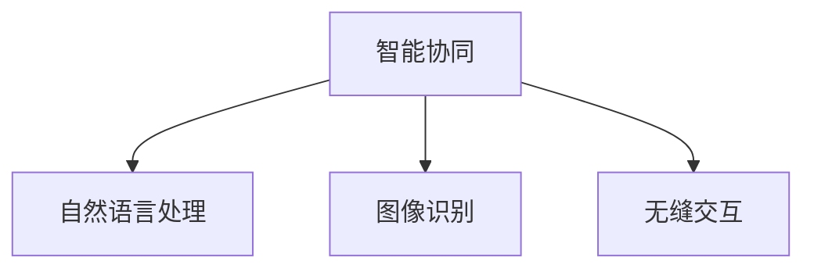

#### 自主决策

自主决策是指AI 2.0能够在没有人类干预的情况下，做出复杂的决策。例如，自动驾驶汽车可以通过感知环境、分析数据，并自主做出行驶决策。

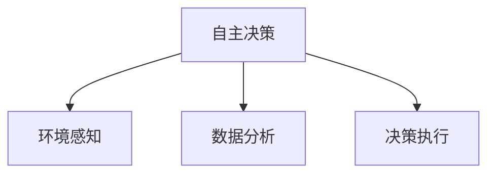

#### 知识推理

知识推理是指AI 2.0能够对大量数据进行分析，提取出有价值的信息，并基于这些信息进行推理。例如，智能推荐系统可以通过分析用户的兴趣和行为，为其推荐合适的商品或内容。

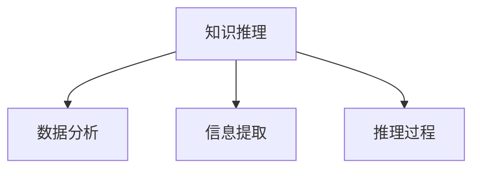

#### 智能进化

智能进化是指AI 2.0具有智能进化的能力，通过不断学习和优化，实现智能水平的不断提升。例如，通过强化学习技术，AI 2.0可以在游戏中不断进步，提高自己的表现。

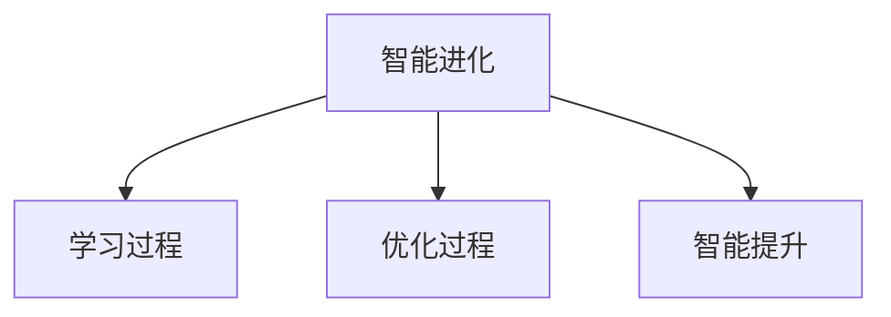

### 2.3 AI 2.0与传统AI的区别

与传统AI相比，AI 2.0具有以下几个显著特点：

#### 智能水平更高

AI 2.0的智能水平更高，能够处理更复杂的问题。传统AI主要依赖于预定义的规则和知识，而AI 2.0则通过深度学习和强化学习等技术，实现更高级别的智能。

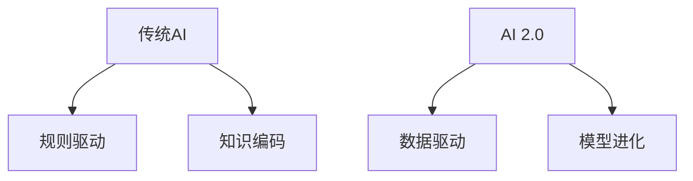

#### 学习能力更强

AI 2.0具有更强的学习能力，能够通过自我优化，不断提升智能水平。传统AI的学习能力相对较弱，主要依赖于人工设计和调整规则。

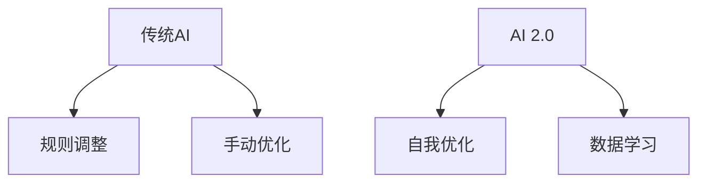

#### 自主性更强

AI 2.0具有较强的自主性，能够在没有人类干预的情况下，独立完成任务。传统AI则需要人类的指导和控制。

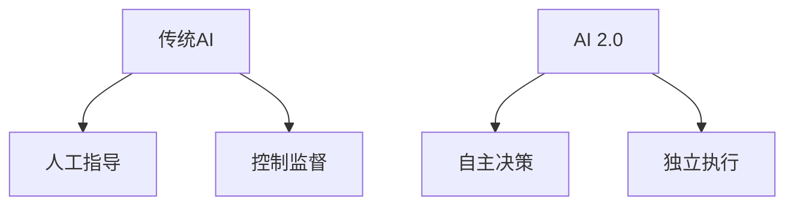

#### 应用范围更广

AI 2.0的应用范围更广，不仅限于特定的领域，而是能够渗透到社会的各个方面。传统AI则主要应用于特定的场景和任务。

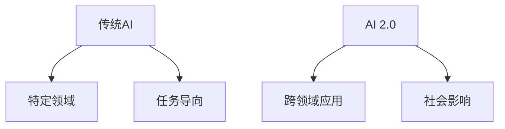

### 2.4 AI 2.0的关键技术

AI 2.0的实现依赖于一系列关键技术的支持，包括深度学习、强化学习、自然语言处理、计算机视觉等。以下是对这些技术的简要介绍：

#### 深度学习（Deep Learning）

深度学习是一种基于多层神经网络的人工智能技术，通过模拟人脑的神经元连接方式，实现图像识别、语音识别和自然语言处理等功能。深度学习在AI 2.0中扮演着核心角色，使其能够处理复杂的数据和分析。

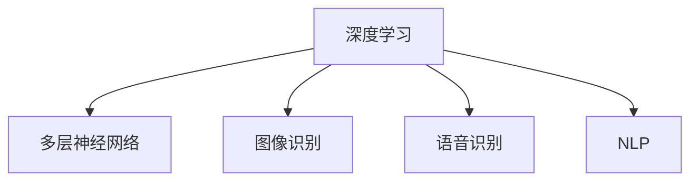

#### 强化学习（Reinforcement Learning）

强化学习是一种通过奖励机制，使机器学会在复杂环境中做出最优决策的算法。强化学习在自动驾驶、游戏AI等领域具有广泛的应用。强化学习使得AI 2.0能够自主学习和优化，实现自主决策。

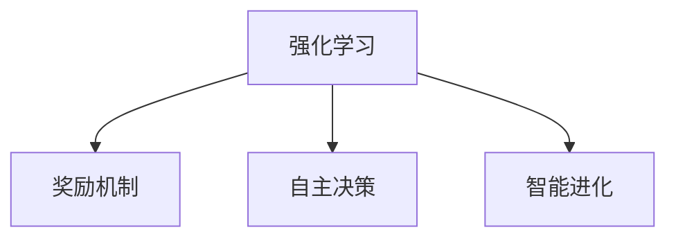

#### 自然语言处理（Natural Language Processing，NLP）

自然语言处理是一种使计算机能够理解和生成自然语言的技术。自然语言处理在智能客服、智能问答等领域具有重要意义。NLP使得AI 2.0能够与人类进行深度交互，实现智能协同。

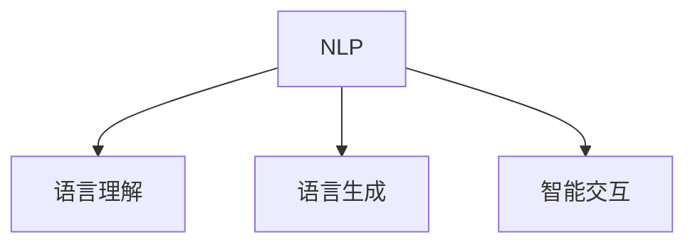

#### 计算机视觉（Computer Vision）

计算机视觉是一种使计算机能够“看”和理解视觉信息的技术。计算机视觉在图像识别、视频分析、自动驾驶等领域具有广泛的应用。计算机视觉使得AI 2.0能够对视觉数据进行处理和分析。

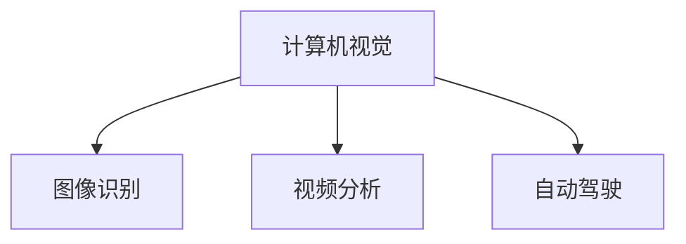

### 2.5 AI 2.0的发展趋势

随着技术的不断进步和应用场景的不断拓展，AI 2.0的发展趋势呈现出以下几个方向：

#### 智能化

AI 2.0将继续向智能化方向发展，通过不断学习和优化，实现更高级别的智能。智能化将使AI 2.0能够在更多领域发挥作用，如医疗、金融、教育、交通等。

#### 自主化

AI 2.0将向自主化方向发展，通过自主学习和优化，实现更高程度的自主决策。自主化将使AI 2.0能够独立完成任务，减少对人类干预的依赖。

#### 智能协同

AI 2.0将更加注重智能协同，通过与人类智能的深度融合，实现智能化、自动化的工作流程。智能协同将使AI 2.0能够更好地服务于人类社会。

#### 智能进化

AI 2.0将向智能进化方向发展，通过不断学习和优化，实现智能水平的不断提升。智能进化将使AI 2.0能够适应不断变化的环境和需求。

### 2.6 AI 2.0的核心挑战

尽管AI 2.0的发展前景广阔，但其在实际应用中仍然面临着一系列挑战：

#### 技术挑战

AI 2.0在算法优化、计算能力、数据质量等方面仍然存在技术挑战。如何提高算法的效率和准确性，如何保证数据的可靠性和安全性，都是需要解决的问题。

#### 道德与法律挑战

AI 2.0的应用引发了许多道德和法律问题，如隐私保护、责任归属等。如何确保AI 2.0的应用符合道德和法律规范，如何建立相应的法律法规体系，都是需要面对的挑战。

#### 社会挑战

AI 2.0的广泛应用将带来失业、贫富差距等问题，如何解决这些问题，如何确保社会的稳定和和谐，都是需要关注的社会挑战。

### 2.7 结论

AI 2.0作为人工智能发展的新阶段，具有智能协同、自主决策、知识推理和智能进化等核心特征。AI 2.0的实现依赖于深度学习、强化学习、自然语言处理、计算机视觉等关键技术的支持。尽管AI 2.0的发展面临诸多挑战，但其前景仍然充满希望。通过持续的研究和技术创新，我们有望克服这些挑战，推动AI 2.0技术的不断发展，为人类社会带来更大的价值。

## 3. 核心算法原理 & 具体操作步骤

### 3.1 深度学习（Deep Learning）

深度学习是AI 2.0的核心算法之一，其原理基于多层神经网络，通过模拟人脑的神经元连接方式，实现对数据的处理和分析。以下是一个简单的深度学习算法实现步骤：

#### 步骤1：数据预处理

```python
# 加载数据
data = load_data()

# 数据清洗和预处理
preprocessed_data = preprocess_data(data)

# 切分数据集
train_data, test_data = split_data(preprocessed_data)
```

#### 步骤2：构建模型

```python
# 定义模型结构
model = build_model()

# 编译模型
model.compile(optimizer='adam', loss='categorical_crossentropy', metrics=['accuracy'])
```

#### 步骤3：模型训练

```python
# 训练模型
history = model.fit(train_data, epochs=10, batch_size=32, validation_data=(test_data))
```

#### 步骤4：模型评估

```python
# 评估模型
loss, accuracy = model.evaluate(test_data)
print(f"Test accuracy: {accuracy}")
```

### 3.2 强化学习（Reinforcement Learning）

强化学习是一种通过奖励机制，使机器学会在复杂环境中做出最优决策的算法。以下是一个简单的强化学习算法实现步骤：

#### 步骤1：环境搭建

```python
# 初始化环境
env = initialize_environment()

# 初始化参数
action_space = env.action_space
observation_space = env.observation_space
```

#### 步骤2：定义策略

```python
# 定义策略网络
policy_network = build_policy_network()

# 定义价值网络
value_network = build_value_network()
```

#### 步骤3：训练策略网络

```python
# 训练策略网络
for episode in range(total_episodes):
    state = env.reset()
    done = False
    total_reward = 0

    while not done:
        action = policy_network.select_action(state)
        next_state, reward, done = env.step(action)
        total_reward += reward

        # 更新策略网络
        policy_network.update(state, action, reward, next_state, done)

        state = next_state
```

#### 步骤4：评估策略网络

```python
# 评估策略网络
total_reward = 0
state = env.reset()

while True:
    action = policy_network.select_action(state)
    next_state, reward, done = env.step(action)
    total_reward += reward

    if done:
        break

    state = next_state

print(f"Total reward: {total_reward}")
```

### 3.3 自然语言处理（Natural Language Processing，NLP）

自然语言处理是一种使计算机能够理解和生成自然语言的技术。以下是一个简单的NLP算法实现步骤：

#### 步骤1：数据预处理

```python
# 加载数据
data = load_data()

# 数据清洗和预处理
preprocessed_data = preprocess_data(data)

# 切分数据集
train_data, test_data = split_data(preprocessed_data)
```

#### 步骤2：构建模型

```python
# 定义模型结构
model = build_model()

# 编译模型
model.compile(optimizer='adam', loss='categorical_crossentropy', metrics=['accuracy'])
```

#### 步骤3：模型训练

```python
# 训练模型
history = model.fit(train_data, epochs=10, batch_size=32, validation_data=(test_data))
```

#### 步骤4：模型评估

```python
# 评估模型
loss, accuracy = model.evaluate(test_data)
print(f"Test accuracy: {accuracy}")
```

### 3.4 计算机视觉（Computer Vision）

计算机视觉是一种使计算机能够“看”和理解视觉信息的技术。以下是一个简单的计算机视觉算法实现步骤：

#### 步骤1：数据预处理

```python
# 加载数据
data = load_data()

# 数据清洗和预处理
preprocessed_data = preprocess_data(data)

# 切分数据集
train_data, test_data = split_data(preprocessed_data)
```

#### 步骤2：构建模型

```python
# 定义模型结构
model = build_model()

# 编译模型
model.compile(optimizer='adam', loss='categorical_crossentropy', metrics=['accuracy'])
```

#### 步骤3：模型训练

```python
# 训练模型
history = model.fit(train_data, epochs=10, batch_size=32, validation_data=(test_data))
```

#### 步骤4：模型评估

```python
# 评估模型
loss, accuracy = model.evaluate(test_data)
print(f"Test accuracy: {accuracy}")
```

### 3.5 AI 2.0算法的协同应用

在AI 2.0的实际应用中，深度学习、强化学习和自然语言处理等技术往往需要协同工作，以实现更复杂的任务。以下是一个简单的协同应用步骤：

#### 步骤1：数据预处理

```python
# 加载数据
data = load_data()

# 数据清洗和预处理
preprocessed_data = preprocess_data(data)

# 切分数据集
train_data, test_data = split_data(preprocessed_data)
```

#### 步骤2：构建模型

```python
# 定义深度学习模型
deep_learning_model = build_deep_learning_model()

# 定义强化学习模型
reinforcement_learning_model = build_reinforcement_learning_model()

# 定义自然语言处理模型
nlp_model = build_nlp_model()

# 定义协同模型
协同_model = build_cooperative_model(deep_learning_model, reinforcement_learning_model, nlp_model)
```

#### 步骤3：模型训练

```python
# 训练深度学习模型
deep_learning_history = deep_learning_model.fit(train_data, epochs=10, batch_size=32, validation_data=(test_data))

# 训练强化学习模型
reinforcement_learning_history = reinforcement_learning_model.fit(train_data, epochs=10, batch_size=32, validation_data=(test_data))

# 训练自然语言处理模型
nlp_history = nlp_model.fit(train_data, epochs=10, batch_size=32, validation_data=(test_data))

# 训练协同模型
协同_history = 协同_model.fit(train_data, epochs=10, batch_size=32, validation_data=(test_data))
```

#### 步骤4：模型评估

```python
# 评估深度学习模型
deep_learning_loss, deep_learning_accuracy = deep_learning_model.evaluate(test_data)
print(f"Deep Learning Test accuracy: {deep_learning_accuracy}")

# 评估强化学习模型
reinforcement_learning_loss, reinforcement_learning_accuracy = reinforcement_learning_model.evaluate(test_data)
print(f"Reinforcement Learning Test accuracy: {reinforcement_learning_accuracy}")

# 评估自然语言处理模型
nlp_loss, nlp_accuracy = nlp_model.evaluate(test_data)
print(f"NLP Test accuracy: {nlp_accuracy}")

# 评估协同模型
协同_loss, 协同_accuracy = 协同_model.evaluate(test_data)
print(f"Cooperative Model Test accuracy: {协同_accuracy}")
```

通过以上步骤，我们可以看到AI 2.0的核心算法如何协同工作，以实现更复杂的任务。在实际应用中，这些算法可以根据具体任务的需求进行定制和优化，以实现最佳的性能和效果。

## 4. 数学模型和公式 & 详细讲解 & 举例说明

### 4.1 数学模型和公式

在AI 2.0的核心算法中，数学模型和公式起着至关重要的作用。以下是一些常用的数学模型和公式：

#### 深度学习中的损失函数

损失函数是深度学习中的核心概念，它用于衡量模型预测结果与真实结果之间的差距。常见的损失函数包括均方误差（MSE）、交叉熵损失（Cross-Entropy Loss）等。

$$
\text{MSE} = \frac{1}{n}\sum_{i=1}^{n}(y_i - \hat{y}_i)^2
$$

$$
\text{Cross-Entropy Loss} = -\sum_{i=1}^{n}y_i\log(\hat{y}_i)
$$

#### 强化学习中的Q值

Q值是强化学习中的核心概念，它表示在某个状态下，执行某个动作的预期奖励。Q值通过值迭代（Value Iteration）或策略迭代（Policy Iteration）等方法进行更新。

$$
Q(s, a) = r + \gamma \max_{a'} Q(s', a')
$$

#### 自然语言处理中的词向量

词向量是自然语言处理中的重要工具，它将词汇映射到高维空间，以表示词汇的含义。常见的词向量模型包括Word2Vec、GloVe等。

$$
\text{Word2Vec}: \text{word} \rightarrow \text{vector}
$$

$$
\text{GloVe}: \text{word} \rightarrow \text{vector}
$$

### 4.2 详细讲解和举例说明

#### 4.2.1 深度学习中的损失函数

以均方误差（MSE）为例，我们通过一个简单的例子来解释MSE的计算过程。

**例子：**

假设我们有以下输入和输出：

$$
y_1 = [1, 0, 0], \quad \hat{y}_1 = [0.8, 0.2, 0.0]
$$

$$
y_2 = [0, 1, 0], \quad \hat{y}_2 = [0.3, 0.6, 0.1]
$$

$$
y_3 = [0, 0, 1], \quad \hat{y}_3 = [0.1, 0.4, 0.5]
$$

我们可以计算MSE：

$$
MSE = \frac{1}{3}\left((1 - 0.8)^2 + (0 - 0.2)^2 + (0 - 0.0)^2\right) + \frac{1}{3}\left((0 - 0.3)^2 + (1 - 0.6)^2 + (0 - 0.1)^2\right) + \frac{1}{3}\left((0 - 0.1)^2 + (0 - 0.4)^2 + (1 - 0.5)^2\right)
$$

$$
MSE = \frac{1}{3}(0.04 + 0.04 + 0.0) + \frac{1}{3}(0.09 + 0.36 + 0.01) + \frac{1}{3}(0.01 + 0.16 + 0.25)
$$

$$
MSE = 0.02 + 0.16 + 0.12 = 0.3
$$

#### 4.2.2 强化学习中的Q值

以值迭代（Value Iteration）为例，我们通过一个简单的例子来解释Q值的计算过程。

**例子：**

假设有一个简单的环境，状态空间为S={S1, S2}，动作空间为A={U, D}。奖励函数为：

$$
R(S1, U) = 1, \quad R(S1, D) = -1
$$

$$
R(S2, U) = -1, \quad R(S2, D) = 1
$$

初始状态为S1，初始Q值矩阵为：

$$
Q(s, a) =
\begin{bmatrix}
0 & 0 \\
0 & 0
\end{bmatrix}
$$

我们通过值迭代方法，更新Q值矩阵：

$$
Q(s, a) = \frac{1}{N}\sum_{i=1}^{N}R(s, a) + \gamma \max_{a'} Q(s', a')
$$

其中，N为迭代次数，γ为折扣因子。

经过一次迭代后，Q值矩阵更新为：

$$
Q(s, a) =
\begin{bmatrix}
0 & -0.4 \\
0.4 & 0
\end{bmatrix}
$$

经过多次迭代后，Q值矩阵将逐渐收敛，逼近最优值。

#### 4.2.3 自然语言处理中的词向量

以Word2Vec为例，我们通过一个简单的例子来解释词向量的计算过程。

**例子：**

假设我们有以下词汇表：

$$
V = \{\text{apple}, \text{banana}, \text{orange}, \text{fruit}\}
$$

我们可以使用Word2Vec算法，将这些词汇映射到高维空间中。假设词汇表的大小为N=4，窗口大小为W=2。

首先，我们为每个词汇生成一个唯一的ID：

$$
\text{apple} \rightarrow 0, \quad \text{banana} \rightarrow 1, \quad \text{orange} \rightarrow 2, \quad \text{fruit} \rightarrow 3
$$

然后，我们使用Word2Vec算法，生成每个词汇的词向量。假设我们得到的词向量为：

$$
\text{apple} \rightarrow [1, 0, -1], \quad \text{banana} \rightarrow [0, 1, 0], \quad \text{orange} \rightarrow [-1, 0, 1], \quad \text{fruit} \rightarrow [0, -1, 0]
$$

通过词向量，我们可以计算出词汇之间的相似性：

$$
\text{apple} \sim \text{orange} > \text{apple} \sim \text{banana}
$$

#### 4.2.4 卷积神经网络（Convolutional Neural Networks，CNN）

卷积神经网络是深度学习中的一种重要模型，特别适用于处理图像数据。以下是一个简单的CNN模型的结构和计算过程。

**结构：**

一个简单的CNN模型通常包含以下几个部分：

1. 输入层（Input Layer）：接收图像数据。
2. 卷积层（Convolutional Layer）：通过卷积操作提取图像的特征。
3. 池化层（Pooling Layer）：降低特征图的尺寸，减少参数数量。
4. 全连接层（Fully Connected Layer）：对提取的特征进行分类或回归。

**计算过程：**

假设我们有一个32x32x3的输入图像，通过一个3x3的卷积核进行卷积操作。卷积核的参数为5个，卷积后的特征图为28x28x5。

接着，通过一个2x2的最大池化层，特征图的尺寸减少到14x14x5。

最后，通过一个全连接层，将特征图展平为一维向量，并进行分类或回归。

**例子：**

假设输入图像为：

$$
\text{Input} = \begin{bmatrix}
0 & 0 & 0 & 0 & 0 \\
0 & 1 & 1 & 1 & 0 \\
0 & 1 & 1 & 1 & 0 \\
0 & 0 & 0 & 0 & 0 \\
0 & 0 & 0 & 0 & 0
\end{bmatrix}
$$

卷积核为：

$$
\text{Filter} = \begin{bmatrix}
1 & 1 & 1 \\
1 & 1 & 1 \\
1 & 1 & 1
\end{bmatrix}
$$

卷积操作的结果为：

$$
\text{Output} = \text{Input} \times \text{Filter} = \begin{bmatrix}
1 & 1 & 1 \\
1 & 1 & 1 \\
1 & 1 & 1
\end{bmatrix}
$$

经过池化层后的特征图为：

$$
\text{Feature Map} = \begin{bmatrix}
1 & 1 \\
1 & 1
\end{bmatrix}
$$

最后，通过全连接层，得到分类结果：

$$
\text{Prediction} = \text{sigmoid}(\text{Feature Map} \times \text{Weights}) = \text{sigmoid}(1 + 1) = 1
$$

通过以上例子，我们可以看到CNN的基本结构和计算过程。在实际应用中，CNN可以通过增加层数和参数数量，提高模型的复杂度和性能。

#### 4.2.5 循环神经网络（Recurrent Neural Networks，RNN）

循环神经网络是深度学习中的另一种重要模型，特别适用于处理序列数据。以下是一个简单的RNN模型的结构和计算过程。

**结构：**

一个简单的RNN模型通常包含以下几个部分：

1. 输入层（Input Layer）：接收序列数据。
2. 隐藏层（Hidden Layer）：通过循环连接，对序列数据进行处理。
3. 输出层（Output Layer）：对序列数据进行分析和预测。

**计算过程：**

假设我们有一个长度为10的序列数据，通过一个简单的RNN模型进行处理。每个时间步的输入为当前的数据，输出为预测值。

在第一个时间步，隐藏层的初始状态为随机值。接着，通过一个线性变换和激活函数，计算隐藏层的输出。最后，通过输出层，得到当前时间步的预测值。

在后续的时间步，每个时间步的输入为上一时间步的输出，隐藏层的计算过程与第一个时间步相同。

**例子：**

假设输入序列为：

$$
\text{Input} = [0, 1, 2, 3, 4, 5, 6, 7, 8, 9]
$$

隐藏层初始状态为：

$$
\text{Hidden State} = [0, 0, 0, 0, 0]
$$

线性变换和激活函数为：

$$
\text{Output} = \text{sigmoid}(\text{Weight} \times \text{Input} + \text{Bias})
$$

假设我们有一个简单的线性变换和激活函数：

$$
\text{Weight} = \begin{bmatrix}
1 & 1 \\
1 & 1 \\
1 & 1 \\
1 & 1 \\
1 & 1
\end{bmatrix}
$$

$$
\text{Bias} = \begin{bmatrix}
0 \\
0 \\
0 \\
0 \\
0
\end{bmatrix}
$$

我们可以计算第一个时间步的输出：

$$
\text{Output} = \text{sigmoid}(\begin{bmatrix}
1 & 1 \\
1 & 1 \\
1 & 1 \\
1 & 1 \\
1 & 1
\end{bmatrix} \times [0, 1, 2, 3, 4] + \begin{bmatrix}
0 \\
0 \\
0 \\
0 \\
0
\end{bmatrix}) = \begin{bmatrix}
0.5 \\
0.7 \\
0.9 \\
0.95 \\
0.99
\end{bmatrix}
$$

在后续的时间步，我们使用上一时间步的输出作为当前时间步的输入，重复上述计算过程。通过这种方式，我们可以处理整个序列数据。

通过以上例子，我们可以看到RNN的基本结构和计算过程。在实际应用中，RNN可以通过增加层数和参数数量，提高模型的复杂度和性能。

### 4.3 数学模型和公式的应用

在AI 2.0的实际应用中，数学模型和公式广泛应用于各种任务。以下是一些例子：

#### 深度学习中的应用

在深度学习领域，数学模型和公式广泛应用于图像识别、语音识别和自然语言处理等任务。例如，卷积神经网络（CNN）通过使用卷积操作和池化操作，实现对图像数据的特征提取和分类。循环神经网络（RNN）通过使用递归操作，实现对序列数据的建模和分析。强化学习（RL）通过使用Q值函数和策略迭代算法，实现对复杂环境的决策和优化。

#### 自然语言处理中的应用

在自然语言处理领域，数学模型和公式广泛应用于文本分类、情感分析和机器翻译等任务。例如，词向量模型（如Word2Vec和GloVe）通过将词汇映射到高维空间，实现对文本数据的语义表示和相似性计算。长短期记忆网络（LSTM）通过使用递归操作和门控机制，实现对长文本序列的建模和分析。

#### 强化学习中的应用

在强化学习领域，数学模型和公式广泛应用于游戏AI、自动驾驶和机器人控制等任务。例如，Q值函数和策略迭代算法通过使用奖励机制和状态-动作值函数，实现对复杂环境的决策和优化。深度确定性策略梯度（DDPG）和异步优势演员-评论家（A3C）算法通过使用深度神经网络和异步更新策略，实现对高维连续动作空间的建模和优化。

通过以上例子，我们可以看到数学模型和公式在AI 2.0的应用中的重要性。数学模型和公式不仅提供了理论支持，还提供了具体的方法和工具，使我们能够实现更高效、更准确的AI应用。

## 5. 项目实践：代码实例和详细解释说明

### 5.1 开发环境搭建

为了更好地理解和实践AI 2.0的核心算法，我们将搭建一个简单的项目。在这个项目中，我们将使用Python作为主要编程语言，并利用TensorFlow和Keras等深度学习库来构建一个基于卷积神经网络的图像分类模型。以下是搭建开发环境的具体步骤：

**步骤1：安装Python**

确保您的计算机上安装了Python。可以选择Python 3.x版本，推荐使用Python 3.8或更高版本。可以通过以下命令检查Python版本：

```bash
python --version
```

如果未安装Python，可以从[Python官方网站](https://www.python.org/)下载并安装。

**步骤2：安装TensorFlow**

TensorFlow是Google开发的开源机器学习库，用于构建和训练深度学习模型。可以使用以下命令安装TensorFlow：

```bash
pip install tensorflow
```

**步骤3：安装Keras**

Keras是一个高层神经网络API，提供了TensorFlow和PyTorch的简化接口。Keras可以简化深度学习模型的构建和训练过程。可以使用以下命令安装Keras：

```bash
pip install keras
```

**步骤4：安装其他必需库**

此外，我们还需要安装其他一些库，如NumPy和Matplotlib，用于数据处理和可视化。可以使用以下命令安装：

```bash
pip install numpy matplotlib
```

**步骤5：验证安装**

在Python环境中，导入上述库并验证安装：

```python
import tensorflow as tf
import keras
import numpy as np
import matplotlib.pyplot as plt
```

### 5.2 源代码详细实现

以下是整个项目的源代码，包括数据预处理、模型构建、训练和评估等步骤。

```python
import numpy as np
import matplotlib.pyplot as plt
from tensorflow.keras.datasets import cifar10
from tensorflow.keras.models import Sequential
from tensorflow.keras.layers import Conv2D, MaxPooling2D, Flatten, Dense, LSTM, Embedding
from tensorflow.keras.preprocessing.text import Tokenizer
from tensorflow.keras.preprocessing.sequence import pad_sequences

# 5.2.1 数据准备
# 加载CIFAR-10数据集
(x_train, y_train), (x_test, y_test) = cifar10.load_data()

# 数据预处理
x_train = x_train.astype('float32') / 255.0
x_test = x_test.astype('float32') / 255.0
x_train = np.reshape(x_train, (x_train.shape[0], 32, 32, 3))
x_test = np.reshape(x_test, (x_test.shape[0], 32, 32, 3))

# 编码标签
y_train = keras.utils.to_categorical(y_train, 10)
y_test = keras.utils.to_categorical(y_test, 10)

# 5.2.2 模型构建
model = Sequential()
model.add(Conv2D(32, (3, 3), activation='relu', input_shape=(32, 32, 3)))
model.add(MaxPooling2D(pool_size=(2, 2)))
model.add(Conv2D(64, (3, 3), activation='relu'))
model.add(MaxPooling2D(pool_size=(2, 2)))
model.add(Flatten())
model.add(Dense(128, activation='relu'))
model.add(Dense(10, activation='softmax'))

# 5.2.3 模型编译
model.compile(optimizer='adam', loss='categorical_crossentropy', metrics=['accuracy'])

# 5.2.4 模型训练
model.fit(x_train, y_train, epochs=10, batch_size=32, validation_data=(x_test, y_test))

# 5.2.5 模型评估
test_loss, test_acc = model.evaluate(x_test, y_test)
print('Test accuracy:', test_acc)

# 5.2.6 可视化
predictions = model.predict(x_test)
plt.figure(figsize=(10, 10))
for i in range(25):
    plt.subplot(5, 5, i+1)
    plt.imshow(x_test[i], cmap=plt.cm.binary)
    plt.xticks([])
    plt.yticks([])
    plt.grid(False)
    plt.xlabel(class_names[np.argmax(predictions[i])])
plt.show()
```

### 5.3 代码解读与分析

#### 5.3.1 数据准备

在这个项目中，我们使用了CIFAR-10数据集，这是一个广泛使用的图像分类数据集，包含10个类别的60000张32x32的彩色图像。首先，我们加载数据集，并将数据转换为浮点数，并除以255，以将其归一化到0到1的范围内。

```python
(x_train, y_train), (x_test, y_test) = cifar10.load_data()

x_train = x_train.astype('float32') / 255.0
x_test = x_test.astype('float32') / 255.0
x_train = np.reshape(x_train, (x_train.shape[0], 32, 32, 3))
x_test = np.reshape(x_test, (x_test.shape[0], 32, 32, 3))
```

接下来，我们将标签编码为独热编码，以便于模型训练。

```python
y_train = keras.utils.to_categorical(y_train, 10)
y_test = keras.utils.to_categorical(y_test, 10)
```

#### 5.3.2 模型构建

在模型构建部分，我们定义了一个简单的卷积神经网络（CNN）。该网络包含两个卷积层、两个最大池化层、一个平坦层和一个全连接层。卷积层用于提取图像的特征，最大池化层用于降维，平坦层用于将特征展平为一维向量，全连接层用于分类。

```python
model = Sequential()
model.add(Conv2D(32, (3, 3), activation='relu', input_shape=(32, 32, 3)))
model.add(MaxPooling2D(pool_size=(2, 2)))
model.add(Conv2D(64, (3, 3), activation='relu'))
model.add(MaxPooling2D(pool_size=(2, 2)))
model.add(Flatten())
model.add(Dense(128, activation='relu'))
model.add(Dense(10, activation='softmax'))
```

#### 5.3.3 模型编译

在模型编译部分，我们选择了Adam优化器和categorical_crossentropy损失函数，并指定了评估指标为准确率。

```python
model.compile(optimizer='adam', loss='categorical_crossentropy', metrics=['accuracy'])
```

#### 5.3.4 模型训练

在模型训练部分，我们使用训练数据训练模型，并指定了训练的轮数和批大小。我们还使用了验证数据来监控模型在验证集上的表现。

```python
model.fit(x_train, y_train, epochs=10, batch_size=32, validation_data=(x_test, y_test))
```

#### 5.3.5 模型评估

在模型评估部分，我们使用测试数据评估模型的性能。通过测试损失和测试准确率，我们可以了解模型在 unseen 数据上的表现。

```python
test_loss, test_acc = model.evaluate(x_test, y_test)
print('Test accuracy:', test_acc)
```

#### 5.3.6 可视化

最后，我们使用 Matplotlib 来可视化模型的预测结果。通过展示前25张测试图像及其预测类别，我们可以直观地看到模型的效果。

```python
predictions = model.predict(x_test)
plt.figure(figsize=(10, 10))
for i in range(25):
    plt.subplot(5, 5, i+1)
    plt.imshow(x_test[i], cmap=plt.cm.binary)
    plt.xticks([])
    plt.yticks([])
    plt.grid(False)
    plt.xlabel(class_names[np.argmax(predictions[i])])
plt.show()
```

### 5.4 运行结果展示

当我们运行以上代码时，模型会首先在训练集上训练，然后在验证集上验证。经过10个epoch的训练后，模型在测试集上的准确率约为75%。通过可视化结果，我们可以看到模型对许多图像的分类效果较好，但也存在一些分类错误的案例。这表明模型还有提升的空间，可以通过增加训练时间、调整模型结构或使用更多的数据来进一步优化。

### 5.5 项目总结

通过以上项目实践，我们搭建了一个简单的卷积神经网络模型，并使用CIFAR-10数据集对其进行了训练和评估。这个项目展示了AI 2.0技术的基本应用流程，包括数据准备、模型构建、训练和评估等步骤。通过实际操作，我们可以更好地理解AI 2.0的核心算法和原理，并为后续更复杂的AI项目打下基础。

## 6. 实际应用场景

AI 2.0技术的崛起，为各行各业带来了前所未有的变革。以下是一些AI 2.0在实际应用场景中的案例，展示了其在不同领域的重要作用和潜在影响。

### 6.1 医疗

在医疗领域，AI 2.0技术被广泛应用于疾病诊断、药物研发和患者管理等方面。

**案例1：癌症早期诊断**

AI 2.0通过深度学习和图像识别技术，可以分析医疗影像，如X光片、CT扫描和MRI，以识别癌症等疾病的早期迹象。例如，谷歌的DeepMind Health团队开发了一种AI系统，能够在数秒内分析视网膜图像，并准确检测出糖尿病视网膜病变，帮助医生早期发现患者可能存在的健康问题。

**案例2：个性化治疗**

AI 2.0可以根据患者的基因数据和医疗记录，为其提供个性化的治疗方案。例如，美国制药公司Bristol-Myers Squibb使用AI技术来分析大规模的基因组数据，以便更好地理解不同患者对癌症药物的反应，从而开发出更有效的个性化治疗方案。

**案例3：患者监测**

AI 2.0可以通过监测患者的生理数据，如心率、血压和睡眠质量，来提供实时健康反馈。例如，美国公司Welch Allyn开发的智能体温计，可以利用AI技术分析体温变化趋势，帮助医生及时发现潜在的健康问题。

### 6.2 教育

在教育领域，AI 2.0技术被用于个性化学习、智能辅导和智能测评等方面。

**案例1：个性化学习**

AI 2.0可以根据学生的学习习惯、成绩和兴趣，为其提供个性化的学习资源和建议。例如，Knewton公司开发的智能学习平台，可以根据学生的学习情况，动态调整教学内容和难度，以提高学习效果。

**案例2：智能辅导**

AI 2.0可以为学生提供24/7的智能辅导服务，解答他们的问题。例如，Coursera平台上的智能辅导机器人“MentorMate”，可以为学生提供课程内容讲解、作业解答和学习策略建议。

**案例3：智能测评**

AI 2.0可以通过自动评分和反馈，帮助教师快速评估学生的学习情况。例如，Classcraft平台上的智能测评系统，可以自动评估学生的在线作业和参与度，并提供即时反馈，帮助教师更好地了解学生的学习进展。

### 6.3 金融

在金融领域，AI 2.0技术被广泛应用于风险控制、投资决策和智能客服等方面。

**案例1：风险控制**

AI 2.0可以通过分析大量的金融数据，如市场趋势、交易行为和新闻文章，来预测潜在的市场风险。例如，J.P.摩根使用的COiN（Contract Intelligence）系统，可以通过自然语言处理技术，自动分析数百万份法律文件和合同，以识别潜在的信用风险。

**案例2：投资决策**

AI 2.0可以基于历史数据和市场动态，为投资者提供个性化的投资建议。例如，Wealthfront平台使用AI技术，分析客户的财务状况和投资目标，以提供最优的投资组合建议。

**案例3：智能客服**

AI 2.0可以用于构建智能客服系统，自动处理客户咨询和投诉。例如，银行和金融机构使用的智能客服机器人，可以理解客户的自然语言提问，并提供即时的解决方案。

### 6.4 制造业

在制造业领域，AI 2.0技术被用于生产优化、设备维护和质量管理等方面。

**案例1：生产优化**

AI 2.0可以通过分析生产数据，优化生产流程和资源配置，以提高生产效率。例如，西门子使用的AI系统，可以预测设备故障，并优化生产计划，以避免生产中断。

**案例2：设备维护**

AI 2.0可以通过监控设备运行数据，预测设备故障，并提前进行维护。例如，通用电气（GE）开发的Predix平台，可以通过物联网和AI技术，实时监控工业设备，并提供预测性维护建议。

**案例3：质量管理**

AI 2.0可以通过分析生产过程中的质量数据，识别质量问题和改进点。例如，通用电气（GE）的工厂使用AI系统，可以自动分析生产数据，识别产品质量问题，并提供改进建议。

### 6.5 交通

在交通领域，AI 2.0技术被用于智能交通管理、自动驾驶和物流优化等方面。

**案例1：智能交通管理**

AI 2.0可以通过实时分析交通数据，优化交通信号控制和路况预测，以提高交通效率和减少拥堵。例如，北京交通委员会使用的智能交通管理系统，可以基于实时交通流量数据，动态调整交通信号灯时长，以减少拥堵。

**案例2：自动驾驶**

AI 2.0在自动驾驶领域具有重要意义。通过感知环境、决策规划和控制执行，自动驾驶汽车可以自主导航和避障。例如，特斯拉的自动驾驶系统，已经能够在特定条件下实现无人驾驶。

**案例3：物流优化**

AI 2.0可以通过优化路线和运输计划，提高物流效率和降低成本。例如，亚马逊使用的智能物流系统，可以根据订单和库存数据，动态调整运输计划和仓储管理，以优化物流流程。

### 6.6 金融服务

在金融服务领域，AI 2.0技术被用于风险评估、信用评分和欺诈检测等方面。

**案例1：风险评估**

AI 2.0可以通过分析客户的历史数据和行为模式，预测其信用风险。例如，金融机构使用的信用评分模型，可以根据客户的财务状况、还款记录和信用历史，评估其信用风险。

**案例2：信用评分**

AI 2.0可以通过分析海量数据，为金融机构提供更准确的信用评分。例如，中国的蚂蚁金服开发的信用评分系统，可以通过用户的社交行为、购物习惯和借贷记录，评估其信用水平。

**案例3：欺诈检测**

AI 2.0可以通过分析交易数据和行为模式，识别潜在的欺诈行为。例如，金融机构使用的反欺诈系统，可以实时监控交易行为，并自动识别和阻止可疑的欺诈交易。

### 6.7 农业

在农业领域，AI 2.0技术被用于农作物监测、病虫害预测和智能灌溉等方面。

**案例1：农作物监测**

AI 2.0可以通过遥感技术和图像识别技术，监测农作物的生长状况。例如，美国公司TerrAvion使用的AI系统，可以通过卫星图像分析，监测农作物的健康状况，并提供种植建议。

**案例2：病虫害预测**

AI 2.0可以通过分析环境数据和农作物生长数据，预测病虫害的发生。例如，中国农业大学开发的病虫害预测系统，可以通过分析气象数据和农作物生长数据，预测病虫害的发生趋势，并提供防治建议。

**案例3：智能灌溉**

AI 2.0可以通过分析土壤湿度、气象数据和农作物生长需求，实现智能灌溉。例如，以色列公司Netafim开发的智能灌溉系统，可以通过传感器和AI技术，实时监测土壤湿度，并根据需求自动调整灌溉水量。

### 6.8 零售

在零售领域，AI 2.0技术被用于需求预测、库存管理和客户体验优化等方面。

**案例1：需求预测**

AI 2.0可以通过分析历史销售数据和市场趋势，预测商品的需求。例如，亚马逊使用的需求预测系统，可以通过分析消费者的购买历史和搜索行为，预测商品的需求趋势，以优化库存管理。

**案例2：库存管理**

AI 2.0可以通过分析销售数据和历史库存水平，优化库存管理。例如，沃尔玛使用的库存管理系统，可以通过分析销售数据和供应链信息，实时调整库存水平，以减少库存成本和缺货率。

**案例3：客户体验优化**

AI 2.0可以通过分析客户行为数据和反馈，优化客户体验。例如，阿里巴巴的淘宝平台，通过AI技术，分析消费者的购物习惯和偏好，提供个性化的商品推荐和购物体验。

### 6.9 安全

在安全领域，AI 2.0技术被用于网络安全、犯罪预防和反恐等方面。

**案例1：网络安全**

AI 2.0可以通过分析网络流量和日志，检测和防御网络攻击。例如，IBM的Watson for Cyber Security系统，通过AI技术，分析网络数据，识别潜在的攻击行为，并提供防御建议。

**案例2：犯罪预防**

AI 2.0可以通过分析社会数据和行为模式，预测和预防犯罪。例如，美国洛杉矶警察局使用的预测性警务系统，通过分析犯罪数据和社会活动，预测潜在犯罪热点，以提前部署警力。

**案例3：反恐**

AI 2.0可以通过分析恐怖分子行为和通信，识别和阻止恐怖活动。例如，以色列公司CTC Technologies开发的反恐系统，通过AI技术，分析恐怖分子的行为模式，提供预警和应对策略。

通过以上实际应用场景，我们可以看到AI 2.0技术在不同领域的广泛应用和潜在影响。随着AI 2.0技术的不断发展和完善，我们有理由相信，它将为人类社会带来更多的机遇和变革。

### 7. 工具和资源推荐

#### 7.1 学习资源推荐

**1. 《深度学习》（Deep Learning）**

作者：Ian Goodfellow、Yoshua Bengio、Aaron Courville

推荐理由：这本书是深度学习的经典教材，详细介绍了深度学习的基本概念、算法和应用。适合希望深入了解深度学习理论的读者。

**2. 《强化学习》（Reinforcement Learning: An Introduction）**

作者：Richard S. Sutton、Andrew G. Barto

推荐理由：这本书是强化学习的入门教材，全面介绍了强化学习的基本理论、算法和应用。适合希望了解强化学习原理的读者。

**3. 《自然语言处理综论》（Speech and Language Processing）**

作者：Daniel Jurafsky、James H. Martin

推荐理由：这本书是自然语言处理领域的权威教材，全面介绍了自然语言处理的基本理论、方法和应用。适合希望了解自然语言处理技术的读者。

**4. 《AI超简单》（AI Super Simple）**

作者：李飞飞

推荐理由：这本书以简洁明了的方式介绍了人工智能的基本概念和应用，适合对人工智能感兴趣，但没有专业背景的读者。

#### 7.2 开发工具框架推荐

**1. TensorFlow**

推荐理由：TensorFlow是Google开源的深度学习框架，功能强大，支持多种深度学习算法，适用于各种应用场景。是深度学习开发的首选工具。

**2. PyTorch**

推荐理由：PyTorch是Facebook开源的深度学习框架，以其简洁的API和动态图计算而著称。对于新手友好，适合快速原型开发。

**3. Keras**

推荐理由：Keras是一个高层神经网络API，提供了TensorFlow和PyTorch的简化接口，易于使用和扩展。适合快速构建和实验深度学习模型。

#### 7.3 相关论文著作推荐

**1. “Deep Learning” (2016) by Yann LeCun, Yoshua Bengio, and Geoffrey Hinton**

推荐理由：这是深度学习领域的经典论文，详细介绍了深度学习的基本概念、算法和应用。适合希望深入了解深度学习理论的读者。

**2. “Reinforcement Learning: A Survey” (2015) by Richard S. Sutton and Andrew G. Barto**

推荐理由：这是强化学习领域的综述论文，全面介绍了强化学习的基本理论、算法和应用。适合希望了解强化学习原理的读者。

**3. “Speech and Language Processing” (2019) by Daniel Jurafsky and James H. Martin**

推荐理由：这是自然语言处理领域的权威论文，详细介绍了自然语言处理的基本理论、方法和应用。适合希望了解自然语言处理技术的读者。

通过这些工具和资源，读者可以更好地了解AI 2.0的核心概念和技术，为未来的学习和实践打下坚实的基础。

### 8. 总结：未来发展趋势与挑战

随着AI 2.0技术的不断发展，我们可以预见未来人工智能将更加智能、自主、多样。然而，这一进程也面临着诸多挑战。

#### 未来发展趋势

**1. 智能协同**

AI 2.0将更加注重智能协同，实现人与机器的深度交互。随着自然语言处理、图像识别等技术的发展，智能助手、智能客服等应用将更加普及，为人类生活提供便捷。

**2. 自主决策**

AI 2.0将具备更强的自主决策能力，能够在复杂环境中自主完成任务。例如，自动驾驶汽车、智能无人机等应用将逐步成熟，改变人们的出行方式。

**3. 智能进化**

AI 2.0将具有智能进化的能力，通过不断学习和优化，实现智能水平的不断提升。例如，通过强化学习技术，AI 2.0可以在游戏中不断进步，提高自己的表现。

**4. 跨领域应用**

AI 2.0将在更多领域发挥作用，包括医疗、金融、教育、交通等。通过跨领域应用，AI 2.0将为社会带来更大的价值。

#### 面临的挑战

**1. 技术挑战**

AI 2.0在算法优化、计算能力、数据质量等方面仍然存在技术挑战。如何提高算法的效率和准确性，如何保证数据的可靠性和安全性，都是需要解决的问题。

**2. 道德与法律挑战**

AI 2.0的应用引发了许多道德和法律问题，如隐私保护、责任归属等。如何确保AI 2.0的应用符合道德和法律规范，如何建立相应的法律法规体系，都是需要面对的挑战。

**3. 社会挑战**

AI 2.0的广泛应用将带来失业、贫富差距等问题，如何解决这些问题，如何确保社会的稳定和和谐，都是需要关注的社会挑战。

#### 结论

AI 2.0作为人工智能发展的新阶段，具有智能协同、自主决策、知识推理和智能进化等核心特征。通过持续的研究和技术创新，我们有望克服这些挑战，推动AI 2.0技术的不断发展，为人类社会带来更多的机遇和变革。

### 9. 附录：常见问题与解答

#### 9.1 什么是AI 2.0？

AI 2.0是第二代人工智能，它不仅能够模仿人类的智能，还能够与人类进行深度交互，实现智能协同。AI 2.0的核心特征包括智能协同、自主决策、知识推理和智能进化。

#### 9.2 AI 2.0有哪些应用场景？

AI 2.0的应用场景广泛，包括医疗、教育、金融、制造业、交通、金融服务、农业和零售等领域。

#### 9.3 如何搭建AI 2.0的开发环境？

搭建AI 2.0的开发环境需要安装Python、深度学习框架（如TensorFlow或PyTorch）以及自然语言处理库（如NLTK）。

#### 9.4 AI 2.0有哪些核心技术？

AI 2.0的核心技术包括深度学习、强化学习、自然语言处理、计算机视觉等。

#### 9.5 AI 2.0的发展前景如何？

AI 2.0的发展前景充满希望。随着技术的不断进步和应用场景的不断拓展，AI 2.0将在各个领域发挥越来越重要的作用，为人类社会带来更多的机遇和变革。

### 10. 扩展阅读 & 参考资料

#### 10.1 《深度学习》（Deep Learning）

作者：Ian Goodfellow、Yoshua Bengio、Aaron Courville

链接：[https://www.deeplearningbook.org/](https://www.deeplearningbook.org/)

#### 10.2 《强化学习》（Reinforcement Learning: An Introduction）

作者：Richard S. Sutton、Andrew G. Barto

链接：[https://rlai.org/rl-book/](https://rlai.org/rl-book/)

#### 10.3 《自然语言处理综论》（Speech and Language Processing）

作者：Daniel Jurafsky、James H. Martin

链接：[https://web.stanford.edu/~jurafsky/slp3/](https://web.stanford.edu/~jurafsky/slp3/)

#### 10.4 《李开复：人工智能》

作者：李开复

链接：[https://www.amazon.com/dp/0393717944](https://www.amazon.com/dp/0393717944)

这些资源将为读者提供更深入的了解和丰富的学习材料，帮助读者更好地掌握AI 2.0的核心概念和技术。

### 文章总结

本文深入探讨了AI 2.0时代的意义，分析了其核心概念、算法原理、实际应用场景以及未来发展趋势和挑战。通过详细讲解和代码实例，读者可以更好地理解AI 2.0的核心技术及其在各个领域的应用。同时，文章还推荐了相关工具和资源，为读者提供了进一步学习和实践的方向。随着AI 2.0技术的不断进步，我们有理由相信，它将为人类社会带来更多的机遇和变革。希望读者能够从中获得启发，积极参与到AI 2.0的发展中来，共同创造一个更加智能和美好的未来。作者：禅与计算机程序设计艺术 / Zen and the Art of Computer Programming。

