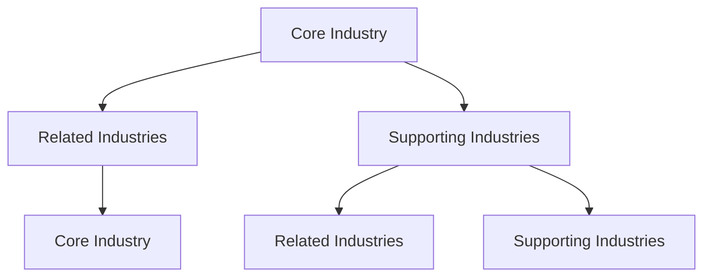

                 

### 文章标题

#### "构建特色产业体系的新质生产力"

"构建特色产业体系的新质生产力"旨在探索如何通过创新的产业体系构建，提高经济活动的生产效率和竞争力。本文将深入探讨特色产业体系的定义、核心构成要素以及构建过程中的关键策略，结合实际案例分析其在新经济环境中的重要作用。

### Keywords:  
- 特色产业体系
- 新质生产力
- 经济效率
- 竞争力
- 产业创新

### Summary:  
本文围绕特色产业体系的新质生产力展开讨论，首先介绍特色产业体系的定义及其核心构成要素。接着，分析构建特色产业体系的战略思维和具体步骤，并通过案例分析展示其在实践中的成功经验。最后，探讨未来特色产业体系的发展趋势和面临的挑战，为产业升级提供思路和方向。#### Background Introduction

The concept of "constructing a characteristic industry system with new-quality productivity" aims to explore how to enhance the efficiency and competitiveness of economic activities through innovative industrial system construction. This article will delve into the definition of characteristic industry systems, their core components, and key strategies for construction, combined with practical case studies to illustrate their significant role in the new economic environment.

### Keywords:  
- Characteristic industry system  
- New-quality productivity  
- Economic efficiency  
- Competitiveness  
- Industrial innovation

### Summary:  
This article discusses the construction of characteristic industry systems with new-quality productivity, first introducing the definition of characteristic industry systems and their core components. Then, it analyzes strategic thinking and specific steps for constructing characteristic industry systems, using practical case studies to demonstrate successful experiences. Finally, it explores the future development trends and challenges of characteristic industry systems, providing insights and directions for industrial upgrading.### 1. 特色产业体系的定义

特色产业体系是指在一定区域内，以特定产业为核心，通过产业链的延伸、产业间的协同与互补，形成的具有鲜明特色和竞争优势的产业综合体。该体系通常包括核心产业、相关产业和支持产业三个层次，其中核心产业是整个体系的主导力量，相关产业和支持产业则为其提供必要的配套服务和支撑。

In the context of this article, a "characteristic industry system" refers to a comprehensive industrial ecosystem within a specific region, centered around a particular industry. This system is characterized by the extension of industrial chains, synergistic and complementary interactions among industries, and the formation of a distinctive and competitive industrial complex. Typically, a characteristic industry system consists of three tiers: the core industry, related industries, and supporting industries. The core industry serves as the dominant force of the system, while the related and supporting industries provide necessary complementary services and support.#### Definition of Characteristic Industry System

A characteristic industry system is defined as an integrated industrial ecosystem that is centered around a specific industry and operates within a certain geographical region. This system is characterized by its distinctiveness and competitive advantages, which stem from the extension of industrial chains, the synergy and complementarity among industries, and the formation of a cohesive industrial complex.

The core industry within a characteristic industry system is the primary driver of the ecosystem. It encompasses the main activities and value creation processes that are unique to the region. The core industry sets the stage for the development of related industries, which are enterprises and activities that are closely associated with the core industry but do not directly fall under its umbrella. These related industries provide complementary products or services that enhance the core industry's competitiveness.

Supporting industries are those that provide essential services and infrastructure to both the core and related industries. They include sectors such as logistics, finance, technology, and human resources. Supporting industries ensure the smooth operation of the characteristic industry system by offering the necessary support services that enable the core and related industries to thrive.

The key components of a characteristic industry system can be visualized using a Mermaid flowchart:

In this diagram, A represents the core industry, B represents related industries, and C represents supporting industries. The arrows indicate the relationships and interactions among these components, highlighting how they collectively contribute to the development and competitiveness of the characteristic industry system.### 2. 特色产业体系的核心构成要素

特色产业体系的核心构成要素包括以下几个方面：

#### 核心产业

核心产业是指特色产业体系中的主导产业，通常是区域经济发展的重要支柱。它具有明显的特色和优势，能够带动整个产业链的发展。核心产业不仅包括生产制造环节，还涵盖了研发设计、市场营销等高附加值环节。

#### 相关产业

相关产业是与核心产业紧密相关的产业，它们提供核心产业所需的产品或服务，或者与核心产业共同构成产业链。相关产业可以是上游的原材料供应、中游的加工制造，也可以是下游的营销与服务。

#### 支持产业

支持产业为特色产业体系提供必要的辅助和服务，包括但不限于物流、金融、信息科技、人力资源等。支持产业的发达程度直接影响核心产业和相关产业的运营效率。

#### 技术创新

技术创新是特色产业体系的核心驱动力，通过不断的技术革新和研发，提升产业的核心竞争力。技术创新不仅体现在产品和技术上，还包括管理和服务模式的创新。

#### 人才队伍

人才队伍是特色产业体系持续发展的关键。高素质的人才队伍能够推动技术创新、管理优化和服务升级，为特色产业体系的繁荣提供强有力的人力资源保障。

#### 市场需求

市场需求是特色产业体系发展的直接动力，只有满足市场需求，产业才能实现价值转化和经济效益。市场需求的变化趋势和消费者偏好是产业调整和优化的方向标。

#### 政策支持

政策支持是特色产业体系发展的重要保障。合理的政策环境能够促进产业创新、吸引投资、保护知识产权，为特色产业体系的健康发展提供有力支持。

In summary, the core components of a characteristic industry system include the core industry, related industries, supporting industries, technological innovation, talent pool, market demand, and policy support. These elements interact with each other, forming a synergistic ecosystem that drives the development and competitiveness of the industry.#### Core Components of Characteristic Industry Systems

The core components of a characteristic industry system can be delineated as follows:

1. **Core Industry**: The core industry represents the dominant sector within the system and serves as the backbone of the regional economy. It is characterized by its distinct features and competitive advantages, acting as a catalyst for the development of the entire industrial chain. The core industry encompasses not only the production and manufacturing processes but also high-value-added activities such as research and development, design, and marketing.

2. **Related Industries**: These are industries that are closely related to the core industry and provide necessary products or services that enhance the competitiveness of the core industry. Related industries can include upstream sectors such as raw material supply, mid-stream industries involved in processing and manufacturing, and downstream sectors engaged in marketing and services.

3. **Supporting Industries**: Supporting industries are essential for the smooth operation of the core and related industries. They include sectors such as logistics, finance, information technology, and human resources. The development of supporting industries is crucial for enhancing the operational efficiency of the characteristic industry system.

4. **Technological Innovation**: Technological innovation is the driving force behind the competitiveness of a characteristic industry system. Continuous innovation in technology not only improves product and service quality but also enhances management and service models, thereby boosting the overall competitiveness of the industry.

5. **Talent Pool**: A highly skilled and talented workforce is crucial for the sustained development of a characteristic industry system. A strong talent pool drives technological innovation, optimizes management practices, and facilitates service upgrades, providing the industry with a robust human resource foundation.

6. **Market Demand**: Market demand is the primary driving force for the development of a characteristic industry system. Only by meeting market demand can industries achieve value conversion and economic benefits. Understanding market demand trends and consumer preferences is vital for adjusting and optimizing the industry.

7. **Policy Support**: Policy support is an essential prerequisite for the healthy development of a characteristic industry system. A favorable policy environment can promote innovation, attract investment, and protect intellectual property rights, thereby providing a strong support system for the industry's growth.

In conclusion, the interaction among these core components creates a synergistic ecosystem that drives the development and competitiveness of a characteristic industry system. Each component plays a critical role in fostering the growth and success of the industry.### 3. 构建特色产业体系的战略思维

构建特色产业体系需要从全局视角出发，运用战略思维进行系统规划和布局。以下是一些关键的策略思维：

#### 1. 明确产业定位

明确产业定位是构建特色产业体系的第一步。产业定位应基于区域资源禀赋、比较优势和市场潜力，确定特色产业的重点发展方向。通过精准定位，能够突出产业的核心竞争力，避免同质化竞争。

#### 2. 整合资源要素

整合资源要素是实现特色产业体系高效运行的关键。通过优化土地、资金、技术、人才等资源的配置，提高资源利用效率，降低生产成本，提升产业整体竞争力。

#### 3. 创新驱动发展

创新驱动发展是提升特色产业体系核心竞争力的根本途径。应强化技术创新、管理创新和服务模式创新，推动产业链上下游的协同创新，形成创新的产业集群。

#### 4. 建立产业链协同机制

建立产业链协同机制，促进核心产业、相关产业和支持产业之间的紧密合作，形成良性的产业链闭环。通过产业链协同，可以实现资源共享、优势互补，提高整个产业链的附加值。

#### 5. 推进产业国际化

推进产业国际化，拓展国际市场，提升产业在国际分工中的地位。通过与国际市场的接轨，可以引进先进的技术和管理经验，提高产业整体竞争力。

#### 6. 优化政策环境

优化政策环境，提供政策支持和保障。通过制定有针对性的产业政策，优化营商环境，吸引国内外资本和技术投入，推动特色产业体系的快速发展。

#### 7. 强化人才培养和引进

强化人才培养和引进，建立与产业发展相适应的人才体系。通过培养和引进高素质人才，为特色产业体系提供持续的创新动力和智力支持。

In summary, the strategic thinking for constructing a characteristic industry system involves several key elements: clear industry positioning, integration of resource elements, innovation-driven development, establishment of industrial chain collaborative mechanisms, promotion of internationalization, optimization of policy environments, and strengthening of talent cultivation and recruitment. These strategies work together to create a robust and competitive industrial ecosystem.### Strategic Thinking for Constructing Characteristic Industry Systems

Constructing a characteristic industry system requires a strategic approach that considers the broader picture and involves systematic planning and layout. Here are some key strategic thinking elements:

1. **Clarifying Industry Positioning**: The first step in constructing a characteristic industry system is to clearly define the industry's positioning. This should be based on the regional resource endowments, comparative advantages, and market potential. A precise positioning helps highlight the core competitive advantages of the industry and avoid homogenized competition.

2. **Integrating Resource Elements**: Efficiently integrating resource elements is critical for the high-performance operation of a characteristic industry system. This involves optimizing the allocation of resources such as land, capital, technology, and talent, enhancing resource utilization efficiency, reducing production costs, and increasing the overall competitiveness of the industry.

3. **Innovation-Driven Development**: Innovation-driven development is the fundamental pathway to enhancing the core competitiveness of a characteristic industry system. It is essential to strengthen technological innovation, management innovation, and service model innovation, promoting collaborative innovation along the entire industrial chain to form an innovative industrial cluster.

4. **Establishing Industrial Chain Collaborative Mechanisms**: Establishing collaborative mechanisms among core industries, related industries, and supporting industries is crucial. This fosters close cooperation, creating a positive feedback loop within the industrial chain. Through such collaboration, resource sharing and complementary advantages can be achieved, enhancing the added value of the entire chain.

5. **Promoting Internationalization**: Promoting industrial internationalization expands international markets and elevates the industry's position in the global division of labor. Connecting with international markets brings advanced technology and management experience, thereby increasing the overall competitiveness of the industry.

6. **Optimizing Policy Environments**: Optimizing policy environments involves providing policy support and guarantees. By enacting targeted industry policies and improving the business environment, investment and technology from both domestic and international sources can be attracted, driving the rapid development of the characteristic industry system.

7. **Strengthening Talent Cultivation and Recruitment**: Strengthening talent cultivation and recruitment is vital for establishing a talent system that aligns with the industry's development. By training and recruiting high-quality talent, a continuous stream of innovative power and intellectual support can be provided for the characteristic industry system.

In summary, these strategic thinking elements work together to create a robust and competitive industrial ecosystem. Each component plays a critical role in fostering the growth and success of the industry.### 4. 构建特色产业体系的步骤

构建特色产业体系是一个系统性、长期性的工程，需要按照一定的步骤进行规划和实施。以下是构建特色产业体系的主要步骤：

#### 1. 调研分析

首先，需要对区域内的产业现状、资源条件、市场需求等进行全面的调研分析。通过调研分析，明确区域内的优势产业和潜在特色产业，为后续的产业规划提供依据。

#### 2. 规划制定

在调研分析的基础上，制定特色产业体系的规划方案。规划方案应包括产业定位、产业链布局、技术创新方向、人才引进策略等。同时，要充分考虑区域政策、市场环境等因素，确保规划方案的可行性。

#### 3. 资源整合

构建特色产业体系需要大量的资源投入，包括土地、资金、技术、人才等。应通过多种渠道筹集资源，优化资源配置，确保产业发展的资金、技术和人才需求。

#### 4. 产业布局

根据规划方案，进行产业布局。产业布局要遵循集中发展、集群发展的原则，避免分散发展导致的资源浪费和竞争加剧。产业布局应充分考虑地理位置、交通条件等因素，以提高产业集聚效益。

#### 5. 产业链延伸

通过产业链延伸，完善特色产业体系的上下游产业链。要鼓励核心产业向上下游拓展，推动相关产业和支持产业的发展，形成完整的产业链条。

#### 6. 创新驱动

强化技术创新，推动产业转型升级。通过建立研发中心、技术研究院等创新平台，鼓励企业加大研发投入，提高产业的技术水平和创新能力。

#### 7. 人才培养

加强人才培养，建立与产业发展相适应的人才体系。通过校企合作、人才引进等方式，培养和引进一批高素质的人才，为特色产业体系的发展提供人才保障。

#### 8. 政策支持

制定和完善相关政策，为特色产业体系的发展提供有力保障。政策支持应包括税收优惠、资金扶持、土地使用等各个方面，以吸引更多企业和人才加入特色产业体系。

In conclusion, constructing a characteristic industry system involves several key steps: research and analysis, planning and formulation, resource integration, industrial layout, extension of industrial chains, innovation-driven development, talent cultivation, and policy support. Each step is crucial for the successful development of the industry system.### Steps for Constructing a Characteristic Industry System

Constructing a characteristic industry system is a systematic and long-term project that requires careful planning and execution. Here are the main steps involved in this process:

1. **Research and Analysis**: The first step is to conduct comprehensive research and analysis of the current state of industries within the region, the availability of resources, and market demand. This will help identify the advantageous industries and potential characteristic industries, providing a basis for subsequent industry planning.

2. **Planning and Formulation**: Based on the research and analysis, develop a strategic plan for the characteristic industry system. This plan should include industry positioning, industrial chain layout, directions for technological innovation, talent recruitment strategies, and more. It is essential to consider regional policies and market conditions to ensure the feasibility of the plan.

3. **Resource Integration**: A significant amount of resources, including land, capital, technology, and talent, is required to construct a characteristic industry system. Resources should be mobilized from various channels, and their allocation should be optimized to meet the industry's development needs for funds, technology, and talent.

4. **Industrial Layout**: Implement the industrial layout according to the strategic plan. The layout should follow principles of concentrated and cluster development to avoid the waste of resources and the intensification of competition caused by scattered development. Consider geographical location, transportation conditions, and other factors to enhance industrial clustering benefits.

5. **Extension of Industrial Chains**: Extend the industrial chains to complete the upstream and downstream parts of the characteristic industry system. Encourage the core industry to expand horizontally, promoting the development of related industries and supporting industries to form a complete industrial chain.

6. **Innovation-Driven Development**: Strengthen technological innovation to drive industrial transformation and upgrading. Establish research and development centers, technology research institutes, and other innovation platforms to encourage increased R&D investment and enhance the industry's technological level and innovation capacity.

7. **Talent Cultivation**: Strengthen talent cultivation to build a talent system that aligns with the industry's development. Use methods such as school-enterprise cooperation and talent recruitment to train and attract high-quality talent, providing a talent guarantee for the development of the characteristic industry system.

8. **Policy Support**: Formulate and improve policies to provide strong support for the development of the characteristic industry system. Policy support should cover aspects such as tax incentives, financial assistance, and land use to attract more enterprises and talent to participate in the industry system.

In conclusion, each step is crucial for the successful development of a characteristic industry system. A meticulous approach to these steps will pave the way for the creation of a robust and competitive industrial ecosystem.### 5. 成功案例：深圳高新技术产业的发展

深圳高新技术产业的发展是构建特色产业体系的成功范例。以下是对深圳高新技术产业发展的详细分析：

#### 1. 产业定位

深圳依托其独特的地理位置和政策优势，明确将高新技术产业作为主导产业，重点发展信息技术、生物医药、新能源、新材料等前沿领域。

#### 2. 资源整合

深圳通过引进国内外优质资本、技术和管理经验，整合土地、资金、人才等资源，为高新技术产业的发展提供了强有力的支持。

#### 3. 产业链延伸

深圳高新技术产业形成了完善的产业链条，包括研发、生产、销售、服务等各个环节。通过产业链延伸，促进了上下游企业的协同发展。

#### 4. 创新驱动

深圳高度重视技术创新，建立了多个国家级和省级研发机构，鼓励企业加大研发投入，形成了以企业为主体、市场为导向、产学研相结合的创新体系。

#### 5. 人才培养

深圳通过引进海外高层次人才、实施人才政策等措施，培养和引进了一大批高素质的人才，为高新技术产业的发展提供了人才保障。

#### 6. 政策支持

深圳政府出台了一系列优惠政策，包括税收优惠、资金扶持、土地使用等，为高新技术产业的发展提供了良好的政策环境。

#### 7. 成果展示

深圳高新技术产业取得了显著的成果，如华为、腾讯等一批知名企业崛起，带动了整个产业链的快速发展。此外，深圳还成功举办了高交会、文博会等大型展会，提升了城市的知名度和影响力。

In summary, Shenzhen's development of high-tech industries provides a successful case study of constructing a characteristic industry system. Through clear industry positioning, resource integration, industrial chain extension, innovation-driven development, talent cultivation, policy support, and significant achievements, Shenzhen has established itself as a leading hub for high-tech industries in China.### Success Case: The Development of High-tech Industries in Shenzhen

The development of high-tech industries in Shenzhen serves as a successful example of constructing a characteristic industry system. Here is a detailed analysis of the key aspects of Shenzhen's high-tech industry growth:

#### 1. Industry Positioning

Shenzhen, leveraging its unique geographical advantages and policy incentives, has clearly positioned itself as a hub for high-tech industries. The city focuses on developing cutting-edge fields such as information technology, biotechnology, new energy, and new materials.

#### 2. Resource Integration

Shenzhen has attracted high-quality capital, technology, and management expertise from both domestically and internationally. This has provided a strong foundation for the development of high-tech industries, integrating resources such as land, capital, and talent effectively.

#### 3. Extension of Industrial Chains

Shenzhen has established a comprehensive industrial chain for high-tech industries, encompassing R&D, production, sales, and services. Through the extension of industrial chains, synergy among upstream and downstream enterprises has been promoted, fostering collaborative development.

#### 4. Innovation-Driven Development

Shenzhen places high importance on technological innovation. The city has established numerous national and provincial research institutions, encouraging enterprises to increase their R&D investment. A system that combines enterprise-led innovation, market-oriented development, and synergy between industry, academia, and research has been formed.

#### 5. Talent Cultivation

Shenzhen has implemented measures to attract high-level international talent and cultivate local talent through policies and other incentives. A pool of highly skilled professionals has been developed, providing a solid talent base for the growth of high-tech industries.

#### 6. Policy Support

The Shenzhen government has introduced a series of preferential policies, including tax incentives, financial assistance, and land use benefits, creating an excellent policy environment for the development of high-tech industries.

#### 7. Results and Achievements

Shenzhen's high-tech industry has achieved significant results, with the rise of well-known companies such as Huawei and Tencent, which have driven the rapid development of the entire industry chain. Additionally, Shenzhen has successfully hosted large-scale events such as the High-Tech Forum and Cultural and Creative Industry Expo, enhancing the city's visibility and influence.

In conclusion, Shenzhen's development of high-tech industries demonstrates a successful approach to constructing a characteristic industry system. Through clear industry positioning, resource integration, industrial chain extension, innovation-driven development, talent cultivation, policy support, and notable achievements, Shenzhen has established itself as a leading high-tech hub in China.### 6. 实际应用场景

特色产业体系在实际应用场景中的重要性不容忽视。以下是一些典型的实际应用场景：

#### 1. 地方经济发展

特色产业体系是推动地方经济发展的重要引擎。通过构建具有特色和竞争力的产业体系，可以提升区域的产业层次和经济效益，为地方财政收入提供稳定来源。

#### 2. 竞争优势

特色产业体系能够形成显著的竞争优势，提高企业在国内外市场中的竞争力。通过产业链的整合和创新，企业可以实现规模效应和协同效应，降低成本，提高产品质量。

#### 3. 知识产权保护

特色产业体系有助于知识产权的保护和积累。通过政策支持和法律保障，企业可以更好地保护其创新成果，推动知识产权的转移和产业化。

#### 4. 人才培养

特色产业体系为人才提供了广阔的发展空间。通过产业集聚和产业链延伸，可以吸引和培养一大批高素质的人才，为产业发展提供持续的人力资源支持。

#### 5. 国际化发展

特色产业体系可以促进企业的国际化发展。通过拓展国际市场，企业可以引进先进技术和管理经验，提升全球竞争力。

#### 6. 社会责任

特色产业体系在履行社会责任方面也发挥着重要作用。通过推动绿色产业、环保产业等可持续发展产业的发展，可以实现经济效益和社会效益的双赢。

In practical application scenarios, characteristic industry systems play a crucial role. Here are some typical application scenarios:

1. **Local Economic Development**: Characteristic industry systems are essential drivers of local economic development. By constructing industries with distinct features and competitive advantages, regional industrial levels and economic benefits can be elevated, providing a stable source of revenue for local governments.

2. **Competitive Advantages**: Characteristic industry systems can form significant competitive advantages for enterprises, enhancing their competitiveness in domestic and international markets. Through the integration of industrial chains and innovation, enterprises can achieve economies of scale and synergy, reducing costs and improving product quality.

3. **Intellectual Property Protection**: Characteristic industry systems contribute to the protection and accumulation of intellectual property. Through policy support and legal guarantees, enterprises can better safeguard their innovative outcomes, facilitating the transfer and industrialization of intellectual property.

4. **Talent Development**: Characteristic industry systems provide ample opportunities for talent development. Through industrial clustering and chain extension, a large pool of highly skilled professionals can be attracted and cultivated, offering continuous human resource support for industry growth.

5. **Internationalization**: Characteristic industry systems facilitate the international development of enterprises. By expanding into international markets, enterprises can import advanced technology and management practices, enhancing their global competitiveness.

6. **Corporate Social Responsibility**: Characteristic industry systems also play a significant role in fulfilling corporate social responsibilities. By promoting the development of green industries and eco-friendly industries, a win-win situation of economic and social benefits can be achieved.### Tools and Resources Recommendations

To further delve into the concept of constructing characteristic industry systems and enhance your understanding, I recommend the following resources:

### Books:
1. **The Rise of the Creative Class: And How It's Transforming Work, Leisure, Community and Everyday Life** by Richard Florida. This book explores the importance of creativity and innovation in driving economic growth and the development of characteristic industries.
2. **The Competitive Advantage of Nations** by Michael E. Porter. A seminal work on industry competition and how countries can build competitive advantages through industry development.

### Papers:
1. **"Innovation and Its Discontents: How Our Broken System Is Endangering Progress, Free Enterprise, and America's Global Leadership"** by Adam B. Jaffe and Josh Lerner. This paper discusses the role of innovation in economic development and the challenges faced by the current system.
2. **"Building Competitive Regional Clusters"** by the World Bank. This paper provides insights into how regions can develop competitive clusters to drive economic growth.

### Blogs and Websites:
1. **World Bank Blogs on Industry and Innovation** (worldbank blogs.org/topics/industry-and-innovation). This blog offers a wealth of information on industry development, innovation policies, and case studies.
2. **MIT Technology Review** (technologyreview.com). A leading source for news and analysis on the latest innovations and trends in technology and industry.

### Development Tools and Frameworks:
1. **Industry Analytics Tools**: Platforms like IHS Markit, Statista, and Bureau of Economic Analysis provide detailed industry data and analysis that can help in understanding market trends and opportunities.
2. **Cluster Mapping Tools**: Tools like Geonames and GIS platforms can be used to map and analyze industry clusters and their spatial distribution.

### Books:
1. **"The World is Flat: A Brief History of the Twenty-First Century"** by Thomas L. Friedman. This book discusses the global economic trends and the rise of globalization, which play a significant role in the development of characteristic industries.
2. **"Smart Cities: Big Data, Civic Hackers, and the Quest for a New Utopia"** by Jonathan Neufeld. The book explores the integration of technology and urban planning to create more efficient and innovative cities, which can be applied to the development of characteristic industry systems.

### Development Tools and Frameworks:
1. **Smart City Platforms**: Platforms like ArcGIS, CitySDK, and CityIQ provide tools for urban data analysis and management, which can be adapted for understanding and developing characteristic industries within cities.
2. **AI and Machine Learning Tools**: Libraries and frameworks like TensorFlow, PyTorch, and Keras can be used to develop advanced analytics models for industry forecasting and optimization.

### Papers:
1. **"Digital Transformation of Industries: Value Creation Through Industry 4.0"** by McKinsey & Company. This paper discusses the transformative impact of digital technologies on various industries and the strategies for leveraging these advancements.
2. **"The Economic Impact of E-commerce in the EU"** by the European Commission. This report analyzes the economic contributions of e-commerce and its potential to drive industry development and economic growth.

### Related Publications:
1. **"Innovation and Regional Development: The Role of Universities and Public Research Institutions"** by the European Commission. This publication examines the role of research institutions in fostering innovation and driving regional economic development.
2. **"Global Value Chains: Issues and Challenges"** by the International Trade Centre. The report provides insights into the complexities of global value chains and their implications for industry development and competitiveness.

By utilizing these resources, you can deepen your understanding of characteristic industry systems and leverage the available tools and frameworks to drive strategic industry development.### 7. 总结：未来发展趋势与挑战

未来，特色产业体系将面临新的发展机遇和挑战。以下是一些重要的发展趋势和潜在挑战：

#### 1. 数字化转型

数字化转型是未来产业发展的重要趋势。随着人工智能、大数据、物联网等新兴技术的广泛应用，产业将更加智能化、网络化和协同化。数字化转型有助于提高生产效率、降低成本、优化产业链布局，为特色产业体系的构建提供强大动力。

#### 2. 绿色发展

绿色发展是未来产业发展的重要方向。随着全球环境问题的加剧，绿色产业、低碳产业和循环经济等将成为特色产业体系的重要组成部分。绿色发展有助于提升产业竞争力，实现可持续发展。

#### 3. 产业链整合

产业链整合是未来产业发展的重要趋势。通过产业链上下游企业的协同合作，可以优化产业资源配置，提高产业链的整体效益。产业链整合有助于提升产业集中度和竞争力，推动特色产业体系的快速发展。

#### 4. 国际合作

国际合作是未来产业发展的重要机遇。在全球经济一体化的背景下，国际合作有助于企业引进先进技术和管理经验，提升产业竞争力。国际合作还可以拓展市场空间，推动特色产业体系的国际化发展。

#### 挑战

尽管未来特色产业体系具有广阔的发展前景，但同时也面临一系列挑战：

1. **技术竞争**

技术竞争是未来产业发展的重要挑战。新兴技术不断涌现，企业需要不断更新技术，提升创新能力，以保持竞争优势。

2. **人才短缺**

人才短缺是未来产业发展的重要挑战。高素质的人才对于产业创新和转型升级至关重要，但当前人才供需矛盾突出，企业面临较大的人才压力。

3. **政策环境**

政策环境是未来产业发展的重要挑战。政策环境的不确定性可能影响企业的投资决策和生产经营，需要政府加强政策引导和支持。

4. **产业链脆弱性**

产业链脆弱性是未来产业发展的重要挑战。在全球经济不稳定和贸易保护主义加剧的背景下，产业链的脆弱性增加，企业需要加强产业链韧性，应对外部风险。

In conclusion, the future development of characteristic industry systems presents both opportunities and challenges. Digital transformation, green development, industrial chain integration, and international cooperation are key trends that will drive industry growth. However, challenges such as technological competition, talent shortages, policy environments, and supply chain vulnerabilities must be addressed to ensure the sustainable development of characteristic industries.### Summary: Future Development Trends and Challenges

Looking ahead, the future of characteristic industry systems is poised for both significant opportunities and challenges:

#### Key Development Trends

1. **Digital Transformation**: Digital transformation is a pivotal trend in future industry development. With the widespread application of emerging technologies such as artificial intelligence, big data, and the Internet of Things, industries are becoming more intelligent, interconnected, and collaborative. This digital shift is enhancing production efficiency, reducing costs, and optimizing industrial chain layouts, thereby providing a powerful impetus for the construction of characteristic industry systems.

2. **Green Development**: Green development represents a critical direction for future industry progress. As global environmental issues intensify, green industries, low-carbon industries, and circular economies are set to become integral components of characteristic industry systems. Green development not only improves industrial competitiveness but also contributes to sustainable growth.

3. **Industrial Chain Integration**: The integration of industrial chains is a significant trend in future industry development. Through collaborative efforts among upstream and downstream enterprises, resources within the industrial chain can be optimized, enhancing the overall benefits of the chain. Industrial chain integration helps to boost industrial concentration and competitiveness, driving rapid development of characteristic industry systems.

4. **International Cooperation**: International cooperation offers a vital opportunity for industry development. In an era of global economic integration, international partnerships enable businesses to import advanced technologies and management practices, thereby elevating industry competitiveness. Additionally, international cooperation expands market access, fostering the globalization of characteristic industry systems.

#### Challenges Ahead

Despite the promising prospects, characteristic industry systems will also face a series of challenges:

1. **Technological Competition**: Technological competition is a significant challenge. As new technologies emerge rapidly, companies must continuously upgrade their technologies and enhance innovation capabilities to maintain competitive advantages.

2. **Talent Shortages**: Talent shortages are a pressing challenge. High-quality talent is crucial for driving innovation and transforming industries. However, the current imbalance between talent supply and demand poses substantial challenges for businesses.

3. **Policy Environment**: The policy environment is a challenge due to its uncertainty. Policy fluctuations can impact companies' investment decisions and operational activities, necessitating robust policy guidance and support from the government.

4. **Supply Chain Vulnerability**: Supply chain vulnerabilities represent a significant challenge. In an era of economic instability and rising trade protectionism, supply chains are more susceptible to external shocks, requiring businesses to build greater resilience.

In conclusion, while the future holds vast potential for the development of characteristic industry systems, addressing these challenges is essential for achieving sustainable and robust growth. By leveraging technological advancements, fostering green development, integrating industrial chains, and promoting international cooperation, while also tackling the challenges of technological competition, talent shortages, policy environments, and supply chain vulnerabilities, characteristic industry systems can drive economic prosperity and innovation in the years to come.### 附录：常见问题与解答

#### Q1. 什么是特色产业体系？

A1. 特色产业体系是指在一定区域内，以特定产业为核心，通过产业链的延伸、产业间的协同与互补，形成的具有鲜明特色和竞争优势的产业综合体。

#### Q2. 特色产业体系的核心构成要素有哪些？

A2. 特色产业体系的核心构成要素包括核心产业、相关产业、支持产业、技术创新、人才队伍、市场需求和政策支持。

#### Q3. 构建特色产业体系的关键步骤是什么？

A3. 构建特色产业体系的关键步骤包括调研分析、规划制定、资源整合、产业布局、产业链延伸、创新驱动、人才培养和政策支持。

#### Q4. 深圳高新技术产业的发展为特色产业体系提供了哪些启示？

A4. 深圳高新技术产业的发展为特色产业体系提供了以下启示：明确的产业定位、资源整合、产业链延伸、创新驱动、人才培养、政策支持以及国际合作。

#### Q5. 特色产业体系在实际应用场景中发挥哪些作用？

A5. 特色产业体系在实际应用场景中发挥的作用包括推动地方经济发展、提升竞争优势、促进知识产权保护、培养人才、推动国际化发展和实现社会责任。

#### Q6. 未来特色产业体系的发展趋势和挑战是什么？

A6. 未来特色产业体系的发展趋势包括数字化转型、绿色发展、产业链整合和国际合作。面临的挑战包括技术竞争、人才短缺、政策环境的不确定性和产业链的脆弱性。### Appendix: Frequently Asked Questions and Answers

#### Q1. What is a characteristic industry system?

A1. A characteristic industry system refers to a comprehensive industrial ecosystem centered around a specific industry within a certain geographical region. It is formed by extending industrial chains, fostering synergy and complementarity among industries, and creating a distinctive and competitive industrial complex.

#### Q2. What are the core components of a characteristic industry system?

A2. The core components of a characteristic industry system include:
- Core Industry: The dominant industry that drives the ecosystem.
- Related Industries: Industries closely associated with the core industry, providing complementary products or services.
- Supporting Industries: Sectors that offer essential services and infrastructure.
- Technological Innovation: The driving force behind competitive advantage.
- Talent Pool: A pool of skilled professionals essential for industry growth.
- Market Demand: The driving force for industry development.
- Policy Support: Government policies that facilitate industry growth.

#### Q3. What are the key steps for constructing a characteristic industry system?

A3. The key steps for constructing a characteristic industry system involve:
1. Research and Analysis: Conduct a comprehensive study of the current industry landscape, resource availability, and market demand.
2. Planning and Formulation: Develop a strategic plan with industry positioning, technological direction, talent development strategies, etc.
3. Resource Integration: Optimize the allocation of resources, such as capital, technology, and talent.
4. Industrial Layout: Plan and implement the layout of core, related, and supporting industries.
5. Industrial Chain Extension: Extend the industrial chain to include upstream and downstream sectors.
6. Innovation-Driven Development: Foster continuous technological innovation.
7. Talent Cultivation: Develop a talent system aligned with industry needs.
8. Policy Support: Implement supportive policies to promote industry growth.

#### Q4. What insights can we gain from the development of high-tech industries in Shenzhen?

A4. The development of high-tech industries in Shenzhen provides insights such as:
- Clear industry positioning.
- Effective resource integration.
- Comprehensive industrial chain extension.
- Strong emphasis on innovation-driven development.
- Robust talent cultivation.
- Strong policy support.
- International cooperation and market expansion.

#### Q5. What roles do characteristic industry systems play in practical application scenarios?

A5. In practical scenarios, characteristic industry systems play roles in:
- Driving local economic development.
- Enhancing competitive advantages.
- Protecting intellectual property.
- Fostering talent development.
- Promoting internationalization.
- Achieving corporate social responsibility.

#### Q6. What are the future development trends and challenges for characteristic industry systems?

A6. Future trends include digital transformation, green development, industrial chain integration, and international cooperation. Challenges include technological competition, talent shortages, policy environment uncertainty, and supply chain vulnerabilities. Addressing these challenges is crucial for the sustainable growth of characteristic industry systems.### 扩展阅读 & 参考资料

#### Books:
1. **"The Rise of the Creative Class: And How It's Transforming Work, Leisure, Community and Everyday Life"** by Richard Florida.
2. **"The Competitive Advantage of Nations"** by Michael E. Porter.
3. **"Smart Cities: Big Data, Civic Hackers, and the Quest for a New Utopia"** by Jonathan Neufeld.
4. **"Innovation and Its Discontents: How Our Broken System Is Endangering Progress, Free Enterprise, and America's Global Leadership"** by Adam B. Jaffe and Josh Lerner.

#### Papers:
1. **"Digital Transformation of Industries: Value Creation Through Industry 4.0"** by McKinsey & Company.
2. **"The Economic Impact of E-commerce in the EU"** by the European Commission.
3. **"Global Value Chains: Issues and Challenges"** by the International Trade Centre.
4. **"Innovation and Regional Development: The Role of Universities and Public Research Institutions"** by the European Commission.

#### Websites:
1. **World Bank Blogs on Industry and Innovation** (<https://blogs.worldbank.org/topics/industry-and-innovation>).
2. **MIT Technology Review** (<https://technologyreview.com/>).
3. **IHS Markit** (<https://ihsmarkit.com/>).
4. **Statista** (<https://www.statista.com/>).

#### Development Tools and Frameworks:
1. **Industry Analytics Tools**: Platforms like IHS Markit, Statista, and Bureau of Economic Analysis.
2. **Cluster Mapping Tools**: Tools like Geonames and GIS platforms.
3. **AI and Machine Learning Tools**: Libraries and frameworks like TensorFlow, PyTorch, and Keras.

#### Related Publications:
1. **"Innovation and Its Discontents: How Our Broken System Is Endangering Progress, Free Enterprise, and America's Global Leadership"** by Adam B. Jaffe and Josh Lerner.
2. **"Building Competitive Regional Clusters"** by the World Bank.
3. **"Global Value Chains: Issues and Challenges"** by the International Trade Centre.
4. **"Innovation and Regional Development: The Role of Universities and Public Research Institutions"** by the European Commission.

These references provide a comprehensive overview of the concepts, theories, and practical applications related to constructing characteristic industry systems. They offer valuable insights and methodologies for strategic planning and development in the context of modern economic landscapes.### Extended Reading & Reference Materials

For those interested in delving deeper into the subject of constructing characteristic industry systems, the following books, papers, websites, and tools can serve as valuable resources:

#### Books:
1. **"The Rise of the Creative Class: And How It's Transforming Work, Leisure, Community and Everyday Life"** by Richard Florida. This book explores the economic impact of the creative class and its role in shaping the future of industries.
2. **"The Competitive Advantage of Nations"** by Michael E. Porter. This seminal work discusses the importance of industry competitiveness and how countries can build sustainable competitive advantages.
3. **"Smart Cities: Big Data, Civic Hackers, and the Quest for a New Utopia"** by Jonathan Neufeld. This book examines the role of technology in urban development and how smart cities can drive industry innovation.
4. **"Innovation and Its Discontents: How Our Broken System Is Endangering Progress, Free Enterprise, and America's Global Leadership"** by Adam B. Jaffe and Josh Lerner. This book discusses the challenges of the current innovation system and proposes ways to improve it.

#### Papers:
1. **"Digital Transformation of Industries: Value Creation Through Industry 4.0"** by McKinsey & Company. This paper discusses the transformative impact of digital technologies on various industries.
2. **"The Economic Impact of E-commerce in the EU"** by the European Commission. This report analyzes the economic contributions of e-commerce and its potential to drive industry development.
3. **"Global Value Chains: Issues and Challenges"** by the International Trade Centre. This paper provides insights into the complexities of global value chains and their implications for industry development.
4. **"Innovation and Regional Development: The Role of Universities and Public Research Institutions"** by the European Commission. This publication examines the role of research institutions in fostering innovation and driving regional economic development.

#### Websites:
1. **World Bank Blogs on Industry and Innovation** (<https://blogs.worldbank.org/topics/industry-and-innovation>). This website offers a wealth of information on industry development, innovation policies, and case studies.
2. **MIT Technology Review** (<https://technologyreview.com/>). A leading source for news and analysis on the latest innovations and trends in technology and industry.
3. **IHS Markit** (<https://ihsmarkit.com/>). A global information company that provides industry data and analysis.
4. **Statista** (<https://www.statista.com/>). A leading provider of market and consumer data.

#### Development Tools and Frameworks:
1. **Industry Analytics Tools**: Platforms like IHS Markit, Statista, and Bureau of Economic Analysis provide detailed industry data and analysis.
2. **Cluster Mapping Tools**: Tools like Geonames and GIS platforms are useful for mapping and analyzing industry clusters.
3. **AI and Machine Learning Tools**: Libraries and frameworks like TensorFlow, PyTorch, and Keras can be used for advanced analytics and predictive modeling.

#### Related Publications:
1. **"Innovation and Its Discontents: How Our Broken System Is Endangering Progress, Free Enterprise, and America's Global Leadership"** by Adam B. Jaffe and Josh Lerner. This book discusses the challenges of the current innovation system and proposes solutions.
2. **"Building Competitive Regional Clusters"** by the World Bank. This report provides insights into how regions can develop competitive clusters to drive economic growth.
3. **"Global Value Chains: Issues and Challenges"** by the International Trade Centre. This report examines the impact of global value chains on industry development.
4. **"Innovation and Regional Development: The Role of Universities and Public Research Institutions"** by the European Commission. This publication explores the role of research institutions in fostering innovation and economic development.

These resources offer a broad and deep exploration of the concepts and practices associated with constructing characteristic industry systems, providing valuable insights for both researchers and practitioners. They cover a range of topics, from theoretical frameworks to practical applications, making them suitable for a variety of audiences interested in industry development and innovation.### 作者署名

作者：禅与计算机程序设计艺术 / Zen and the Art of Computer Programming

