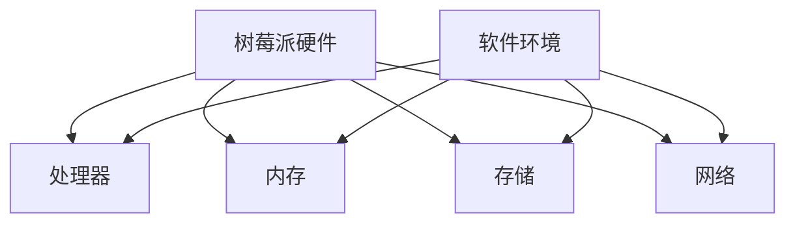
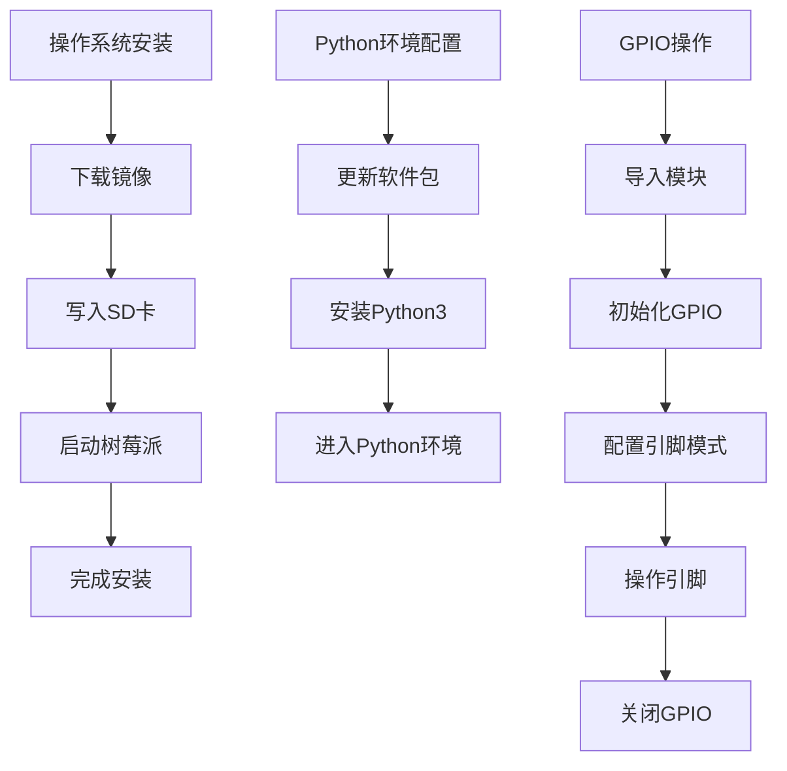

                 

# 树莓派项目开发：从入门到精通

## 概述

树莓派是一款低成本、高度灵活的单板计算机，因其强大的性能和低功耗，成为了DIY爱好者和教育领域的热门选择。本文旨在为您提供一个从入门到精通的树莓派项目开发指南，帮助您深入了解树莓派的软硬件资源，学会如何搭建开发环境、编写代码、调试和优化项目，并最终实现您的创意。

通过本文，您将了解到：

1. 树莓派的背景介绍与硬件规格。
2. 开发环境的搭建步骤。
3. 树莓派编程的核心概念。
4. 数学模型与算法原理。
5. 实际项目开发实例。
6. 树莓派的实际应用场景。
7. 开发工具和资源的推荐。
8. 未来发展趋势与挑战。
9. 常见问题与解答。
10. 扩展阅读与参考资料。

## 1. 背景介绍（Background Introduction）

### 树莓派的起源与发展

树莓派是由英国慈善基金会 Raspberry Pi Foundation 发起的一个项目，旨在激发学生对计算机科学和编程的兴趣。自2012年首次发布以来，树莓派已经经历了多个版本的迭代，从最初的 Model B 到最新的 4B+，性能和功能都有了显著提升。

### 树莓派的应用领域

树莓派的广泛应用领域包括家庭自动化、物联网（IoT）、教育、机器人、媒体中心等。由于其开源的软件生态和相对较低的成本，它成为了许多创意项目的理想选择。

### 树莓派的硬件规格

树莓派的核心硬件包括：

- 处理器：基于ARM的 Broadcom SoC
- 内存：1GB、2GB 或 4GB
- 存储：MicroSD 卡插槽
- 网络：无线局域网（Wi-Fi）和以太网
- 输入输出：多个GPIO引脚、HDMI 输出、USB 接口
- 显示：支持多种显示屏
- 音频：模拟音频输出

## 2. 核心概念与联系（Core Concepts and Connections）

### 树莓派的硬件架构

树莓派的硬件架构主要由处理器、内存、存储和网络等模块组成。其中，处理器和内存的性能直接影响系统的响应速度和任务处理能力。

### 树莓派的软件环境

树莓派搭载了基于 Linux 的操作系统，如 Raspberry Pi OS。用户可以通过命令行工具进行系统管理和软件安装。常见的软件包括编程环境（如 Python）、数据库（如 MariaDB）和Web服务器（如 Apache）。

### 树莓派的编程语言

树莓派的编程语言主要是 Python，Python 简单易学，语法直观，适合初学者上手。此外，树莓派还支持 C/C++、Java、PHP等多种编程语言。

### Mermaid 流程图



## 3. 核心算法原理 & 具体操作步骤（Core Algorithm Principles and Specific Operational Steps）

### 树莓派的操作系统安装

安装 Raspberry Pi OS 是树莓派项目开发的第一步。以下是基本步骤：

1. 下载 Raspberry Pi OS 镜像。
2. 将镜像写入 MicroSD 卡。
3. 将 MicroSD 卡插入树莓派。
4. 连接显示器、键盘和鼠标。
5. 通过电源启动树莓派。
6. 按照屏幕提示完成系统安装。

### Python 编程环境配置

在 Raspberry Pi OS 上配置 Python 编程环境，可以通过以下步骤完成：

1. 打开终端。
2. 输入 `sudo apt-get update` 更新软件包列表。
3. 输入 `sudo apt-get install python3` 安装 Python 3。
4. 输入 `python3` 进入 Python 编程环境。

### 树莓派的 GPIO 操作

GPIO（通用输入输出）是树莓派最重要的功能之一。以下是基本的 GPIO 操作步骤：

1. 导入 GPIO 模块：`import RPi.GPIO as GPIO`。
2. 初始化 GPIO：`GPIO.setmode(GPIO.BCM)`。
3. 配置引脚模式：`GPIO.setup(pin, GPIO.OUT)`。
4. 操作引脚：`GPIO.output(pin, value)`。
5. 关闭 GPIO：`GPIO.cleanup()`。

### Mermaid 流程图



## 4. 数学模型和公式 & 详细讲解 & 举例说明（Detailed Explanation and Examples of Mathematical Models and Formulas）

### PID 控制器

PID（比例-积分-微分）控制器是一种常用的控制算法，广泛应用于工业控制和嵌入式系统中。其数学模型如下：

$$
u(t) = K_p e(t) + K_i \int_{0}^{t} e(\tau)d\tau + K_d \frac{de(t)}{dt}
$$

其中，$u(t)$ 是控制输出，$e(t)$ 是误差，$K_p$、$K_i$、$K_d$ 分别是比例、积分和微分的系数。

### PID 控制器参数调整

PID 控制器的性能很大程度上取决于参数的设置。常见的参数调整方法包括：

1. 比例增益 $K_p$：增大 $K_p$ 可以提高系统的响应速度，但过大会导致系统振荡。
2. 积分增益 $K_i$：增大 $K_i$ 可以消除稳态误差，但过大会导致系统响应缓慢。
3. 微分增益 $K_d$：增大 $K_d$ 可以改善系统的动态性能，减少超调，但过大会导致系统过于敏感。

### PID 控制器实现示例

```python
import RPi.GPIO as GPIO
import time

# 初始化 GPIO
GPIO.setmode(GPIO.BCM)
GPIO.setup(18, GPIO.OUT)

# 创建 PWM 实例
p = GPIO.PWM(18, 1000)  # 1000 Hz 的频率

# PID 参数
Kp = 2
Ki = 0.1
Kd = 1

# 控制器初始化
prev_error = 0
integral = 0

# 目标角度
target_angle = 90

# 循环控制
while True:
    # 读取当前角度
    current_angle = read_angle()  # 这里假设有一个函数 read_angle() 返回当前角度

    # 计算误差
    error = target_angle - current_angle

    # 计算控制输出
    p_output = Kp * error
    i_output = Ki * (error + prev_error)
    d_output = Kd * (error - 2 * prev_error + prev_prev_error)
    output = p_output + i_output + d_output

    # 输出控制信号
    p.ChangeDutyCycle(output)

    # 更新状态
    prev_prev_error = prev_error
    prev_error = error
    integral += error

    # 暂停
    time.sleep(0.01)

# 关闭 PWM
p.stop()
GPIO.cleanup()
```

### 数学公式

$$
u(t) = K_p e(t) + K_i \int_{0}^{t} e(\tau)d\tau + K_d \frac{de(t)}{dt}
$$

$$
e(t) = \frac{1}{T_s} \sum_{k=0}^{n-1} (y(k) - y_d(k))
$$

$$
u(t) = \frac{K_p e(t) + K_i \int_{0}^{t} e(\tau)d\tau + K_d \frac{de(t)}{dt}}{T_s}
$$

## 5. 项目实践：代码实例和详细解释说明（Project Practice: Code Examples and Detailed Explanations）

### 项目简介

本节将介绍一个基于树莓派的温度控制系统。该系统使用一个温度传感器（如DS18B20）来监测环境温度，并通过GPIO控制一个加热器来调节温度。

### 开发环境搭建

1. 安装 Raspberry Pi OS。
2. 更新系统：`sudo apt-get update && sudo apt-get upgrade`。
3. 安装 Python 3：`sudo apt-get install python3`。
4. 安装温度传感器驱动：`sudo apt-get install wiringpi`。

### 源代码详细实现

```python
import wiringpi
import time

# 初始化 GPIO
wiringpi.wiringPiSetup()

# 设置GPIO引脚
heater_pin = 1
wiringpi.pinMode(heater_pin, wiringpi.OUTPUT)

# 初始化温度传感器
temp_sensor = wiringpi.DS18B20(0)

# 目标温度
target_temp = 25

# 循环控制
while True:
    # 读取当前温度
    current_temp = temp_sensor.readTemp()

    # 计算误差
    error = target_temp - current_temp

    # 根据误差控制加热器
    if error > 0:
        wiringpi.digitalWrite(heater_pin, wiringpi.HIGH)
    else:
        wiringpi.digitalWrite(heater_pin, wiringpi.LOW)

    # 暂停
    time.sleep(1)

# 清理资源
wiringpi.digitalWrite(heater_pin, wiringpi.LOW)
wiringpi.pinMode(heater_pin, wiringpi.INPUT)
wiringpi.wiringPi Finish()
```

### 代码解读与分析

1. 导入 wiringpi 模块，用于控制GPIO和温度传感器。
2. 初始化GPIO，设置加热器引脚为输出模式。
3. 初始化温度传感器。
4. 进入循环，读取当前温度并计算误差。
5. 根据误差控制加热器，实现温度调节。
6. 暂停1秒，循环读取温度。

### 运行结果展示

当系统运行时，加热器会根据环境温度自动开关，以维持目标温度。可以通过串口输出查看温度变化和加热器的状态。

## 6. 实际应用场景（Practical Application Scenarios）

树莓派在各个领域都有广泛的应用，以下是一些典型的实际应用场景：

1. **智能家居**：使用树莓派监控家庭环境，如温度、湿度、光照等，并通过手机APP远程控制家居设备。
2. **物联网（IoT）**：作为物联网节点的核心控制器，树莓派可以连接各种传感器和执行器，实现智能设备和系统的互联互通。
3. **教育**：树莓派作为教学工具，帮助学生了解计算机科学、编程和电子工程等相关知识。
4. **机器人**：树莓派可以作为机器人的核心控制器，实现复杂的运动控制和任务执行。
5. **科学实验**：树莓派可以用于各种科学实验，如环境监测、气象数据采集等。

## 7. 工具和资源推荐（Tools and Resources Recommendations）

### 学习资源推荐

- **书籍**：
  - 《Raspberry Pi 教程》
  - 《树莓派编程实战》
- **论文**：
  - "Raspberry Pi: A Low-Cost, High-Performance Platform for Education and DIY Projects"
  - "Using Raspberry Pi for IoT Applications"
- **博客**：
  - Hackaday
  - Instructables
- **网站**：
  - Raspberry Pi Official Website
  - Raspberry Pi Forums

### 开发工具框架推荐

- **开发环境**：
  - PyCharm
  - Visual Studio Code
- **框架**：
  - Flask
  - Django
- **编程语言**：
  - Python
  - C/C++

### 相关论文著作推荐

- **论文**：
  - "Raspberry Pi in Education: A Review"
  - "Raspberry Pi as a Tool for IoT Applications"
- **著作**：
  - "Raspberry Pi Cookbook"
  - "Make: Raspberry Pi Projects"

## 8. 总结：未来发展趋势与挑战（Summary: Future Development Trends and Challenges）

随着技术的不断进步，树莓派的应用场景和功能将得到进一步扩展。以下是一些未来发展趋势：

1. **性能提升**：随着新型处理器的推出，树莓派的性能将得到显著提升，使其在更复杂的计算任务中表现出色。
2. **更广泛的物联网应用**：树莓派将在智能家居、智慧城市、智能农业等领域得到更广泛的应用。
3. **人工智能集成**：树莓派将更容易集成人工智能算法，如深度学习和自然语言处理，实现更加智能化的功能。
4. **教育推广**：树莓派将在全球范围内推广计算机科学和教育，培养更多科技人才。

同时，面临的挑战包括：

1. **安全性问题**：随着网络连接的增加，树莓派的安全性问题将日益突出，需要加强安全防护措施。
2. **软件生态的完善**：虽然树莓派的软件资源丰富，但仍有待进一步优化和整合，以满足不同用户的需求。
3. **普及与教育**：如何让更多人了解和使用树莓派，特别是推广到教育领域，仍需持续努力。

## 9. 附录：常见问题与解答（Appendix: Frequently Asked Questions and Answers）

### Q1：树莓派的电源要求是什么？

A1：树莓派通常需要5V/2.5A的电源。确保使用合适的电源适配器，以避免损坏设备。

### Q2：如何在树莓派上安装额外的软件？

A2：可以通过终端使用 `sudo apt-get install` 命令安装软件。例如，安装 Python 3 可以使用 `sudo apt-get install python3`。

### Q3：树莓派的 GPIO 引脚如何使用？

A3：GPIO 引脚可以通过 Python 的 wiringpi 模块进行控制。例如，初始化 GPIO 并设置一个引脚为输出模式：`import wiringpi; wiringpi.wiringPiSetup(); wiringpi.pinMode(1, wiringpi.OUTPUT)`。

### Q4：如何升级树莓派的操作系统？

A4：在终端中运行以下命令：`sudo apt-get update && sudo apt-get upgrade`。这将更新系统并安装最新的软件包。

### Q5：树莓派的网络设置有哪些方法？

A5：可以通过终端设置无线网络连接：`sudo nano /etc/wpa_supplicant/wpa_supplicant.conf`，编辑配置文件以添加无线网络信息。然后重启网络服务：`sudo systemctl restart NetworkManager`。

## 10. 扩展阅读 & 参考资料（Extended Reading & Reference Materials）

- **书籍**：
  - 《Raspberry Pi 4 Model B 用户指南》
  - 《树莓派编程：从入门到实践》
- **网站**：
  - Raspberry Pi Official Documentation
  - Adafruit Learning System
- **在线课程**：
  - Coursera - Introduction to Raspberry Pi
  - Udemy - Raspberry Pi for Beginners
- **社区论坛**：
  - Raspberry Pi Forums
  - Element14 Community

作者：禅与计算机程序设计艺术 / Zen and the Art of Computer Programming<|im_end|>

