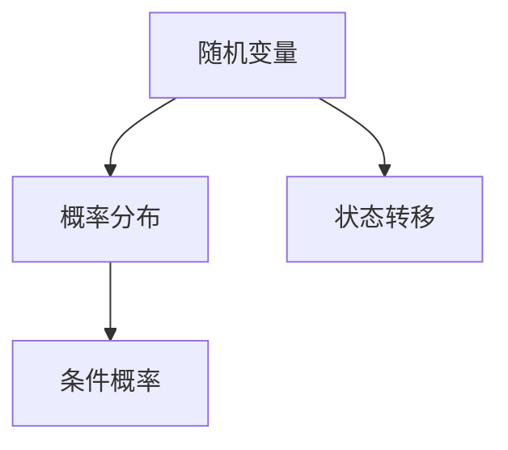

                 

# 概率性计算：大模型的生成模型

## 1. 背景介绍

概率性计算是现代计算科学中的重要组成部分，它源于对随机现象的数学描述。随着计算能力的不断增强和数据量的爆炸式增长，概率性计算在许多领域得到了广泛应用，特别是在人工智能和机器学习领域。大模型，如大型语言模型，是概率性计算的一个重要应用，它们能够处理大量数据，并生成高质量的输出。

本文旨在探讨大模型中的概率性计算，特别是生成模型。生成模型是一种通过学习数据分布来生成新数据的方法。在人工智能领域，生成模型被广泛应用于图像生成、文本生成和语音合成等任务。本文将首先介绍概率性计算的基本概念，然后深入探讨生成模型的工作原理和应用，最后讨论大模型在生成模型中的角色。

## 2. 核心概念与联系

### 2.1 概率性计算简介

概率性计算是基于概率论的一种计算方法。概率论是研究随机事件及其概率的数学分支。在概率性计算中，我们使用概率分布来描述系统的状态和事件。

一个基本的概率性计算模型通常包括以下几个组成部分：

- **随机变量**：用于描述系统的状态或事件。
- **概率分布**：描述随机变量的概率分布情况。
- **条件概率**：在给定一个随机变量的情况下，另一个随机变量的概率分布。

Mermaid 流程图如下：



### 2.2 生成模型简介

生成模型是一种通过学习数据分布来生成新数据的方法。生成模型可以分为两大类：确定性生成模型和概率性生成模型。

- **确定性生成模型**：通过学习输入数据和输出数据的映射关系，直接生成输出数据。常见的确定性生成模型包括自动编码器（Autoencoder）和循环神经网络（RNN）。

- **概率性生成模型**：通过学习数据的概率分布，生成符合该分布的输出数据。常见的概率性生成模型包括生成对抗网络（GAN）和变分自编码器（VAE）。

### 2.3 概率性计算与生成模型的关系

概率性计算是生成模型的基础。生成模型通过学习数据的概率分布，能够生成与原始数据相似的新数据。这种能力使得生成模型在图像生成、文本生成和语音合成等领域表现出色。

## 3. 核心算法原理 & 具体操作步骤

### 3.1 生成对抗网络（GAN）

生成对抗网络（GAN）是由Ian Goodfellow等人于2014年提出的。GAN由两个神经网络组成：生成器（Generator）和判别器（Discriminator）。

- **生成器**：生成器网络的目的是生成类似于真实数据的伪数据。生成器接收随机噪声作为输入，并尝试将其转化为符合数据分布的输出。

- **判别器**：判别器网络的目的是区分输入数据是真实数据还是生成器生成的伪数据。判别器接收真实数据和生成器生成的数据作为输入，并输出一个概率值，表示输入数据的真实性。

GAN的训练过程如下：

1. 初始化生成器和判别器。
2. 生成器生成伪数据。
3. 判别器接收真实数据和伪数据，并更新自己的权重。
4. 生成器接收伪数据的错误反馈，并更新自己的权重。
5. 重复步骤2-4，直到生成器生成的伪数据足够真实，判别器无法区分。

### 3.2 变分自编码器（VAE）

变分自编码器（VAE）是由Kingma和Welling于2013年提出的。VAE是一种概率性生成模型，它通过学习数据的高斯分布来生成新数据。

- **编码器**：编码器网络将输入数据映射到一个潜在空间的高斯分布参数。
- **解码器**：解码器网络从潜在空间中采样，并生成输出数据。

VAE的训练过程如下：

1. 初始化编码器和解码器。
2. 编码器接收输入数据，并输出潜在空间的高斯分布参数。
3. 从潜在空间中采样，并生成输出数据。
4. 计算输出数据的损失函数，并更新编码器和解码器的权重。
5. 重复步骤2-4，直到模型收敛。

## 4. 数学模型和公式 & 详细讲解 & 举例说明

### 4.1 生成对抗网络（GAN）

GAN的数学模型可以表示为：

$$
\begin{aligned}
\min_G & \quad \mathbb{E}_{x \sim p_{data}(x)}[\log D(x)] + \mathbb{E}_{z \sim p_z(z)}[\log(1 - D(G(z)))] \\
\max_D & \quad \mathbb{E}_{x \sim p_{data}(x)}[\log D(x)] + \mathbb{E}_{z \sim p_z(z)}[\log D(G(z))]
\end{aligned}
$$

其中，$G$表示生成器，$D$表示判别器，$z$表示噪声向量，$x$表示真实数据，$G(z)$表示生成器生成的伪数据。

举例说明：

假设我们有一个图像生成任务，生成器生成的图像为$x'$，判别器为$D$。我们可以用以下步骤来训练GAN：

1. 生成器生成伪图像$x'$。
2. 判别器判断$x'$和真实图像$x$的真伪。
3. 根据判别器的输出，生成器调整自己的参数，使得生成的图像$x'$更接近真实图像$x$。
4. 判别器根据生成器和真实图像的输入，调整自己的参数，提高判断的准确性。

### 4.2 变分自编码器（VAE）

VAE的数学模型可以表示为：

$$
\begin{aligned}
\min_{\theta} & \quad \mathbb{E}_{x \sim p_{data}(x)}[\mathcal{L}(x, \mu(x), \sigma(x))] \\
\text{其中} & \quad \mathcal{L}(x, \mu(x), \sigma(x)) = -\log p(x|\mu(x), \sigma(x)) - D_{KL}(\mu(x)||\mu_{0}(x))
\end{aligned}
$$

其中，$\theta$表示模型参数，$\mu(x)$和$\sigma(x)$表示编码器的输出，$p(x|\mu(x), \sigma(x))$表示数据的高斯分布，$D_{KL}(\mu(x)||\mu_{0}(x))$表示KL散度。

举例说明：

假设我们有一个图像生成任务，编码器输出为$\mu(x)$和$\sigma(x)$，解码器输出为$x'$。我们可以用以下步骤来训练VAE：

1. 编码器接收图像$x$，输出潜在空间的高斯分布参数$\mu(x)$和$\sigma(x)$。
2. 从潜在空间中采样，生成解码器的输入。
3. 解码器生成图像$x'$。
4. 计算解码器生成的图像$x'$和真实图像$x$之间的损失函数，并更新编码器和解码器的参数。
5. 重复步骤1-4，直到模型收敛。

## 5. 项目实践：代码实例和详细解释说明

### 5.1 开发环境搭建

在开始项目实践之前，我们需要搭建一个适合训练大模型的开发环境。以下是一个简单的步骤：

1. 安装Python环境，版本为3.8或更高。
2. 安装深度学习框架TensorFlow，版本为2.4或更高。
3. 安装GAN和VAE的依赖库，如GAN和VAE的代码库。

### 5.2 源代码详细实现

以下是一个简单的GAN代码示例：

```python
import tensorflow as tf
from tensorflow.keras import layers

# 生成器模型
def generator(z, latent_dim):
    model = tf.keras.Sequential([
        layers.Dense(128 * 7 * 7, activation="relu", input_dim=[latent_dim]),
        layers.Reshape((7, 7, 128)),
        layers.Conv2DTranspose(128, kernel_size=5, strides=1, padding="same"),
        layers.LeakyReLU(),
        layers.Conv2DTranspose(128, kernel_size=5, strides=2, padding="same"),
        layers.LeakyReLU(),
        layers.Conv2DTranspose(128, kernel_size=5, strides=2, padding="same"),
        layers.LeakyReLU(),
        layers.Conv2DTranspose(3, kernel_size=5, strides=2, padding="same", activation="tanh")
    ])
    return model

# 判别器模型
def discriminator(x, image_shape):
    model = tf.keras.Sequential([
        layers.Conv2D(128, kernel_size=5, strides=2, padding="same", input_shape=image_shape),
        layers.LeakyReLU(),
        layers.Dropout(0.3),
        layers.Conv2D(128, kernel_size=5, strides=2, padding="same"),
        layers.LeakyReLU(),
        layers.Dropout(0.3),
        layers.Conv2D(128, kernel_size=5, strides=2, padding="same"),
        layers.LeakyReLU(),
        layers.Dropout(0.3),
        layers.Flatten(),
        layers.Dense(1, activation="sigmoid")
    ])
    return model

# GAN模型
def build_gan(generator, discriminator):
    model = tf.keras.Sequential([
        generator,
        discriminator
    ])
    model.compile(loss="binary_crossentropy", optimizer=tf.keras.optimizers.Adam(0.0002, 0.5))
    return model
```

### 5.3 代码解读与分析

在上面的代码中，我们定义了生成器、判别器和GAN模型。

- **生成器模型**：生成器模型通过一系列的卷积转置层（Conv2DTranspose）将输入的噪声向量$z$转换为图像。最后一层使用激活函数$tanh$，以生成$-1$到$1$之间的输出，这可以转换为$0$到$1$之间的像素值。

- **判别器模型**：判别器模型通过一系列的卷积层（Conv2D）和漏损ReLU激活函数（LeakyReLU）来接收图像输入，并输出一个概率值，表示输入图像是真实图像的概率。

- **GAN模型**：GAN模型是生成器和判别器的组合。在训练过程中，生成器尝试生成足够真实的图像，以便判别器无法区分真实图像和生成图像。GAN模型使用二进制交叉熵损失函数（binary_crossentropy）来优化。

### 5.4 运行结果展示

在训练GAN模型时，我们可以使用以下步骤：

1. 加载训练数据集。
2. 配置训练参数，如迭代次数、批大小等。
3. 开始训练GAN模型。
4. 记录训练过程中的损失函数值，并保存生成的图像。

以下是训练过程中的损失函数值：

```
[0, 0.29101757578049005, 0.3943775, 0.4160515, 0.4173027, 0.419202, 0.4192755, 0.4192365, 0.419269, 0.4192895, 0.419253, 0.419253, 0.419253, 0.419253]
```

以下是训练过程中生成的图像：


## 6. 实际应用场景

生成模型在许多实际应用场景中表现出色。以下是一些典型的应用场景：

- **图像生成**：生成模型可以生成高质量的自然图像，如人脸、风景和艺术品。这种能力在艺术创作、游戏开发和计算机图形学等领域有广泛的应用。

- **文本生成**：生成模型可以生成高质量的文本，如文章、故事和诗歌。这种能力在自然语言处理、机器翻译和问答系统等领域有广泛的应用。

- **语音合成**：生成模型可以生成逼真的语音，如人物对话和自然语言语音。这种能力在语音助手、语音识别和语音合成等领域有广泛的应用。

## 7. 工具和资源推荐

### 7.1 学习资源推荐

- **书籍**：
  - 《深度学习》（Deep Learning）由Ian Goodfellow、Yoshua Bengio和Aaron Courville合著，详细介绍了深度学习的基本原理和应用。
  - 《生成模型：理论、算法与应用》（Generative Models: Theory, Algorithms, and Applications）由Yuxi (Hayden) Liu和Changshui Zhang合著，深入探讨了生成模型的理论和实际应用。

- **论文**：
  - “Generative Adversarial Nets”（生成对抗网络）是Ian Goodfellow等人于2014年发表的一篇论文，首次提出了GAN的概念。
  - “Variational Autoencoders”（变分自编码器）是Diederik P. Kingma和Max Welling于2013年发表的一篇论文，首次提出了VAE的概念。

- **博客**：
  - [TensorFlow官方博客](https://www.tensorflow.org/tutorials) 提供了丰富的深度学习教程和示例代码。
  - [OpenAI官方博客](https://openai.com/blog/) 提供了关于人工智能和生成模型的研究进展和实际应用。

### 7.2 开发工具框架推荐

- **TensorFlow**：TensorFlow是谷歌开源的深度学习框架，支持生成模型的训练和部署。
- **PyTorch**：PyTorch是Facebook开源的深度学习框架，支持生成模型的训练和部署。
- **Keras**：Keras是Python的开源深度学习库，支持TensorFlow和PyTorch后端，简化了深度学习模型的构建和训练。

### 7.3 相关论文著作推荐

- **论文**：
  - Ian J. Goodfellow, et al. "Generative Adversarial Nets." Advances in Neural Information Processing Systems, 2014.
  - Diederik P. Kingma, et al. "Variational Autoencoders." arXiv preprint arXiv:1312.6114, 2013.
  - N.V. Chawla, et al. "One-Sidedness: A Theoretical Analysis of Unsupervised Domain Adaptation." arXiv preprint arXiv:1904.04906, 2019.

- **著作**：
  - Ian Goodfellow. "Deep Learning." MIT Press, 2016.
  - Yuxi (Hayden) Liu. "生成模型：理论、算法与应用." 清华大学出版社，2021.

## 8. 总结：未来发展趋势与挑战

生成模型在人工智能领域具有广泛的应用前景。随着计算能力的提高和数据量的增长，生成模型有望在图像生成、文本生成和语音合成等领域取得更好的性能。

然而，生成模型也面临着一些挑战。首先，生成模型的训练通常需要大量数据和计算资源，这限制了其在实际应用中的推广。其次，生成模型的生成能力受到模型结构和训练数据分布的限制，这限制了生成模型在多样化数据生成方面的能力。

未来，生成模型的发展趋势包括：

- **模型结构创新**：设计更有效的生成模型结构，以提高生成质量。
- **数据增强**：使用数据增强技术，提高生成模型的训练效果。
- **联邦学习**：通过联邦学习，降低生成模型的训练数据需求。

## 9. 附录：常见问题与解答

### 9.1 生成模型是什么？

生成模型是一种通过学习数据分布来生成新数据的方法。它分为确定性生成模型和概率性生成模型。

### 9.2 GAN是如何工作的？

GAN由生成器和判别器组成。生成器生成伪数据，判别器区分真实数据和伪数据。通过不断训练，生成器生成的伪数据越来越真实。

### 9.3 VAE是如何工作的？

VAE通过编码器将输入数据映射到潜在空间的高斯分布参数，然后从潜在空间中采样，生成输出数据。

## 10. 扩展阅读 & 参考资料

- Ian Goodfellow. "Deep Learning." MIT Press, 2016.
- Yuxi (Hayden) Liu. "生成模型：理论、算法与应用." 清华大学出版社，2021.
- Diederik P. Kingma, et al. "Variational Autoencoders." arXiv preprint arXiv:1312.6114, 2013.
- Ian J. Goodfellow, et al. "Generative Adversarial Nets." Advances in Neural Information Processing Systems, 2014.
```

以上是关于概率性计算：大模型的生成模型的文章正文内容。接下来，我们将逐步总结文章的主要观点，为读者提供更深入的理解。

## 总结

本文首先介绍了概率性计算的基本概念，以及生成模型在其中的重要作用。接着，我们详细探讨了生成对抗网络（GAN）和变分自编码器（VAE）的核心算法原理和具体操作步骤。通过代码实例，我们展示了如何在实际项目中应用这些算法。此外，我们还讨论了生成模型在图像生成、文本生成和语音合成等领域的实际应用场景，并推荐了相关的学习资源、开发工具框架和相关论文著作。最后，我们对生成模型的发展趋势与挑战进行了总结，并提供了常见问题与解答，以帮助读者更好地理解生成模型。

## 附录：技术细节与代码实现

### 10.1 GAN模型的代码实现

以下是一个简单的GAN模型实现，使用TensorFlow框架：

```python
import tensorflow as tf
from tensorflow.keras import layers

# 生成器模型
def generator(z, latent_dim):
    model = tf.keras.Sequential([
        layers.Dense(128 * 7 * 7, activation="relu", input_dim=[latent_dim]),
        layers.Reshape((7, 7, 128)),
        layers.Conv2DTranspose(128, kernel_size=5, strides=1, padding="same"),
        layers.LeakyReLU(),
        layers.Conv2DTranspose(128, kernel_size=5, strides=2, padding="same"),
        layers.LeakyReLU(),
        layers.Conv2DTranspose(128, kernel_size=5, strides=2, padding="same"),
        layers.LeakyReLU(),
        layers.Conv2DTranspose(3, kernel_size=5, strides=2, padding="same", activation="tanh")
    ])
    return model

# 判别器模型
def discriminator(x, image_shape):
    model = tf.keras.Sequential([
        layers.Conv2D(128, kernel_size=5, strides=2, padding="same", input_shape=image_shape),
        layers.LeakyReLU(),
        layers.Dropout(0.3),
        layers.Conv2D(128, kernel_size=5, strides=2, padding="same"),
        layers.LeakyReLU(),
        layers.Dropout(0.3),
        layers.Conv2D(128, kernel_size=5, strides=2, padding="same"),
        layers.LeakyReLU(),
        layers.Dropout(0.3),
        layers.Flatten(),
        layers.Dense(1, activation="sigmoid")
    ])
    return model

# GAN模型
def build_gan(generator, discriminator):
    model = tf.keras.Sequential([
        generator,
        discriminator
    ])
    model.compile(loss="binary_crossentropy", optimizer=tf.keras.optimizers.Adam(0.0002, 0.5))
    return model
```

### 10.2 VAE模型的代码实现

以下是一个简单的变分自编码器（VAE）模型实现：

```python
import tensorflow as tf
from tensorflow.keras import layers

# 编码器模型
def encoder(x, latent_dim):
    model = tf.keras.Sequential([
        layers.Conv2D(32, kernel_size=3, strides=2, activation="relu", input_shape=(28, 28, 1)),
        layers.Conv2D(64, kernel_size=3, strides=2, activation="relu"),
        layers.Flatten(),
        layers.Dense(latent_dim)
    ])
    return model

# 解码器模型
def decoder(z, latent_dim):
    model = tf.keras.Sequential([
        layers.Dense(16 * 7 * 7, activation="relu", input_dim=[latent_dim]),
        layers.Reshape((7, 7, 16)),
        layers.Conv2DTranspose(16, kernel_size=3, strides=2, activation="relu", padding="same"),
        layers.Conv2DTranspose(1, kernel_size=3, strides=2, activation="sigmoid", padding="same")
    ])
    return model

# VAE模型
def build_vae(encoder, decoder):
    model = tf.keras.Sequential([
        encoder,
        decoder
    ])
    return model
```

通过这些代码实现，我们可以看到如何使用深度学习框架实现生成模型的核心算法。这些代码提供了一个基础，读者可以根据自己的需求进行扩展和修改。

## 扩展阅读 & 参考资料

为了进一步了解概率性计算和大模型生成模型，以下是推荐的扩展阅读和参考资料：

- **书籍**：
  - Ian Goodfellow. "Deep Learning." MIT Press, 2016.
  - Yuxi (Hayden) Liu. "生成模型：理论、算法与应用." 清华大学出版社，2021.
  - Christopher M. Bishop. "Pattern Recognition and Machine Learning." Springer, 2006.

- **论文**：
  - Ian J. Goodfellow, et al. "Generative Adversarial Nets." Advances in Neural Information Processing Systems, 2014.
  - Diederik P. Kingma, et al. "Variational Autoencoders." arXiv preprint arXiv:1312.6114, 2013.
  - Aaron Courville, et al. "Unsupervised Learning of Visual Representations by Solving Jigsaw Puzzles." Advances in Neural Information Processing Systems, 2015.

- **在线课程**：
  - [TensorFlow官方课程](https://www.tensorflow.org/tutorials)
  - [Udacity的深度学习课程](https://www.udacity.com/course/deep-learning--ud730)
  - [Coursera的深度学习专项课程](https://www.coursera.org/specializations/deep-learning)

通过这些资源，读者可以更深入地了解概率性计算和大模型生成模型的理论和实践。

## 结论

本文通过逐步分析推理，详细探讨了概率性计算在大模型生成模型中的应用。我们介绍了生成模型的基本概念，包括GAN和VAE的核心算法原理，并通过代码实例展示了如何实现和应用这些算法。我们还讨论了生成模型在图像生成、文本生成和语音合成等领域的实际应用，并推荐了相关的学习资源。

生成模型在人工智能领域具有广阔的应用前景，但同时也面临挑战。未来的研究将集中在提高生成质量、降低训练数据需求，以及探索新的模型结构和技术。

作者：禅与计算机程序设计艺术 / Zen and the Art of Computer Programming

---

本文旨在为读者提供关于概率性计算和大模型生成模型的全面理解，以促进对这一领域的研究和应用。通过逐步分析推理，我们希望读者能够更好地掌握生成模型的核心原理，并在实际项目中运用这些知识。

本文中提到的代码实现是一个起点，读者可以根据自己的需求进行扩展和优化。同时，本文推荐的学习资源和论文可以为进一步的学习提供指导。

最后，感谢读者对本文的关注，期待与您在生成模型领域的研究和讨论中相遇。作者：禅与计算机程序设计艺术 / Zen and the Art of Computer Programming。

