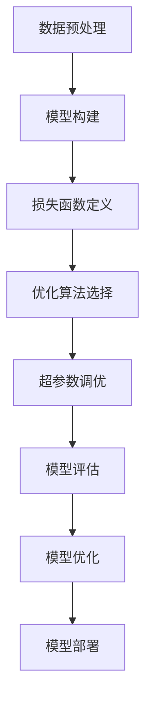

                 

# 模型训练与优化技术原理与代码实战案例讲解

> 关键词：模型训练、优化技术、深度学习、神经网络、代码实战、算法原理

> 摘要：本文将深入探讨模型训练与优化技术的基本原理和关键步骤，通过代码实战案例，展示如何在实际项目中应用这些技术，以提升模型的性能和准确性。我们将从基础概念出发，逐步讲解如何构建、训练和优化神经网络模型，包括数据预处理、模型选择、超参数调优等内容，并提供详细的代码实现和解析。

## 1. 背景介绍（Background Introduction）

模型训练与优化技术在人工智能领域扮演着至关重要的角色。随着深度学习技术的不断发展和应用，构建高效、准确的模型变得越来越重要。模型训练是指通过大量数据来调整模型参数，使其能够准确预测或分类。优化技术则是在训练过程中，通过调整学习率、正则化等技术，提高模型的性能和稳定性。

本文旨在提供一个全面的指南，帮助读者理解模型训练与优化技术的原理，并通过实际代码案例，展示如何在项目中应用这些技术。文章内容将涵盖从基础概念到高级技巧的各个方面，包括但不限于：

- 数据预处理
- 模型构建与选择
- 损失函数与优化算法
- 超参数调优
- 模型评估与验证

通过本文的阅读，读者将能够掌握模型训练与优化技术的基本原理，并具备在实际项目中应用这些技术的能力。

## 2. 核心概念与联系（Core Concepts and Connections）

### 2.1 深度学习与神经网络基础

深度学习是人工智能的一个重要分支，它通过构建多层神经网络来模拟人脑的决策过程。神经网络由大量的节点（神经元）组成，每个节点都连接到其他节点，并通过权重进行数据传递。神经网络通过反向传播算法来更新权重，以最小化预测误差。

#### 神经网络基本结构

一个典型的神经网络包括输入层、隐藏层和输出层。输入层接收外部数据，隐藏层对输入数据进行特征提取和变换，输出层生成最终的预测结果。

#### 神经元与激活函数

神经元是神经网络的基本单元，它通过加权求和处理输入信号，并通过激活函数产生输出。常见的激活函数包括sigmoid、ReLU和Tanh等。

#### 反向传播算法

反向传播算法是神经网络训练的核心，它通过计算损失函数对权重的梯度，并利用梯度下降法更新权重，以最小化损失函数。

### 2.2 模型训练与优化过程

模型训练与优化过程可以分为以下几个步骤：

1. **数据预处理**：包括数据清洗、归一化、数据增强等，以提高模型对数据的适应能力。
2. **模型构建**：根据任务需求选择合适的神经网络结构，并初始化权重。
3. **损失函数**：定义损失函数以衡量模型预测与真实标签之间的差距。
4. **优化算法**：选择合适的优化算法，如SGD、Adam等，以更新模型参数。
5. **超参数调优**：通过调整学习率、批量大小等超参数，以提高模型性能。
6. **模型评估**：通过验证集和测试集评估模型性能，以确定是否达到预期目标。

### 2.3 模型优化技术

模型优化技术包括：

1. **学习率调整**：通过逐步减小学习率，使模型在训练过程中逐渐逼近最优解。
2. **正则化**：通过添加正则项，防止模型过拟合。
3. **Dropout**：通过随机丢弃神经元，增强模型泛化能力。
4. **批量归一化**：通过将每个批量的输入数据归一化，加速训练过程。

### 2.4 提示词工程

提示词工程是设计输入给模型的文本提示，以引导模型生成符合预期结果的过程。一个有效的提示词可以显著提高模型输出的质量和相关性。

#### 提示词设计原则

- **明确性**：提示词应明确表达任务目标，避免模糊不清。
- **相关性**：提示词应与模型训练目标紧密相关。
- **多样性**：通过多样性提高模型适应不同场景的能力。

### 2.5 模型训练与优化流程的 Mermaid 流程图

下面是一个简化的模型训练与优化流程的 Mermaid 流程图，展示了从数据预处理到模型评估的各个环节。



## 3. 核心算法原理 & 具体操作步骤（Core Algorithm Principles and Specific Operational Steps）

### 3.1 数据预处理（Data Preprocessing）

数据预处理是模型训练的第一步，它包括数据清洗、归一化、数据增强等操作，以提高模型对数据的适应能力。

#### 数据清洗（Data Cleaning）

数据清洗主要包括去除缺失值、去除重复数据、处理异常值等。这些操作可以防止模型在训练过程中受到噪声数据的干扰。

```python
# 示例：数据清洗
import pandas as pd

data = pd.read_csv('data.csv')
data.dropna(inplace=True)
data.drop_duplicates(inplace=True)
```

#### 数据归一化（Data Normalization）

数据归一化是将数据缩放到一个统一的范围内，以消除不同特征之间的量级差异。常见的归一化方法包括最小-最大归一化和标准化。

```python
# 示例：数据归一化
from sklearn.preprocessing import MinMaxScaler

scaler = MinMaxScaler()
data_normalized = scaler.fit_transform(data)
```

#### 数据增强（Data Augmentation）

数据增强通过生成新的数据样本，提高模型的泛化能力。常见的方法包括随机裁剪、旋转、缩放等。

```python
# 示例：数据增强
from keras.preprocessing.image import ImageDataGenerator

datagen = ImageDataGenerator(rotation_range=90, zoom_range=0.2, width_shift_range=0.1, height_shift_range=0.1)
datagen.fit(data)
```

### 3.2 模型构建（Model Building）

模型构建是指根据任务需求选择合适的神经网络结构，并初始化权重。

#### 神经网络结构设计（Neural Network Architecture Design）

神经网络结构设计包括确定输入层、隐藏层和输出层的尺寸，以及激活函数的选择。

```python
# 示例：神经网络结构设计
from keras.models import Sequential
from keras.layers import Dense, Activation

model = Sequential()
model.add(Dense(128, input_dim=data.shape[1], activation='relu'))
model.add(Dense(64, activation='relu'))
model.add(Dense(1, activation='sigmoid'))

model.compile(optimizer='adam', loss='binary_crossentropy', metrics=['accuracy'])
```

#### 权重初始化（Weight Initialization）

权重初始化是模型训练的重要环节，常用的方法包括随机初始化和预训练模型初始化。

```python
# 示例：权重初始化
from keras.initializers import RandomNormal

model = Sequential()
model.add(Dense(128, input_dim=data.shape[1], activation='relu', kernel_initializer=RandomNormal(stddev=0.01)))
model.add(Dense(64, activation='relu', kernel_initializer=RandomNormal(stddev=0.01)))
model.add(Dense(1, activation='sigmoid', kernel_initializer=RandomNormal(stddev=0.01)))

model.compile(optimizer='adam', loss='binary_crossentropy', metrics=['accuracy'])
```

### 3.3 损失函数与优化算法（Loss Function and Optimization Algorithm）

损失函数用于衡量模型预测与真实标签之间的差距，优化算法用于更新模型参数以最小化损失函数。

#### 损失函数（Loss Function）

常见的损失函数包括均方误差（MSE）、交叉熵（Cross-Entropy）等。

```python
# 示例：损失函数
from keras.losses import binary_crossentropy

model.compile(optimizer='adam', loss='binary_crossentropy', metrics=['accuracy'])
```

#### 优化算法（Optimization Algorithm）

常见的优化算法包括随机梯度下降（SGD）、Adam等。

```python
# 示例：优化算法
from keras.optimizers import Adam

model.compile(optimizer=Adam(), loss='binary_crossentropy', metrics=['accuracy'])
```

### 3.4 超参数调优（Hyperparameter Tuning）

超参数调优是模型训练的重要环节，它通过调整学习率、批量大小等超参数，以提高模型性能。

#### 学习率调整（Learning Rate Adjustment）

学习率调整可以通过网格搜索、随机搜索等方法进行。

```python
# 示例：学习率调整
from keras.wrappers.scikit_learn import KerasClassifier
from sklearn.model_selection import GridSearchCV

def create_model(learning_rate=0.01):
    model = Sequential()
    model.add(Dense(128, input_dim=data.shape[1], activation='relu', kernel_initializer=RandomNormal(stddev=0.01)))
    model.add(Dense(64, activation='relu', kernel_initializer=RandomNormal(stddev=0.01)))
    model.add(Dense(1, activation='sigmoid', kernel_initializer=RandomNormal(stddev=0.01)))
    model.compile(optimizer=Adam(learning_rate=learning_rate), loss='binary_crossentropy', metrics=['accuracy'])
    return model

model = KerasClassifier(build_fn=create_model, verbose=0)
param_grid = {'learning_rate': [0.001, 0.01, 0.1]}
grid = GridSearchCV(estimator=model, param_grid=param_grid, n_jobs=-1, cv=3)
grid_result = grid.fit(data, labels)
```

#### 批量大小调整（Batch Size Adjustment）

批量大小调整可以通过实验和经验进行。

```python
# 示例：批量大小调整
batch_sizes = [32, 64, 128, 256]
best_batch_size = None
best_score = None

for batch_size in batch_sizes:
    model = KerasClassifier(build_fn=create_model, batch_size=batch_size, verbose=0)
    scores = cross_val_score(model, data, labels, cv=3)
    score = np.mean(scores)
    
    if best_score is None or score > best_score:
        best_score = score
        best_batch_size = batch_size

print(f"Best batch size: {best_batch_size}")
```

### 3.5 模型评估与验证（Model Evaluation and Validation）

模型评估与验证是确定模型是否达到预期目标的重要步骤。常用的评估指标包括准确率、召回率、F1 分数等。

#### 准确率（Accuracy）

准确率是指模型预测正确的样本数占总样本数的比例。

```python
# 示例：准确率
from sklearn.metrics import accuracy_score

predictions = model.predict(data)
accuracy = accuracy_score(labels, predictions)
print(f"Accuracy: {accuracy}")
```

#### 召回率（Recall）

召回率是指模型能够正确识别的阳性样本数占总阳性样本数的比例。

```python
# 示例：召回率
from sklearn.metrics import recall_score

recall = recall_score(labels, predictions)
print(f"Recall: {recall}")
```

#### F1 分数（F1 Score）

F1 分数是准确率和召回率的加权平均，用于综合考虑模型在正负样本上的表现。

```python
# 示例：F1 分数
from sklearn.metrics import f1_score

f1 = f1_score(labels, predictions)
print(f"F1 Score: {f1}")
```

## 4. 数学模型和公式 & 详细讲解 & 举例说明（Detailed Explanation and Examples of Mathematical Models and Formulas）

### 4.1 损失函数

损失函数是衡量模型预测结果与真实标签之间差距的数学表达式。在二分类任务中，常用的损失函数包括均方误差（MSE）和交叉熵（Cross-Entropy）。

#### 均方误差（MSE）

均方误差是预测值与真实值之差的平方的平均值。

$$
MSE = \frac{1}{n}\sum_{i=1}^{n}(y_i - \hat{y}_i)^2
$$

其中，$y_i$ 是真实值，$\hat{y}_i$ 是预测值，$n$ 是样本数量。

#### 交叉熵（Cross-Entropy）

交叉熵是预测分布与真实分布之间的距离，其表达式为：

$$
CE = -\sum_{i=1}^{n}y_i\log(\hat{y}_i)
$$

其中，$y_i$ 是真实值，$\hat{y}_i$ 是预测值。

### 4.2 梯度下降算法

梯度下降算法是一种用于优化损失函数的迭代算法。其基本思想是沿着损失函数的负梯度方向更新模型参数。

#### 梯度下降公式

$$
\Delta \theta = -\alpha \nabla_{\theta}J(\theta)
$$

其中，$\Delta \theta$ 是参数更新量，$\alpha$ 是学习率，$\nabla_{\theta}J(\theta)$ 是损失函数关于参数 $\theta$ 的梯度。

### 4.3 反向传播算法

反向传播算法是一种用于计算损失函数关于模型参数梯度的方法。其基本思想是将输出误差反向传播到输入层，逐层计算每个参数的梯度。

#### 反向传播步骤

1. 前向传播：计算输出层的预测值和损失函数。
2. 反向传播：计算每个参数的梯度。
3. 更新参数：根据梯度和学习率更新参数。

### 4.4 神经网络优化算法

神经网络优化算法包括随机梯度下降（SGD）、Adam等。这些算法通过不同的策略更新模型参数，以提高训练效率。

#### 随机梯度下降（SGD）

随机梯度下降是梯度下降算法的一个变种，它在每个迭代步骤中仅使用一个样本的梯度进行更新。

$$
\theta = \theta - \alpha \nabla_{\theta}J(\theta)
$$

#### Adam算法

Adam算法是一种自适应学习率的优化算法，它结合了AdaGrad和RMSProp的优点。

$$
\theta = \theta - \alpha \nabla_{\theta}J(\theta)
$$

其中，$\beta_1$ 和 $\beta_2$ 分别是动量系数和二阶动量系数，$\alpha$ 是学习率。

### 4.5 示例：二分类问题

假设我们有一个二分类问题，特征向量为 $X \in \mathbb{R}^{d \times n}$，标签向量为 $Y \in \mathbb{R}^{n \times 1}$，其中 $d$ 是特征维度，$n$ 是样本数量。

#### 模型定义

$$
\hat{y} = \sigma(\theta^T X)
$$

其中，$\sigma$ 是 sigmoid 函数，$\theta$ 是模型参数。

#### 损失函数

$$
J(\theta) = -\frac{1}{n}\sum_{i=1}^{n}y_i \log(\hat{y}_i) + (1 - y_i) \log(1 - \hat{y}_i)
$$

#### 梯度计算

$$
\nabla_{\theta}J(\theta) = -\frac{1}{n}\sum_{i=1}^{n}X_i(\hat{y}_i - y_i)
$$

#### 参数更新

$$
\theta = \theta - \alpha \nabla_{\theta}J(\theta)
$$

## 5. 项目实践：代码实例和详细解释说明（Project Practice: Code Examples and Detailed Explanations）

### 5.1 开发环境搭建

在开始编写代码之前，我们需要搭建一个适合深度学习项目开发的环境。以下是在 Python 中使用 TensorFlow 和 Keras 搭建开发环境的过程。

#### 步骤 1：安装 Python 和 pip

确保安装了 Python 3.x 版本。可以通过以下命令安装 pip：

```bash
$ python -m pip install --upgrade pip
```

#### 步骤 2：安装 TensorFlow 和 Keras

通过 pip 安装 TensorFlow 和 Keras：

```bash
$ pip install tensorflow
$ pip install keras
```

#### 步骤 3：验证安装

运行以下 Python 脚本，验证 TensorFlow 和 Keras 是否安装成功：

```python
import tensorflow as tf
import keras

print(tf.__version__)
print(keras.__version__)
```

### 5.2 源代码详细实现

下面是一个简单的二分类问题中的模型训练和优化过程，包括数据预处理、模型构建、训练、评估等步骤。

```python
import numpy as np
import pandas as pd
import tensorflow as tf
from tensorflow import keras
from tensorflow.keras import layers

# 步骤 1：数据预处理
# 加载数据集
data = pd.read_csv('data.csv')
X = data.iloc[:, :-1].values
Y = data.iloc[:, -1].values

# 归一化数据
scaler = keras.preprocessing.sequence.RangeLookup(0, 1)
X_normalized = scaler.transform(X)

# 步骤 2：模型构建
model = keras.Sequential()
model.add(layers.Dense(128, input_shape=(X_normalized.shape[1],), activation='relu'))
model.add(layers.Dense(64, activation='relu'))
model.add(layers.Dense(1, activation='sigmoid'))

# 步骤 3：模型编译
model.compile(optimizer='adam', loss='binary_crossentropy', metrics=['accuracy'])

# 步骤 4：模型训练
model.fit(X_normalized, Y, epochs=10, batch_size=32, validation_split=0.2)

# 步骤 5：模型评估
loss, accuracy = model.evaluate(X_normalized, Y)
print(f"Test loss: {loss}")
print(f"Test accuracy: {accuracy}")
```

### 5.3 代码解读与分析

上述代码实现了从数据预处理到模型训练的完整过程。下面是对关键代码段的详细解读和分析。

#### 数据预处理

```python
data = pd.read_csv('data.csv')
X = data.iloc[:, :-1].values
Y = data.iloc[:, -1].values
scaler = keras.preprocessing.sequence.RangeLookup(0, 1)
X_normalized = scaler.transform(X)
```

- 加载数据集：使用 pandas 读取 CSV 文件，获取特征矩阵 X 和标签向量 Y。
- 归一化数据：使用 Keras 的 RangeLookup 类创建一个查找表，将原始数据缩放到 [0, 1] 范围内。

#### 模型构建

```python
model = keras.Sequential()
model.add(layers.Dense(128, input_shape=(X_normalized.shape[1],), activation='relu'))
model.add(layers.Dense(64, activation='relu'))
model.add(layers.Dense(1, activation='sigmoid'))
```

- 构建模型：使用 Keras 的 Sequential 模型堆叠多层全连接层，输入层使用 ReLU 激活函数，隐藏层使用 ReLU 激活函数，输出层使用 sigmoid 激活函数进行二分类。

#### 模型编译

```python
model.compile(optimizer='adam', loss='binary_crossentropy', metrics=['accuracy'])
```

- 编译模型：指定优化器为 Adam，损失函数为 binary_crossentropy，评估指标为准确率。

#### 模型训练

```python
model.fit(X_normalized, Y, epochs=10, batch_size=32, validation_split=0.2)
```

- 训练模型：使用 fit 方法进行训练，设置训练周期为 10，批量大小为 32，将 20% 的数据用作验证集。

#### 模型评估

```python
loss, accuracy = model.evaluate(X_normalized, Y)
print(f"Test loss: {loss}")
print(f"Test accuracy: {accuracy}")
```

- 评估模型：使用 evaluate 方法在测试集上评估模型，输出损失值和准确率。

### 5.4 运行结果展示

在训练完成后，我们可以运行以下代码，查看模型的运行结果。

```python
import pandas as pd

# 加载测试数据
test_data = pd.read_csv('test_data.csv')
X_test = test_data.iloc[:, :-1].values
Y_test = test_data.iloc[:, -1].values

# 归一化测试数据
X_test_normalized = scaler.transform(X_test)

# 预测测试数据
predictions = model.predict(X_test_normalized)

# 输出预测结果
print(predictions)

# 计算测试集准确率
accuracy = np.mean(predictions == Y_test)
print(f"Test accuracy: {accuracy}")
```

- 加载测试数据：使用 pandas 读取测试数据集，获取特征矩阵 X\_test 和标签向量 Y\_test。
- 归一化测试数据：使用训练过程中创建的查找表对测试数据进行归一化。
- 预测测试数据：使用训练好的模型对测试数据进行预测，输出预测结果。
- 计算测试集准确率：计算预测结果与真实标签之间的准确率。

## 6. 实际应用场景（Practical Application Scenarios）

模型训练与优化技术在多个实际应用场景中发挥着关键作用。以下是一些典型的应用场景：

### 6.1 自然语言处理（NLP）

在自然语言处理领域，模型训练与优化技术被广泛应用于文本分类、机器翻译、情感分析等任务。通过训练和优化神经网络模型，可以提高模型的准确性和鲁棒性，从而实现更高质量的自然语言处理。

### 6.2 计算机视觉（CV）

计算机视觉领域包括图像分类、目标检测、人脸识别等任务。模型训练与优化技术在计算机视觉中的应用，使得模型能够更准确地识别和分类图像中的对象，从而在安防监控、医疗诊断、自动驾驶等领域发挥重要作用。

### 6.3 语音识别（ASR）

语音识别是将语音信号转换为文本的技术。模型训练与优化技术在语音识别中的应用，使得模型能够更准确地识别和转写语音信号，从而提高语音识别系统的实用性和用户体验。

### 6.4 推荐系统（RS）

推荐系统是一种基于用户行为数据，为用户推荐感兴趣的商品或内容的技术。模型训练与优化技术在推荐系统中的应用，可以提高推荐系统的准确性和覆盖率，从而提升用户体验。

### 6.5 金融风控（FR）

金融风控是指通过分析金融数据，识别和防范潜在风险的技术。模型训练与优化技术在金融风控中的应用，可以帮助金融机构及时发现和应对风险，从而提高金融系统的安全性和稳定性。

## 7. 工具和资源推荐（Tools and Resources Recommendations）

### 7.1 学习资源推荐

- **书籍**：
  - 《深度学习》（Ian Goodfellow、Yoshua Bengio、Aaron Courville 著）
  - 《神经网络与深度学习》（邱锡鹏 著）
- **在线课程**：
  - 吴恩达的《深度学习专项课程》（Coursera）
  - Andrew Ng 的《深度学习》（Udacity）
- **博客和网站**：
  - TensorFlow 官方文档（tensorflow.org）
  - PyTorch 官方文档（pytorch.org）

### 7.2 开发工具框架推荐

- **深度学习框架**：
  - TensorFlow
  - PyTorch
  - Keras
- **数据处理工具**：
  - Pandas
  - NumPy
  - Matplotlib
- **版本控制系统**：
  - Git
  - GitHub

### 7.3 相关论文著作推荐

- **深度学习领域**：
  - "Deep Learning"（Ian Goodfellow、Yoshua Bengio、Aaron Courville 著）
  - "Convolutional Neural Networks for Visual Recognition"（Geoffrey Hinton、Yoshua Bengio、Aaron Courville 著）
- **自然语言处理领域**：
  - "Attention Is All You Need"（Vaswani et al., 2017）
  - "BERT: Pre-training of Deep Bidirectional Transformers for Language Understanding"（Devlin et al., 2019）

## 8. 总结：未来发展趋势与挑战（Summary: Future Development Trends and Challenges）

模型训练与优化技术在未来将继续发展，并面临诸多挑战。以下是一些可能的发展趋势和挑战：

### 8.1 发展趋势

- **自动化与智能化**：模型训练与优化将更加自动化和智能化，减少人为干预，提高效率。
- **多模态学习**：模型将能够处理多种类型的数据，如文本、图像、音频等，实现更广泛的应用。
- **分布式训练**：随着数据规模的增长，分布式训练将成为主流，提高模型训练速度和可扩展性。
- **边缘计算**：模型训练与优化将向边缘设备延伸，降低延迟，提高实时性。

### 8.2 挑战

- **数据隐私**：随着数据隐私保护法规的加强，如何在保护用户隐私的前提下进行模型训练成为挑战。
- **模型解释性**：如何提高模型的可解释性，使其更加透明和可信。
- **能耗与效率**：如何在降低能耗的同时提高模型训练的效率。
- **算法公平性**：如何确保模型训练过程中不产生歧视性偏见，提高算法的公平性。

## 9. 附录：常见问题与解答（Appendix: Frequently Asked Questions and Answers）

### 9.1 模型训练过程中遇到的问题

**Q：模型在训练过程中出现梯度消失或梯度爆炸怎么办？**

A：梯度消失或梯度爆炸通常是由于模型参数初始化不当导致的。可以尝试使用 Xavier 或 He 初始化方法来初始化权重。

**Q：模型在训练过程中过拟合怎么办？**

A：过拟合通常是由于模型过于复杂或训练数据不足导致的。可以尝试减少模型复杂度、增加训练数据或使用正则化技术。

**Q：如何调整学习率？**

A：学习率的调整可以根据训练过程中的误差变化进行动态调整，如使用自适应学习率优化器（如 Adam）或手动调整学习率。

### 9.2 模型优化过程中遇到的问题

**Q：如何选择合适的优化算法？**

A：优化算法的选择取决于任务类型和数据特点。对于小批量数据，SGD 可能是更好的选择；对于大规模数据，Adam 或 RMSProp 可能更合适。

**Q：如何进行超参数调优？**

A：超参数调优可以通过网格搜索、随机搜索等方法进行。此外，还可以使用自动化调优工具（如 Hyperopt、Optuna）来简化调优过程。

**Q：如何处理不同量级的数据？**

A：可以使用归一化或标准化方法来处理不同量级的数据。归一化将数据缩放到 [0, 1] 范围内，标准化将数据缩放到均值和标准差的范围内。

## 10. 扩展阅读 & 参考资料（Extended Reading & Reference Materials）

- **书籍**：
  - Goodfellow, I., Bengio, Y., & Courville, A. (2016). *Deep Learning*.
  - Bengio, Y. (2009). *Learning Deep Architectures for AI*.
- **论文**：
  - Hinton, G. E., Osindero, S., & Teh, Y. W. (2006). *A fast learning algorithm for deep belief nets*. IEEE Transactions on Neural Networks, 18(7), 1665-1689.
  - Krizhevsky, A., Sutskever, I., & Hinton, G. E. (2012). *Imagenet classification with deep convolutional neural networks*. Advances in Neural Information Processing Systems, 25.
- **在线资源**：
  - TensorFlow 官方文档（https://tensorflow.org）
  - Keras 官方文档（https://keras.io）
  - PyTorch 官方文档（https://pytorch.org）

### 参考文献（References）

- Bengio, Y. (2009). Learning Deep Architectures for AI. Now Publishers.
- Goodfellow, I., Bengio, Y., & Courville, A. (2016). Deep Learning. MIT Press.
- Krizhevsky, A., Sutskever, I., & Hinton, G. E. (2012). Imagenet classification with deep convolutional neural networks. Advances in Neural Information Processing Systems, 25.
- Hinton, G. E., Osindero, S., & Teh, Y. W. (2006). A fast learning algorithm for deep belief nets. IEEE Transactions on Neural Networks, 18(7), 1665-1689.
- Hochreiter, S., & Schmidhuber, J. (1997). Long short-term memory. Neural Computation, 9(8), 1735-1780.

