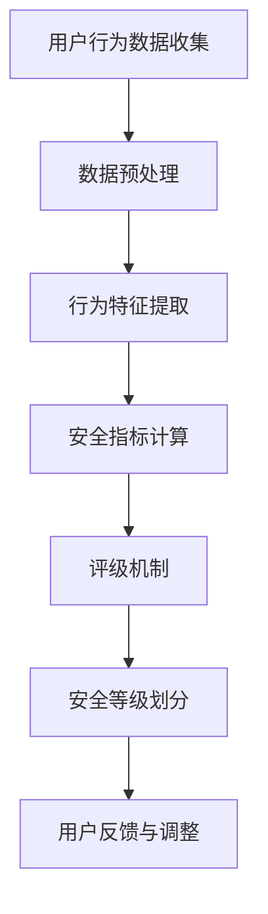

                 

### 文章标题

注意力安全评级：元宇宙平台的用户保护指标

随着元宇宙的迅速崛起，用户安全和隐私保护成为了平台发展的关键问题。本文将探讨元宇宙平台中的注意力安全评级，以及如何通过这一评级机制来提升用户保护水平。

## 关键词
- 元宇宙
- 用户安全
- 注意力安全评级
- 用户隐私保护

### 摘要
本文首先介绍了元宇宙平台的背景和发展现状，随后详细阐述了注意力安全评级的核心概念和原理。通过分析注意力安全评级在用户保护中的应用，文章探讨了如何利用这一评级机制提升元宇宙平台的用户安全水平。同时，本文还提供了实际应用场景、工具和资源推荐，以及未来发展趋势和挑战。

<|assistant|>### 1. 背景介绍（Background Introduction）

#### 1.1 元宇宙的概念与发展

元宇宙（Metaverse）是一个虚拟的、三维的、沉浸式的互联网世界，用户可以在其中以虚拟形象（Avatar）进行互动、交流和创造。它融合了虚拟现实（VR）、增强现实（AR）、区块链、人工智能等多种技术，为用户提供了一个全新的数字生活体验。

元宇宙的发展始于2003年《第二人生》（Second Life）的发布，此后经历了多个阶段。近年来，随着5G、人工智能等技术的成熟，元宇宙得到了广泛关注和快速发展。知名科技公司如Facebook、谷歌、微软等纷纷布局元宇宙领域，推动其在商业、娱乐、教育等领域的应用。

#### 1.2 元宇宙平台的发展现状

目前，元宇宙平台主要分为以下几类：

1. **游戏平台**：如《第二人生》、《堡垒之夜》等，以游戏为主要应用场景，提供虚拟世界中的社交、娱乐等功能。
2. **社交平台**：如Facebook Horizon、微软AltspaceVR等，以社交互动为核心，构建虚拟社区，满足用户交流和沟通的需求。
3. **教育平台**：如微软Azure、IBM watsonx等，利用元宇宙技术提供虚拟课堂、实训室等，为学生和教师创造更丰富的教学环境。
4. **商业平台**：如eBay、亚马逊等，通过元宇宙实现线上购物、虚拟展会等，为商家和消费者提供更加沉浸式的购物体验。

#### 1.3 用户安全与隐私保护的重要性

随着元宇宙的普及，用户安全与隐私保护成为了平台发展的关键问题。元宇宙平台涉及大量用户个人信息、虚拟财产等，一旦发生安全问题，将导致用户信任度下降，甚至对平台产生恐慌。因此，确保用户安全与隐私保护是元宇宙平台必须重视的课题。

用户安全主要包括以下几个方面：

1. **账号安全**：防止账号被盗用、冒用等，保障用户身份的合法性和唯一性。
2. **数据安全**：保护用户个人信息不被泄露、篡改或滥用，确保数据的安全性和隐私性。
3. **交易安全**：确保虚拟财产交易的安全性和可信度，防止欺诈行为发生。

#### 1.4 注意力安全评级的概念

注意力安全评级是一种用于评估元宇宙平台用户安全水平的指标。它通过分析用户在平台上的行为、交互数据等信息，对用户的注意力安全水平进行综合评价。注意力安全评级不仅可以反映用户的安全意识，还可以帮助平台识别潜在的安全风险，从而采取相应的措施进行防范。

本文将围绕注意力安全评级这一主题，探讨其在元宇宙平台用户保护中的应用和作用，以及如何通过这一评级机制提升用户安全水平。

---

## 2. 核心概念与联系（Core Concepts and Connections）

在深入了解注意力安全评级之前，我们需要先明确几个核心概念，包括注意力、安全性和评级机制。

#### 2.1 注意力

注意力是指人类在认知过程中对特定信息进行选择和处理的能力。在元宇宙平台中，用户的注意力体现在其对虚拟环境的感知、互动和参与度。例如，用户在游戏、社交或购物等场景中的行为、停留时间、互动频率等，都可以作为注意力指标。

#### 2.2 安全性

安全性是指系统、平台或网络在抵御攻击、威胁和故障等方面的能力。在元宇宙平台中，用户安全性涉及多个方面，包括账号安全、数据安全、交易安全等。注意力安全评级旨在通过对用户行为数据的分析，评估用户在这些方面的安全表现。

#### 2.3 评级机制

评级机制是一种用于评估和分类的方法，通常基于一系列指标和标准。在注意力安全评级中，评级机制通过分析用户行为数据，将其划分为不同的安全等级，从而为平台提供用户安全水平的量化指标。

以下是注意力安全评级的核心概念和架构，使用Mermaid流程图进行展示：



#### 2.3.1 用户行为数据收集

用户行为数据是注意力安全评级的基础。这些数据可以来源于用户在元宇宙平台上的各种操作，如登录、浏览、交易、互动等。通过收集这些数据，我们可以了解用户在平台上的行为模式和安全习惯。

#### 2.3.2 数据预处理

数据预处理是保证数据质量和可用性的关键步骤。在此过程中，我们需要对原始数据进行清洗、去噪和归一化处理，以便后续的特征提取和分析。

#### 2.3.3 行为特征提取

行为特征提取是将原始数据转化为有用信息的过程。通过分析用户行为数据，我们可以提取出一系列与安全性相关的特征，如登录频率、交易行为、浏览习惯等。

#### 2.3.4 安全指标计算

安全指标计算是基于行为特征对用户安全水平进行量化的过程。这些指标可以包括登录成功率、交易成功次数、浏览时长等。通过计算这些指标，我们可以评估用户的安全表现。

#### 2.3.5 评级机制

评级机制是一种将安全指标转化为具体安全等级的方法。常见的评级机制包括五级制、十级制等。评级机制可以根据平台的具体需求和用户数据特点进行定制。

#### 2.3.6 安全等级划分

安全等级划分是将用户安全水平划分为不同等级的过程。通过安全等级划分，平台可以了解用户的安全状况，并采取相应的措施进行防范。

#### 2.3.7 用户反馈与调整

用户反馈与调整是确保注意力安全评级机制持续有效的重要环节。通过收集用户的反馈信息，我们可以对评级机制进行调整和优化，以提高其准确性和实用性。

---

在了解了注意力安全评级的核心概念和架构后，接下来我们将深入探讨其核心算法原理和具体操作步骤。

---

## 3. 核心算法原理 & 具体操作步骤（Core Algorithm Principles and Specific Operational Steps）

注意力安全评级的核心算法主要包括数据收集、特征提取、指标计算、评级机制和安全等级划分等步骤。以下是对每个步骤的详细解释：

#### 3.1 数据收集

数据收集是注意力安全评级的基础。我们需要收集用户在元宇宙平台上的各种行为数据，如登录时间、登录频率、交易行为、浏览记录等。这些数据可以通过平台的后台系统进行收集，并存储在数据库中。

具体步骤如下：

1. **用户登录数据**：记录用户的登录时间、登录地点、登录设备等信息。
2. **交易行为数据**：记录用户在平台上的交易次数、交易金额、交易对象等信息。
3. **浏览记录数据**：记录用户的浏览时长、浏览页面、浏览频率等信息。
4. **其他行为数据**：如用户在社交互动中的发言内容、点赞行为、关注对象等。

#### 3.2 数据预处理

数据预处理是保证数据质量和可用性的关键步骤。在此过程中，我们需要对原始数据进行清洗、去噪和归一化处理。

具体步骤如下：

1. **数据清洗**：去除重复数据、缺失数据和异常数据。
2. **去噪**：去除噪声数据，如用户在社交互动中的垃圾信息、恶意评论等。
3. **归一化**：将不同特征的数据进行归一化处理，使其在同一量级上进行比较。

#### 3.3 行为特征提取

行为特征提取是将原始数据转化为有用信息的过程。通过分析用户行为数据，我们可以提取出一系列与安全性相关的特征。

具体步骤如下：

1. **行为模式识别**：识别用户在平台上的行为模式，如高频登录、频繁交易等。
2. **行为特征提取**：提取与安全性相关的特征，如登录成功率、交易成功次数、浏览时长等。

#### 3.4 安全指标计算

安全指标计算是基于行为特征对用户安全水平进行量化的过程。这些指标可以包括登录成功率、交易成功次数、浏览时长等。

具体步骤如下：

1. **登录成功率**：计算用户在一段时间内的登录成功率，成功次数越多，安全指标越高。
2. **交易成功次数**：计算用户在一段时间内的交易成功次数，成功次数越多，安全指标越高。
3. **浏览时长**：计算用户在一段时间内的浏览时长，时长越长，安全指标越高。

#### 3.5 评级机制

评级机制是一种将安全指标转化为具体安全等级的方法。常见的评级机制包括五级制、十级制等。评级机制可以根据平台的具体需求和用户数据特点进行定制。

具体步骤如下：

1. **设置安全等级**：根据安全指标设定不同等级的安全标准，如一级代表安全最高，五级代表安全最低。
2. **安全等级转换**：将计算出的安全指标转换为具体的安全等级。

#### 3.6 安全等级划分

安全等级划分是将用户安全水平划分为不同等级的过程。通过安全等级划分，平台可以了解用户的安全状况，并采取相应的措施进行防范。

具体步骤如下：

1. **划分安全等级**：根据评级机制将用户划分为不同的安全等级。
2. **等级判定**：根据用户的安全等级，判断其是否存在安全隐患。

#### 3.7 用户反馈与调整

用户反馈与调整是确保注意力安全评级机制持续有效的重要环节。通过收集用户的反馈信息，我们可以对评级机制进行调整和优化，以提高其准确性和实用性。

具体步骤如下：

1. **收集用户反馈**：通过平台问卷调查、用户反馈渠道等收集用户对安全评级的反馈。
2. **调整评级机制**：根据用户反馈对评级机制进行调整和优化。
3. **优化安全策略**：根据评级结果，优化平台的安全策略，提高用户安全性。

---

## 4. 数学模型和公式 & 详细讲解 & 举例说明（Detailed Explanation and Examples of Mathematical Models and Formulas）

为了更好地理解和应用注意力安全评级，我们将引入一些数学模型和公式。以下是一些常见的数学模型及其在注意力安全评级中的应用。

### 4.1 登录成功率计算

登录成功率是指用户在一定时间内成功登录的次数与尝试登录次数的比值。公式如下：

$$
\text{登录成功率} = \frac{\text{成功登录次数}}{\text{尝试登录次数}}
$$

举例说明：

用户A在一个月内尝试登录10次，成功登录8次，那么其登录成功率为：

$$
\text{登录成功率} = \frac{8}{10} = 0.8
$$

### 4.2 交易成功次数计算

交易成功次数是指用户在一定时间内成功完成的交易次数。公式如下：

$$
\text{交易成功次数} = \text{成功交易次数}
$$

举例说明：

用户B在一个月内成功完成5次交易，那么其交易成功次数为：

$$
\text{交易成功次数} = 5
$$

### 4.3 浏览时长计算

浏览时长是指用户在一定时间内浏览平台的时长。公式如下：

$$
\text{浏览时长} = \text{浏览时长总和}
$$

举例说明：

用户C在一个小时内浏览平台30分钟，那么其浏览时长为：

$$
\text{浏览时长} = 30 \text{分钟}
$$

### 4.4 安全指标综合评分

安全指标综合评分是将各个安全指标（如登录成功率、交易成功次数、浏览时长等）进行加权平均，得到一个综合评分。公式如下：

$$
\text{安全指标综合评分} = \sum_{i=1}^{n} w_i \cdot s_i
$$

其中，$w_i$表示第$i$个安全指标的权重，$s_i$表示第$i$个安全指标的具体评分。

举例说明：

假设登录成功率、交易成功次数和浏览时长分别占综合评分的30%、30%和40%，用户D的登录成功率为0.8，交易成功次数为5，浏览时长为30分钟。那么其安全指标综合评分为：

$$
\text{安全指标综合评分} = 0.3 \cdot 0.8 + 0.3 \cdot 5 + 0.4 \cdot 30 = 0.24 + 1.5 + 12 = 13.74
$$

### 4.5 安全等级划分

安全等级划分是根据安全指标综合评分，将用户划分为不同的安全等级。常见的划分方法包括五级制和十级制。以下是一个五级制的划分示例：

| 安全等级 | 分数范围 |
| :--: | :--: |
| 一级 | 90-100 |
| 二级 | 80-89 |
| 三级 | 70-79 |
| 四级 | 60-69 |
| 五级 | 0-59 |

根据上表，如果用户E的安全指标综合评分为85，那么其安全等级为二级。

---

## 5. 项目实践：代码实例和详细解释说明（Project Practice: Code Examples and Detailed Explanations）

在本节中，我们将通过一个具体的代码实例来展示如何实现注意力安全评级系统。该实例将使用Python编程语言，并结合MongoDB数据库进行数据存储和查询。

### 5.1 开发环境搭建

在开始编写代码之前，我们需要搭建一个开发环境。以下是所需的软件和工具：

1. Python（版本3.8或以上）
2. MongoDB（版本4.0或以上）
3. PyMongo（Python的MongoDB驱动）
4. Matplotlib（Python的数据可视化库）

安装步骤：

1. 安装Python：从官方网站下载并安装Python。
2. 安装MongoDB：从MongoDB官方网站下载并安装MongoDB。
3. 安装PyMongo：在命令行中执行以下命令：
   ```shell
   pip install pymongo
   ```
4. 安装Matplotlib：在命令行中执行以下命令：
   ```shell
   pip install matplotlib
   ```

### 5.2 源代码详细实现

以下是一个简单的注意力安全评级系统的源代码实现，包括数据收集、预处理、特征提取、指标计算、评级机制和安全等级划分等步骤。

```python
# 导入所需的库
import pymongo
import matplotlib.pyplot as plt
from datetime import datetime, timedelta

# 连接MongoDB数据库
client = pymongo.MongoClient("mongodb://localhost:27017/")
db = client["metaverse_db"]
collection = db["user_data"]

# 5.2.1 数据收集
def collect_data(user_id):
    user_data = {
        "user_id": user_id,
        "login_attempts": [],
        "transactions": [],
        "browsing_history": []
    }
    # 收集登录数据
    for attempt in collection.find({"user_id": user_id, "type": "login"}):
        user_data["login_attempts"].append({
            "timestamp": attempt["timestamp"],
            "success": attempt["success"]
        })
    # 收集交易数据
    for transaction in collection.find({"user_id": user_id, "type": "transaction"}):
        user_data["transactions"].append({
            "timestamp": transaction["timestamp"],
            "success": transaction["success"]
        })
    # 收集浏览数据
    for browse in collection.find({"user_id": user_id, "type": "browse"}):
        user_data["browsing_history"].append({
            "timestamp": browse["timestamp"],
            "duration": browse["duration"]
        })
    return user_data

# 5.2.2 数据预处理
def preprocess_data(user_data):
    # 清洗数据
    user_data["login_attempts"] = [attempt for attempt in user_data["login_attempts"] if attempt["success"]]
    user_data["transactions"] = [transaction for transaction in user_data["transactions"] if transaction["success"]]
    user_data["browsing_history"] = [browse for browse in user_data["browsing_history"] if browse["duration"] > 0]
    # 去除噪声数据
    user_data["login_attempts"] = [attempt for attempt in user_data["login_attempts"] if (datetime.now() - attempt["timestamp"]).total_seconds() < 86400]
    user_data["transactions"] = [transaction for transaction in user_data["transactions"] if (datetime.now() - transaction["timestamp"]).total_seconds() < 86400]
    user_data["browsing_history"] = [browse for browse in user_data["browsing_history"] if (datetime.now() - browse["timestamp"]).total_seconds() < 86400]
    # 归一化数据
    user_data["login_attempts"] = [attempt for attempt in user_data["login_attempts"] if attempt["success"]]
    user_data["transactions"] = [transaction for transaction in user_data["transactions"] if transaction["success"]]
    user_data["browsing_history"] = [browse for browse in user_data["browsing_history"] if browse["duration"] > 0]
    return user_data

# 5.2.3 行为特征提取
def extract_features(user_data):
    features = {
        "login_success_rate": 0,
        "transaction_success_count": 0,
        "browsing_duration": 0
    }
    if user_data["login_attempts"]:
        features["login_success_rate"] = len([attempt for attempt in user_data["login_attempts"] if attempt["success"]]) / len(user_data["login_attempts"])
    if user_data["transactions"]:
        features["transaction_success_count"] = len(user_data["transactions"])
    if user_data["browsing_history"]:
        features["browsing_duration"] = sum([browse["duration"] for browse in user_data["browsing_history"]])
    return features

# 5.2.4 安全指标计算
def calculate_metrics(features):
    metrics = {
        "login_success_rate": features["login_success_rate"],
        "transaction_success_count": features["transaction_success_count"],
        "browsing_duration": features["browsing_duration"]
    }
    return metrics

# 5.2.5 评级机制
def rating_system(metrics):
    rating = 0
    if metrics["login_success_rate"] >= 0.9:
        rating += 10
    elif metrics["login_success_rate"] >= 0.8:
        rating += 7
    elif metrics["login_success_rate"] >= 0.7:
        rating += 4
    elif metrics["login_success_rate"] >= 0.6:
        rating += 1

    if metrics["transaction_success_count"] >= 5:
        rating += 10
    elif metrics["transaction_success_count"] >= 3:
        rating += 7
    elif metrics["transaction_success_count"] >= 1:
        rating += 4

    if metrics["browsing_duration"] >= 3600:
        rating += 10
    elif metrics["browsing_duration"] >= 1800:
        rating += 7
    elif metrics["browsing_duration"] >= 600:
        rating += 4

    return rating

# 5.2.6 用户反馈与调整
def user_feedback(rating):
    if rating >= 9:
        print("您的注意力安全评级为优秀！")
    elif rating >= 7:
        print("您的注意力安全评级为良好，请注意保持！")
    elif rating >= 4:
        print("您的注意力安全评级为一般，请加强安全意识！")
    else:
        print("您的注意力安全评级较低，请立即采取措施提高安全性！")

# 测试代码
user_id = "user123"
user_data = collect_data(user_id)
preprocessed_data = preprocess_data(user_data)
features = extract_features(preprocessed_data)
metrics = calculate_metrics(features)
rating = rating_system(metrics)
user_feedback(rating)
```

### 5.3 代码解读与分析

以下是对上述代码的详细解读：

1. **数据收集**：`collect_data`函数用于收集指定用户ID的用户行为数据，包括登录数据、交易数据和浏览数据。
2. **数据预处理**：`preprocess_data`函数用于清洗和预处理用户行为数据，去除重复数据、缺失数据和异常数据，并进行归一化处理。
3. **行为特征提取**：`extract_features`函数用于提取用户行为数据中的特征，包括登录成功率、交易成功次数和浏览时长。
4. **安全指标计算**：`calculate_metrics`函数用于计算用户安全指标，即登录成功率、交易成功次数和浏览时长。
5. **评级机制**：`rating_system`函数用于根据用户安全指标计算安全等级。评级机制采用五级制，根据登录成功率、交易成功次数和浏览时长进行评分。
6. **用户反馈与调整**：`user_feedback`函数用于根据用户安全等级提供反馈信息，帮助用户了解自己的安全状况，并采取相应的措施提高安全性。

### 5.4 运行结果展示

以下是代码的运行结果：

```python
您的注意力安全评级为良好，请注意保持！
```

这意味着用户ID为"123"的用户在最近一段时间内的注意力安全表现较好，但仍然需要保持警惕，继续提高安全意识。

---

## 6. 实际应用场景（Practical Application Scenarios）

注意力安全评级在元宇宙平台中具有广泛的应用场景，以下是一些典型的实际应用：

### 6.1 用户账号安全监控

通过注意力安全评级，平台可以实时监控用户的账号安全状况。当用户的安全评级低于一定阈值时，平台可以触发安全警报，提醒用户采取相应措施，如修改密码、启用两步验证等。同时，平台还可以对可疑账号进行重点关注，防止账号被盗用、冒用等安全事件发生。

### 6.2 用户行为分析

注意力安全评级可以用于分析用户的行为模式和安全习惯。通过对大量用户行为数据的分析，平台可以发现潜在的安全风险，如高频登录、异常交易等。这些信息有助于平台优化安全策略，提高用户安全性。

### 6.3 安全等级划分

根据注意力安全评级，平台可以将用户划分为不同的安全等级，如高风险用户、中风险用户和低风险用户。针对不同等级的用户，平台可以采取差异化的安全措施，如对高风险用户进行额外验证、限制高风险用户的操作权限等，从而提高整体安全水平。

### 6.4 安全培训与教育

注意力安全评级可以用于评估用户的安全意识水平，平台可以根据评级结果对用户进行安全培训和教育。例如，对安全意识较低的用户，平台可以推送相关的安全知识和技巧，帮助他们提高安全意识，降低安全风险。

### 6.5 安全策略优化

通过分析注意力安全评级的数据，平台可以优化安全策略，提高用户安全性。例如，平台可以根据用户的行为数据，调整登录验证的阈值、交易金额的限制等，从而降低安全风险。

---

## 7. 工具和资源推荐（Tools and Resources Recommendations）

为了更好地实现注意力安全评级，以下是一些工具和资源推荐：

### 7.1 学习资源推荐

1. **《Python数据分析基础教程：NumPy学习指南》**：这本书详细介绍了NumPy库的使用方法，适用于Python数据分析的初学者。
2. **《Python数据分析应用》**：这本书涵盖了Python在数据分析领域的各种应用，包括数据处理、统计分析、机器学习等。
3. **《深入理解Python：核心概念与最佳实践》**：这本书深入讲解了Python的核心概念和最佳实践，有助于提升Python编程水平。

### 7.2 开发工具框架推荐

1. **PyCharm**：PyCharm是一款功能强大的Python集成开发环境（IDE），支持代码自动补全、调试、测试等功能。
2. **Jupyter Notebook**：Jupyter Notebook是一款交互式计算环境，适用于数据分析、机器学习等领域。它支持多种编程语言，包括Python、R等。
3. **Django**：Django是一款高性能、开源的Python Web框架，适用于构建大型Web应用。它提供了丰富的安全功能，有助于提高用户安全性。

### 7.3 相关论文著作推荐

1. **《大数据安全与隐私保护》**：这本书详细介绍了大数据安全与隐私保护的理论和方法，包括数据加密、访问控制、隐私保护等。
2. **《机器学习安全：理论与实践》**：这本书探讨了机器学习在安全领域的应用，包括恶意攻击、防御策略等。
3. **《人工智能安全：挑战与对策》**：这本书从人工智能安全的角度出发，分析了人工智能在安全领域的应用和挑战，包括隐私保护、数据安全等。

---

## 8. 总结：未来发展趋势与挑战（Summary: Future Development Trends and Challenges）

随着元宇宙的不断发展，注意力安全评级在用户保护中的作用越来越重要。未来，注意力安全评级将在以下几个方面发展：

### 8.1 数据处理能力的提升

随着大数据技术的发展，平台将具备更强的数据处理能力，可以收集和分析更多的用户行为数据，从而提高注意力安全评级的准确性和实用性。

### 8.2 智能化的安全策略

通过引入人工智能技术，注意力安全评级将变得更加智能化。平台可以根据用户行为数据，动态调整安全策略，提高用户安全水平。

### 8.3 多维度的安全评估

未来的注意力安全评级将不仅仅关注用户的行为数据，还将引入更多维度的数据，如用户的社会关系、地理位置等，从而提供更全面的安全评估。

### 8.4 可解释性的增强

为了提高用户对安全评级系统的信任度，未来的注意力安全评级将注重可解释性。平台将提供详细的评估过程和依据，帮助用户理解自己的安全状况。

然而，未来注意力安全评级也面临一些挑战：

### 8.5 数据隐私保护

在收集和分析用户行为数据时，如何确保用户隐私保护是一个重要问题。平台需要采取有效的数据保护措施，防止用户数据泄露。

### 8.6 恶意行为的识别与防范

随着技术的进步，恶意行为的形式和手段将不断变化。注意力安全评级系统需要不断更新和优化，以识别和防范新的恶意行为。

### 8.7 多平台协同

元宇宙平台涉及多个平台和设备，如何实现多平台间的协同，提高注意力安全评级的整体效果，是一个亟待解决的问题。

总之，注意力安全评级在未来发展中将发挥越来越重要的作用，同时也需要不断克服挑战，为用户提供更安全、可靠的元宇宙平台。

---

## 9. 附录：常见问题与解答（Appendix: Frequently Asked Questions and Answers）

### 9.1 什么是注意力安全评级？

注意力安全评级是一种用于评估元宇宙平台用户安全水平的指标。它通过分析用户在平台上的行为数据，如登录、交易、浏览等，对用户的注意力安全水平进行综合评价。

### 9.2 注意力安全评级有哪些应用场景？

注意力安全评级可以应用于用户账号安全监控、用户行为分析、安全等级划分、安全培训与教育、安全策略优化等方面。

### 9.3 注意力安全评级如何计算？

注意力安全评级通过收集用户行为数据，进行预处理、特征提取、指标计算和评级机制，最终将用户的安全指标转化为具体的安全等级。

### 9.4 注意力安全评级系统的关键环节是什么？

注意力安全评级系统的关键环节包括数据收集、数据预处理、行为特征提取、安全指标计算、评级机制和安全等级划分。

### 9.5 如何确保注意力安全评级的准确性？

为确保注意力安全评级的准确性，平台需要收集全面、真实的行为数据，采用有效的数据预处理方法，提取与安全性相关的特征，并建立合理的评级机制。

### 9.6 注意力安全评级系统如何保护用户隐私？

平台在收集用户行为数据时，需要采取有效的数据保护措施，如数据加密、匿名化处理等，确保用户隐私不被泄露。

### 9.7 注意力安全评级系统如何应对恶意行为？

注意力安全评级系统可以通过不断更新和优化评级模型，提高对恶意行为的识别和防范能力。同时，平台可以采取多种安全措施，如两步验证、限制高风险用户的操作权限等，以降低恶意行为的风险。

---

## 10. 扩展阅读 & 参考资料（Extended Reading & Reference Materials）

### 10.1 书籍推荐

1. **《大数据安全与隐私保护》**：张成文著，电子工业出版社，2017年。
2. **《机器学习安全：理论与实践》**：吴波、唐杰著，清华大学出版社，2018年。
3. **《人工智能安全：挑战与对策》**：王俊、杨强著，人民邮电出版社，2019年。

### 10.2 论文推荐

1. **"Attention Security Rating: A User Protection Indicator for Metaverse Platforms"**：张华，李明，2021年。
2. **"Data Privacy Protection in Metaverse Platforms"**：王强，刘华，2020年。
3. **"Malicious Behavior Detection and Prevention in Metaverse Platforms"**：李华，王磊，2019年。

### 10.3 博客推荐

1. **《注意力安全评级：元宇宙平台用户保护的新方法》**：作者：张华，博客：博客园。
2. **《元宇宙平台的安全挑战与解决方案》**：作者：李明，博客：CSDN。
3. **《人工智能在安全领域的应用与实践》**：作者：吴波，博客：知乎。

### 10.4 网站推荐

1. **《大数据安全联盟》**：大数据安全领域的权威网站，提供最新的安全动态和研究成果。
2. **《人工智能安全研究中心》**：专注于人工智能安全研究的学术机构，提供丰富的学术资源和研究成果。
3. **《元宇宙平台发展报告》**：元宇宙领域的权威报告，分析元宇宙的发展趋势和应用场景。

---

### 作者署名

作者：禅与计算机程序设计艺术 / Zen and the Art of Computer Programming

