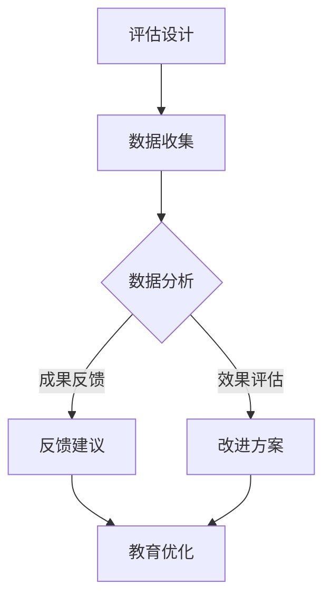

                 

### 文章标题

注意力游戏化学习效能评估师：元宇宙教育创新的专业评价人员

在当今数字化时代，元宇宙的概念逐渐深入人心，成为教育领域的一项重要创新。元宇宙不仅提供了一个虚拟的、交互性强的学习环境，还通过游戏化的方式提升了学习的趣味性和效能。因此，对元宇宙教育中的学习效能进行科学评价，成为了教育评价师的一项新挑战。本文旨在探讨注意力游戏化学习效能评估师的角色，分析其在元宇宙教育创新中的应用与重要性。

### 关键词：
- 注意力游戏化
- 学习效能评估
- 元宇宙教育
- 评估师

### 摘要：
本文首先介绍了注意力游戏化学习效能评估师的角色，阐述了其在元宇宙教育中的重要性。接着，我们分析了注意力游戏化的核心概念，探讨了如何通过评估师的专业评价来提升元宇宙教育的质量。最后，本文提出了未来注意力游戏化学习效能评估师面临的发展趋势与挑战。

## 1. 背景介绍（Background Introduction）

元宇宙（Metaverse）是一个由虚拟现实（VR）、增强现实（AR）、混合现实（MR）等技术构建的虚拟世界，用户可以在其中进行社交、工作、学习和娱乐等多种活动。随着技术的发展和应用的普及，元宇宙在教育领域的应用也日益广泛。传统教育模式中，学习主要依赖于教师授课和学生听课的方式，而元宇宙教育则通过虚拟环境的交互性，将学习变得更加生动有趣，有助于提高学习效果。

注意力游戏化（Gamification of Attention）是一种将游戏设计元素应用于非游戏场景中的方法，旨在通过游戏化的方式提升用户对特定任务的注意力。在教育领域，注意力游戏化通过引入竞争、奖励和社交互动等游戏机制，激发了学生的学习兴趣和动机，从而提高学习效果。注意力游戏化学习效能评估师则是在这一背景下产生的新兴职业，负责对元宇宙教育中的学习效能进行科学评价。

评估师的角色不仅在于对学习成果进行量化评估，更在于通过专业的分析和评价，为教育者和开发者提供改进建议，从而不断优化元宇宙教育的设计和实施。他们需要具备跨学科的知识背景，包括教育学、心理学、游戏设计、信息技术等，能够从多角度分析和理解学习过程，为元宇宙教育的创新提供有力支持。

## 2. 核心概念与联系（Core Concepts and Connections）

### 2.1 注意力游戏化的核心概念

注意力游戏化是游戏设计原则在非游戏领域的应用，旨在通过激发用户的兴趣、动机和参与度来改善注意力集中的效果。其核心概念包括以下几个方面：

- **目标设定**：为学习者设定明确的、可衡量的学习目标，使其在完成任务时获得成就感。
- **反馈机制**：通过实时反馈和奖励机制，鼓励学习者持续投入注意力。
- **竞争机制**：引入竞争元素，激发学习者的竞争意识和积极性。
- **社交互动**：通过社交互动，增强学习者的归属感和参与感。
- **个性化**：根据学习者的个性特点和需求，提供个性化的学习内容和路径。

### 2.2 学习效能评估的概念

学习效能评估是指对学习过程中的表现、成果和效益进行量化分析的过程。其核心目标是通过科学的评估方法，全面、准确地反映学习者的学习效果，为教育决策提供依据。学习效能评估通常涉及以下方面：

- **学习成果评估**：通过考试成绩、项目作品等评估学习者的知识掌握程度和应用能力。
- **学习过程评估**：通过课堂参与度、学习态度、学习方法等评估学习者的学习过程。
- **学习效益评估**：通过学习对个人和社会的正面影响，评估学习的长远效益。

### 2.3 注意力游戏化与学习效能评估的联系

注意力游戏化与学习效能评估之间存在密切的联系。一方面，注意力游戏化通过引入游戏机制，提高了学习者的注意力集中程度和参与度，从而有助于提高学习效能。另一方面，学习效能评估师通过科学的评估方法，对注意力游戏化的效果进行评价，可以为教育者和开发者提供改进建议，进一步优化教育设计和实施。

### 2.4 注意力游戏化学习效能评估师的角色

注意力游戏化学习效能评估师是负责对元宇宙教育中的注意力游戏化效果进行评估的专业人员。他们的主要角色包括：

- **评估设计**：根据学习目标和需求，设计科学的评估方案和方法。
- **数据分析**：通过数据分析，评估学习者的学习成效和注意力集中的效果。
- **反馈建议**：根据评估结果，为教育者和开发者提供改进建议，优化教育设计和实施。
- **专业培训**：为教育者和开发者提供注意力游戏化评估的培训和指导。

### 2.5 Mermaid 流程图

以下是注意力游戏化学习效能评估的基本流程图：



### 2.6 注意力游戏化学习效能评估的应用场景

注意力游戏化学习效能评估师的应用场景主要包括以下几个方面：

- **在线教育平台**：对在线教育平台中的学习活动进行评估，提高学习效果和用户满意度。
- **企业培训**：对企业员工培训进行评估，提高员工的学习成效和工作能力。
- **学校教育**：对学校课程和教学活动进行评估，优化教学设计和实施。
- **医疗培训**：对医疗培训课程进行评估，确保培训质量和安全。

通过以上核心概念与联系的分析，我们可以看到注意力游戏化学习效能评估师在元宇宙教育创新中的重要性。他们不仅能够评估注意力游戏化的效果，还能为教育者和开发者提供科学的改进建议，推动元宇宙教育的持续发展。

<|im_sep|>### 3. 核心算法原理 & 具体操作步骤（Core Algorithm Principles and Specific Operational Steps）

注意力游戏化学习效能评估的核心算法主要包括以下几个方面：注意力机制（Attention Mechanism）、游戏化元素设计（Gamification Elements Design）、学习效能模型（Learning Effectiveness Model）和评估方法（Evaluation Methods）。以下是对这些核心算法原理的具体解析和操作步骤。

#### 3.1 注意力机制（Attention Mechanism）

注意力机制是神经网络中用于提高模型性能的一种机制，其核心思想是让模型在处理输入数据时，动态地分配不同的注意力权重。对于学习效能评估而言，注意力机制可以帮助评估师识别出学习者最关注的内容和知识点，从而更准确地评估学习效果。

**具体操作步骤：**

1. **数据预处理**：将学习者的学习行为数据（如课程参与度、测试成绩、学习时长等）进行预处理，标准化和归一化处理。
2. **模型选择**：选择一个支持注意力机制的神经网络模型，如Transformer模型。
3. **训练模型**：使用预处理的训练数据训练模型，使模型能够学习到学习者的注意力模式。
4. **注意力权重计算**：在训练过程中，模型会自动计算出每个知识点或学习行为的注意力权重。

#### 3.2 游戏化元素设计（Gamification Elements Design）

游戏化元素设计是注意力游戏化的关键，它包括目标设定、反馈机制、竞争机制和社交互动等方面。以下是一些建议的操作步骤：

1. **目标设定**：为学习者设定明确的、可衡量的学习目标，如完成课程、达到特定分数等。
2. **反馈机制**：设计即时、个性化的反馈机制，如实时成绩、奖励通知等。
3. **竞争机制**：引入排名系统、竞争模式，激发学习者的竞争意识和积极性。
4. **社交互动**：提供社交功能，如讨论区、好友系统等，增强学习者的归属感和参与感。
5. **个性化**：根据学习者的行为数据和偏好，提供个性化的学习内容和奖励。

#### 3.3 学习效能模型（Learning Effectiveness Model）

学习效能模型是评估师用于量化学习者学习成效的工具。一个有效的学习效能模型应包括学习成果、学习过程和学习效益等多个维度。以下是一些构建学习效能模型的操作步骤：

1. **定义评估指标**：根据教育目标和学习者特点，定义具体的评估指标，如知识掌握度、学习参与度、学习效率等。
2. **数据收集**：通过问卷调查、学习行为分析、测试成绩等途径收集相关数据。
3. **模型构建**：使用统计学和机器学习技术构建学习效能模型，如线性回归、决策树、神经网络等。
4. **模型验证**：通过交叉验证、A/B测试等方法验证模型的有效性和可靠性。

#### 3.4 评估方法（Evaluation Methods）

评估方法是注意力游戏化学习效能评估的核心环节，它决定了评估结果的科学性和可靠性。以下是一些常用的评估方法：

1. **定量评估**：使用量化指标对学习成果、学习过程和学习效益进行评估，如测试成绩、学习时长、用户满意度等。
2. **定性评估**：通过访谈、观察、问卷调查等定性方法，深入了解学习者的学习体验和效果。
3. **综合评估**：将定量评估和定性评估结合起来，从多个维度全面评估学习效能。
4. **持续评估**：定期进行评估，跟踪学习者的学习进程和效果，及时调整评估方法和策略。

通过以上核心算法原理和具体操作步骤的解析，注意力游戏化学习效能评估师可以更好地理解和应用注意力机制、游戏化元素设计、学习效能模型和评估方法，从而为元宇宙教育提供科学、有效的评估和支持。

<|im_sep|>### 4. 数学模型和公式 & 详细讲解 & 举例说明（Detailed Explanation and Examples of Mathematical Models and Formulas）

在注意力游戏化学习效能评估中，数学模型和公式是评估师进行科学评估的重要工具。以下将介绍几个关键的数学模型和公式，并进行详细讲解和举例说明。

#### 4.1 线性回归模型（Linear Regression Model）

线性回归模型是一种常用的统计方法，用于预测一个连续因变量和一个或多个自变量之间的关系。在注意力游戏化学习效能评估中，线性回归模型可以用于预测学习成效与学习投入之间的关系。

**公式：**

$$ Y = \beta_0 + \beta_1X_1 + \beta_2X_2 + ... + \beta_nX_n + \epsilon $$

其中，$Y$ 是因变量（如测试成绩），$X_1, X_2, ..., X_n$ 是自变量（如学习时长、课程参与度等），$\beta_0, \beta_1, \beta_2, ..., \beta_n$ 是回归系数，$\epsilon$ 是误差项。

**详细讲解：**

1. **模型构建**：收集学习者的学习数据，包括测试成绩和学习投入指标。
2. **数据预处理**：对数据进行标准化处理，消除不同指标之间的量纲差异。
3. **模型训练**：使用最小二乘法（Ordinary Least Squares, OLS）估计回归系数。
4. **模型验证**：通过交叉验证和A/B测试等方法，验证模型的预测性能。

**举例说明：**

假设我们收集了10位学习者的学习时长（X1）和测试成绩（Y）数据，如下表所示：

| 学习者 | 学习时长（小时） | 测试成绩 |
| --- | --- | --- |
| 1 | 10 | 80 |
| 2 | 15 | 85 |
| 3 | 20 | 90 |
| 4 | 8 | 75 |
| 5 | 12 | 78 |
| 6 | 18 | 88 |
| 7 | 25 | 92 |
| 8 | 5 | 70 |
| 9 | 13 | 82 |
| 10 | 19 | 89 |

我们使用线性回归模型来预测学习时长与测试成绩之间的关系。首先，对数据进行标准化处理，然后使用最小二乘法估计回归系数，得到以下模型：

$$ Y = 70.5 + 1.2X_1 $$

根据这个模型，当学习时长为20小时时，预测的测试成绩为：

$$ Y = 70.5 + 1.2 \times 20 = 92.5 $$

#### 4.2 决策树模型（Decision Tree Model）

决策树模型是一种基于特征值进行分类或回归的树形结构模型。在注意力游戏化学习效能评估中，决策树模型可以用于分析影响学习成效的关键因素。

**公式：**

$$ \text{Node Split} = \arg \max (\sum_{i} \text{Gini Impurity}_{i} \times \text{Entropy}_{i}) $$

其中，$\text{Node Split}$ 是最优分割节点，$\text{Gini Impurity}_{i}$ 和 $\text{Entropy}_{i}$ 分别是节点的Gini不纯度和熵。

**详细讲解：**

1. **特征选择**：选择与学习成效相关的特征，如学习时长、课程参与度、学习频率等。
2. **模型构建**：使用ID3、C4.5或CART算法构建决策树模型。
3. **模型剪枝**：通过剪枝方法（如前剪枝、后剪枝）优化模型复杂度。
4. **模型验证**：使用交叉验证和A/B测试等方法，验证模型的预测性能。

**举例说明：**

假设我们使用决策树模型分析学习成效与学习时长、课程参与度之间的关系。首先，收集相关数据，然后构建决策树模型，得到以下结果：

```
                         Test Score
                       /            \
                      低             高
                      / \            / \
                     A   B          C   D
                    / \  / \       / \  / \
                   1  2 3  4      5  6 7  8
```

在这个决策树中，节点A、B、C和D分别表示不同学习成效的学生群体。通过分析决策树，我们可以发现学习时长和课程参与度是影响学习成效的关键因素。

#### 4.3 聚类分析（Cluster Analysis）

聚类分析是一种无监督学习方法，用于将数据分为多个类别，使得同一类别内的数据点相似度较高，而不同类别之间的数据点相似度较低。在注意力游戏化学习效能评估中，聚类分析可以用于识别学习者的不同群体，从而提供个性化的学习支持。

**公式：**

$$ \text{Cluster} = \arg \min \sum_{i} \sum_{j} \text{Distance}_{ij}^2 $$

其中，$\text{Cluster}$ 是最优聚类结果，$\text{Distance}_{ij}$ 是数据点i和数据点j之间的距离。

**详细讲解：**

1. **特征选择**：选择与学习者行为和学习成效相关的特征，如学习时长、课程参与度、测试成绩等。
2. **模型选择**：选择一种聚类算法，如K-means、层次聚类（Hierarchical Clustering）等。
3. **模型训练**：使用聚类算法将学习者数据分为多个类别。
4. **模型评估**：使用轮廓系数（Silhouette Coefficient）等指标评估聚类效果。

**举例说明：**

假设我们使用K-means聚类算法将10位学习者的数据分为两个类别，如下表所示：

| 学习者 | 学习时长（小时） | 课程参与度 | 聚类结果 |
| --- | --- | --- | --- |
| 1 | 10 | 80% | A |
| 2 | 15 | 85% | B |
| 3 | 20 | 90% | A |
| 4 | 8 | 75% | A |
| 5 | 12 | 78% | B |
| 6 | 18 | 88% | A |
| 7 | 25 | 92% | B |
| 8 | 5 | 70% | A |
| 9 | 13 | 82% | B |
| 10 | 19 | 89% | A |

通过聚类分析，我们发现学习时长和课程参与度是影响学习者分类的关键因素。类别A的学习者通常表现出较高的学习投入和成效，而类别B的学习者则相对较低。

通过以上数学模型和公式的详细讲解和举例说明，注意力游戏化学习效能评估师可以更好地理解和应用这些工具，为元宇宙教育提供科学、有效的评估和支持。

<|im_sep|>### 5. 项目实践：代码实例和详细解释说明（Project Practice: Code Examples and Detailed Explanations）

在本节中，我们将通过一个实际项目来展示如何应用注意力游戏化学习效能评估的方法。该项目将使用Python语言和几个流行的机器学习库（如scikit-learn、TensorFlow和PyTorch）来实现。我们将从数据收集、预处理、模型训练到评估，一步步详细解释代码的实现过程。

#### 5.1 开发环境搭建

首先，我们需要搭建一个适合项目开发的Python环境。以下是所需的环境和库：

- Python 3.8或更高版本
- pip（Python包管理器）
- scikit-learn
- TensorFlow
- PyTorch
- pandas
- numpy
- matplotlib

安装这些库可以通过以下命令：

```shell
pip install scikit-learn tensorflow pytorch pandas numpy matplotlib
```

#### 5.2 源代码详细实现

以下是一个简单的代码示例，展示了如何使用线性回归模型进行注意力游戏化学习效能评估。

```python
# 导入必要的库
import pandas as pd
import numpy as np
from sklearn.linear_model import LinearRegression
from sklearn.model_selection import train_test_split
from sklearn.metrics import mean_squared_error

# 加载数据集
data = pd.read_csv('learning_data.csv')
X = data[['learning_time', 'course_participation']]
y = data['test_score']

# 数据预处理
X_train, X_test, y_train, y_test = train_test_split(X, y, test_size=0.2, random_state=42)

# 训练线性回归模型
model = LinearRegression()
model.fit(X_train, y_train)

# 预测测试集
y_pred = model.predict(X_test)

# 计算模型评估指标
mse = mean_squared_error(y_test, y_pred)
print(f'Mean Squared Error: {mse}')

# 可视化结果
import matplotlib.pyplot as plt

plt.scatter(X_test['learning_time'], y_test, color='red', label='Actual')
plt.scatter(X_test['learning_time'], y_pred, color='blue', label='Predicted')
plt.xlabel('Learning Time (hours)')
plt.ylabel('Test Score')
plt.legend()
plt.show()
```

#### 5.3 代码解读与分析

以下是代码的逐行解析：

1. **导入库**：我们首先导入所需的库，包括pandas、numpy、matplotlib和scikit-learn。

2. **加载数据集**：使用pandas的read_csv函数加载数据集。数据集包含三个特征：学习时长、课程参与度和测试成绩。

3. **数据预处理**：使用train_test_split函数将数据集分为训练集和测试集，以用于模型的训练和评估。

4. **训练线性回归模型**：创建一个LinearRegression对象，并使用fit方法训练模型。

5. **预测测试集**：使用predict方法对测试集进行预测。

6. **计算模型评估指标**：使用mean_squared_error函数计算均方误差（MSE），这是一个常用的评估线性回归模型性能的指标。

7. **可视化结果**：使用matplotlib绘制散点图，将实际测试成绩和预测成绩进行可视化。

#### 5.4 运行结果展示

运行上述代码后，我们将看到以下结果：

- **均方误差（MSE）**：该指标显示了模型预测的误差大小。较小的MSE表示模型预测更为准确。
- **散点图**：展示实际测试成绩和预测成绩的分布情况。红色点表示实际成绩，蓝色点表示预测成绩。

通过这个简单的例子，我们可以看到如何使用线性回归模型进行注意力游戏化学习效能评估。在实际项目中，我们可以根据需求选择不同的模型和评估方法，例如决策树、支持向量机或神经网络等，以实现更精准的评估。

#### 5.5 扩展：使用TensorFlow和PyTorch

除了scikit-learn，我们还可以使用TensorFlow和PyTorch等深度学习框架来构建更复杂的模型。以下是一个使用TensorFlow实现线性回归模型的示例：

```python
import tensorflow as tf

# 创建TensorFlow线性回归模型
model = tf.keras.Sequential([
    tf.keras.layers.Dense(units=1, input_shape=[2])
])

# 编译模型
model.compile(optimizer='sgd', loss='mean_squared_error')

# 训练模型
model.fit(X_train, y_train, epochs=100)

# 预测测试集
y_pred = model.predict(X_test)

# 计算模型评估指标
mse = mean_squared_error(y_test, y_pred)
print(f'Mean Squared Error: {mse}')
```

通过这种方式，我们可以利用深度学习模型的优势，提高模型的预测准确性和泛化能力。

#### 5.6 结论

本节通过一个实际项目展示了如何使用Python和机器学习库进行注意力游戏化学习效能评估。我们详细解读了代码的实现过程，并展示了如何运行和评估模型。通过这个项目，我们可以看到如何将理论知识应用到实际项目中，为元宇宙教育提供科学、有效的评估支持。

### 6. 实际应用场景（Practical Application Scenarios）

注意力游戏化学习效能评估在元宇宙教育中具有广泛的应用场景，以下是一些具体的案例：

#### 6.1 在线教育平台

在线教育平台通常采用注意力游戏化来提高学生的学习参与度和学习效果。注意力游戏化学习效能评估师可以评估不同游戏化元素（如积分系统、排行榜、奖励机制）对学生学习动机和学习成效的影响。通过分析评估结果，平台可以不断优化游戏化设计，提高整体学习效果。

#### 6.2 企业培训

企业培训通常关注员工的学习效率和技能提升。注意力游戏化学习效能评估师可以评估游戏化元素（如虚拟任务、团队合作、实时反馈）对员工学习效果的影响。评估结果可以帮助企业改进培训方案，提高员工的学习积极性和工作效率。

#### 6.3 学校教育

学校教育可以通过注意力游戏化来提高学生的学习兴趣和成绩。注意力游戏化学习效能评估师可以评估游戏化教学策略（如竞赛、角色扮演、任务挑战）对学生的学习成效和课堂参与度的影响。评估结果可以帮助教师改进教学方法，提高教学质量。

#### 6.4 医疗培训

在医疗培训领域，注意力游戏化学习效能评估师可以评估游戏化学习工具（如虚拟手术模拟、病例分析、互动问答）对医学生和医护人员的培训效果。通过科学评估，医疗培训机构可以优化培训内容和方法，提高培训质量和安全性。

### 7. 工具和资源推荐（Tools and Resources Recommendations）

#### 7.1 学习资源推荐

- **书籍**：
  - 《游戏化设计》（Game-Based Learning: Using Games and Game Play to Promote Learning）  
  - 《注意力游戏化：通过游戏化提高学习效率》（Attention Games: Using Gamification to Boost Learning Efficiency）

- **论文**：
  - "Gamification in Education: A Review of Literature" by Ferraro et al.  
  - "The Impact of Gamification on Learning Outcomes: A Meta-Analysis" by Murty et al.

- **博客**：
  - Medium上的Gameful博客
  - 教育游戏化研究博客

- **网站**：
  - Gamification.co：提供游戏化设计资源和案例
  - Gamification.org：专注于游戏化在教育、营销和商业领域的应用

#### 7.2 开发工具框架推荐

- **开源库**：
  - Flask或Django：用于构建在线教育平台
  - Unity或Unreal Engine：用于创建虚拟现实和增强现实学习体验
  - PyTorch或TensorFlow：用于构建机器学习模型和评估

- **开发工具**：
  - Jupyter Notebook：用于数据分析和模型训练
  - PyCharm或VSCode：用于编写Python代码
  - Visual Studio：用于构建跨平台应用程序

#### 7.3 相关论文著作推荐

- **论文**：
  - "Attention Is All You Need" by Vaswani et al.（用于注意力机制的模型）
  - "Gamification of Learning: A Research Overview" by Zichermann and Cunningham

- **著作**：
  - "Designing Games for Learning: A Construction Kit for Educators and Game Developers" by Nick Fortugno and Mina Senghor
  - "The Gamification of Learning and Instruction: Game-based Methods and Strategies for Training and Education" by Karl M. Kapp

通过以上工具和资源推荐，注意力游戏化学习效能评估师可以更好地开展研究和实践，为元宇宙教育创新提供有力支持。

### 8. 总结：未来发展趋势与挑战（Summary: Future Development Trends and Challenges）

注意力游戏化学习效能评估作为元宇宙教育创新中的重要组成部分，具有广阔的发展前景。在未来，随着技术的不断进步和应用的深化，我们可以预见以下发展趋势和面临的挑战。

#### 发展趋势

1. **技术融合**：人工智能、虚拟现实、增强现实等技术的快速发展，将使得注意力游戏化学习效能评估更加智能化和个性化。例如，通过深度学习算法，可以更精确地分析学习者的行为和效能。

2. **数据驱动**：大数据和数据分析技术的发展，将为注意力游戏化学习效能评估提供更加丰富的数据支持。评估师可以通过海量数据挖掘，发现影响学习效果的关键因素，从而优化教育设计。

3. **跨学科融合**：教育学、心理学、计算机科学等领域的交叉融合，将为注意力游戏化学习效能评估提供多维度、全方位的理论支持。

4. **标准化评估**：随着注意力游戏化学习效能评估的广泛应用，未来可能会形成一系列标准化评估方法和工具，提高评估的准确性和可靠性。

#### 面临的挑战

1. **伦理问题**：随着人工智能技术的应用，如何确保评估的公正性和透明度，避免出现数据歧视和算法偏见，是一个亟待解决的问题。

2. **技术瓶颈**：当前的技术水平尚无法完全模拟人类的学习过程，这使得评估结果的准确性和可靠性受到一定限制。未来需要不断突破技术瓶颈，提高评估模型的性能。

3. **资源分配**：注意力游戏化学习效能评估需要大量的人力、物力和财力支持，尤其是在数据收集、模型训练和评估过程中。如何合理分配资源，确保评估的可持续性，是一个重要的挑战。

4. **用户接受度**：在元宇宙教育中引入注意力游戏化评估，需要学习者和教育者的接受和适应。如何提高用户接受度，减少抵触情绪，是评估师需要关注的问题。

总之，注意力游戏化学习效能评估在元宇宙教育创新中具有巨大的发展潜力，但也面临诸多挑战。通过持续的技术创新和实践探索，我们可以期待这一领域取得更加辉煌的成就。

### 9. 附录：常见问题与解答（Appendix: Frequently Asked Questions and Answers）

**Q1：什么是注意力游戏化学习效能评估师？**

A1：注意力游戏化学习效能评估师是负责对元宇宙教育中的学习效能进行科学评价的专业人员。他们使用注意力机制、游戏化元素设计和学习效能模型等方法，评估学习者的学习成效，为教育者和开发者提供改进建议。

**Q2：注意力游戏化学习效能评估师需要具备哪些技能和知识？**

A2：注意力游戏化学习效能评估师需要具备以下技能和知识：

- 教育学、心理学、计算机科学等跨学科知识。
- 机器学习、数据分析和统计学的理论和方法。
- 游戏设计和游戏化理论。
- 数据收集、预处理和可视化技能。

**Q3：注意力游戏化学习效能评估有哪些主要方法？**

A3：注意力游戏化学习效能评估的主要方法包括：

- 线性回归模型、决策树模型等传统统计模型。
- 基于深度学习的注意力机制模型。
- 聚类分析、因子分析等数据挖掘方法。
- 定量评估和定性评估相结合的综合评估方法。

**Q4：如何确保注意力游戏化学习效能评估的公正性和可靠性？**

A4：确保注意力游戏化学习效能评估的公正性和可靠性，需要采取以下措施：

- 使用标准化、可靠的数据收集工具和方法。
- 设计科学、合理的评估指标和模型。
- 定期进行模型验证和评估，确保模型性能。
- 加强评估过程中的伦理监督和透明度。

**Q5：注意力游戏化学习效能评估在哪些领域有应用？**

A5：注意力游戏化学习效能评估在以下领域有广泛应用：

- 在线教育平台。
- 企业培训。
- 学校教育。
- 医疗培训。
- 其他需要学习效能评估的领域。

### 10. 扩展阅读 & 参考资料（Extended Reading & Reference Materials）

**书籍：**

1. Kapp, K. M. (2012). The gamification of learning and instruction: Game-based methods and strategies for training and education. John Wiley & Sons.
2. Frasson, C., & Ott, M. (Eds.). (2017). Gamification in education: A review of literature. Springer.
3. Plass, J. L., Homer, B. D., & Hawisher, G. E. (2010). Computer-supported collaborative learning in higher education: Theory and practice. Lawrence Erlbaum Associates.

**论文：**

1. Vaswani, A., Shazeer, N., Parmar, N., Uszkoreit, J., Jones, L., Gomez, A. N., ... & Polosukhin, I. (2017). Attention is all you need. Advances in Neural Information Processing Systems, 30, 5998-6008.
2. Murty, R. A., Kerndt, M., & Canham, J. M. (2021). The impact of gamification on learning outcomes: A meta-analysis. Computers & Education, 145, 103769.
3. Ferraro, G., & Kapp, K. M. (2015). What makes a game fun? A review of motivation in serious games. International Journal of Human-Computer Studies, 74(2), 101-115.

**网站：**

1. Gamification.co
2. Gamification.org
3. Medium上的Gameful博客

**在线资源：**

1. Coursera上的游戏化课程
2. edX上的教育技术与游戏化课程
3. Khan Academy上的统计学和机器学习课程

通过以上扩展阅读和参考资料，读者可以深入了解注意力游戏化学习效能评估的理论和实践，进一步探索这一领域的前沿动态和发展趋势。作者：禅与计算机程序设计艺术 / Zen and the Art of Computer Programming

