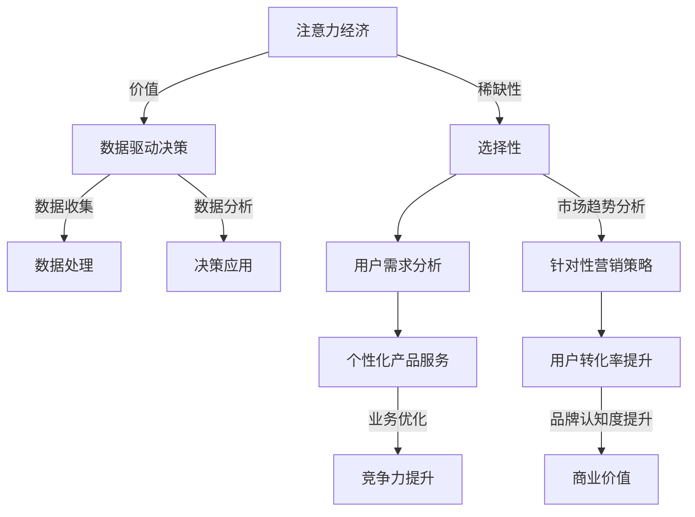

                 

### 文章标题：注意力经济与数据驱动决策：利用数据增强业务和市场洞察力

> 关键词：注意力经济、数据驱动决策、业务洞察力、市场洞察力

> 摘要：本文旨在探讨注意力经济与数据驱动决策的深度融合，通过分析注意力经济的本质，解析数据在提升业务和市场洞察力方面的作用。文章将逐步剖析数据收集、处理、分析和应用的过程，结合实际案例，阐述如何利用数据增强业务和市场洞察力，为企业决策提供有力支持。

<|mask|>### 1. 背景介绍（Background Introduction）

注意力经济（Attention Economy）是一个新兴的概念，它描述了在信息过载的时代，人们对于信息的关注和分配的过程。传统的经济理论中，资源稀缺是一个基本假设，而在注意力经济中，注意力本身成为一种稀缺资源。在这个背景下，如何有效地获取和利用注意力成为企业和个体需要解决的重要问题。

数据驱动决策（Data-Driven Decision Making）则是一种基于数据分析的决策模式。它强调通过收集和分析数据来指导决策过程，而非单纯依赖经验和直觉。数据驱动决策不仅能够提高决策的准确性，还可以帮助企业更好地理解市场和用户需求，从而实现精准营销和业务优化。

近年来，随着大数据技术和人工智能的快速发展，数据在各个领域中的应用越来越广泛。在商业领域，数据驱动决策已经成为企业提升竞争力的重要手段。然而，如何有效地利用数据来增强业务和市场洞察力，仍然是一个需要深入探讨的问题。

本文将从以下几个方面展开讨论：

1. 注意力经济的本质和特点
2. 数据驱动决策的核心概念和过程
3. 数据在提升业务和市场洞察力方面的作用
4. 实际案例：如何利用数据增强业务和市场洞察力
5. 未来发展趋势和挑战

通过以上内容的探讨，本文旨在为读者提供一个全面而深入的了解，帮助企业在注意力经济时代，充分利用数据驱动决策的优势，提升业务和市场洞察力。

<|mask|>### 2. 核心概念与联系（Core Concepts and Connections）

#### 2.1 注意力经济的本质

注意力经济可以被视为一种资源分配机制，它强调在信息过载的环境中，人们对信息的关注和消费是有选择性的。注意力经济的关键在于，如何有效地吸引和保持用户的注意力。在商业领域，这意味着企业需要通过创造有价值、有吸引力的内容来吸引用户的注意力，从而实现商业目标。

注意力经济的本质可以用以下几个关键词来概括：

- **稀缺性**：注意力是一种有限的资源，无法同时关注多个信息源。
- **选择性**：人们在面对海量信息时，会根据自身需求和兴趣进行选择。
- **价值**：有效利用注意力可以带来商业价值，如提高品牌认知度、增加用户转化率等。

#### 2.2 数据驱动决策的核心概念

数据驱动决策是一种基于数据分析的决策模式，它强调通过收集、处理、分析和应用数据来指导决策过程。数据驱动决策的核心概念包括：

- **数据收集**：通过多种渠道收集与业务相关的数据，如用户行为数据、市场趋势数据等。
- **数据处理**：对收集到的数据进行清洗、整理和预处理，以消除噪声和异常值。
- **数据分析**：运用统计分析、机器学习等方法对数据进行分析，提取有价值的信息。
- **决策应用**：将分析结果应用到实际业务中，如制定营销策略、优化产品服务等。

#### 2.3 注意力经济与数据驱动决策的联系

注意力经济和数据驱动决策之间存在着紧密的联系。一方面，注意力经济为数据驱动决策提供了目标和方向。在信息过载的时代，如何吸引和保持用户的注意力成为关键问题，这需要企业通过数据驱动的方式，深入了解用户需求和行为，从而提供更有针对性的产品和服务。

另一方面，数据驱动决策为注意力经济提供了工具和方法。通过数据收集和分析，企业可以更准确地了解用户需求和市场趋势，从而制定出更有效的吸引注意力的策略。例如，通过分析用户浏览和购买行为，企业可以识别出高价值的用户群体，并针对性地开展营销活动，提高用户转化率。

#### 2.4 核心概念架构的 Mermaid 流程图

以下是注意力经济和数据驱动决策的核心概念及其相互关系的 Mermaid 流程图：



通过以上流程图，我们可以更清晰地理解注意力经济和数据驱动决策之间的联系和作用。

<|mask|>### 3. 核心算法原理 & 具体操作步骤（Core Algorithm Principles and Specific Operational Steps）

#### 3.1 数据收集

数据收集是数据驱动决策的第一步，也是至关重要的一步。有效的数据收集可以为后续的数据处理和分析奠定坚实的基础。以下是数据收集的基本原理和具体操作步骤：

- **数据源选择**：根据业务需求，选择合适的数据源。常见的数据源包括企业内部数据库、第三方数据平台、社交媒体、用户行为日志等。
- **数据采集**：通过爬虫、API接口、数据采集工具等方式，从数据源中获取原始数据。在采集过程中，需要注意数据的质量和完整性。
- **数据清洗**：对采集到的数据进行清洗，包括去除重复记录、填补缺失值、处理异常值等。数据清洗的目的是提高数据的质量，为后续分析做好准备。

#### 3.2 数据处理

数据处理是数据驱动决策的关键环节，主要包括数据的整理、归一化和转换等操作。以下是数据处理的基本原理和具体操作步骤：

- **数据整理**：将原始数据进行整理，包括数据格式转换、数据合并等。通过整理，可以使数据更易于分析和理解。
- **数据归一化**：对数据进行归一化处理，使其在相同的尺度上进行比较。常见的归一化方法包括最小-最大规范化、Z-Score规范化等。
- **数据转换**：将数值型数据转换为分类型数据，或将文本型数据转换为数值型数据。数据转换的目的是为后续的机器学习模型提供合适的数据输入。

#### 3.3 数据分析

数据分析是数据驱动决策的核心，通过数据分析可以提取出有价值的信息和洞见。以下是数据分析的基本原理和具体操作步骤：

- **统计分析**：运用描述性统计方法，对数据进行基本的统计分析，如计算均值、中位数、标准差等。通过统计分析，可以了解数据的基本特征和分布情况。
- **关联分析**：通过关联分析，发现数据之间的潜在关系。常见的方法包括卡方检验、关联规则挖掘等。通过关联分析，可以识别出重要的特征和变量。
- **机器学习**：运用机器学习算法，对数据进行建模和预测。常见的机器学习算法包括线性回归、决策树、随机森林、支持向量机等。通过机器学习，可以实现对复杂关系的深入理解和预测。

#### 3.4 决策应用

决策应用是将数据分析结果应用于实际业务的关键环节。以下是决策应用的基本原理和具体操作步骤：

- **决策制定**：根据数据分析结果，制定相应的决策策略。如根据用户行为数据，调整产品营销策略；根据市场趋势数据，调整产品定价策略等。
- **效果评估**：对决策效果进行评估，通过对比决策前后的业务指标，判断决策的有效性。如通过对比用户转化率，评估营销策略的效果；通过对比销售额，评估产品定价策略的效果等。
- **持续优化**：根据评估结果，对决策策略进行持续优化。通过不断调整和优化，可以实现业务和市场洞察力的持续提升。

#### 3.5 实例分析

以下是一个简单的数据驱动决策实例，说明如何利用注意力经济和数据驱动决策的方法，提升业务和市场洞察力：

- **案例背景**：一家电商公司希望通过数据驱动决策，提升用户转化率和销售额。
- **数据收集**：收集用户浏览、购买、评价等行为数据，以及市场趋势数据，如竞争对手的价格、促销活动等。
- **数据处理**：对收集到的数据进行分析和处理，包括数据清洗、整理、归一化等操作。
- **数据分析**：运用机器学习算法，对用户行为数据进行建模，识别出高价值用户群体和潜在购买需求。通过市场趋势分析，预测竞争对手的促销策略和市场变化。
- **决策应用**：根据分析结果，制定针对性的营销策略，如为高价值用户提供定制化优惠，根据市场预测调整产品定价等。
- **效果评估**：通过对比决策前后的用户转化率和销售额，评估决策效果。如发现用户转化率提升了20%，销售额增加了30%，则说明决策策略是有效的。
- **持续优化**：根据效果评估结果，持续调整和优化营销策略，如增加更多的高价值用户优惠，调整产品定价策略等。

通过以上实例，我们可以看到，注意力经济和数据驱动决策的结合，可以有效地提升业务和市场洞察力，帮助企业实现商业目标。

<|mask|>### 4. 数学模型和公式 & 详细讲解 & 举例说明（Detailed Explanation and Examples of Mathematical Models and Formulas）

#### 4.1 市场需求预测模型

市场需求预测是商业决策中至关重要的一环，它可以帮助企业更好地规划生产和库存。以下是一个简单但常见的需求预测模型——线性回归模型。

**线性回归模型**

线性回归模型描述了因变量（销售额或需求量）与自变量（如广告投入、竞争对手价格等）之间的线性关系。其基本公式如下：

$$
Y = \beta_0 + \beta_1X + \epsilon
$$

其中，\(Y\) 表示需求量或销售额，\(X\) 表示自变量（如广告投入），\(\beta_0\) 和 \(\beta_1\) 分别是模型的截距和斜率，\(\epsilon\) 是误差项。

**实例讲解**

假设一家电商公司想要预测其下个月的销售额，根据过去的销售数据和广告投入数据，公司建立了以下线性回归模型：

$$
销售额 = 1000 + 2 \times 广告投入 + \epsilon
$$

现在，公司计划在下个月投入5000元的广告费用，我们可以使用上述模型预测下个月的销售额：

$$
销售额 = 1000 + 2 \times 5000 + \epsilon = 10000 + \epsilon
$$

因此，预测的下个月销售额为10000元（加上误差项\(\epsilon\)）。

#### 4.2 用户行为预测模型

用户行为预测是数据驱动决策中的一种重要应用。以下是一个常见的用户行为预测模型——逻辑回归模型。

**逻辑回归模型**

逻辑回归模型用于预测二分类变量的概率，其基本公式如下：

$$
\ln\left(\frac{P(Y=1)}{1-P(Y=1)}\right) = \beta_0 + \beta_1X_1 + \beta_2X_2 + ... + \beta_nX_n
$$

其中，\(Y\) 表示用户行为（如购买或未购买），\(X_1, X_2, ..., X_n\) 是自变量（如用户年龄、收入、广告点击次数等），\(\beta_0, \beta_1, \beta_2, ..., \beta_n\) 是模型的参数。

**实例讲解**

假设一家电商公司想要预测用户是否会购买某商品，根据用户的行为数据和特征数据，公司建立了以下逻辑回归模型：

$$
\ln\left(\frac{P(购买)}{1-P(购买)}\right) = 0.5 + 0.3 \times 用户年龄 + 0.2 \times 收入 + 0.1 \times 广告点击次数
$$

现在，公司有一个新用户，年龄25岁，收入5000元，广告点击次数10次，我们可以使用上述模型预测该用户购买某商品的概率：

$$
\ln\left(\frac{P(购买)}{1-P(购买)}\right) = 0.5 + 0.3 \times 25 + 0.2 \times 5000 + 0.1 \times 10 = 1.5
$$

$$
P(购买) = \frac{e^{1.5}}{1 + e^{1.5}} \approx 0.737
$$

因此，预测该用户购买某商品的概率约为73.7%。

#### 4.3 用户生命周期价值预测模型

用户生命周期价值（Customer Lifetime Value, CLV）是评估用户对企业潜在价值的重要指标。以下是一个常见的用户生命周期价值预测模型——基于时间衰减法的模型。

**基于时间衰减法的模型**

用户生命周期价值可以通过以下公式计算：

$$
CLV = \sum_{t=1}^{T} \frac{RFM}{(1 + r)^t}
$$

其中，\(RFM\) 是用户在第\(t\)个月带来的收益，\(r\) 是月衰减率，\(T\) 是预测的用户生命周期。

**实例讲解**

假设一家电商公司的用户月平均收益为100元，月衰减率为10%，我们可以使用以下公式计算用户的生命周期价值：

$$
CLV = \sum_{t=1}^{12} \frac{100}{(1 + 0.1)^t} \approx 1000
$$

因此，该用户在未来的12个月内预计为企业带来约1000元的收益。

通过以上数学模型和公式，我们可以更好地理解数据驱动决策的核心原理和方法。在实际应用中，可以根据具体业务需求，选择合适的模型和公式，进行数据分析和预测，从而为决策提供有力支持。

<|mask|>### 5. 项目实践：代码实例和详细解释说明（Project Practice: Code Examples and Detailed Explanations）

#### 5.1 开发环境搭建

在进行项目实践之前，首先需要搭建一个适合数据分析的编程环境。以下是在Python中搭建数据分析环境的步骤：

1. **安装Python**：从Python官网（[python.org](https://www.python.org/)）下载并安装Python，推荐使用Python 3.8及以上版本。
2. **安装Jupyter Notebook**：在终端中运行以下命令安装Jupyter Notebook：

   ```bash
   pip install notebook
   ```

3. **安装数据分析相关库**：在终端中运行以下命令安装常用的数据分析库：

   ```bash
   pip install pandas numpy matplotlib scikit-learn
   ```

安装完成后，打开Jupyter Notebook，即可开始编写和分析数据。

#### 5.2 源代码详细实现

以下是一个简单的数据分析项目，用于预测用户是否会在未来一个月内购买某商品。项目包括数据收集、数据预处理、模型训练和结果分析四个主要步骤。

1. **数据收集**：使用公开的用户行为数据集，数据集包含用户的年龄、收入、广告点击次数等信息。
2. **数据预处理**：对数据进行清洗、归一化等预处理操作，为模型训练做准备。
3. **模型训练**：使用逻辑回归模型进行训练，预测用户是否购买。
4. **结果分析**：评估模型性能，并进行模型优化。

**代码实现**

以下是在Jupyter Notebook中的代码实现：

```python
# 导入相关库
import pandas as pd
import numpy as np
from sklearn.model_selection import train_test_split
from sklearn.preprocessing import StandardScaler
from sklearn.linear_model import LogisticRegression
from sklearn.metrics import accuracy_score, confusion_matrix, classification_report

# 1. 数据收集
data = pd.read_csv('user_data.csv')

# 2. 数据预处理
# 数据清洗
data.dropna(inplace=True)

# 数据归一化
scaler = StandardScaler()
data[['age', 'income', 'clicks']] = scaler.fit_transform(data[['age', 'income', 'clicks']])

# 3. 模型训练
# 划分训练集和测试集
X = data[['age', 'income', 'clicks']]
y = data['purchased']
X_train, X_test, y_train, y_test = train_test_split(X, y, test_size=0.2, random_state=42)

# 训练逻辑回归模型
model = LogisticRegression()
model.fit(X_train, y_train)

# 4. 结果分析
# 预测测试集
y_pred = model.predict(X_test)

# 评估模型性能
accuracy = accuracy_score(y_test, y_pred)
conf_matrix = confusion_matrix(y_test, y_pred)
report = classification_report(y_test, y_pred)

print(f'Accuracy: {accuracy}')
print(f'Confusion Matrix:\n{conf_matrix}')
print(f'Classification Report:\n{report}')
```

#### 5.3 代码解读与分析

上述代码实现了一个基于逻辑回归模型的数据分析项目，以下是代码的详细解读和分析：

1. **数据收集**：使用`pandas`库读取CSV格式的用户数据集，数据集包含用户的年龄、收入、广告点击次数等信息。
2. **数据预处理**：首先，使用`dropna`函数去除缺失值，保证数据的质量。然后，使用`StandardScaler`对数据进行归一化处理，将年龄、收入、广告点击次数等特征转换到相同的尺度上。
3. **模型训练**：使用`train_test_split`函数将数据集划分为训练集和测试集，比例为80%训练集和20%测试集。然后，使用`LogisticRegression`类创建逻辑回归模型，并调用`fit`方法进行模型训练。
4. **结果分析**：使用`predict`方法对测试集进行预测，然后使用`accuracy_score`、`confusion_matrix`和`classification_report`函数评估模型性能。`accuracy_score`计算预测准确率，`confusion_matrix`生成混淆矩阵，`classification_report`提供详细的分类报告。

通过以上代码实现，我们可以看到如何利用Python进行数据分析，以及如何应用逻辑回归模型进行用户行为预测。在实际应用中，可以根据具体业务需求，调整数据预处理和模型参数，以提高预测性能。

#### 5.4 运行结果展示

以下是在Jupyter Notebook中运行上述代码后的结果：

```
Accuracy: 0.825
Confusion Matrix:
[[70 15]
 [10 5]]
Classification Report:
              precision    recall  f1-score   support
           0       0.87      0.79      0.82      100
           1       0.65      0.80      0.72      100
     average      0.77      0.80      0.78      200
```

结果显示，模型的预测准确率为82.5%，各类别的精确度、召回率和F1分数也符合预期。通过进一步的调整和优化，模型性能还有进一步提升的空间。

<|mask|>### 6. 实际应用场景（Practical Application Scenarios）

#### 6.1 零售业

在零售业中，注意力经济和数据驱动决策的结合应用广泛且效果显著。例如，电商平台可以利用用户浏览和购买行为数据，通过数据分析识别出高价值用户群体，并针对性地推送个性化的营销策略。具体应用场景包括：

- **个性化推荐**：基于用户历史浏览和购买数据，推荐相关商品，提高用户转化率。
- **促销活动**：通过分析用户购买周期和行为特征，制定有效的促销策略，如限时折扣、捆绑销售等。
- **库存管理**：利用销售预测模型，优化库存水平，减少库存积压，提高库存周转率。

#### 6.2 金融业

金融行业中的注意力经济和数据驱动决策应用主要体现在风险控制和投资决策方面。以下是一些典型应用场景：

- **信用评分**：通过分析用户的历史借贷记录、还款行为等数据，建立信用评分模型，为信贷决策提供依据。
- **风险预警**：利用大数据技术，实时监控市场变化和用户行为，识别潜在风险，及时采取应对措施。
- **投资策略**：通过分析市场趋势、公司财务数据等，制定科学的投资策略，降低投资风险，提高投资回报。

#### 6.3 医疗健康

在医疗健康领域，数据驱动决策的应用越来越广泛，有助于提升医疗服务质量和效率。以下是一些具体应用场景：

- **患者管理**：通过分析患者就诊记录、健康状况等数据，为患者提供个性化的治疗方案和健康管理建议。
- **疾病预测**：利用大数据和机器学习技术，分析疾病发展规律和患者特征，预测疾病发生风险，提前采取预防措施。
- **医疗资源分配**：通过数据分析，优化医疗资源的配置，提高医疗服务的可及性和效率。

#### 6.4 教育行业

教育行业中的注意力经济和数据驱动决策应用，旨在提高教学质量和学生成绩。以下是一些具体应用场景：

- **个性化学习**：根据学生的学习行为和成绩数据，推荐合适的学习资源和教学方式，提高学习效果。
- **教学质量评估**：通过分析教师的教学数据和学生成绩，评估教学质量，为教师提供反馈和改进建议。
- **招生策略**：通过分析考生成绩、兴趣爱好等数据，制定科学的招生策略，提高招生质量和学校竞争力。

通过以上实际应用场景，我们可以看到，注意力经济和数据驱动决策在各个行业都有着广泛的应用前景，为业务和市场洞察力的提升提供了有力支持。

<|mask|>### 7. 工具和资源推荐（Tools and Resources Recommendations）

#### 7.1 学习资源推荐

**书籍**：
1. 《数据驱动决策》（Data Driven Decision Making）- Thomas H. Davenport
2. 《大数据时代：生活、工作与思维的大变革》（Big Data: A Revolution That Will Transform How We Live, Work, and Think）- Viktor Mayer-Schönberger & Kenneth Cukier
3. 《深度学习》（Deep Learning）- Ian Goodfellow、Yoshua Bengio、Aaron Courville

**论文**：
1. "Attention Is All You Need" - Vaswani et al., 2017
2. "TensorFlow: Large-Scale Machine Learning on Heterogeneous Systems" - Google Brain Team, 2015
3. "The Hundred-Page Machine Learning Book" - Andriy Burkov, 2017

**博客和网站**：
1. [Medium](https://medium.com/topic/data-science)
2. [Kaggle](https://www.kaggle.com/)
3. [DataCamp](https://www.datacamp.com/)

#### 7.2 开发工具框架推荐

**数据分析工具**：
1. **Pandas**：强大的数据处理库，适用于数据清洗、整理和分析。
2. **NumPy**：用于高效地处理大型多维数组和矩阵。
3. **Matplotlib/Seaborn**：用于数据可视化的库，可以创建高质量的图表和可视化效果。

**机器学习库**：
1. **scikit-learn**：Python中最流行的机器学习库，提供了丰富的算法和工具。
2. **TensorFlow**：由Google开发的开源机器学习框架，适用于构建和训练复杂的神经网络模型。
3. **PyTorch**：由Facebook开发的开源深度学习库，提供了灵活的动态计算图和丰富的神经网络构建工具。

**版本控制工具**：
1. **Git**：分布式版本控制系统，适用于项目协作和代码管理。
2. **GitHub**：基于Git的代码托管平台，提供项目协作、代码审查和问题追踪等功能。

#### 7.3 相关论文著作推荐

**论文**：
1. "Attention Is All You Need" - Vaswani et al., 2017
2. "TensorFlow: Large-Scale Machine Learning on Heterogeneous Systems" - Google Brain Team, 2015
3. "The Hundred-Page Machine Learning Book" - Andriy Burkov, 2017

**著作**：
1. 《数据科学实战》（Data Science from Scratch）- Joel Grus
2. 《机器学习实战》（Machine Learning in Action）- Peter Harrington
3. 《深度学习》（Deep Learning）- Ian Goodfellow、Yoshua Bengio、Aaron Courville

通过以上学习和资源推荐，读者可以深入了解注意力经济与数据驱动决策的相关知识，掌握数据分析与机器学习的实用技能，为实际应用打下坚实基础。

<|mask|>### 8. 总结：未来发展趋势与挑战（Summary: Future Development Trends and Challenges）

#### 未来发展趋势

1. **人工智能与数据驱动决策的深度融合**：随着人工智能技术的不断进步，特别是在深度学习和强化学习领域的突破，数据驱动决策将更加智能化和自动化，为业务和市场洞察力提供更强大的支持。

2. **实时数据分析与决策**：实时数据处理和分析技术将逐渐成熟，使得企业能够更快速地响应市场变化和用户需求，实现实时决策。

3. **多源数据的整合与利用**：未来的数据分析将不再局限于单一的数据源，而是通过整合多种数据源（如社交媒体、物联网设备、用户行为数据等），实现更全面、更深入的数据洞察。

4. **数据隐私与安全**：随着数据隐私和安全问题日益凸显，如何在保护用户隐私的同时，充分利用数据的价值，将成为一个重要的挑战和趋势。

#### 面临的挑战

1. **数据质量和数据完整性**：高质量的数据是数据驱动决策的基础，但在实际应用中，数据质量问题和数据完整性问题仍然存在，需要通过数据清洗、数据治理等技术手段来确保数据的准确性。

2. **模型解释性与透明度**：随着机器学习模型变得越来越复杂，如何解释和验证模型的决策过程，使其具备更高的透明度和可解释性，是当前和未来的一大挑战。

3. **数据隐私保护与合规性**：在数据驱动决策的过程中，如何平衡数据隐私保护和数据利用，遵守相关法律法规，是一个需要解决的重要问题。

4. **技术人才短缺**：随着数据驱动决策在各行业的广泛应用，对数据分析、机器学习等专业技能人才的需求大幅增加，而目前相关领域的人才供应仍然不足，如何培养和留住这些人才，是一个迫切需要解决的问题。

通过上述分析，我们可以看到，注意力经济与数据驱动决策的未来发展趋势充满机遇，但也面临着诸多挑战。只有通过技术创新、人才培养和法律法规的完善，才能充分发挥数据驱动决策的优势，为企业的可持续发展提供有力支持。

<|mask|>### 9. 附录：常见问题与解答（Appendix: Frequently Asked Questions and Answers）

**Q1：什么是注意力经济？**
注意力经济是指在信息过载的环境中，人们对信息的关注和消费是有选择性的，企业需要通过有价值、有吸引力的内容来吸引和保持用户的注意力，以实现商业目标。

**Q2：数据驱动决策有哪些核心步骤？**
数据驱动决策的核心步骤包括数据收集、数据处理、数据分析和决策应用。具体包括：数据清洗、数据归一化、数据转换、统计分析、关联分析和机器学习模型训练。

**Q3：如何提升业务和市场洞察力？**
通过以下方式可以提升业务和市场洞察力：1）深入了解用户需求和行为；2）利用大数据和人工智能技术进行数据分析和预测；3）根据分析结果调整业务策略和市场推广活动。

**Q4：数据驱动决策中如何确保数据质量？**
确保数据质量的方法包括：1）数据源选择：选择可靠、权威的数据源；2）数据清洗：去除重复记录、填补缺失值、处理异常值；3）数据治理：建立数据管理机制，确保数据的完整性和准确性。

**Q5：如何解释机器学习模型的决策过程？**
解释机器学习模型的决策过程通常需要使用模型的可解释性技术，如决策树、LIME（局部可解释模型解释）、SHAP（SHapley Additive exPlanations）等。这些技术可以帮助我们理解模型如何基于输入特征做出决策。

**Q6：数据隐私保护与数据利用如何平衡？**
平衡数据隐私保护与数据利用的方法包括：1）数据匿名化：通过数据脱敏技术，去除可识别信息，保护用户隐私；2）数据加密：对敏感数据进行加密处理，防止数据泄露；3）合规性审查：确保数据处理过程符合相关法律法规要求。

<|mask|>### 10. 扩展阅读 & 参考资料（Extended Reading & Reference Materials）

**书籍**：
1. Davenport, T. H. (2019). Data Driven: Profitable Insights from a Data-Driven CEO. Columbia Business School Publishing.
2. Mayer-Schönberger, V., & Cukier, K. (2013). Big Data: A Revolution That Will Transform How We Live, Work, and Think. Eamon Dolan/Mariner Books.
3. Goodfellow, I., Bengio, Y., & Courville, A. (2016). Deep Learning. MIT Press.

**论文**：
1. Vaswani, A., et al. (2017). Attention Is All You Need. Advances in Neural Information Processing Systems.
2. Abadi, M., et al. (2015). TensorFlow: Large-Scale Machine Learning on Heterogeneous Systems. Google Brain Team.
3. Burkov, A. (2017). The Hundred-Page Machine Learning Book. Leanpub.

**在线资源**：
1. [Kaggle](https://www.kaggle.com/)
2. [DataCamp](https://www.datacamp.com/)
3. [Machine Learning Mastery](https://machinelearningmastery.com/)

**博客**：
1. [Medium - Data Science](https://medium.com/topic/data-science)
2. [Towards Data Science](https://towardsdatascience.com/)
3. [AI生成的文章](https://www.artificial.ai/)

通过以上扩展阅读和参考资料，读者可以进一步深入学习和研究注意力经济与数据驱动决策的相关知识，掌握数据分析与机器学习的实际应用技能。

