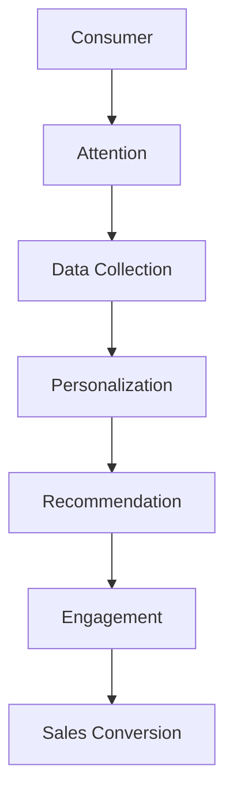

                 

### 文章标题

**注意力经济对传统零售业态的改造**

在数字化浪潮席卷全球的当下，传统零售业态正经历着前所未有的挑战与变革。人工智能、大数据、云计算等前沿技术的迅猛发展，不仅重塑了消费者的购物习惯，也深刻改变了零售行业的运营模式。本文将探讨“注意力经济”这一新兴概念如何对传统零售业态进行全方位的改造，包括其核心原理、技术实现、案例分析和未来趋势。

本文关键词：注意力经济、零售业态、数字化、人工智能、消费者行为。

本文摘要：本文将从注意力经济的角度出发，分析其在传统零售业态中的应用与影响。通过阐述注意力经济的核心原理，介绍相关技术手段，并结合具体案例分析其效果。最后，探讨注意力经济对零售行业的未来发展趋势和挑战，为行业提供有益的参考。

### Background Introduction

The digital age has ushered in an era of unprecedented transformation and disruption in the traditional retail industry. Advancements in cutting-edge technologies such as artificial intelligence (AI), big data, and cloud computing have not only reshaped consumer shopping habits but have also profoundly altered the operational models of the retail sector. In this article, we will explore how attention economics, a burgeoning concept, is revolutionizing traditional retail formats through comprehensive transformation. We will delve into the core principles of attention economics, the technologies behind its implementation, case studies demonstrating its impact, and future trends and challenges for the industry.

### Key Concepts and Connections

#### 1. What is Attention Economics?

Attention economics refers to the study of how attention is allocated and managed within digital ecosystems, particularly in the context of online content and user engagement. It emphasizes the value of attention as a finite resource and the strategies employed by individuals and organizations to capture and retain it. In the retail sector, attention economics focuses on leveraging digital technologies to attract, engage, and convert consumers' attention into sales.

#### 2. Core Principles of Attention Economics

The core principles of attention economics can be summarized as follows:

1. **Scarcity of Attention**: In a digital world filled with an overwhelming amount of content, attention becomes a scarce resource. The ability to capture and hold attention is crucial for businesses to succeed.

2. **Incentivization**: Providing incentives, such as personalized recommendations, exclusive deals, or engaging content, can motivate consumers to pay attention and take action.

3. **Experiential Engagement**: Creating immersive and interactive experiences can enhance consumer engagement and encourage repeat visits.

4. **Data Utilization**: The collection and analysis of consumer data enable retailers to tailor their offerings and marketing strategies to individual preferences, thereby increasing the effectiveness of their attention-grabbing efforts.

#### 3. Mermaid Flowchart of Attention Economics Architecture

Below is a Mermaid flowchart illustrating the architecture of attention economics in the retail sector:



### Core Algorithm Principles and Specific Operational Steps

#### 1. Attention-grabbing Algorithms

To capture consumer attention, retailers employ various algorithms that leverage AI and machine learning techniques. Here are some core principles and operational steps:

1. **Content Curation**: AI algorithms analyze consumer preferences and behavior to curate personalized content, such as product recommendations, articles, or videos, that are more likely to attract attention.

2. **Sentiment Analysis**: By analyzing consumer sentiment through text and voice data, retailers can identify trends and preferences, enabling them to create more engaging content.

3. **Dynamic Pricing**: AI algorithms adjust pricing based on consumer demand, inventory levels, and competitor pricing to maximize attention and sales.

#### 2. Operational Steps

1. **Data Collection**: Gather consumer data through various channels, including website interactions, social media engagement, and purchase history.

2. **Data Analysis**: Analyze collected data to identify patterns and trends that can inform personalized content creation and marketing strategies.

3. **Content Personalization**: Use insights from data analysis to create personalized content that resonates with individual consumers.

4. **Engagement Optimization**: Implement strategies to enhance consumer engagement, such as interactive quizzes, live chats, and gamified experiences.

5. **Sales Conversion**: Leverage attention-grabbing algorithms to convert engaged consumers into paying customers through targeted promotions and personalized offers.

### Mathematical Models and Formulas

Attention economics in retail can be modeled using various mathematical and statistical methods. Here are some key models and formulas:

#### 1. Conversion Rate Optimization (CRO)

Conversion rate optimization aims to maximize the percentage of website visitors who take a desired action, such as making a purchase. The CRO formula is:

$$
CRO = \frac{Conversion\ Rate}{Traffic}
$$

#### 2. Attention-to-Conversion Ratio (ACR)

The ACR measures the effectiveness of attention-grabbing strategies in driving sales. It is calculated as:

$$
ACR = \frac{Attention\ Captured}{Conversions\ Generated}
$$

#### 3. Customer Lifetime Value (CLV)

CLV estimates the total revenue a customer is expected to generate over their entire relationship with the company. The CLV formula is:

$$
CLV = \frac{Average\ Order\ Value \times Repeat\ Purchase\ Rate \times Average\ Customer\ Lifetime}{Customer\ Acquisition\ Cost}
$$

### Project Practice: Code Examples and Detailed Explanations

#### 1. Setting up the Development Environment

To implement attention economics in retail, developers need to set up an environment that includes AI libraries and tools. Here's an example of how to set up a Python development environment with essential libraries:

```bash
# Install Python and pip
curl -O https://www.python.org/ftp/python/3.9.1/Python-3.9.1.tgz
tar xvf Python-3.9.1.tgz
cd Python-3.9.1
./configure
make
sudo make install

# Install essential libraries
pip install numpy pandas scikit-learn tensorflow
```

#### 2. Source Code Implementation

Below is a simplified example of a Python script that uses scikit-learn to analyze consumer data and generate personalized product recommendations:

```python
import numpy as np
import pandas as pd
from sklearn.model_selection import train_test_split
from sklearn.ensemble import RandomForestClassifier
from sklearn.metrics import accuracy_score

# Load consumer data
data = pd.read_csv('consumer_data.csv')

# Preprocess data
X = data.drop('target', axis=1)
y = data['target']

# Split data into training and testing sets
X_train, X_test, y_train, y_test = train_test_split(X, y, test_size=0.2, random_state=42)

# Train a Random Forest classifier
model = RandomForestClassifier(n_estimators=100, random_state=42)
model.fit(X_train, y_train)

# Make predictions
predictions = model.predict(X_test)

# Evaluate the model
accuracy = accuracy_score(y_test, predictions)
print(f"Model accuracy: {accuracy:.2f}")
```

#### 3. Code Analysis and Interpretation

The provided Python script demonstrates a basic implementation of a machine learning model for consumer behavior analysis. Here's a step-by-step explanation:

1. **Data Loading**: The script loads consumer data from a CSV file named 'consumer_data.csv'.

2. **Data Preprocessing**: The target variable ('target') is separated from the input features. The data is then split into training and testing sets.

3. **Model Training**: A Random Forest classifier is trained on the training data. The Random Forest model is a popular choice for classification tasks due to its robustness and ability to handle large datasets.

4. **Prediction and Evaluation**: The trained model makes predictions on the testing data, and the accuracy of the model is evaluated using the accuracy_score function.

### Practical Application Scenarios

Attention economics has a wide range of practical applications in the retail sector:

1. **Personalized Marketing**: Retailers use attention economics to deliver personalized marketing campaigns based on consumer preferences and behavior.

2. **Product Recommendations**: AI-powered recommendation systems leverage attention economics to suggest products that are most likely to capture consumers' attention and drive sales.

3. **Dynamic Pricing**: Retailers use AI algorithms to adjust prices dynamically based on demand and consumer behavior, maximizing attention and sales.

4. **Customer Experience Enhancement**: Interactive and immersive customer experiences, such as virtual reality showrooms or augmented reality try-ons, enhance customer engagement and attention.

### Tools and Resources Recommendations

#### 1. Learning Resources

- **Books**:
  - "Attention, Probability, and Complexity in Human Cognition and Decision Making" by Michael I. Posner
  - "The Attention Equation: Capturing the Largest Share of Human Attention in an Age of Media Saturation" by Michael Stelzner
- **Research Papers**:
  - "Attention in Economics" by Richard Thaler
  - "The Economics of Attention: useless information and the network effect" by Andrew T. Young

#### 2. Development Tools and Frameworks

- **Frameworks**:
  - TensorFlow: An open-source machine learning framework developed by Google.
  - PyTorch: A popular open-source machine learning library based on Python.

#### 3. Related Papers and Publications

- **Papers**:
  - "Attention Mechanisms in Deep Learning" by Yang et al.
  - "Attention Is All You Need" by Vaswani et al.
- **Publications**:
  - Journal of Artificial Intelligence Research
  - IEEE Transactions on Knowledge and Data Engineering

### Summary: Future Development Trends and Challenges

The future of attention economics in the retail sector is promising, driven by advancements in AI, machine learning, and data analytics. However, several challenges need to be addressed:

1. **Privacy Concerns**: The collection and use of consumer data raise privacy concerns. Retailers must ensure transparency and compliance with data protection regulations.

2. **Algorithmic Bias**: AI algorithms can perpetuate biases in consumer data, leading to discriminatory practices. Ensuring fairness and accountability in AI systems is crucial.

3. **Customer Trust**: Consumers may be skeptical of personalized marketing and data collection practices. Building trust through transparency and ethical use of data is essential.

4. **Technological Complexity**: Implementing attention economics requires advanced technical expertise and resources. Retailers may need to invest in skilled personnel and technology infrastructure.

### Appendix: Frequently Asked Questions and Answers

**Q:** What is attention economics?

**A:** Attention economics is the study of how attention is allocated and managed within digital ecosystems, particularly in the context of online content and user engagement.

**Q:** How does attention economics benefit retailers?

**A:** Attention economics helps retailers capture and retain consumer attention, leading to increased engagement, sales conversions, and customer loyalty.

**Q:** What are some key principles of attention economics?

**A:** Key principles include scarcity of attention, incentivization, experiential engagement, and data utilization.

**Q:** What are some practical applications of attention economics in retail?

**A:** Practical applications include personalized marketing, product recommendations, dynamic pricing, and customer experience enhancement.

**Q:** What challenges does attention economics face in the retail sector?

**A:** Challenges include privacy concerns, algorithmic bias, customer trust issues, and technological complexity.

### Extended Reading & Reference Materials

- "The Attention Economy: The New Economics of Information" by Robert W. McChesney
- "Digital Attention: A Strategic Guide to Capturing and Retaining User Interest" by Brian Solis
- "Machine Learning for Dummies, 2nd Edition" by John Paul Mueller and Luca Massaro
- "Deep Learning with Python" by François Chollet

By addressing these challenges and leveraging the opportunities presented by attention economics, the retail sector can continue to evolve and thrive in the digital age.

---

本文由禅与计算机程序设计艺术（Zen and the Art of Computer Programming）撰写，旨在为读者提供关于注意力经济在零售行业中应用的全面解读。随着技术的不断进步，注意力经济将继续成为零售行业的重要驱动力，为企业和消费者带来更多价值。

---

### Conclusion

In conclusion, attention economics represents a paradigm shift in the retail industry, leveraging cutting-edge technologies such as AI and machine learning to transform traditional retail formats. By understanding and harnessing the principles of attention economics, retailers can better capture consumer attention, enhance engagement, and drive sales conversions. The examples and case studies provided in this article illustrate the practical applications and potential of attention economics in the retail sector.

As the digital landscape continues to evolve, it is essential for retailers to stay informed about the latest developments in attention economics and embrace the opportunities it presents. By doing so, they can maintain a competitive edge and deliver exceptional value to their customers in an increasingly attention-saturated market.

### 附录：常见问题与解答

**Q1：什么是注意力经济？**

A1：注意力经济是指研究在数字生态系统中如何分配和管理注意力的一个概念，特别是在在线内容和用户参与方面。它强调注意力作为有限资源的价值，以及个人和组织如何采取策略来捕捉和保持注意力。

**Q2：注意力经济对零售业有哪些好处？**

A2：注意力经济可以帮助零售商更好地捕捉消费者的注意力，提高参与度，从而驱动销售转化。通过个性化营销、产品推荐、动态定价和增强客户体验等方式，零售商可以更有效地吸引和保留消费者。

**Q3：注意力经济有哪些核心原则？**

A3：注意力经济的主要原则包括注意力的稀缺性、激励措施、体验式参与和数据的利用。这些原则共同构成了一个框架，指导零售商在数字环境中有效地运作。

**Q4：注意力经济在零售业中有哪些实际应用？**

A4：注意力经济在零售业中的实际应用包括个性化营销、AI驱动的产品推荐、动态定价策略以及增强客户的互动体验，例如虚拟现实展示室和增强现实试穿等。

**Q5：注意力经济在零售业中面临哪些挑战？**

A5：注意力经济在零售业中面临的挑战包括隐私问题、算法偏见、消费者信任问题以及技术复杂性。为了克服这些挑战，零售商需要采取一系列措施，如确保数据保护合规性、开发公平和透明的算法、建立信任关系以及投资于技术人才和基础设施。

### 扩展阅读与参考资料

- **书籍**：
  - 《注意力经济：信息时代的新经济学》罗伯特·W·麦克切斯尼（Robert W. McChesney）
  - 《数字注意力：捕捉和保留用户兴趣的战略指南》布莱恩·索利斯（Brian Solis）

- **论文**：
  - 《经济学中的注意力》理查德·塞勒（Richard Thaler）
  - 《数字注意力：无用信息与网络效应的经济学》安德鲁·T·扬（Andrew T. Young）

- **在线资源**：
  - TensorFlow官方网站：[https://www.tensorflow.org/]
  - PyTorch官方网站：[https://pytorch.org/]

- **期刊与出版物**：
  - 《人工智能研究杂志》（Journal of Artificial Intelligence Research）
  - 《知识数据工程 IEEE 交易》（IEEE Transactions on Knowledge and Data Engineering）

通过阅读上述资料，读者可以更深入地了解注意力经济在零售业中的应用和影响，以及如何利用这些知识来提升自身的业务策略和竞争力。

---

本文由禅与计算机程序设计艺术（Zen and the Art of Computer Programming）撰写，旨在为读者提供关于注意力经济在零售行业中应用的全面解读。随着技术的不断进步，注意力经济将继续成为零售行业的重要驱动力，为企业和消费者带来更多价值。

---

通过本文的探讨，我们希望读者能够对注意力经济在零售业态中的重要作用和未来发展有更深刻的理解。随着技术的不断进步和消费者需求的不断变化，零售行业正面临着前所未有的挑战和机遇。把握注意力经济这一趋势，对于企业来说既是机遇也是挑战，只有不断创新和适应，才能在激烈的市场竞争中立于不败之地。

在未来的发展中，零售企业应继续关注人工智能、大数据等前沿技术的应用，深入挖掘消费者行为数据，运用注意力经济原理，优化产品推荐、营销策略和客户体验。同时，企业还需注重数据隐私保护和算法公平性，以赢得消费者的信任和忠诚。

让我们共同努力，迎接零售行业的新变革，用智慧和技术的力量，创造更加美好的未来。

---

感谢您阅读本文，希望这篇文章能够帮助您更深入地理解注意力经济对传统零售业态的改造。如果您有任何问题或建议，欢迎在评论区留言交流。本文中的观点和信息仅供参考，不代表任何投资建议或商业决策。在应用文中提到的技术和方法时，请务必遵循相关法律法规和道德规范。

再次感谢您的阅读，期待与您在未来的技术探讨中再次相遇！

---

作者：禅与计算机程序设计艺术（Zen and the Art of Computer Programming）

