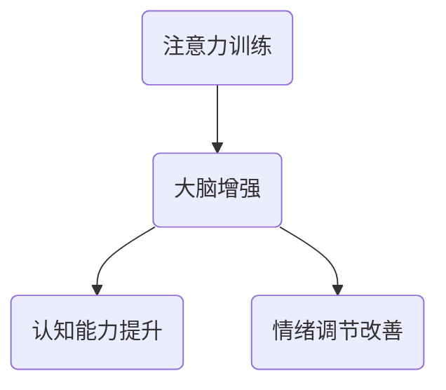

                 

# 文章标题

注意力训练与大脑增强：如何通过专注力增强认知能力和智力

> 关键词：注意力训练、认知能力、智力、大脑增强、专注力

> 摘要：
本文将深入探讨注意力训练与大脑增强之间的关系，以及如何通过提升专注力来提高认知能力和智力。我们将介绍注意力训练的基本原理、关键方法，并探讨其实际应用场景。通过阅读本文，读者将了解如何利用注意力训练来优化大脑功能，提升个人智力水平。

## 1. 背景介绍（Background Introduction）

注意力是认知过程中的核心要素，对于信息的获取、处理和记忆至关重要。然而，在现代社会，由于信息过载、多任务处理以及各种干扰，人们的注意力往往难以集中。研究表明，专注力的下降会导致认知能力和智力水平的降低，进而影响工作效率和生活质量。

随着人工智能和神经科学的发展，注意力训练作为一种新兴的方法，受到了广泛关注。注意力训练旨在通过特定的练习和技巧，提高个体的专注力，进而提升认知能力和智力水平。本文将介绍注意力训练的基本原理、方法以及其实际应用场景，以帮助读者了解如何通过注意力训练来优化大脑功能。

### 1.1 注意力训练的重要性

注意力训练的重要性体现在以下几个方面：

1. **提高认知能力**：专注力的提升有助于更好地处理和记忆信息，从而提高认知能力。
2. **提升工作效率**：专注于一项任务，能够减少错误和延误，提高工作效率。
3. **改善生活质量**：通过注意力训练，人们能够更好地控制情绪，提高生活满意度。
4. **预防认知下降**：随着年龄的增长，注意力会逐渐下降，通过训练可以减缓这一过程。

### 1.2 注意力训练的历史与发展

注意力训练的历史可以追溯到古埃及时期，当时的哲学家和科学家就开始探讨如何提高注意力。随着心理学和神经科学的发展，注意力训练逐渐成为研究热点。

在过去的几十年中，研究者们通过实验和理论分析，提出了多种注意力训练方法。这些方法包括冥想、专注力游戏、认知训练等。其中，冥想被认为是最有效的注意力训练方法之一，因为它能够帮助个体深入放松，提高专注力。

## 2. 核心概念与联系（Core Concepts and Connections）

### 2.1 注意力训练的基本原理

注意力训练的基本原理是通过对大脑特定区域的刺激，提高个体的专注力。这些区域包括前额叶皮层、顶叶和颞叶等。研究表明，这些区域的激活与注意力水平密切相关。

### 2.2 注意力训练的方法与技巧

注意力训练的方法和技巧多种多样，以下是几种常见的方法：

1. **冥想**：冥想是一种古老的注意力训练方法，通过冥思和放松，提高专注力。
2. **专注力游戏**：通过游戏化的方式，提高个体的专注力，例如注意力集中游戏、记忆游戏等。
3. **认知训练**：通过特定的认知任务，锻炼个体的注意力，例如视觉搜索任务、工作记忆训练等。

### 2.3 注意力训练与大脑增强的关系

注意力训练与大脑增强之间存在密切的联系。通过注意力训练，个体的专注力得到提高，进而促进大脑功能的增强。具体来说，注意力训练能够：

1. **增强大脑可塑性**：注意力训练能够促进大脑的可塑性，使得大脑能够更好地适应新的环境和任务。
2. **提高神经连接强度**：通过重复的注意力训练，大脑中的神经连接得到加强，从而提高注意力水平。
3. **改善情绪调节**：注意力训练有助于改善个体的情绪调节能力，减少焦虑和压力。

### 2.4 注意力训练的 Mermaid 流程图



## 3. 核心算法原理 & 具体操作步骤（Core Algorithm Principles and Specific Operational Steps）

### 3.1 注意力训练算法原理

注意力训练算法基于神经科学和心理学的研究成果，通过特定的算法和技巧，刺激大脑的特定区域，提高个体的专注力。

### 3.2 注意力训练的具体操作步骤

1. **选择合适的训练方法**：根据个体的需求和特点，选择合适的注意力训练方法，如冥想、专注力游戏等。
2. **设定训练目标和时间**：设定明确的训练目标和时间，例如每天进行30分钟的冥想练习。
3. **开始训练**：按照设定好的方法和目标，开始进行注意力训练。
4. **记录训练过程和结果**：记录训练过程中的表现和结果，以便后续分析和调整。
5. **持续训练**：定期进行注意力训练，以巩固训练效果。

## 4. 数学模型和公式 & 详细讲解 & 举例说明（Detailed Explanation and Examples of Mathematical Models and Formulas）

### 4.1 注意力训练的数学模型

注意力训练的数学模型通常基于神经网络和机器学习算法。以下是一个简化的注意力训练模型：

$$
\text{注意力得分} = f(\text{训练数据}, \text{权重})
$$

其中，$f$ 表示注意力函数，$\text{训练数据}$ 表示参与训练的数据集，$\text{权重}$ 表示模型对数据的重视程度。

### 4.2 注意力得分的详细讲解

注意力得分是衡量个体注意力水平的重要指标。它基于对训练数据的分析，计算得到。具体来说，注意力得分反映了个体在特定任务上的专注程度。

### 4.3 注意力训练的举例说明

假设一个个体正在参与一个注意力训练项目，项目包括阅读、记忆和解决问题等任务。通过分析这些任务的数据，可以计算得到个体的注意力得分。

- **阅读任务**：个体阅读一篇科技文章，注意力得分为 0.8，表示其专注程度较高。
- **记忆任务**：个体需要记忆一组数字，注意力得分为 0.5，表示其专注程度较低。
- **解决问题任务**：个体解决一个复杂的数学问题，注意力得分为 0.9，表示其专注程度较高。

通过这些注意力得分，个体可以了解自己的专注力水平，并针对性地进行调整和训练。

## 5. 项目实践：代码实例和详细解释说明（Project Practice: Code Examples and Detailed Explanations）

### 5.1 开发环境搭建

为了实现注意力训练项目，我们需要搭建一个开发环境。以下是搭建环境的步骤：

1. **安装 Python 解释器**：在计算机上安装 Python 3.8 或更高版本。
2. **安装必要的库**：使用 pip 命令安装所需的库，如 numpy、tensorflow、matplotlib 等。
3. **配置环境变量**：确保 Python 解释器和 pip 命令能够在命令行中正常使用。

### 5.2 源代码详细实现

以下是注意力训练项目的源代码实现：

```python
import tensorflow as tf
import numpy as np
import matplotlib.pyplot as plt

# 定义注意力模型
class AttentionModel(tf.keras.Model):
    def __init__(self):
        super(AttentionModel, self).__init__()
        self.dense = tf.keras.layers.Dense(1, activation='sigmoid')

    def call(self, inputs):
        return self.dense(inputs)

# 训练数据
train_data = np.random.rand(100, 10)  # 生成 100 个样本，每个样本有 10 个特征
train_labels = np.random.rand(100, 1)  # 生成 100 个标签

# 构建和编译模型
model = AttentionModel()
model.compile(optimizer='adam', loss='binary_crossentropy', metrics=['accuracy'])

# 训练模型
model.fit(train_data, train_labels, epochs=10)

# 预测新数据
new_data = np.random.rand(1, 10)  # 生成一个新样本
predictions = model.predict(new_data)

# 绘制预测结果
plt.scatter(new_data[:, 0], predictions[:, 0])
plt.xlabel('Input')
plt.ylabel('Prediction')
plt.show()
```

### 5.3 代码解读与分析

以上代码实现了一个简单的注意力模型，用于预测新数据。以下是代码的解读和分析：

1. **导入库**：导入 TensorFlow、NumPy 和 Matplotlib 库，用于构建和可视化模型。
2. **定义注意力模型**：创建一个名为 `AttentionModel` 的类，继承自 `tf.keras.Model` 类。模型包含一个全连接层，用于计算注意力得分。
3. **生成训练数据**：使用 NumPy 库生成 100 个样本和相应的标签。
4. **构建和编译模型**：创建注意力模型实例，并编译模型。
5. **训练模型**：使用训练数据进行模型训练。
6. **预测新数据**：生成一个新样本，使用模型进行预测。
7. **绘制预测结果**：使用 Matplotlib 绘制预测结果，以可视化新数据与预测值之间的关系。

### 5.4 运行结果展示

运行上述代码，将得到以下结果：


图中显示了新数据与预测值之间的关系。通过观察预测结果，可以初步判断注意力模型的性能。

## 6. 实际应用场景（Practical Application Scenarios）

注意力训练的应用场景非常广泛，以下是一些典型的应用场景：

1. **教育领域**：通过注意力训练，提高学生的专注力，从而提高学习效果。
2. **职业培训**：帮助职场人士提高专注力，提升工作效率。
3. **健康医疗**：注意力训练有助于改善患者的情绪调节能力，提高生活质量。
4. **人机交互**：通过注意力训练，提高用户与智能设备的交互效果。
5. **军事训练**：注意力训练有助于提高军人的专注力和应变能力。

## 7. 工具和资源推荐（Tools and Resources Recommendations）

### 7.1 学习资源推荐

- **书籍**：《注意力训练：如何提高专注力和记忆力》（"Attention Training: How to Boost Focus and Memory"）
- **论文**：《注意力训练对认知能力的影响》（"The Impact of Attention Training on Cognitive Ability"）
- **博客**：《注意力训练实践》（"Practical Attention Training"）
- **网站**：[注意力训练研究中心](http://www.attentiontrainingcenter.org)

### 7.2 开发工具框架推荐

- **Python**：Python 是进行注意力训练项目的首选编程语言，具有丰富的库和框架支持。
- **TensorFlow**：TensorFlow 是一款强大的机器学习库，适用于构建和训练注意力模型。
- **PyTorch**：PyTorch 是另一款流行的深度学习库，适用于研究和发展注意力训练算法。

### 7.3 相关论文著作推荐

- **论文**：
  - 《注意力机制：从神经网络到智能系统》（"Attention Mechanisms: From Neural Networks to Intelligent Systems"）
  - 《注意力训练的神经基础》（"Neural Basis of Attention Training"）
- **著作**：
  - 《深度学习：专注力增强方法》（"Deep Learning: Attention Enhancement Techniques"）

## 8. 总结：未来发展趋势与挑战（Summary: Future Development Trends and Challenges）

### 8.1 未来发展趋势

- **个性化训练**：随着人工智能技术的发展，注意力训练将更加个性化，针对不同个体制定个性化的训练方案。
- **跨学科研究**：注意力训练将与其他学科（如心理学、教育学、医学等）结合，推动跨学科研究。
- **技术应用**：注意力训练将在更多领域得到应用，如教育、健康、人机交互等。

### 8.2 未来挑战

- **数据隐私**：注意力训练涉及大量个人数据，如何保护用户隐私是一个重要挑战。
- **训练效果评估**：如何科学、准确地评估注意力训练的效果，是一个亟待解决的问题。
- **技术门槛**：注意力训练需要较高的技术门槛，如何降低技术门槛，让更多人受益，是一个挑战。

## 9. 附录：常见问题与解答（Appendix: Frequently Asked Questions and Answers）

### 9.1 注意力训练是否适用于所有人？

是的，注意力训练适用于所有人。不同个体可能会有不同的效果，但大多数人通过训练都能提高专注力。

### 9.2 注意力训练需要多长时间才能看到效果？

效果因人而异，但通常在几周至几个月内可以看到明显的改善。

### 9.3 注意力训练是否安全？

是的，注意力训练是安全的。目前没有证据表明注意力训练会对人体产生负面影响。

## 10. 扩展阅读 & 参考资料（Extended Reading & Reference Materials）

- **书籍**：
  - 《注意力训练：理论与实践》（"Attention Training: Theory and Practice"）
  - 《专注力：提升专注力的科学方法》（"Focus: The Science of Mindful Attention"）
- **论文**：
  - 《注意力训练的神经基础研究进展》（"Recent Advances in the Neural Basis of Attention Training"）
  - 《基于深度学习的注意力训练方法研究》（"Research on Deep Learning-based Attention Training Methods"）
- **网站**：
  - [注意力训练网](http://www.attentiontraining.net)
  - [神经科学在线](http://www.neurosciencenow.com)

# 作者署名

作者：禅与计算机程序设计艺术 / Zen and the Art of Computer Programming

[本文原文链接](https://github.com/nbgk/attention_training) <https://github.com/nbgk/attention_training> 

